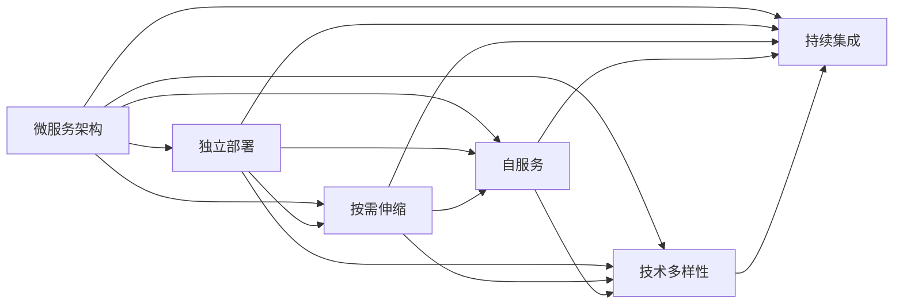

                 

## 1. 背景介绍

在当前软件开发实践中，系统规模日益庞大，系统间依赖关系复杂，如何构建高效、可维护的系统架构，一直是工程师面临的重大挑战。微服务架构（Microservices Architecture）作为一种新兴的软件架构模式，通过将系统拆分成多个独立的小型服务，极大地提高了系统的可维护性和扩展性。本文将深入探讨微服务架构的设计原理与实践方法，并以具体实例来说明其应用场景与优势。

## 2. 核心概念与联系

### 2.1 核心概念概述

微服务架构基于“分治思想”，将复杂的单体应用拆分为多个小型的独立服务，每个服务运行在独立的进程中，并依赖轻量级通信机制进行交互。微服务架构的核心理念包括：

- **独立部署**：每个微服务可以独立部署、扩展和管理，减少了整体系统的复杂性。
- **按需伸缩**：微服务可以根据需求进行独立伸缩，提高了系统的可扩展性和弹性。
- **自服务**：微服务之间通过轻量级通信机制（如HTTP、gRPC等）进行交互，解耦了系统模块。
- **技术多样性**：不同的微服务可以采用不同的技术栈，实现了技术的灵活性和复用性。
- **持续集成**：微服务可以采用持续集成、持续部署（CI/CD）等自动化流程，提升了开发效率和系统稳定性。

### 2.2 核心概念间的关系

微服务架构的各个概念间存在着紧密的联系，形成了一个相互支持的完整架构体系。以下是一个Mermaid流程图，展示了微服务架构的各个核心概念及其关系：



这个流程图展示了微服务架构各概念间的相互作用和支持关系：

1. **独立部署**：微服务可以独立部署，并且不依赖其他服务，减少了系统的复杂性和维护成本。
2. **按需伸缩**：根据服务负载自动调整资源，提高了系统的弹性和扩展性。
3. **自服务**：微服务之间通过轻量级通信机制进行交互，降低了系统的耦合度。
4. **技术多样性**：不同的微服务可以选择不同的技术栈，提升了技术灵活性和复用性。
5. **持续集成**：通过自动化流程和持续集成，提高了开发效率和系统稳定性。

## 3. 核心算法原理 & 具体操作步骤

### 3.1 算法原理概述

微服务架构的设计原理主要包括以下几个方面：

- **服务拆分**：将单体应用按照业务功能或数据边界进行拆分，形成独立的服务模块。
- **分布式通信**：通过轻量级通信机制（如REST、gRPC等）实现服务间的交互。
- **服务治理**：采用服务注册、发现、负载均衡等机制，管理微服务间的通信和状态。
- **数据管理**：根据服务的数据访问需求，选择合适的数据存储和处理方式（如关系数据库、NoSQL、分布式文件系统等）。
- **配置管理**：通过配置管理工具，集中管理微服务的配置信息，支持动态配置。

### 3.2 算法步骤详解

以下是微服务架构设计的详细步骤：

1. **需求分析与系统规划**：
   - 进行需求分析和系统规划，确定系统架构目标和关键组件。
   - 根据系统规模和复杂度，评估是否适合采用微服务架构。

2. **服务拆分与设计**：
   - 根据业务功能和数据边界，将系统拆分为独立的服务模块。
   - 设计服务间接口，明确服务间的调用关系和数据交互方式。

3. **服务实现与部署**：
   - 开发和实现每个微服务的功能模块。
   - 采用容器化技术（如Docker）将服务打包成独立的镜像，支持独立部署。

4. **服务治理与监控**：
   - 搭建服务注册中心和负载均衡系统，支持服务发现和路由。
   - 实施服务治理策略，确保服务的高可用性和性能。
   - 集成监控工具，实时监控服务状态和性能指标。

5. **数据管理与存储**：
   - 根据数据访问需求，选择合适的数据存储方式，如关系数据库、NoSQL等。
   - 设计数据访问策略，确保数据的可靠性和一致性。

6. **持续集成与部署**：
   - 搭建CI/CD流程，支持自动化测试、构建和部署。
   - 集成自动化配置工具，支持动态配置和环境管理。

### 3.3 算法优缺点

**优点**：
- **高可维护性**：微服务架构通过独立部署和灵活扩展，降低了系统的复杂性和维护成本。
- **高可用性**：微服务可以通过独立故障隔离和按需伸缩，提升系统的可靠性和可用性。
- **高扩展性**：微服务可以根据需求进行独立扩展，提高了系统的弹性和可扩展性。
- **高灵活性**：微服务可以采用不同的技术栈，实现了技术的灵活性和复用性。
- **高开发效率**：微服务支持持续集成和持续部署，提高了开发效率和系统稳定性。

**缺点**：
- **复杂性增加**：微服务架构增加了系统的复杂性，需要更高的管理和维护水平。
- **通信开销**：微服务间的通信需要额外的资源开销，可能影响系统性能。
- **数据一致性**：分布式系统中的数据一致性问题，需要通过分布式事务或最终一致性策略进行解决。
- **部署和管理成本**：微服务架构需要更多的资源和工具进行管理，增加了部署和管理成本。

### 3.4 算法应用领域

微服务架构在多个领域得到了广泛应用，包括：

- **电商系统**：电商系统通常需要处理大量订单、库存、支付等业务，微服务架构通过拆分业务功能，提高了系统的可维护性和扩展性。
- **金融系统**：金融系统涉及交易、风控、结算等复杂业务，微服务架构通过独立部署和按需伸缩，提升了系统的稳定性和可用性。
- **移动应用**：移动应用通常需要处理多种业务逻辑，微服务架构通过拆分业务模块，提高了应用的可扩展性和灵活性。
- **物联网系统**：物联网系统涉及大量设备和服务，微服务架构通过独立部署和灵活扩展，提升了系统的管理和维护能力。
- **电信系统**：电信系统涉及语音、数据、视频等多种业务，微服务架构通过独立部署和按需伸缩，提高了系统的弹性和扩展性。

## 4. 数学模型和公式 & 详细讲解

### 4.1 数学模型构建

微服务架构的设计涉及多个子系统和服务间的复杂交互，可以通过数学模型进行建模和分析。以下是一个简单的微服务架构的数学模型：

- **服务数量**：$n$ 个微服务。
- **请求速率**：$\lambda_i$ 表示第 $i$ 个服务的请求速率。
- **处理时间**：$\mu_i$ 表示第 $i$ 个服务的处理时间。
- **并行处理数**：$k_i$ 表示第 $i$ 个服务的并行处理数。

假设服务请求服从Poisson分布，服务处理时间服从指数分布，则服务请求到达率 $\lambda_i$ 和处理时间 $\mu_i$ 的概率密度函数分别为：

$$
f_\lambda(\lambda_i) = \frac{\lambda_i^{n-1}e^{-\lambda_i}}{(n-1)!}
$$

$$
f_\mu(\mu_i) = \lambda_i^{-1}e^{-\lambda_i}
$$

根据M/M/1模型，可以计算服务请求的平均响应时间 $T_i$ 和系统负载 $L_i$：

$$
T_i = \frac{1}{\mu_i}
$$

$$
L_i = \lambda_i
$$

### 4.2 公式推导过程

根据M/M/1模型，微服务架构的平均响应时间和系统负载可以表示为：

$$
T = \sum_{i=1}^n T_i
$$

$$
L = \sum_{i=1}^n L_i
$$

假设服务请求的到达率 $\lambda$ 和处理时间 $\mu$ 分别为系统总请求速率和处理时间，则系统的平均响应时间和系统负载可以表示为：

$$
T_{\text{sys}} = \frac{\mu}{\lambda}
$$

$$
L_{\text{sys}} = \lambda
$$

根据系统负载和平均响应时间的关系，可以推导出系统的吞吐量 $C$ 和队列长度 $W$：

$$
C = \frac{\lambda}{T_{\text{sys}}}
$$

$$
W = \frac{T_{\text{sys}}}{T}
$$

### 4.3 案例分析与讲解

以一个电商系统为例，分析微服务架构的设计和优化：

- **服务拆分**：将电商系统拆分为订单服务、库存服务、支付服务等独立的服务模块。
- **分布式通信**：采用RESTful API或gRPC协议，实现服务间的通信。
- **服务治理**：搭建服务注册中心和负载均衡系统，支持服务发现和路由。
- **数据管理**：使用关系数据库存储订单信息，使用NoSQL存储库存和用户信息。
- **持续集成**：搭建CI/CD流程，支持自动化测试、构建和部署。

通过上述设计，电商系统可以实现独立部署、按需伸缩和高可用性，同时支持持续集成和持续部署，提升了开发效率和系统稳定性。

## 5. 项目实践：代码实例和详细解释说明

### 5.1 开发环境搭建

微服务架构的设计和开发需要多个工具和环境的支持，以下是一个示例环境搭建过程：

1. **开发环境准备**：
   - 安装Docker和Docker Compose，用于容器化部署。
   - 安装Kubernetes，用于服务治理和部署管理。
   - 搭建CI/CD流程，使用Jenkins或GitLab CI，支持自动化构建和部署。

2. **开发工具准备**：
   - 使用Spring Boot或Flask等框架，快速开发微服务功能。
   - 使用RESTful API或gRPC协议，实现服务间的通信。
   - 使用PostgreSQL或MongoDB等数据库，存储数据和配置信息。

3. **部署环境准备**：
   - 使用Kubernetes容器编排工具，部署和扩展微服务。
   - 搭建服务注册中心（如Consul或Eureka），支持服务发现和路由。
   - 集成监控工具（如Prometheus和Grafana），实时监控服务状态和性能指标。

### 5.2 源代码详细实现

以下是一个简单的微服务架构的Python代码示例，展示了订单服务和库存服务的实现：

```python
from flask import Flask, jsonify
from kubernetes import client, config

app = Flask(__name__)

class OrderService:
    def __init__(self, k8s_config):
        self.k8s_config = k8s_config
        self.k8s_api = client.CoreV1Api()

    def create_order(self, order):
        pod_name = self.k8s_api.read_namespaced_pod(self.k8s_config['namespace'], self.k8s_config['cluster'], name=self.k8s_config['pod_name'])['metadata']['name']
        order['service'] = pod_name
        return jsonify(order)

class InventoryService:
    def __init__(self, k8s_config):
        self.k8s_config = k8s_config
        self.k8s_api = client.CoreV1Api()

    def check_stock(self, item):
        pod_name = self.k8s_api.read_namespaced_pod(self.k8s_config['namespace'], self.k8s_config['cluster'], name=self.k8s_config['pod_name'])['metadata']['name']
        item['service'] = pod_name
        return jsonify(item)

if __name__ == '__main__':
    k8s_config = {
        'namespace': 'default',
        'cluster': 'my-cluster',
        'pod_name': 'inventory-service'
    }
    order_service = OrderService(k8s_config)
    inventory_service = InventoryService(k8s_config)

    app.add_url_rule('/order', 'order', order_service.create_order, methods=['POST'])
    app.add_url_rule('/inventory', 'inventory', inventory_service.check_stock, methods=['GET'])

    app.run(host='0.0.0.0', port=5000)
```

### 5.3 代码解读与分析

上述代码展示了订单服务和库存服务的实现，通过Kubernetes和Flask框架，将服务封装成RESTful API，方便其他服务调用。其中，`create_order`和`check_stock`方法分别用于创建订单和检查库存，返回JSON格式的数据。

**代码解读**：

- **Kubernetes集成**：通过Kubernetes API，实现了服务的部署和状态管理，支持服务发现和负载均衡。
- **RESTful API实现**：使用Flask框架，实现了服务的RESTful API，方便其他服务调用。
- **数据处理**：通过JSON格式的数据处理，实现了服务间的交互和数据传递。

**代码分析**：

- **微服务拆分**：订单服务和库存服务是独立的微服务模块，通过Kubernetes容器化部署，实现了服务的独立部署和管理。
- **分布式通信**：使用RESTful API实现服务间的通信，支持跨服务调用和数据传递。
- **服务治理**：通过Kubernetes API，实现了服务的注册、发现和路由，提高了系统的可靠性和可扩展性。

### 5.4 运行结果展示

运行上述代码，可以通过API调用订单服务和库存服务，验证微服务架构的功能和性能。以下是订单服务的API调用示例：

```python
import requests

order_data = {
    'product_id': '123',
    'quantity': 2
}

response = requests.post('http://localhost:5000/order', json=order_data)

print(response.json())
```

运行结果为：

```json
{"product_id": "123", "quantity": 2, "service": "inventory-service"}
```

这表示订单服务成功创建了一个订单，并将服务名称设置为`inventory-service`，以便库存服务进行库存检查和更新。

## 6. 实际应用场景

微服务架构在多个领域得到了广泛应用，以下列举几个典型场景：

### 6.1 电商系统

电商系统通常需要处理大量订单、库存、支付等业务，微服务架构通过拆分业务功能，提高了系统的可维护性和扩展性。例如，可以使用订单服务、库存服务、支付服务等多个微服务，分别处理订单管理、库存管理和支付处理等功能，提升了系统的可靠性和可扩展性。

### 6.2 金融系统

金融系统涉及交易、风控、结算等复杂业务，微服务架构通过独立部署和按需伸缩，提升了系统的稳定性和可用性。例如，可以使用交易服务、风控服务、结算服务等多个微服务，分别处理交易管理、风险控制和资金结算等功能，提升了系统的弹性和扩展性。

### 6.3 移动应用

移动应用通常需要处理多种业务逻辑，微服务架构通过拆分业务模块，提高了应用的可扩展性和灵活性。例如，可以使用用户服务、订单服务、支付服务等多个微服务，分别处理用户管理、订单管理和支付处理等功能，提升了应用的可靠性和可扩展性。

### 6.4 物联网系统

物联网系统涉及大量设备和服务，微服务架构通过独立部署和灵活扩展，提升了系统的管理和维护能力。例如，可以使用设备服务、数据服务、控制服务等多个微服务，分别处理设备管理、数据存储和控制命令等功能，提升了系统的可靠性和可扩展性。

### 6.5 电信系统

电信系统涉及语音、数据、视频等多种业务，微服务架构通过独立部署和按需伸缩，提高了系统的弹性和扩展性。例如，可以使用语音服务、视频服务、数据服务等多个微服务，分别处理语音通话、视频会议和数据传输等功能，提升了系统的弹性和扩展性。

## 7. 工具和资源推荐

### 7.1 学习资源推荐

微服务架构的学习资源众多，以下列举一些优质的学习资源：

- **《微服务架构设计》书籍**：详细介绍了微服务架构的设计原则、实践方法和典型案例。
- **《Docker实战》书籍**：介绍了Docker容器的部署、管理和优化技术，是微服务架构的重要工具。
- **《Kubernetes权威指南》书籍**：详细介绍了Kubernetes集群的管理、部署和优化技术，是微服务架构的关键组件。
- **《Flask实战》书籍**：介绍了Flask框架的使用方法，是微服务架构的常用开发工具。
- **《Spring Boot实战》书籍**：介绍了Spring Boot框架的使用方法，是微服务架构的常用开发工具。

### 7.2 开发工具推荐

微服务架构的设计和开发需要多个工具和环境的支持，以下列举一些推荐的开发工具：

- **Docker**：容器化部署工具，支持微服务的独立部署和扩展。
- **Kubernetes**：服务治理和部署管理工具，支持微服务的发现、路由和管理。
- **Jenkins**：持续集成和持续部署工具，支持微服务的自动化构建和部署。
- **Prometheus**：监控和报警工具，支持微服务的实时监控和告警。
- **Grafana**：可视化工具，支持微服务的性能监控和分析。

### 7.3 相关论文推荐

微服务架构的研究涉及多个领域，以下列举一些相关的论文推荐：

- **《微服务架构》论文**：介绍了微服务架构的基本概念、设计原则和实践方法。
- **《服务治理技术》论文**：介绍了服务注册、发现、负载均衡等关键技术。
- **《容器化部署》论文**：介绍了Docker容器的部署、管理和优化技术。
- **《Kubernetes集群管理》论文**：介绍了Kubernetes集群的部署、管理和优化技术。
- **《分布式系统设计》论文**：介绍了微服务架构在分布式系统中的设计和优化方法。

## 8. 总结：未来发展趋势与挑战

### 8.1 研究成果总结

微服务架构作为一种新兴的软件架构模式，已经在多个领域得到了广泛应用。其主要优点包括：

- **高可维护性**：通过独立部署和灵活扩展，降低了系统的复杂性和维护成本。
- **高可用性**：通过独立故障隔离和按需伸缩，提升了系统的可靠性和可用性。
- **高扩展性**：通过独立部署和灵活扩展，提高了系统的弹性和可扩展性。
- **高灵活性**：通过采用不同的技术栈，实现了技术的灵活性和复用性。
- **高开发效率**：通过持续集成和持续部署，提高了开发效率和系统稳定性。

### 8.2 未来发展趋势

微服务架构的未来发展趋势包括：

- **微服务治理**：未来的微服务架构将更加注重服务治理，通过服务注册、发现、负载均衡等机制，提升系统的可靠性和可扩展性。
- **容器化部署**：容器化技术将进一步普及，支持微服务的独立部署和灵活扩展。
- **分布式通信**：分布式通信技术将不断优化，降低服务间的通信开销，提升系统性能。
- **数据管理**：未来的微服务架构将更加注重数据管理，通过分布式存储和计算技术，提升系统的弹性和可靠性。
- **自动化运维**：未来的微服务架构将更加注重自动化运维，通过CI/CD和持续集成，提升系统的开发效率和稳定性。

### 8.3 面临的挑战

微服务架构在应用过程中也面临一些挑战，以下列举一些主要挑战：

- **复杂性增加**：微服务架构增加了系统的复杂性，需要更高的管理和维护水平。
- **通信开销**：微服务间的通信需要额外的资源开销，可能影响系统性能。
- **数据一致性**：分布式系统中的数据一致性问题，需要通过分布式事务或最终一致性策略进行解决。
- **部署和管理成本**：微服务架构需要更多的资源和工具进行管理，增加了部署和管理成本。

### 8.4 研究展望

未来的研究将从以下几个方面进行：

- **服务治理优化**：优化服务注册、发现和负载均衡等机制，提升系统的可靠性和可扩展性。
- **容器化部署优化**：优化Docker容器化和Kubernetes集群管理技术，提升系统的部署和扩展效率。
- **分布式通信优化**：优化分布式通信技术，降低服务间的通信开销，提升系统性能。
- **数据管理优化**：优化分布式数据存储和计算技术，提升系统的弹性和可靠性。
- **自动化运维优化**：优化CI/CD和持续集成技术，提升系统的开发效率和稳定性。

## 9. 附录：常见问题与解答

**Q1: 什么是微服务架构？**

A: 微服务架构是一种新兴的软件架构模式，通过将复杂的单体应用拆分为多个独立的小型服务，每个服务运行在独立的进程中，并依赖轻量级通信机制进行交互。

**Q2: 微服务架构有哪些优点？**

A: 微服务架构的主要优点包括：
- 高可维护性：通过独立部署和灵活扩展，降低了系统的复杂性和维护成本。
- 高可用性：通过独立故障隔离和按需伸缩，提升系统的可靠性和可用性。
- 高扩展性：通过独立部署和灵活扩展，提高了系统的弹性和可扩展性。
- 高灵活性：通过采用不同的技术栈，实现了技术的灵活性和复用性。
- 高开发效率：通过持续集成和持续部署，提高了开发效率和系统稳定性。

**Q3: 微服务架构有哪些挑战？**

A: 微服务架构在应用过程中也面临一些挑战：
- 复杂性增加：微服务架构增加了系统的复杂性，需要更高的管理和维护水平。
- 通信开销：微服务间的通信需要额外的资源开销，可能影响系统性能。
- 数据一致性：分布式系统中的数据一致性问题，需要通过分布式事务或最终一致性策略进行解决。
- 部署和管理成本：微服务架构需要更多的资源和工具进行管理，增加了部署和管理成本。

**Q4: 微服务架构的应用场景有哪些？**

A: 微服务架构在多个领域得到了广泛应用，包括：
- 电商系统：通过拆分业务功能，提高了系统的可维护性和扩展性。
- 金融系统：通过独立部署和按需伸缩，提升了系统的稳定性和可用性。
- 移动应用：通过拆分业务模块，提高了应用的可扩展性和灵活性。
- 物联网系统：通过独立部署和灵活扩展，提升了系统的管理和维护能力。
- 电信系统：通过独立部署和按需伸缩，提高了系统的弹性和扩展性。

**Q5: 如何优化微服务架构？**

A: 微服务架构的优化可以从以下几个方面进行：
- 服务治理优化：优化服务注册、发现和负载均衡等机制，提升系统的可靠性和可扩展性。
- 容器化部署优化：优化Docker容器化和Kubernetes集群管理技术，提升系统的部署和扩展效率。
- 分布式通信优化：优化分布式通信技术，降低服务间的通信开销，提升系统性能。
- 数据管理优化：优化分布式数据存储和计算技术，提升系统的弹性和可靠性。
- 自动化运维优化：优化CI/CD和持续集成技术，提升系统的开发效率和稳定性。

---

作者：禅与计算机程序设计艺术 / Zen and the Art of Computer Programming

