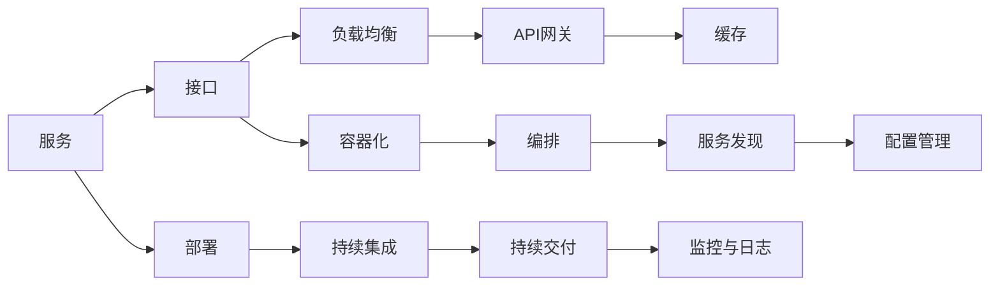

                 

## 1. 背景介绍

在当今快速变化的互联网环境中，系统需要快速迭代和扩展以保持竞争力。单块应用程序难以满足这样的需求，微服务架构（Microservice Architecture）应运而生。微服务架构通过将系统分解成一系列小而自治的服务，使得每个服务能够独立部署、扩展和更新，从而提高了系统的灵活性和可维护性。本文将详细探讨微服务架构的设计与实现，帮助读者理解其原理、实践挑战与解决方案。

## 2. 核心概念与联系

### 2.1 核心概念概述

微服务架构是一种通过将应用程序分解为多个小而独立的服务来提高系统灵活性和可维护性的架构风格。其核心概念包括服务、接口、容器化、编排、部署、持续集成和持续交付等。

- **服务**：微服务架构的核心是服务，即一组业务功能的逻辑封装。每个服务负责一个具体的业务功能，如订单管理、用户管理等。
- **接口**：服务间通信通过接口进行，接口定义了服务的输入和输出。常见的接口协议包括REST、gRPC、AMQP等。
- **容器化**：每个微服务被打包成一个独立的容器（如Docker），容器封装了所有运行环境和依赖，确保了服务的独立性和可移植性。
- **编排**：微服务需要一种机制来管理服务间的依赖关系，编排工具如Kubernetes、Consul等提供了服务发现、负载均衡等功能。
- **部署**：服务的部署通常基于容器化技术，通过编排工具自动进行。
- **持续集成和持续交付**：CI/CD管道确保了代码的自动构建、测试和部署，提高了开发效率和系统可靠性。

### 2.2 核心概念间的关系

微服务架构中的各个概念之间存在紧密的联系，如下图所示：



这些概念构成了微服务架构的生态系统，每个环节都对系统的整体性能和可靠性至关重要。

## 3. 核心算法原理 & 具体操作步骤

### 3.1 算法原理概述

微服务架构的实现基于分布式计算和容器化技术。每个微服务是一个独立的进程，运行在一个隔离的容器中，通过接口与其它服务通信。服务间通信可以是同步的，也可以是异步的，具体取决于接口协议和实现方式。

微服务架构的设计遵循以下原则：

- **自治服务**：每个微服务都是一个自治的单元，拥有自己的数据库和业务逻辑，可以独立部署和扩展。
- **接口定义**：服务间通信通过接口定义，接口协议包括REST、gRPC等。
- **容器化**：每个微服务被打包在一个独立的容器中，确保了服务的独立性和可移植性。
- **编排管理**：通过编排工具（如Kubernetes）管理服务间的依赖关系，进行服务的发现和负载均衡。
- **持续集成与交付**：通过CI/CD管道确保代码的自动构建、测试和部署，提高了开发效率和系统可靠性。

### 3.2 算法步骤详解

微服务架构的实现主要分为以下步骤：

1. **需求分析**：明确系统的业务需求，识别出需要拆分的业务功能。
2. **服务设计**：根据业务需求，设计微服务。每个服务应负责一个具体的业务功能。
3. **接口设计**：定义服务间的通信协议和接口，确保服务的自治性。
4. **容器化**：将每个微服务打包在一个独立的容器中，确保服务的独立性和可移植性。
5. **编排管理**：通过编排工具管理服务间的依赖关系，进行服务的发现和负载均衡。
6. **部署和监控**：通过CI/CD管道进行服务的自动部署和监控，确保系统的稳定性和可靠性。

### 3.3 算法优缺点

#### 优点：

1. **灵活性**：微服务架构使得每个服务可以独立部署和扩展，提高了系统的灵活性和可维护性。
2. **独立性**：每个服务运行在一个独立的容器中，保证了服务的独立性和可移植性。
3. **可扩展性**：微服务架构允许根据需求动态扩展服务，提高了系统的可扩展性。
4. **持续集成与交付**：通过CI/CD管道，微服务架构可以快速响应变化，提高开发效率和系统可靠性。

#### 缺点：

1. **复杂性**：微服务架构的复杂性增加，服务间通信和协调变得复杂。
2. **性能损耗**：服务间通信和负载均衡可能带来一定的性能损耗。
3. **数据一致性**：跨服务的数据一致性维护变得困难。
4. **管理难度**：微服务架构需要更多的运维和管理工作，增加了系统复杂性。

### 3.4 算法应用领域

微服务架构在互联网应用、金融、电子商务、物联网等领域得到了广泛应用。其灵活性、可扩展性和独立性使得微服务架构成为构建复杂系统的首选。

## 4. 数学模型和公式 & 详细讲解 & 举例说明

### 4.1 数学模型构建

微服务架构的数学模型主要涉及服务的调度和编排管理。假设系统中有$N$个服务，每个服务的服务时间为$T_s$，系统总时间为$T$，则服务的利用率为：

$$ \text{Utilization} = \frac{T_s}{T} $$

服务的响应时间包括处理时间和通信时间，通信时间与服务的响应时间成正比，即：

$$ R = f(T_s) = aT_s + b $$

其中，$a$和$b$为常数。

### 4.2 公式推导过程

假设系统中有$N$个服务，每个服务的利用率为$u$，则系统整体的利用率为：

$$ \text{Overall Utilization} = \sum_{i=1}^{N} u_i $$

根据服务的响应时间和通信时间，系统整体的响应时间为：

$$ R_{\text{overall}} = f(T_s) = \sum_{i=1}^{N} (aT_{si} + b) $$

其中，$T_{si}$为服务$i$的响应时间。

### 4.3 案例分析与讲解

以电子商务平台为例，该平台包含多个微服务，如订单管理、库存管理、支付服务等。订单管理服务的响应时间为100ms，库存管理服务的响应时间为200ms，支付服务的服务时间为150ms，通信时间为10ms。则系统整体的响应时间约为：

$$ R_{\text{overall}} = 100 + 200 + 150 + 10 = 460\text{ms} $$

系统整体的利用率为：

$$ \text{Overall Utilization} = \frac{100 + 200 + 150}{T} $$

## 5. 项目实践：代码实例和详细解释说明

### 5.1 开发环境搭建

#### 5.1.1 Docker和Kubernetes环境搭建

1. 安装Docker和Kubernetes：在Linux系统中安装Docker和Kubernetes，确保环境稳定。
2. 配置Kubernetes集群：使用Minikube或AWS EKS搭建Kubernetes集群。

#### 5.1.2 容器化应用

1. 编写Dockerfile：编写Dockerfile文件，定义应用的服务、依赖和运行环境。
2. 构建Docker镜像：使用Docker build命令构建Docker镜像。
3. 推送Docker镜像：使用Docker push命令将Docker镜像推送到Docker Hub或私有镜像仓库。

#### 5.1.3 Kubernetes部署

1. 编写Kubernetes manifest：编写Kubernetes manifest文件，定义服务、节点、副本等资源。
2. 部署服务：使用kubectl apply命令部署服务。

### 5.2 源代码详细实现

#### 5.2.1 服务设计

以订单管理系统为例，服务设计如下：

```python
# 订单管理服务
class OrderService:
    def __init__(self, order_repository):
        self.order_repository = order_repository

    def create_order(self, order):
        # 创建订单
        self.order_repository.save(order)

    def update_order(self, order_id, new_order):
        # 更新订单
        self.order_repository.update(order_id, new_order)
```

#### 5.2.2 接口设计

定义RESTful接口，使用Flask框架实现接口服务：

```python
from flask import Flask, request, jsonify

app = Flask(__name__)

@app.route('/orders', methods=['POST'])
def create_order():
    order = request.json['order']
    order_service = OrderService(order_repository)
    order_service.create_order(order)
    return jsonify({'success': True}), 201

@app.route('/orders/<order_id>', methods=['PUT'])
def update_order(order_id, new_order):
    order_service = OrderService(order_repository)
    order_service.update_order(order_id, new_order)
    return jsonify({'success': True}), 200
```

#### 5.2.3 容器化应用

编写Dockerfile，将服务打包成Docker镜像：

```dockerfile
FROM python:3.7-slim
WORKDIR /app
COPY . .
RUN pip install -r requirements.txt
CMD ["python", "app.py"]
```

#### 5.2.4 Kubernetes部署

编写Kubernetes manifest，定义服务：

```yaml
apiVersion: apps/v1
kind: Deployment
metadata:
  name: order-service
spec:
  replicas: 3
  selector:
    matchLabels:
      app: order-service
  template:
    metadata:
      labels:
        app: order-service
    spec:
      containers:
      - name: order-service
        image: docker.io/user/order-service:latest
        ports:
        - containerPort: 8080
```

### 5.3 代码解读与分析

通过上述代码，我们实现了订单管理服务的微服务架构。服务通过Flask框架定义RESTful接口，使用Docker容器化，并通过Kubernetes进行部署和管理。

### 5.4 运行结果展示

运行Kubernetes集群，通过kubectl命令查看服务的运行状态：

```bash
kubectl get pods
kubectl get service
```

## 6. 实际应用场景

### 6.1 电子商务平台

电子商务平台采用微服务架构，将订单管理、库存管理、支付服务等拆分成独立的微服务。通过RESTful接口进行通信，实现服务的自治性和可扩展性。

### 6.2 金融系统

金融系统通过微服务架构实现高可用性和高可靠性。每个微服务负责一个独立的业务功能，如交易管理、账户管理等。通过接口通信和Kubernetes编排管理，确保系统的稳定性和可靠性。

### 6.3 物联网平台

物联网平台采用微服务架构，将设备管理、数据采集、数据分析等服务拆分。通过API网关进行服务调用，实现跨服务的数据共享和协同工作。

## 7. 工具和资源推荐

### 7.1 学习资源推荐

1. **《微服务架构：原则、模式与实践》**：这是一本关于微服务架构的权威书籍，涵盖了微服务架构的设计、实现和运维。
2. **Kubernetes官方文档**：Kubernetes官方文档提供了详细的Kubernetes使用指南和示例。
3. **Docker官方文档**：Docker官方文档提供了Docker容器的使用指南和最佳实践。
4. **Spring Cloud官网**：Spring Cloud提供了丰富的微服务框架，涵盖了服务发现、负载均衡、API网关等功能。

### 7.2 开发工具推荐

1. **Docker**：Docker是微服务架构中不可或缺的工具，用于容器化服务。
2. **Kubernetes**：Kubernetes是微服务架构的编排管理工具，用于服务发现、负载均衡等。
3. **Jenkins**：Jenkins是常用的CI/CD工具，用于自动化构建、测试和部署。
4. **JIRA**：JIRA是项目管理工具，用于微服务架构的管理和运维。

### 7.3 相关论文推荐

1. **《微服务架构：构建可伸缩和可部署的软件系统》**：这篇论文是微服务架构的奠基之作，提出了微服务架构的概念和设计原则。
2. **《分布式系统：原理与设计》**：该书深入介绍了分布式系统设计原理，是微服务架构设计的重要参考。
3. **《DevOps：持续交付、持续集成和持续部署》**：该书详细介绍了DevOps和CI/CD管道的实现方法，是微服务架构部署的重要参考。

## 8. 总结：未来发展趋势与挑战

### 8.1 研究成果总结

微服务架构在互联网应用、金融、电子商务、物联网等领域得到了广泛应用，成为构建复杂系统的首选。其主要成果包括：

1. **服务拆分**：将系统拆分为多个独立的微服务，提高了系统的灵活性和可维护性。
2. **容器化技术**：通过Docker容器化服务，实现了服务的独立性和可移植性。
3. **编排管理**：通过Kubernetes编排管理服务，实现了服务的发现和负载均衡。
4. **持续集成与交付**：通过CI/CD管道，实现了代码的自动构建、测试和部署，提高了开发效率和系统可靠性。

### 8.2 未来发展趋势

微服务架构的未来发展趋势包括：

1. **微服务治理**：微服务治理是微服务架构的重要组成部分，通过服务网格、API网关等技术，实现服务的自动发现、负载均衡和跨服务通信。
2. **自动化运维**：通过自动化运维工具，如Prometheus、Grafana等，实现微服务架构的自动监控和管理。
3. **可观察性**：通过可观察性工具，实现微服务架构的实时监控和分析，帮助开发者快速定位和解决问题。
4. **容器编排**：通过容器编排工具，如Kubernetes、Nomad等，实现微服务架构的自动化部署和扩展。

### 8.3 面临的挑战

微服务架构在实践过程中仍面临以下挑战：

1. **复杂性增加**：微服务架构的复杂性增加，服务间通信和协调变得复杂。
2. **性能损耗**：服务间通信和负载均衡可能带来一定的性能损耗。
3. **数据一致性**：跨服务的数据一致性维护变得困难。
4. **管理难度**：微服务架构需要更多的运维和管理工作，增加了系统复杂性。

### 8.4 研究展望

未来的微服务架构研究需要在以下几个方面寻求新的突破：

1. **服务治理**：通过服务网格、API网关等技术，实现服务的自动发现、负载均衡和跨服务通信。
2. **自动化运维**：通过自动化运维工具，实现微服务架构的自动监控和管理。
3. **可观察性**：通过可观察性工具，实现微服务架构的实时监控和分析，帮助开发者快速定位和解决问题。
4. **容器编排**：通过容器编排工具，实现微服务架构的自动化部署和扩展。

## 9. 附录：常见问题与解答

**Q1：微服务架构的优势和劣势是什么？**

A: 微服务架构的优势包括灵活性、独立性和可扩展性，劣势包括复杂性增加、性能损耗和数据一致性维护困难。

**Q2：如何选择合适的微服务架构实现方式？**

A: 选择合适的微服务架构实现方式应考虑业务需求、系统复杂性和可维护性。根据业务特点，选择合适的微服务架构设计，如单体应用、服务拆分、容器化等。

**Q3：微服务架构中服务如何相互通信？**

A: 微服务架构中服务间的通信通常通过接口协议（如REST、gRPC等）实现。通过接口定义，服务可以独立部署和扩展，同时保证了服务的自治性。

**Q4：微服务架构如何实现自动监控和管理？**

A: 通过可观察性工具（如Prometheus、Grafana等）和自动化运维工具（如Kubernetes），可以实现微服务架构的自动监控和管理。

**Q5：微服务架构的部署和管理需要注意哪些问题？**

A: 微服务架构的部署和管理需要注意服务间通信、数据一致性、负载均衡等问题。通过容器化、编排管理等技术，可以实现微服务架构的自动部署和扩展。

通过本文的系统梳理，我们可以更加深入地理解微服务架构的设计与实现。微服务架构为复杂系统的构建提供了新的思路和方法，相信在未来的实践中，将有更多的企业和组织受益于这种灵活、可扩展的系统架构。

