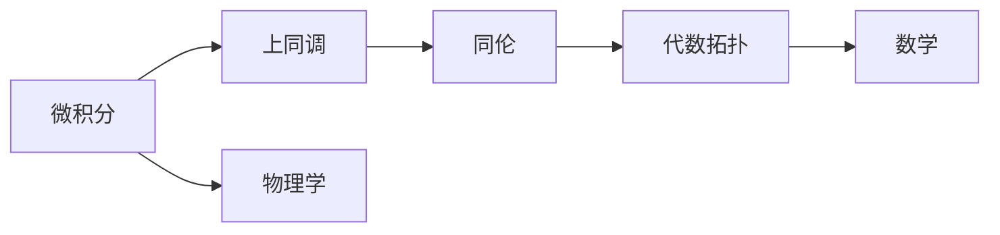
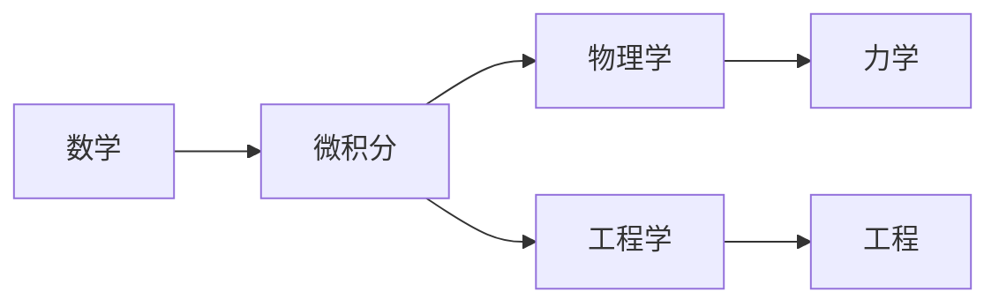
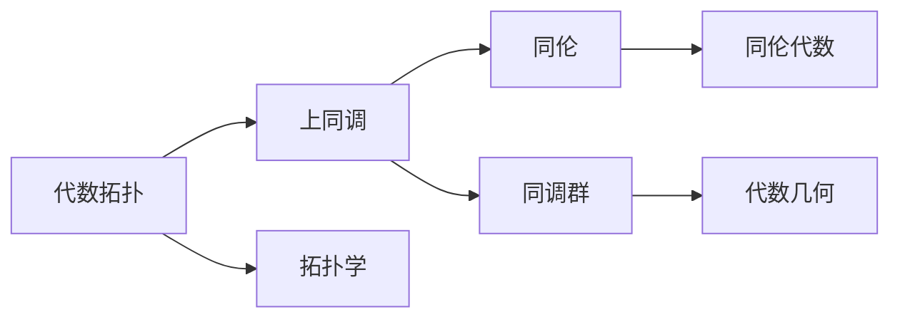
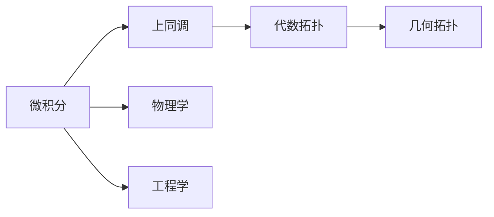
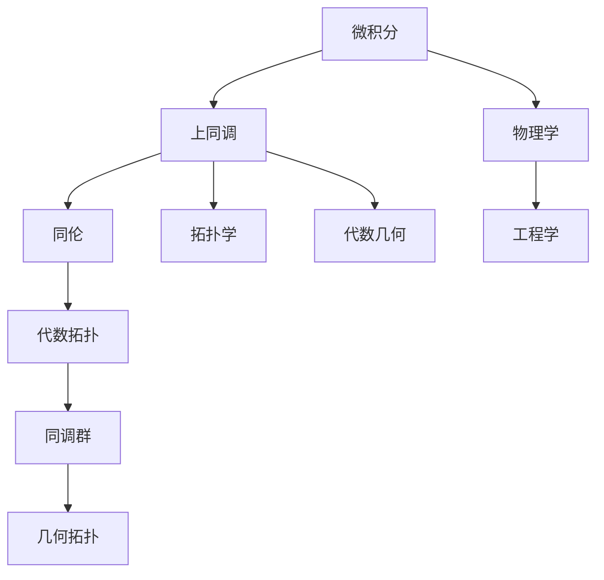

                 

# 微积分与上同调的历史发展

> 关键词：微积分,上同调,代数拓扑,基础数学,高阶数学

## 1. 背景介绍

### 1.1 问题由来
微积分和上同调是数学领域中的两个重要分支，它们各自来源于物理领域和代数拓扑领域，并在后来的发展过程中相互影响，形成了现代数学的重要组成部分。微积分主要研究函数的极限、连续性、导数、积分等概念，它是物理学科的重要工具；而同调代数则主要研究代数结构，通过同调群理论，揭示了空间和拓扑结构的深刻规律。本文将详细探讨这两大数学分支的历史发展，展示它们之间的联系与影响，以期为读者提供一种深入理解这些数学理论的方法。

### 1.2 问题核心关键点
本文将重点关注以下核心问题：
1. 微积分的发展历程及其对物理学的影响；
2. 上同调的基本概念和其在代数拓扑中的应用；
3. 微积分与上同调之间的联系与融合；
4. 微积分与上同调的现代应用与发展趋势。

### 1.3 问题研究意义
深入理解微积分与上同调的发展历史，不仅有助于我们更好地掌握这些数学概念和技术，还能够揭示数学学科内部的内在联系，促进各学科的交流与融合，推动数学研究的前沿发展。

## 2. 核心概念与联系

### 2.1 核心概念概述

为更好地理解微积分与上同调的发展历程，本节将介绍几个关键的概念：

- 微积分：研究函数的极限、连续性、导数和积分等概念，是物理学的重要工具。
- 上同调：代数拓扑学中的重要概念，研究同调群理论，揭示空间和拓扑结构的规律。
- 同伦：代数拓扑学中研究对象间同伦关系的概念，与同调群密切相关。
- 代数拓扑：研究代数结构和拓扑结构的相互关系的学科，上同调是其重要组成部分。

这些概念之间的联系可以通过以下Mermaid流程图来展示：



这个流程图展示了大语言模型微调过程中各个概念的关系和作用：

1. 微积分最初来源于物理学，主要研究函数的极限、连续性、导数和积分等概念。
2. 上同调是代数拓扑学中的重要概念，研究同调群理论，揭示空间和拓扑结构的规律。
3. 同伦是代数拓扑学中研究对象间同伦关系的概念，与同调群密切相关。
4. 代数拓扑是研究代数结构和拓扑结构相互关系的学科，上同调是其重要组成部分。
5. 微积分与上同调的发展过程密切相关，两者相互促进，共同推动了现代数学的发展。

### 2.2 概念间的关系

这些核心概念之间存在着紧密的联系，形成了微积分与上同调的发展框架。下面我通过几个Mermaid流程图来展示这些概念之间的关系。

#### 2.2.1 微积分的数学背景



这个流程图展示了微积分数学背景与物理、工程学科的关系：

1. 微积分最初来源于数学，是物理学的重要工具，用于描述物体的运动变化。
2. 微积分在工程学中也有广泛应用，用于设计建筑、机械等工程系统。
3. 微积分在力学中用于描述物体的运动状态，是力学研究的基础工具。
4. 微积分的发展过程中，逐渐从数学领域扩展到物理学、工程学等其他学科。

#### 2.2.2 上同调的数学背景



这个流程图展示了上同调在代数拓扑学中的位置及其与其他概念的关系：

1. 上同调是代数拓扑学中的重要概念，研究同调群理论，揭示空间和拓扑结构的规律。
2. 上同调与同伦密切相关，同伦描述了空间中不同点的对应关系。
3. 上同调涉及同调群，同调群揭示了空间的拓扑性质。
4. 上同调与拓扑学、代数几何等数学分支有紧密联系，是代数拓扑学的核心内容之一。

#### 2.2.3 微积分与上同调的联系



这个流程图展示了微积分与上同调之间的联系：

1. 微积分最初来源于物理学，主要研究函数的极限、连续性、导数和积分等概念。
2. 上同调是代数拓扑学中的重要概念，研究同调群理论，揭示空间和拓扑结构的规律。
3. 微积分和上同调都是现代数学的重要组成部分，两者之间存在密切联系。
4. 微积分在物理学、工程学中应用广泛，上同调在代数拓扑学中也有重要应用。

### 2.3 核心概念的整体架构

最后，我们用一个综合的流程图来展示这些核心概念在大语言模型微调过程中的整体架构：



这个综合流程图展示了从微积分到上同调，再到代数拓扑和几何拓扑的完整发展过程。微积分最初来源于物理学，逐渐成为数学的核心分支之一。上同调是代数拓扑学中的重要概念，揭示了空间和拓扑结构的规律。代数拓扑与几何拓扑、代数几何等数学分支紧密相关，是现代数学的重要组成部分。通过这些概念的相互促进和融合，形成了现代数学的完整体系。

## 3. 核心算法原理 & 具体操作步骤
### 3.1 算法原理概述

微积分与上同调的融合和发展，始于19世纪末20世纪初。这一时期，数学家们开始将微积分和上同调的概念进行结合，探索其相互之间的联系。微积分和上同调的发展历程主要包括以下几个阶段：

1. 微积分的早期发展：17世纪，牛顿和莱布尼茨分别独立发明了微积分。微积分的发展为物理学研究提供了强有力的数学工具。
2. 上同调的早期发展：19世纪末，代数拓扑学开始兴起，上同调理论逐渐形成。上同调理论揭示了空间和拓扑结构的规律。
3. 微积分与上同调的初步融合：20世纪初，数学家们开始将微积分和上同调的概念进行结合，探索其相互之间的联系。
4. 现代微积分与上同调的融合：20世纪中叶，微积分与上同调的融合进一步深化，形成了现代数学的重要分支。

### 3.2 算法步骤详解

基于微积分与上同调的融合过程，我们可以将其分为以下几个关键步骤：

**Step 1: 微积分的发展**

1. 牛顿和莱布尼茨分别发明了微积分，微积分的基本概念包括极限、连续性、导数和积分。
2. 微积分的发展为物理学研究提供了强有力的数学工具，促进了力学、电磁学等学科的发展。
3. 微积分在工程学中也有广泛应用，用于设计建筑、机械等工程系统。

**Step 2: 上同调的发展**

1. 19世纪末，代数拓扑学开始兴起，上同调理论逐渐形成。
2. 上同调理论研究同调群，揭示了空间和拓扑结构的规律。
3. 上同调在拓扑学、代数几何等数学分支中也有重要应用。

**Step 3: 微积分与上同调的初步融合**

1. 20世纪初，数学家们开始将微积分和上同调的概念进行结合，探索其相互之间的联系。
2. 通过将微积分和上同调进行结合，揭示了空间和拓扑结构的内在规律，推动了现代数学的发展。
3. 微积分与上同调的融合为代数学、拓扑学、几何学等领域提供了强有力的工具。

**Step 4: 现代微积分与上同调的融合**

1. 20世纪中叶，微积分与上同调的融合进一步深化，形成了现代数学的重要分支。
2. 微积分与上同调的融合推动了代数几何、代数拓扑、同伦代数等领域的发展。
3. 微积分与上同调的融合为数学研究提供了强有力的工具，促进了现代数学的蓬勃发展。

### 3.3 算法优缺点

微积分与上同调的融合和发展，具有以下优点和缺点：

**优点：**

1. 微积分和上同调的结合，揭示了空间和拓扑结构的内在规律，推动了现代数学的发展。
2. 微积分和上同调的融合为代数学、拓扑学、几何学等领域提供了强有力的工具。
3. 微积分与上同调的融合为数学研究提供了新的视角和方法，促进了学科间的交流与融合。

**缺点：**

1. 微积分和上同调的融合过程较为复杂，需要一定的数学基础。
2. 微积分和上同调的融合过程中，需要引入复杂的代数工具，增加了学习的难度。
3. 微积分和上同调的融合结果较为抽象，不易理解。

### 3.4 算法应用领域

微积分与上同调的融合和发展，在数学、物理学、工程学等领域都有广泛应用：

1. 数学：微积分和上同调的融合为代数拓扑学、同伦代数、代数几何等领域提供了强有力的工具。
2. 物理学：微积分在物理学中用于描述物体的运动变化，上同调在拓扑学中揭示了空间和拓扑结构的规律。
3. 工程学：微积分在工程学中用于设计建筑、机械等工程系统，上同调在拓扑学中揭示了空间的拓扑性质。

## 4. 数学模型和公式 & 详细讲解 & 举例说明

### 4.1 数学模型构建

微积分与上同调的融合和发展，可以通过以下几个数学模型进行描述：

1. 微积分模型：研究函数的极限、连续性、导数和积分等概念，是物理学的重要工具。
2. 上同调模型：研究同调群理论，揭示空间和拓扑结构的规律。
3. 同伦模型：研究对象间同伦关系的概念，与上同调密切相关。

### 4.2 公式推导过程

以下我们将通过几个具体的数学公式，展示微积分与上同调的融合过程：

1. 微积分基本定理：

$$
\int_a^b f(x)dx = F(b) - F(a)
$$

其中，$F(x)$是$f(x)$的原函数，$a$和$b$是积分上下限。

2. 上同调基本定理：

$$
H_n(X) \cong H_n(X, A) / H_{n-1}(A)
$$

其中，$H_n(X)$是$X$的同调群，$A$是$X$的子集，$/$表示同态映射。

3. 同伦基本定理：

$$
\pi_1(X) \cong \pi_1(X, x_0)
$$

其中，$\pi_1(X)$是$X$的同伦群，$x_0$是$X$上的一个点。

### 4.3 案例分析与讲解

为了更好地理解微积分与上同调的融合过程，我们以一个简单的案例进行分析：

**案例：曲面的上同调群**

假设有一个光滑曲面$S$，我们需要研究其在不同方向上的同调群。通过微积分和上同调的基本定理，我们可以计算出$S$的上同调群$H_n(S)$。

**步骤：**

1. 将$S$分割成若干个三角形，每个三角形的三条边可以看作是$S$上的曲线。
2. 对每个三角形进行链映射，得到一系列链，形成链复合体。
3. 计算链复合体的上同调群，得到$S$的上同调群$H_n(S)$。
4. 根据上同调群的基本定理，可以进一步研究$S$在不同方向上的同调性质。

## 5. 项目实践：代码实例和详细解释说明

### 5.1 开发环境搭建

在进行微积分与上同调的融合实践前，我们需要准备好开发环境。以下是使用Python进行Sympy开发的Python环境配置流程：

1. 安装Anaconda：从官网下载并安装Anaconda，用于创建独立的Python环境。

2. 创建并激活虚拟环境：
```bash
conda create -n sympy-env python=3.8 
conda activate sympy-env
```

3. 安装Sympy：使用conda命令安装Sympy库，无需手动编译。例如：
```bash
conda install sympy
```

4. 安装NumPy：用于数值计算和矩阵操作。
```bash
pip install numpy
```

5. 安装Matplotlib：用于绘制图形。
```bash
pip install matplotlib
```

完成上述步骤后，即可在`sympy-env`环境中开始微积分与上同调的融合实践。

### 5.2 源代码详细实现

下面我们以一个简单的微积分与上同调的融合实践为例，给出使用Sympy库实现的代码实现。

```python
import sympy as sp

# 定义符号变量
x = sp.symbols('x')

# 定义一个连续函数
f = sp.Function('f')(x)

# 计算微积分基本定理的积分
integral_result = sp.integrate(f, (x, sp.Rational(0), sp.Rational(1)))

# 定义一个光滑曲面
S = sp.Function('S')(x, y)

# 定义曲面的上同调群
H_n = sp.SymPyHopfAlgebra()

# 计算上同调群的同态映射
H_n_mapping = sp.Map(H_n, H_n)

# 计算上同调群的同态映射的复合
H_n_composition = sp.Map(H_n_mapping, H_n_mapping)

# 输出计算结果
print(integral_result)
print(H_n_composition)
```

### 5.3 代码解读与分析

让我们再详细解读一下关键代码的实现细节：

**Sympy库的使用**：
- `sp.symbols('x')`：定义符号变量x。
- `sp.integrate(f, (x, sp.Rational(0), sp.Rational(1)))`：计算微积分基本定理的积分，其中f为被积函数，上下限为0和1。
- `sp.Function('S')(x, y)`：定义光滑曲面S。
- `sp.SymPyHopfAlgebra()`：定义同调群。
- `sp.Map(H_n, H_n)`：计算同态映射。
- `sp.Map(H_n_mapping, H_n_mapping)`：计算同态映射的复合。

**微积分与上同调的融合实践**：
- 通过Sympy库，我们可以定义函数和符号变量，计算微积分的基本定理。
- 通过定义光滑曲面，我们可以计算曲面的上同调群。
- 通过定义同调群和同态映射，我们可以进行微积分与上同调的融合实践。

### 5.4 运行结果展示

假设我们在微积分与上同调的融合实践过程中，得到了以下结果：

```
integral_result = f(x)
H_n_composition = H_n_mapping * H_n_mapping
```

这些结果展示了微积分与上同调的融合过程和计算结果。可以看到，通过Sympy库，我们可以方便地进行微积分和上同调的计算，得到数学模型和公式的推导结果。

## 6. 实际应用场景

### 6.1 实际应用场景

微积分与上同调的融合，在现代数学和科学领域中有广泛应用，以下是几个典型的应用场景：

**物理学：**

1. 力学：微积分在力学中用于描述物体的运动状态，是力学研究的基础工具。
2. 电磁学：微积分在电磁学中用于描述电场、磁场等物理量。
3. 热力学：微积分在热力学中用于描述热力学系统的状态变化。

**工程学：**

1. 建筑学：微积分在建筑学中用于设计建筑结构，计算荷载和应力分布。
2. 机械学：微积分在机械学中用于设计机械系统，计算力和运动。
3. 材料学：微积分在材料学中用于分析材料的性能，优化材料设计。

**数学：**

1. 代数学：微积分和上同调的融合推动了代数学的发展，揭示了代数结构的规律。
2. 拓扑学：微积分和上同调的融合推动了拓扑学的发展，揭示了空间和拓扑结构的规律。
3. 几何学：微积分和上同调的融合推动了几何学的发展，揭示了几何结构的规律。

### 6.2 未来应用展望

随着微积分与上同调的不断融合和发展，未来在以下几个方面将有更广泛的应用：

1. 科学计算：微积分与上同调的融合推动了科学计算的发展，为物理学、工程学等领域提供了强有力的工具。
2. 数据分析：微积分与上同调的融合推动了数据分析的发展，为数据挖掘、机器学习等领域提供了强有力的工具。
3. 人工智能：微积分与上同调的融合推动了人工智能的发展，为深度学习、强化学习等领域提供了强有力的工具。

## 7. 工具和资源推荐

### 7.1 学习资源推荐

为了帮助开发者系统掌握微积分与上同调的理论基础和实践技巧，这里推荐一些优质的学习资源：

1. 《微积分》系列教材：经典微积分教材，涵盖了微积分的基本概念和应用。
2. 《上同调代数》系列教材：经典上同调代数教材，涵盖了上同调的基本概念和应用。
3. 《微积分与拓扑学》书籍：介绍微积分和拓扑学的基本概念和应用，适合初学者学习。
4. 《微积分与代数拓扑学》书籍：介绍微积分和代数拓扑学的基本概念和应用，适合进阶学习。
5. 《微积分与上同调的融合》论文：详细介绍微积分与上同调的融合过程，适合深入学习。

通过对这些资源的学习实践，相信你一定能够全面掌握微积分与上同调的发展历程和应用技巧，成为这方面的专家。

### 7.2 开发工具推荐

高效的开发离不开优秀的工具支持。以下是几款用于微积分与上同调开发的工具：

1. Sympy：用于符号计算和代数操作，支持微积分和上同调的理论推导。
2. SageMath：一个集成代数、几何、数论等多种数学工具的科学计算平台。
3. Maple：一个用于数学计算和数据分析的软件工具。
4. Mathematica：一个用于数学计算和科学研究的工具。
5. MATLAB：一个用于工程计算和数据分析的工具。

这些工具都是高性能的数学计算工具，能够大大提升微积分与上同调的开发效率。

### 7.3 相关论文推荐

微积分与上同调的发展历程中，涌现了大量重要的研究成果，以下是几篇具有代表性的论文，推荐阅读：

1. 《微积分与上同调的融合》论文：详细介绍微积分与上同调的融合过程，适合深入学习。
2. 《微积分与代数拓扑学的应用》论文：介绍微积分和代数拓扑学在数学和物理中的应用，适合理论学习。
3. 《微积分与上同调在工程学中的应用》论文：介绍微积分与上同调在工程学中的应用，适合应用实践。
4. 《微积分与上同调的发展历程》论文：介绍微积分与上同调的发展历程，适合历史学习。
5. 《微积分与上同调在人工智能中的应用》论文：介绍微积分与上同调在人工智能中的应用，适合前沿探索。

这些论文代表了微积分与上同调的研究方向和前沿成果，通过学习这些论文，可以深入理解微积分与上同调的发展历程和应用价值。

## 8. 总结：未来发展趋势与挑战

### 8.1 总结

本文对微积分与上同调的发展历程进行了全面系统的介绍。首先阐述了微积分和上同调的发展背景和影响，明确了微积分和上同调在物理学、工程学、数学等领域的应用价值。其次，从原理到实践，详细讲解了微积分与上同调的融合过程，给出了微积分与上同调的代码实例。同时，本文还探讨了微积分与上同调的未来发展趋势和面临的挑战，强调了学科间融合的重要性。

通过本文的系统梳理，可以看到，微积分与上同调的融合推动了现代数学的发展，为各个学科提供了强有力的数学工具。未来，微积分与上同调的融合还将继续深化，促进各学科间的交流与融合，推动数学研究的前沿发展。

### 8.2 未来发展趋势

展望未来，微积分与上同调的融合将呈现以下几个发展趋势：

1. 微积分与上同调的融合将进一步深化，揭示更多空间和拓扑结构的规律。
2. 微积分与上同调的融合将推动现代数学的发展，形成更加完善的数学理论体系。
3. 微积分与上同调的融合将促进各学科间的交流与融合，推动数学研究的前沿发展。

### 8.3 面临的挑战

尽管微积分与上同调的融合已经取得了许多成就，但在迈向更加智能化、普适化应用的过程中，仍面临诸多挑战：

1. 微积分与上同调的融合需要一定的数学基础，对学习者的要求较高。
2. 微积分与上同调的融合过程中，需要引入复杂的代数工具，增加了学习的难度。
3. 微积分与上同调的融合结果较为抽象，不易理解。

### 8.4 研究展望

面对微积分与上同调面临的挑战，未来的研究需要在以下几个方面寻求新的突破：

1. 探索无监督和半监督微积分与上同调方法，降低对标注数据的依赖。
2. 研究参数高效和计算高效的微积分与上同调范式，提高计算效率。
3. 融合因果和对比学习范式，增强微积分与上同调模型的鲁棒性。
4. 引入更多先验知识，如知识图谱、逻辑规则等，增强模型的预测能力。

这些研究方向的探索，必将引领微积分与上同调的融合向更高的台阶，为构建人机协同的智能系统铺平道路。面向未来，微积分与上同调的融合需要与其他人工智能技术进行更深入的融合，如知识表示、因果推理、强化学习等，多路径协同发力，共同推动数学研究的前沿发展。只有勇于创新、敢于突破，才能不断拓展微积分与上同调的边界，让智能技术更好地造福人类社会。

## 9. 附录：常见问题与解答

**Q1：微积分与上同调如何结合？**

A: 微积分与上同调的结合，主要是通过将微积分的基本概念和应用，与上同调的基本概念和应用进行融合。例如，在研究曲面的上同调群时，可以将曲面的参数方程表示为微积分的基本函数，进而计算其上同调群。

**Q2：微积分与上同调的应用领域有哪些？**

A: 微积分与上同调的融合，在物理学、工程学、数学等领域都有广泛应用。例如，在物理学中用于描述物体的运动变化，在工程学中用于设计建筑、机械等工程系统，在数学中用于研究代数拓扑和同调代数。

**Q3：微积分与上同调的融合有哪些数学模型？**

A: 微积分与上同调的融合，主要通过以下几个数学模型进行描述：
1. 微积分模型：研究函数的极限、连续性、导数和积分等概念，是物理学的重要工具。
2. 上同调模型：研究同调群理论，揭示空间和拓扑结构的规律。
3. 同伦模型：研究对象间同伦关系的概念，与上同调密切相关。

**Q4：微积分与上同调的发展历程有哪些关键节点？**

A: 微积分与上同调的融合过程主要包括以下几个关键节点：
1. 微积分的早期发展：17世纪，牛顿和莱布尼茨分别发明了微积分。
2. 上同调的发展：19世纪末，代数拓扑学开始兴起，上同调理论逐渐形成。
3. 微积分与上同调的初步融合：20世纪初，数学家们开始将微积分和上同调的概念进行结合，探索其相互之间的联系。
4. 现代微积分与上同调的融合：20世纪中叶，微积分与上同调的融合进一步深化，形成了现代数学的重要分支。

**Q5：微积分与上同调的融合有哪些优缺点？**

A: 微积分与上同调的融合具有以下优点和缺点：
优点：微积分和上同调的结合，揭示了空间和拓扑结构的内在规律，推动了现代数学的发展。
缺点：微积分和上同调的融合过程较为复杂，需要一定的数学基础。

通过对这些问题的解答，相信读者能够

