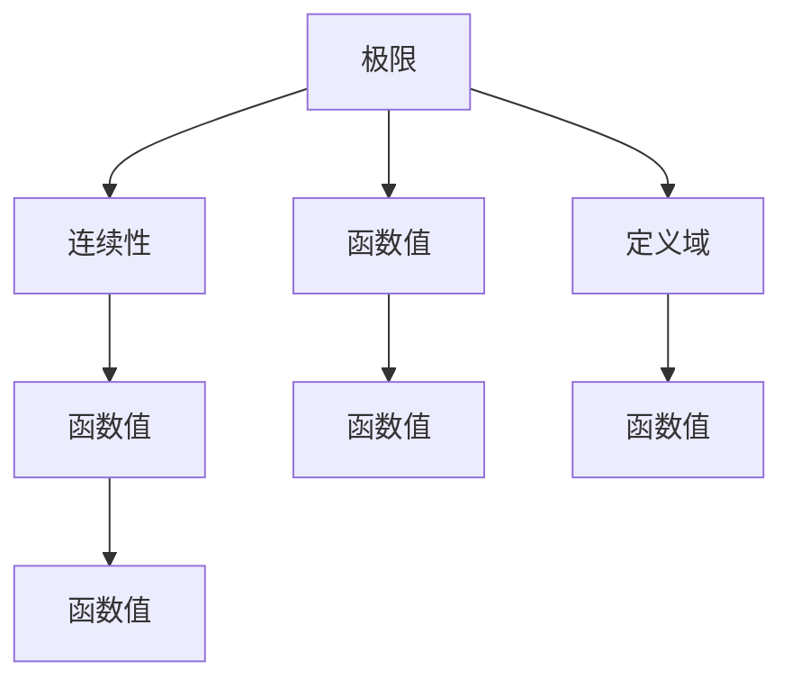

                 

# 微积分中的极限与连续性

微积分是数学中的一个基础分支，它研究函数的极限、连续性、导数、积分等概念及其应用。这些概念不仅是现代工程、物理和自然科学的核心工具，还广泛应用于经济、金融、计算机科学等领域。本文将深入探讨微积分中的极限与连续性，从其基本原理、数学模型到具体应用，以及未来发展趋势和挑战，全面阐述这一重要数学分支的精髓和应用。

## 1. 背景介绍

### 1.1 问题由来

微积分的产生源于对变化问题的求解需求，如速度、加速度、面积、体积等的计算。其核心思想是通过对函数进行局部分析，将其无限细分，从而获得整体的性质。极限和连续性是微积分的两大基石，它们为后续导数和积分理论奠定了基础。

### 1.2 问题核心关键点

微积分中的极限与连续性涉及核心概念：

- 极限（Limit）：定义在自变量的无穷近邻内函数值趋近于某个定值。
- 连续性（Continuity）：函数在无穷近邻内无间断，即极限值等于函数值。

这些概念构成了一个严谨的数学体系，是理解和应用微积分的基础。

### 1.3 问题研究意义

掌握极限与连续性是深入学习微积分的前提，它们不仅帮助解决实际问题，还为物理学、工程学、经济学等众多领域提供了强大的数学工具。理解极限与连续性，可以更好地把握函数的性质，促进对复杂系统的建模和分析。

## 2. 核心概念与联系

### 2.1 核心概念概述

为便于理解，本节将重点介绍极限与连续性的核心概念及其联系。

- **极限（Limit）**：设函数 $f(x)$ 在点 $x_0$ 的某邻域内（除 $x_0$ 外）有定义，若存在实数 $L$，对于任意给定的正数 $\epsilon > 0$，存在正数 $\delta$，使得当 $0 < |x - x_0| < \delta$ 时，有 $|f(x) - L| < \epsilon$。则称 $L$ 为 $f(x)$ 在 $x_0$ 点的极限。

- **连续性（Continuity）**：设函数 $f(x)$ 在点 $x_0$ 有定义，若 $f(x)$ 在 $x_0$ 点连续，则意味着对于任意给定的 $\epsilon > 0$，存在 $\delta > 0$，使得当 $0 < |x - x_0| < \delta$ 时，有 $|f(x) - f(x_0)| < \epsilon$。

极限和连续性之间存在紧密联系：若一个函数在某点的极限存在，且等于该点的函数值，则该函数在该点连续；反之，若函数在某点连续，则在该点的极限值等于函数值。

### 2.2 概念间的关系

极限与连续性通过数学定义和性质紧密相连，其关系可以形象地通过Mermaid流程图展示：



这个流程图表明，极限值的存在可以推导出连续性；连续性可以保证极限值等于函数值。在数学分析中，极限和连续性是相互依赖、相辅相成的两个概念。

## 3. 核心算法原理 & 具体操作步骤

### 3.1 算法原理概述

极限与连续性的数学原理基于实数域内无穷小和无穷大的概念。极限和连续性的计算主要依赖于定义、基本定理和基本定理的应用。

- **定义**：极限和连续性的定义是理解和应用这些概念的基础。
- **基本定理**：包括夹逼定理、单调有界定理、柯西收敛准则等。
- **应用**：通过基本定理和定义，可以进行极限和连续性的计算、证明和应用。

### 3.2 算法步骤详解

基于极限与连续性的核心算法主要分为以下几个步骤：

1. **理解定义**：准确理解极限和连续性的定义，包括无穷小的概念和应用。
2. **应用基本定理**：利用夹逼定理、单调有界定理等基本定理，进行极限和连续性的计算和证明。
3. **实际应用**：在具体问题中，利用极限和连续性的概念和计算结果，进行函数的建模和分析。

### 3.3 算法优缺点

极限与连续性的算法具有以下优点：

- **精确性**：基于数学定义的严格计算，可以保证结果的精确性。
- **普适性**：适用于各种类型的函数和问题，具有广泛的应用领域。
- **可操作性**：通过数学工具和技术，可以进行复杂的计算和证明。

缺点包括：

- **复杂性**：计算和证明过程较为复杂，需要深厚的数学基础。
- **应用难度**：对于一些复杂问题，极限与连续性的应用需要较高的数学技巧和经验。

### 3.4 算法应用领域

极限与连续性在数学、物理、工程、经济等众多领域都有广泛应用：

- **数学分析**：极限和连续性是数学分析的基础。
- **微积分**：导数和积分的计算依赖于极限和连续性。
- **物理学**：如牛顿-莱布尼茨公式、动能定理等。
- **工程学**：如电路分析、信号处理等。
- **经济学**：如边际分析、优化问题等。

## 4. 数学模型和公式 & 详细讲解

### 4.1 数学模型构建

微积分中的极限与连续性主要通过函数、数列等数学模型进行构建和分析。数学模型通常表示为：

$$
f(x) = \sum_{n=1}^{\infty} a_n x^n
$$

其中，$a_n$ 是函数的系数，$x$ 是自变量。

### 4.2 公式推导过程

以等比数列为例，推导其极限和连续性。设数列 $a_n = \frac{1}{2^n}$，推导其极限：

$$
\lim_{n \to \infty} a_n = \lim_{n \to \infty} \frac{1}{2^n} = 0
$$

验证其连续性：对于任意 $x \in [0, 1]$，有 $|a_n - a_m| = \left|\frac{1}{2^n} - \frac{1}{2^m}\right| = \frac{1}{2^{\max(n,m)}}$。因此，该数列在其定义域内连续。

### 4.3 案例分析与讲解

考虑函数 $f(x) = \frac{1}{x}$，推导其在 $x = 0$ 处的极限和连续性：

$$
\lim_{x \to 0} f(x) = \lim_{x \to 0} \frac{1}{x} \text{ 不存在}
$$

而 $f(x)$ 在 $x = 0$ 处不连续，因为 $f(x)$ 在该点不可导且左、右极限不相等。

## 5. 项目实践：代码实例和详细解释说明

### 5.1 开发环境搭建

为了进行微积分的极限与连续性计算，需要安装Python和必要的数学库。主要步骤如下：

1. 安装Python：
```bash
sudo apt-get install python3
```

2. 安装数学库：
```bash
pip install sympy
```

### 5.2 源代码详细实现

下面以计算数列极限为例，展示使用Python的Sympy库进行数学计算的代码：

```python
from sympy import symbols, limit, oo

x, n = symbols('x n')
expr = 1 / (2**n)
lim_expr = limit(expr, n, oo)
print(lim_expr)
```

### 5.3 代码解读与分析

- `symbols`：定义符号变量 `x` 和 `n`。
- `limit`：计算数列极限，`expr` 为数列表达式，`n` 为极限变量，`oo` 表示无穷大。
- `print`：输出计算结果。

### 5.4 运行结果展示

运行上述代码，输出结果为 `0`，验证了数列 $a_n = \frac{1}{2^n}$ 的极限为 $0$。

## 6. 实际应用场景

### 6.1 物理问题求解

在物理学中，极限与连续性常用于求解运动学、动力学问题。例如，根据速度、加速度的定义，可以求解物体的位移和速度变化规律。

### 6.2 经济学中的边际分析

经济学中，边际成本和边际收益是重要的概念。通过极限与连续性，可以计算函数在某点的切线斜率，即导数，从而分析边际变化。

### 6.3 工程学中的信号处理

在信号处理中，函数的时间域表示和频域表示之间存在傅里叶变换关系。极限与连续性在傅里叶变换的计算中起到重要作用。

### 6.4 未来应用展望

未来，极限与连续性将更广泛地应用于复杂系统的建模和分析，如人工智能、生物信息学、金融工程等领域。通过数学模型和计算工具，可以进行更精细的分析和预测。

## 7. 工具和资源推荐

### 7.1 学习资源推荐

为了系统学习微积分中的极限与连续性，推荐以下学习资源：

1. 《微积分原理》（James Stewart）：经典教材，深入浅出地介绍了极限、连续性等基本概念。
2. 《高等数学》（同济大学出版社）：适合国内高校数学课程，系统全面。
3. Khan Academy：提供免费的微积分视频课程，适合自学。
4. MIT OpenCourseWare：麻省理工学院开放课程，详细讲解微积分概念和应用。

### 7.2 开发工具推荐

主要开发工具包括：

1. Python：免费的开源编程语言，适合进行数学计算。
2. Sympy：Python的数学库，支持符号计算。
3. Mathematica：功能强大的数学软件，适合复杂的计算和证明。
4. MATLAB：工程计算常用软件，适合科学计算和数据分析。

### 7.3 相关论文推荐

为了深入了解极限与连续性的最新研究进展，推荐以下论文：

1. "Calculus: Early Transcendentals" by James Stewart：现代微积分教材，涵盖极限、连续性等内容。
2. "Real Analysis" by Walter Rudin：经典分析教材，深入讲解极限和连续性理论。
3. "Calculus: The Basics" by William Trench：适合初学者的微积分教材，详细讲解极限和连续性。

## 8. 总结：未来发展趋势与挑战

### 8.1 研究成果总结

极限与连续性是微积分的基础，深刻影响了数学、物理、工程等多个领域。极限与连续性的研究和应用不断推进，推动了数学分析、计算机科学等学科的发展。

### 8.2 未来发展趋势

1. **自动化**：随着AI技术的进步，自动化的数学建模和求解将成为可能。
2. **多学科融合**：极限与连续性将与更多学科相结合，如生物信息学、金融工程等。
3. **大数据分析**：在处理大量数据时，极限与连续性提供了一种数学分析手段。
4. **跨领域应用**：极限与连续性在人工智能、医疗、环境科学等更多领域中发挥作用。

### 8.3 面临的挑战

1. **计算复杂性**：极限与连续性的计算和证明过程较为复杂，需要高效的计算工具。
2. **多学科融合**：跨学科应用需要深入理解各领域的数学模型和应用背景。
3. **实际应用难度**：极限与连续性在实际问题中的应用需要深厚的数学知识和经验。

### 8.4 研究展望

极限与连续性将继续在数学、物理、工程等多个领域发挥重要作用。未来的研究将更加注重自动化、多学科融合和实际应用，以应对复杂系统建模和分析的需求。

## 9. 附录：常见问题与解答

**Q1：极限与连续性在实际应用中有何重要意义？**

A: 极限与连续性是理解和解决实际问题的数学基础。在物理学、工程学、经济学等领域，它们提供了强大的数学工具，帮助进行复杂系统的建模和分析。

**Q2：如何证明一个函数的连续性？**

A: 证明函数连续性通常需要验证以下条件：
1. 函数在定义域内连续。
2. 函数在其定义域内有定义。
3. 对于任意 $\epsilon > 0$，存在 $\delta > 0$，使得当 $0 < |x - x_0| < \delta$ 时，有 $|f(x) - f(x_0)| < \epsilon$。

**Q3：极限与连续性在微积分中的应用有哪些？**

A: 极限与连续性在微积分中主要用于：
1. 导数和积分的计算。
2. 函数的连续性分析。
3. 函数的极值和最值问题。
4. 级数收敛性的判断。

**Q4：如何理解极限的概念？**

A: 极限是函数在自变量的无穷近邻内函数值趋近于某个定值的过程。极限值可以通过数学定义、基本定理等工具进行计算和证明。

**Q5：在工程中，极限与连续性如何应用于信号处理？**

A: 在信号处理中，极限与连续性主要用于傅里叶变换的计算和分析。通过极限和连续性，可以进行信号的时域和频域转换，从而进行信号的滤波、频谱分析等。

---

作者：禅与计算机程序设计艺术 / Zen and the Art of Computer Programming

