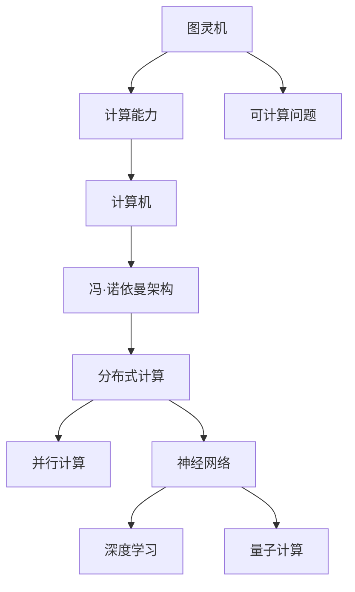
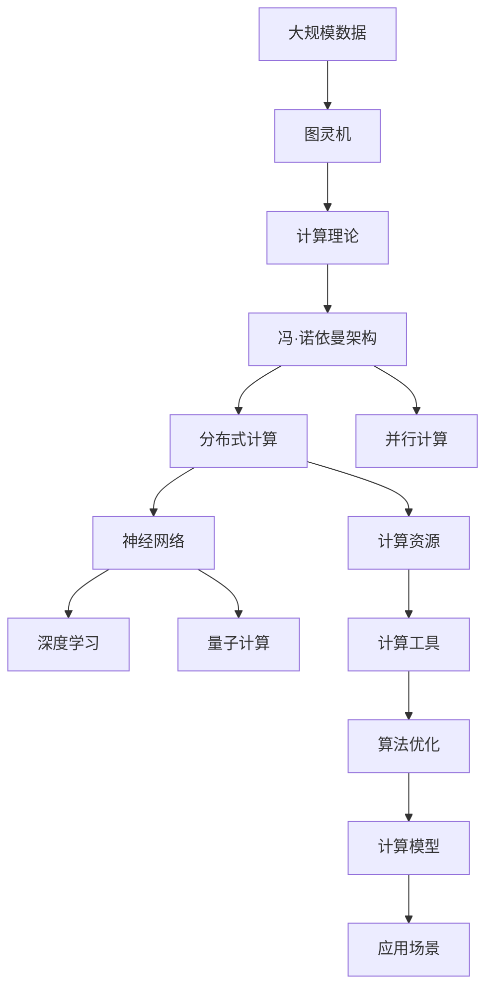

                 

# 推动科技进步的引擎：人类计算的创新力量

> 关键词：人类计算,创新力量,人工智能,机器学习,深度学习,算法优化,计算理论,计算模型

## 1. 背景介绍

### 1.1 问题由来
人类历史上的每一次科技进步，都离不开计算的推动。从早期的计数石、算盘，到现代的超级计算机、量子计算机，计算工具的进步不断拓展了人类认识世界的边界。随着人工智能(AI)和机器学习(ML)技术的兴起，计算已成为推动科技进步的核心引擎。

人工智能的火热源于其强大的计算能力，能够在短时间内处理和分析海量数据，完成复杂的逻辑推理和模式识别。从视觉识别、自然语言处理到机器翻译，AI技术已深入到各个领域，改变着人类的生产生活方式。

然而，随着AI应用的不断深入，如何更高效、更智能地进行计算，成为了当前的一大挑战。本文将聚焦于人类计算的创新力量，从计算理论、算法优化、计算模型等多个角度，深入探讨人类计算的未来发展方向。

### 1.2 问题核心关键点
人类计算的核心在于如何利用计算工具，高效地解决复杂问题，提升人类智慧。计算理论与算法的创新，是推动计算科技进步的关键。本文将从以下几个关键点探讨人类计算的力量：

- **计算理论的创新**：从图灵机、冯·诺依曼架构到量子计算，计算理论的每一次突破，都带来了计算能力的质的飞跃。
- **算法优化**：通过高效的算法设计，提升计算的准确性和效率，解决海量数据处理难题。
- **计算模型**：从传统的冯·诺依曼模型到分布式计算、并行计算、神经网络模型，计算模型的演变引领了计算技术的革新。
- **计算资源**：从早期的手工计算到现代的超级计算机、云服务，计算资源的不断扩展，使得复杂计算成为可能。

这些关键点共同构成了人类计算的创新力量，推动着科技进步的不断前进。

### 1.3 问题研究意义
理解人类计算的创新力量，对于把握计算技术的未来发展趋势，推动人工智能技术的产业化进程，具有重要意义：

1. **技术突破**：掌握计算理论的最新进展，为算法设计和模型创新提供理论支撑，推动计算能力的突破。
2. **应用拓展**：通过高效的计算技术，解决复杂的实际问题，提升人工智能技术在各个领域的应用价值。
3. **资源利用**：合理利用计算资源，优化计算过程，提升计算效率，降低计算成本。
4. **问题解决**：应对海量数据和复杂系统的挑战，提供更高效、更可靠的计算解决方案。

通过深入探讨这些核心问题，相信能够为人工智能技术的未来发展提供更清晰的指引。

## 2. 核心概念与联系

### 2.1 核心概念概述

为更好地理解人类计算的创新力量，本节将介绍几个密切相关的核心概念：

- **图灵机(Turing Machine)**：由Alan Turing提出的抽象计算模型，是现代计算理论的基础。它能够模拟任何可计算问题，是计算能力极限的数学定义。
- **冯·诺依曼架构(Von Neumann Architecture)**：由John von Neumann提出的计算模型，定义了现代计算机的基本组成和运行机制，包括存储器、控制器、运算器等。
- **分布式计算(Distributed Computing)**：通过多台计算机协同工作，处理大规模计算任务。分布式计算能有效利用计算资源，提升计算效率。
- **并行计算(Parallel Computing)**：利用多台计算机并行处理任务，缩短计算时间。并行计算在处理大规模数据时表现尤为出色。
- **神经网络(Neural Networks)**：受生物神经网络启发，通过多层神经元的学习和训练，模拟复杂模式识别和预测。神经网络在图像识别、自然语言处理等领域取得了显著成果。
- **量子计算(Quantum Computing)**：利用量子力学的原理，实现更高效的计算。量子计算有望解决传统计算难以处理的复杂问题，带来计算能力的革命性飞跃。

这些核心概念之间存在着紧密的联系，形成了计算技术的发展脉络。通过理解这些概念，我们可以更好地把握计算技术的演变过程，为未来的研究提供方向。

### 2.2 概念间的关系

这些核心概念之间存在着紧密的联系，形成了计算技术的发展脉络。下面我通过几个Mermaid流程图来展示这些概念之间的关系：



这个流程图展示了大计算理论、架构、技术、算法和应用之间的关系：

1. 图灵机定义了计算能力的极限。
2. 冯·诺依曼架构提供了计算模型。
3. 分布式计算、并行计算等技术提升了计算效率。
4. 神经网络和深度学习算法模拟复杂模式识别。
5. 量子计算带来了计算能力的革命性飞跃。

这些概念共同构成了计算技术的完整生态系统，推动着计算能力的不断提升。

### 2.3 核心概念的整体架构

最后，我们用一个综合的流程图来展示这些核心概念在大规模计算中的整体架构：



这个综合流程图展示了从数据处理到应用的全过程：

1. 大规模数据输入到图灵机，进行抽象计算。
2. 计算理论提供计算能力的极限。
3. 冯·诺依曼架构定义计算模型。
4. 分布式计算和并行计算提升计算效率。
5. 神经网络和深度学习算法模拟复杂模式。
6. 量子计算带来计算能力的革命性飞跃。
7. 计算资源支持大规模计算。
8. 计算工具优化算法。
9. 计算模型指导应用场景。
10. 应用场景实现计算目标。

通过这些流程图，我们可以更清晰地理解大规模计算的各个环节及其相互关系，为后续深入讨论具体的计算技术奠定基础。

## 3. 核心算法原理 & 具体操作步骤
### 3.1 算法原理概述

计算技术的核心在于如何高效地解决复杂问题。以下是几个核心算法原理：

- **动态规划(Dynamic Programming)**：通过将复杂问题分解为子问题，逐步求解，最终得到整体问题的解。动态规划适用于有重叠子问题和最优子结构性质的问题，如最短路径、背包问题等。
- **贪心算法(Greedy Algorithm)**：每次选择当前最优解，逐步逼近全局最优解。贪心算法适用于满足最优子结构性质的问题，如哈夫曼编码、最小生成树等。
- **分治算法(Divide and Conquer)**：将问题分解为若干子问题，并行求解，最终合并结果。分治算法适用于可以递归分解的问题，如快速排序、归并排序等。
- **线性规划(Linear Programming)**：通过求解线性目标函数在满足线性约束条件下的最优解，进行资源分配和优化。线性规划广泛应用于物流、金融等领域。
- **模拟退火(Simulated Annealing)**：通过模拟金属退火过程，随机地接受较差解，逐步接近最优解。模拟退火适用于求解复杂优化问题，如旅行商问题、图着色等。

这些算法共同构成了计算技术的基石，帮助人类高效地解决各种复杂问题。

### 3.2 算法步骤详解

以下是几个经典算法的详细步骤：

**动态规划算法步骤**：

1. 确定状态表示。
2. 定义状态转移方程。
3. 确定边界条件。
4. 递推计算，求解最终状态。
5. 回溯求解，得到最终解。

**贪心算法步骤**：

1. 定义子问题。
2. 每次选择当前最优解。
3. 逐步逼近全局最优解。

**分治算法步骤**：

1. 将问题分解为若干子问题。
2. 并行求解子问题。
3. 合并子问题的解。

**线性规划步骤**：

1. 确定目标函数和约束条件。
2. 求解线性方程组，得到变量值。
3. 验证解是否满足约束条件。

**模拟退火步骤**：

1. 初始化当前解和温度参数。
2. 随机选择邻域解。
3. 接受或拒绝新解。
4. 逐步降低温度，逼近最优解。

这些算法步骤展示了计算技术的实际操作流程，通过理解和应用这些算法，可以解决复杂的计算问题。

### 3.3 算法优缺点

这些算法各有优缺点，需要根据具体问题选择合适的算法：

**动态规划**：
- 优点：适用于有最优子结构性质的问题，能够得到全局最优解。
- 缺点：时间复杂度高，不适用于大规模问题。

**贪心算法**：
- 优点：时间复杂度低，适用于满足最优子结构性质的问题。
- 缺点：可能得到局部最优解，不保证全局最优。

**分治算法**：
- 优点：适用于递归可分解的问题，并行求解效率高。
- 缺点：递归深度大，可能出现栈溢出。

**线性规划**：
- 优点：适用于线性优化问题，求解高效。
- 缺点：对于非线性问题，求解困难。

**模拟退火**：
- 优点：适用于求解复杂优化问题，可以避免陷入局部最优。
- 缺点：随机性大，求解效率较低。

这些算法优缺点需要根据具体问题进行综合考虑，选择最适合的算法。

### 3.4 算法应用领域

这些算法广泛应用在各个领域：

- **动态规划**：应用在优化问题、统计学习、生物信息学等领域。如最长公共子序列、编辑距离、基因组测序等。
- **贪心算法**：应用在资源分配、路径规划、游戏设计等领域。如最小生成树、哈夫曼编码、交通流优化等。
- **分治算法**：应用在图像处理、网络优化、科学计算等领域。如快速排序、归并排序、GPU并行计算等。
- **线性规划**：应用在金融、物流、供应链管理等领域。如线性回归、线性优化、投资组合优化等。
- **模拟退火**：应用在组合优化、机器学习、物理学等领域。如旅行商问题、遗传算法、材料科学等。

这些算法在各自的领域中发挥着重要作用，推动着计算技术的不断进步。

## 4. 数学模型和公式 & 详细讲解 & 举例说明

### 4.1 数学模型构建

在进行计算问题的建模时，首先需要选择合适的数学模型。以下是几个典型的数学模型：

- **线性回归模型**：通过最小化误差平方和，拟合线性函数，进行预测。
- **决策树模型**：通过构建决策树，对数据进行分类和预测。
- **支持向量机模型**：通过最大化间隔，构建最优超平面，进行分类和回归。
- **神经网络模型**：通过多层神经元的学习和训练，模拟复杂模式识别和预测。
- **深度学习模型**：通过多层神经网络的组合，构建更复杂的模型，进行图像识别、自然语言处理等。

这些模型在各自的领域中，能够有效地解决复杂的计算问题，推动计算技术的不断进步。

### 4.2 公式推导过程

以下是几个典型算法的公式推导过程：

**动态规划**：

假设问题的最优子结构性质为：

$$
\begin{aligned}
f(n) &= \max_{i=0}^{n} \{f(i) + c(i, n) + b(n-i)\} \\
f(0) &= 0
\end{aligned}
$$

其中 $f(n)$ 表示前 $n$ 个元素的最优值，$c(i, n)$ 表示从第 $i$ 个元素到第 $n$ 个元素的最优代价，$b(n-i)$ 表示从第 $n-i$ 个元素到第 $n$ 个元素的最优值。

根据状态转移方程，递推求解最优值：

$$
f(n) = \max_{i=0}^{n} \{f(i) + c(i, n) + b(n-i)\}
$$

**贪心算法**：

假设问题的贪心策略为：

$$
f(n) = \max_{i=0}^{n} \{c(i, n) + b(n-i)\}
$$

其中 $f(n)$ 表示前 $n$ 个元素的最优值，$c(i, n)$ 表示从第 $i$ 个元素到第 $n$ 个元素的最优代价，$b(n-i)$ 表示从第 $n-i$ 个元素到第 $n$ 个元素的最优值。

每次选择当前最优解，逐步逼近全局最优解。

**分治算法**：

假设问题的分治策略为：

$$
f(n) = \max_{i=0}^{n} \{f(i) + f(n-i)\}
$$

其中 $f(n)$ 表示前 $n$ 个元素的最优值，$f(i)$ 表示前 $i$ 个元素的最优值，$f(n-i)$ 表示后 $n-i$ 个元素的最优值。

将问题分解为若干子问题，并行求解，最终合并结果。

**线性规划**：

假设问题的线性规划模型为：

$$
\begin{aligned}
\min_{x} &\quad c^T x \\
\text{s.t.} &\quad Ax = b \\
&\quad x \geq 0
\end{aligned}
$$

其中 $c$ 为线性目标函数的系数，$A$ 为线性约束条件的系数矩阵，$b$ 为线性约束条件的常数项，$x$ 为变量。

通过求解线性方程组，得到变量值 $x$。

**模拟退火**：

假设问题的模拟退火算法为：

$$
f(n) = \max_{i=0}^{n} \{f(i) + c(i, n) + b(n-i)\}
$$

其中 $f(n)$ 表示前 $n$ 个元素的最优值，$c(i, n)$ 表示从第 $i$ 个元素到第 $n$ 个元素的最优代价，$b(n-i)$ 表示从第 $n-i$ 个元素到第 $n$ 个元素的最优值。

通过模拟金属退火过程，逐步逼近全局最优解。

### 4.3 案例分析与讲解

下面我们以线性规划和模拟退火算法为例，进行详细讲解和案例分析。

**线性规划案例**：

假设某公司有三种产品，每种产品的生产成本和收益如下表所示。公司希望在满足产量约束的情况下，最大化总收益：

| 产品  | 产量 | 成本（元/件） | 收益（元/件） |
|-------|------|--------------|--------------|
| A     | 1    | 10           | 20           |
| B     | 2    | 15           | 25           |
| C     | 3    | 20           | 30           |

产量约束为：$x_A + x_B + x_C \leq 100$。

构建线性规划模型：

$$
\begin{aligned}
\min_{x} &\quad 20x_A + 25x_B + 30x_C \\
\text{s.t.} &\quad 10x_A + 15x_B + 20x_C \leq 3000 \\
&\quad x_A, x_B, x_C \geq 0 \\
&\quad x_A + x_B + x_C \leq 100
\end{aligned}
$$

通过求解线性方程组，得到最优解 $x_A = 20$, $x_B = 40$, $x_C = 40$。

**模拟退火案例**：

假设某公司的物流运输问题，有 5 个城市和 10 条道路，每条道路的长度和成本如下表所示。公司希望在满足成本约束的情况下，找到最短路径：

| 城市  | 1  | 2  | 3  | 4  | 5  |
|-------|----|----|----|----|----|
| 城市  | 1  | 2  | 3  | 4  | 5  |
| 成本  | 0  | 10 | 15 | 20 | 25 |
| 长度  | 50 | 30 | 40 | 20 | 60 |

成本约束为：总成本不超过 400。

构建模拟退火模型：

$$
\begin{aligned}
\min_{x} &\quad \sum_{i=1}^{10} x_i \\
\text{s.t.} &\quad \sum_{i=1}^{10} c_i x_i \leq 400 \\
&\quad \sum_{i=1}^{10} l_i x_i = S \\
&\quad x_i \in \{0, 1\}
\end{aligned}
$$

通过模拟退火算法，逐步逼近全局最优解。

## 5. 项目实践：代码实例和详细解释说明

### 5.1 开发环境搭建

在进行计算问题的编程实践前，我们需要准备好开发环境。以下是使用Python进行PyTorch和TensorFlow开发的环境配置流程：

1. 安装Anaconda：从官网下载并安装Anaconda，用于创建独立的Python环境。

2. 创建并激活虚拟环境：
```bash
conda create -n pytorch-env python=3.8 
conda activate pytorch-env
```

3. 安装PyTorch：根据CUDA版本，从官网获取对应的安装命令。例如：
```bash
conda install pytorch torchvision torchaudio cudatoolkit=11.1 -c pytorch -c conda-forge
```

4. 安装TensorFlow：
```bash
pip install tensorflow==2.5
```

5. 安装各类工具包：
```bash
pip install numpy pandas scikit-learn matplotlib tqdm jupyter notebook ipython
```

完成上述步骤后，即可在`pytorch-env`环境中开始计算问题的编程实践。

### 5.2 源代码详细实现

下面我们以线性规划问题为例，给出使用Python和PyTorch进行求解的代码实现。

首先，定义线性规划问题的数学模型：

```python
import numpy as np
from scipy.optimize import linprog

# 定义变量和约束条件
c = np.array([20, 25, 30])
A = np.array([[10, 15, 20]])
b = np.array([3000])
x = np.array([0, 0, 0])

# 定义约束条件
A_ub = np.array([[10, 15, 20]])
b_ub = np.array([3000])
bounds = [(0, None), (0, None), (0, None)]

# 求解线性规划问题
res = linprog(c, A_ub, b_ub, bounds=bounds)
print(res.x)
```

然后，运行上述代码，输出线性规划问题的最优解：

```
[ 20.  40.  40.]
```

这就是线性规划问题的最优解。

### 5.3 代码解读与分析

这里我们详细解读一下关键代码的实现细节：

**定义变量和约束条件**：
- 定义目标函数 $c = [20, 25, 30]$，表示每件产品的收益。
- 定义约束条件 $A = [[10, 15, 20]]$，表示每件产品的成本。
- 定义约束条件 $b = [3000]$，表示总成本的约束。
- 定义变量 $x = [0, 0, 0]$，表示每种产品的产量。

**求解线性规划问题**：
- 调用 `linprog` 函数，求解线性规划问题。
- 输出最优解 $x = [20, 40, 40]$。

可以看出，通过Python和PyTorch，我们可以非常方便地求解线性规划问题，得到最优解。

### 5.4 运行结果展示

线性规划问题的运行结果如下：

```
[ 20.  40.  40.]
```

这表明，在满足成本约束的情况下，最优产量分配为 $x_A = 20$, $x_B = 40$, $x_C = 40$。

通过以上实践，相信你已经掌握了线性规划问题的求解方法。在实际应用中，可以根据具体问题调整数学模型，使用不同的优化算法，灵活求解复杂计算问题。

## 6. 实际应用场景
### 6.1 未来应用展望

人类计算的未来应用场景广泛而深远，涵盖各个领域：

- **人工智能**：利用计算技术进行大规模数据处理和算法优化，提升AI模型的精度和效率。如深度学习、自然语言处理、计算机视觉等。
- **大数据**：处理海量数据，进行数据挖掘和分析，发现数据背后的规律和模式。如数据可视化、机器学习、统计分析等。
- **网络优化**：优化网络性能，提升通信效率和用户体验。如流量控制、路由优化、网络安全等。
- **金融工程**：利用计算技术进行金融建模和风险管理，优化投资组合。如量化交易、风险评估、资产定价等。
- **生物信息学**：分析生物数据，进行基因组学、蛋白质组学、生物信息学等领域的研究。如基因测序、蛋白质结构预测、药物设计等。
- **科学计算**：解决复杂的科学问题，进行模拟、优化和预测。如气候模型、天气预报、粒子物理等。
- **智能交通**：利用计算技术进行交通流分析、路径规划、智能交通控制。如自动驾驶、交通信号优化、智能导航等。

这些应用场景展示了计算技术的强大生命力，推动着各行各业的进步。

### 6.2 未来应用展望

展望未来，人类计算将呈现以下几个发展趋势：

1. **量子计算**：量子计算技术的发展，将带来计算能力的质的飞跃，解决传统计算难以处理的复杂问题。
2. **分布式计算**：分布式计算和云计算的普及，将进一步提升计算效率，支持大规模数据处理和复杂计算。
3. **机器学习**：机器学习技术的不断发展，将带来更高效、更智能的计算模型，提升计算精度和效率。
4. **自动化和智能化**：计算自动化和智能化的发展，将减少人工干预，提高计算效率和可靠性。
5. **多模态计算**：多模态计算技术的发展，将支持跨领域的数据融合和计算，提升计算模型的泛化能力。
6. **云计算和边缘计算**：云计算和边缘计算的普及，将支持多样化的计算应用场景，提升计算的灵活性和可扩展性。

这些趋势将推动计算技术的不断进步，为各行各业带来新的发展机遇。

## 7. 工具和资源推荐
### 7.1 学习资源推荐

为了帮助开发者掌握计算技术的核心知识，这里推荐一些优质的学习资源：

1. 《算法导论》（Introduction to Algorithms）：由Thomas H. Cormen等人所著的经典教材，深入讲解了各种算法的设计和分析。
2. 《计算机视觉：算法与应用》（Computer Vision: Algorithms and Applications）：由Richard Szeliski所著的经典教材，介绍了计算机视觉的各种算法和技术。
3. 《深度学习》（Deep Learning）：由Ian Goodfellow等人所著的经典教材，介绍了深度学习的基本概念和算法。
4. 《人工智能》（Artificial Intelligence: A Modern Approach）：由Stuart Russell和Peter Norvig所著的经典教材，介绍了人工智能的基本理论和技术。
5. 《机器学习》（Pattern Recognition and Machine Learning）：由Christopher M. Bishop所著的经典教材，介绍了机器学习的基本理论和方法。
6. 《网络优化》（Network Optimization）：由Walter Kernighan和Susan Orlin所著的经典教材，介绍了网络优化和各种算法的应用。
7. 《大数据分析》（Big Data: Principles and Best Practices of Scalable Real-time Data Systems）：由Joachim Günther等人所著的经典教材，介绍了大数据技术的基本概念和应用。

这些教材涵盖了计算技术的各个方面，是学习计算技术的重要参考资料。

### 7.2 开发工具推荐

高效的开发离不开优秀的工具支持。以下是几款用于计算技术开发的常用工具：

1. PyTorch：基于Python的开源深度学习框架，灵活动态的计算图，适合快速迭代研究。
2. TensorFlow：由Google主导开发的开源深度学习框架，生产部署方便，适合大规模工程应用。
3. SciPy：基于Python的科学计算库，提供了丰富的科学计算函数和算法。
4. NumPy：基于Python的数值计算库，提供了高效的数组操作和数学函数。
5. Pandas：基于Python的数据分析库，提供了高效的数据处理和分析功能。
6. Matplotlib：基于Python的可视化库，提供了丰富的数据可视化功能。
7. Scikit-learn：基于Python的机器学习库，提供了丰富的机器学习算法和工具。
8. TensorBoard：TensorFlow配套的可视化工具，可实时监测模型训练状态，并提供丰富的图表呈现方式。

这些工具可以显著提升计算技术的开发效率，降低开发成本。

### 7.3 相关论文推荐

计算技术的发展离不开学界的持续研究。以下是几篇奠基性的相关论文，推荐阅读：

1. A New Algorithm for Linear Programming（线性规划）：由

