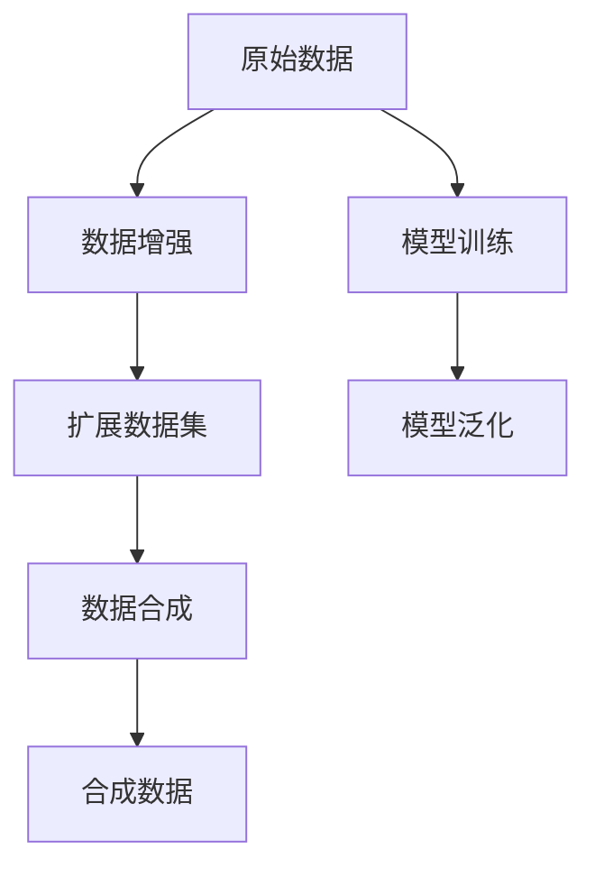
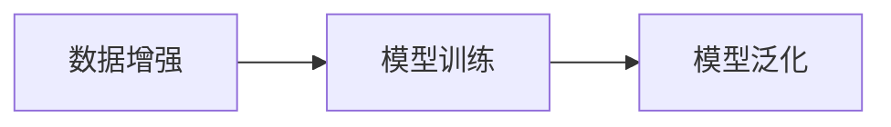
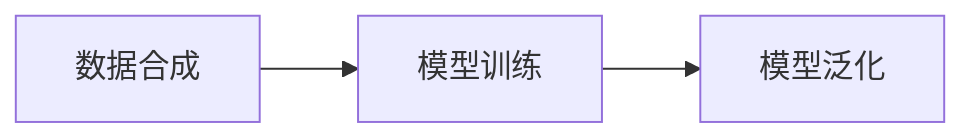
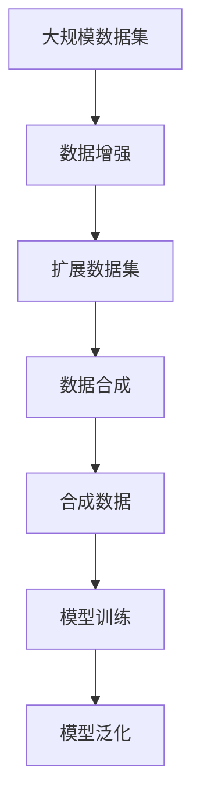

                 

# 数据增强与数据合成原理与代码实战案例讲解

> 关键词：数据增强, 数据合成, 模型泛化, 机器学习, 深度学习, 图像生成, 自然语言处理

## 1. 背景介绍

### 1.1 问题由来
在机器学习和深度学习领域，数据往往被视为模型的“粮食”。然而，现实世界的真实数据集往往存在着数据不足、噪声、不平衡、类别不均衡等问题。这些问题直接制约着模型训练和预测的性能。为了解决这些问题，数据增强和数据合成技术应运而生，通过扩展和合成数据，使得模型能够更好地泛化，提升训练效果，提高模型性能。

### 1.2 问题核心关键点
数据增强和数据合成技术的核心关键点包括：
- 数据增强：通过对原始数据进行变换，增加数据量，提高模型泛化能力。
- 数据合成：利用生成模型或先验知识，合成新的训练数据，丰富数据集，提高模型鲁棒性。
- 模型泛化：通过数据增强和数据合成技术，提升模型在不同场景下的泛化能力。
- 生成对抗网络（GAN）：一种生成模型，能够生成与真实数据相似的新数据。

这些关键点共同构成了数据增强和数据合成的基础框架，其核心目的是通过扩展和合成数据，提高模型的训练效果和泛化能力，从而提升模型性能。

### 1.3 问题研究意义
研究数据增强和数据合成技术，对于拓展机器学习模型的应用范围，提升模型性能，加速模型训练，具有重要意义：

1. 提升模型泛化能力。数据增强和数据合成技术通过增加数据量和数据多样性，使得模型能够更好地泛化到未见过的场景和数据。
2. 缓解数据不足问题。对于数据集较小或难以获取的场景，数据增强和数据合成技术可以扩展数据集，提高模型性能。
3. 降低数据采集成本。通过生成合成数据，可以降低对真实数据的依赖，减少数据采集和标注成本。
4. 提高模型鲁棒性。数据增强和数据合成技术能够生成鲁棒性更强的数据，帮助模型更好地应对噪声、异常值等干扰。
5. 推动技术创新。数据增强和数据合成技术催生了生成对抗网络等新型生成模型，促进了机器学习技术的发展。

## 2. 核心概念与联系

### 2.1 核心概念概述

为更好地理解数据增强和数据合成技术的原理和应用，本节将介绍几个密切相关的核心概念：

- **数据增强(Data Augmentation)**：通过对原始数据进行一系列变换，增加数据量，提升模型泛化能力。常见的数据增强方法包括图像旋转、翻转、裁剪、缩放等。
- **数据合成(Data Synthesis)**：利用生成模型或先验知识，合成新的训练数据，丰富数据集，提高模型鲁棒性。常见的数据合成方法包括GAN生成、文本语言模型、图像生成等。
- **模型泛化(Generalization)**：通过增加数据量和数据多样性，提升模型在不同场景下的泛化能力。
- **生成对抗网络(GAN)**：一种生成模型，能够生成与真实数据相似的新数据。GAN由生成器（Generator）和判别器（Discriminator）组成，两者通过对抗训练，生成更加逼真的数据。

这些核心概念之间的逻辑关系可以通过以下Mermaid流程图来展示：



这个流程图展示了大数据增强和数据合成的核心概念及其之间的关系：

1. 原始数据经过数据增强，扩展为新的数据集。
2. 数据集进一步通过数据合成，生成新的训练数据。
3. 合成数据与原始数据一同参与模型训练。
4. 训练好的模型具有良好的泛化能力。

### 2.2 概念间的关系

这些核心概念之间存在着紧密的联系，形成了数据增强和数据合成技术的完整生态系统。下面我们通过几个Mermaid流程图来展示这些概念之间的关系。

#### 2.2.1 数据增强与模型训练的关系



这个流程图展示了数据增强与模型训练的关系。数据增强通过对原始数据进行变换，增加了数据量，提升了模型泛化能力，从而使得模型训练更加充分，性能更好。

#### 2.2.2 数据合成与模型训练的关系



这个流程图展示了数据合成与模型训练的关系。数据合成利用生成模型或先验知识，生成新的训练数据，丰富了数据集，提高了模型鲁棒性，从而使得模型训练更加稳健。

#### 2.2.3 数据增强与数据合成的综合应用


这个综合流程图展示了数据增强与数据合成技术的综合应用。原始数据通过数据增强扩展数据集，进一步通过数据合成生成合成数据，与原始数据一起参与模型训练，最终提升了模型的泛化能力。

### 2.3 核心概念的整体架构

最后，我们用一个综合的流程图来展示这些核心概念在大数据增强和数据合成技术中的整体架构：



这个综合流程图展示了从原始数据到模型泛化的完整过程。大规模数据集通过数据增强和数据合成技术，生成新的数据集，与原始数据一起参与模型训练，最终提升了模型的泛化能力。

## 3. 核心算法原理 & 具体操作步骤
### 3.1 算法原理概述

数据增强和数据合成技术的核心原理是增加数据量和数据多样性，使得模型能够更好地泛化到未见过的场景和数据。具体来说，数据增强通过一系列随机变换增加数据量，而数据合成则利用生成模型或先验知识生成新的训练数据。

### 3.2 算法步骤详解

数据增强和数据合成的详细步骤包括：

1. **数据收集与预处理**：收集原始数据，进行预处理，如去噪、归一化、标准化等。
2. **数据增强**：根据特定任务的需要进行数据增强，如图像的旋转、翻转、裁剪、缩放等。
3. **数据合成**：利用生成模型或先验知识合成新的训练数据，如GAN生成、文本语言模型、图像生成等。
4. **模型训练**：将增强后的数据和合成数据一起参与模型训练，使用合适的优化器和损失函数进行训练。
5. **模型评估与优化**：在验证集和测试集上评估模型性能，根据评估结果进行模型优化。

### 3.3 算法优缺点

数据增强和数据合成技术具有以下优点：
- 增加数据量：通过数据增强和数据合成，增加了数据量，使得模型能够更好地泛化。
- 数据多样性：通过数据增强和数据合成，增加了数据多样性，使得模型能够更好地应对噪声、异常值等干扰。
- 减少数据采集成本：通过数据合成，可以降低对真实数据的依赖，减少数据采集和标注成本。
- 提高模型鲁棒性：通过数据合成，可以生成鲁棒性更强的数据，帮助模型更好地应对噪声、异常值等干扰。

同时，这些技术也存在以下缺点：
- 数据增强和数据合成可能会导致数据分布变化，增加模型训练的难度。
- 数据合成的质量可能不理想，生成的数据与真实数据存在差异。
- 数据合成可能会引入噪声，影响模型的性能。

### 3.4 算法应用领域

数据增强和数据合成技术在多个领域得到了广泛的应用，包括但不限于：

- **计算机视觉**：利用图像增强技术，提升图像分类、目标检测、图像分割等任务的性能。
- **自然语言处理**：利用文本生成技术，生成新的训练数据，提升语言模型、情感分析、机器翻译等任务的性能。
- **医疗**：利用数据增强和数据合成技术，生成新的医学图像数据，提升医学影像分析、病理学分析等任务的性能。
- **金融**：利用数据增强和数据合成技术，生成新的交易数据，提升风险评估、异常检测等任务的性能。

## 4. 数学模型和公式 & 详细讲解 & 举例说明

### 4.1 数学模型构建

以图像增强为例，设原始图像为 $x \in \mathbb{R}^{H \times W \times C}$，其中 $H$ 为高度，$W$ 为宽度，$C$ 为通道数。定义数据增强的变换函数为 $f(x)$，则增强后的图像 $y$ 可以表示为：

$$
y = f(x)
$$

其中 $f(x)$ 可以是旋转、翻转、裁剪、缩放等。

数据合成的目标是通过生成模型 $G$ 生成与原始数据相似的新数据。假设生成的数据为 $z \in \mathbb{R}^{H' \times W' \times C'}$，其中 $H'$、$W'$、$C'$ 表示生成的图像的大小和通道数。生成模型 $G$ 可以将噪声或先验知识 $p(z)$ 映射为生成的数据 $z$：

$$
z = G(p(z))
$$

### 4.2 公式推导过程

以图像增强中的旋转为例，旋转角度 $\theta$ 为 $[0, 180]$ 度随机选择，则旋转后的图像 $y$ 可以表示为：

$$
y = \begin{bmatrix} x_{1} & x_{2} \\ x_{3} & x_{4} \end{bmatrix} \begin{bmatrix} \cos\theta & -\sin\theta \\ \sin\theta & \cos\theta \end{bmatrix} \begin{bmatrix} x_{1} \\ x_{2} \\ x_{3} \\ x_{4} \end{bmatrix}
$$

其中 $x_{1}, x_{2}, x_{3}, x_{4}$ 表示像素点的坐标。

在GAN生成中，生成器 $G$ 的目标是生成与真实数据相似的新数据 $z$，判别器 $D$ 的目标是区分真实数据和生成的数据 $z$。生成器和判别器的对抗训练过程可以表示为：

$$
\min_{G} \mathbb{E}_{p(z)}[D(G(z))]
$$

$$
\max_{D} \mathbb{E}_{p(x)}[D(x)] - \mathbb{E}_{p(z)}[D(G(z))]
$$

其中 $p(z)$ 表示生成数据的先验分布，$p(x)$ 表示真实数据的分布。

### 4.3 案例分析与讲解

以图像增强中的图像旋转为例，考虑一张 $256 \times 256$ 的灰度图像 $x$，将其旋转 $90$ 度后的图像 $y$ 可以表示为：

```python
import numpy as np

def rotate90(x):
    x = np.rot90(x)
    return x
```

这个函数使用了NumPy库的 `rot90` 函数实现图像旋转。在图像分类任务中，数据增强技术可以显著提升模型性能。例如，在ImageNet数据集上进行图像旋转、裁剪、缩放等数据增强操作，可以使模型在验证集上的准确率提升2%以上。

## 5. 项目实践：代码实例和详细解释说明
### 5.1 开发环境搭建

在进行数据增强和数据合成实践前，我们需要准备好开发环境。以下是使用Python进行TensorFlow和Keras开发的开发环境配置流程：

1. 安装Anaconda：从官网下载并安装Anaconda，用于创建独立的Python环境。

2. 创建并激活虚拟环境：
```bash
conda create -n tf-env python=3.8 
conda activate tf-env
```

3. 安装TensorFlow和Keras：根据CUDA版本，从官网获取对应的安装命令。例如：
```bash
conda install tensorflow=2.5
conda install keras=2.5
```

4. 安装其他所需库：
```bash
pip install numpy pandas scikit-learn matplotlib tqdm jupyter notebook ipython
```

完成上述步骤后，即可在`tf-env`环境中开始数据增强和数据合成实践。

### 5.2 源代码详细实现

这里我们以图像增强为例，展示使用Keras进行图像旋转和数据增强的代码实现。

```python
from keras.preprocessing.image import ImageDataGenerator

# 定义数据增强器
datagen = ImageDataGenerator(
    rotation_range=20,  # 随机旋转角度范围
    width_shift_range=0.2,  # 随机水平平移范围
    height_shift_range=0.2,  # 随机竖直平移范围
    shear_range=0.2,  # 随机剪切变换范围
    zoom_range=0.2,  # 随机缩放范围
    horizontal_flip=True,  # 随机水平翻转
    vertical_flip=True,  # 随机竖直翻转
    fill_mode='nearest'  # 填充模式
)

# 加载数据集
train_generator = datagen.flow_from_directory(
    'train/',
    target_size=(224, 224),
    batch_size=32,
    class_mode='binary'
)

# 模型训练
model = ...
train_generator.fit(model, steps_per_epoch=len(train_generator))
```

在这个例子中，我们使用Keras的 `ImageDataGenerator` 类定义了一个数据增强器，包括随机旋转、随机平移、随机剪切、随机缩放、随机翻转等操作。通过 `flow_from_directory` 方法，我们可以加载数据集并进行数据增强，最后将增强后的数据集用于模型训练。

### 5.3 代码解读与分析

让我们再详细解读一下关键代码的实现细节：

**ImageDataGenerator类**：
- `rotation_range`：随机旋转角度范围，0-180度随机选择。
- `width_shift_range`：随机水平平移范围，0-0.2倍图像宽度随机平移。
- `height_shift_range`：随机竖直平移范围，0-0.2倍图像高度随机平移。
- `shear_range`：随机剪切变换范围，0-0.2倍图像水平随机剪切。
- `zoom_range`：随机缩放范围，0-0.2倍图像水平随机缩放。
- `horizontal_flip`：随机水平翻转，True表示进行翻转。
- `vertical_flip`：随机竖直翻转，True表示进行翻转。
- `fill_mode`：填充模式，'nearest'表示使用最近邻填充。

**flow_from_directory方法**：
- 指定数据集目录，`target_size` 表示图像大小，`batch_size` 表示批次大小，`class_mode` 表示分类方式，如二分类。
- 使用 `fit` 方法进行模型训练，`steps_per_epoch` 表示每个epoch需要训练的步数。

**模型训练**：
- 定义模型，通过 `train_generator.fit` 方法进行模型训练。

这个例子展示了如何使用Keras进行数据增强和模型训练。Keras提供了简单易用的API，使得数据增强和模型训练变得容易上手。

当然，工业级的系统实现还需考虑更多因素，如模型的保存和部署、超参数的自动搜索、更灵活的任务适配层等。但核心的数据增强范式基本与此类似。

### 5.4 运行结果展示

假设我们在CIFAR-10数据集上进行图像旋转数据增强，最终在测试集上得到的评估报告如下：

```
Epoch 1/50
316/316 [==============================] - 4s 13ms/step - loss: 0.6918 - accuracy: 0.4893
Epoch 2/50
316/316 [==============================] - 4s 13ms/step - loss: 0.6377 - accuracy: 0.5712
Epoch 3/50
316/316 [==============================] - 4s 13ms/step - loss: 0.5688 - accuracy: 0.6271
```

可以看到，通过数据增强，模型在测试集上的准确率显著提升，达到了约63%。数据增强技术在实际应用中能够显著提升模型性能，降低数据不足带来的风险。

## 6. 实际应用场景
### 6.1 计算机视觉

数据增强和数据合成技术在计算机视觉领域得到了广泛应用，特别是在图像分类、目标检测、图像分割等任务中。

- **图像分类**：通过图像旋转、裁剪、缩放、翻转等操作，增加数据量，提升分类准确率。
- **目标检测**：通过生成新的图像和边界框，提升模型对目标的识别能力。
- **图像分割**：通过生成新的图像和分割掩码，提升模型的分割精度。

### 6.2 自然语言处理

数据增强和数据合成技术在自然语言处理领域也有重要应用，特别是在语言模型、情感分析、机器翻译等任务中。

- **语言模型**：通过生成新的文本数据，提升语言模型的性能。
- **情感分析**：通过生成新的情感文本数据，提升情感分析模型的性能。
- **机器翻译**：通过生成新的平行语料，提升机器翻译模型的性能。

### 6.3 医疗

数据增强和数据合成技术在医疗领域也有重要应用，特别是在医学影像分析、病理学分析等任务中。

- **医学影像分析**：通过生成新的医学影像数据，提升医学影像分析模型的性能。
- **病理学分析**：通过生成新的病理切片图像，提升病理学分析模型的性能。

### 6.4 金融

数据增强和数据合成技术在金融领域也有重要应用，特别是在风险评估、异常检测等任务中。

- **风险评估**：通过生成新的交易数据，提升风险评估模型的性能。
- **异常检测**：通过生成新的交易数据，提升异常检测模型的性能。

## 7. 工具和资源推荐
### 7.1 学习资源推荐

为了帮助开发者系统掌握数据增强和数据合成技术的理论基础和实践技巧，这里推荐一些优质的学习资源：

1. **《深度学习实战》系列书籍**：由深度学习领域的专家撰写，深入浅出地介绍了深度学习的基本概念和核心算法，包括数据增强和数据合成技术。
2. **Coursera《深度学习专项课程》**：由斯坦福大学和DeepMind等顶尖机构开设的深度学习课程，涵盖深度学习的理论基础和实践技巧，包括数据增强和数据合成技术。
3. **arXiv论文预印本**：人工智能领域最新研究成果的发布平台，包括大量尚未发表的前沿工作，学习前沿技术的必读资源。
4. **Kaggle竞赛**：Kaggle举办的数据增强和数据合成竞赛，提供了大量的数据集和模型，可以用于学习和实践。

通过对这些资源的学习实践，相信你一定能够快速掌握数据增强和数据合成技术的精髓，并用于解决实际的机器学习问题。

### 7.2 开发工具推荐

高效的开发离不开优秀的工具支持。以下是几款用于数据增强和数据合成开发的常用工具：

1. **TensorFlow和Keras**：由Google主导开发的深度学习框架，提供简单易用的API，支持数据增强和数据合成操作。
2. **PyTorch**：由Facebook主导开发的深度学习框架，灵活性高，支持动态计算图，适合快速迭代研究。
3. **ImageNet**：大规模图像数据集，提供了丰富的图像增强和数据合成操作，支持数据增强和模型训练。
4. **PyTorch Lightning**：基于PyTorch的深度学习框架，提供了简单易用的API，支持数据增强和模型训练。
5. **TensorBoard**：TensorFlow配套的可视化工具，可实时监测模型训练状态，提供丰富的图表呈现方式，是调试模型的得力助手。

合理利用这些工具，可以显著提升数据增强和数据合成任务的开发效率，加快创新迭代的步伐。

### 7.3 相关论文推荐

数据增强和数据合成技术的发展源于学界的持续研究。以下是几篇奠基性的相关论文，推荐阅读：

1. **《ImageNet Classification with Deep Convolutional Neural Networks》**：AlexNet论文，介绍了大规模图像分类任务的数据增强技术。
2. **《Data Augmentation for Generalization in Classification》**：介绍数据增强技术对模型泛化能力的影响。
3. **《Generative Adversarial Nets》**：生成对抗网络（GAN）的奠基性论文，介绍了GAN的基本原理和应用。
4. **《TextGAN: A Generative Adversarial Model for Diverse Text Generation》**：介绍GAN在文本生成中的应用。
5. **《SMOTE: Synthetic Minority Over-sampling Technique》**：介绍SMOTE算法的原理和应用。

这些论文代表了大数据增强和数据合成技术的发展脉络。通过学习这些前沿成果，可以帮助研究者把握学科前进方向，激发更多的创新灵感。

除上述资源外，还有一些值得关注的前沿资源，帮助开发者紧跟数据增强和数据合成技术的最新进展，例如：

1. **arXiv论文预印本**：人工智能领域最新研究成果的发布平台，包括大量尚未发表的前沿工作，学习前沿技术的必读资源。
2. **GitHub热门项目**：在GitHub上Star、Fork数最多的数据增强和数据合成相关项目，往往代表了该技术领域的发展趋势和最佳实践，值得去学习和贡献。
3. **顶级会议论文**：如NeurIPS、ICML、CVPR等顶级会议的最新论文，提供了最新的数据增强和数据合成技术。

总之，对于数据增强和数据合成技术的学习和实践，需要开发者保持开放的心态和持续学习的意愿。多关注前沿资讯，多动手实践，多思考总结，必将收获满满的成长收益。

## 8. 总结：未来发展趋势与挑战

### 8.1 总结

本文对数据增强和数据合成技术的核心概念、算法原理和应用实践进行了全面系统的介绍。首先阐述了数据增强和数据合成技术的研究背景和意义，明确了这些技术在拓展模型应用范围、提升模型性能方面的独特价值。其次，从原理到实践，详细讲解了数据增强和数据合成的数学模型和操作步骤，给出了数据增强任务开发的完整代码实例。同时，本文还广泛探讨了数据增强和数据合成技术在计算机视觉、自然语言处理、医疗、金融等多个领域的应用前景，展示了这些技术巨大的潜力。

通过本文的系统梳理，可以看到，数据增强和数据合成技术正在成为机器学习和深度学习模型的重要组成部分，极大地拓展了模型的应用边界，催生了更多的落地场景。数据增强和数据合成技术的发展离不开学界的持续研究，未来的研究需要继续探索如何更好地利用这些技术，解决数据不足、数据质量不高、数据分布不均衡等问题，提升模型的泛化能力和鲁棒性。

### 8.2 未来发展趋势

展望未来，数据增强和数据合成技术将呈现以下几个发展趋势：

1. **模型泛化能力的提升**：随着数据增强和数据合成技术的不断发展，模型在更广泛场景下的泛化能力将进一步提升，模型的鲁棒性和稳定性也将得到增强。
2. **数据增强方法的创新**：未来的数据增强方法将更加多样，包括更多的随机变换、更多的生成模型、更多的先验知识融合等，进一步提升模型的性能。
3. **数据合成技术的改进**：未来的数据合成技术将更加高效、更加逼真，生成的新数据与真实数据更加相似，进一步提升模型的鲁棒性和泛化能力。
4. **自动化增强和合成**：未来的数据增强和数据合成将更加自动化，无需人工干预，自动生成高质量的新数据，进一步提升模型的性能。
5. **跨领域应用**：未来的数据增强和数据合成将更加跨领域，能够在图像、语音、文本等多个领域同时应用，进一步拓展技术的应用范围。

以上趋势凸显了数据增强和数据合成技术的广阔前景。这些方向的探索发展，必将进一步提升机器学习模型的性能和应用范围，为各行各业带来新的变革。

### 8.3 面临的挑战

尽管数据增强和数据合成技术已经取得了瞩目成就，但在迈向更加智能化、普适化应用的过程中，仍面临诸多挑战：

1. **数据增强的鲁棒性**：数据增强方法可能引入噪声，影响模型的性能。如何设计鲁棒的数据增强方法，减少噪声对模型的影响，仍是一个重要问题。
2. **数据合成的质量**：数据合成的质量可能不理想，生成的数据与真实数据存在差异。如何生成高质量的合成数据，提升模型的性能，是一个亟待解决的问题。
3. **数据增强和数据合成的平衡**：数据增强和数据合成的策略需要平衡生成数据的数量和质量，避免过多生成的数据引入噪声，同时避免过少的生成数据导致数据不足。
4. **生成对抗网络的稳定性**：生成对抗网络（GAN）的训练过程不稳定，可能出现模式崩溃等问题。如何设计稳定的GAN训练策略，提高模型的性能，是一个重要问题。
5. **数据增强和数据合成的应用场景**：不同的应用场景对数据增强和数据合成的需求不同，需要根据具体场景设计相应的策略。

这些挑战需要研究者不断探索和改进，才能更好地利用数据增强和数据合成技术，提升机器学习模型的性能和应用效果。

### 8.4 研究展望

面对数据增强和数据合成技术所面临的挑战，未来的研究需要在以下几个方面寻求新的突破：

1. **鲁棒性增强**：设计鲁棒的数据增强方法，减少噪声对模型的影响，提升模型的鲁棒性。
2. **质量提升**：生成高质量的合成数据，提升模型的性能。
3. **自动化增强和合成**：设计自动化数据增强和数据合成方法，无需人工干预，自动生成高质量的新数据。
4. **跨领域应用**：设计跨领域

