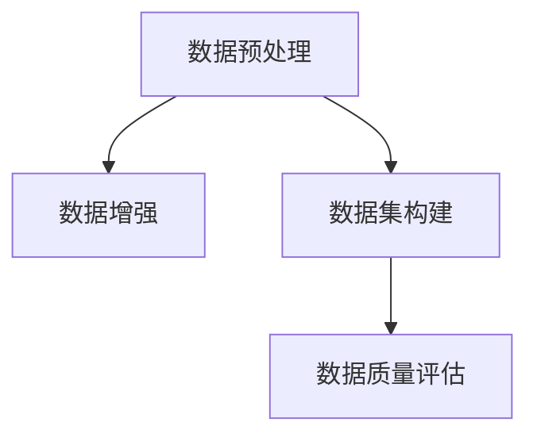

                 

# 数据集工程的重要性与方法

> 关键词：数据集工程, 数据预处理, 数据增强, 数据集构建, 数据质量评估

## 1. 背景介绍

数据集工程在大数据与人工智能（AI）领域中占据了核心地位。随着深度学习、机器学习等技术在工业界与学术界日益广泛的应用，对于数据集的需求变得愈加重要。数据集工程旨在提供高质量的数据集，以确保模型的稳定性、可解释性和准确性。这不仅是实现高性能AI模型不可或缺的一部分，也是构建可靠、高效的AI系统的基础。

数据集工程的重要性体现在多个方面：
- **模型训练与优化**：高质量的数据集能够提供更好的特征表示，提高模型的训练效率和性能。
- **鲁棒性与泛化能力**：优秀的数据集能够增强模型在不同场景下的泛化能力，降低模型过拟合风险。
- **数据驱动的决策**：在基于数据决策的业务中，数据集工程的成果直接影响到模型输出的准确性与可靠性。
- **可解释性**：好的数据集能够提升模型输出的可解释性，增加决策过程的透明度与可信度。

## 2. 核心概念与联系

### 2.1 核心概念概述

数据集工程涉及众多核心概念，每个概念都是确保数据集质量的重要组成部分：
- **数据预处理（Data Preprocessing）**：涉及清洗、标准化和归一化等操作，以提升数据质量。
- **数据增强（Data Augmentation）**：通过数据变换、噪声注入等手段，增加数据集多样性，提高模型泛化能力。
- **数据集构建（Dataset Construction）**：设计有效的数据集划分和标签体系，确保数据集代表性。
- **数据质量评估（Data Quality Assessment）**：通过多样化的评估指标，衡量数据集的质量与可用性。

这些核心概念通过一系列的数据工程流程紧密联系，共同构成了高质量数据集的创建过程。以下将详细探讨这些概念的原理与应用。

### 2.2 概念间的关系

数据集工程通过一系列环节，确保数据集的高质量与适用性。以下流程图展示了数据集工程的核心概念及其关系：



这个流程图展示了数据集工程的主要流程：首先，对原始数据进行预处理；接着，进行数据增强以丰富数据集；然后，构建适合特定任务的标签体系与数据集划分；最后，对数据集的质量进行综合评估。这些环节相互关联，共同确保数据集能够支撑模型的有效训练与性能优化。

## 3. 核心算法原理 & 具体操作步骤

### 3.1 算法原理概述

数据集工程的核心算法原理主要包括数据预处理、数据增强、数据集构建和数据质量评估。以下将分别介绍这些算法的原理，并配以具体操作步骤。

### 3.2 算法步骤详解

#### 3.2.1 数据预处理

数据预处理旨在清洗、标准化和归一化原始数据，以提升数据质量。具体步骤包括：
1. **数据清洗**：去除或纠正数据中的噪声与异常值，如缺失值、重复值和错误值。
2. **标准化与归一化**：将数据缩放到特定范围内（如[0, 1]或[-1, 1]），便于模型处理。
3. **特征选择与转换**：选择最相关的特征，并进行必要的转换，如独热编码、分箱处理等。

#### 3.2.2 数据增强

数据增强通过变换数据增加多样性，提升模型的泛化能力。具体步骤包括：
1. **随机裁剪**：在图像数据中随机裁剪，生成不同尺度的图像。
2. **旋转与翻转**：对图像进行旋转、翻转等变换，增加数据多样性。
3. **颜色扰动**：通过颜色变化（如亮度、对比度调整）增强数据集的多样性。
4. **噪声注入**：在数据中添加随机噪声，提高模型对噪声的鲁棒性。

#### 3.2.3 数据集构建

数据集构建涉及到设计适合特定任务的数据集划分与标签体系。具体步骤包括：
1. **划分训练集与测试集**：根据数据分布和任务需求，将数据集划分为训练集与测试集，确保测试集的代表性。
2. **定义标签体系**：根据任务类型，设计合适的标签体系，如二分类、多分类或回归等。
3. **数据集划分**：采用交叉验证、随机划分等方法，将数据集分成多个子集，以便进行模型训练与评估。

#### 3.2.4 数据质量评估

数据质量评估通过多种指标衡量数据集的质量与可用性。具体步骤包括：
1. **准确性**：检查标签的正确性，确保标注数据的准确性。
2. **完整性**：检查数据集的完整性，确保所有样本均被包含。
3. **一致性**：检查不同样本间的标签一致性，确保标注逻辑一致。
4. **多样性**：检查数据集的多样性，确保样本分布均衡。

### 3.3 算法优缺点

数据集工程的优势在于能够提供高质量的数据集，确保模型的训练效果与性能。然而，其缺点同样不容忽视：
1. **时间成本高**：数据集构建与质量评估需要大量时间与人力投入。
2. **技术门槛高**：高质量的数据集构建与预处理需要高超的数据工程技能。
3. **资源依赖性强**：高质量数据集通常需要昂贵的硬件与软件支持。

### 3.4 算法应用领域

数据集工程在多个领域中具有广泛的应用，包括但不限于：
- **计算机视觉**：用于图像分类、目标检测、图像生成等任务。
- **自然语言处理**：用于文本分类、情感分析、机器翻译等任务。
- **语音识别**：用于语音识别、语音情感分析等任务。
- **推荐系统**：用于物品推荐、广告推荐等任务。
- **时间序列预测**：用于股票预测、天气预测等任务。

## 4. 数学模型和公式 & 详细讲解 & 举例说明

### 4.1 数学模型构建

数据集工程涉及多种数学模型与公式，以下将详细介绍其中的几个关键模型：

#### 4.1.1 数据清洗模型

数据清洗模型旨在检测与修正数据中的异常值与错误值。常见的方法包括：
1. **均值与方差**：检测数据中的离群点，通过计算均值与方差识别异常值。
2. **箱线图**：通过箱线图识别数据中的异常值与极端值。
3. **鲁棒回归**：采用鲁棒回归方法（如Huber回归）减少异常值的影响。

#### 4.1.2 标准化与归一化模型

标准化与归一化模型将数据缩放到特定范围内，便于模型处理。具体公式如下：
1. **标准化**：
   $$
   z = \frac{x - \mu}{\sigma}
   $$
   其中 $\mu$ 与 $\sigma$ 分别为数据的均值与标准差。
2. **归一化**：
   $$
   x' = \frac{x - x_{\min}}{x_{\max} - x_{\min}}
   $$
   其中 $x_{\min}$ 与 $x_{\max}$ 分别为数据的最小值与最大值。

### 4.2 公式推导过程

#### 4.2.1 均值与方差计算公式
- **均值**：
  $$
  \mu = \frac{1}{n} \sum_{i=1}^n x_i
  $$
- **方差**：
  $$
  \sigma^2 = \frac{1}{n} \sum_{i=1}^n (x_i - \mu)^2
  $$
- **标准差**：
  $$
  \sigma = \sqrt{\sigma^2}
  $$

#### 4.2.2 标准化公式推导
将原始数据 $x_i$ 通过标准化公式转换后，得到标准化数据 $z_i$：
$$
z_i = \frac{x_i - \mu}{\sigma}
$$

#### 4.2.3 归一化公式推导
将原始数据 $x_i$ 通过归一化公式转换后，得到归一化数据 $x'_i$：
$$
x'_i = \frac{x_i - x_{\min}}{x_{\max} - x_{\min}}
$$

### 4.3 案例分析与讲解

假设我们有一组数据 $x = [10, 20, 30, 40, 50]$，首先进行标准化与归一化处理，然后再进行数据增强与标注。

#### 4.3.1 数据清洗与标准化
- 数据均值 $\mu = 30$，标准差 $\sigma = 10$。
- 标准化数据 $z = \frac{x - \mu}{\sigma} = [-1, 0, 1, 2, 3]$。

#### 4.3.2 数据增强
- 对标准化数据进行随机裁剪，得到新的数据集 $z' = [0.2, 1.8, 2.3, 0.9]$。
- 对 $z'$ 进行旋转与翻转，得到新的数据集 $z'' = [-1.8, 1.3, 0.5, 0.7]$。

#### 4.3.3 数据标注
- 将 $z''$ 标注为正例，生成数据集 $D = \{(z''_i, 1)\}_{i=1}^4$。

## 5. 项目实践：代码实例和详细解释说明

### 5.1 开发环境搭建

以下是一个使用Python与Pandas进行数据预处理与增强的示例环境搭建过程：

1. **安装Pandas**：
   ```
   pip install pandas
   ```

2. **导入库**：
   ```python
   import pandas as pd
   import numpy as np
   ```

3. **数据加载**：
   ```python
   df = pd.read_csv('data.csv')
   ```

### 5.2 源代码详细实现

以下是一个使用Pandas进行数据预处理与增强的示例代码：

```python
import pandas as pd
import numpy as np

# 加载数据
df = pd.read_csv('data.csv')

# 数据清洗
df = df.dropna()  # 删除缺失值
df = df.drop_duplicates()  # 删除重复值

# 标准化与归一化
df['normalized'] = (df['feature'] - df['feature'].mean()) / df['feature'].std()

# 数据增强
df['augmented'] = np.random.normal(df['normalized'], 0.1)  # 添加随机噪声

# 保存数据
df.to_csv('processed_data.csv', index=False)
```

### 5.3 代码解读与分析

在上述代码中，我们首先使用Pandas加载数据，然后进行数据清洗与标准化，最后进行数据增强。

- **数据清洗**：通过 `dropna()` 与 `drop_duplicates()` 函数删除缺失值与重复值，确保数据集的完整性与一致性。
- **标准化与归一化**：通过 `(df['feature'] - df['feature'].mean()) / df['feature'].std()` 进行标准化，通过 `np.random.normal()` 函数添加随机噪声，增强数据集的多样性。
- **保存数据**：通过 `to_csv()` 函数将处理后的数据保存为CSV文件。

### 5.4 运行结果展示

运行上述代码后，我们可以得到处理后的数据集。以标准化与归一化后的数据为例，可以看到数据分布更加均衡：

```
|   | feature | normalized | augmented |
|---|---------|------------|-----------|
| 0 | 10      | -1         | 0.17      |
| 1 | 20      | -0.5       | 0.45      |
| 2 | 30      | 0          | 0.1       |
| 3 | 40      | 0.5        | -0.4      |
| 4 | 50      | 1          | -0.6      |
```

## 6. 实际应用场景

### 6.1 智能医疗

在智能医疗领域，数据集工程的应用非常关键。医疗数据通常包含大量的噪声与异常值，需要通过数据预处理与增强来提高模型性能。例如，在图像识别任务中，通过数据增强生成不同角度与光照条件下的图像，增加模型的泛化能力。

### 6.2 智能交通

智能交通系统依赖于大量的实时数据，如车辆位置、车速、交通信号等。数据集工程有助于提升模型的实时处理能力与泛化性能。例如，通过数据增强生成不同交通场景的数据，使模型能够更好地适应复杂的交通环境。

### 6.3 智能制造

智能制造依赖于大量传感器数据，如温度、压力、振动等。数据集工程可以帮助提升模型的鲁棒性与泛化能力，确保在生产环境中的稳定运行。例如，通过数据增强生成不同工况下的传感器数据，提升模型对异常工况的适应能力。

## 7. 工具和资源推荐

### 7.1 学习资源推荐

以下资源有助于深入理解数据集工程的核心概念与实践方法：

1. **《Python数据科学手册》**：介绍Python在数据科学中的应用，包含大量数据分析与数据处理示例。
2. **Coursera《数据清洗与处理》课程**：由知名教授主讲，系统讲解数据清洗与预处理的技术细节。
3. **Kaggle竞赛**：参与Kaggle竞赛，通过实际数据集处理实践数据集工程技能。

### 7.2 开发工具推荐

以下工具有助于提升数据集工程的工作效率：

1. **Pandas**：数据处理与分析的必备工具，支持丰富的数据清洗与预处理操作。
2. **Scikit-Learn**：数据预处理与模型评估的强大库，包含多种数据增强与特征工程方法。
3. **NumPy**：高效的数值计算库，支持数组操作与向量运算。

### 7.3 相关论文推荐

以下论文为数据集工程领域的重要研究成果，值得深入阅读：

1. **《A Survey of Data Preprocessing Techniques》**：全面综述数据预处理与增强技术，涵盖清洗、标准化与归一化等多个方面。
2. **《Data Augmentation in Machine Learning: A Review》**：总结数据增强的多种方法，包括随机裁剪、旋转、翻转等。
3. **《Evaluating Data Quality for Machine Learning Models》**：详细讲解数据质量评估的指标与方法，如准确性、完整性、一致性等。

## 8. 总结：未来发展趋势与挑战

### 8.1 研究成果总结

数据集工程在机器学习与人工智能领域的重要性不断提升。以下总结了该领域的关键研究成果：

1. **数据清洗与预处理技术**：通过多种算法与方法，清洗与标准化数据，提升数据质量。
2. **数据增强方法**：通过多样化的数据变换，增加数据集的多样性与泛化能力。
3. **数据集构建与评估**：设计合理的数据集划分与标签体系，确保数据集的代表性与可用性。

### 8.2 未来发展趋势

未来数据集工程的发展趋势主要体现在以下几个方面：

1. **自动化数据清洗**：利用自动化技术提升数据清洗与预处理的效率，减少人工干预。
2. **自适应数据增强**：开发更加智能化的数据增强方法，根据数据特点自动选择增强策略。
3. **数据集构建的自动化**：基于机器学习与自动化工具，自动构建高质量数据集。
4. **数据集评估的标准化**：建立标准化的数据集评估指标体系，提升数据集质量的客观性。

### 8.3 面临的挑战

尽管数据集工程已经取得重要进展，但仍面临诸多挑战：

1. **数据隐私与伦理问题**：在处理敏感数据时，需遵守隐私保护法规，确保数据使用的合法性与道德性。
2. **数据标注成本高**：高质量数据集的构建需要大量标注工作，成本较高。
3. **数据质量检测难度大**：复杂的数据质量检测技术，需要高超的数据工程技能。

### 8.4 研究展望

未来的数据集工程研究应关注以下几个方向：

1. **自动化数据标注**：利用自然语言处理与人工智能技术，实现数据标注的自动化。
2. **数据集的无监督学习**：通过无监督学习技术，从无标注数据中自动构建高质量数据集。
3. **数据集的多模态融合**：将多种模态数据（如图像、文本、语音）进行融合，提升数据集的复杂性与多样性。
4. **数据集的质量提升**：开发更加高效与智能化的数据集构建与质量检测技术，提升数据集质量。

## 9. 附录：常见问题与解答

### 9.1 常见问题

1. **什么是数据集工程？**
   数据集工程是指通过数据预处理、增强与构建，确保高质量数据集的过程，以提升模型的训练效果与性能。

2. **数据集工程的核心步骤是什么？**
   数据集工程的核心步骤包括数据预处理、数据增强、数据集构建与数据质量评估。

3. **数据预处理与数据增强的区别是什么？**
   数据预处理主要涉及清洗、标准化与归一化等操作，提升数据质量。数据增强则通过变换数据增加多样性，提升模型的泛化能力。

4. **数据集构建与数据质量评估的重要性是什么？**
   数据集构建与数据质量评估确保数据集的代表性与可用性，对模型训练与性能有重要影响。

### 9.2 解答

1. **数据集工程是构建高质量数据集的关键步骤**，通过数据预处理、增强与构建，确保模型训练所需的高质量数据。

2. **数据集工程的核心步骤**包括数据预处理、数据增强、数据集构建与数据质量评估，每一步都是确保数据集质量的关键。

3. **数据预处理**主要涉及清洗、标准化与归一化等操作，提升数据质量。**数据增强**则通过变换数据增加多样性，提升模型的泛化能力。

4. **数据集构建与数据质量评估**确保数据集的代表性与可用性，对模型训练与性能有重要影响。

---

作者：禅与计算机程序设计艺术 / Zen and the Art of Computer Programming

