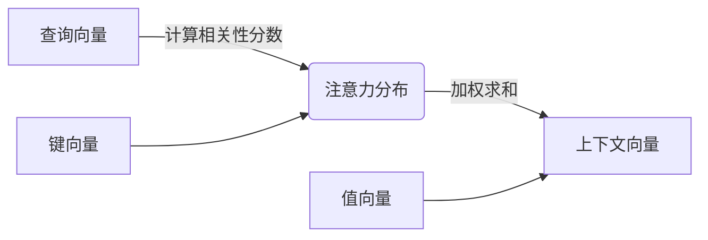
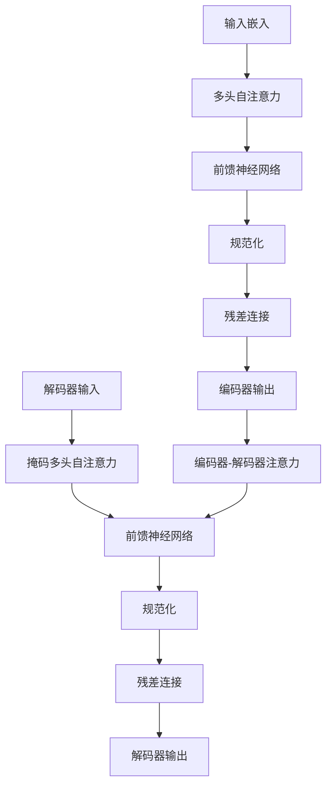

# 从零开始大模型开发与微调：从1开始自然语言处理的解码器

## 1. 背景介绍

### 1.1 问题的由来

在自然语言处理 (NLP) 领域,生成式模型一直是研究的重点和难点。作为一种强大的生成模型,Transformer 及其变种在诸如机器翻译、文本摘要、对话系统等任务中取得了卓越的成绩。然而,训练这些大型模型需要大量的计算资源,对于个人开发者和中小型企业来说,成本高昂且获取预训练权重困难重重。因此,从零开始训练自己的生成式模型,并根据特定需求对其进行微调,成为了一个极具吸引力的选择。

### 1.2 研究现状

目前,开源的 Transformer 模型代码虽然有许多,但大多数都是针对特定任务的实现,缺乏通用性和可扩展性。此外,这些代码库通常假设用户已经对 Transformer 架构有深入的理解,缺少从零开始构建模型的详细指导。因此,为个人开发者和小型团队提供一个全面的、从入门到实践的教程,对于降低大模型开发的门槛至关重要。

### 1.3 研究意义

本文旨在为读者提供一个完整的路线图,指导他们从零开始构建自己的生成式 Transformer 模型,并根据具体需求对模型进行微调。通过深入探讨 Transformer 的核心概念、算法原理、数学模型,以及实际代码实现,读者将能够全面掌握大模型开发的方方面面。此外,本文还将介绍模型微调的最佳实践,以及在实际应用场景中的注意事项。

### 1.4 本文结构

本文将按照以下结构展开:

1. 背景介绍
2. 核心概念与联系
3. 核心算法原理与具体操作步骤
4. 数学模型和公式详细讲解与举例说明
5. 项目实践:代码实例和详细解释说明
6. 实际应用场景
7. 工具和资源推荐
8. 总结:未来发展趋势与挑战
9. 附录:常见问题与解答

## 2. 核心概念与联系

在深入探讨 Transformer 模型之前,我们需要先了解一些核心概念,它们是构建生成式模型的基础。

### 2.1 序列到序列模型 (Seq2Seq)

Seq2Seq 模型是一种将一个序列 (如自然语言文本) 映射到另一个序列的模型。它广泛应用于机器翻译、文本摘要、对话系统等任务。Seq2Seq 模型通常由两部分组成:编码器 (Encoder) 和解码器 (Decoder)。

### 2.2 注意力机制 (Attention)

注意力机制是 Seq2Seq 模型中的一个关键组成部分,它允许模型在生成输出序列时,selectively 关注输入序列的不同部分。这种机制大大提高了模型的性能,尤其是在处理长序列时。

### 2.3 Transformer 架构

Transformer 是一种全新的基于注意力机制的 Seq2Seq 模型架构,它完全放弃了 RNN 和 CNN,使用多头自注意力 (Multi-Head Self-Attention) 和前馈神经网络 (Feed-Forward Neural Network) 构建编码器和解码器。这种全新的架构显著提高了模型的并行性能,成为了当前 NLP 领域的主流方向。

### 2.4 预训练与微调

为了提高模型的泛化能力和性能,通常需要在大规模无标注语料库上预训练 Transformer 模型,获得一个通用的语言表示。然后,可以在特定的下游任务上对预训练模型进行微调 (fine-tuning),使其适应特定的任务需求。这种预训练 + 微调的范式已经成为 NLP 领域的主流做法。

## 3. 核心算法原理与具体操作步骤

### 3.1 算法原理概述

Transformer 的核心算法原理是基于自注意力 (Self-Attention) 机制的。与 RNN 和 CNN 不同,自注意力允许模型直接对输入序列中的任何两个位置进行建模,捕捉它们之间的长程依赖关系。这种全局依赖建模的能力使得 Transformer 在处理长序列时表现出色。

自注意力的计算过程可以概括为三个核心步骤:

1. 计算查询 (Query)、键 (Key) 和值 (Value) 向量
2. 计算查询与所有键的相似性分数 (注意力分数)
3. 使用注意力分数对值向量进行加权求和,得到上下文向量

多头自注意力 (Multi-Head Attention) 则是将多个注意力头的结果进行拼接,以捕捉不同的依赖关系模式。

除了自注意力层,Transformer 还包括前馈神经网络、残差连接和层归一化等组件,以提高模型的表达能力和训练稳定性。

### 3.2 算法步骤详解

现在,让我们更详细地探讨 Transformer 的算法步骤:

1. **输入嵌入**

   首先,将输入序列 (如自然语言文本) 映射到一个连续的向量空间,得到输入嵌入序列。

2. **位置编码**

   由于 Transformer 没有循环或卷积结构,因此需要一些方式来注入序列的位置信息。常见的做法是将位置编码向量与输入嵌入相加。

3. **编码器**

   编码器由 N 个相同的层组成,每一层都包括以下子层:

   - 多头自注意力层
   - 前馈神经网络层
   - 残差连接
   - 层归一化

   自注意力层允许每个位置的输出与输入序列的所有位置进行交互,捕捉长程依赖关系。前馈神经网络则对每个位置的表示进行独立的非线性转换。残差连接和层归一化则用于促进梯度传播和训练稳定性。

4. **解码器**

   解码器的结构与编码器类似,但有两个主要区别:

   - 解码器中的自注意力层被掩码,以保证在生成序列时,每个位置只能关注之前的位置,而不能关注未来的位置。
   - 解码器还包含一个额外的注意力层,用于关注编码器的输出,实现编码器-解码器注意力。

5. **生成输出**

   最终,解码器的输出通过一个线性层和 softmax 层,生成目标序列的概率分布。在生成式任务中,可以使用贪婪搜索或beam search等解码策略,从概率分布中生成最终的输出序列。

### 3.3 算法优缺点

**优点**:

- 高度并行化,可以充分利用现代硬件 (GPU/TPU) 的并行计算能力。
- 能够有效捕捉长程依赖关系,在处理长序列时表现出色。
- 模型结构简单,相对容易理解和实现。
- 预训练 + 微调范式使得模型可以在多个下游任务上取得良好表现。

**缺点**:

- 计算开销较大,尤其是在处理长序列时,注意力计算的复杂度会急剧增加。
- 缺乏对位置和结构信息的直接建模能力,需要依赖位置编码等辅助机制。
- 生成式任务中存在曝光偏差问题,即训练和推理阶段的数据分布不一致。
- 预训练过程需要大量计算资源和无标注语料,对个人开发者和小型团队来说,可能是一个挑战。

### 3.4 算法应用领域

Transformer 及其变种已经在诸多 NLP 任务中取得了卓越的成绩,包括但不限于:

- 机器翻译
- 文本摘要
- 文本生成 (如新闻、故事、诗歌等)
- 对话系统
- 问答系统
- 代码生成
- 蛋白质结构预测

除了 NLP 领域,Transformer 也开始在计算机视觉、语音识别、强化学习等其他领域发挥作用。可以说,Transformer 是当前人工智能领域最成功和最有影响力的模型之一。

## 4. 数学模型和公式详细讲解与举例说明

在本节中,我们将深入探讨 Transformer 模型中的数学模型和公式,并通过具体案例进行讲解和说明。

### 4.1 数学模型构建

#### 4.1.1 注意力机制 (Attention)

注意力机制是 Transformer 模型的核心,它允许模型在生成输出序列时,selectively 关注输入序列的不同部分。注意力分数的计算公式如下:

$$
\text{Attention}(Q, K, V) = \text{softmax}\left(\frac{QK^T}{\sqrt{d_k}}\right)V
$$

其中:

- $Q$ 是查询向量 (Query)
- $K$ 是键向量 (Key)
- $V$ 是值向量 (Value)
- $d_k$ 是缩放因子,用于防止内积过大导致的梯度饱和

通过计算查询向量与所有键向量的相似性分数 (注意力分数),然后使用这些分数对值向量进行加权求和,我们可以得到上下文向量,它编码了输入序列中与当前位置相关的信息。

#### 4.1.2 多头自注意力 (Multi-Head Attention)

为了捕捉不同的依赖关系模式,Transformer 使用了多头自注意力机制。具体来说,查询、键和值向量首先通过线性投影被分割为 $h$ 个头,每个头都会独立计算注意力,最后将所有头的结果拼接起来:

$$
\text{MultiHead}(Q, K, V) = \text{Concat}(\text{head}_1, \dots, \text{head}_h)W^O
$$

其中 $\text{head}_i = \text{Attention}(QW_i^Q, KW_i^K, VW_i^V)$, 而 $W_i^Q$、$W_i^K$、$W_i^V$ 和 $W^O$ 都是可学习的线性投影参数。

通过多头注意力机制,Transformer 能够同时关注不同的位置和不同的表示子空间,提高了模型的表达能力。

#### 4.1.3 前馈神经网络 (Feed-Forward Network)

除了注意力子层,Transformer 的每个编码器和解码器层还包含一个前馈神经网络子层,它对每个位置的表示进行独立的非线性转换:

$$
\text{FFN}(x) = \max(0, xW_1 + b_1)W_2 + b_2
$$

其中 $W_1$、$b_1$、$W_2$ 和 $b_2$ 都是可学习的参数。这个前馈神经网络为模型引入了额外的非线性能力,有助于捕捉更复杂的特征。

#### 4.1.4 残差连接和层归一化

为了促进梯度传播和提高训练稳定性,Transformer 在每个子层之后应用了残差连接和层归一化操作:

$$
\text{LayerNorm}(x + \text{Sublayer}(x))
$$

其中 $\text{Sublayer}(x)$ 可以是注意力子层或前馈神经网络子层的输出。残差连接有助于避免梯度消失或爆炸的问题,而层归一化则有助于加速收敛并提高模型的泛化能力。

### 4.2 公式推导过程

在本小节中,我们将详细推导 Transformer 模型中的关键公式,以加深对模型原理的理解。

####