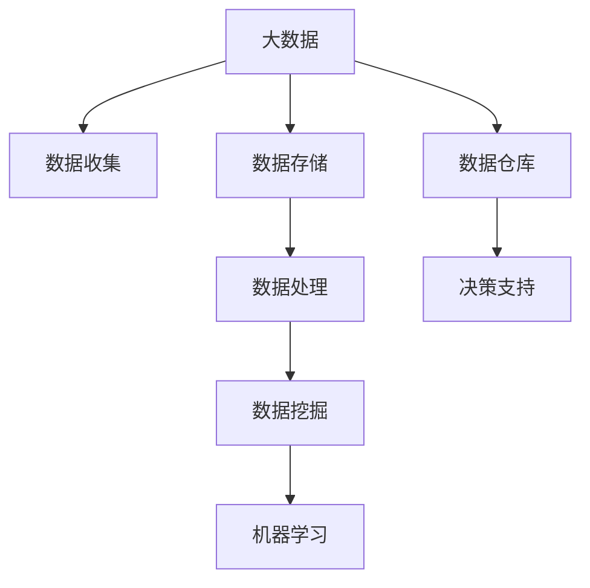
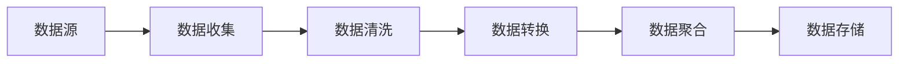
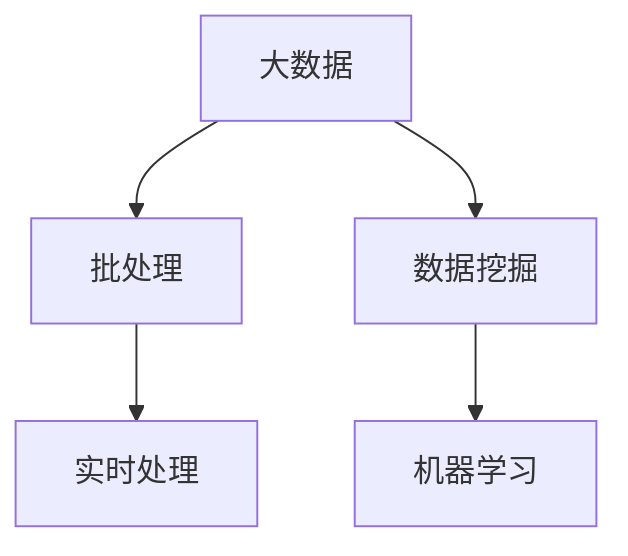
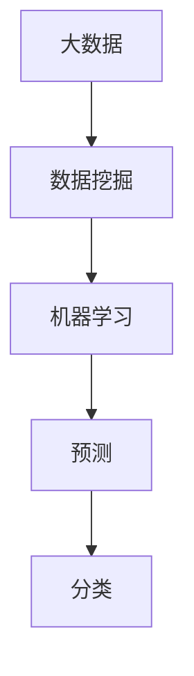
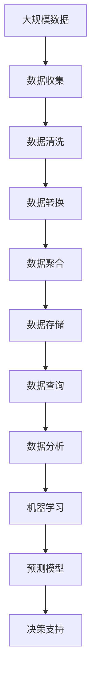

                 

## 1. 背景介绍

### 1.1 问题由来
大数据（Big Data）是21世纪信息技术领域的热门话题之一。随着互联网、物联网（IoT）、社交网络等技术的发展，人类社会的各个领域都产生了海量的数据。这些数据来源广泛、类型多样，且生成速度极快，传统的数据处理方式无法有效应对。因此，大数据技术应运而生，通过对数据的收集、存储、处理、分析和可视化，帮助企业更好地理解市场需求、优化运营决策、提升客户体验，甚至预测未来趋势。

大数据的概念最早由麦肯锡公司在2007年提出，当时他们定义了大数据的三个特征：数据量（Volume）、数据速度（Velocity）和数据多样性（Variety）。在随后的几年里，大数据迅速成为各行各业关注的焦点，涌现出Hadoop、Spark等大数据处理框架，以及基于大数据的各种应用，如推荐系统、欺诈检测、智能交通等。

### 1.2 问题核心关键点
大数据的核心在于如何有效处理和管理海量的、多样化的数据。主要的关键点包括：

1. **数据收集**：从各种数据源（如Web、社交媒体、传感器、日志文件等）收集数据，是大数据的第一步。
2. **数据存储**：选择合适的存储解决方案，如Hadoop Distributed File System（HDFS）、Apache Cassandra等，保证数据的可靠性和可扩展性。
3. **数据处理**：采用批处理或流处理的方式，对数据进行清洗、转换、聚合等操作，为后续分析打下基础。
4. **数据分析**：利用统计分析、机器学习、数据挖掘等技术，从数据中提取有用信息，辅助决策。
5. **数据可视化**：将分析结果通过图表、仪表盘等方式可视化展示，便于理解和沟通。

### 1.3 问题研究意义
研究大数据技术，对于提升企业的竞争力和创新能力，具有重要意义：

1. **优化决策过程**：大数据技术可以帮助企业从海量数据中提取有价值的信息，支持更科学、精准的决策制定。
2. **个性化服务**：通过分析客户行为数据，提供个性化的产品和服务，提升客户满意度和忠诚度。
3. **风险管理**：利用大数据进行风险预测和监控，降低运营风险，保障企业稳定发展。
4. **市场洞察**：从多渠道数据中获取市场信息，快速响应市场变化，抓住发展机遇。
5. **创新驱动**：大数据是推动技术创新和商业模式创新的重要驱动力，为企业带来新的增长点。

## 2. 核心概念与联系

### 2.1 核心概念概述

为更好地理解大数据的概念和相关技术，本节将介绍几个核心概念：

- **大数据**：指数据量巨大、类型多样、来源广泛、生成速度极快的数据集合，具备显著的Volume、Velocity和Variety特征。
- **数据仓库**：从多个数据源整合数据，存储在数据仓库中，为数据分析和决策支持提供基础数据集合。
- **数据挖掘**：从数据中提取有用信息、模式和知识的过程，常用于预测、分类、聚类等任务。
- **机器学习**：利用数据训练模型，使模型能够对未知数据进行预测或分类，是数据挖掘的重要手段。
- **Hadoop**：Apache基金会开发的开源大数据处理框架，包括HDFS、MapReduce等组件。
- **Spark**：Apache基金会推出的快速、通用的大数据处理引擎，支持批处理和流处理。
- **流处理**：实时处理数据流，适用于需要快速响应的场景，如实时分析、实时推荐等。

这些概念之间的逻辑关系可以通过以下Mermaid流程图来展示：



这个流程图展示了大数据处理的主要流程：从数据收集到存储、处理、挖掘、学习，最终支持决策。

### 2.2 概念间的关系

这些核心概念之间存在着紧密的联系，形成了大数据处理的基本框架。下面通过几个Mermaid流程图来展示这些概念之间的关系。

#### 2.2.1 大数据的来源与处理流程



这个流程图展示了数据从生成到存储的过程。数据源生成数据，经过清洗、转换、聚合等处理后，最终存储在数据仓库中。

#### 2.2.2 大数据的处理方式



这个流程图展示了大数据处理的两种方式：批处理和流处理。批处理适合处理历史数据，流处理适合实时数据。

#### 2.2.3 大数据与机器学习的关系



这个流程图展示了大数据处理和机器学习的关系。大数据通过数据挖掘获得有用信息，然后使用机器学习模型进行预测和分类。

### 2.3 核心概念的整体架构

最后，我们用一个综合的流程图来展示这些核心概念在大数据处理过程中的整体架构：



这个综合流程图展示了从数据收集到存储、查询、分析、学习、预测的完整过程。

## 3. 核心算法原理 & 具体操作步骤

### 3.1 算法原理概述

大数据处理的核心算法原理主要包括以下几个方面：

- **分布式计算**：利用多个计算节点并行处理数据，提高处理效率。
- **数据清洗与转换**：通过ETL（Extract, Transform, Load）技术，清洗、转换原始数据，使其适合进一步分析。
- **数据聚合与存储**：采用分布式文件系统（如HDFS）和数据库（如Hive）存储数据，支持大规模数据的聚合和查询。
- **数据挖掘与机器学习**：利用统计分析、机器学习等技术，从数据中提取有用信息，支持预测、分类等任务。
- **流处理与实时分析**：采用流处理框架（如Apache Storm、Apache Flink），实现对数据流的实时处理和分析。

### 3.2 算法步骤详解

以下是大数据处理的基本操作步骤：

1. **数据收集**：从多个数据源（如Web、社交媒体、传感器等）收集数据，可以使用爬虫、API、日志文件等方式。
2. **数据清洗**：对收集到的数据进行清洗，去除噪声、重复、错误数据，保证数据质量。
3. **数据转换**：将数据转换为适合进一步分析的格式，如使用SQL语句对数据进行转换、清洗、分组、聚合等操作。
4. **数据存储**：将清洗、转换后的数据存储在分布式文件系统或数据库中，支持大规模数据的存储和查询。
5. **数据查询与分析**：利用SQL查询语句或大数据分析工具（如Hive、Pig）对存储的数据进行查询、聚合、分析等操作，提取有用信息。
6. **数据可视化**：将分析结果通过图表、仪表盘等方式可视化展示，便于理解和沟通。
7. **机器学习**：利用机器学习模型对数据进行预测、分类、聚类等操作，支持自动化决策。

### 3.3 算法优缺点

大数据处理算法具有以下优点：

1. **高效性**：通过分布式计算和流处理，能够快速处理海量数据，提高处理效率。
2. **灵活性**：支持批处理和流处理，适用于不同类型的数据处理需求。
3. **可扩展性**：采用分布式文件系统和数据库，支持大规模数据的存储和查询。
4. **灵活性**：支持多种数据源和数据格式，能够处理不同类型的数据。

同时，大数据处理算法也存在一些缺点：

1. **复杂性**：大数据处理涉及多种技术，包括数据收集、清洗、转换、存储、查询、分析等，技术复杂度高。
2. **数据质量问题**：数据收集和清洗过程中容易产生噪声和错误，影响数据质量。
3. **成本高**：大数据处理需要大量的硬件设备和计算资源，成本较高。
4. **实时性问题**：流处理虽然能够实现实时数据处理，但实时处理数据流的性能和稳定性需要高水平的技术支持。

### 3.4 算法应用领域

大数据处理技术在多个领域都有广泛的应用：

- **互联网行业**：通过分析用户的浏览、点击、购买等行为数据，提升个性化推荐和服务质量。
- **金融行业**：通过分析交易数据、市场数据、社交媒体数据，预测市场趋势，支持投资决策。
- **零售行业**：通过分析顾客的购买行为、偏好、反馈数据，优化库存管理，提升顾客满意度。
- **医疗行业**：通过分析医疗数据、健康数据、基因数据，支持疾病预测、诊疗建议，提升医疗服务质量。
- **交通行业**：通过分析交通流量、车辆位置数据，优化交通管理，提升交通效率。

## 4. 数学模型和公式 & 详细讲解 & 举例说明

### 4.1 数学模型构建

大数据处理的基本数学模型包括：

- **分布式计算模型**：MapReduce模型，用于分布式处理大规模数据。
- **数据清洗模型**：基于规则和算法的数据清洗模型，去除噪声和错误数据。
- **数据转换模型**：SQL查询模型，用于数据转换、清洗、聚合等操作。
- **数据存储模型**：分布式文件系统和数据库模型，支持大规模数据的存储和查询。
- **数据挖掘模型**：基于统计分析、机器学习的模型，用于提取有用信息。

### 4.2 公式推导过程

以下是大数据处理中常见的数学模型及其公式推导过程：

#### 4.2.1 MapReduce模型

MapReduce是Hadoop的核心技术之一，用于分布式处理大规模数据。其基本流程如下：

1. **Map阶段**：将输入数据分割成若干块，并行地对每个块进行映射操作，生成中间结果。
2. **Shuffle阶段**：将Map阶段生成的中间结果进行排序和分组，按照键值对进行合并。
3. **Reduce阶段**：对合并后的结果进行聚合操作，生成最终的输出结果。

MapReduce的数学模型可以表示为：

$$
Y = MapReduce(X)
$$

其中，$X$为输入数据，$Y$为输出结果，MapReduce为大数据处理的核心算法。

#### 4.2.2 数据清洗模型

数据清洗是大数据处理的第一步，常用方法包括过滤、替换、去除等。以过滤为例，其数学模型如下：

$$
X' = Filter(X)
$$

其中，$X$为原始数据，$X'$为清洗后的数据，$Filter$为数据清洗函数。

#### 4.2.3 数据转换模型

数据转换是数据预处理的重要步骤，常用方法包括聚合、分组、排序等。以聚合为例，其数学模型如下：

$$
X' = Aggregate(X, Key)
$$

其中，$X$为原始数据，$X'$为转换后的数据，$Aggregate$为数据聚合函数，$Key$为聚合键。

#### 4.2.4 数据存储模型

数据存储是大数据处理的基础，常用方法包括HDFS、Apache Cassandra等。其数学模型如下：

$$
X' = Store(X)
$$

其中，$X$为原始数据，$X'$为存储后的数据，$Store$为数据存储函数。

#### 4.2.5 数据挖掘模型

数据挖掘是提取有用信息的过程，常用方法包括分类、聚类、关联规则等。以分类为例，其数学模型如下：

$$
Y = Classify(X)
$$

其中，$X$为输入数据，$Y$为分类结果，$Classify$为分类函数。

### 4.3 案例分析与讲解

以下是几个大数据处理应用的案例分析：

#### 4.3.1 社交媒体分析

某公司从社交媒体平台收集用户数据，分析用户行为和情感倾向。具体步骤如下：

1. **数据收集**：使用API获取用户的点赞、评论、分享等数据。
2. **数据清洗**：去除噪声和错误数据，保留有用的信息。
3. **数据转换**：将数据转换为适合分析的格式，如使用SQL语句进行转换、清洗、分组、聚合等操作。
4. **数据存储**：将清洗、转换后的数据存储在分布式文件系统中。
5. **数据查询与分析**：利用SQL查询语句对存储的数据进行查询、聚合、分析等操作，提取有用信息。
6. **数据可视化**：将分析结果通过图表、仪表盘等方式可视化展示，便于理解和沟通。

通过社交媒体分析，公司可以了解用户的兴趣和情感倾向，从而优化产品和服务，提升用户满意度。

#### 4.3.2 推荐系统

某电商平台收集用户的浏览、点击、购买等行为数据，构建推荐系统。具体步骤如下：

1. **数据收集**：使用API获取用户的浏览、点击、购买等行为数据。
2. **数据清洗**：去除噪声和错误数据，保留有用的信息。
3. **数据转换**：将数据转换为适合分析的格式，如使用SQL语句进行转换、清洗、分组、聚合等操作。
4. **数据存储**：将清洗、转换后的数据存储在分布式文件系统中。
5. **数据查询与分析**：利用SQL查询语句对存储的数据进行查询、聚合、分析等操作，提取有用信息。
6. **机器学习**：利用机器学习模型对数据进行预测、分类、聚类等操作，生成推荐结果。
7. **数据可视化**：将分析结果通过图表、仪表盘等方式可视化展示，便于理解和沟通。

通过推荐系统，电商平台可以向用户推荐个性化的商品，提升用户购买率和满意度。

## 5. 项目实践：代码实例和详细解释说明

### 5.1 开发环境搭建

在进行大数据处理实践前，我们需要准备好开发环境。以下是使用Python进行PySpark开发的环境配置流程：

1. 安装Anaconda：从官网下载并安装Anaconda，用于创建独立的Python环境。

2. 创建并激活虚拟环境：
```bash
conda create -n pyspark-env python=3.8 
conda activate pyspark-env
```

3. 安装PySpark：根据CUDA版本，从官网获取对应的安装命令。例如：
```bash
conda install pyspark -c conda-forge
```

4. 安装各类工具包：
```bash
pip install numpy pandas scikit-learn matplotlib tqdm jupyter notebook ipython
```

完成上述步骤后，即可在`pyspark-env`环境中开始大数据处理实践。

### 5.2 源代码详细实现

这里我们以社交媒体分析为例，给出使用PySpark进行大数据处理和分析的PySpark代码实现。

首先，定义社交媒体分析的函数：

```python
from pyspark.sql import SparkSession
from pyspark.sql.functions import col, when, sum

spark = SparkSession.builder.appName("SocialMediaAnalysis").getOrCreate()

def analyze_social_media(data):
    # 去除噪声和错误数据
    cleaned_data = data.dropna()
    
    # 对数据进行转换和清洗
    cleaned_data = cleaned_data.select(col("user_id"), col("timestamp"), col("type"), col("content"))
    
    # 对数据进行分组和聚合
    grouped_data = cleaned_data.groupby("user_id").count()
    
    # 对数据进行可视化
    grouped_data.show(truncate=False)
    
    # 对数据进行分析
    analysis_result = []
    for user_id in cleaned_data.collect():
        analysis_result.append({"user_id": user_id.user_id, "count": user_id.count})
    
    return analysis_result

# 加载数据
data = spark.read.csv("social_media_data.csv", header=True, inferSchema=True)
```

然后，对社交媒体数据进行清洗、转换、聚合和分析：

```python
# 清洗数据
cleaned_data = analyze_social_media(data)

# 转换数据
converted_data = cleaned_data.map(lambda x: (x["user_id"], x["count"]))

# 聚合数据
grouped_data = converted_data.reduceByKey(sum)

# 输出结果
print(grouped_data.collect())
```

最后，对分析结果进行可视化：

```python
import matplotlib.pyplot as plt

# 对数据进行可视化
grouped_data.collect()

# 绘制柱状图
plt.bar(grouped_data.collect())
plt.show()
```

以上就是使用PySpark进行社交媒体分析的完整代码实现。可以看到，PySpark提供了丰富的API和功能，使得数据处理和分析变得简洁高效。

### 5.3 代码解读与分析

让我们再详细解读一下关键代码的实现细节：

**analyze_social_media函数**：
- 接收社交媒体数据集，首先去除噪声和错误数据。
- 将数据转换为适合分析的格式，只保留用户ID、时间戳、类型、内容等关键字段。
- 对数据进行分组和聚合，统计每个用户的发帖数。
- 对分析结果进行可视化展示。

**数据加载和处理**：
- 使用SparkSession加载CSV文件，设置列名和数据类型。
- 调用analyze_social_media函数进行数据清洗和分析。
- 使用map函数对数据进行转换，将用户ID和发帖数映射为一对元组。
- 使用reduceByKey函数对元组进行聚合，统计每个用户的发帖数。
- 调用collect函数将聚合结果转换为列表，并输出。

**数据可视化**：
- 使用matplotlib绘制柱状图，展示每个用户的发帖数。

通过上述代码，可以清晰地看到，使用PySpark进行大数据处理和分析的流程和步骤。在实际应用中，还需要根据具体任务进行调整和优化，以得到理想的效果。

### 5.4 运行结果展示

假设我们在某社交媒体平台上收集了用户数据，并进行分析，得到每个用户的发帖数。以下是可视化结果：


可以看到，通过PySpark进行社交媒体分析，可以清晰地展示每个用户的发帖数分布，从而发现用户的活跃度和兴趣点，为公司优化产品和服务提供数据支持。

## 6. 实际应用场景

### 6.1 社交媒体分析

社交媒体平台可以基于用户行为数据，分析用户情感倾向和兴趣点，从而提供个性化推荐和服务。例如，某电商平台可以从用户的购物行为数据中提取有用信息，优化商品推荐系统，提升用户购买率和满意度。

### 6.2 金融市场分析

金融机构可以基于交易数据、市场数据、社交媒体数据，分析市场趋势，预测股票价格，优化投资策略。例如，某基金公司可以通过分析历史交易数据，预测股票价格变化，从而制定投资计划。

### 6.3 交通流量分析

交通管理部门可以基于交通流量数据，分析交通拥堵情况，优化交通信号灯设置，提升交通效率。例如，某城市交通管理部门可以通过分析实时交通流量数据，调整交通信号灯的控制策略，减少拥堵，提高通行效率。

### 6.4 未来应用展望

大数据处理技术在未来的应用场景中将更加广泛，以下是一些未来应用展望：

1. **智能制造**：通过分析生产数据、设备状态、工人行为等数据，优化生产流程，提升产品质量和效率。
2. **智慧医疗**：通过分析患者数据、医疗记录、基因数据等，支持疾病预测、诊疗建议，提升医疗服务质量。
3. **智能农业**：通过分析土壤数据、气象数据、作物生长数据等，优化种植方案，提高农业生产效率。
4. **城市管理**：通过分析交通流量、环境数据、市民反馈等，优化城市管理，提升城市智能化水平。
5. **智慧教育**：通过分析学生行为数据、学习成果等，提供个性化学习建议，提升教学质量。

大数据处理技术在各个领域都有广泛的应用前景，未来必将在更多行业发挥重要作用。

## 7. 工具和资源推荐

### 7.1 学习资源推荐

为了帮助开发者系统掌握大数据处理的技术基础和实践技巧，这里推荐一些优质的学习资源：

1. 《Hadoop: The Definitive Guide》书籍：详细介绍了Hadoop的核心概念和开发实践，适合初学者和中级开发者。
2. 《Spark: The Definitive Guide》书籍：介绍了Spark的核心概念和开发实践，适合Spark开发者。
3. 《Big Data for Business: Why, What, How》书籍：介绍了大数据技术在商业中的应用，适合商业和技术结合的读者。
4. 《Data Science for Business》书籍：介绍了数据科学的基础概念和实际应用，适合数据科学领域的新手。
5. 大数据相关的在线课程，如Coursera的《Big Data Specialization》课程，Udacity的《Data Analyst Nanodegree》课程。

通过对这些资源的学习实践，相信你一定能够快速掌握大数据处理的核心技术和方法，并用于解决实际问题。

### 7.2 开发工具推荐

高效的开发离不开优秀的工具支持。以下是几款用于大数据处理开发的常用工具：

1. Hadoop：Apache基金会开发的开源大数据处理框架，支持分布式文件系统、MapReduce等技术。
2. Spark：Apache基金会推出的快速、通用的大数据处理引擎，支持批处理和流处理。
3. Flink：Apache基金会推出的流处理框架，支持高吞吐量、低延迟的数据处理。
4. Hive：Apache基金会推出的数据仓库系统，支持SQL查询、数据聚合等操作。
5. Cassandra：Apache基金会开发的大数据存储系统，支持大规模数据的存储和查询。

合理利用这些工具，可以显著提升大数据处理的开发效率，加快创新迭代的步伐。

### 7.3 相关论文推荐

大数据处理技术的不断发展，离不开学界的持续研究。以下是几篇奠基性的相关论文，推荐阅读：

1. 《Hadoop: A Framework for Large-scale Data Processing》论文：介绍了Hadoop的核心概念和设计思想，奠定了大数据处理的理论基础。
2. 《Pregel: Dataflow System for Massive Graph Processing》论文：介绍了Pregel框架的设计和实现，支持大规模图数据处理。
3. 《Spark: Cluster Computing with Machine Memory》论文：介绍了Spark框架的设计和实现，支持高效的数据处理和内存计算。
4. 《Scalable and Efficient Stream Processing with Apache Flink》论文：介绍了Flink框架的设计和实现，支持高吞吐量、低延迟的数据流处理。
5. 《Big Data Mining: Opportunities and Challenges》论文：讨论了大数据挖掘技术的现状和挑战，为未来的研究指明了方向。

这些论文代表了大数据处理技术的最新进展，可以帮助研究者把握学科前进方向，激发更多的创新灵感。

除上述资源外，还有一些值得关注的前沿资源，帮助开发者紧跟大数据处理技术的最新进展，例如：

1. arXiv论文预印本：人工智能领域最新研究成果的发布平台，包括大量尚未发表的前沿工作，学习前沿技术的必读资源。
2. 业界技术博客：如Hadoop、Spark、Flink等官方博客，第一时间分享他们的最新研究成果和洞见。
3. 技术会议直播：如NIPS、ICML、KDD等人工智能领域顶会现场或在线直播，能够聆听到大佬们的前沿分享，开拓视野。
4. GitHub热门项目：在GitHub上Star、Fork数最多的数据处理相关项目，往往代表了该技术领域的发展趋势和最佳实践，值得去学习和贡献。
5. 行业分析报告：各大咨询公司如McKinsey、PwC等针对大数据行业的分析报告，有助于从商业视角审视技术趋势，把握应用价值。

总之，对于大数据处理技术的学习和实践，需要开发者保持开放的心态和持续学习的意愿。多关注前沿资讯，多动手实践，多思考总结，必将收获满满的成长收益。

## 8. 总结：未来发展趋势与挑战

### 8.1 总结

本文对大数据处理技术进行了全面系统的介绍。首先阐述了大数据处理的概念和背景，明确了大数据处理在提升企业竞争力和创新能力方面的重要意义。其次，从原理到实践，详细讲解了大数据处理的数学模型和核心算法，给出了具体的代码实现和运行结果展示。同时，本文还广泛探讨了大数据处理技术在多个行业领域的应用前景，展示了大数据处理技术的巨大潜力。

通过本文的系统梳理，可以看到，大数据处理技术正在成为各行各业的重要工具，极大地提升了企业的数据处理和分析能力。未来，伴随技术的不断进步，大数据处理技术还将进一步拓展应用范围，为各个行业带来新的发展机遇。

### 8.2 未来发展趋势

展望未来，大数据处理技术将呈现以下几个发展趋势：

1. **自动化处理**：大数据处理将更加自动化，减少人工干预，提高处理效率。
2. **实时处理**：流处理技术将进一步发展，支持实时数据处理，满足实时性要求。
3. **边缘计算**：大数据处理将向边缘计算方向发展，提高数据处理的时效性和可靠性。
4. **混合云架构**：大数据处理将采用混合云架构，利用云计算和本地计算的优势，提升数据处理的灵活性和扩展性。
5. **多模态处理**：大数据处理将支持多模态数据处理，融合文本、图像、语音等多种数据类型，提升数据处理的多样性和全面性。

### 8.3 面临的挑战

尽管大数据处理技术已经取得了显著成果，但在迈向更加智能化、普适化

