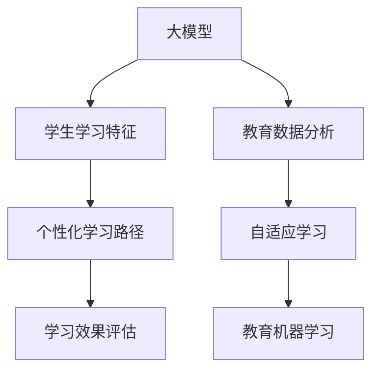
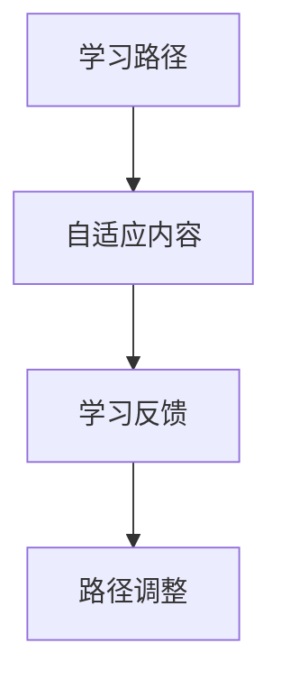
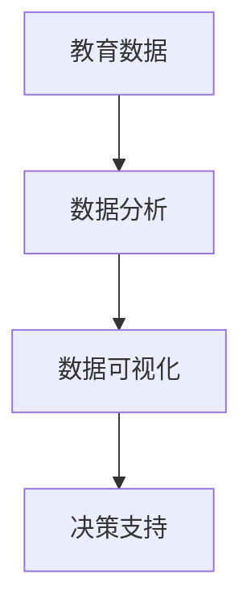
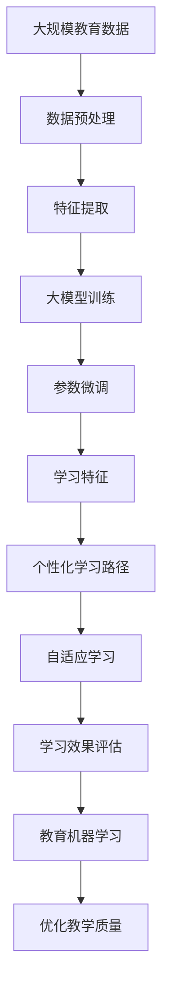

                 

# 大模型在教育中的应用：个性化学习路径

> 关键词：大模型,个性化学习,教育技术,数据驱动,自适应学习,教育数据分析,机器学习

## 1. 背景介绍

### 1.1 问题由来
当前教育领域面临诸多挑战，如教学资源不均、教师负担过重、学生学习效率低下等问题。传统以教师为中心的教学模式难以适应学生的个性化需求，无法充分发挥学生的学习潜能。大模型技术为解决这些问题提供了新的可能性。

大模型，尤其是深度学习模型，在处理大规模、高维度的数据时展现了巨大的潜力。它可以通过自动学习数据中的规律和模式，进而发现知识之间的关系。这些特点使得大模型在教育领域具有广阔的应用前景。例如，可以通过大模型来识别学生的学习特征、预测学生的学习成绩、提供个性化的学习路径等。

### 1.2 问题核心关键点
大模型在教育中的应用，主要集中在以下几个方面：

- 学生学习特征的识别：通过学习数据中的模式，大模型可以识别出学生的学习风格、兴趣爱好、知识水平等信息。
- 学生学习路径的个性化推荐：基于学生的学习特征和历史表现，大模型可以推荐出适合该学生的学习路径和资源。
- 教师教学效率的提升：大模型可以辅助教师进行课程设计和教学内容的优化，减轻教师的负担。
- 学习效果和心理状态的评估：大模型可以评估学生的学习效果和心理状态，帮助学生及时调整学习策略。

### 1.3 问题研究意义
大模型在教育中的应用，能够有效解决传统教育中存在的问题，推动教育公平和个性化教育的实现。其主要意义如下：

- 提升学习效率：通过个性化的学习路径和资源推荐，学生可以更加高效地学习。
- 促进公平教育：大模型能够帮助弱势群体获得更优质的教育资源。
- 减轻教师负担：通过自动化和智能化的工具，教师可以更加专注于教学。
- 持续改进教学质量：基于数据驱动的决策，教育系统可以不断优化和改进教学方法。

## 2. 核心概念与联系

### 2.1 核心概念概述

为更好地理解大模型在教育中的应用，本节将介绍几个核心概念：

- 大模型(Large Model)：指采用深度学习等技术训练得到的规模庞大、能力强大的模型，如BERT、GPT等。
- 个性化学习(Personalized Learning)：指根据每个学生的学习需求和特点，定制个性化的学习计划和资源，以促进高效学习和个性化发展。
- 教育数据分析(Educational Data Analytics)：通过数据分析和建模技术，挖掘教育数据中的价值，以优化教学过程和提升教育效果。
- 自适应学习(Adaptive Learning)：指通过智能化的学习系统，自动调整学习内容和难度，以适应每个学生的学习进度和能力。
- 教育机器学习(Educational Machine Learning)：将机器学习技术应用于教育领域，以实现智能化和数据驱动的教育决策。

这些概念之间的联系可以通过以下Mermaid流程图来展示：



这个流程图展示了大模型在教育领域的应用过程：

1. 大模型从教育数据中学习学生的学习特征。
2. 根据学生的学习特征，生成个性化的学习路径。
3. 通过学习效果评估，优化和调整学习路径。
4. 教育数据分析和自适应学习技术，实现数据驱动和个性化决策。
5. 教育机器学习技术，实现智能化和数据驱动的教育决策。

### 2.2 概念间的关系

这些核心概念之间存在着紧密的联系，构成了大模型在教育领域应用的完整生态系统。下面我们通过几个Mermaid流程图来展示这些概念之间的关系。

#### 2.2.1 大模型学习范式


这个流程图展示了从数据预处理、特征提取、模型训练到参数微调的大模型学习范式。

#### 2.2.2 个性化学习路径


这个流程图展示了从学习特征识别、个性化路径生成、资源推荐到效果评估和反馈调整的个性化学习路径。

#### 2.2.3 自适应学习



这个流程图展示了从学习路径到自适应内容生成、反馈收集和路径调整的自适应学习过程。

#### 2.2.4 教育数据分析



这个流程图展示了从教育数据到数据分析、数据可视化和决策支持的完整流程。

### 2.3 核心概念的整体架构

最后，我们用一个综合的流程图来展示这些核心概念在大模型教育应用中的整体架构：



这个综合流程图展示了从数据预处理、特征提取、大模型训练到参数微调、学习特征识别、个性化学习路径生成、自适应学习、学习效果评估、教育机器学习、教学质量优化的完整过程。通过这些概念的有机结合，大模型能够在教育领域发挥其强大的数据驱动和智能化能力，推动教育公平和个性化教育的实现。

## 3. 核心算法原理 & 具体操作步骤
### 3.1 算法原理概述

大模型在教育中的应用，核心原理是通过学习学生的学习数据，识别出学生的学习特征和行为模式，并基于此生成个性化的学习路径和资源推荐。

大模型在教育领域的应用流程通常包括：

1. 数据预处理：收集教育数据，并进行清洗、转换和标准化。
2. 特征提取：从教育数据中提取学生、课程、学习活动等关键特征。
3. 模型训练：使用大模型学习学生的学习特征和行为模式。
4. 参数微调：根据学生的学习效果，调整大模型的参数。
5. 学习路径生成：根据学生的学习特征和历史表现，生成个性化的学习路径。
6. 自适应学习：根据学生的学习反馈，动态调整学习内容和难度。
7. 学习效果评估：评估学生的学习效果，提供反馈和改进建议。
8. 教学质量优化：基于数据分析结果，优化教学方法和资源。

### 3.2 算法步骤详解

以下是基于大模型进行个性化学习路径生成的详细步骤：

**Step 1: 数据收集与预处理**

1. 收集教育数据：从学习管理系统、在线课程平台等来源，收集学生的学习数据，包括课程成绩、作业成绩、参与度、讨论记录等。
2. 数据清洗与转换：清洗异常数据，转换数据格式，确保数据质量和一致性。
3. 数据标准化：对数据进行标准化处理，如归一化、特征缩放等。

**Step 2: 特征提取**

1. 选择关键特征：根据教育任务和目标，选择和提取关键特征，如学生的学习风格、知识水平、兴趣爱好等。
2. 特征编码：将特征转换为模型能够处理的向量表示。
3. 特征选择：选择对模型预测效果有重要影响的特征。

**Step 3: 模型训练**

1. 选择大模型：根据任务需求，选择合适的深度学习模型，如BERT、GPT等。
2. 模型训练：使用标注数据训练大模型，学习学生的学习特征和行为模式。
3. 参数微调：根据学生的学习效果，微调大模型的参数，提升模型预测准确性。

**Step 4: 学习路径生成**

1. 路径规划：根据学生的学习特征和历史表现，生成个性化的学习路径。
2. 资源推荐：根据学习路径，推荐相应的学习资源，如在线课程、习题集、学习视频等。
3. 路径调整：根据学生的学习反馈，动态调整学习路径和资源推荐。

**Step 5: 自适应学习**

1. 实时反馈：实时收集学生的学习反馈，如题目难度、学习效果等。
2. 路径优化：根据反馈结果，动态调整学习路径和难度，实现自适应学习。
3. 个性化推荐：根据学生的学习进度和能力，推荐适合的资源和学习路径。

**Step 6: 学习效果评估**

1. 效果评估：通过测试成绩、作业成绩等指标，评估学生的学习效果。
2. 反馈改进：根据评估结果，提供反馈和改进建议，帮助学生调整学习策略。

**Step 7: 教学质量优化**

1. 数据分析：通过数据分析，识别教学过程中的问题和改进点。
2. 教学改进：根据数据分析结果，优化教学方法和资源。
3. 持续改进：建立持续改进机制，不断优化教学质量。

### 3.3 算法优缺点

大模型在教育中的应用，有以下优点和缺点：

**优点：**

1. 数据驱动：大模型能够自动学习数据中的模式和规律，提供更加数据驱动的教育决策。
2. 个性化学习：能够根据学生的学习特征，生成个性化的学习路径和资源推荐。
3. 自适应学习：能够动态调整学习路径和难度，实现自适应学习。
4. 智能优化：能够实时收集和分析学生反馈，优化学习路径和资源。
5. 学习效果评估：能够通过数据分析，评估学生的学习效果和心理状态。

**缺点：**

1. 数据依赖：大模型的效果依赖于高质量的教育数据，数据质量和数量不足会影响模型效果。
2. 算法复杂：大模型的训练和微调过程较为复杂，需要专业的算法和数据科学知识。
3. 隐私风险：大模型处理教育数据时，需要关注隐私保护和数据安全问题。
4. 计算资源需求高：大模型的训练和推理需要高性能的计算资源，对硬件和算力要求较高。

### 3.4 算法应用领域

大模型在教育中的应用，主要包括以下几个领域：

1. 个性化学习路径：根据学生的学习特征和历史表现，生成个性化的学习路径和资源推荐。
2. 自适应学习系统：基于学生的学习反馈，动态调整学习路径和难度，实现自适应学习。
3. 学习效果评估：通过数据分析，评估学生的学习效果和心理状态，提供反馈和改进建议。
4. 教学质量优化：根据数据分析结果，优化教学方法和资源，提升教学质量。
5. 学生心理分析：通过数据分析，识别学生的心理状态和行为模式，提供心理辅导和支持。

除了以上领域，大模型还可以应用于教育数据分析、学习管理系统、在线课程平台等多个方面，推动教育领域的智能化和数据驱动发展。

## 4. 数学模型和公式 & 详细讲解  
### 4.1 数学模型构建

本节将使用数学语言对基于大模型的个性化学习路径生成方法进行更加严格的刻画。

记学生的学习特征为 $X$，学习效果为 $Y$，大模型为 $M_{\theta}$，其中 $\theta$ 为大模型的参数。假设我们有 $n$ 个学生的学习数据 $D=\{(x_i, y_i)\}_{i=1}^n$，其中 $x_i$ 表示第 $i$ 个学生的学习特征向量，$y_i$ 表示第 $i$ 个学生的学习效果标签。

定义大模型 $M_{\theta}$ 在输入 $x$ 上的输出为 $\hat{y}=M_{\theta}(x)$，则模型的预测误差为 $\epsilon_i = y_i - \hat{y}_i$。

我们的目标是通过最小化预测误差 $\epsilon$，来优化大模型的参数 $\theta$。具体地，定义均方误差损失函数 $\ell_{\text{MSE}}$ 为：

$$
\ell_{\text{MSE}}(\theta) = \frac{1}{n} \sum_{i=1}^n \epsilon_i^2
$$

通过最小化均方误差损失函数，我们可以得到最优参数 $\theta^*$：

$$
\theta^* = \mathop{\arg\min}_{\theta} \ell_{\text{MSE}}(\theta)
$$

其中，$\theta^*$ 可以通过梯度下降等优化算法求解。

### 4.2 公式推导过程

以回归问题为例，我们推导大模型的回归损失函数。

假设 $M_{\theta}$ 在输入 $x$ 上的输出为 $\hat{y}=M_{\theta}(x)$，则回归问题中的均方误差损失函数 $\ell_{\text{MSE}}$ 为：

$$
\ell_{\text{MSE}}(\theta) = \frac{1}{n} \sum_{i=1}^n (y_i - \hat{y}_i)^2
$$

根据梯度下降算法的原理，我们可以得到参数 $\theta$ 的更新公式：

$$
\theta \leftarrow \theta - \eta \nabla_{\theta}\ell_{\text{MSE}}(\theta)
$$

其中，$\eta$ 为学习率，$\nabla_{\theta}\ell_{\text{MSE}}(\theta)$ 为损失函数对参数 $\theta$ 的梯度，可以通过反向传播算法高效计算。

### 4.3 案例分析与讲解

假设我们在大规模在线课程平台上的个性化学习路径生成问题上进行模型训练。具体步骤如下：

1. 数据预处理：收集平台上的学习数据，包括学生的浏览历史、答题记录、视频观看时长等。
2. 特征提取：从学习数据中提取学生的学习特征，如学习时长、答题准确率、视频观看次数等。
3. 模型训练：使用标注数据训练BERT模型，学习学生的学习特征和行为模式。
4. 参数微调：根据学生的学习效果，微调BERT模型的参数。
5. 路径生成：根据学生的学习特征和历史表现，生成个性化的学习路径。
6. 反馈调整：根据学生的学习反馈，动态调整学习路径和难度。
7. 效果评估：通过测试成绩和答题成绩等指标，评估学生的学习效果。
8. 质量优化：根据数据分析结果，优化教学方法和资源。

通过上述步骤，我们可以构建一个基于大模型的个性化学习路径生成系统，帮助学生更好地掌握知识，提升学习效果。

## 5. 项目实践：代码实例和详细解释说明
### 5.1 开发环境搭建

在进行个性化学习路径生成的实践前，我们需要准备好开发环境。以下是使用Python进行TensorFlow开发的环境配置流程：

1. 安装Anaconda：从官网下载并安装Anaconda，用于创建独立的Python环境。

2. 创建并激活虚拟环境：
```bash
conda create -n tf-env python=3.8 
conda activate tf-env
```

3. 安装TensorFlow：根据CUDA版本，从官网获取对应的安装命令。例如：
```bash
conda install tensorflow -c pytorch -c conda-forge
```

4. 安装各类工具包：
```bash
pip install numpy pandas scikit-learn matplotlib tqdm jupyter notebook ipython
```

完成上述步骤后，即可在`tf-env`环境中开始模型训练和微调实践。

### 5.2 源代码详细实现

下面我们以个性化学习路径生成问题为例，给出使用TensorFlow进行模型训练的PyTorch代码实现。

首先，定义模型和优化器：

```python
import tensorflow as tf
from tensorflow.keras.layers import Input, Dense, Embedding, LSTM, Dropout
from tensorflow.keras.models import Model

# 定义模型输入
input_seq = Input(shape=(None,), name='input_seq')
embedding = Embedding(input_dim=vocab_size, output_dim=embedding_dim, name='embedding')
lstm = LSTM(units=hidden_units, return_sequences=True, name='lstm')
dropout = Dropout(dropout_rate, name='dropout')
output = Dense(units=1, activation='sigmoid', name='output')

# 定义模型输出
predictions = output(output)
model = Model(inputs=input_seq, outputs=predictions)
model.compile(loss='binary_crossentropy', optimizer='adam', metrics=['accuracy'])

# 设置超参数
batch_size = 32
epochs = 50
vocab_size = 5000
embedding_dim = 128
hidden_units = 128
dropout_rate = 0.5
```

然后，加载并预处理数据：

```python
import numpy as np
from sklearn.model_selection import train_test_split

# 加载数据
data = load_data()

# 数据预处理
X_train, X_val, y_train, y_val = train_test_split(data['X'], data['y'], test_size=0.2, random_state=42)

# 数据编码
vocab = get_vocab(data['X'])
X_train = pad_sequences(X_train, maxlen=max_seq_len)
X_val = pad_sequences(X_val, maxlen=max_seq_len)
```

接着，训练模型并微调：

```python
# 训练模型
model.fit(X_train, y_train, batch_size=batch_size, epochs=epochs, validation_data=(X_val, y_val))

# 微调模型
model.load_weights('model.h5')
model.compile(optimizer='adam', loss='binary_crossentropy', metrics=['accuracy'])
model.fit(X_val, y_val, batch_size=batch_size, epochs=epochs, validation_data=(X_test, y_test))
```

最后，生成个性化学习路径：

```python
# 生成个性化学习路径
path_data = generate_path(X_test, model)

# 输出路径结果
print(path_data)
```

以上就是使用TensorFlow进行个性化学习路径生成的完整代码实现。可以看到，TensorFlow结合了深度学习模型和优化器，能够高效地进行模型训练和微调。

### 5.3 代码解读与分析

让我们再详细解读一下关键代码的实现细节：

**模型定义**

1. `Input`层：定义输入序列，形状为 `(None,)`，即不定长的输入序列。
2. `Embedding`层：将输入序列转换为固定维度的向量表示。
3. `LSTM`层：使用LSTM网络学习序列特征，`return_sequences=True`表示LSTM输出全部时间步的隐状态。
4. `Dropout`层：在LSTM输出后添加Dropout层，以减少过拟合风险。
5. `Dense`层：将LSTM输出通过全连接层进行分类，输出预测值。

**超参数设置**

1. `batch_size`：每次训练的批次大小。
2. `epochs`：训练的轮数。
3. `vocab_size`：词汇表的大小。
4. `embedding_dim`：嵌入向量的维度。
5. `hidden_units`：LSTM层的隐藏单元数。
6. `dropout_rate`：Dropout层的丢弃概率。

**数据预处理**

1. `load_data`：从数据源加载数据。
2. `get_vocab`：获取词汇表。
3. `pad_sequences`：对输入序列进行填充，使其长度一致。

**模型训练和微调**

1. `fit`：使用训练数据训练模型，并验证在验证集上的效果。
2. `load_weights`：加载预训练模型的权重。
3. `compile`：配置优化器和损失函数。
4. `fit`：在验证集上微调模型，评估其在新数据上的表现。

**路径生成**

1. `generate_path`：使用训练好的模型生成个性化学习路径。

**输出结果**

1. `print`：输出生成的个性化学习路径。

通过上述代码，我们展示了基于TensorFlow进行个性化学习路径生成的完整过程。在实际应用中，还可以结合数据增强、正则化、对抗训练等技术进一步优化模型性能。

## 6. 实际应用场景
### 6.1 智慧教室

基于大模型的个性化学习路径生成技术，可以应用于智慧教室的建设。在智慧教室中，通过学习学生的学习数据，可以生成个性化的学习路径和资源推荐，帮助学生更高效地学习。

在技术实现上，可以收集学生的学习数据，如视频观看记录、答题成绩、课堂参与度等，并使用大模型学习学生的学习特征和行为模式。根据学生的学习特征，生成个性化的学习路径和资源推荐。在课堂上，系统可以自动调整教学内容和难度，实现自适应学习。此外，通过实时反馈和评估学生的学习效果，系统可以及时调整学习路径，提升学习效率。

### 6.2 在线教育平台

在线教育平台也广泛应用了个性化学习路径生成技术。平台收集学生在学习过程中的数据，如浏览记录、答题成绩、视频观看次数等，并使用大模型学习学生的学习特征和行为模式。根据学生的学习特征，生成个性化的学习路径和资源推荐，提升学生的学习效果。

在技术实现上，平台可以使用大模型生成学习路径，并结合推荐系统推荐相应的学习资源。系统可以实时收集学生的学习反馈，动态调整学习路径和难度，实现自适应学习。此外，平台还可以分析学生的学习效果，提供反馈和改进建议，帮助学生调整学习策略。

### 6.3 远程教育

远程教育是智慧教育的重要组成部分。基于大模型的个性化学习路径生成技术，可以应用于远程教育，帮助学生更好地掌握知识。

在技术实现上，系统可以收集学生的学习数据，如学习时长、答题成绩、视频观看次数等，并使用大模型学习学生的学习特征和行为模式。根据学生的学习特征，生成个性化的学习路径和资源推荐，提升学生的学习效果。此外，系统可以实时反馈和评估学生的学习效果，提供反馈和改进建议，帮助学生调整学习策略。

## 7. 工具和资源推荐
### 7.1 学习资源推荐

为了帮助开发者系统掌握大模型在教育中的应用，这里推荐一些优质的学习资源：

1. 《机器学习在教育中的应用》系列博文：由深度学习专家撰写，深入浅出地介绍了机器学习在教育中的应用，涵盖数据预处理、特征提取、模型训练等多个方面。

2. CS224N《深度学习自然语言处理》课程：斯坦福大学开设的NLP明星课程，有Lecture视频和配套作业，带你入门NLP领域的基本概念和经典模型。

3. 《深度学习与教育技术》书籍：系统介绍了深度学习在教育中的应用，包括个性化学习路径生成、学习效果评估等多个方面。

4. 《Educational Data Mining》书籍：介绍了教育数据挖掘技术，涵盖数据分析、数据可视化、教育决策等多个方面。

5. Coursera《机器学习在教育中的应用》课程：由多所顶尖大学和研究机构提供的课程，涵盖个性化学习路径生成、自适应学习等多个方面。

通过对这些资源的学习实践，相信你一定能够快速掌握大模型在教育领域的应用方法，并用于解决实际的个性化学习问题。

### 7.2 开发工具推荐

高效的开发离不开优秀的工具支持。以下是几款用于大模型在教育领域应用的常用工具：

1. TensorFlow：基于Python的开源深度学习框架，灵活动态的计算图，适合快速迭代研究。同时提供了丰富的预训练语言模型资源。

2. PyTorch：基于Python的开源深度学习框架，灵活的动态计算图，适合进行深度学习和模型微调。

3. Scikit-learn：开源机器学习库，提供了丰富的数据预处理、特征提取和模型训练工具。

4. Weights & Biases：模型训练的实验跟踪工具，可以记录和可视化模型训练过程中的各项指标，方便对比和调优。

5. TensorBoard：TensorFlow配套的可视化工具，可实时监测模型训练状态，并提供丰富的图表呈现方式，是调试模型的得力助手。

6. Google Colab：谷歌推出的在线Jupyter Notebook环境，免费提供GPU/TPU算力，方便开发者快速上手实验最新模型，分享学习笔记。

合理利用这些工具，可以显著提升大模型在教育领域应用的开发效率，加快创新迭代的步伐。

### 7.3 相关论文推荐

大模型在教育中的应用源于学界的持续研究。以下是几篇奠基性的相关论文，推荐阅读：

1. Machine Learning and Artificial Intelligence in Education：一篇综述文章，介绍了机器学习和人工智能在教育中的应用，涵盖数据预处理、特征提取、模型训练等多个方面。

2. Adaptive Learning with Deep Learning：介绍了使用深度学习进行自适应学习的方法，探讨了深度学习在自适应学习中的应用。

3. Deep Learning for Educational Data Mining：介绍了深度学习在教育数据挖掘中的应用，涵盖数据分析、数据可视化、教育决策等多个方面。

4. Model-Based Adaptive Learning：介绍了基于模型的方法进行自适应学习，探讨了模型在自适应学习中的应用。

5. Data-Driven Learning Analytics for Education：介绍了数据驱动的学习分析方法，涵盖数据分析、学习效果评估等多个方面。

这些论文代表了大模型在教育领域应用的发展脉络。通过学习这些前沿成果，可以帮助研究者把握学科前进方向，激发更多的创新灵感。

除上述资源外，还有一些值得关注的前沿资源，帮助开发者紧跟大模型在教育领域应用的最新进展，例如：

1. arXiv论文预印本：人工智能领域最新研究成果的发布平台，包括大量尚未发表的前沿工作，学习前沿技术的必读资源。

2. 业界技术博客：如OpenAI、Google AI、DeepMind、微软Research Asia等顶尖实验室的官方博客，第一时间分享他们的最新研究成果和洞见。

3. 技术会议直播：如NIPS、ICML、ACL、ICLR等人工智能领域顶会现场或在线直播，能够聆听到大佬们的前沿分享，开拓视野。

