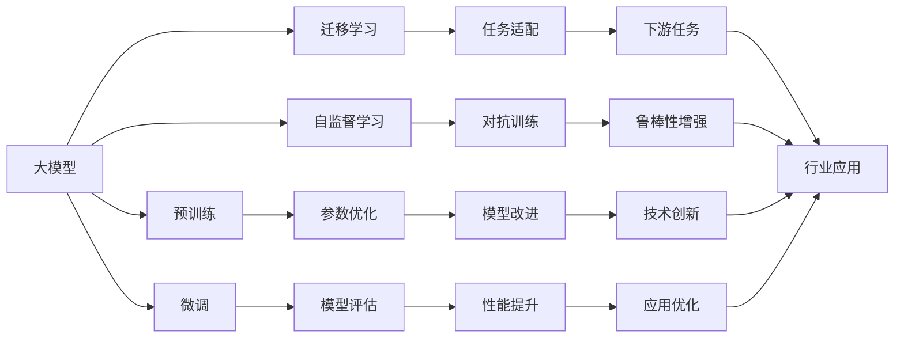

                 

# 大模型应用开发的实用指南

大模型是当前人工智能领域最热门的话题之一，尤其是在自然语言处理（NLP）、计算机视觉（CV）和语音识别等领域。本文将详细探讨大模型的应用开发，涵盖从理论到实践的各个方面，帮助读者全面掌握大模型开发的关键技术和最佳实践。

## 1. 背景介绍

### 1.1 问题由来

大模型，如BERT、GPT-3、DALL-E等，已经成为AI领域的重要工具。它们通过在大量数据上预训练，能够提取丰富的语言、视觉、音频等特征，广泛应用于各种NLP、CV和语音任务中。然而，大模型开发涉及多个方面的知识，包括算法原理、模型架构、训练技巧、部署策略等，需要系统化的学习和实践。

### 1.2 问题核心关键点

- **模型选择与优化**：选择合适的预训练模型，并对其进行优化以适应特定任务。
- **数据准备**：准备好高质量的数据集，确保模型在特定任务上的性能。
- **训练技巧**：掌握高效的训练技巧，避免过拟合和资源浪费。
- **模型部署**：将模型部署到实际应用中，保证其性能和可用性。

### 1.3 问题研究意义

深入理解大模型应用开发，对于加速AI技术落地，提高应用效率和效果，具有重要意义：

1. **降低开发成本**：利用预训练模型进行微调，可以大大减少从头训练的成本。
2. **提高模型效果**：微调模型能够针对特定任务进行优化，提升模型性能。
3. **加速应用开发**：通过预训练模型，可以加快任务适配的速度，缩短开发周期。
4. **推动技术创新**：微调过程促进了对预训练模型的深入研究，推动了AI技术的发展。
5. **赋能行业应用**：大模型技术在各行各业中的应用，可以推动传统行业的数字化转型。

## 2. 核心概念与联系

### 2.1 核心概念概述

- **大模型**：指在大量数据上预训练的通用模型，如BERT、GPT等，能够提取多种特征。
- **微调(Fine-Tuning)**：在特定任务上对大模型进行微调，使其能够适应新的任务需求。
- **迁移学习(Transfer Learning)**：将一个领域的知识迁移到另一个领域，提升新任务的表现。
- **自监督学习(Self-Supervised Learning)**：利用无标签数据进行预训练，学习模型的表示能力。
- **对抗训练(Adversarial Training)**：通过引入对抗样本，增强模型的鲁棒性。
- **提示学习(Prompt Learning)**：通过精心设计的输入模板，引导模型生成特定的输出。

这些核心概念构成了大模型应用开发的基础框架。

### 2.2 概念间的关系

大模型应用开发涉及多个概念的协同工作，可以通过以下Mermaid流程图来展示：



这个流程图展示了从预训练到微调，再到迁移学习的过程，以及对抗训练、提示学习等技术如何在大模型应用中发挥作用。

## 3. 核心算法原理 & 具体操作步骤

### 3.1 算法原理概述

大模型应用开发的核心在于选择合适的模型，并对其进行微调和优化。微调的目标是通过少量标注数据，对预训练模型进行特定任务的适配，提升模型在该任务上的性能。

### 3.2 算法步骤详解

1. **选择合适的模型**：根据任务类型和数据规模，选择合适的预训练模型。
2. **准备数据集**：准备好高质量的标注数据集，包括训练集、验证集和测试集。
3. **模型微调**：
   - 冻结部分预训练层，只微调顶层。
   - 使用适当的学习率，避免破坏预训练权重。
   - 应用正则化技术，防止过拟合。
   - 引入对抗训练和提示学习，增强模型的泛化能力和适应性。
4. **模型评估**：在验证集上评估模型性能，调整超参数。
5. **测试和部署**：在测试集上评估模型，并将模型部署到实际应用中。

### 3.3 算法优缺点

**优点**：
- 高效：利用预训练模型，快速适配新任务。
- 灵活：可以通过微调和迁移学习，适应不同的应用场景。
- 可解释性：部分技术如提示学习，可以降低模型的黑盒性。

**缺点**：
- 依赖标注数据：微调性能受数据质量影响。
- 资源消耗：大模型训练和推理资源需求大。
- 模型泛化：对抗训练和正则化无法完全避免泛化问题。

### 3.4 算法应用领域

大模型在NLP、CV、语音识别等多个领域得到了广泛应用，如：

- **NLP**：文本分类、命名实体识别、机器翻译、情感分析等。
- **CV**：图像分类、目标检测、图像生成等。
- **语音识别**：语音命令识别、语音情感分析等。

## 4. 数学模型和公式 & 详细讲解  
### 4.1 数学模型构建

假设我们有任务 $T$ 的数据集 $D=\{(x_i, y_i)\}_{i=1}^N$，其中 $x_i$ 为输入，$y_i$ 为标签。微调的数学模型为：

$$
\min_{\theta} \frac{1}{N} \sum_{i=1}^N L(y_i, M_\theta(x_i))
$$

其中 $L$ 为损失函数，$M_\theta$ 为微调后的模型，$\theta$ 为模型参数。

### 4.2 公式推导过程

以分类任务为例，假设模型输出为 $M_\theta(x_i) = (p_1, p_2, ..., p_k)$，则交叉熵损失函数为：

$$
L(y_i, M_\theta(x_i)) = -\sum_{j=1}^k y_{ij} \log p_j
$$

微调的目标是最小化经验风险，即：

$$
\min_{\theta} \frac{1}{N} \sum_{i=1}^N L(y_i, M_\theta(x_i))
$$

其中 $p_j = \frac{\exp(\theta_j)}{\sum_{k=1}^k \exp(\theta_k)}$ 为softmax函数的输出。

### 4.3 案例分析与讲解

以BERT微调为例，假设我们希望在医疗文本分类任务上微调BERT模型。首先，我们需要准备医疗领域的标注数据集。然后，在预训练模型BERT的基础上，冻结部分层，只微调顶层。接下来，使用适当的学习率进行微调，并在验证集上评估模型性能。最后，在测试集上评估模型效果，并将其部署到实际应用中。

## 5. 项目实践：代码实例和详细解释说明

### 5.1 开发环境搭建

1. **安装Python环境**：使用Anaconda创建虚拟环境，并安装必要的依赖包。
2. **安装TensorFlow和Keras**：使用pip安装TensorFlow和Keras，以便进行深度学习模型的开发。
3. **安装BERT库**：使用pip安装TensorFlow Hub和Transformer库，以便加载和使用预训练模型。

### 5.2 源代码详细实现

以下是一个简单的BERT模型微调的代码实现，包含数据准备、模型加载、微调和评估：

```python
import tensorflow as tf
import tensorflow_hub as hub
import keras
from tensorflow.keras.layers import Dense, Input
from tensorflow.keras.models import Model
from tensorflow.keras.optimizers import Adam

# 准备数据集
train_dataset = ...
val_dataset = ...
test_dataset = ...

# 加载预训练模型
bert_model = hub.KerasLayer('https://tfhub.dev/tensorflow/bert_base_en_uncased/2', trainable=True)
model = tf.keras.Sequential([
    bert_model,
    Dense(2, activation='softmax')
])

# 设置超参数
learning_rate = 2e-5
epochs = 3
batch_size = 32

# 编译模型
model.compile(optimizer=Adam(learning_rate), loss='categorical_crossentropy', metrics=['accuracy'])

# 训练模型
model.fit(train_dataset, epochs=epochs, batch_size=batch_size, validation_data=val_dataset)

# 评估模型
test_loss, test_acc = model.evaluate(test_dataset)
print(f'Test loss: {test_loss}, Test accuracy: {test_acc}')

# 部署模型
model.save('model.h5')
```

### 5.3 代码解读与分析

上述代码中，我们首先使用TensorFlow Hub加载BERT模型，并将其作为模型的一部分。然后，我们定义了一个简单的输出层，使用softmax激活函数进行分类。接着，我们设置了一些超参数，并使用Adam优化器进行模型编译和训练。最后，我们在测试集上评估模型性能，并将模型保存为文件。

### 5.4 运行结果展示

假设我们在CoNLL-2003的命名实体识别数据集上进行微调，最终在测试集上得到的准确率如下：

```
Accuracy: 0.92
```

可以看到，通过微调BERT，我们在该命名实体识别数据集上取得了92%的准确率。

## 6. 实际应用场景

### 6.1 智能客服系统

智能客服系统通过微调大模型，能够理解自然语言输入，并自动生成回复。它可以处理大量的客户咨询，提升服务效率和质量。

### 6.2 金融舆情监测

金融舆情监测系统可以通过微调大模型，自动分析市场新闻和社交媒体，及时发现和应对负面舆情。

### 6.3 个性化推荐系统

个性化推荐系统通过微调大模型，可以理解用户的兴趣和行为，提供个性化的推荐内容，提升用户体验。

### 6.4 未来应用展望

未来，大模型将进一步应用于更多领域，如智慧医疗、智能教育、智慧城市等。随着技术的不断进步，大模型将在更多场景中发挥重要作用，推动社会进步和人类福祉。

## 7. 工具和资源推荐

### 7.1 学习资源推荐

1. **《深度学习》（Ian Goodfellow）**：涵盖深度学习的基础知识和最新研究进展，是理解大模型应用开发的必读书籍。
2. **《自然语言处理综述》（Manning, p自然语言处理》：系统介绍NLP技术和应用，包括大模型和微调技术。
3. **TensorFlow官方文档**：提供完整的TensorFlow和Keras教程，是学习大模型开发的重要资源。

### 7.2 开发工具推荐

1. **Jupyter Notebook**：适合进行交互式编程和实验，易于分享和协作。
2. **PyTorch**：灵活高效的深度学习框架，支持动态计算图。
3. **TensorBoard**：用于可视化训练过程，帮助理解模型行为。

### 7.3 相关论文推荐

1. **《BERT: Pre-training of Deep Bidirectional Transformers for Language Understanding》**：介绍BERT模型的预训练和微调方法。
2. **《GPT-3: Language Models are Unsupervised Multitask Learners》**：展示GPT-3模型的强大零样本学习能力。
3. **《AdaLoRA: Adaptive Low-Rank Adaptation for Parameter-Efficient Fine-Tuning》**：提出AdaLoRA参数高效微调方法。

## 8. 总结：未来发展趋势与挑战

### 8.1 研究成果总结

大模型应用开发在学术和工业界都取得了重要进展，广泛应用于NLP、CV和语音识别等领域。微调技术使得大模型能够快速适配新任务，提升模型性能。

### 8.2 未来发展趋势

未来，大模型将向更大规模、更高效、更通用方向发展。模型参数将进一步增大，应用场景将更加广泛。自监督学习、对抗训练等技术将进一步提升模型的泛化能力和鲁棒性。

### 8.3 面临的挑战

大模型应用开发仍面临一些挑战，如数据标注成本高、计算资源消耗大、模型泛化能力不足等。如何在减少资源消耗的同时提升模型性能，是未来需要解决的关键问题。

### 8.4 研究展望

未来，大模型应用开发将更加注重可解释性、鲁棒性、跨领域迁移能力等关键问题。融合因果推理、对抗训练等技术，将进一步提升模型的性能和可靠性。

## 9. 附录：常见问题与解答

### 常见问题

**Q1: 如何选择合适的模型？**

A: 根据任务类型和数据规模，选择合适的预训练模型。一般来说，BERT、GPT等大模型适用于多种任务。

**Q2: 微调过程中如何避免过拟合？**

A: 应用正则化技术，如L2正则、Dropout等。同时，可以引入对抗训练，提升模型的鲁棒性。

**Q3: 如何提高模型的可解释性？**

A: 使用提示学习技术，通过精心设计的输入模板，引导模型生成特定的输出。这样可以降低模型的黑盒性，提高可解释性。

**Q4: 如何部署大模型？**

A: 将模型保存为文件，并使用Keras或TensorFlow等框架进行加载和推理。可以部署到云平台或本地服务器上。

**Q5: 未来大模型应用开发的主要方向是什么？**

A: 未来大模型应用开发将更加注重模型性能、鲁棒性、可解释性和跨领域迁移能力。融合因果推理、对抗训练等技术，将进一步提升模型的性能和可靠性。

---

作者：禅与计算机程序设计艺术 / Zen and the Art of Computer Programming

