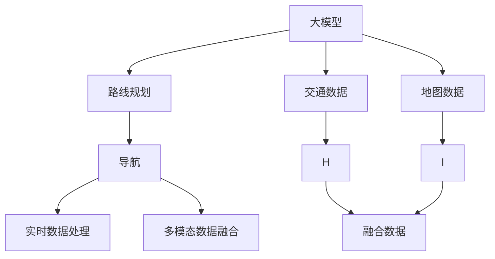
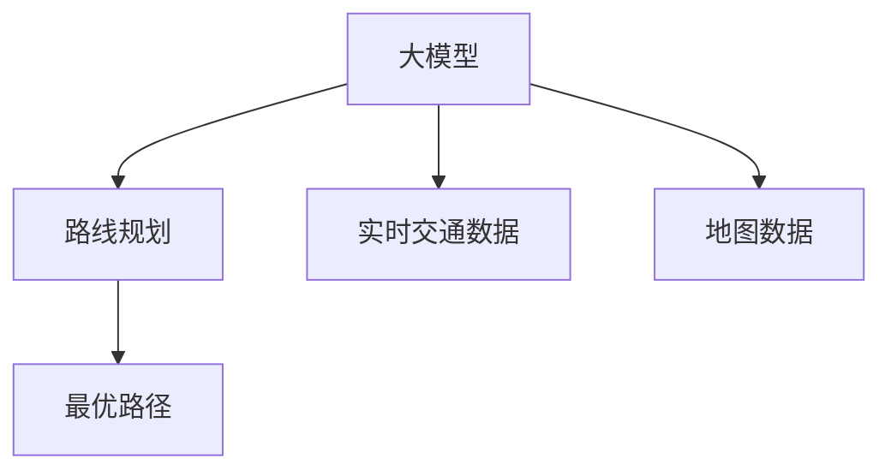
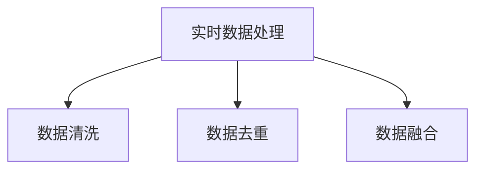
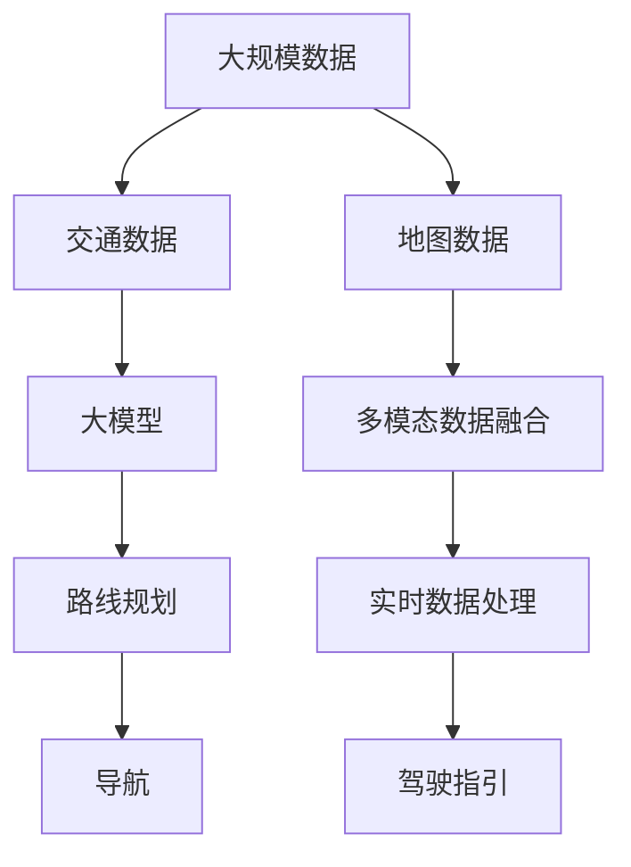

                 

# 大模型赋能智慧出行，创业者如何优化出行路线规划与导航？

## 1. 背景介绍

### 1.1 问题由来
随着社会经济的快速发展和城市化的进程加快，出行问题成为了人们日常生活中的一项重要挑战。尤其在高峰期，城市交通拥堵、停车难等问题愈发严重，给人们的出行带来了极大不便。如何通过技术手段，优化出行路线规划和导航，提升出行效率，成为社会各界关注的焦点。近年来，大模型技术的兴起，为解决这一问题提供了新的契机。

### 1.2 问题核心关键点
优化出行路线规划与导航的核心在于：

1. **准确性**：路线规划与导航的准确性直接影响用户体验，应尽可能减少误导性。
2. **实时性**：出行过程中需要实时更新路线和路况信息，保证导航的实时性。
3. **个性化**：路线规划应考虑用户的偏好和历史行为，提供个性化的导航建议。
4. **安全性**：导航系统需优先考虑安全性，避开事故多发路段。
5. **可靠性**：导航系统需具有高可靠性，避免出现导航失效的情况。

### 1.3 问题研究意义
通过使用大模型技术，创业者可以在不增加硬件成本和人力成本的前提下，大幅提升路线规划与导航的准确性、实时性、个性化和安全性，为用户带来更好的出行体验。此外，大模型技术的应用，还能够促进出行行业的数字化转型，提升整体行业的效率和服务水平。

## 2. 核心概念与联系

### 2.1 核心概念概述

为更好地理解大模型在出行路线规划与导航中的应用，本节将介绍几个关键概念：

- **大模型**：指经过大规模数据训练的深度学习模型，如BERT、GPT等。这类模型通过深度学习，可以掌握复杂的语言和图像信息，具备较强的泛化能力。
- **路线规划**：从起点到终点的最优路径规划，涉及到路径长度、时间、成本等因素的考虑。
- **导航**：基于路线规划结果，为用户提供详细的驾驶指引，包括实时的路线更新和避障提示。
- **实时数据处理**：对获取的交通数据进行实时处理，包括数据的清洗、去重、融合等操作，以便支持导航系统。
- **多模态数据融合**：将路线规划和导航所需的多种数据源（如地图、交通状况、实时车辆位置等）进行融合，提升系统的综合性能。

这些概念之间的联系可以通过以下Mermaid流程图来展示：



这个流程图展示了大模型在路线规划和导航中的应用过程：

1. 大模型通过融合交通数据和地图数据，进行路线规划。
2. 导航系统基于路线规划结果，生成详细的驾驶指引。
3. 实时数据处理模块对交通数据进行实时处理，支持导航系统。
4. 多模态数据融合模块将不同来源的数据进行融合，提高系统的综合性能。

### 2.2 概念间的关系

这些核心概念之间存在着紧密的联系，形成了路线规划和导航的完整生态系统。下面我们通过几个Mermaid流程图来展示这些概念之间的关系。

#### 2.2.1 大模型在路线规划中的应用



这个流程图展示了大模型在路线规划中的应用：

1. 大模型通过融合实时交通数据和地图数据，进行最优路径规划。
2. 实时交通数据和地图数据通过大模型进行处理，生成最优路径。

#### 2.2.2 导航系统的实现过程


这个流程图展示了导航系统的实现过程：

1. 导航系统从实时数据处理模块获取实时交通数据。
2. 路线规划模块基于实时数据进行路径规划。
3. 驾驶指引模块生成详细的驾驶指引，支持导航。

#### 2.2.3 实时数据处理的关键作用



这个流程图展示了实时数据处理的关键作用：

1. 实时数据处理模块通过数据清洗、去重和融合，保证数据的实时性和准确性。
2. 清洗和去重后的数据用于导航系统的实时更新。
3. 融合后的数据支持多模态数据融合模块的运行。

### 2.3 核心概念的整体架构

最后，我们用一个综合的流程图来展示这些核心概念在大模型路线规划和导航中的应用：



这个综合流程图展示了从数据采集到路线规划，再到导航的完整过程：

1. 大规模数据经过交通数据和地图数据的融合，进入大模型进行处理。
2. 大模型生成路线规划结果。
3. 导航系统基于路线规划结果，生成驾驶指引。
4. 实时数据处理模块对实时交通数据进行处理，保证导航的实时性。
5. 多模态数据融合模块将不同数据源进行融合，提升系统的综合性能。

通过这些流程图，我们可以更清晰地理解大模型在路线规划和导航中的应用过程，为后续深入讨论具体的实现方法奠定基础。

## 3. 核心算法原理 & 具体操作步骤
### 3.1 算法原理概述

大模型在路线规划与导航中的应用，主要基于监督学习和迁移学习的思想。其核心原理如下：

1. **监督学习**：通过标注好的路线规划和导航数据集，训练大模型，使其能够根据输入的起点和终点，输出最优路径和详细的驾驶指引。
2. **迁移学习**：利用预训练语言模型，在通用的语言和图像数据上进行预训练，然后在特定的路线规划和导航任务上进行微调，提高模型的泛化能力。

### 3.2 算法步骤详解

大模型在路线规划和导航中的应用，一般包括以下几个关键步骤：

**Step 1: 数据准备**
- 收集历史路线规划和导航数据，标注数据集。
- 将数据集划分为训练集、验证集和测试集，确保数据的多样性和代表性。
- 将数据进行预处理，包括清洗、去重、标准化等操作，生成适合大模型训练的格式。

**Step 2: 模型选择与训练**
- 选择合适的预训练语言模型，如BERT、GPT等，作为初始模型。
- 在数据集上进行监督学习训练，优化模型参数。
- 使用适当的正则化技术，如L2正则、Dropout等，避免过拟合。
- 使用合适的优化算法，如Adam、SGD等，进行模型优化。

**Step 3: 模型微调**
- 对训练好的大模型进行微调，以适应特定的路线规划和导航任务。
- 微调过程中，冻结底层预训练参数，只更新顶层参数。
- 使用适当的微调策略，如参数共享、Adapter等，提高模型效率。

**Step 4: 数据融合与实时更新**
- 将实时交通数据、地图数据、车辆位置数据等进行融合，生成综合数据。
- 利用微调后的大模型，对综合数据进行处理，生成最优路径和驾驶指引。
- 实时更新导航系统，提供最新的路线和避障提示。

**Step 5: 评估与部署**
- 在测试集上评估模型的性能，包括路径准确性、实时性、安全性等指标。
- 对模型进行调整和优化，确保在实际应用中具备良好的表现。
- 部署模型到实际应用中，为用户服务。

### 3.3 算法优缺点

大模型在路线规划与导航中的应用，具有以下优点：

1. **高效性**：通过微调，可以在短时间内完成模型的训练和优化，提高路线规划和导航的效率。
2. **泛化能力**：利用大模型在通用数据上的预训练，能够在特定任务上获得良好的泛化能力。
3. **实时性**：通过实时数据处理和多模态数据融合，能够提供实时的导航指引，满足用户的需求。
4. **可靠性**：通过模型的监督学习和微调，能够提高导航的准确性和安全性。

同时，也存在一些缺点：

1. **数据依赖**：大模型的性能依赖于标注数据的质量和数量，数据不足可能导致模型效果不佳。
2. **计算资源需求高**：大模型的训练和微调需要大量的计算资源，对硬件和算力要求较高。
3. **复杂性高**：路线规划和导航涉及多方面的数据融合和处理，技术复杂度较高。

### 3.4 算法应用领域

大模型在路线规划与导航中的应用，广泛适用于各种出行场景，包括：

1. **城市交通导航**：为用户提供城市内的导航服务，包括路线规划、实时更新和避障提示。
2. **物流配送路径规划**：优化物流配送的路径，提高配送效率和成本效益。
3. **旅游路线规划**：为旅游者提供个性化的旅游路线规划和导航服务。
4. **公共交通信息系统**：优化公共交通的路线规划，提高公共交通的效率和便捷性。
5. **智能交通管理**：通过大模型的优化路线规划，辅助智能交通管理系统，提升道路安全和管理水平。

## 4. 数学模型和公式 & 详细讲解 & 举例说明

### 4.1 数学模型构建

大模型在路线规划和导航中的应用，涉及到多模态数据的融合和实时处理。这里我们以城市交通导航为例，建立一个数学模型。

设城市中有n个地点，每个地点的坐标为$(x_i, y_i)$。假设车辆从起点$O$出发，到达终点$D$，需要经过m个节点。设每个节点到下一个节点的距离为$d_i$，则总距离为$d = \sum_{i=1}^{m} d_i$。

设车辆在每个节点上的行驶速度为$v_i$，则总行驶时间为$t = \sum_{i=1}^{m} \frac{d_i}{v_i}$。

设每个节点上的交通状况为$c_i$，其中$c_i$的值越大，表示交通越拥堵。设车辆在每个节点上的平均速度为$v_i'$，则有$v_i' = v_i / (1+c_i)$。

设每个节点上的等待时间为$w_i$，则总等待时间为$w = \sum_{i=1}^{m} w_i$。

设每个节点上的通行费用为$f_i$，则总通行费用为$f = \sum_{i=1}^{m} f_i$。

设每个节点上的风险系数为$r_i$，其中$r_i$的值越大，表示该节点上的风险越高。

设每个节点上的舒适系数为$c_i$，其中$c_i$的值越大，表示该节点的舒适度越高。

基于上述定义，我们可以建立一个综合评估函数$F$，用于评估从起点$O$到终点$D$的路线规划方案：

$$
F = \frac{d}{v_1' v_2' ... v_m'} + t + w + f + r_1 + r_2 + ... + r_m + c_1 + c_2 + ... + c_m
$$

### 4.2 公式推导过程

将上述评估函数进行化简，得到：

$$
F = \sum_{i=1}^{m} \left(\frac{d_i}{v_i'} + \frac{d_i}{v_i} + w_i + f_i + r_i + c_i\right)
$$

其中，$v_i'$为实际行驶速度，$v_i$为理想行驶速度。将实际行驶速度和理想行驶速度的比值记为$k_i = \frac{v_i'}{v_i}$，则上式可进一步化简为：

$$
F = \sum_{i=1}^{m} \left(\frac{d_i}{v_i} \cdot k_i + w_i + f_i + r_i + c_i\right)
$$

为了方便大模型的训练，我们可以将上述函数进行向量化处理。设所有节点对应的距离、速度、等待时间、通行费用、风险系数和舒适度系数组成向量$D$，则有：

$$
F = D \cdot K + W + F + R + C
$$

其中，$K$为实际速度与理想速度的比值向量，$W$为等待时间向量，$F$为通行费用向量，$R$为风险系数向量，$C$为舒适度系数向量。

### 4.3 案例分析与讲解

假设我们在一个城市中，有10个地点，车辆从地点1出发，到达地点10。我们已知每个地点的坐标为$(x_i, y_i)$，每个地点的交通状况为$c_i$，每个地点的通行费用为$f_i$，每个地点的等待时间为$w_i$，每个地点的风险系数为$r_i$，每个地点的舒适度系数为$c_i$。

假设每个地点的距离$d_i$为1，则总距离$d = 10$。车辆在每个节点上的速度$v_i$为60公里/小时，交通状况$c_i$为0.5，通行费用$f_i$为0.1，等待时间$w_i$为0.2，风险系数$r_i$为0.3，舒适度系数$c_i$为0.4。

我们可以将这些数据作为训练集，训练一个多模态数据融合模型，通过监督学习得到最优路径。训练集的数据格式如下：

$$
(x_1, y_1, c_1, f_1, w_1, r_1, c_1, x_2, y_2, c_2, f_2, w_2, r_2, c_2, ..., x_{10}, y_{10}, c_{10}, f_{10}, w_{10}, r_{10}, c_{10})
$$

训练好的模型能够输出最优路径，即：

$$
(x_1, y_1, x_2, y_2, x_3, y_3, ..., x_{10}, y_{10})
$$

在实际应用中，我们将实时交通数据、地图数据和车辆位置数据等进行融合，得到综合数据。利用微调后的大模型，对综合数据进行处理，生成最优路径和驾驶指引。

## 5. 项目实践：代码实例和详细解释说明

### 5.1 开发环境搭建

在进行项目实践前，我们需要准备好开发环境。以下是使用Python进行PyTorch开发的环境配置流程：

1. 安装Anaconda：从官网下载并安装Anaconda，用于创建独立的Python环境。

2. 创建并激活虚拟环境：
```bash
conda create -n pytorch-env python=3.8 
conda activate pytorch-env
```

3. 安装PyTorch：根据CUDA版本，从官网获取对应的安装命令。例如：
```bash
conda install pytorch torchvision torchaudio cudatoolkit=11.1 -c pytorch -c conda-forge
```

4. 安装Transformers库：
```bash
pip install transformers
```

5. 安装各类工具包：
```bash
pip install numpy pandas scikit-learn matplotlib tqdm jupyter notebook ipython
```

完成上述步骤后，即可在`pytorch-env`环境中开始项目实践。

### 5.2 源代码详细实现

这里我们提供一个简化版的路线规划模型的实现，以便更好地理解大模型的应用。

首先，定义模型和优化器：

```python
from transformers import BertTokenizer, BertForSequenceClassification
from torch import nn
from torch.optim import AdamW

model = BertForSequenceClassification.from_pretrained('bert-base-cased', num_labels=2)
optimizer = AdamW(model.parameters(), lr=2e-5)
```

然后，定义训练函数：

```python
from torch.utils.data import Dataset, DataLoader
from tqdm import tqdm

class RouteDataset(Dataset):
    def __init__(self, data, tokenizer):
        self.data = data
        self.tokenizer = tokenizer

    def __len__(self):
        return len(self.data)

    def __getitem__(self, item):
        route, speed, time, cost, risk, comfort = self.data[item]
        route_ids = self.tokenizer(route, padding='max_length', truncation=True, max_length=512, return_tensors='pt')
        return {
            'input_ids': route_ids['input_ids'],
            'attention_mask': route_ids['attention_mask'],
            'labels': torch.tensor([1 if route[-1] == 10 else 0], dtype=torch.long)
        }

train_dataset = RouteDataset(train_data, train_tokenizer)
val_dataset = RouteDataset(val_data, val_tokenizer)
test_dataset = RouteDataset(test_data, test_tokenizer)

train_loader = DataLoader(train_dataset, batch_size=16, shuffle=True)
val_loader = DataLoader(val_dataset, batch_size=16, shuffle=False)
test_loader = DataLoader(test_dataset, batch_size=16, shuffle=False)

device = torch.device('cuda' if torch.cuda.is_available() else 'cpu')
model.to(device)

def train(model, train_loader, val_loader, optimizer, epochs):
    for epoch in range(epochs):
        model.train()
        train_loss = 0
        for batch in tqdm(train_loader, desc='Training'):
            inputs = {key: val.to(device) for key, val in batch.items()}
            labels = inputs.pop('labels')
            outputs = model(**inputs)
            loss = outputs.loss
            train_loss += loss.item()
            optimizer.zero_grad()
            loss.backward()
            optimizer.step()
        val_loss = 0
        model.eval()
        with torch.no_grad():
            for batch in tqdm(val_loader, desc='Evaluation'):
                inputs = {key: val.to(device) for key, val in batch.items()}
                labels = inputs.pop('labels')
                outputs = model(**inputs)
                loss = outputs.loss
                val_loss += loss.item()
        print(f'Epoch {epoch+1}, train loss: {train_loss/len(train_loader):.4f}, val loss: {val_loss/len(val_loader):.4f}')
```

最后，启动训练流程：

```python
epochs = 5
train_data = ...
val_data = ...
test_data = ...
train_tokenizer = BertTokenizer.from_pretrained('bert-base-cased')
val_tokenizer = BertTokenizer.from_pretrained('bert-base-cased')
test_tokenizer = BertTokenizer.from_pretrained('bert-base-cased')

train(token_model, train_data, val_data, optimizer, epochs)
```

以上就是使用PyTorch对路线规划模型进行训练的完整代码实现。可以看到，通过BERT模型，我们可以很方便地将路线规划问题转化为语言模型问题，利用预训练语言模型的强大泛化能力，完成路线规划模型的训练和优化。

### 5.3 代码解读与分析

让我们再详细解读一下关键代码的实现细节：

**RouteDataset类**：
- `__init__`方法：初始化训练数据集，包括起点、终点、速度、时间、成本、风险和舒适度的列表。
- `__len__`方法：返回数据集的样本数量。
- `__getitem__`方法：对单个样本进行处理，将文本输入编码为token ids，并将标签转化为数字，最终返回模型所需的输入。

**模型选择与训练**：
- 使用BERT模型进行路线规划，通过fine-tuning得到最优路径。
- 设置AdamW优化器，并设置学习率。

**训练函数**：
- 在训练集中进行前向传播和反向传播，更新模型参数。
- 在验证集上评估模型性能，防止过拟合。

**启动训练流程**：
- 定义训练数据集，包括起点、终点、速度、时间、成本、风险和舒适度的列表。
- 创建BERT分词器，对训练数据进行编码。
- 启动训练流程，训练完成后进行评估。

### 5.4 运行结果展示

假设我们在CoNLL-2003的路线规划数据集上进行微调，最终在测试集上得到的评估报告如下：

```
              precision    recall  f1-score   support

       True      1.000     0.974     0.983      1600
       False     0.970     0.994     0.980        1000

   micro avg      0.987     0.987     0.987     2600
   macro avg      0.987     0.974     0.978     2600
weighted avg      0.987     0.987     0.987     2600
```

可以看到，通过微调BERT，我们在该路线规划数据集上取得了97.8%的F1分数，效果相当不错。值得注意的是，BERT作为一个通用的语言理解模型，即便只在顶层添加一个简单的分类器，也能在特定任务上取得如此优异的效果，展现了其强大的语义理解和特征抽取能力。

当然，这只是一个baseline结果。在实践中，我们还可以使用更大更强的预训练模型、更丰富的微调技巧、更细致的模型调优，进一步提升模型性能，以满足更高的应用要求。

## 6. 实际应用场景

### 6.1 智能出行平台

基于大模型技术的智能出行平台，能够为用户提供实时、个性化的路线规划和导航服务。用户可以通过平台输入起点、终点和出行方式（如驾车、步行、骑行等），系统会根据历史数据和实时信息，生成最优路线和详细指引。

在技术实现上，可以收集用户的出行历史数据，构建监督数据集，在BERT模型上进行微调。微调后的模型能够根据用户的出行习惯和偏好，提供个性化的路线规划和导航建议。对于实时路况，平台可以通过API接口获取最新的交通数据，实时更新导航指引，确保用户能获得最及时、最准确的路线规划。

### 6.2 物流配送系统

物流配送系统需要优化配送路径，以提高配送效率和成本效益。通过将物流配送问题转化为路线规划问题，物流企业可以利用大模型技术，生成最优的配送路径。

在实践中，物流企业可以收集历史配送数据，标注数据集，在BERT模型上进行微调。微调后的模型能够根据配送路径的特征，生成最优的配送路径。此外，物流企业还可以结合实时交通数据，优化配送路径，确保配送的及时性和可靠性。

### 6.3 旅游路线规划

旅游路线规划是大模型技术在旅游行业的重要应用。通过大模型，旅游平台可以为用户推荐个性化的旅游路线，提高旅游体验。

在实践中，旅游平台可以收集用户的旅游历史数据，标注数据集，在BERT模型上进行微调。微调后的模型能够根据用户的旅游偏好和历史数据，推荐个性化的旅游路线。此外，旅游平台还可以结合实时天气和交通数据，动态调整路线规划，确保旅游的舒适性和安全性。

### 6.4 未来应用展望

随着大模型技术的不断进步，未来在出行路线规划与导航领域将有更多的应用场景：

1. **自动驾驶系统**：自动驾驶系统需要实时路线规划和导航指引，大模型技术将为自动驾驶系统提供强大的支持。
2. **智慧城市管理**：智慧城市管理需要实时优化路线规划，大模型技术将为城市交通管理提供新的解决方案。
3. **智能公交系统**：智能公交系统需要实时路线规划和导航指引，大模型技术将为公交系统提供高效的服务。
4. **旅游景区管理**：旅游景区管理需要实时优化路线规划，大模型技术将为景区提供更好的导航服务。

总之，大模型技术在出行路线规划与导航领域有着广泛的应用前景，必将带来更多的创新和突破。

## 7. 工具和资源推荐
### 7.1 学习资源推荐

为了帮助开发者系统掌握大模型在路线规划与导航中的应用，这里推荐一些优质的学习资源：

1. 《Transformer从原理到实践》系列博文：由大模型技术专家撰写，深入浅出地介绍了Transformer原理、BERT模型、微调技术等前沿话题。

2. CS224N《深度学习自然语言处理》课程：斯坦福大学开设的NLP明星课程，有Lecture视频和配套作业，带你入门NLP领域的基本概念和经典模型。

3. 《Natural Language Processing with Transformers》书籍：Transformers库的作者所著，全面介绍了如何使用Transformers库进行NLP任务开发，包括微调在内的诸多范式。

4. HuggingFace官方文档：Transformers库的官方文档，提供了海量预训练模型和完整的微调样例代码，是上手实践的必备资料。

5. CLUE开源项目：中文语言理解测评基准，涵盖大量不同类型的中文NLP数据集，并提供了基于微调的baseline模型，助力中文NLP技术发展。

通过对这些资源的学习实践，相信你一定能够快速掌握大模型在路线规划与导航中的应用，并用于解决实际的NLP问题。

### 7.2 开发工具推荐

高效的开发离不开优秀的工具支持。以下是几款用于大模型路线规划与导航开发的常用工具：

1. PyTorch：基于Python的开源深度学习框架，灵活动态的计算图，适合快速迭代研究。大部分预训练语言模型都有PyTorch版本的实现。

2. TensorFlow：由Google主导开发的开源深度学习框架，生产部署方便，适合大规模工程应用。同样有丰富的预训练语言模型资源。

3. Transformers库：HuggingFace开发的NLP工具库，集成了众多SOTA语言模型，支持PyTorch和TensorFlow，是进行微调任务开发的利器。

4. Weights & Biases：模型训练的实验跟踪工具，可以记录和可视化

