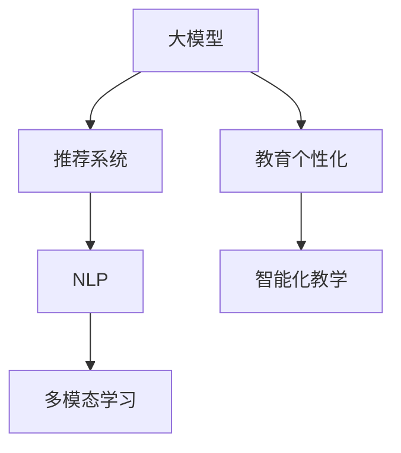

                 

# 大模型赋能智慧教育，创业者如何推动教育个性化与智能化？

教育是人类文明进步的基石，智能化的教育方式可以极大提升学习效率和教学质量。随着人工智能技术的发展，大模型（如GPT-3、BERT等）已经开始赋能教育行业，帮助教育创业者推动教育个性化与智能化的进程。本文将系统性地介绍大模型在教育领域的应用，并探讨创业者如何利用大模型技术实现教育创新的关键步骤。

## 1. 背景介绍

### 1.1 问题由来

随着互联网和移动互联网的普及，教育模式正在经历一场深刻变革。传统的一对多教学模式，已经难以满足学生多样化的学习需求。大模型技术的应用，使得个性化学习、智能辅助教学等新兴教育模式成为可能。创业者需要理解并应用这些先进技术，以实现教育创新和转型。

### 1.2 问题核心关键点

教育个性化与智能化的核心在于利用大数据、人工智能等技术，对每个学生的学习路径、知识掌握情况进行精准分析，进而提供个性化的学习内容和辅助教学方案。而大模型的出现，为实现这一目标提供了强有力的工具。大模型可以从海量文本数据中学习语言规律和常识，并具备强大的自然语言理解和生成能力，能够帮助教师设计个性化教学方案，帮助学生自主学习和掌握知识。

### 1.3 问题研究意义

大模型赋能教育个性化与智能化的研究，对提升教育质量和效率具有重要意义：

1. **降低教学成本**：通过自动化教学方案设计，减少了教师的工作负担，降低了人力成本。
2. **提高学习效率**：个性化教学能够针对每个学生的特点，提供最合适的学习资源和路径，提升学习效果。
3. **拓展教学资源**：大模型能够提供丰富多样的学习内容，超越传统教学资源的限制。
4. **提升教学质量**：通过智能辅助教学，帮助教师更加准确地评估学生的学习状态，提高教学质量。
5. **推动教育公平**：大模型可以跨越地域和资源限制，为更多学生提供优质教育资源。

## 2. 核心概念与联系

### 2.1 核心概念概述

1. **大模型**：基于大规模无标签文本数据进行预训练的语言模型，如GPT-3、BERT等，具备强大的自然语言理解和生成能力。
2. **教育个性化**：根据学生的个性化需求和学习特点，提供量身定制的学习内容和路径。
3. **智能化教学**：利用人工智能技术，实现教学方案的自动化设计和执行，提升教学效率和效果。
4. **推荐系统**：根据学生的学习历史和偏好，推荐个性化的学习资源和任务。
5. **自然语言处理(NLP)**：利用NLP技术，处理和分析学生的语言输入，帮助其理解、推理和生成。
6. **多模态学习**：结合文本、图像、音频等多模态数据，提供丰富的学习体验。

### 2.2 概念间的关系

这些核心概念间的关系可以概括为：大模型提供了智能化的教育工具，推荐系统帮助学生选择个性化的学习资源，NLP技术分析学生的语言输入和输出，多模态学习丰富了学习体验，共同构成教育个性化的技术支撑体系。


### 2.3 核心概念的整体架构

核心概念的整体架构如下：



这个架构展示了从大模型到教育个性化的技术路径，从大模型学习知识，到推荐系统提供个性化资源，再到NLP和多模态学习丰富学习体验，最终实现教育个性化与智能化的目标。

## 3. 核心算法原理 & 具体操作步骤
### 3.1 算法原理概述

教育个性化与智能化的算法原理主要包括以下几个步骤：

1. **数据准备**：收集学生的学习数据，包括学习行为、测试成绩、兴趣标签等。
2. **模型训练**：使用大模型对学生数据进行训练，提取学生的语言模型和知识图谱。
3. **推荐生成**：基于训练好的模型，生成个性化的学习资源和任务推荐。
4. **学习路径设计**：根据推荐结果，设计个性化的学习路径和任务。
5. **智能辅助教学**：利用智能化的教学工具，如虚拟助教、语音交互等，辅助学生学习。
6. **效果评估与反馈**：定期评估学生的学习效果，收集反馈，不断优化推荐模型。

### 3.2 算法步骤详解

#### 3.2.1 数据准备

**步骤1**：收集学生的学习数据，包括学生的学习行为数据、测试成绩、兴趣标签等。数据来源包括学生的作业、讨论、互动等。

**步骤2**：对数据进行清洗和预处理，去除噪声和异常值，生成统一格式的数据集。

**步骤3**：将数据集划分为训练集、验证集和测试集，用于模型训练和效果评估。

#### 3.2.2 模型训练

**步骤1**：选择合适的预训练模型，如BERT、GPT-3等，作为学生语言模型的初始化。

**步骤2**：使用学生数据训练语言模型，提取学生的语言特征和知识图谱。

**步骤3**：将语言模型与知识图谱进行融合，生成学生的综合特征表示。

#### 3.2.3 推荐生成

**步骤1**：根据学生特征表示，生成个性化学习资源的推荐列表。

**步骤2**：利用推荐系统算法，如协同过滤、矩阵分解等，对推荐列表进行排序和筛选。

**步骤3**：生成个性化的学习路径和任务，包括学习资源、学习目标和时间安排等。

#### 3.2.4 学习路径设计

**步骤1**：根据推荐结果，设计个性化的学习路径，包括学习资源的顺序、时间安排和评估标准等。

**步骤2**：将学习路径转化为具体的学习任务和目标，提供给学生执行。

**步骤3**：定期评估学生的学习进度和效果，根据评估结果调整学习路径。

#### 3.2.5 智能辅助教学

**步骤1**：使用智能化的教学工具，如虚拟助教、语音交互等，辅助学生完成学习任务。

**步骤2**：利用自然语言处理技术，分析学生的语言输入和输出，提供即时反馈和建议。

**步骤3**：通过多模态学习，结合文本、图像、音频等资源，丰富学习体验。

#### 3.2.6 效果评估与反馈

**步骤1**：定期评估学生的学习效果，包括知识掌握情况、学习进度等。

**步骤2**：收集学生的反馈意见，了解他们的需求和体验。

**步骤3**：根据评估和反馈结果，优化推荐模型和教学方案。

### 3.3 算法优缺点

大模型赋能教育个性化与智能化的算法具有以下优点：

1. **高效性**：能够快速生成个性化的学习资源和路径，提升教学效率。
2. **个性化**：根据学生的个性化需求，提供量身定制的学习方案。
3. **智能化**：利用人工智能技术，实现教学方案的自动化设计。

同时，该算法也存在以下缺点：

1. **数据隐私**：收集和处理学生数据可能涉及隐私问题，需加强数据保护措施。
2. **公平性**：个性化推荐可能加剧学生之间的差距，需考虑公平性问题。
3. **技术门槛**：实现教育个性化与智能化需要较高的技术门槛，需具备相应技术能力。

### 3.4 算法应用领域

大模型赋能教育个性化与智能化的算法，主要应用于以下领域：

1. **K-12教育**：为中小学生提供个性化学习方案和智能辅助教学工具。
2. **职业培训**：为成人提供职业技能的个性化培训和智能辅导。
3. **高等教育**：为大学生提供个性化学习和智能辅助科研工具。
4. **终身学习**：为在职人员提供个性化的继续教育和培训。
5. **特殊教育**：为特殊教育学生提供个性化的教学方案和辅助工具。

## 4. 数学模型和公式 & 详细讲解 & 举例说明
### 4.1 数学模型构建

假设学生特征表示为 $x \in \mathbb{R}^n$，学习资源特征表示为 $y \in \mathbb{R}^m$。根据学生的语言模型和知识图谱，构建如下数学模型：

$$
y = f(x, \theta)
$$

其中 $f$ 表示推荐函数，$\theta$ 为模型参数。

### 4.2 公式推导过程

推荐函数 $f$ 可以表示为：

$$
f(x, \theta) = \text{softmax}(\alpha W x + \beta b)
$$

其中 $W$ 为权重矩阵，$b$ 为偏置向量，$\alpha$ 和 $\beta$ 为可调参数。

### 4.3 案例分析与讲解

以推荐系统为例，假设有一个学生的语言模型 $x$ 和知识图谱 $k$，推荐系统根据这些特征生成推荐结果 $y$。推荐函数 $f$ 的参数 $\theta$ 包括 $W$、$b$、$\alpha$ 和 $\beta$。

推荐函数的具体实现可以基于矩阵分解、协同过滤等算法。例如，基于矩阵分解的推荐系统，可以利用矩阵 $U$ 和 $V$ 对学生特征 $x$ 和学习资源特征 $y$ 进行分解：

$$
X = U \times \Lambda \times V^T
$$

其中 $\Lambda$ 为低秩矩阵，$U$ 和 $V$ 为矩阵分解因子。通过计算学生特征 $x$ 和资源特征 $y$ 的相似度，生成推荐结果。

## 5. 项目实践：代码实例和详细解释说明
### 5.1 开发环境搭建

开发者可以利用Python、TensorFlow等工具进行项目实践。以下是一个简单的开发环境搭建流程：

1. 安装Python环境：
   ```
   conda create --name myenv python=3.7
   conda activate myenv
   ```

2. 安装TensorFlow和相关库：
   ```
   pip install tensorflow-gpu
   pip install transformers sklearn
   ```

3. 准备数据集：收集学生的学习数据，并将其划分为训练集、验证集和测试集。

### 5.2 源代码详细实现

以下是一个简单的代码示例，展示了如何使用BERT模型进行个性化学习资源推荐：

```python
import tensorflow as tf
import transformers
from sklearn.metrics import accuracy_score

# 加载BERT模型
model = transformers.TFBertForSequenceClassification.from_pretrained('bert-base-uncased', num_labels=2)

# 加载学生数据集
train_dataset = ...
val_dataset = ...
test_dataset = ...

# 定义推荐函数
def recommend(model, dataset):
    preds = []
    for data in dataset:
        input_ids = data['input_ids']
        attention_mask = data['attention_mask']
        outputs = model(input_ids, attention_mask=attention_mask)
        pred = tf.nn.softmax(outputs[0], axis=1).numpy()[0]
        preds.append(pred)
    return preds

# 训练模型
for epoch in range(num_epochs):
    with tf.GradientTape() as tape:
        loss = tf.reduce_mean(tf.keras.losses.sparse_categorical_crossentropy(y_true, preds))
    gradients = tape.gradient(loss, model.trainable_variables)
    optimizer.apply_gradients(zip(gradients, model.trainable_variables))

# 评估模型
y_true = []
y_pred = []
for data in test_dataset:
    input_ids = data['input_ids']
    attention_mask = data['attention_mask']
    outputs = model(input_ids, attention_mask=attention_mask)
    y_true.append(data['label'])
    y_pred.append(tf.nn.softmax(outputs[0], axis=1).numpy()[0])
accuracy = accuracy_score(y_true, y_pred)
```

### 5.3 代码解读与分析

这段代码展示了使用BERT模型进行个性化学习资源推荐的流程。主要步骤包括：

1. 加载BERT模型。
2. 准备学生数据集，包括输入特征 `input_ids` 和 `attention_mask`。
3. 定义推荐函数，使用BERT模型对学生数据进行预测，生成推荐结果。
4. 训练模型，通过梯度下降更新模型参数。
5. 评估模型，计算预测准确率。

## 6. 实际应用场景
### 6.1 智能作业批改系统

智能作业批改系统可以帮助教师快速、准确地批改学生的作业，减轻教师工作负担。大模型可以用于批改客观题，如选择题、填空题等，提升批改效率和准确率。

系统的工作流程如下：

1. 教师将作业上传到系统中。
2. 系统使用BERT等模型对学生作业进行语言理解和分析。
3. 模型生成作业的评分和批改建议。
4. 教师审核评分和建议，完成作业批改。

### 6.2 智能助教

智能助教可以辅助教师进行教学，包括智能答疑、作业批改、知识点巩固等。大模型可以用于自然语言理解和生成，帮助学生解答问题，生成个性化学习资源。

系统的工作流程如下：

1. 学生提出问题，通过语音或文本方式输入。
2. 系统使用BERT等模型理解学生的问题，生成回答。
3. 系统生成个性化学习资源，如视频、练习题等。
4. 教师审核系统的回答和资源，提供进一步指导。

### 6.3 个性化学习资源推荐

个性化学习资源推荐系统可以帮助学生找到适合自己的学习资源，包括教科书、视频、练习题等。大模型可以用于分析学生的学习历史和兴趣，生成推荐结果。

系统的工作流程如下：

1. 学生通过作业、测试等途径，积累学习数据。
2. 系统使用BERT等模型分析学生的学习数据，生成学生特征表示。
3. 系统生成个性化学习资源推荐列表。
4. 学生根据推荐列表选择适合自己的学习资源。

## 7. 工具和资源推荐
### 7.1 学习资源推荐

1. **《深度学习与自然语言处理》**：介绍深度学习在NLP中的应用，包括大模型和推荐系统。
2. **Coursera《自然语言处理与深度学习》**：由斯坦福大学开设的课程，涵盖NLP的基本概念和深度学习技术。
3. **Kaggle竞赛**：参与NLP相关的Kaggle竞赛，积累实战经验。
4. **arXiv论文预印本**：获取最新的NLP研究成果和前沿动态。

### 7.2 开发工具推荐

1. **TensorFlow**：强大的深度学习框架，支持GPU加速。
2. **PyTorch**：灵活的深度学习框架，支持动态图计算。
3. **HuggingFace Transformers库**：提供丰富的预训练模型，支持自然语言处理任务。
4. **Scikit-learn**：提供机器学习算法和工具，支持数据预处理和模型评估。
5. **Jupyter Notebook**：交互式的开发环境，支持代码编写和模型训练。

### 7.3 相关论文推荐

1. **《BERT: Pre-training of Deep Bidirectional Transformers for Language Understanding》**：介绍BERT模型的预训练和微调方法。
2. **《GPT-3: Language Models are Unsupervised Multitask Learners》**：介绍GPT-3模型的零样本学习能力。
3. **《Attention is All You Need》**：介绍Transformer模型的结构和应用。
4. **《Parameter-Efficient Transfer Learning for NLP》**：介绍参数高效微调方法，如Adapter。
5. **《AdaLoRA: Adaptive Low-Rank Adaptation for Parameter-Efficient Fine-Tuning》**：介绍AdaLoRA等参数高效微调方法。

## 8. 总结：未来发展趋势与挑战
### 8.1 研究成果总结

大模型在教育个性化与智能化方面的应用，已经取得了初步成果。通过使用BERT等大模型，可以显著提升学生的学习效果和教师的教学效率。推荐系统、NLP技术等多项技术的应用，为教育创新提供了强有力的支持。

### 8.2 未来发展趋势

1. **多模态学习**：结合文本、图像、音频等多模态数据，提供更丰富的学习体验。
2. **个性化推荐系统**：通过深入分析学生的学习数据，生成更加个性化的推荐结果。
3. **智能辅助教学**：利用自然语言处理和生成技术，实现智能答疑、作业批改等功能。
4. **知识图谱**：结合知识图谱技术，提供更丰富的知识背景和关联信息。
5. **大模型优化**：通过优化大模型的结构和算法，提升其效率和效果。

### 8.3 面临的挑战

1. **数据隐私**：收集和处理学生数据可能涉及隐私问题，需加强数据保护措施。
2. **公平性**：个性化推荐可能加剧学生之间的差距，需考虑公平性问题。
3. **技术门槛**：实现教育个性化与智能化需要较高的技术门槛，需具备相应技术能力。
4. **模型效果**：如何提升大模型的效果和可解释性，是未来的一大挑战。

### 8.4 研究展望

未来，大模型在教育个性化与智能化方面的应用将更加广泛和深入。在多模态学习、个性化推荐系统、智能辅助教学等方面，将会有更多创新和突破。同时，如何提升大模型的效果和可解释性，如何保护学生数据隐私，将是未来研究的重要方向。

## 9. 附录：常见问题与解答

**Q1: 大模型在教育个性化与智能化方面的应用有哪些？**

A: 大模型可以用于智能作业批改、智能助教、个性化学习资源推荐等多个方面。通过自然语言处理和生成技术，大模型可以帮助教师和学生实现智能化的教学和学习。

**Q2: 如何提升大模型的效果和可解释性？**

A: 提升大模型的效果和可解释性，需要从数据、模型、算法等多个方面进行优化。收集更多的学习数据，优化模型的结构，引入更多的先验知识，加强模型解释性等方法，都可以提升大模型的效果和可解释性。

**Q3: 在应用大模型时，如何保护学生数据隐私？**

A: 保护学生数据隐私是应用大模型的重要前提。可以通过数据匿名化、数据加密、差分隐私等方法，保护学生数据的安全和隐私。同时，需要在数据收集和处理过程中，严格遵循相关法律法规和伦理规范。

**Q4: 教育个性化与智能化面临哪些挑战？**

A: 教育个性化与智能化面临的主要挑战包括数据隐私、公平性、技术门槛、模型效果和可解释性等。解决这些挑战需要多方面的努力和改进，包括加强数据保护、优化推荐算法、提高技术能力等。

**Q5: 大模型在教育个性化与智能化方面的应用前景如何？**

A: 大模型在教育个性化与智能化方面的应用前景广阔，可以显著提升学生的学习效果和教师的教学效率。通过结合自然语言处理和生成技术，大模型有望为教育创新提供强有力的支持。未来，随着技术的不断进步，大模型在教育领域的潜力将进一步释放。

