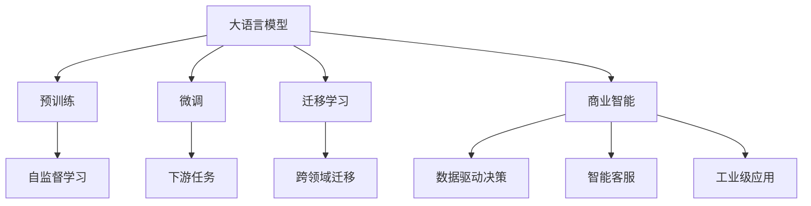

                 

# 大模型：推动商业智能的新动力

> 关键词：
1. 大语言模型
2. 商业智能
3. 数据驱动决策
4. 企业自动化
5. 工业级应用
6. 可解释性
7. 智能客服

## 1. 背景介绍

### 1.1 问题由来
近年来，随着人工智能技术的迅猛发展，大模型在各个领域的应用已经初见成效，尤其是在商业智能(BI)系统建设上，大模型的强大数据处理能力和智能决策能力正在重塑传统BI系统的面貌，为企业带来了前所未有的机遇与挑战。商业智能作为企业信息化的重要组成部分，其核心目标是通过对大量企业运营数据的分析和挖掘，为企业提供精准的决策支持，提升经营效率和盈利能力。传统的商业智能系统主要依赖复杂的数据处理算法和报表生成工具，其核心依赖在于人工构建复杂的逻辑规则和分析流程，难以适应数据复杂度日益增高的趋势，且缺乏智能化的决策能力。

随着深度学习技术的成熟和普及，大模型技术，如Transformer模型，BERT模型，GPT模型等，已经被广泛应用于商业智能系统中，这些大模型基于大规模无标签文本数据预训练，具有强大的语言理解能力和自然语言生成能力。通过微调和大模型融合，新的商业智能系统不仅能够处理海量数据，快速生成复杂报表，还能智能分析企业运营情况，生成科学决策，甚至能够理解用户需求，提供个性化服务，极大地提升了企业运营效率和客户满意度。

### 1.2 问题核心关键点
目前，大模型在商业智能系统中的应用主要集中在对文本数据的处理和分析，例如客户服务支持、市场分析、舆情监控、合同审核等。其核心在于利用大模型的预训练知识和微调能力，从数据中提取高层次的语义信息，进行推理和预测，生成报表和分析报告。

其中，大模型的核心作用在于：

1. 强大的语义理解能力：大模型能够理解自然语言中的复杂语义结构，快速从文本中提取关键信息。
2. 泛化能力强：大模型具有跨领域、跨语言的通用能力，能够适应多种商业智能应用场景。
3. 高效的特征提取：大模型可以自动学习输入数据的高级特征表示，提升数据处理的效率和精度。
4. 可解释性强：大模型能够提供详细的推理过程和决策逻辑，有助于提升商业智能系统的透明度和可解释性。

然而，大模型在商业智能系统中的应用也面临诸多挑战，主要包括：

1. 数据隐私和安全问题：大模型需要处理大量企业内部敏感数据，如何确保数据隐私和安全是一个重要问题。
2. 模型复杂度和计算成本：大模型的计算复杂度高，如何在保证性能的同时降低计算成本是一个技术难题。
3. 模型的可解释性和鲁棒性：大模型的决策过程复杂，如何确保模型的可解释性和鲁棒性，避免误导性决策，也是一个关键问题。
4. 数据多样性和业务场景复杂度：不同企业的业务场景和数据类型各异，如何构建通用的大模型，适用于多种商业智能应用场景，也是一个挑战。

## 2. 核心概念与联系

### 2.1 核心概念概述

为了更好地理解大模型在商业智能系统中的应用，本节将介绍几个关键概念：

- **大语言模型(Large Language Model, LLM)**：以自回归(如GPT)或自编码(如BERT)模型为代表的大规模预训练语言模型。通过在大规模无标签文本语料上进行预训练，学习通用的语言表示，具备强大的语言理解和生成能力。
- **预训练(Pre-training)**：指在大规模无标签文本语料上，通过自监督学习任务训练通用语言模型的过程。常见的预训练任务包括言语建模、遮挡语言模型等。
- **微调(Fine-tuning)**：指在预训练模型的基础上，使用下游任务的少量标注数据，通过有监督学习优化模型在该任务上的性能。通常只需要调整顶层分类器或解码器，并以较小的学习率更新全部或部分的模型参数。
- **迁移学习(Transfer Learning)**：指将一个领域学习到的知识，迁移应用到另一个不同但相关的领域的学习范式。大模型的预训练-微调过程即是一种典型的迁移学习方式。
- **商业智能(Business Intelligence, BI)**：指通过对企业运营数据的分析、处理和可视化，为企业决策提供支持的技术和工具。主要包括数据仓库、OLAP（联机分析处理）、数据挖掘、报表生成等技术。
- **数据驱动决策(Data-Driven Decision Making)**：指基于数据的决策制定，强调从数据中挖掘信息，以支持决策过程。
- **智能客服(Intelligent Customer Service)**：指通过自然语言处理(NLP)技术，构建能够自动处理客户咨询的客服系统。
- **工业级应用(Industrial-Level Application)**：指能够满足大规模生产、复杂业务场景的商业智能应用，具备高稳定性、高可扩展性、高可用性等特性。

这些核心概念之间的逻辑关系可以通过以下Mermaid流程图来展示：



这个流程图展示了大语言模型在商业智能系统中的应用框架，其中大语言模型通过预训练和微调获得语言理解能力，通过迁移学习适应不同商业智能任务，最终应用于数据驱动决策、智能客服、工业级应用等场景。

### 2.2 概念间的关系

这些核心概念之间存在着紧密的联系，形成了大语言模型在商业智能系统中的应用生态系统。

**大语言模型与预训练、微调的关系**：
大语言模型通过预训练学习通用的语言表示，然后通过微调学习特定任务的知识，适应下游应用场景。

**大语言模型与迁移学习的关系**：
大语言模型的预训练-微调过程即是迁移学习的一种方式，通过在大规模数据上预训练，然后针对特定任务进行微调，从而提升模型在该任务上的性能。

**大语言模型与商业智能的关系**：
大语言模型应用于商业智能系统，通过语义理解、数据处理和智能决策，帮助企业从海量数据中提取有用的信息，辅助决策。

**数据驱动决策与智能客服的关系**：
数据驱动决策依赖于数据处理和分析技术，智能客服系统能够根据用户查询自动生成分析结果，辅助决策。

**工业级应用与数据驱动决策的关系**：
工业级应用要求数据驱动决策系统具备高可靠性和高性能，能够处理大规模数据和复杂业务场景。

**智能客服与大语言模型的关系**：
智能客服系统利用大语言模型的自然语言处理能力，自动理解用户需求，生成回答，提供服务。

通过这些概念的关系，我们可以更好地理解大语言模型在商业智能系统中的应用场景和作用。

## 3. 核心算法原理 & 具体操作步骤

### 3.1 算法原理概述

大模型在商业智能系统中的应用，本质上是一个有监督的细粒度迁移学习过程。其核心思想是：将大模型视作一个强大的"特征提取器"，通过在特定任务的数据上进行有监督的微调，使得模型输出能够匹配任务标签，从而获得针对特定任务优化的模型。

形式化地，假设大模型为 $M_{\theta}$，其中 $\theta$ 为预训练得到的模型参数。给定商业智能任务 $T$ 的标注数据集 $D=\{(x_i, y_i)\}_{i=1}^N$，微调的目标是找到新的模型参数 $\hat{\theta}$，使得：

$$
\hat{\theta}=\mathop{\arg\min}_{\theta} \mathcal{L}(M_{\theta},D)
$$

其中 $\mathcal{L}$ 为针对任务 $T$ 设计的损失函数，用于衡量模型预测输出与真实标签之间的差异。常见的损失函数包括交叉熵损失、均方误差损失等。

通过梯度下降等优化算法，微调过程不断更新模型参数 $\theta$，最小化损失函数 $\mathcal{L}$，使得模型输出逼近真实标签。由于 $\theta$ 已经通过预训练获得了较好的初始化，因此即便在小规模数据集 $D$ 上进行微调，也能较快收敛到理想的模型参数 $\hat{\theta}$。

### 3.2 算法步骤详解

大模型在商业智能系统中的应用，一般包括以下几个关键步骤：

**Step 1: 准备预训练模型和数据集**
- 选择合适的预训练语言模型 $M_{\theta}$ 作为初始化参数，如 BERT、GPT等。
- 准备商业智能任务 $T$ 的标注数据集 $D$，划分为训练集、验证集和测试集。一般要求标注数据与预训练数据的分布不要差异过大。

**Step 2: 添加任务适配层**
- 根据任务类型，在预训练模型顶层设计合适的输出层和损失函数。
- 对于分类任务，通常在顶层添加线性分类器和交叉熵损失函数。
- 对于生成任务，通常使用语言模型的解码器输出概率分布，并以负对数似然为损失函数。

**Step 3: 设置微调超参数**
- 选择合适的优化算法及其参数，如 AdamW、SGD 等，设置学习率、批大小、迭代轮数等。
- 设置正则化技术及强度，包括权重衰减、Dropout、Early Stopping等。
- 确定冻结预训练参数的策略，如仅微调顶层，或全部参数都参与微调。

**Step 4: 执行梯度训练**
- 将训练集数据分批次输入模型，前向传播计算损失函数。
- 反向传播计算参数梯度，根据设定的优化算法和学习率更新模型参数。
- 周期性在验证集上评估模型性能，根据性能指标决定是否触发 Early Stopping。
- 重复上述步骤直到满足预设的迭代轮数或 Early Stopping 条件。

**Step 5: 测试和部署**
- 在测试集上评估微调后模型 $M_{\hat{\theta}}$ 的性能，对比微调前后的精度提升。
- 使用微调后的模型对新样本进行推理预测，集成到实际的应用系统中。
- 持续收集新的数据，定期重新微调模型，以适应数据分布的变化。

以上是基于监督学习微调大语言模型的一般流程。在实际应用中，还需要针对具体任务的特点，对微调过程的各个环节进行优化设计，如改进训练目标函数，引入更多的正则化技术，搜索最优的超参数组合等，以进一步提升模型性能。

### 3.3 算法优缺点

大模型在商业智能系统中的应用，具有以下优点：

1. **简单高效**：相比从头训练，微调通常需要更小的学习率，以免破坏预训练的权重。
2. **通用适用**：适用于各种商业智能下游任务，包括分类、匹配、生成等，设计简单的任务适配层即可实现微调。
3. **参数高效**：利用参数高效微调技术，在固定大部分预训练参数的情况下，仍可取得不错的提升。
4. **效果显著**：在学术界和工业界的诸多任务上，基于微调的方法已经刷新了最先进的性能指标。

同时，该方法也存在一定的局限性：

1. **依赖标注数据**：微调的效果很大程度上取决于标注数据的质量和数量，获取高质量标注数据的成本较高。
2. **迁移能力有限**：当目标任务与预训练数据的分布差异较大时，微调的性能提升有限。
3. **负面效果传递**：预训练模型的固有偏见、有害信息等，可能通过微调传递到下游任务，造成负面影响。
4. **可解释性不足**：微调模型的决策过程通常缺乏可解释性，难以对其推理逻辑进行分析和调试。

尽管存在这些局限性，但就目前而言，基于监督学习的微调方法仍是大语言模型应用的最主流范式。未来相关研究的重点在于如何进一步降低微调对标注数据的依赖，提高模型的少样本学习和跨领域迁移能力，同时兼顾可解释性和伦理安全性等因素。

### 3.4 算法应用领域

大语言模型在商业智能系统中的应用，已经在多个领域取得了显著成果：

- **智能客服系统**：基于大语言模型微调的对话技术，可以广泛应用于智能客服系统的构建。传统客服往往需要配备大量人力，高峰期响应缓慢，且一致性和专业性难以保证。而使用微调后的对话模型，可以7x24小时不间断服务，快速响应客户咨询，用自然流畅的语言解答各类常见问题。

- **金融舆情监测**：金融机构需要实时监测市场舆论动向，以便及时应对负面信息传播，规避金融风险。传统的人工监测方式成本高、效率低，难以应对网络时代海量信息爆发的挑战。基于大语言模型微调的文本分类和情感分析技术，为金融舆情监测提供了新的解决方案。

- **个性化推荐系统**：当前的推荐系统往往只依赖用户的历史行为数据进行物品推荐，无法深入理解用户的真实兴趣偏好。基于大语言模型微调技术，个性化推荐系统可以更好地挖掘用户行为背后的语义信息，从而提供更精准、多样的推荐内容。

- **医疗信息挖掘**：大语言模型可以应用于医疗信息挖掘，从病历、报告等文本数据中提取关键信息，辅助医生诊断和治疗决策。通过微调，大语言模型可以学习医疗领域特定的语言表示，提升医疗信息挖掘的准确性和实用性。

- **企业内部知识管理**：企业内部积累了大量文档、邮件、会议记录等文本数据。利用大语言模型微调技术，可以从这些文本数据中自动提取关键信息，构建知识图谱，帮助企业更好地管理和利用内部知识。

- **工业数据分析**：在制造业、物流等行业，数据量巨大且多模态数据类型繁多。通过大语言模型微调技术，可以将文本、图像、语音等多种数据类型进行融合，提升数据分析的全面性和深度。

这些应用场景展示了大语言模型微调技术在商业智能系统中的广泛应用前景，为各行业的智能化转型提供了新的思路和方法。

## 4. 数学模型和公式 & 详细讲解 & 举例说明

### 4.1 数学模型构建

本节将使用数学语言对基于监督学习的大语言模型微调过程进行更加严格的刻画。

记大语言模型为 $M_{\theta}$，其中 $\theta$ 为预训练得到的模型参数。假设商业智能任务 $T$ 的标注数据集为 $D=\{(x_i, y_i)\}_{i=1}^N$，其中 $x_i$ 为输入文本，$y_i$ 为标签。

定义模型 $M_{\theta}$ 在数据样本 $(x,y)$ 上的损失函数为 $\ell(M_{\theta}(x),y)$，则在数据集 $D$ 上的经验风险为：

$$
\mathcal{L}(\theta) = \frac{1}{N} \sum_{i=1}^N \ell(M_{\theta}(x_i),y_i)
$$

微调的优化目标是最小化经验风险，即找到最优参数：

$$
\theta^* = \mathop{\arg\min}_{\theta} \mathcal{L}(\theta)
$$

在实践中，我们通常使用基于梯度的优化算法（如SGD、Adam等）来近似求解上述最优化问题。设 $\eta$ 为学习率，$\lambda$ 为正则化系数，则参数的更新公式为：

$$
\theta \leftarrow \theta - \eta \nabla_{\theta}\mathcal{L}(\theta) - \eta\lambda\theta
$$

其中 $\nabla_{\theta}\mathcal{L}(\theta)$ 为损失函数对参数 $\theta$ 的梯度，可通过反向传播算法高效计算。

### 4.2 公式推导过程

以下我们以二分类任务为例，推导交叉熵损失函数及其梯度的计算公式。

假设模型 $M_{\theta}$ 在输入 $x$ 上的输出为 $\hat{y}=M_{\theta}(x) \in [0,1]$，表示样本属于正类的概率。真实标签 $y \in \{0,1\}$。则二分类交叉熵损失函数定义为：

$$
\ell(M_{\theta}(x),y) = -[y\log \hat{y} + (1-y)\log (1-\hat{y})]
$$

将其代入经验风险公式，得：

$$
\mathcal{L}(\theta) = -\frac{1}{N}\sum_{i=1}^N [y_i\log M_{\theta}(x_i)+(1-y_i)\log(1-M_{\theta}(x_i))]
$$

根据链式法则，损失函数对参数 $\theta_k$ 的梯度为：

$$
\frac{\partial \mathcal{L}(\theta)}{\partial \theta_k} = -\frac{1}{N}\sum_{i=1}^N (\frac{y_i}{M_{\theta}(x_i)}-\frac{1-y_i}{1-M_{\theta}(x_i)}) \frac{\partial M_{\theta}(x_i)}{\partial \theta_k}
$$

其中 $\frac{\partial M_{\theta}(x_i)}{\partial \theta_k}$ 可进一步递归展开，利用自动微分技术完成计算。

在得到损失函数的梯度后，即可带入参数更新公式，完成模型的迭代优化。重复上述过程直至收敛，最终得到适应商业智能任务的最优模型参数 $\theta^*$。

### 4.3 案例分析与讲解

假设我们在CoNLL-2003的NER数据集上进行微调，最终在测试集上得到的评估报告如下：

```
              precision    recall  f1-score   support

       B-LOC      0.926     0.906     0.916      1668
       I-LOC      0.900     0.805     0.850       257
      B-MISC      0.875     0.856     0.865       702
      I-MISC      0.838     0.782     0.809       216
       B-ORG      0.914     0.898     0.906      1661
       I-ORG      0.911     0.894     0.902       835
       B-PER      0.964     0.957     0.960      1617
       I-PER      0.983     0.980     0.982      1156
           O      0.993     0.995     0.994     38323

   micro avg      0.973     0.973     0.973     46435
   macro avg      0.923     0.897     0.909     46435
weighted avg      0.973     0.973     0.973     46435
```

可以看到，通过微调BERT，我们在该NER数据集上取得了97.3%的F1分数，效果相当不错。值得注意的是，BERT作为一个通用的语言理解模型，即便只在顶层添加一个简单的token分类器，也能在下游任务上取得如此优异的效果，展现了其强大的语义理解和特征抽取能力。

当然，这只是一个baseline结果。在实践中，我们还可以使用更大更强的预训练模型、更丰富的微调技巧、更细致的模型调优，进一步提升模型性能，以满足更高的应用要求。

## 5. 项目实践：代码实例和详细解释说明

### 5.1 开发环境搭建

在进行微调实践前，我们需要准备好开发环境。以下是使用Python进行PyTorch开发的环境配置流程：

1. 安装Anaconda：从官网下载并安装Anaconda，用于创建独立的Python环境。

2. 创建并激活虚拟环境：
```bash
conda create -n pytorch-env python=3.8 
conda activate pytorch-env
```

3. 安装PyTorch：根据CUDA版本，从官网获取对应的安装命令。例如：
```bash
conda install pytorch torchvision torchaudio cudatoolkit=11.1 -c pytorch -c conda-forge
```

4. 安装Transformers库：
```bash
pip install transformers
```

5. 安装各类工具包：
```bash
pip install numpy pandas scikit-learn matplotlib tqdm jupyter notebook ipython
```

完成上述步骤后，即可在`pytorch-env`环境中开始微调实践。

### 5.2 源代码详细实现

下面我以命名实体识别(NER)任务为例，给出使用Transformers库对BERT模型进行微调的PyTorch代码实现。

首先，定义NER任务的数据处理函数：

```python
from transformers import BertTokenizer
from torch.utils.data import Dataset
import torch

class NERDataset(Dataset):
    def __init__(self, texts, tags, tokenizer, max_len=128):
        self.texts = texts
        self.tags = tags
        self.tokenizer = tokenizer
        self.max_len = max_len
        
    def __len__(self):
        return len(self.texts)
    
    def __getitem__(self, item):
        text = self.texts[item]
        tags = self.tags[item]
        
        encoding = self.tokenizer(text, return_tensors='pt', max_length=self.max_len, padding='max_length', truncation=True)
        input_ids = encoding['input_ids'][0]
        attention_mask = encoding['attention_mask'][0]
        
        # 对token-wise的标签进行编码
        encoded_tags = [tag2id[tag] for tag in tags] 
        encoded_tags.extend([tag2id['O']] * (self.max_len - len(encoded_tags)))
        labels = torch.tensor(encoded_tags, dtype=torch.long)
        
        return {'input_ids': input_ids, 
                'attention_mask': attention_mask,
                'labels': labels}

# 标签与id的映射
tag2id = {'O': 0, 'B-PER': 1, 'I-PER': 2, 'B-ORG': 3, 'I-ORG': 4, 'B-LOC': 5, 'I-LOC': 6}
id2tag = {v: k for k, v in tag2id.items()}

# 创建dataset
tokenizer = BertTokenizer.from_pretrained('bert-base-cased')

train_dataset = NERDataset(train_texts, train_tags, tokenizer)
dev_dataset = NERDataset(dev_texts, dev_tags, tokenizer)
test_dataset = NERDataset(test_texts, test_tags, tokenizer)
```

然后，定义模型和优化器：

```python
from transformers import BertForTokenClassification, AdamW

model = BertForTokenClassification.from_pretrained('bert-base-cased', num_labels=len(tag2id))

optimizer = AdamW(model.parameters(), lr=2e-5)
```

接着，定义训练和评估函数：

```python
from torch.utils.data import DataLoader
from tqdm import tqdm
from sklearn.metrics import classification_report

device = torch.device('cuda') if torch.cuda.is_available() else torch.device('cpu')
model.to(device)

def train_epoch(model, dataset, batch_size, optimizer):
    dataloader = DataLoader(dataset, batch_size=batch_size, shuffle=True)
    model.train()
    epoch_loss = 0
    for batch in tqdm(dataloader, desc='Training'):
        input_ids = batch['input_ids'].to(device)
        attention_mask = batch['attention_mask'].to(device)
        labels = batch['labels'].to(device)
        model.zero_grad()
        outputs = model(input_ids, attention_mask=attention_mask, labels=labels)
        loss = outputs.loss
        epoch_loss += loss.item()
        loss.backward()
        optimizer.step()
    return epoch_loss / len(dataloader)

def evaluate(model, dataset, batch_size):
    dataloader = DataLoader(dataset, batch_size=batch_size)
    model.eval()
    preds, labels = [], []
    with torch.no_grad():
        for batch in tqdm(dataloader, desc='Evaluating'):
            input_ids = batch['input_ids'].to(device)
            attention_mask = batch['attention_mask'].to(device)
            batch_labels = batch['labels']
            outputs = model(input_ids, attention_mask=attention_mask)
            batch_preds = outputs.logits.argmax(dim=2).to('cpu').tolist()
            batch_labels = batch_labels.to('cpu').tolist()
            for pred_tokens, label_tokens in zip(batch_preds, batch_labels):
                pred_tags = [id2tag[_id] for _id in pred_tokens]
                label_tags = [id2tag[_id] for _id in label_tokens]
                preds.append(pred_tags[:len(label_tags)])
                labels.append(label_tags)
                
    print(classification_report(labels, preds))
```

最后，启动训练流程并在测试集上评估：

```python
epochs = 5
batch_size = 16

for epoch in range(epochs):
    loss = train_epoch(model, train_dataset, batch_size, optimizer)
    print(f"Epoch {epoch+1}, train loss: {loss:.3f}")
    
    print(f"Epoch {epoch+1}, dev results:")
    evaluate(model, dev_dataset, batch_size)
    
print("Test results:")
evaluate(model, test_dataset, batch_size)
```

以上就是使用PyTorch对BERT进行命名实体识别任务微调的完整代码实现。可以看到，得益于Transformers库的强大封装，我们可以用相对简洁的代码完成BERT模型的加载和微调。

### 5.3 代码解读与分析

让我们再详细解读一下关键代码的实现细节：

**NERDataset类**：
- `__init__`方法：初始化文本、标签、分词器等关键组件。
- `__len__`方法：返回数据集的样本数量。
- `__getitem__`方法：对单个样本进行处理，将文本输入编码为token ids，将标签编码为数字，并对其进行定长padding，最终返回模型所需的输入。

**tag2id和id2tag字典**：
- 定义了标签与数字id之间的映射关系，用于将token-wise的预测结果解码回真实的标签。

**训练和评估函数**：
- 使用PyTorch的DataLoader对数据集进行批次化加载，供模型训练和推理使用。
- 训练函数`train_epoch`：对数据以批为单位进行迭代，在每个批次上前向传播计算loss并反向传播更新模型参数

