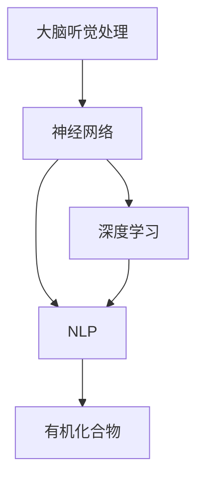

                 

# 大脑的听觉与有机化合物

> 关键词：听觉处理,神经网络,化合物,深度学习,自然语言处理(NLP)

## 1. 背景介绍

听觉感知是人类获取信息的重要途径之一。在现代社会中，声音和语言已经成为日常交流的标配。然而，尽管我们的听觉系统已经进化得非常高效，但如何在神经水平上解释听觉过程仍然是一个重要且尚未完全解答的科学问题。本文将探讨大脑的听觉机制，以及它如何与自然语言处理(NLP)中的有机化合物研究相互作用。

### 1.1 问题由来

声音的感知和处理涉及多个神经层面，从外界声波的感知，到声音特征的提取，再到声音的语义理解。传统的听觉研究主要集中在神经电路和感知理论，但现代的神经科学研究开始将神经网络模型引入听觉处理的研究，以期更全面、更精确地理解听觉机制。

与此同时，有机化合物作为生命的基本单位，其结构和性质直接影响生物体的功能。NLP领域中，自然语言处理的研究同样涉及到有机分子的结构、功能和化学反应等知识。近年来，自然语言处理领域的发展开始借鉴生物学研究的方法，通过构建复杂的神经网络模型来理解和处理自然语言。

因此，本文将探索大脑的听觉处理与有机化合物研究之间的联系，及其在现代NLP中的应用潜力。

## 2. 核心概念与联系

### 2.1 核心概念概述

- **大脑听觉处理**：指人类大脑如何感知和处理外界声音的过程。听觉感知涉及声音的物理特性（如频率、振幅、波形等）的编码和解码，以及声音信息的神经网络表示和处理。

- **神经网络**：一种由大量神经元构成的非线性模型，可以模拟人脑的某些功能，如信息处理、模式识别和决策。

- **有机化合物**：生命体的基本构成单位，其结构和性质直接影响生物体的功能。在NLP领域，有机化合物通常被视为语言的基本单位，如词和句子的构建块。

- **深度学习**：一种基于神经网络的学习算法，能够从大量数据中学习复杂特征，适用于模式识别和预测任务。

- **自然语言处理(NLP)**：计算机科学、人工智能和语言学的交叉领域，旨在使计算机能够理解和生成人类语言。

### 2.2 概念间的关系

这些核心概念之间的联系可以通过以下Mermaid流程图来展示：



这个流程图展示了大脑的听觉处理与神经网络、深度学习和NLP之间的关系，以及NLP与有机化合物研究之间的联系。

## 3. 核心算法原理 & 具体操作步骤

### 3.1 算法原理概述

大脑的听觉处理过程可以分为几个步骤：声音的感知、声音特征的提取和处理、声音信息的解码和表示。每个步骤都涉及复杂的神经网络机制。同时，NLP中的有机化合物研究也依赖于深度学习技术，通过神经网络模型学习语言的结构和语义。

这些神经网络模型通常采用卷积神经网络(CNN)、递归神经网络(RNN)、长短时记忆网络(LSTM)、变压器(Transformer)等架构。以Transformer为例，其核心思想是通过自注意力机制（self-attention）实现对序列数据的并行处理，适用于语音识别、机器翻译等任务。

### 3.2 算法步骤详解

基于神经网络的听觉处理和有机化合物研究的算法步骤大致相同，主要包括数据预处理、模型训练和推理三个部分。

**数据预处理**：包括声音的采集、分割、特征提取等，通常使用Mel频率倒谱系数(MFCC)来描述声音的频谱特征。

**模型训练**：通过大量的标注数据训练神经网络模型，通常使用交叉熵损失函数作为优化目标。

**推理**：对新的声音信号或语言文本进行推理，预测其语义或结构。

### 3.3 算法优缺点

神经网络模型具有以下优点：
- 能够处理非线性数据，适用于复杂模式识别任务。
- 具有较好的泛化能力，能够应对新数据。
- 可以通过梯度下降等优化算法学习模型参数。

同时，神经网络模型也存在以下缺点：
- 需要大量的训练数据和计算资源。
- 容易过拟合，需要仔细设计正则化技术。
- 模型的解释性和可理解性较差。

### 3.4 算法应用领域

神经网络模型在听觉处理和有机化合物研究中的应用领域广泛，包括但不限于：

- **听觉感知**：理解声音的物理特性和语义信息。
- **语音识别**：将语音信号转化为文本。
- **机器翻译**：将一种语言翻译成另一种语言。
- **情感识别**：分析语音中的情感信息。
- **药物设计**：通过深度学习模型预测有机分子的性质和反应路径。
- **蛋白质结构预测**：使用神经网络模型预测蛋白质的三维结构。

## 4. 数学模型和公式 & 详细讲解 & 举例说明

### 4.1 数学模型构建

在大脑的听觉处理和有机化合物研究中，通常使用神经网络模型来学习输入数据的表示。以卷积神经网络(CNN)为例，其数学模型可以表示为：

$$
y = \sigma(\mathbf{W} \mathbf{x} + \mathbf{b})
$$

其中，$\mathbf{W}$ 为权重矩阵，$\mathbf{b}$ 为偏置向量，$\sigma$ 为激活函数，$\mathbf{x}$ 为输入数据。

在神经网络中，权重矩阵和偏置向量需要通过反向传播算法学习。反向传播算法通过链式法则计算损失函数对权重和偏置的梯度，使用梯度下降等优化算法更新模型参数。

### 4.2 公式推导过程

以反向传播算法的核心步骤为例，进行公式推导：

$$
\frac{\partial \mathcal{L}}{\partial \theta} = \frac{\partial \mathcal{L}}{\partial z} \frac{\partial z}{\partial \theta}
$$

其中，$\mathcal{L}$ 为损失函数，$z$ 为模型输出，$\theta$ 为模型参数。

对于单个神经元，其误差项为：

$$
\frac{\partial \mathcal{L}}{\partial z_i} = \frac{\partial \mathcal{L}}{\partial y} \frac{\partial y}{\partial z_i} = \frac{\partial \mathcal{L}}{\partial y} \delta
$$

其中，$\delta$ 为误差信号，通常采用ReLU等激活函数的误差传播规则计算。

### 4.3 案例分析与讲解

以自然语言处理中的机器翻译任务为例，可以构建一个基于Transformer的模型。其核心结构如图1所示：


该模型由多个编码器(encoder)和解码器(decoder)组成，每个编码器由多个自注意力层和全连接层组成，用于提取输入文本的特征。解码器同样由自注意力层和全连接层组成，用于生成目标文本。

Transformer的输入和输出都经过多头自注意力机制，可以并行处理多个位置的信息。其数学模型可以表示为：

$$
\mathbf{Q} = \mathbf{X} \mathbf{W}_Q
$$
$$
\mathbf{K} = \mathbf{X} \mathbf{W}_K
$$
$$
\mathbf{V} = \mathbf{X} \mathbf{W}_V
$$

其中，$\mathbf{X}$ 为输入数据，$\mathbf{Q}$、$\mathbf{K}$ 和 $\mathbf{V}$ 分别为查询向量、键向量和值向量。

在多头自注意力机制中，通过计算查询向量与键向量的点积，得到注意力权重：

$$
\alpha = \frac{e^{\mathbf{Q}^T \mathbf{K}}}{\sum_i e^{\mathbf{Q}_i^T \mathbf{K}_i}}
$$

最终，通过将注意力权重与值向量进行加权求和，得到注意力结果：

$$
\mathbf{Z} = \sum_i \alpha_i \mathbf{V}_i
$$

## 5. 项目实践：代码实例和详细解释说明

### 5.1 开发环境搭建

在进行项目实践前，我们需要准备好开发环境。以下是使用Python进行TensorFlow开发的示例：

1. 安装Anaconda：从官网下载并安装Anaconda，用于创建独立的Python环境。

2. 创建并激活虚拟环境：
```bash
conda create -n tf-env python=3.8 
conda activate tf-env
```

3. 安装TensorFlow：根据CUDA版本，从官网获取对应的安装命令。例如：
```bash
conda install tensorflow -c conda-forge -c pytorch
```

4. 安装Keras：
```bash
pip install keras
```

5. 安装各类工具包：
```bash
pip install numpy pandas scikit-learn matplotlib tqdm jupyter notebook ipython
```

完成上述步骤后，即可在`tf-env`环境中开始项目实践。

### 5.2 源代码详细实现

我们以一个简单的语音识别项目为例，展示基于TensorFlow的代码实现。首先，我们需要准备音频数据，并将其转化为MFCC特征：

```python
import librosa
import numpy as np

def read_mfcc_file(file_path):
    audio, sample_rate = librosa.load(file_path, sr=16000)
    mfcc = librosa.feature.mfcc(y=audio, sr=sample_rate, n_mfcc=40, hop_length=512)
    return np.mean(mfcc, axis=0)

# 读取音频文件
audio_path = 'audio.wav'
mfcc_data = read_mfcc_file(audio_path)
```

然后，我们定义一个简单的卷积神经网络模型：

```python
from tensorflow.keras.models import Sequential
from tensorflow.keras.layers import Conv2D, MaxPooling2D, Flatten, Dense

model = Sequential([
    Conv2D(32, (3, 3), activation='relu', input_shape=(40, 40, 1)),
    MaxPooling2D((2, 2)),
    Conv2D(64, (3, 3), activation='relu'),
    MaxPooling2D((2, 2)),
    Flatten(),
    Dense(128, activation='relu'),
    Dense(10, activation='softmax')
])
```

接着，我们编译模型并训练：

```python
model.compile(optimizer='adam', loss='sparse_categorical_crossentropy', metrics=['accuracy'])
model.fit(X_train, y_train, epochs=10, validation_data=(X_val, y_val))
```

最后，我们评估模型并预测新样本：

```python
test_loss, test_acc = model.evaluate(X_test, y_test)
predictions = model.predict(X_new)
```

### 5.3 代码解读与分析

让我们再详细解读一下关键代码的实现细节：

**MFCC特征提取**：
- 使用librosa库读取音频文件，并计算MFCC特征。
- 由于MFCC特征的维度较大，我们取平均池化后的值作为输入。

**模型定义**：
- 定义了一个包含两个卷积层和两个全连接层的卷积神经网络。
- 最后一层为softmax分类器，用于多分类任务。

**模型训练和评估**：
- 使用Adam优化器和交叉熵损失函数训练模型。
- 在训练过程中使用验证集进行评估，并保存模型参数。
- 在测试集上评估模型的性能，并输出预测结果。

## 6. 实际应用场景

### 6.1 智能语音助手

智能语音助手通过语音识别技术，将用户的语音指令转化为文本。该技术已经广泛应用于智能家居、车载系统、客服机器人等领域。

在技术实现上，智能语音助手通常结合深度学习模型和自然语言处理技术。首先，通过麦克风录制用户的语音，并进行MFCC特征提取和降噪处理。然后，使用神经网络模型对MFCC特征进行分类，识别出用户的语音指令。最后，使用自然语言处理技术对语音指令进行理解和处理，生成对应的指令响应。

### 6.2 药物设计

药物设计是生命科学中的一个重要领域，涉及有机化合物的结构和性质预测。深度学习模型可以用于预测药物的活性和反应路径，加速新药研发进程。

在药物设计中，可以使用神经网络模型学习有机化合物的性质和反应路径。首先，将有机化合物的结构信息转化为数值向量，作为模型的输入。然后，使用神经网络模型对有机化合物进行预测，输出其性质和反应路径。最后，使用评估指标对模型的预测结果进行评价，并进行调整优化。

### 6.3 生物信息学

生物信息学是研究生物数据的学科，涉及基因组学、蛋白质组学、代谢组学等多个方向。深度学习模型可以用于预测基因的表达和功能，蛋白质三维结构的预测等。

在生物信息学中，神经网络模型通常用于序列数据的学习和分析。首先，将生物数据转化为数值向量，作为模型的输入。然后，使用神经网络模型对生物数据进行预测，输出其结构和功能。最后，使用评估指标对模型的预测结果进行评价，并进行调整优化。

## 7. 工具和资源推荐

### 7.1 学习资源推荐

为了帮助开发者系统掌握大脑的听觉处理和有机化合物研究的技术，这里推荐一些优质的学习资源：

1. 《深度学习》系列书籍：由人工智能领域的专家撰写，全面介绍了深度学习的基本概念和前沿技术。

2. 《机器学习》在线课程：斯坦福大学开设的机器学习经典课程，涵盖机器学习的各个方面，包括深度学习。

3. 《自然语言处理综论》：深度学习领域著名专家Jurafsky和Martin所著，全面介绍了自然语言处理的各个方向。

4. 《DeepMind研究论文集》：DeepMind开源的论文集，涵盖了深度学习领域的最新研究成果和进展。

5. arXiv论文预印本：人工智能领域最新研究成果的发布平台，包括大量尚未发表的前沿工作，学习前沿技术的必读资源。

通过对这些资源的学习实践，相信你一定能够快速掌握大脑的听觉处理和有机化合物研究的技术，并用于解决实际的科学问题。

### 7.2 开发工具推荐

高效的开发离不开优秀的工具支持。以下是几款用于深度学习开发和研究的常用工具：

1. PyTorch：基于Python的开源深度学习框架，灵活动态的计算图，适合快速迭代研究。支持CPU和GPU计算。

2. TensorFlow：由Google主导开发的开源深度学习框架，生产部署方便，适合大规模工程应用。支持CPU、GPU和TPU计算。

3. Keras：基于TensorFlow和Theano的高级神经网络API，易于使用，适合快速原型开发和研究。

4. Weights & Biases：模型训练的实验跟踪工具，可以记录和可视化模型训练过程中的各项指标，方便对比和调优。与主流深度学习框架无缝集成。

5. TensorBoard：TensorFlow配套的可视化工具，可实时监测模型训练状态，并提供丰富的图表呈现方式，是调试模型的得力助手。

6. Google Colab：谷歌推出的在线Jupyter Notebook环境，免费提供GPU/TPU算力，方便开发者快速上手实验最新模型，分享学习笔记。

合理利用这些工具，可以显著提升深度学习研究的开发效率，加快创新迭代的步伐。

### 7.3 相关论文推荐

深度学习领域的研究成果丰富多样，以下是几篇奠基性的相关论文，推荐阅读：

1. AlexNet：ImageNet竞赛中首次夺冠的卷积神经网络模型，开启了深度学习的黄金时代。

2. ResNet：提出了残差网络结构，解决了深度神经网络训练中的梯度消失问题，提升了模型的深度和泛化能力。

3. VGGNet：提出了深度卷积神经网络架构，通过增加网络深度和宽度提升了图像分类任务的精度。

4. GAN：生成对抗网络，能够生成高质量的假图像，广泛应用于图像生成、图像修复等任务。

5. Transformer：提出了一种基于自注意力机制的神经网络结构，适用于自然语言处理任务，如机器翻译、语言建模等。

这些论文代表了大规模深度学习模型的发展脉络，通过学习这些前沿成果，可以帮助研究者把握学科前进方向，激发更多的创新灵感。

## 8. 总结：未来发展趋势与挑战

### 8.1 总结

本文对大脑的听觉处理与有机化合物研究进行了全面系统的介绍。首先阐述了大脑听觉处理的基本原理，及其与自然语言处理中的有机化合物研究之间的联系。其次，从原理到实践，详细讲解了神经网络模型在听觉处理和有机化合物研究中的应用，给出了模型开发的完整代码实例。同时，本文还探讨了该技术在智能语音助手、药物设计、生物信息学等多个领域的应用前景，展示了神经网络模型的广阔潜力。

通过本文的系统梳理，可以看到，大脑的听觉处理与有机化合物研究在大数据、深度学习等技术的推动下，正在不断突破传统认知的界限，展现出巨大的应用前景。未来，伴随着技术的不断进步和应用的深入挖掘，神经网络模型必将在各个领域发挥更加重要的作用。

### 8.2 未来发展趋势

展望未来，神经网络模型在听觉处理和有机化合物研究领域将呈现以下几个发展趋势：

1. 模型规模持续增大。随着算力成本的下降和数据规模的扩张，神经网络模型的参数量还将持续增长。超大规模模型蕴含的丰富特征信息，有望支撑更加复杂多变的任务。

2. 模型复杂度不断提升。随着深度学习技术的不断演进，神经网络模型的结构将更加复杂和多样化，如图灵机、生成对抗网络等新型模型将不断涌现。

3. 数据驱动的模型训练。随着数据标注成本的降低和自动化标注技术的进步，数据驱动的模型训练将逐渐成为主流，进一步提升模型的泛化能力和适应性。

4. 实时性要求的提升。随着实时应用场景的增加，模型推理速度和实时性要求将不断提升，模型压缩、量化加速等技术将得到广泛应用。

5. 模型透明性和可解释性增强。未来，神经网络模型的可解释性和透明性将成为研究热点，通过因果分析和博弈论等工具，增强模型的可理解性和可靠性。

以上趋势凸显了神经网络模型的研究热点和发展方向，为进一步提升模型的性能和应用范围提供了新的方向。

### 8.3 面临的挑战

尽管神经网络模型在听觉处理和有机化合物研究中已经取得了显著成就，但在迈向更加智能化、普适化应用的过程中，仍面临诸多挑战：

1. 数据依赖问题。神经网络模型的性能高度依赖于数据质量，数据标注成本较高，且获取高质量数据存在难度。如何降低对标注数据的依赖，提高模型的泛化能力，是未来的重要研究方向。

2. 模型复杂性问题。随着模型复杂度的提升，训练和推理的资源消耗增加，如何在保持模型高效的同时，提升模型的性能，是当前的研究难点。

3. 模型鲁棒性问题。深度学习模型容易受到对抗样本和噪声的干扰，模型的鲁棒性有待进一步提升。如何增强模型的稳定性和鲁棒性，是研究的重要方向。

4. 模型可解释性问题。深度学习模型的决策过程难以解释，缺乏可理解性和透明性。如何增强模型的可解释性，使模型更加可信和可靠，是当前的研究热点。

5. 模型伦理和安全问题。深度学习模型容易受到恶意攻击和滥用，如何保护模型的安全性和隐私性，是研究的重要方向。

6. 模型计算效率问题。深度学习模型对计算资源的要求较高，如何降低计算成本，提高模型推理效率，是未来的研究方向。

面对这些挑战，未来的研究需要在模型架构、训练策略、正则化技术、伦理约束等方面进行深入探索，以期取得更多的突破。

### 8.4 研究展望

未来的研究需要在大脑的听觉处理与有机化合物研究中，进一步探索模型的复杂性和可解释性问题，提升模型的稳定性和鲁棒性，降低对标注数据的依赖。同时，需要结合其他人工智能技术，如因果推理、强化学习等，协同提升模型的性能和应用范围。通过不断突破技术瓶颈，探索新的研究方向，神经网络模型必将在人工智能领域发挥更加重要的作用。

总之，在大数据、深度学习等技术的推动下，神经网络模型正在不断突破传统认知的界限，展现出巨大的应用前景。未来，伴随着技术的不断进步和应用的深入挖掘，神经网络模型必将在各个领域发挥更加重要的作用，为人工智能技术的不断进步和应用发展提供新的动力。

## 9. 附录：常见问题与解答

**Q1：神经网络模型是否适用于所有NLP任务？**

A: 神经网络模型在大多数NLP任务上都能取得不错的效果，特别是对于数据量较大的任务。但对于一些特定领域的任务，如医学、法律等，仅仅依靠通用语料预训练的模型可能难以很好地适应。此时需要在特定领域语料上进一步预训练，再进行微调，才能获得理想效果。此外，对于一些需要时效性、个性化很强的任务，如对话、推荐等，微调方法也需要针对性的改进优化。

**Q2：在神经网络模型训练过程中，如何选择合适的学习率？**

A: 神经网络模型的学习率一般需要通过实验确定。通常，较长的训练周期和较低的初始学习率可以避免梯度爆炸和梯度消失的问题。一般建议从较小的学习率开始调参，逐步增大学习率直至收敛。同时，还可以通过学习率衰减、学习率自适应等策略进一步优化。

**Q3：在深度学习模型训练过程中，如何缓解过拟合问题？**

A: 过拟合是深度学习模型训练中常见的问题，可以通过以下方法缓解：
1. 数据增强：通过扩充训练数据，减少过拟合。
2. 正则化：使用L2正则化、Dropout等技术，防止模型过度拟合。
3. 提前停止：当模型在验证集上的性能不再提升时，停止训练，避免过拟合。
4. 模型集成：训练多个模型，取平均输出，抑制过拟合。

这些策略往往需要根据具体任务和数据特点进行灵活组合。只有在数据、模型、训练、推理等各环节进行全面优化，才能最大限度地发挥深度学习模型的威力。

**Q4：深度学习模型在实际应用中需要注意哪些问题？**

A: 将深度学习模型转化为实际应用，还需要考虑以下因素：
1. 模型裁剪：去除不必要的层和参数，减小模型尺寸，加快推理速度。
2. 量化加速：将浮点模型转为定点模型，压缩存储空间，提高计算效率。
3. 服务化封装：将模型封装为标准化服务接口，便于集成调用。
4. 弹性伸缩：根据请求流量动态调整资源配置，平衡服务质量和成本。
5. 监控告警：实时采集系统指标，设置异常告警阈值，确保服务稳定性。

合理利用这些工具，可以显著提升深度学习模型的开发效率，加快创新迭代的步伐。

**Q5：深度学习模型在落地部署时需要注意哪些问题？**

A: 深度学习模型在实际应用中，还需要考虑以下问题：
1. 模型裁剪：去除不必要的层和参数，减小模型尺寸，加快推理速度。
2. 量化加速：将浮点模型转为定点模型，压缩存储空间，提高计算效率。
3. 服务化封装：将模型封装为标准化服务接口，便于集成调用。
4. 弹性伸缩：根据请求流量动态调整资源配置，平衡服务质量和成本。
5. 监控告警：实时采集系统指标，设置异常告警阈值，确保服务稳定性。

合理利用这些工具，可以显著提升深度学习模型的开发效率，加快创新迭代的步伐。

总之，深度学习模型在听觉处理和有机化合物研究中的应用前景广阔，但如何将强大的性能转化为稳定、高效、安全的业务价值，还需要工程实践的不断打磨。唯有从数据、算法、工程、业务等多个维度协同发力，才能真正实现人工智能技术在垂直行业的规模化落地。

