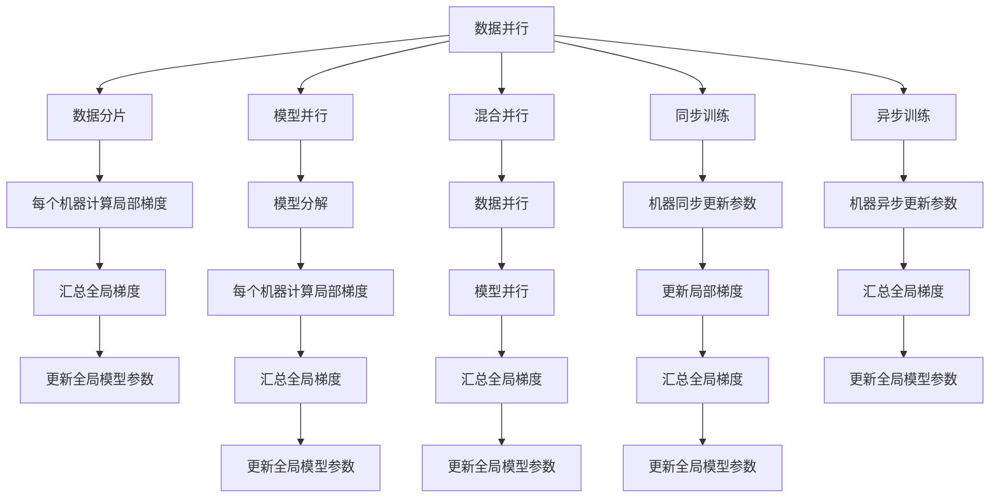

                 

# 大规模语言模型从理论到实践 分布式训练的集群架构

## 1. 背景介绍

随着大规模语言模型（Large Language Models, LLMs）的兴起，如BERT、GPT等，分布式训练成为训练大规模模型的必然选择。这些模型通常拥有数十亿甚至更多的参数，单台机器难以满足需求。通过分布式训练，可以并行化模型训练过程，提高训练效率，缩短训练时间，使大规模模型成为现实。

本文将深入探讨大规模语言模型的分布式训练架构，包括其理论基础、实际操作步骤，以及一些具体的案例分析和实施方法。通过理解这些内容，可以帮助读者更好地掌握分布式训练的核心技巧，并成功部署大规模语言模型的训练任务。

## 2. 核心概念与联系

### 2.1 核心概念概述

在进行大规模语言模型的分布式训练时，需要了解以下核心概念：

- **分布式训练（Distributed Training）**：在多台计算机上并行计算梯度更新，加速训练过程。通过数据并行、模型并行、混合并行等技术实现。

- **数据并行（Data Parallelism）**：将训练数据分布在多台机器上，每台机器各自计算局部梯度，然后汇总更新全局模型参数。

- **模型并行（Model Parallelism）**：将模型分为多个部分，在不同的机器上并行计算，每个部分只负责部分模型参数。

- **混合并行（Hybrid Parallelism）**：结合数据并行和模型并行，同时优化数据流动和模型计算。

- **机器学习框架（ML Frameworks）**：如TensorFlow、PyTorch等，提供分布式训练的底层支持。

- **通信协议（Communication Protocols）**：如MPI、NCCL等，用于不同机器间的消息传递。

- **同步和异步训练（Synchronous and Asynchronous Training）**：同步训练要求所有机器在同一个时间点上更新参数，异步训练则允许机器在不同时间点上更新。

- **微调（Fine-Tuning）**：在预训练模型的基础上，使用特定任务的数据进行微调，以获得更好的性能。

- **模型压缩（Model Compression）**：通过剪枝、量化等技术减少模型大小，提高模型推理效率。

- **硬件加速（Hardware Acceleration）**：使用GPU、TPU等硬件加速训练过程。

### 2.2 核心概念原理和架构的 Mermaid 流程图



这个流程图展示了分布式训练的几种基本并行方式及其步骤：

- **数据并行**：将数据分片，每台机器计算局部梯度，然后汇总全局梯度更新模型参数。
- **模型并行**：将模型分解，不同机器计算局部梯度，然后汇总全局梯度更新模型参数。
- **混合并行**：结合数据并行和模型并行，同时优化数据流动和模型计算。
- **同步和异步训练**：同步训练要求所有机器在同一个时间点上更新参数，异步训练则允许机器在不同时间点上更新。

## 3. 核心算法原理 & 具体操作步骤

### 3.1 算法原理概述

大规模语言模型的分布式训练通常涉及两个主要步骤：数据分布和模型分布。数据分布即将训练数据分片，分布在不同的机器上；模型分布则将模型参数分布在不同的机器上。这两者结合，实现了并行计算，大大加速了模型的训练过程。

### 3.2 算法步骤详解

以下是分布式训练的主要操作步骤：

1. **数据并行（Data Parallelism）**：
   - 将训练数据分片，每个分片放在不同的机器上进行训练。
   - 每台机器独立训练数据，计算局部梯度。
   - 汇总所有机器计算出的局部梯度，求平均值或加权平均作为全局梯度。
   - 使用全局梯度更新全局模型参数。

2. **模型并行（Model Parallelism）**：
   - 将模型参数按照维度或块分片，分配到不同的机器上。
   - 每台机器计算自己分配的参数的梯度。
   - 汇总所有机器计算出的局部梯度，求平均值或加权平均作为全局梯度。
   - 使用全局梯度更新全局模型参数。

3. **混合并行（Hybrid Parallelism）**：
   - 将数据并行和模型并行结合，先进行数据并行，再对部分模型进行并行计算。
   - 每台机器计算自己分配的参数的梯度。
   - 汇总所有机器计算出的局部梯度，求平均值或加权平均作为全局梯度。
   - 使用全局梯度更新全局模型参数。

4. **同步和异步训练**：
   - 同步训练：所有机器在同一个时间点上更新模型参数。
   - 异步训练：机器可以独立更新模型参数，然后汇总全局梯度更新模型。

### 3.3 算法优缺点

分布式训练的优点包括：

- **加速训练**：通过并行计算，可以大大缩短训练时间。
- **资源利用**：多台机器同时工作，充分利用了计算资源。
- **可扩展性**：可以方便地扩展训练规模。

缺点包括：

- **通信开销**：不同机器间需要频繁通信，增加了通信开销。
- **同步复杂性**：同步训练需要等待所有机器完成更新，降低了训练速度。
- **可维护性**：分布式训练系统复杂，需要良好的维护和监控。

### 3.4 算法应用领域

分布式训练在以下几个领域有广泛应用：

- **自然语言处理（NLP）**：BERT、GPT等大规模语言模型。
- **计算机视觉（CV）**：深度卷积神经网络（CNN）、残差网络（ResNet）等模型。
- **强化学习（RL）**：分布式训练在强化学习中也有广泛应用。
- **推荐系统**：如协同过滤、深度学习推荐系统等。

## 4. 数学模型和公式 & 详细讲解 & 举例说明

### 4.1 数学模型构建

大规模语言模型的分布式训练通常使用以下数学模型：

假设模型参数为 $\theta$，训练数据集为 $D=\{(x_i,y_i)\}_{i=1}^N$，其中 $x_i$ 为输入，$y_i$ 为标签。分布式训练的目标是最小化损失函数 $\mathcal{L}(\theta)$。

数据并行的数学模型为：

$$
\mathcal{L}_{dp}(\theta) = \frac{1}{N}\sum_{i=1}^N \mathcal{L}(f(x_i;\theta))
$$

其中 $f(x_i;\theta)$ 表示模型在输入 $x_i$ 上的预测。

模型并行的数学模型为：

$$
\mathcal{L}_{mp}(\theta) = \frac{1}{N}\sum_{i=1}^N \mathcal{L}(f(x_i;\theta))
$$

其中 $f(x_i;\theta)$ 表示模型在输入 $x_i$ 上的预测。

### 4.2 公式推导过程

分布式训练的公式推导过程如下：

假设训练数据集为 $D=\{(x_i,y_i)\}_{i=1}^N$，模型参数为 $\theta$，定义损失函数 $\mathcal{L}(\theta)$。

数据并行的情况下，每台机器计算局部损失函数：

$$
\mathcal{L}_i(\theta) = \frac{1}{N}\sum_{i=1}^N \mathcal{L}(f(x_i;\theta))
$$

汇总所有机器计算的局部损失函数：

$$
\mathcal{L}_{dp}(\theta) = \sum_{i=1}^M \mathcal{L}_i(\theta)
$$

其中 $M$ 为机器数量。

模型并行的情况下，每台机器计算局部损失函数：

$$
\mathcal{L}_i(\theta) = \frac{1}{N}\sum_{i=1}^N \mathcal{L}(f(x_i;\theta))
$$

汇总所有机器计算的局部损失函数：

$$
\mathcal{L}_{mp}(\theta) = \sum_{i=1}^M \mathcal{L}_i(\theta)
$$

其中 $M$ 为机器数量。

混合并行的情况下，先进行数据并行，再进行模型并行：

$$
\mathcal{L}_{dpmp}(\theta) = \sum_{i=1}^M \mathcal{L}_{mp}(\theta)
$$

其中 $M$ 为机器数量。

### 4.3 案例分析与讲解

以BERT为例，其分布式训练过程如下：

1. 将训练数据分片，每个分片放在不同的机器上进行训练。
2. 每台机器独立训练数据，计算局部梯度。
3. 汇总所有机器计算出的局部梯度，求平均值作为全局梯度。
4. 使用全局梯度更新全局模型参数。

## 5. 项目实践：代码实例和详细解释说明

### 5.1 开发环境搭建

分布式训练的开发环境需要以下组件：

1. 分布式计算框架：如TensorFlow、PyTorch等。
2. 分布式通信库：如MPI、NCCL等。
3 分布式文件系统：如Hadoop、Ceph等。
4 分布式作业管理系统：如YARN、Mesos等。

以TensorFlow为例，搭建分布式训练环境的步骤如下：

1. 安装TensorFlow和相关的分布式计算库。
2 配置分布式计算框架。
3 配置分布式文件系统和作业管理系统。

### 5.2 源代码详细实现

以下是使用TensorFlow进行分布式训练的代码实现：

```python
import tensorflow as tf
from tensorflow.keras.distribute import MirroredStrategy

# 定义模型
model = tf.keras.Sequential([
    tf.keras.layers.Embedding(input_dim=10000, output_dim=64),
    tf.keras.layers.GlobalAveragePooling1D(),
    tf.keras.layers.Dense(10, activation='softmax')
])

# 定义分布式策略
strategy = MirroredStrategy()

# 在分布式策略下定义模型
with strategy.scope():
    model = tf.keras.Sequential([
        tf.keras.layers.Embedding(input_dim=10000, output_dim=64),
        tf.keras.layers.GlobalAveragePooling1D(),
        tf.keras.layers.Dense(10, activation='softmax')
    ])

# 定义数据集
train_dataset = tf.data.Dataset.from_tensor_slices((x_train, y_train))
train_dataset = train_dataset.shuffle(buffer_size=10000).batch(batch_size)

# 在分布式策略下定义训练循环
with strategy.scope():
    model.compile(optimizer=tf.keras.optimizers.Adam(),
                  loss=tf.keras.losses.CategoricalCrossentropy(),
                  metrics=['accuracy'])

    model.fit(train_dataset,
              epochs=10,
              steps_per_epoch=len(train_dataset) // batch_size)

# 保存模型
tf.saved_model.save(model, 'model')
```

### 5.3 代码解读与分析

这段代码主要包含以下几个关键步骤：

1. 定义模型。使用TensorFlow的Sequential模型定义了一个简单的神经网络，包括Embedding层、GlobalAveragePooling层和Dense层。

2. 定义分布式策略。使用MirroredStrategy，表示在多台机器上进行同步更新。

3. 在分布式策略下定义模型。通过MirroredStrategy.scope()方法，在多个机器上定义相同的模型，确保模型参数同步更新。

4. 定义数据集。使用TensorFlow的Dataset API，将训练数据集转换为分布式数据集，并指定批次大小。

5. 在分布式策略下定义训练循环。使用MirroredStrategy.compile()方法，定义模型的优化器、损失函数和评估指标。使用MirroredStrategy.fit()方法，进行分布式训练。

6. 保存模型。使用TensorFlow的saved_model API，将训练好的模型保存为 SavedModel格式，方便后续部署和使用。

### 5.4 运行结果展示

训练完成后，可以在其他机器上加载模型并进行预测，验证模型性能。例如：

```python
import tensorflow as tf
import tensorflow_serving.apis

# 加载模型
model = tf.saved_model.load('model')

# 进行预测
predictions = model.predict(x_test)
```

## 6. 实际应用场景

### 6.4 未来应用展望

分布式训练的实际应用场景非常广泛，以下是几个典型的应用：

1. **自然语言处理（NLP）**：BERT、GPT等大规模语言模型。

2. **计算机视觉（CV）**：深度卷积神经网络（CNN）、残差网络（ResNet）等模型。

3. **强化学习（RL）**：分布式训练在强化学习中也有广泛应用。

4. **推荐系统**：如协同过滤、深度学习推荐系统等。

## 7. 工具和资源推荐

### 7.1 学习资源推荐

以下是几个推荐的分布式训练学习资源：

1. 《分布式深度学习》书籍：介绍分布式深度学习的理论基础和实践技巧。
2. 《TensorFlow官方文档》：提供详细的TensorFlow分布式计算API文档。
3 《PyTorch官方文档》：提供详细的PyTorch分布式计算API文档。
4 《深度学习分布式计算教程》：介绍如何使用TensorFlow、PyTorch等框架进行分布式计算。
5 《深度学习分布式计算实战》：提供实用的分布式计算案例和实践技巧。

### 7.2 开发工具推荐

以下是一些推荐的分布式训练开发工具：

1. TensorFlow：提供强大的分布式计算和机器学习框架。
2. PyTorch：提供灵活的深度学习和分布式计算框架。
3. MPI：提供高效的分布式通信库。
4 NCCL：提供高性能的分布式通信库。
5 Hadoop：提供分布式文件系统和作业管理系统。

### 7.3 相关论文推荐

以下是一些推荐的分布式训练相关论文：

1. 《Distributed Deep Learning》：介绍分布式深度学习的理论基础和实践技巧。
2 《Large-Scale Distributed Deep Learning with TensorFlow》：介绍TensorFlow的分布式计算机制。
3 《PyTorch Distributed》：介绍PyTorch的分布式计算机制。
4 《A Survey of Distributed Deep Learning》：总结分布式深度学习的最新进展和未来方向。
5 《Deep Learning with GPU and TPU》：介绍使用GPU和TPU进行分布式训练的实践技巧。

## 8. 总结：未来发展趋势与挑战

### 8.1 研究成果总结

分布式训练已经成为大规模语言模型训练的标配，其理论基础和实践技术已经相当成熟。分布式训练通过并行化训练过程，显著提高了模型训练效率，推动了深度学习技术的发展。

### 8.2 未来发展趋势

分布式训练的未来发展趋势包括：

1. **自动化调参**：自动选择最优的分布式训练参数和配置。
2. **联邦学习**：多台机器共同训练模型，保护数据隐私。
3. **边缘计算**：在边缘设备上进行分布式训练，降低计算延迟。
4. **异构计算**：利用不同的硬件资源进行分布式训练，提高计算效率。
5. **混合并行**：结合数据并行和模型并行，进一步优化训练效率。

### 8.3 面临的挑战

分布式训练仍然面临一些挑战：

1. **通信开销**：不同机器间需要频繁通信，增加了通信开销。
2. **同步复杂性**：同步训练需要等待所有机器完成更新，降低了训练速度。
3. **可维护性**：分布式训练系统复杂，需要良好的维护和监控。
4. **数据一致性**：不同机器间的数据同步可能会导致数据不一致。

### 8.4 研究展望

未来的研究需要关注以下几个方面：

1. **自动化调参**：自动化选择最优的分布式训练参数和配置。
2. **联邦学习**：多台机器共同训练模型，保护数据隐私。
3. **边缘计算**：在边缘设备上进行分布式训练，降低计算延迟。
4. **异构计算**：利用不同的硬件资源进行分布式训练，提高计算效率。
5. **混合并行**：结合数据并行和模型并行，进一步优化训练效率。

总之，分布式训练是大规模语言模型训练的重要技术手段，其未来发展方向值得关注。

## 9. 附录：常见问题与解答

**Q1：什么是数据并行和模型并行？**

A: 数据并行是将训练数据分片，每台机器独立计算局部梯度，然后汇总全局梯度更新全局模型参数。模型并行是将模型参数按照维度或块分片，分配到不同的机器上，每台机器计算自己分配的参数的梯度，然后汇总全局梯度更新全局模型参数。

**Q2：分布式训练有哪些优势和劣势？**

A: 分布式训练的优势包括加速训练、资源利用、可扩展性。劣势包括通信开销、同步复杂性、可维护性。

**Q3：分布式训练的常见优化技巧有哪些？**

A: 常见的优化技巧包括异步训练、混合精度训练、梯度累积、模型压缩等。

**Q4：分布式训练在哪些领域有应用？**

A: 分布式训练在自然语言处理、计算机视觉、强化学习、推荐系统等领域有广泛应用。

**Q5：如何选择合适的分布式训练架构？**

A: 选择合适的分布式训练架构需要考虑计算资源、数据规模、模型大小等因素。

---

作者：禅与计算机程序设计艺术 / Zen and the Art of Computer Programming

