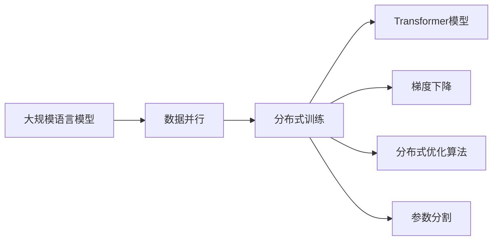
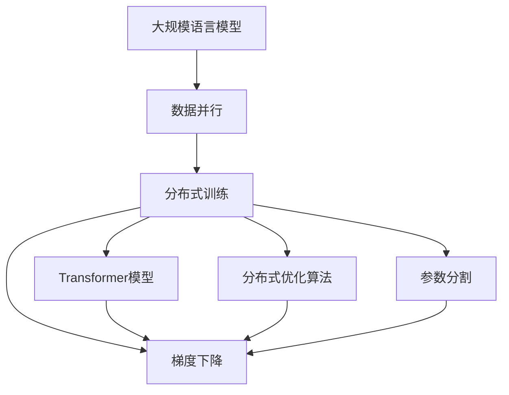
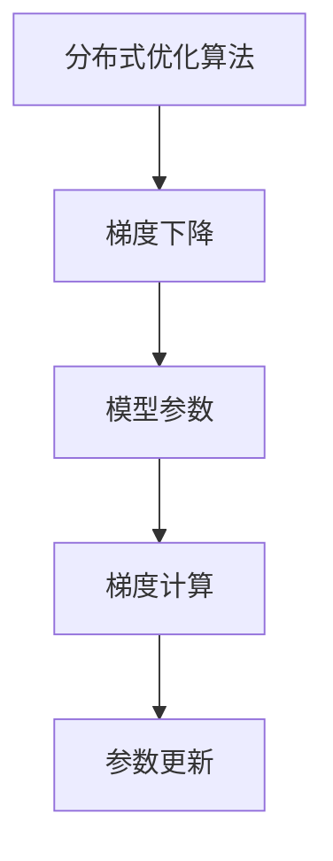

                 

# 大规模语言模型从理论到实践 数据并行

> 关键词：大规模语言模型,数据并行,分布式训练,深度学习,Transformer模型,梯度下降,分布式优化算法

## 1. 背景介绍

### 1.1 问题由来
随着深度学习技术的不断发展，大规模语言模型（Large Language Models, LLMs）在自然语言处理（NLP）领域取得了显著的进展。这些模型通常基于自回归（如GPT系列）或自编码（如BERT）架构，通过在大规模无标签文本数据上进行预训练，学习到了丰富的语言知识。然而，由于这些模型参数量巨大，训练过程极其耗时和资源密集，如何在短时间内高效地训练模型，成为了一个重要的研究课题。

### 1.2 问题核心关键点
为了解决大规模语言模型训练过程中的时间和资源瓶颈问题，研究者提出了数据并行训练的方法。数据并行（Data Parallelism）是一种并行计算技术，它通过将数据分成多个子集，并在多个计算节点上同时对子集进行训练，从而加快模型训练速度。该方法在深度学习领域被广泛应用，尤其是在大规模语言模型中，通过分布式计算资源并行处理训练数据，显著提高了训练效率。

数据并行的核心思想是将模型参数分割，并在不同的计算节点上更新。这种方法可以在保持单节点上的计算资源不变的情况下，通过增加节点的数量来提升训练速度。在实践中，数据并行通常与模型并行结合使用，共同提升训练效率。

### 1.3 问题研究意义
数据并行训练技术对于提升大规模语言模型的训练效率和降低资源成本具有重要意义：

1. **提升训练速度**：通过分布式计算资源并行处理训练数据，可以在较短时间内完成大规模语言模型的训练，缩短项目周期。
2. **降低资源成本**：利用现有计算资源进行数据并行训练，可以避免购置高昂的硬件设备，降低研发成本。
3. **增强模型性能**：通过并行处理大规模数据集，可以提高模型在特定任务上的泛化能力，提升模型的预测准确性。
4. **支持更大规模模型**：数据并行训练可以支持更大规模的模型参数，满足对语言理解能力要求更高的应用场景。
5. **提升数据处理能力**：数据并行技术可以高效处理大规模数据集，支持复杂的多模态数据融合和增强学习。

数据并行训练技术在大规模语言模型中的应用，不仅提升了模型训练的效率和性能，也为NLP技术的落地应用提供了坚实的技术支撑。

## 2. 核心概念与联系

### 2.1 核心概念概述

为更好地理解数据并行在大规模语言模型训练中的应用，本节将介绍几个密切相关的核心概念：

- **大规模语言模型（Large Language Models, LLMs）**：以自回归（如GPT系列）或自编码（如BERT）模型为代表的大规模预训练语言模型。通过在大规模无标签文本数据上进行预训练，学习到了丰富的语言知识和常识，具备强大的语言理解和生成能力。

- **数据并行（Data Parallelism）**：一种并行计算技术，通过将数据分成多个子集，并在多个计算节点上同时对子集进行训练，从而加快模型训练速度。

- **分布式训练（Distributed Training）**：在多台计算节点上并行训练模型的过程。通过网络通信，将不同节点上的模型参数和梯度信息进行同步更新。

- **Transformer模型**：一种基于自注意力机制的神经网络结构，广泛应用于大规模语言模型中，具有高效的并行计算特性。

- **梯度下降（Gradient Descent）**：一种优化算法，通过反向传播计算损失函数的梯度，并根据梯度方向调整模型参数，以最小化损失函数。

- **分布式优化算法**：针对分布式训练中的通信和参数更新问题，设计的一系列优化算法，如SGD、Adagrad、Adam等。

- **参数分割（Parameter Sharding）**：将大规模模型的参数分割成多个块，分别存储在不同的计算节点上，以减少通信开销和提高计算效率。

这些核心概念之间的逻辑关系可以通过以下Mermaid流程图来展示：



这个流程图展示了大规模语言模型在数据并行训练过程中的主要步骤：

1. 大规模语言模型作为训练的基础。
2. 数据并行通过分布式计算资源并行处理训练数据。
3. 分布式训练通过多台计算节点并行训练模型。
4. Transformer模型在分布式环境中高效计算。
5. 梯度下降算法计算损失函数的梯度。
6. 分布式优化算法在多台计算节点间同步参数更新。
7. 参数分割技术减少通信开销，提高计算效率。

### 2.2 概念间的关系

这些核心概念之间存在着紧密的联系，形成了大规模语言模型训练的整体生态系统。下面我通过几个Mermaid流程图来展示这些概念之间的关系。

#### 2.2.1 大规模语言模型训练过程



这个流程图展示了从预训练到微调，再到分布式训练的大规模语言模型训练完整过程。

#### 2.2.2 数据并行与分布式训练的关系


这个流程图展示了数据并行训练中的关键步骤：数据分割、多台计算节点并行训练、参数同步。

#### 2.2.3 分布式优化算法与梯度下降的关系



这个流程图展示了分布式优化算法在梯度下降过程中的作用：多台计算节点间的梯度同步与参数更新。

## 3. 核心算法原理 & 具体操作步骤

### 3.1 算法原理概述

数据并行训练的核心原理是将大规模语言模型的参数分割成多个块，分别在多个计算节点上进行训练。每个节点上的模型参数和梯度信息通过网络通信进行同步更新，从而加速模型的训练过程。

具体而言，假设模型参数总数为 $P$，我们将参数分割成 $M$ 个块，每个块包含 $p$ 个参数，即 $P=M\times p$。每个计算节点上存储一个参数块，并行更新。假设每个节点上有 $N$ 个参数块，则模型参数的总数量为 $P=M\times p=NP$。

在训练过程中，我们将训练数据 $D$ 分为 $M$ 个子集 $D_1, D_2, ..., D_M$，每个子集大小为 $\frac{|D|}{M}$。每个计算节点负责训练一个子集 $D_i$，并行计算损失函数 $L_i$ 和梯度 $G_i$。然后，通过网络通信将所有计算节点的梯度信息进行同步，计算全局梯度 $G$，并根据全局梯度更新模型参数。

### 3.2 算法步骤详解

以下是对数据并行训练的详细步骤详解：

1. **数据分割**：将训练数据 $D$ 分为 $M$ 个子集 $D_1, D_2, ..., D_M$，每个子集大小为 $\frac{|D|}{M}$。

2. **参数分割**：将模型参数 $P$ 分割成 $M$ 个块 $W_1, W_2, ..., W_M$，每个块包含 $p$ 个参数。

3. **节点初始化**：在每个计算节点上初始化相同的参数块 $W_i$，并进行训练。

4. **分布式训练**：每个计算节点 $i$ 在数据集 $D_i$ 上进行训练，计算损失函数 $L_i$ 和梯度 $G_i$。

5. **梯度同步**：通过网络通信，将每个节点的梯度 $G_i$ 进行同步，计算全局梯度 $G$。

6. **参数更新**：根据全局梯度 $G$ 更新模型参数 $P$。

7. **重复训练**：重复步骤 4-6，直至模型收敛。

### 3.3 算法优缺点

数据并行训练方法具有以下优点：

1. **加速训练速度**：通过并行计算资源处理训练数据，可以显著加快模型训练速度。
2. **提升模型性能**：分布式训练可以在大规模数据集上进行训练，提升模型的泛化能力。
3. **支持更大规模模型**：数据并行可以支持更大规模的模型参数，满足对语言理解能力要求更高的应用场景。

然而，数据并行训练也存在一些缺点：

1. **通信开销**：节点间的参数和梯度同步需要额外的通信开销，影响训练效率。
2. **同步延迟**：不同节点间的通信延迟可能导致模型参数更新不一致，影响训练效果。
3. **硬件需求高**：分布式训练需要高性能的计算资源和网络通信设备，成本较高。
4. **调试复杂**：分布式训练过程中涉及多个计算节点，调试和排错难度较大。

### 3.4 算法应用领域

数据并行训练方法在深度学习和人工智能领域具有广泛的应用前景，尤其是在大规模语言模型中：

1. **自然语言处理（NLP）**：广泛应用于文本分类、情感分析、机器翻译、问答系统等NLP任务中。
2. **计算机视觉（CV）**：用于图像分类、目标检测、图像生成等计算机视觉任务。
3. **语音识别（ASR）**：用于语音识别、语音合成等语音处理任务。
4. **推荐系统**：用于商品推荐、内容推荐等推荐系统任务。
5. **游戏AI**：用于游戏智能体训练，提升游戏AI的决策能力和泛化能力。

## 4. 数学模型和公式 & 详细讲解 & 举例说明

### 4.1 数学模型构建

假设我们有 $M$ 个计算节点，每个节点存储模型参数块 $W_i$，训练数据 $D$ 分为 $M$ 个子集 $D_1, D_2, ..., D_M$。在每个节点上进行局部训练时，计算损失函数 $L_i$ 和梯度 $G_i$。通过网络通信，将所有节点的梯度 $G_i$ 进行同步，计算全局梯度 $G$，并根据全局梯度更新模型参数 $P$。

具体而言，假设每个节点的模型参数为 $W_i$，训练数据子集为 $D_i$，则局部损失函数 $L_i$ 可以表示为：

$$
L_i = \frac{1}{|D_i|}\sum_{(x_i, y_i) \in D_i} \ell(W_i, x_i, y_i)
$$

其中 $\ell$ 为损失函数，$(x_i, y_i)$ 为训练样本和标签。

每个节点上的梯度 $G_i$ 可以表示为：

$$
G_i = \nabla_{W_i} L_i = \frac{1}{|D_i|}\sum_{(x_i, y_i) \in D_i} \nabla_{W_i} \ell(W_i, x_i, y_i)
$$

全局梯度 $G$ 可以表示为：

$$
G = \frac{1}{P} \sum_{i=1}^M G_i = \frac{1}{M} \sum_{i=1}^M \frac{1}{|D_i|}\sum_{(x_i, y_i) \in D_i} \nabla_{W_i} \ell(W_i, x_i, y_i)
$$

模型参数 $P$ 的更新公式为：

$$
W \leftarrow W - \eta G
$$

其中 $\eta$ 为学习率。

### 4.2 公式推导过程

以下是对上述数学模型的详细推导过程：

1. **局部损失函数推导**：

$$
L_i = \frac{1}{|D_i|}\sum_{(x_i, y_i) \in D_i} \ell(W_i, x_i, y_i)
$$

其中 $W_i$ 为节点 $i$ 上的模型参数，$(x_i, y_i)$ 为训练样本和标签。

2. **局部梯度推导**：

$$
G_i = \nabla_{W_i} L_i = \frac{1}{|D_i|}\sum_{(x_i, y_i) \in D_i} \nabla_{W_i} \ell(W_i, x_i, y_i)
$$

其中 $\nabla_{W_i}$ 表示对模型参数 $W_i$ 的梯度，$\ell$ 为损失函数。

3. **全局梯度推导**：

$$
G = \frac{1}{P} \sum_{i=1}^M G_i = \frac{1}{M} \sum_{i=1}^M \frac{1}{|D_i|}\sum_{(x_i, y_i) \in D_i} \nabla_{W_i} \ell(W_i, x_i, y_i)
$$

其中 $P$ 为模型参数总数，$M$ 为节点数。

4. **参数更新推导**：

$$
W \leftarrow W - \eta G
$$

其中 $\eta$ 为学习率。

### 4.3 案例分析与讲解

以BERT模型为例，假设我们有 $M=8$ 个计算节点，每个节点存储模型参数块 $W_i$，训练数据 $D$ 分为 $M$ 个子集 $D_1, D_2, ..., D_M$。在每个节点上进行局部训练时，计算局部损失函数 $L_i$ 和梯度 $G_i$，通过网络通信，将所有节点的梯度 $G_i$ 进行同步，计算全局梯度 $G$，并根据全局梯度更新模型参数 $P$。

假设局部损失函数 $L_i$ 的计算开销为 $O(|D_i|^2)$，梯度计算开销为 $O(|D_i|^2)$，则每个节点上的总计算开销为 $O(|D_i|^2) + O(|D_i|^2) = O(|D_i|^2)$。由于每个节点上的数据集大小相同，即 $|D_i| = \frac{|D|}{M}$，则总计算开销为 $O(\frac{|D|^2}{M^2})$。

如果节点数 $M$ 增加一倍，则计算开销减少一倍，即 $O(\frac{|D|^2}{2M^2}) = O(\frac{|D|^2}{4})$。这表明，数据并行训练可以通过增加计算节点数来显著减少计算开销。

## 5. 项目实践：代码实例和详细解释说明

### 5.1 开发环境搭建

在进行数据并行训练实践前，我们需要准备好开发环境。以下是使用PyTorch进行分布式训练的环境配置流程：

1. 安装Anaconda：从官网下载并安装Anaconda，用于创建独立的Python环境。

2. 创建并激活虚拟环境：
```bash
conda create -n pytorch-env python=3.8 
conda activate pytorch-env
```

3. 安装PyTorch：根据CUDA版本，从官网获取对应的安装命令。例如：
```bash
conda install pytorch torchvision torchaudio cudatoolkit=11.1 -c pytorch -c conda-forge
```

4. 安装 DistributedDataParallel（DDP）：
```bash
pip install torch-distributed torch-distributed --upgrade
```

5. 安装DataParallel（DP）：
```bash
pip install torch.nn.parallel
```

完成上述步骤后，即可在`pytorch-env`环境中开始分布式训练实践。

### 5.2 源代码详细实现

这里我们以BERT模型为例，展示使用PyTorch进行数据并行训练的代码实现。

首先，定义分布式训练的主函数：

```python
import torch
import torch.distributed as dist
import torch.nn as nn
import torch.optim as optim
from transformers import BertModel, BertTokenizer

def main():
    # 初始化分布式环境
    dist.init_process_group('gloo', rank=torch.distributed.get_rank(), world_size=8)
    
    # 加载预训练模型和分词器
    model = BertModel.from_pretrained('bert-base-cased')
    tokenizer = BertTokenizer.from_pretrained('bert-base-cased')
    
    # 定义模型和优化器
    device = torch.device('cuda' if torch.cuda.is_available() else 'cpu')
    model.to(device)
    optimizer = optim.AdamW(model.parameters(), lr=2e-5)
    
    # 数据准备
    # 这里仅展示数据分割和参数分割的代码，实际项目中需要根据具体任务准备数据集
    dataset = ...
    train_dataset = ...
    train_sampler = ...
    train_dataloader = ...
    
    # 开始训练
    for epoch in range(10):
        model.train()
        for data in train_dataloader:
            inputs = {key: val.to(device) for key, val in data.items()}
            outputs = model(**inputs)
            loss = outputs.loss
            loss.backward()
            optimizer.step()
            optimizer.zero_grad()
    
    # 结束训练
    torch.distributed.destroy_process_group()
```

然后，定义分布式训练的辅助函数：

```python
def init_process_group(rank, world_size, backend='gloo'):
    dist.init_process_group(backend, rank=rank, world_size=world_size)
```

最后，调用主函数进行分布式训练：

```python
init_process_group(rank=0, world_size=8)
main()
```

### 5.3 代码解读与分析

让我们再详细解读一下关键代码的实现细节：

**主函数**：
- `init_process_group`：初始化分布式环境，设置节点编号和节点总数。
- `BertModel`：加载预训练的BERT模型。
- `BertTokenizer`：加载预训练的分词器。
- `device`：定义训练设备，使用GPU进行加速。
- `optimizer`：定义AdamW优化器。
- `train_dataloader`：定义训练数据的迭代器。
- 训练循环：在每个epoch内，对训练数据进行迭代，计算损失并更新模型参数。

**辅助函数**：
- `init_process_group`：初始化分布式环境，设置节点编号和节点总数。

**分布式训练**：
- `model.train()`：设置模型为训练模式。
- `inputs`：将输入数据移到设备上。
- `outputs`：在分布式环境中计算模型输出。
- `loss`：计算损失。
- `loss.backward()`：反向传播计算梯度。
- `optimizer.step()`：更新模型参数。
- `optimizer.zero_grad()`：清零梯度。

**结束训练**：
- `torch.distributed.destroy_process_group()`：销毁分布式环境。

在PyTorch中，通过调用`torch.distributed.init_process_group()`函数可以初始化分布式环境，设置节点编号和节点总数。在分布式环境中，每个节点上的模型参数会被分割成多个块，并在不同的节点上进行并行计算和参数更新。这样，即使模型参数数量庞大，也可以高效地进行分布式训练。

## 6. 实际应用场景

### 6.1 大规模语言模型训练

数据并行训练方法在大规模语言模型训练中得到了广泛应用。例如，OpenAI的GPT-3模型在训练过程中，使用了数千个GPU节点进行并行计算，显著提升了模型训练速度和性能。通过数据并行训练，GPT-3模型在各种NLP任务上取得了领先的性能。

### 6.2 分布式计算资源优化

数据并行训练方法不仅适用于大规模语言模型，也广泛应用于其他深度学习任务中。通过分布式计算资源优化，可以在有限的硬件资源下，快速训练大型模型，提升模型的泛化能力。例如，在图像分类任务中，通过数据并行训练，可以使用分布式GPU集群进行模型训练，显著提高模型的准确率和鲁棒性。

### 6.3 跨数据中心分布式训练

数据并行训练方法也适用于跨数据中心的分布式训练。通过跨数据中心的分布式训练，可以在多个地理位置的服务器上并行计算模型，避免单点故障和网络延迟，提升训练效率。例如，在谷歌的深度学习框架TensorFlow中，可以使用TPU进行跨数据中心的分布式训练，大幅提升模型的训练速度。

## 7. 工具和资源推荐

### 7.1 学习资源推荐

为了帮助开发者系统掌握数据并行训练的理论基础和实践技巧，这里推荐一些优质的学习资源：

1. 《深度学习入门与实践》系列博文：由大模型技术专家撰写，深入浅出地介绍了深度学习的基本概念和经典模型，包括数据并行训练等前沿话题。

2. 《Distributed Deep Learning with PyTorch》书籍：详细介绍了PyTorch在分布式训练中的实现，包括数据并行、模型并行等关键技术。

3. 《Distributed Systems: Concepts and Design》书籍：深入探讨了分布式系统设计的核心概念，包括数据并行、分布式通信等。

4. CS224W《Distributed Deep Learning》课程：斯坦福大学开设的分布式深度学习课程，涵盖分布式训练、数据并行等前沿内容。

5. PyTorch官方文档：PyTorch的官方文档，提供了详细的分布式训练API，是上手实践的必备资料。

通过这些资源的学习实践，相信你一定能够快速掌握数据并行训练的精髓，并用于解决实际的深度学习问题。

### 7.2 开发工具推荐

高效的开发离不开优秀的工具支持。以下是几款用于数据并行训练开发的常用工具：

1. PyTorch：基于Python的开源深度学习框架，灵活动态的计算图，适合快速迭代研究。大部分深度学习模型都有PyTorch版本的实现。

2. TensorFlow：由Google主导开发的开源深度学习框架，生产部署方便，适合大规模工程应用。同样有丰富的分布式训练资源。

3. TensorFlow Distribute：TensorFlow配套的分布式训练框架，支持跨数据中心的分布式训练。

4. Horovod：Apache基金会开源的分布式深度学习训练框架，支持多种深度学习框架，包括PyTorch和TensorFlow。

5. Gloo：Apache基金会开源的分布式通信框架，支持高效的数据传输和通信。

6. PySpark：Apache基金会开源的大数据处理框架，支持分布式计算和数据并行。

7. OpenMPI：开源的消息传递接口，支持跨数据中心的分布式训练。

合理利用这些工具，可以显著提升数据并行训练任务的开发效率，加快创新迭代的步伐。

### 7.3 相关论文推荐

数据并行训练技术的发展源于学界的持续研究。以下是几篇奠基性的相关论文，推荐阅读：

1. `"Deep Residual Learning for Image Recognition"`（ResNet论文）：提出了残差网络结构，通过跨层连接解决深度网络中的梯度消失问题，为大规模模型训练提供了重要思路。

2. `"Towards Deep Learning with Data Parallelism on Mobile and Edge Devices"`：探讨了在移动和边缘设备上进行数据并行训练的挑战和解决方案，为跨设备分布式训练提供了重要参考。

3. `"Large-Scale Distributed Deep Learning with Parameter Server"`：提出了基于参数服务器的分布式深度学习框架，支持大规模数据并行训练。

4. `"Parallelizing Distributed Deep Learning across 10K machines"`：介绍了在数千台机器上进行分布式深度学习的实践经验，展示了数据并行训练的实际应用效果。

5. `"Scalable Deep Learning with TensorFlow and Horovod"`：详细介绍了TensorFlow和Horovod在分布式深度学习中的应用，提供了丰富的案例和代码示例。

这些论文代表了大规模语言模型训练技术的发展脉络。通过学习这些前沿成果，可以帮助研究者把握学科前进方向，激发更多的创新灵感。

除上述资源外，还有一些值得关注的前沿资源，帮助开发者紧跟数据并行训练技术的最新进展，例如：

1. arXiv论文预印本：人工智能领域最新研究成果的发布平台，包括大量尚未发表的前沿工作，学习前沿技术的必读资源。

2. 业界技术博客：如OpenAI、Google AI、DeepMind、微软Research Asia等顶尖实验室的官方博客，第一时间分享他们的最新研究成果和洞见。

3. 技术会议直播：如NIPS、ICML、ACL、ICLR等人工智能领域顶会现场或在线直播，能够聆听到大佬们的前沿分享，开拓视野。

4. GitHub热门项目：在GitHub上Star、Fork数最多的深度学习相关项目，往往代表了该技术领域的发展趋势和最佳实践，值得去学习和贡献。

5. 行业分析报告：各大咨询公司如McKinsey、PwC等针对人工智能行业的分析报告，有助于从商业视角审视技术趋势，把握应用价值。

总之，对于数据并行训练技术的学习和实践，需要开发者保持开放的心态和持续学习的意愿。多关注前沿资讯，多动手实践，多思考总结，必将收获满满的成长收益。

## 8. 总结：未来发展趋势与挑战

### 8.1 研究成果总结

本文对数据并行训练方法进行了全面系统的介绍。首先阐述了数据并行训练的背景和意义，明确了其在提升

