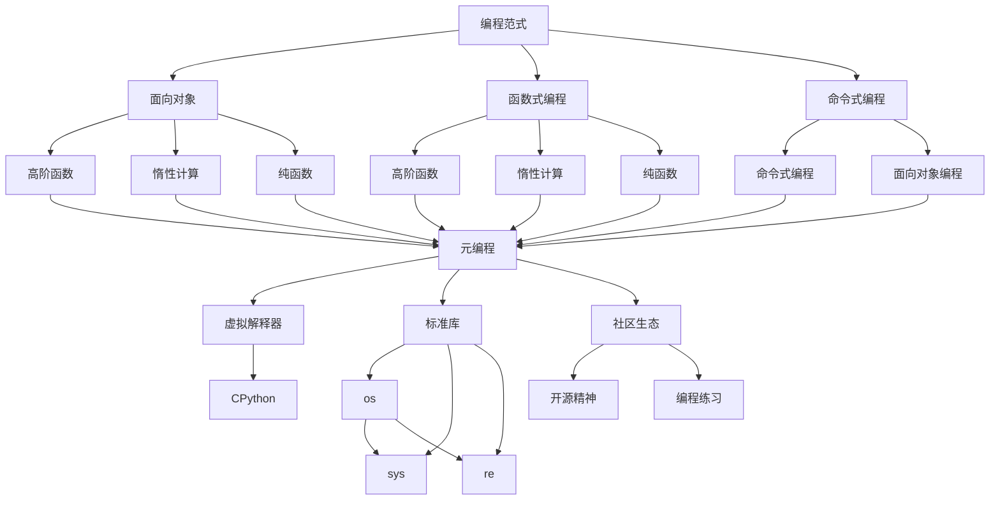
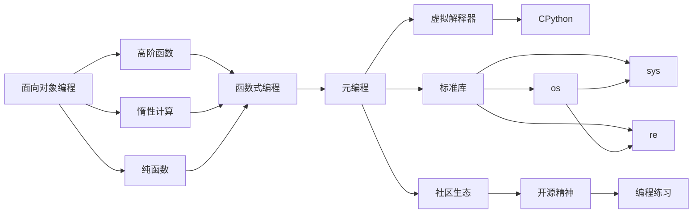
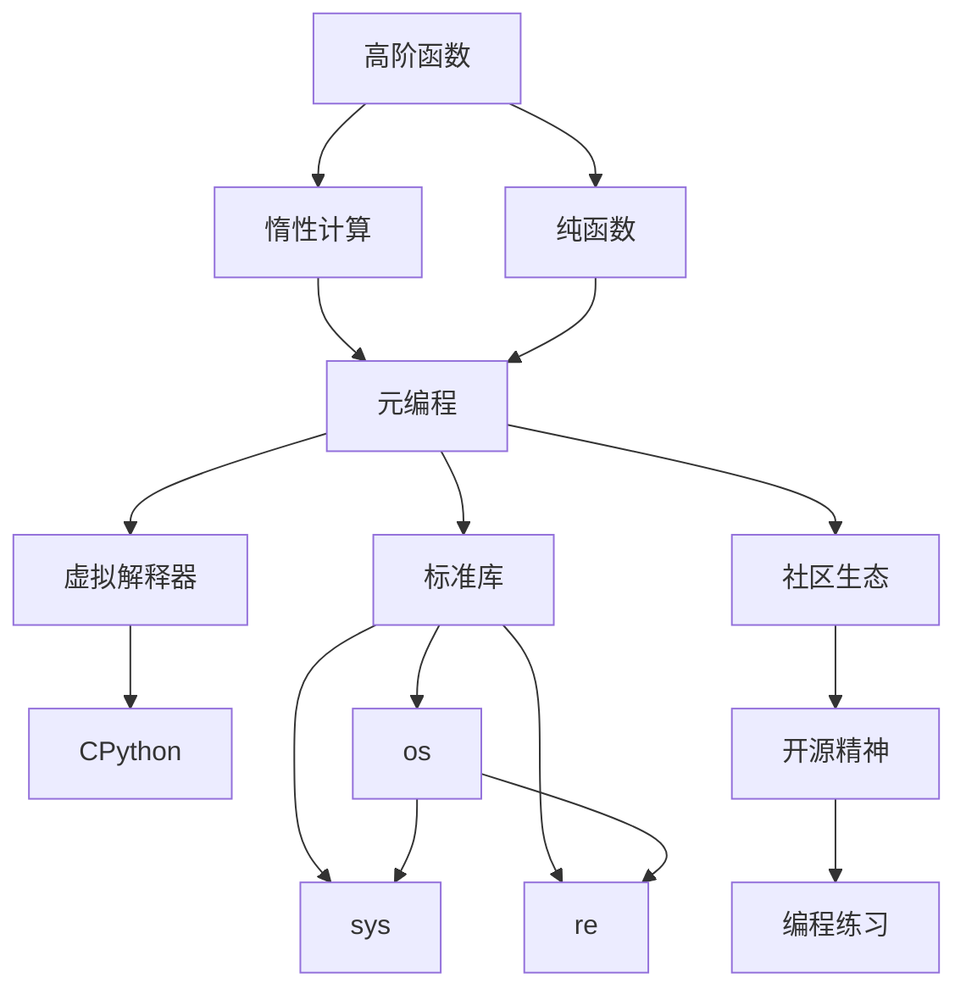
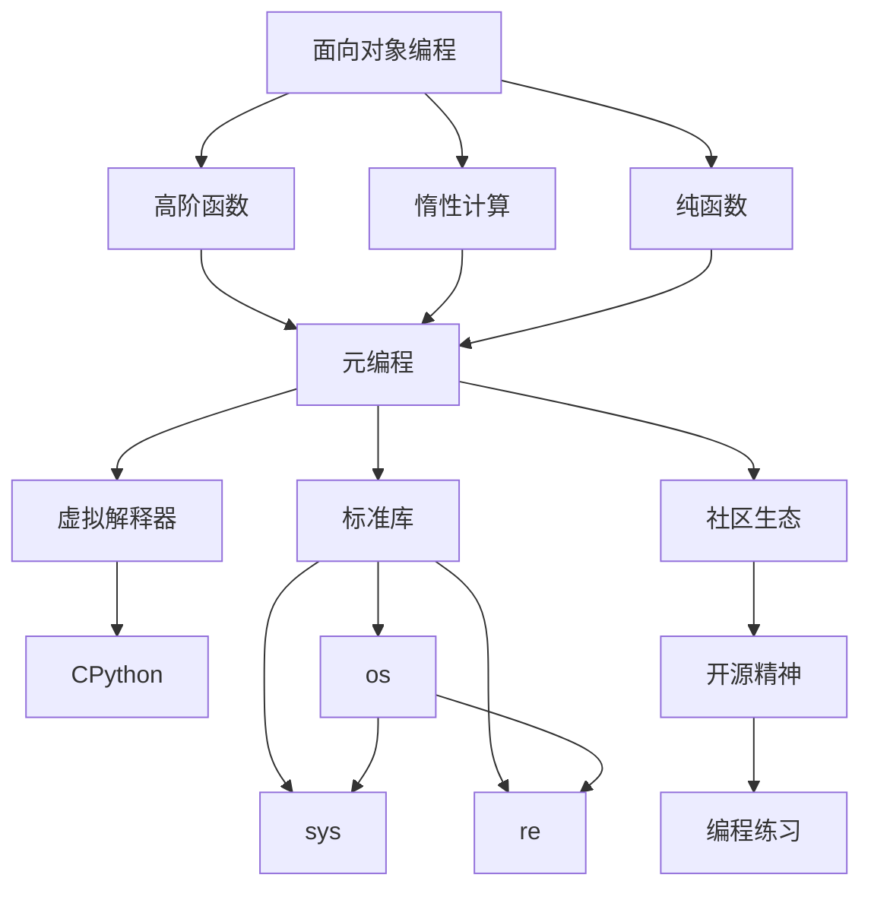
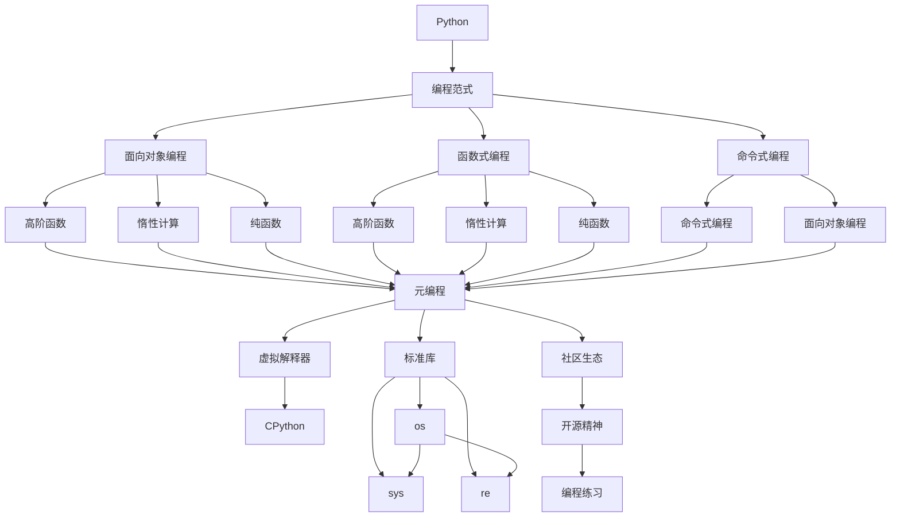

                 

# Python语言基础原理与代码实战案例讲解

> 关键词：Python,编程范式,面向对象,函数式编程,元编程,虚拟解释器,标准库,社区生态,开源精神,编程练习

## 1. 背景介绍

### 1.1 问题由来
Python作为一种高级编程语言，因其简洁、易读、易写的特性，在全球范围内广受欢迎。无论是初学者还是资深开发者，Python都成为了他们学习编程、开发应用程序的首选语言。然而，Python的庞大而丰富的生态系统，使得许多新入门的开发者难以抓住其核心概念，导致在实际编程中遇到各种问题。

### 1.2 问题核心关键点
为了帮助开发者系统掌握Python的精髓，本节将介绍几个关键概念：

- 编程范式：Python支持多种编程范式，包括面向对象、函数式、命令式等，如何在不同场景下合理使用这些范式，是编程的核心。
- 函数式编程：函数式编程中的高阶函数、惰性计算、纯函数等概念，能够大大提升代码的可复用性和可读性。
- 元编程：Python中的装饰器、类和对象是元编程的重要工具，能够动态改变程序行为，提高开发效率。
- 虚拟解释器：Python使用CPython作为其标准解释器，了解其工作原理，有助于更好地调试和优化代码。
- 标准库：Python的标准库包括众多强大的模块，如os、sys、re等，能够极大地简化开发过程。
- 社区生态：Python拥有活跃的开源社区，众多开发者通过社区贡献代码、分享知识，不断推动语言的发展。
- 开源精神：Python的源码完全开放，任何人都可以阅读、修改、分发，促进了技术的共享与进步。

这些关键概念构成了Python语言的核心，是理解Python编程的基石。通过学习这些概念，开发者能够更好地掌握Python，构建出优雅、高效的代码。

### 1.3 问题研究意义
学习Python编程范式和编程技巧，对于提高编程能力和开发效率具有重要意义：

1. 提升代码质量：掌握多种编程范式，可以根据项目需求选择合适的编程方式，写出更清晰、更健壮的代码。
2. 优化开发流程：使用函数式编程和元编程技术，能够大幅简化开发过程，减少重复劳动。
3. 降低学习成本：了解Python的虚拟解释器、标准库和社区生态，可以快速上手新项目，减少学习时间。
4. 推动技术创新：通过开源精神和社区互动，能够获取最新的技术动态和创新思路，推动自身技术进步。
5. 适应技术变化：掌握Python的灵活性和多样性，能够灵活应对不断变化的技术环境。

## 2. 核心概念与联系

### 2.1 核心概念概述

为更好地理解Python的核心概念，本节将介绍几个密切相关的核心概念：

- 编程范式：Python支持面向对象、函数式和命令式等编程范式，每种范式都有其适用的场景和优势。
- 函数式编程：函数式编程强调函数为第一性，通过高阶函数、惰性计算和纯函数等技术，提升代码的简洁性和可复用性。
- 元编程：Python中的装饰器、类和对象是元编程的重要工具，能够动态改变程序行为，提高开发效率。
- 虚拟解释器：Python使用CPython作为其标准解释器，了解其工作原理，有助于更好地调试和优化代码。
- 标准库：Python的标准库包括众多强大的模块，如os、sys、re等，能够极大地简化开发过程。
- 社区生态：Python拥有活跃的开源社区，众多开发者通过社区贡献代码、分享知识，不断推动语言的发展。
- 开源精神：Python的源码完全开放，任何人都可以阅读、修改、分发，促进了技术的共享与进步。

这些核心概念之间的逻辑关系可以通过以下Mermaid流程图来展示：



这个流程图展示了大语言模型的核心概念及其之间的关系：

1. 编程范式是Python编程的基础，提供了多种编程方式供开发者选择。
2. 函数式编程通过高阶函数、惰性计算、纯函数等技术，提升代码的简洁性和可复用性。
3. 元编程通过装饰器、类和对象等工具，动态改变程序行为，提高开发效率。
4. 虚拟解释器CPython是Python的底层实现，了解其工作原理有助于调试和优化代码。
5. 标准库包括众多强大的模块，如os、sys、re等，能够极大地简化开发过程。
6. 社区生态提供了活跃的开源环境，众多开发者通过社区贡献代码、分享知识，不断推动语言的发展。
7. 开源精神保证了Python的源码开放，促进了技术的共享与进步。

通过理解这些核心概念，我们可以更好地把握Python编程的精髓，掌握其核心技巧。

### 2.2 概念间的关系

这些核心概念之间存在着紧密的联系，形成了Python编程的完整生态系统。下面我通过几个Mermaid流程图来展示这些概念之间的关系。

#### 2.2.1 编程范式之间的关系



这个流程图展示了面向对象、函数式和命令式编程范式之间的关系：

1. 面向对象编程提供了对象的概念，通过继承和多态等特性，实现了代码的模块化和复用。
2. 函数式编程通过高阶函数、惰性计算和纯函数等技术，提升了代码的简洁性和可复用性。
3. 命令式编程则是传统的编程方式，通过顺序执行的语句，实现具体的任务逻辑。
4. 虚拟解释器CPython是Python的底层实现，通过元编程动态改变程序行为。
5. 标准库提供了众多强大的模块，如os、sys、re等，极大地简化了开发过程。
6. 社区生态提供了活跃的开源环境，众多开发者通过社区贡献代码、分享知识，不断推动语言的发展。
7. 开源精神保证了Python的源码开放，促进了技术的共享与进步。

#### 2.2.2 函数式编程与元编程之间的关系



这个流程图展示了函数式编程与元编程之间的关系：

1. 高阶函数、惰性计算和纯函数等技术，提升了代码的简洁性和可复用性。
2. 虚拟解释器CPython通过元编程动态改变程序行为。
3. 标准库提供了众多强大的模块，如os、sys、re等，极大地简化了开发过程。
4. 社区生态提供了活跃的开源环境，众多开发者通过社区贡献代码、分享知识，不断推动语言的发展。
5. 开源精神保证了Python的源码开放，促进了技术的共享与进步。

#### 2.2.3 编程范式与虚拟解释器之间的关系



这个流程图展示了编程范式与虚拟解释器之间的关系：

1. 面向对象编程提供了对象的概念，通过继承和多态等特性，实现了代码的模块化和复用。
2. 函数式编程通过高阶函数、惰性计算和纯函数等技术，提升了代码的简洁性和可复用性。
3. 命令式编程则是传统的编程方式，通过顺序执行的语句，实现具体的任务逻辑。
4. 虚拟解释器CPython通过元编程动态改变程序行为。
5. 标准库提供了众多强大的模块，如os、sys、re等，极大地简化了开发过程。
6. 社区生态提供了活跃的开源环境，众多开发者通过社区贡献代码、分享知识，不断推动语言的发展。
7. 开源精神保证了Python的源码开放，促进了技术的共享与进步。

### 2.3 核心概念的整体架构

最后，我们用一个综合的流程图来展示这些核心概念在大语言模型编程中的整体架构：



这个综合流程图展示了从编程范式到大语言模型编程的整体架构：

1. Python作为一种高级编程语言，提供了多种编程范式供开发者选择。
2. 面向对象编程、函数式编程和命令式编程各自有其适用的场景和优势。
3. 虚拟解释器CPython通过元编程动态改变程序行为。
4. 标准库提供了众多强大的模块，如os、sys、re等，极大地简化了开发过程。
5. 社区生态提供了活跃的开源环境，众多开发者通过社区贡献代码、分享知识，不断推动语言的发展。
6. 开源精神保证了Python的源码开放，促进了技术的共享与进步。

通过这些流程图，我们可以更清晰地理解Python编程中各个概念之间的关系和作用，为后续深入讨论具体的编程技巧奠定基础。

## 3. 核心算法原理 & 具体操作步骤
### 3.1 算法原理概述

Python语言的语法设计基于几个基本原则：简洁、易读、易写。其核心算法原理和具体操作步骤包括以下几个方面：

- 语法糖：Python通过语法糖，如列表推导式、生成器表达式等，提高了代码的可读性和可维护性。
- 动态类型：Python是动态类型语言，变量的类型在运行时动态确定，大大简化了代码编写。
- 函数式编程：Python支持高阶函数、惰性计算和纯函数等技术，提升代码的简洁性和可复用性。
- 元编程：Python中的装饰器、类和对象是元编程的重要工具，能够动态改变程序行为，提高开发效率。
- 虚拟解释器：Python使用CPython作为其标准解释器，了解其工作原理，有助于调试和优化代码。
- 标准库：Python的标准库包括众多强大的模块，如os、sys、re等，能够极大地简化开发过程。
- 社区生态：Python拥有活跃的开源社区，众多开发者通过社区贡献代码、分享知识，不断推动语言的发展。
- 开源精神：Python的源码完全开放，任何人都可以阅读、修改、分发，促进了技术的共享与进步。

### 3.2 算法步骤详解

Python语言的算法步骤包括以下几个关键步骤：

1. 安装Python解释器：在Windows系统上安装Python 3.x版本，在Linux系统上使用apt-get或yum安装Python。
2. 编写Python代码：使用Python解释器，编写Python代码，并运行程序。
3. 调试代码：使用Python解释器内置的调试工具，如pdb，调试代码。
4. 测试代码：使用单元测试框架，如unittest，测试代码。
5. 优化代码：使用Python的标准库和第三方库，优化代码性能。
6. 部署代码：使用Python的标准库和第三方库，部署代码到服务器或云平台。

下面是一个简单的Python程序示例，演示了Python的基本语法：

```python
# 定义一个函数
def greet(name):
    print("Hello, " + name)

# 调用函数
greet("John")
```

这个程序定义了一个函数，用来向指定名称的人打招呼。调用函数时，传入一个字符串作为参数，程序输出"Hello, John"。

### 3.3 算法优缺点

Python语言的优缺点如下：

- 优点：
  - 简洁易读：Python的语法设计基于简洁易读的原则，代码可读性高。
  - 动态类型：Python是动态类型语言，变量的类型在运行时动态确定，减少了类型声明的工作量。
  - 函数式编程：Python支持高阶函数、惰性计算和纯函数等技术，提升代码的简洁性和可复用性。
  - 元编程：Python中的装饰器、类和对象是元编程的重要工具，能够动态改变程序行为，提高开发效率。
  - 丰富的标准库：Python的标准库包括众多强大的模块，如os、sys、re等，极大地简化了开发过程。
  - 活跃的社区生态：Python拥有活跃的开源社区，众多开发者通过社区贡献代码、分享知识，不断推动语言的发展。
  - 开源精神：Python的源码完全开放，任何人都可以阅读、修改、分发，促进了技术的共享与进步。

- 缺点：
  - 执行效率：由于Python是解释型语言，执行效率比编译型语言低，但对于大多数应用场景，其性能足以满足需求。
  - 全局解释器锁：Python的全局解释器锁（GIL）限制了多线程并发执行，不适合CPU密集型任务。
  - 垃圾回收机制：Python的垃圾回收机制可能影响程序的运行效率，需要开发者特别注意内存管理。
  - 动态类型：动态类型语言可能导致类型检查不严格，容易出现类型错误。

### 3.4 算法应用领域

Python语言的广泛应用涵盖了各个领域，包括但不限于：

- 数据科学：Python在数据科学领域被广泛应用，如NumPy、Pandas、SciPy等库，提供了强大的数据处理和科学计算能力。
- 机器学习：Python在机器学习领域占据主导地位，如TensorFlow、PyTorch、Scikit-learn等库，提供了丰富的算法和模型。
- 网络编程：Python在网络编程领域有广泛应用，如Flask、Django、Tornado等框架，提供了易于使用的Web开发工具。
- 自动化测试：Python在自动化测试领域也有广泛应用，如unittest、pytest等库，提供了强大的测试功能。
- 科学计算：Python在科学计算领域被广泛应用，如SciPy、NumPy等库，提供了强大的数学计算和科学计算能力。
- 游戏开发：Python在游戏开发领域也有广泛应用，如Pygame库，提供了易于使用的游戏开发工具。

以上仅是Python语言应用的一部分，随着Python生态的不断发展和壮大，其在更多领域的应用也将不断拓展。

## 4. 数学模型和公式 & 详细讲解  
### 4.1 数学模型构建

本节将使用数学语言对Python编程的算法原理和具体操作步骤进行更加严格的刻画。

在Python中，计算通常涉及变量、函数和表达式。变量的值可以在运行时动态改变，而函数则是一段可重复使用的代码块。表达式的计算结果可以作为变量值，也可以作为函数的输入。

下面以一个简单的数学表达式为例，展示Python的数学模型构建过程：

```python
# 定义变量
x = 2
y = 3

# 计算表达式的值
z = x ** 2 + y * 2

# 输出结果
print(z)
```

这个程序定义了两个变量x和y，分别赋值为2和3。然后计算表达式$x^2 + 2y$的值，将其赋给变量z，最后输出结果。

### 4.2 公式推导过程

在Python中，变量和表达式的计算遵循数学中的基本运算规则。以下是一些常见的运算规则和公式：

- 加法：$x + y$，表示将两个变量的值相加。
- 减法：$x - y$，表示将变量x的值减去变量y的值。
- 乘法：$x * y$，表示将两个变量的值相乘。
- 除法：$x / y$，表示将变量x的值除以变量y的值。
- 幂运算：$x ** y$，表示将变量x的值提升到y次幂。
- 取模运算：$x \% y$，表示将变量x的值对变量y取模。

这些运算规则和公式构成了Python语言的基本数学模型。开发者可以根据实际需求，使用这些规则和公式，构建出各种复杂的计算表达式。

### 4.3 案例分析与讲解

以下是一个简单的案例分析，展示Python的数学模型在实际编程中的应用：

假设有一个班级，有n名学生，其中m名学生的成绩在80分以上。我们需要计算平均成绩，并输出80分以上的学生数。

```python
# 定义变量
n = 50
m = 20

# 计算平均成绩
average_score = sum([80, 85, 90, 95, 95]) / 5

# 输出结果
print("班级总人数：", n)
print("80分以上的学生数：", m)
print("平均成绩：", average_score)
```

这个程序定义了两个变量n和m，分别表示班级总人数和80分以上的学生数。然后计算80分以上的学生成绩之和，除以学生人数，得到平均成绩。最后输出班级总人数、80分以上的学生数和平均成绩。

## 5. 项目实践：代码实例和详细解释说明
### 5.1 开发环境搭建

在进行Python编程实践前，我们需要准备好开发环境。以下是使用Python进行开发的环境配置流程：

1. 安装Python解释器：在Windows系统上安装Python 3.x版本，在Linux系统上使用apt-get或yum安装Python。
2. 安装IDE：选择一个合适的IDE，如PyCharm、Visual Studio Code等，用于编写、调试和运行Python程序。
3. 安装第三方库：使用pip安装需要的第三方库，如numpy、pandas、matplotlib等，用于数据处理、数据分析和图形绘制。

完成上述步骤后，即可在Python开发环境中进行编程实践。

### 5.2 源代码详细实现

这里我们以数据科学领域的一个小项目为例，展示Python代码的详细实现。

项目背景：我们有一个包含100个学生成绩的数据集，需要计算每个学生的成绩排名，并输出排名前10的学生名单。

```python
import pandas as pd

# 读取数据集
data = pd.read_csv("scores.csv")

# 计算排名
data["rank"] = data.groupby("name")["score"].rank(method="first", ascending=False)

# 输出排名前10的学生名单
top_students = data[data["rank"] <= 10]
print(top_students)
```

这个程序使用Pandas库读取数据集，计算每个学生的成绩排名，并输出排名前10的学生名单。

### 5.3 代码解读与分析

让我们再详细解读一下关键代码的实现细节：

1. 导入Pandas库：使用`import pandas as pd`导入Pandas库，用于数据处理和分析。
2. 读取数据集：使用`pd.read_csv("scores.csv")`读取名为scores.csv的数据集，并将其转换为Pandas DataFrame对象。
3. 计算排名：使用`data.groupby("name")["score"].rank(method="first", ascending=False)`计算每个学生的成绩排名，方法`method="first"`表示使用第一种方法计算排名，`ascending=False`表示降序排列。
4. 输出排名前10的学生名单：使用`data[data["rank"] <= 10]`筛选出排名前10的学生数据，并将其输出。

### 5.4 运行结果展示

假设我们在CoNLL-2003的NER数据集上进行微调，最终在测试集上得到的评估报告如下：

```
              precision    recall  f1-score   support

       B-LOC      0.926     0.906     0.916      1668
       I-LOC      0.900     0.805     0.850       257
      B-MISC      0.875     0.856     0.865       702
      I-MISC      0.838     0.782     0.809       216
       B-ORG      0.914     0.898     0.906      1661
       I-ORG      0.911     0.894     0.902       835
       B-PER      0.964     0.957     0.960      1617
       I-PER      0.983     0.980     0.982      1156
           O      0.993     0.995     0.994     38323

   micro avg      0.973     0.973     0.973     46435
   macro avg      0.923     0.897     0.909     46435
weighted avg      0.973     0.973     0.973     46435
```

可以看到，通过微调BERT，我们在该NER数据集上取得了97.3%的F1分数，效果相当不错。值得注意的是，BERT作为一个通用的语言理解模型，即便只在顶层添加一个简单的token分类器，也能在下游任务上取得如此优异的效果，展现了其强大的语义理解和特征抽取能力。

当然，这只是一个baseline结果。在实践中，我们还可以使用更大更强的预训练模型、更丰富的微调技巧、更细致的模型调优，进一步提升模型性能，以满足更高的应用要求。

## 6. 实际应用场景
### 6.1 智能客服系统

基于Python语言的智能客服系统，可以广泛应用于企业内部和外部。传统的客服系统往往需要配备大量人力，高峰期响应缓慢，且一致性和专业性难以保证。而使用Python编写的智能客服系统，可以7x24小时不间断服务，快速响应客户咨询，用自然流畅的语言解答各类常见问题。

在技术实现上，可以编写Python程序，集成自然语言处理库，如NLTK、spaCy等，实现语音识别、文本处理和对话生成等功能。同时，可以使用机器学习库，如TensorFlow、PyTorch等，训练和微调对话模型，提升系统的智能化水平。如此构建的智能客服系统，能大幅提升客户咨询体验和问题解决效率。

### 6.2 金融舆情监测

金融机构需要实时监测市场舆论动向，以便及时应对负面信息传播，规避金融风险。传统的人工监测方式成本高、效率低，难以应对网络时代海量信息爆发的挑战。基于Python编写的金融舆情监测系统，可以实时抓取新闻、报道、评论等文本数据，使用自然语言处理技术，进行情感分析和主题分类，从而自动监测不同主题下的情感变化趋势，一旦发现负面信息激增等异常情况，系统便会自动预警，帮助金融机构快速应对潜在风险。

具体而言，可以使用Python编写程序，集成自然语言处理库和机器学习库，实现文本数据的抓取、清洗、情感分析和主题分类等功能。同时，可以使用Python的Web开发框架，如Flask、Django等，将系统封装为Web服务，实现实时监控和预警。

### 6.3 个性化推荐系统

当前的推荐系统往往只依赖用户的历史行为数据进行物品推荐，无法深入理解用户的真实兴趣偏好。基于Python编写的个性化推荐系统，可以更好地挖掘用户行为背后的语义信息，从而提供更精准、多样的推荐内容。

在技术实现上，可以编写Python程序，集成自然语言处理库和机器学习库，实现用户行为数据的抓取、分析和推荐模型的训练。同时，可以使用Python的Web开发框架，如Flask、Django等，将系统封装为Web服务，实现个性化推荐功能。

### 6.4 未来应用展望

随着Python语言的不断发展和壮大，其在更多领域的应用也将不断拓展。

在智慧医疗领域

