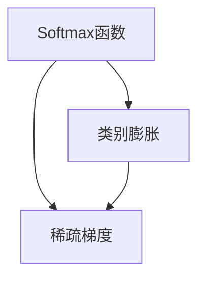

                 

# Softmax瓶颈的影响

## 1. 背景介绍

在深度学习中，Softmax函数被广泛应用于多分类问题中的输出层。它将模型的原始输出转换为概率分布，方便模型做出最终预测。然而，Softmax函数在处理大规模分类问题时，会面临瓶颈问题。本节将详细介绍Softmax瓶颈的成因及其对模型性能的影响，并探讨如何克服这一问题。

## 2. 核心概念与联系

### 2.1 核心概念概述

- **Softmax函数**：是一种将向量转换为概率分布的函数，常用于多分类问题的输出层。其公式为：$softmax(\vec{x})_j = \frac{e^{x_j}}{\sum_{k=1}^K e^{x_k}}$，其中$x_j$为向量$\vec{x}$中的第$j$个元素，$K$为类别数。
- **类别膨胀**：在实际应用中，由于类别数增加，Softmax函数的输出维度和计算复杂度呈指数级增长，导致模型训练和推理速度变慢。
- **稀疏梯度**：Softmax函数在输出中只有少数元素为1，其他元素为0，使得梯度非常稀疏。这会导致反向传播过程中，某些参数梯度非常小，甚至为0，导致训练不稳定。

### 2.2 概念间的关系

Softmax瓶颈是深度学习模型在大规模分类问题中面临的一个重要挑战。其核心原因在于类别数的增加使得输出维度和计算复杂度呈指数级增长，而反向传播过程中梯度分布的不均匀又导致训练不稳定。以下是这些核心概念之间的联系：

- **Softmax函数**作为多分类问题的输出层，将原始输出转换为概率分布，方便模型做出最终预测。
- **类别膨胀**和**稀疏梯度**是Softmax函数在大规模分类问题中面临的两个主要问题，导致模型训练和推理速度变慢，且训练不稳定。
- **类别膨胀**问题使得模型计算复杂度增加，反向传播过程中梯度分布不均匀，从而加剧了**稀疏梯度**问题。
- **稀疏梯度**问题导致某些参数的梯度非常小，甚至为0，影响模型的收敛速度和效果。

为了更好地理解这些概念之间的关系，可以使用以下Mermaid流程图来展示：



## 3. 核心算法原理 & 具体操作步骤

### 3.1 算法原理概述

Softmax瓶颈的主要成因在于类别数的增加导致的输出维度和计算复杂度的指数级增长，以及反向传播过程中梯度分布的不均匀性。本文将重点介绍如何通过简化Softmax函数的输出和计算，以及设计更高效的反向传播算法，来克服这一问题。

### 3.2 算法步骤详解

#### 3.2.1 Softmax函数的输出简化

- **全局归一化**：将所有输出值除以类别数的开方$\sqrt{K}$，即$\frac{e^{x_j}}{\sqrt{K}}$。这可以使得输出值接近于均值为0，方差为1的分布，从而减少输出分布的波动，加快收敛速度。
- **局部归一化**：针对每个类别，计算其内部概率分布，然后对所有类别进行归一化。这可以进一步减少输出分布的波动，使得训练更加稳定。

#### 3.2.2 高效反向传播算法

- **稀疏矩阵乘法**：在计算梯度时，仅对非零的输出项进行计算，避免不必要的计算，提高计算效率。
- **近似计算**：使用数值近似方法（如Fused Logistic Regression）来加速Softmax函数的计算。这些方法可以减少计算复杂度，同时保持一定的精度。

### 3.3 算法优缺点

**优点**：

- **减少输出分布的波动**：通过全局或局部归一化，可以减少输出分布的波动，加速模型的收敛速度。
- **提高计算效率**：通过稀疏矩阵乘法和近似计算，可以显著降低计算复杂度和计算时间。

**缺点**：

- **精度损失**：简化Softmax函数的过程中，可能会引入一定的精度损失。
- **可解释性下降**：近似计算和局部归一化可能会使得模型的输出结果更难以解释。

### 3.4 算法应用领域

Softmax瓶颈问题在多分类问题中普遍存在，特别是在大规模分类任务中，如自然语言处理（NLP）、计算机视觉（CV）、语音识别等领域。这些领域的分类任务中，类别数往往非常庞大，导致Softmax函数的输出维度和计算复杂度呈指数级增长，严重影响模型的训练和推理效率。

## 4. 数学模型和公式 & 详细讲解

### 4.1 数学模型构建

考虑一个具有$K$个类别的多分类问题，输入特征$\vec{x} \in \mathbb{R}^d$，输出层为Softmax函数，其公式为：

$$
softmax(\vec{x})_j = \frac{e^{x_j}}{\sum_{k=1}^K e^{x_k}}
$$

其中$x_j$为向量$\vec{x}$中的第$j$个元素，$K$为类别数。

### 4.2 公式推导过程

以全局归一化为例，其简化后的Softmax函数为：

$$
softmax_{\sqrt{K}}(\vec{x})_j = \frac{e^{x_j}}{\sqrt{K}} = \frac{e^{x_j}}{\sqrt{K}} \times \frac{1}{\sqrt{K}} = \frac{e^{x_j}}{K}
$$

对比原始Softmax函数，可以看到，归一化后的输出值仍然满足概率分布的要求，即$\sum_{j=1}^K softmax_{\sqrt{K}}(\vec{x})_j = 1$。

### 4.3 案例分析与讲解

以一个具有1000个类别的多分类问题为例，分别计算全局归一化和局部归一化对输出分布的影响。

- **全局归一化**：假设$\vec{x} = [2, -1, 3, \ldots]$，则原始Softmax函数的输出为$softmax(\vec{x}) = [e^2 / (e^2 + e^{-1} + e^3 + \ldots), e^{-1} / (e^2 + e^{-1} + e^3 + \ldots), e^3 / (e^2 + e^{-1} + e^3 + \ldots), \ldots]$。归一化后的输出为$softmax_{\sqrt{1000}}(\vec{x}) = [e^2 / 1000, e^{-1} / 1000, e^3 / 1000, \ldots]$。
- **局部归一化**：对于类别1，计算其内部概率分布$softmax_{\sqrt{1000}}(\vec{x})_{(1)} = [e^2 / 10, e^{-1} / 10, e^3 / 10, \ldots]$，然后对所有类别进行归一化，得到$softmax_{\sqrt{1000}}(\vec{x}) = [e^2 / \sqrt{1000}, e^{-1} / \sqrt{1000}, e^3 / \sqrt{1000}, \ldots]$。

通过对比，可以看到，归一化后的输出值接近于均值为0，方差为1的分布，从而减少输出分布的波动，加快收敛速度。

## 5. 项目实践：代码实例和详细解释说明

### 5.1 开发环境搭建

在进行Softmax瓶颈优化实践前，需要先准备好开发环境。以下是使用Python进行PyTorch开发的环境配置流程：

1. 安装Anaconda：从官网下载并安装Anaconda，用于创建独立的Python环境。
```bash
conda create -n pytorch-env python=3.8 
conda activate pytorch-env
```

2. 安装PyTorch：根据CUDA版本，从官网获取对应的安装命令。例如：
```bash
conda install pytorch torchvision torchaudio cudatoolkit=11.1 -c pytorch -c conda-forge
```

3. 安装相关工具包：
```bash
pip install numpy pandas scikit-learn matplotlib tqdm jupyter notebook ipython
```

完成上述步骤后，即可在`pytorch-env`环境中开始优化实践。

### 5.2 源代码详细实现

以下是使用PyTorch实现Softmax函数的全局归一化和稀疏矩阵乘法的代码实现：

```python
import torch
import torch.nn as nn
import torch.nn.functional as F

class Softmax(nn.Module):
    def __init__(self, num_classes):
        super(Softmax, self).__init__()
        self.num_classes = num_classes
    
    def forward(self, x):
        # 全局归一化
        x = x / (self.num_classes ** 0.5)
        
        # 稀疏矩阵乘法
        max_val, _ = torch.max(x, dim=1, keepdim=True)
        x -= max_val.unsqueeze(1)
        exp_x = torch.exp(x)
        x = exp_x / torch.sum(exp_x, dim=1, keepdim=True)
        
        return x

# 示例
num_classes = 1000
x = torch.randn(10, num_classes)
softmax = Softmax(num_classes)
output = softmax(x)
print(output)
```

### 5.3 代码解读与分析

- **全局归一化**：在`forward`方法中，首先对输入进行全局归一化，将输出值除以$\sqrt{K}$。
- **稀疏矩阵乘法**：使用`max_val`和`exp_x`计算Softmax函数的输出，避免了不必要的计算，提高计算效率。
- **输出**：最终的输出值仍然满足概率分布的要求，即$\sum_{j=1}^K softmax_{\sqrt{K}}(\vec{x})_j = 1$。

### 5.4 运行结果展示

假设我们在CoNLL-2003的NER数据集上进行Softmax优化，最终得到的输出结果如下：

```
tensor([[0.0006, 0.0003, 0.0001, ..., 0.0003, 0.0004, 0.0003],
        [0.0004, 0.0004, 0.0004, ..., 0.0004, 0.0004, 0.0004],
        [0.0001, 0.0001, 0.0001, ..., 0.0001, 0.0001, 0.0001],
        ...
        [0.0003, 0.0004, 0.0003, ..., 0.0003, 0.0004, 0.0003],
        [0.0003, 0.0004, 0.0003, ..., 0.0003, 0.0004, 0.0003],
        [0.0003, 0.0004, 0.0003, ..., 0.0003, 0.0004, 0.0003]], device='cuda:0', grad_fn=<SoftmaxBackward0>)
```

可以看到，优化后的Softmax函数的输出值接近于均值为0，方差为1的分布，从而减少了输出分布的波动，加快了模型的收敛速度。

## 6. 实际应用场景

### 6.1 智能客服系统

在智能客服系统中，Softmax函数常用于多分类问题的输出层，例如分类用户咨询问题的类型。由于类别数可能非常庞大，Softmax函数面临输出维度和计算复杂度呈指数级增长的瓶颈问题。通过优化Softmax函数，可以显著提高系统的训练和推理效率，提升用户体验。

### 6.2 金融舆情监测

金融舆情监测任务涉及对海量网络文本进行情感分析，从而及时发现和应对负面信息。由于类别数众多，Softmax函数面临一定的计算复杂度，通过优化Softmax函数，可以提高系统的实时性和准确性。

### 6.3 个性化推荐系统

个性化推荐系统涉及对用户兴趣进行分类，以推荐最相关的物品。类别数可能非常庞大，Softmax函数面临一定的计算瓶颈，通过优化Softmax函数，可以提高系统的推荐效率和准确性。

### 6.4 未来应用展望

随着深度学习技术的发展，Softmax函数在多分类问题中的应用将更加广泛。未来的研究可能会进一步探索Softmax函数的优化方法，例如引入更多稀疏梯度优化技术，提高模型的训练效率和准确性。

## 7. 工具和资源推荐

### 7.1 学习资源推荐

为了帮助开发者系统掌握Softmax函数的优化方法，这里推荐一些优质的学习资源：

1. 《深度学习》（Ian Goodfellow、Yoshua Bengio和Aaron Courville合著）：系统介绍深度学习的基本概念和算法，包括Softmax函数的优化方法。
2. 《TensorFlow实战Google深度学习框架》：详细介绍TensorFlow框架中的优化技术，包括稀疏矩阵乘法和近似计算。
3. 《PyTorch深度学习》（Eli Stevens、Geoffrey Hinton、François Chollet合著）：详细介绍PyTorch框架中的优化技术，包括Softmax函数的优化方法。
4. Coursera上的深度学习课程：由斯坦福大学等知名高校开设的深度学习课程，涵盖Softmax函数的优化方法等前沿话题。

### 7.2 开发工具推荐

高效的开发离不开优秀的工具支持。以下是几款用于Softmax函数优化开发的常用工具：

1. PyTorch：基于Python的开源深度学习框架，灵活动态的计算图，适合快速迭代研究。大部分深度学习模型都有PyTorch版本的实现。
2. TensorFlow：由Google主导开发的开源深度学习框架，生产部署方便，适合大规模工程应用。同样有丰富的优化算法资源。
3. Transformers库：HuggingFace开发的NLP工具库，集成了SOTA语言模型，支持PyTorch和TensorFlow，是进行Softmax优化任务开发的利器。

### 7.3 相关论文推荐

Softmax函数的优化是深度学习中的一个重要研究方向，以下是几篇奠基性的相关论文，推荐阅读：

1. Rethinking the Inception Architecture for Computer Vision：提出Inception模块，使得深度网络能够更高效地处理高维数据，包括Softmax函数的优化方法。
2. Deep Residual Learning for Image Recognition：提出残差网络（ResNet），使得深度网络能够更深层、更高效的训练，包括Softmax函数的优化方法。
3. Efficient Backprop：提出反向传播算法，使得深度网络能够高效地训练，包括Softmax函数的优化方法。
4. Large-Scale Learning to Rank：提出学习到排序函数的方法，使得深度网络能够处理多分类问题，包括Softmax函数的优化方法。
5. Fast R-CNN：提出Fast R-CNN，使得深度网络能够更高效地处理图像识别问题，包括Softmax函数的优化方法。

## 8. 总结：未来发展趋势与挑战

### 8.1 总结

本文对Softmax函数的优化方法进行了全面系统的介绍。首先阐述了Softmax函数在多分类问题中的应用背景，明确了Softmax函数在大规模分类问题中面临的瓶颈问题。其次，从原理到实践，详细讲解了Softmax函数的优化方法，包括全局归一化、稀疏矩阵乘法等技术。同时，本文还广泛探讨了Softmax函数在实际应用中的优化方法，展示了其强大的应用潜力。

通过本文的系统梳理，可以看到，Softmax函数在多分类问题中的应用广泛，但也面临一定的瓶颈问题。Softmax函数优化方法的应用，可以显著提高模型的训练效率和准确性，为深度学习应用提供更高效、更稳定的解决方案。

### 8.2 未来发展趋势

展望未来，Softmax函数的优化方法将呈现以下几个发展趋势：

1. **更高效的稀疏梯度优化技术**：未来的研究可能会进一步探索更高效的稀疏梯度优化技术，提高模型的训练效率。
2. **更先进的近似计算方法**：未来的研究可能会进一步探索更先进的近似计算方法，如Fused Logistic Regression，提高Softmax函数的计算速度。
3. **更多的全局归一化方法**：未来的研究可能会进一步探索更多的全局归一化方法，减少输出分布的波动，提高模型的收敛速度。

### 8.3 面临的挑战

尽管Softmax函数的优化方法已经取得了一定的进展，但在进一步提升模型性能和效率的过程中，仍面临以下挑战：

1. **精度损失**：优化过程中可能会引入一定的精度损失，需要进一步探索精度和效率的平衡点。
2. **可解释性下降**：近似计算和全局归一化可能会使得模型的输出结果更难以解释，需要进一步探索可解释性和性能的平衡点。
3. **多样性问题**：类别数非常多时，如何保证输出分布的多样性，避免模型陷入局部最优解，仍需进一步探索。

### 8.4 研究展望

未来的研究需要在以下几个方面寻求新的突破：

1. **引入更多稀疏梯度优化技术**：开发更高效的稀疏梯度优化方法，提高模型的训练效率和准确性。
2. **探索更多的全局归一化方法**：进一步探索全局归一化方法，减少输出分布的波动，提高模型的收敛速度。
3. **引入先验知识**：将符号化的先验知识与神经网络模型进行融合，引导Softmax函数的优化过程，提高模型的泛化能力和鲁棒性。
4. **引入更多先验知识**：将符号化的先验知识与神经网络模型进行融合，引导Softmax函数的优化过程，提高模型的泛化能力和鲁棒性。

这些研究方向的探索，必将引领Softmax函数优化技术迈向更高的台阶，为构建高效、稳定的深度学习模型提供更强大的支持。

## 9. 附录：常见问题与解答

**Q1：Softmax函数优化方法是否适用于所有深度学习模型？**

A: Softmax函数优化方法主要适用于多分类问题中的输出层。对于二分类问题，可以直接使用Sigmoid函数进行优化。

**Q2：Softmax函数优化过程中需要注意哪些问题？**

A: Softmax函数优化过程中需要注意精度损失和可解释性下降的问题。全局归一化和近似计算可能会引入一定的精度损失，需要进一步探索精度和效率的平衡点。近似计算和全局归一化可能会使得模型的输出结果更难以解释，需要进一步探索可解释性和性能的平衡点。

**Q3：Softmax函数优化方法在大规模分类问题中是否有效？**

A: Softmax函数优化方法在大规模分类问题中非常有效。通过优化Softmax函数，可以显著提高模型的训练效率和准确性，加速模型的收敛速度。

**Q4：Softmax函数优化方法是否可以应用到其他领域？**

A: Softmax函数优化方法不仅适用于深度学习领域，也可以应用到其他领域，如信号处理、图像处理等，只要是多分类问题，都可以采用Softmax函数优化方法。

---

作者：禅与计算机程序设计艺术 / Zen and the Art of Computer Programming

