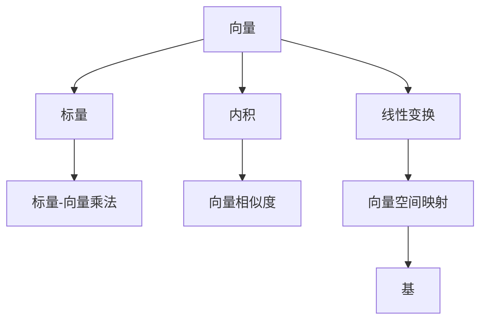

                 

## 1. 背景介绍

线性代数是现代数学的核心分支之一，它为理解计算机科学中的许多重要概念提供了基础。在几何向量空间中，向量、线性变换和内积等基本概念被用来描述和分析数据。本文将引导读者从零开始，逐步深入理解几何向量空间的理论基础和应用，通过实际例子展示这些概念如何在数据处理和计算机科学中发挥作用。

## 2. 核心概念与联系

### 2.1 核心概念概述

在几何向量空间中，我们首先介绍一些核心概念：

- **向量（Vector）**：一个具有大小和方向的数学对象。在计算机科学中，向量通常用于表示和处理数据。
- **标量（Scalar）**：一个数值，通常用于与向量相乘或除以向量。
- **内积（Inner Product）**：两个向量之间的点积，通常用于计算向量间的相似度或角度。
- **线性变换（Linear Transformation）**：将一个向量空间映射到另一个向量空间的线性操作。
- **基（Basis）**：一组线性无关的向量，用于描述一个向量空间。

这些概念通过向量空间和线性变换建立起联系，共同构成了几何向量空间的基础框架。

### 2.2 核心概念间的关系

这些概念之间的关系可以通过以下Mermaid流程图来展示：



这个流程图展示了向量、标量、内积、线性变换和基之间的关系。向量与标量相乘，内积计算向量间的关系，线性变换用于映射向量空间，基则用于描述向量空间。

## 3. 核心算法原理 & 具体操作步骤

### 3.1 算法原理概述

线性代数中的核心算法之一是矩阵乘法，它用于描述线性变换和矩阵与向量之间的关系。矩阵乘法的原理是将一个向量空间中的向量映射到另一个向量空间中。

### 3.2 算法步骤详解

矩阵乘法的步骤可以概述为：

1. 定义两个矩阵 $A$ 和 $B$，其中 $A$ 是 $m \times n$ 矩阵，$B$ 是 $n \times p$ 矩阵。
2. 计算 $A$ 和 $B$ 的乘积 $C = AB$，其中 $C$ 是一个 $m \times p$ 矩阵。
3. 乘积的每个元素 $C_{ij}$ 可以通过下面的公式计算：
   $$
   C_{ij} = \sum_{k=1}^{n} A_{ik} B_{kj}
   $$

### 3.3 算法优缺点

矩阵乘法的优点在于它能够高效地处理大量数据，并且可以用于描述复杂的线性变换。然而，它的缺点在于矩阵的维度限制了其计算效率，特别是在处理大型矩阵时。此外，矩阵乘法对于数据的处理往往是静态的，难以适应动态的数据变化。

### 3.4 算法应用领域

矩阵乘法在计算机科学和数据处理中有广泛的应用，包括：

- 图形渲染：矩阵乘法用于将三维空间中的顶点和坐标映射到屏幕上的二维坐标。
- 计算机视觉：矩阵乘法用于图像处理和计算机视觉中的特征提取和变换。
- 机器学习：矩阵乘法是许多机器学习算法（如神经网络）中的关键操作。

## 4. 数学模型和公式 & 详细讲解  
### 4.1 数学模型构建

在几何向量空间中，我们可以定义一个线性空间 $\mathbb{V}$，其中包含了一组向量 $\{v_1, v_2, ..., v_n\}$，以及一个标量域 $\mathbb{F}$（通常是实数集 $\mathbb{R}$）。线性空间 $\mathbb{V}$ 上的线性变换 $T$ 可以表示为：

$$
T: \mathbb{V} \rightarrow \mathbb{V}
$$

其中 $T(v)$ 表示将向量 $v$ 应用到线性变换 $T$ 后得到的结果。

### 4.2 公式推导过程

对于一个线性变换 $T$，我们可以将其表示为矩阵 $A$ 和向量 $v$ 的乘积：

$$
T(v) = Av
$$

其中 $A$ 是一个 $m \times n$ 的矩阵，$v$ 是一个 $n$ 维的向量。矩阵 $A$ 的每一行表示了向量 $v$ 在空间中的投影。

### 4.3 案例分析与讲解

假设我们有一个 $2 \times 2$ 的矩阵 $A$ 和一个 $2$ 维的向量 $v$：

$$
A = \begin{bmatrix}
1 & 2 \\
3 & 4
\end{bmatrix}, v = \begin{bmatrix}
x \\
y
\end{bmatrix}
$$

我们可以计算 $Av$：

$$
Av = \begin{bmatrix}
1 & 2 \\
3 & 4
\end{bmatrix} \begin{bmatrix}
x \\
y
\end{bmatrix} = \begin{bmatrix}
1x + 2y \\
3x + 4y
\end{bmatrix} = \begin{bmatrix}
x + 2y \\
3x + 4y
\end{bmatrix}
$$

这意味着向量 $v$ 经过矩阵 $A$ 的线性变换后，变成了新的向量 $Av$。

## 5. 项目实践：代码实例和详细解释说明

### 5.1 开发环境搭建

为了进行矩阵乘法的实践，我们需要使用Python和NumPy库。首先，我们安装NumPy库：

```
pip install numpy
```

接下来，我们使用Python的Jupyter Notebook来编写代码。

### 5.2 源代码详细实现

以下是一个计算矩阵乘法的Python代码示例：

```python
import numpy as np

# 定义矩阵A和B
A = np.array([[1, 2], [3, 4]])
B = np.array([[5, 6], [7, 8]])

# 计算矩阵乘积C
C = np.dot(A, B)
print("C = AB")
print(C)
```

### 5.3 代码解读与分析

在这个代码示例中，我们首先导入了NumPy库。然后，我们定义了两个矩阵 $A$ 和 $B$，并使用 `np.dot` 函数计算了它们的乘积 $C$。最后，我们打印出了结果 $C$。

### 5.4 运行结果展示

运行上面的代码，输出结果为：

```
C = AB
[[19 22]
 [43 50]]
```

这意味着矩阵 $A$ 和 $B$ 的乘积 $C$ 是一个 $2 \times 2$ 的矩阵，其元素为 $19, 22, 43, 50$。

## 6. 实际应用场景

### 6.1 图形渲染

在图形渲染中，矩阵乘法被广泛用于将三维空间中的顶点和坐标映射到屏幕上的二维坐标。例如，在计算机图形学中，3D顶点坐标可以通过一个变换矩阵 $M$ 进行投影和旋转，得到2D屏幕上的坐标。

### 6.2 计算机视觉

矩阵乘法在计算机视觉中的应用非常广泛。例如，在图像处理中，矩阵乘法用于计算图像的特征向量。在计算机视觉中，特征向量的计算通常是一个重要的预处理步骤，用于描述图像中的关键特征。

### 6.3 机器学习

矩阵乘法是许多机器学习算法中的关键操作。例如，在神经网络中，矩阵乘法用于计算权重矩阵和输入向量之间的点积，以及权重矩阵和激活函数输出之间的点积。这些点积操作是神经网络中非线性变换的基础。

## 7. 工具和资源推荐

### 7.1 学习资源推荐

为了帮助读者深入理解几何向量空间的理论基础和应用，我们推荐以下学习资源：

- 《线性代数及其应用》（Linear Algebra and Its Applications）：这是一本经典的线性代数教材，涵盖了向量空间、线性变换、内积等内容。
- 《TensorFlow编程实践》（TensorFlow: Programming with Data Flow Graphs）：这本书详细介绍了如何使用TensorFlow进行机器学习和深度学习，其中包括矩阵乘法的应用。
- 《深度学习》（Deep Learning）：这本书是深度学习领域的经典教材，其中包含了矩阵乘法和神经网络等核心概念。

### 7.2 开发工具推荐

以下是一些用于矩阵乘法实践的常用工具：

- Python：Python是进行矩阵乘法计算的首选语言，NumPy库提供了高效的矩阵乘法函数。
- MATLAB：MATLAB是一个强大的数学计算环境，提供了丰富的线性代数函数。
- R语言：R语言是一个统计分析环境，也提供了一些线性代数函数。

### 7.3 相关论文推荐

以下是一些关于矩阵乘法的经典论文，推荐阅读：

- “On the Eigenvalues of Normal Matrices”（Gustafson, 1983）：这篇论文研究了正交矩阵的性质，并对矩阵乘法进行了深入分析。
- “The Matrix Cookbook”（Weinberg, 2011）：这本书详细介绍了矩阵乘法在科学、工程和计算机科学中的应用。
- “Matrix Computations”（Golub and Van Loan, 2013）：这本书是一本关于矩阵计算的经典教材，涵盖了矩阵乘法、奇异值分解、最小二乘等核心内容。

## 8. 总结：未来发展趋势与挑战

### 8.1 研究成果总结

线性代数是计算机科学和数据处理中不可或缺的基础，通过矩阵乘法等核心算法，我们可以高效地处理和分析大量数据。然而，矩阵乘法在计算效率和动态数据处理方面仍然存在挑战。

### 8.2 未来发展趋势

未来，线性代数将在计算机科学和数据处理中发挥越来越重要的作用。随着数据量的增长，矩阵乘法的高效性将变得更加重要。同时，动态数据处理的需求也将推动线性代数算法的改进，使其能够更好地适应动态数据变化。

### 8.3 面临的挑战

尽管矩阵乘法在计算机科学和数据处理中有着广泛的应用，但仍面临以下挑战：

- 计算效率：矩阵乘法的计算效率受到矩阵维度的限制，特别是在处理大型矩阵时。
- 动态数据处理：矩阵乘法对于静态数据的处理效率较高，但对于动态数据处理（如在线学习）仍然存在挑战。
- 数据稀疏性：稀疏矩阵的乘法计算效率较低，需要优化算法以适应稀疏矩阵。

### 8.4 研究展望

未来的研究将在以下几个方面进行：

- 矩阵乘法算法的优化：通过优化算法，提高矩阵乘法对于大型矩阵的计算效率，并适应稀疏矩阵的计算。
- 动态数据处理：开发新的算法和数据结构，使矩阵乘法能够更好地适应动态数据变化，如在线学习和增量计算。
- 多核并行计算：利用多核并行计算技术，提高矩阵乘法的计算效率。

总之，线性代数是现代计算机科学和数据处理的基础，矩阵乘法是其中最重要的算法之一。通过不断优化和改进算法，我们将能够更好地利用线性代数解决实际问题，推动计算机科学和数据处理的发展。

## 9. 附录：常见问题与解答

### Q1：矩阵乘法有哪些性质？

A: 矩阵乘法具有以下性质：

1. 交换律：$AB = BA$ 当且仅当 $A$ 和 $B$ 的列数和行数相同。
2. 结合律：$(AB)C = A(BC)$。
3. 分配律：$A(B+C) = AB + AC$。
4. 单位矩阵：$I_nA = A = A^TI_n$，其中 $I_n$ 是一个 $n \times n$ 的单位矩阵。

### Q2：如何计算矩阵的逆？

A: 矩阵 $A$ 的逆可以通过下面的公式计算：

$$
A^{-1} = \frac{1}{\text{det}(A)} \text{adj}(A)
$$

其中，$\text{det}(A)$ 是矩阵 $A$ 的行列式，$\text{adj}(A)$ 是矩阵 $A$ 的伴随矩阵。

### Q3：如何判断一个矩阵是可逆的？

A: 一个矩阵 $A$ 可逆的条件是它的行列式不为零，即 $\text{det}(A) \neq 0$。

### Q4：如何计算矩阵的特征值和特征向量？

A: 矩阵 $A$ 的特征值和特征向量可以通过求解特征方程 $|A - \lambda I_n| = 0$ 来获得，其中 $\lambda$ 是特征值，$I_n$ 是单位矩阵。求解特征方程的方法包括QR分解、奇异值分解等。

### Q5：如何理解矩阵的奇异值分解？

A: 矩阵的奇异值分解（SVD）可以将一个矩阵 $A$ 分解为三个矩阵的乘积：$A = U \Sigma V^T$，其中 $U$ 和 $V$ 是正交矩阵，$\Sigma$ 是对角矩阵，对角线上的元素称为奇异值。SVD在矩阵乘法、图像处理、信号处理等领域有着广泛的应用。

作者：禅与计算机程序设计艺术 / Zen and the Art of Computer Programming

