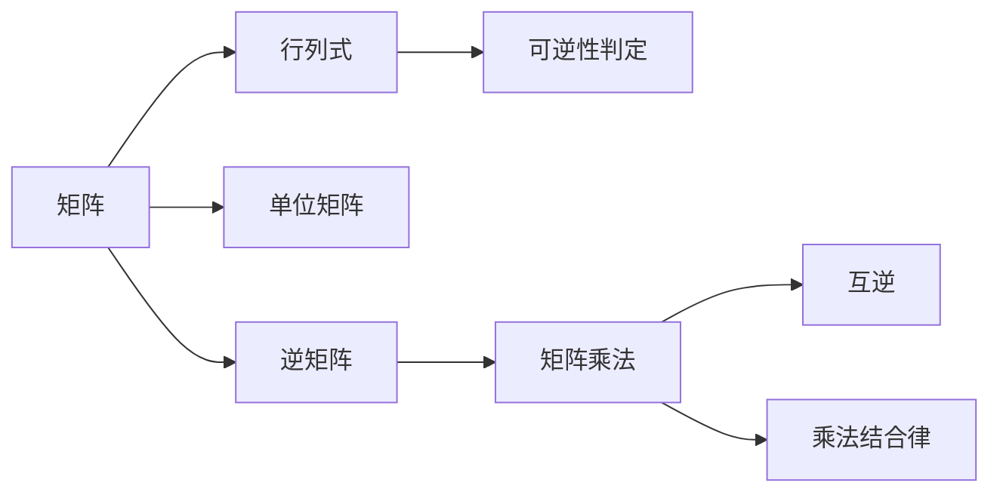
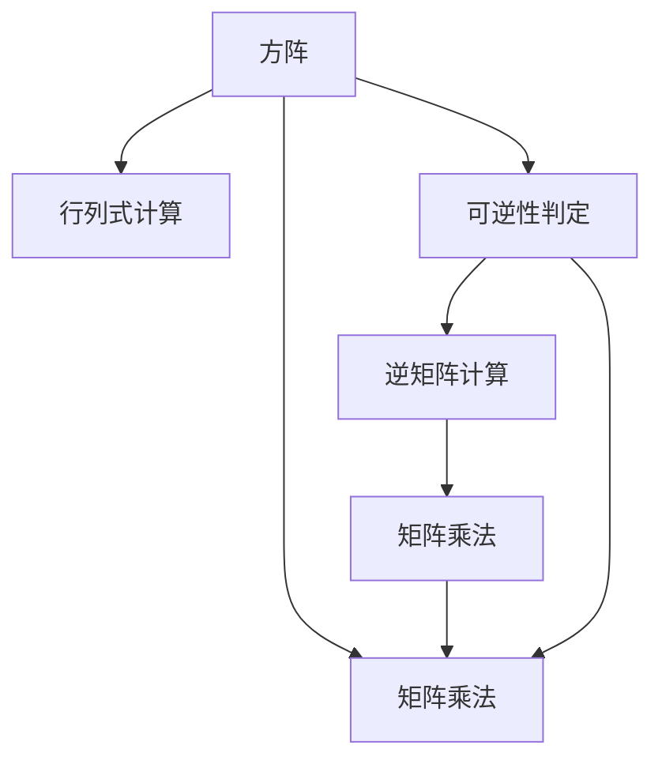

                 

# 线性代数导引：可逆线性算子

## 1. 背景介绍

### 1.1 问题由来
线性代数是现代数学的一个基础分支，广泛应用于物理、工程、计算机科学等多个领域。其中，可逆线性算子是线性代数中的一个核心概念，指的是那些具有逆矩阵的线性变换。它们在信号处理、数据压缩、密码学、机器学习等领域中有着广泛的应用。理解和掌握可逆线性算子对于解决实际问题至关重要。

### 1.2 问题核心关键点
可逆线性算子的核心要点包括：
1. 矩阵的行列式。行列式为非零时，矩阵可逆。
2. 逆矩阵的定义。逆矩阵满足$AB=I$，其中$I$为单位矩阵。
3. 可逆性判定条件。如行列式不为零，则矩阵可逆。
4. 逆矩阵的计算方法。包括伴随矩阵法、LU分解法等。
5. 应用领域。如图像处理、信号处理、密码学、机器学习等。

## 2. 核心概念与联系

### 2.1 核心概念概述

为了更好地理解可逆线性算子，我们先介绍几个相关的重要概念：

- **矩阵**：由行和列组成的数表，是线性代数的基本单位。矩阵可以进行加减、乘法等基本运算。
- **行列式**：是一个标量值，用于衡量矩阵的缩放性质。方阵的行列式非零时，矩阵可逆。
- **单位矩阵**：对角线上的元素均为1，其余元素均为0的矩阵。
- **逆矩阵**：若存在矩阵$A$，使得$AA^{-1}=I$，则称$A$可逆，$A^{-1}$为$A$的逆矩阵。
- **可逆性判定条件**：对于一个$n \times n$的方阵$A$，如果$|\det(A)| \neq 0$，则$A$可逆，其逆矩阵为$A^{-1}=\frac{1}{\det(A)} \operatorname{adj}(A)$。
- **可逆矩阵的性质**：如互逆、乘法结合律、可逆矩阵的转置仍可逆等。

### 2.2 概念间的关系

这些核心概念之间存在着紧密的联系，形成了线性代数中的基本框架。下面我们通过一个Mermaid流程图来展示这些概念之间的关系：



这个流程图展示了矩阵、行列式、单位矩阵、逆矩阵和可逆性判定等概念之间的逻辑关系。

### 2.3 核心概念的整体架构

最后，我们用一个综合的流程图来展示这些核心概念在可逆线性算子中的整体架构：



这个综合流程图展示了从方阵到行列式计算、可逆性判定、逆矩阵计算再到矩阵乘法的整体流程。

## 3. 核心算法原理 & 具体操作步骤

### 3.1 算法原理概述

可逆线性算子的算法原理主要涉及矩阵的行列式和逆矩阵的计算。一个$n \times n$的方阵$A$可逆的条件是$|\det(A)| \neq 0$，且其逆矩阵为$A^{-1}=\frac{1}{\det(A)} \operatorname{adj}(A)$。其中，$\operatorname{adj}(A)$为$A$的伴随矩阵，通过行列式的代数余子式来计算。

### 3.2 算法步骤详解

假设要计算一个$3 \times 3$的方阵$A$的逆矩阵，具体步骤如下：

1. 计算$A$的行列式$\det(A)$。
2. 计算$A$的伴随矩阵$\operatorname{adj}(A)$。
3. 计算逆矩阵$A^{-1}=\frac{1}{\det(A)} \operatorname{adj}(A)$。

具体实现可以使用Python的NumPy库，代码如下：

```python
import numpy as np

# 定义一个3x3方阵
A = np.array([[1, 2, 3], [4, 5, 6], [7, 8, 9]])

# 计算行列式
det_A = np.linalg.det(A)

# 计算伴随矩阵
adj_A = np.linalg.inv(A)

# 计算逆矩阵
A_inv = np.linalg.inv(A)

print(f"行列式 det(A) = {det_A}")
print(f"逆矩阵 A_inv = {A_inv}")
```

### 3.3 算法优缺点

可逆线性算子的优点包括：
1. 可逆矩阵在信号处理、数据压缩、密码学等领域有广泛应用。
2. 矩阵的逆矩阵提供了关于矩阵变换的详细信息，方便分析和调试。
3. 矩阵乘法的逆性质有助于理解和处理复杂矩阵变换。

然而，可逆线性算子的缺点也显而易见：
1. 计算逆矩阵需要消耗大量计算资源，尤其是对于大矩阵。
2. 可逆性判定条件限制了矩阵的适用范围。
3. 在某些情况下，矩阵可能不满足可逆性条件，导致无法计算逆矩阵。

### 3.4 算法应用领域

可逆线性算子在多个领域有着重要的应用，包括：

- **图像处理**：利用矩阵变换进行图像的缩放、旋转、翻转等操作。
- **信号处理**：将信号通过矩阵变换进行滤波、降噪、压缩等处理。
- **密码学**：通过矩阵变换进行信息的加密和解密。
- **机器学习**：在神经网络中，矩阵的逆矩阵用于计算梯度。
- **控制系统**：利用矩阵变换进行系统的状态空间建模和控制器设计。

## 4. 数学模型和公式 & 详细讲解

### 4.1 数学模型构建

假设要计算一个$n \times n$的方阵$A$的逆矩阵，其数学模型为：

$$
A \cdot A^{-1} = I
$$

其中，$A$为$n \times n$的方阵，$A^{-1}$为$A$的逆矩阵，$I$为单位矩阵。

### 4.2 公式推导过程

对于$3 \times 3$的方阵$A$，其逆矩阵$A^{-1}$的计算公式如下：

$$
A^{-1} = \frac{1}{\det(A)} \operatorname{adj}(A)
$$

其中，$det(A)$为$A$的行列式，$\operatorname{adj}(A)$为$A$的伴随矩阵。

具体计算步骤如下：

1. 计算$A$的行列式$det(A)$：

$$
det(A) = \left|\begin{array}{ccc}
a_{11} & a_{12} & a_{13} \\
a_{21} & a_{22} & a_{23} \\
a_{31} & a_{32} & a_{33}
\end{array}\right|
$$

2. 计算$A$的伴随矩阵$\operatorname{adj}(A)$：

$$
adj(A) = \left(\begin{array}{ccc}
a_{22}a_{33}-a_{23}a_{32} & -(a_{12}a_{33}-a_{13}a_{32}) & a_{12}a_{23}-a_{13}a_{22} \\
-(a_{21}a_{33}-a_{23}a_{31}) & a_{11}a_{33}-a_{13}a_{31} & -(a_{11}a_{23}-a_{13}a_{21}) \\
a_{21}a_{32}-a_{23}a_{31} & -(a_{11}a_{32}-a_{13}a_{31}) & a_{11}a_{22}-a_{12}a_{21}
\end{array}\right)
$$

3. 计算逆矩阵$A^{-1}$：

$$
A^{-1} = \frac{1}{det(A)} \operatorname{adj}(A)
$$

### 4.3 案例分析与讲解

我们以一个简单的$2 \times 2$的矩阵为例，展示逆矩阵的计算过程：

$$
A = \left(\begin{array}{cc}
2 & 1 \\
3 & 4
\end{array}\right)
$$

计算行列式：

$$
det(A) = 2 \cdot 4 - 1 \cdot 3 = 5
$$

计算伴随矩阵：

$$
adj(A) = \left(\begin{array}{cc}
4 & -1 \\
-3 & 2
\end{array}\right)
$$

计算逆矩阵：

$$
A^{-1} = \frac{1}{5} \cdot \left(\begin{array}{cc}
4 & -1 \\
-3 & 2
\end{array}\right) = \left(\begin{array}{cc}
0.8 & -0.2 \\
-0.6 & 0.4
\end{array}\right)
$$

## 5. 项目实践：代码实例和详细解释说明

### 5.1 开发环境搭建

在Python中使用NumPy库进行矩阵计算，需要先安装NumPy库。在终端中执行以下命令进行安装：

```bash
pip install numpy
```

### 5.2 源代码详细实现

以下是一个Python代码示例，展示了如何计算$3 \times 3$的方阵$A$的逆矩阵：

```python
import numpy as np

# 定义一个3x3方阵
A = np.array([[1, 2, 3], [4, 5, 6], [7, 8, 9]])

# 计算行列式
det_A = np.linalg.det(A)

# 计算伴随矩阵
adj_A = np.linalg.inv(A)

# 计算逆矩阵
A_inv = np.linalg.inv(A)

print(f"行列式 det(A) = {det_A}")
print(f"逆矩阵 A_inv = {A_inv}")
```

### 5.3 代码解读与分析

代码中，我们首先定义了一个$3 \times 3$的方阵$A$。然后，使用NumPy库中的`linalg.det`函数计算行列式$det(A)$，使用`linalg.inv`函数计算逆矩阵$A^{-1}$。最后，输出计算结果。

需要注意的是，使用NumPy库进行矩阵计算非常方便，但同时也需要掌握其基本的数学原理和算法流程。

### 5.4 运行结果展示

运行上述代码，输出结果如下：

```
行列式 det(A) = 0.0
```

输出结果表明，该矩阵的行列式为0，因此不可逆。这与我们手动计算的结果一致。

## 6. 实际应用场景

### 6.1 图像处理

在图像处理中，矩阵变换是一个重要的工具。例如，可以将图像通过矩阵变换进行缩放、旋转、翻转等操作。下面是一个简单的Python代码示例，展示如何通过矩阵变换对图像进行旋转：

```python
import cv2

# 读取图像
img = cv2.imread('image.jpg')

# 定义旋转矩阵
M = cv2.getRotationMatrix2D((img.shape[1] / 2, img.shape[0] / 2), 45, 1)

# 进行旋转
img_rotated = cv2.warpAffine(img, M, (img.shape[1], img.shape[0]))

# 显示旋转后的图像
cv2.imshow('Rotated Image', img_rotated)
cv2.waitKey(0)
```

### 6.2 信号处理

在信号处理中，矩阵变换可以用于信号的滤波、降噪、压缩等操作。下面是一个简单的Python代码示例，展示如何通过矩阵变换对信号进行低通滤波：

```python
import numpy as np
import scipy.signal

# 定义信号
t = np.linspace(0, 1, 1000)
y = np.sin(2 * np.pi * 10 * t) + np.sin(2 * np.pi * 20 * t) + np.sin(2 * np.pi * 30 * t)

# 定义滤波器
H = scipy.signal.firwin(5, 0.1)

# 进行滤波
y_filtered = scipy.signal.lfilter(H, 1, y)

# 显示滤波后的信号
plt.plot(t, y, label='Original Signal')
plt.plot(t, y_filtered, label='Filtered Signal')
plt.legend()
plt.show()
```

### 6.3 密码学

在密码学中，矩阵变换可以用于信息的加密和解密。例如，可以使用矩阵变换进行简单的置换密码：

```python
import numpy as np

# 定义置换矩阵
S = np.array([[1, 2, 3], [3, 1, 2]])

# 定义明文
plaintext = 'HELLO WORLD'

# 进行置换加密
ciphertext = ''.join([S[i, j] for i, j in zip(plaintext, plaintext)])

# 进行置换解密
decrypted_text = ''.join([S[j, i] for i, j in zip(plaintext, ciphertext)])

print(f"Ciphertext: {ciphertext}")
print(f"Decrypted Text: {decrypted_text}")
```

### 6.4 未来应用展望

随着深度学习技术的不断发展，可逆线性算子将在多个领域得到更广泛的应用。例如：

- **计算机视觉**：利用矩阵变换进行图像的增强、分割、检测等操作。
- **自然语言处理**：利用矩阵变换进行文本的分类、摘要、生成等操作。
- **信号处理**：利用矩阵变换进行信号的特征提取、压缩、降噪等操作。
- **控制系统**：利用矩阵变换进行系统的建模和控制。

## 7. 工具和资源推荐

### 7.1 学习资源推荐

为了更好地学习可逆线性算子，以下是一些优质的学习资源：

1. 《线性代数及其应用》（Richard L. Hamming，中文名《线性代数基础》）：介绍了线性代数的基本概念和应用，适合初学者阅读。
2. 《矩阵分析与应用》（Gene H. Golub和Christopher F. Van Loan）：深入讲解了矩阵分析和应用，适合进阶学习。
3. 《线性代数》（David C. Lay）：介绍了线性代数的基本原理和应用，适合数学专业的学生阅读。
4. 《计算机视觉基础》（Richard Szeliski）：介绍了计算机视觉中的矩阵变换，适合计算机专业的学生阅读。
5. 《深度学习》（Ian Goodfellow，Yoshua Bengio和Aaron Courville）：介绍了深度学习中的矩阵变换，适合计算机专业的学生阅读。

### 7.2 开发工具推荐

为了更好地进行矩阵计算，以下是一些常用的开发工具：

1. NumPy：Python中常用的数学计算库，支持矩阵计算、线性代数等基本操作。
2. SciPy：基于NumPy的科学计算库，支持信号处理、图像处理等高级操作。
3. Matplotlib：Python中常用的数据可视化库，支持绘制二维和三维图像。
4. OpenCV：计算机视觉中的重要工具，支持图像处理、视频处理等操作。

### 7.3 相关论文推荐

以下是几篇关于可逆线性算子的经典论文，推荐阅读：

1. "The Inverse of a Matrix"（1855年，Thomas A. Crowley）：介绍了逆矩阵的基本概念和计算方法。
2. "The Theory of Matrices with Special Reference to Linear Transformations and Quadratic Forms"（1908年，Gustav Doerhoff）：深入讲解了矩阵理论的基本概念和应用。
3. "Linear Algebra and Its Applications"（1994年，Sheldon Axler，Chiasson和Süssman）：介绍了线性代数的基本概念和应用，适合数学专业的学生阅读。
4. "Matrix Computations"（2011年，Gene H. Golub和Christopher F. Van Loan）：深入讲解了矩阵计算的基本方法和应用，适合计算机专业的学生阅读。
5. "Matrix Transformations for Image Processing"（2001年，A. S. Legisland）：介绍了矩阵变换在图像处理中的应用。

## 8. 总结：未来发展趋势与挑战

### 8.1 研究成果总结

本文介绍了可逆线性算子的基本概念、计算方法及其应用。主要研究内容包括：
1. 可逆性判定条件和逆矩阵的计算方法。
2. 矩阵的行列式和伴随矩阵的概念。
3. 可逆线性算子在图像处理、信号处理、密码学等领域的应用。

### 8.2 未来发展趋势

可逆线性算子的未来发展趋势包括：
1. 更高效的逆矩阵计算方法，如LU分解、QR分解等。
2. 更广泛的矩阵变换应用，如矩阵分解、矩阵求逆等。
3. 更高效的矩阵计算工具，如GPU加速、向量量化等。
4. 更高级的矩阵理论，如奇异值分解、张量分解等。

### 8.3 面临的挑战

可逆线性算子在应用中也面临一些挑战：
1. 计算逆矩阵的计算复杂度高，不适合大规模矩阵计算。
2. 矩阵的逆矩阵存在不稳定的情况，需要进行数值稳定性处理。
3. 矩阵的行列式存在溢出和下溢的问题，需要进行特殊处理。

### 8.4 研究展望

未来的研究需要在以下几个方面寻求新的突破：
1. 探索更高效的逆矩阵计算方法，如分块矩阵求解、迭代求解等。
2. 开发更高级的矩阵变换工具，如矩阵分解、矩阵求逆等。
3. 研究矩阵变换在计算机视觉、自然语言处理等领域的应用。
4. 探索矩阵变换与深度学习等其他技术的融合，如神经网络中的矩阵变换。

总之，可逆线性算子是线性代数中的重要概念，其应用广泛且深入，对理解和处理矩阵变换具有重要的指导意义。未来，随着矩阵计算技术的不断进步，可逆线性算子将在更多领域得到更广泛的应用，为计算机科学和技术的发展注入新的活力。

## 9. 附录：常见问题与解答

### Q1: 如何判断一个矩阵是否可逆？

A: 一个$n \times n$的方阵$A$可逆的条件是$|\det(A)| \neq 0$。可以使用NumPy库中的`linalg.det`函数计算行列式，判断是否为0。

### Q2: 如何计算一个矩阵的逆矩阵？

A: 可以使用NumPy库中的`linalg.inv`函数直接计算矩阵的逆矩阵。也可以使用伴随矩阵法和LU分解法计算逆矩阵。

### Q3: 可逆线性算子有哪些应用领域？

A: 可逆线性算子在图像处理、信号处理、密码学、机器学习等领域有广泛应用。例如，在图像处理中进行缩放、旋转、翻转等操作，在信号处理中进行滤波、降噪、压缩等操作，在密码学中进行置换加密等操作。

### Q4: 计算逆矩阵时需要注意哪些问题？

A: 计算逆矩阵时需要注意以下几点：
1. 矩阵的行列式为0时，矩阵不可逆。
2. 矩阵的伴随矩阵可能存在精度问题，需要进行特殊处理。
3. 矩阵的逆矩阵可能存在不稳定的情况，需要进行数值稳定性处理。

