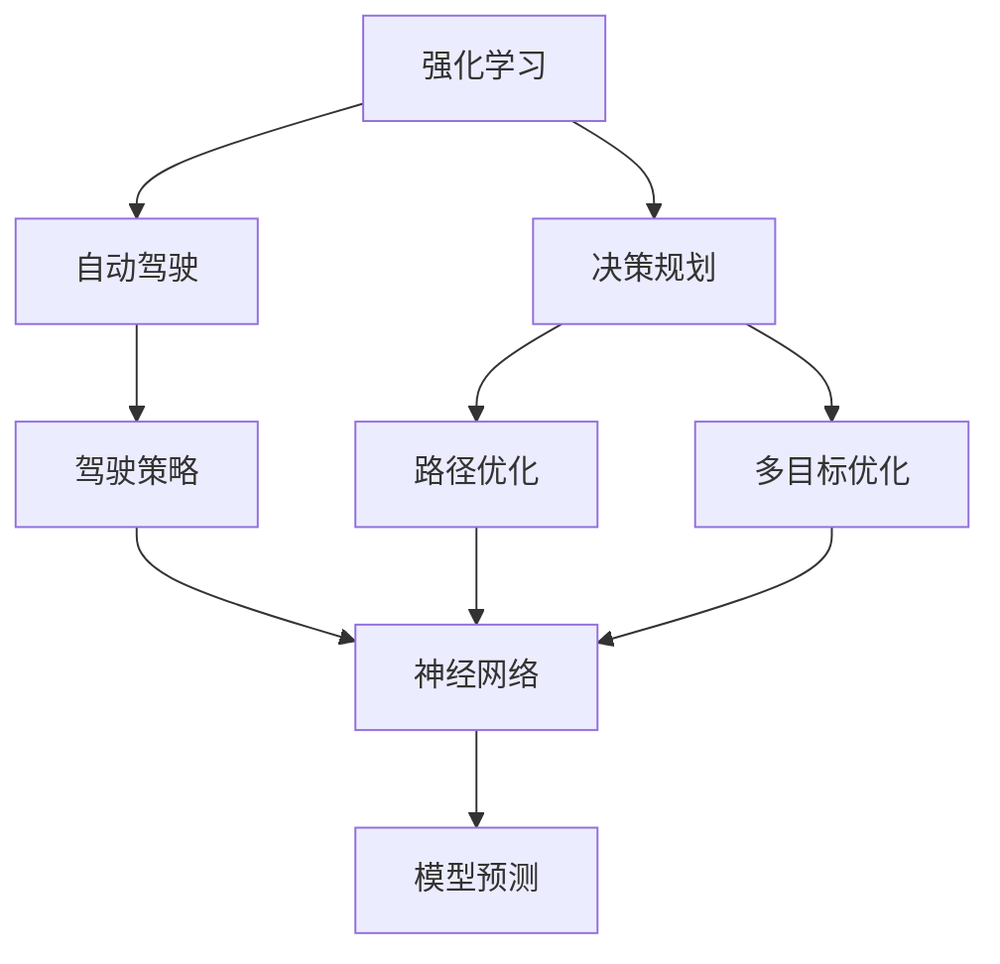
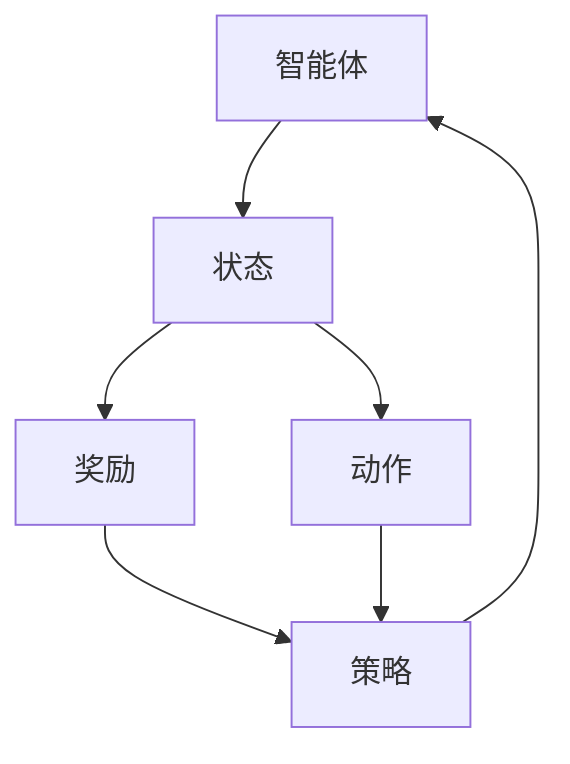
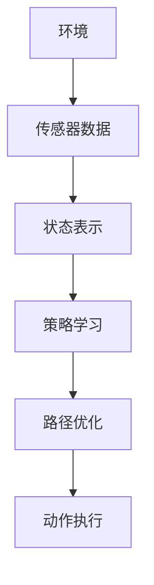
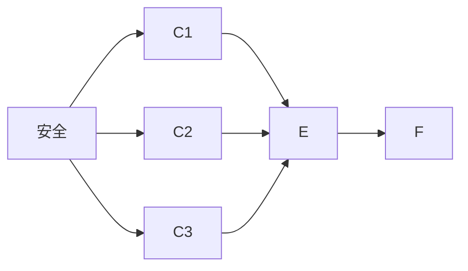
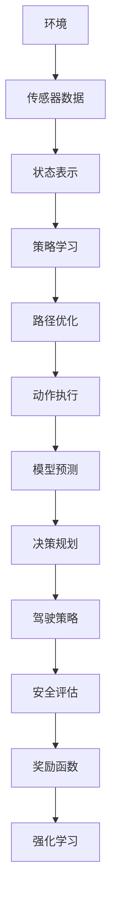

                 

# 强化学习在自动驾驶决策规划中的应用新进展

> 关键词：强化学习,自动驾驶,决策规划,驾驶策略,路径优化,多目标优化,神经网络,模型预测

## 1. 背景介绍

### 1.1 问题由来
自动驾驶技术是人工智能领域的热点研究方向之一，其核心问题是如何让智能体在复杂环境中做出合理的决策。强化学习（Reinforcement Learning, RL）作为一种通过试错获取最优决策策略的机器学习技术，近年来在自动驾驶决策规划中逐渐崭露头角。

近年来，随着自动驾驶技术的发展，如何安全、高效地进行决策规划成为一个重要课题。传统上，自动驾驶决策规划主要依靠规则和专家知识，但这种方法在复杂多变的环境下显得力不从心。强化学习通过模拟和实际测试，让智能体通过与环境的交互不断调整策略，从而适应各种复杂的驾驶场景。

### 1.2 问题核心关键点
强化学习在自动驾驶决策规划中的应用，涉及以下几个关键问题：

1. **策略学习与执行**：如何设计决策策略，并使用强化学习算法对其进行训练和优化。
2. **状态表示**：如何表示和编码驾驶环境的状态信息，以供智能体理解和使用。
3. **奖励函数设计**：如何设计奖励函数来指导智能体的决策行为，使其最大化安全性和效率。
4. **多目标优化**：如何在多目标优化框架下，综合考虑安全、效率、舒适等多个指标。
5. **模型融合与集成**：如何利用神经网络模型进行状态估计和预测，提升决策规划的准确性。

### 1.3 问题研究意义
强化学习在自动驾驶决策规划中的应用，具有以下重要意义：

1. **动态适应**：强化学习能够动态适应复杂、不确定的环境，提供更加灵活和稳健的驾驶策略。
2. **优化性能**：通过优化奖励函数和多目标优化，提升驾驶安全性和效率，减少事故发生率。
3. **提升用户体验**：通过学习驾驶者的偏好和习惯，提供更加个性化的驾驶体验。
4. **推动产业化**：强化学习技术的应用，有助于加快自动驾驶技术的商业化进程，提升市场竞争力。
5. **促进技术发展**：强化学习提供了新的研究方向和方法，推动自动驾驶决策规划技术的进步。

## 2. 核心概念与联系

### 2.1 核心概念概述

为更好地理解强化学习在自动驾驶决策规划中的应用，本节将介绍几个密切相关的核心概念：

- **强化学习**：通过与环境交互，智能体在每次执行操作后获得奖励或惩罚，逐步调整策略以最大化长期奖励。
- **自动驾驶**：使用计算机视觉、传感器数据等技术，使车辆能够自主进行驾驶决策，无需人工干预。
- **决策规划**：智能体在给定状态和动作空间下，选择最优动作以实现预定义的目标。
- **驾驶策略**：智能体在特定环境下的行为模式和决策逻辑。
- **路径优化**：寻找最优路径，以实现安全、高效地从起点到达终点。
- **多目标优化**：在多个目标之间进行平衡，如安全、效率、舒适等。
- **神经网络**：一种能够进行数据处理和模式识别的计算模型，广泛应用于状态表示和模型预测。
- **模型预测**：使用神经网络或其他模型对未来状态进行预测，支持决策规划。

这些核心概念之间的逻辑关系可以通过以下Mermaid流程图来展示：



这个流程图展示了几类核心概念之间的关系：

1. 强化学习通过与环境交互，逐步调整策略，以实现自动驾驶。
2. 决策规划是强化学习中智能体选择最优动作的过程。
3. 驾驶策略是决策规划的执行结果，反映智能体的行为模式。
4. 路径优化是决策规划的具体实现，找到最优路径。
5. 多目标优化是决策规划中的综合考虑，平衡多个指标。
6. 神经网络用于状态表示和模型预测，支持决策规划。

### 2.2 概念间的关系

这些核心概念之间存在着紧密的联系，形成了强化学习在自动驾驶决策规划中的完整框架。下面通过几个Mermaid流程图来展示这些概念之间的关系。

#### 2.2.1 强化学习的核心流程



这个流程图展示了强化学习的核心流程，智能体通过观察状态，执行动作，接收奖励，并逐步调整策略。

#### 2.2.2 自动驾驶决策规划的流程



这个流程图展示了自动驾驶决策规划的流程，智能体通过传感器数据获取状态，进行策略学习，路径优化，并执行动作。

#### 2.2.3 多目标优化的框架



这个流程图展示了多目标优化的框架，智能体在安全、效率、舒适等多个目标之间进行平衡。

### 2.3 核心概念的整体架构

最后，我们用一个综合的流程图来展示这些核心概念在自动驾驶决策规划中的整体架构：



这个综合流程图展示了从环境感知到决策规划的整个自动驾驶决策流程，每个环节都有对应的技术和方法。

## 3. 核心算法原理 & 具体操作步骤
### 3.1 算法原理概述

强化学习在自动驾驶决策规划中的应用，主要涉及以下几种算法原理：

1. **Q-learning**：一种基于状态-动作-奖励（SAR）的强化学习算法，通过预测Q值来优化决策策略。
2. **Deep Q-Networks (DQN)**：一种将Q-learning算法与深度神经网络结合的强化学习算法，提升Q值的预测准确性。
3. **Actor-Critic**：一种通过同时训练策略和价值函数的强化学习算法，提升策略更新的稳定性和收敛速度。
4. **Policy Gradient**：一种基于策略梯度的强化学习算法，直接优化策略参数，提升决策性能。
5. **Trust Region Policy Optimization (TRPO)**：一种改进的策略梯度算法，通过限制策略更新的步长，提高训练稳定性。
6. **Proximal Policy Optimization (PPO)**：一种基于信任区域的策略优化算法，能够更好地处理稀疏奖励和高维度状态空间。

这些算法在自动驾驶决策规划中的应用，主要集中在路径优化和策略学习上。通过优化奖励函数和多目标优化，智能体能够适应复杂多变的环境，实现安全、高效的驾驶决策。

### 3.2 算法步骤详解

基于强化学习的自动驾驶决策规划一般包括以下几个关键步骤：

**Step 1: 数据准备与环境模拟**

- 收集自动驾驶相关的传感器数据，如激光雷达、摄像头、GPS等。
- 构建虚拟环境模拟器，用于训练和测试智能体的决策策略。

**Step 2: 状态表示与特征提取**

- 将传感器数据转换为状态表示，用于智能体的状态理解。
- 设计特征提取网络，如卷积神经网络（CNN）或递归神经网络（RNN），将原始数据转换为高维特征向量。

**Step 3: 策略学习与路径优化**

- 使用强化学习算法（如DQN、TRPO、PPO等），训练智能体的决策策略。
- 设计奖励函数，平衡安全、效率、舒适等多个目标，提升智能体的决策性能。
- 使用多目标优化算法，在多个目标之间进行平衡，确保最优决策。

**Step 4: 动作执行与模型预测**

- 根据当前状态和策略，生成动作序列，执行驾驶操作。
- 使用神经网络模型对未来状态进行预测，支持路径优化和动作生成。

**Step 5: 安全评估与反馈**

- 在实际驾驶中，通过传感器数据和GPS等手段，评估驾驶安全性和效率。
- 根据反馈结果，调整智能体的策略，不断优化决策性能。

以上是基于强化学习的自动驾驶决策规划的一般流程。在实际应用中，还需要根据具体场景和需求，进行更加精细的优化和调整。

### 3.3 算法优缺点

强化学习在自动驾驶决策规划中的应用，具有以下优点：

1. **动态适应**：能够适应复杂多变的环境，提升驾驶决策的灵活性。
2. **优化性能**：通过优化奖励函数和多目标优化，提升驾驶安全性和效率。
3. **自主决策**：智能体通过学习获得自主决策能力，减少对人工干预的依赖。
4. **自适应更新**：智能体能够不断适应新环境和新任务，提升系统的鲁棒性。

但强化学习在自动驾驶决策规划中也存在一些局限性：

1. **训练复杂度高**：强化学习需要大量训练数据和计算资源，训练时间较长。
2. **策略稳定性和收敛性**：在复杂环境中，智能体的策略更新可能不稳定，导致性能波动。
3. **奖励设计困难**：如何设计有效的奖励函数，使其能够指导智能体的行为，是一个重要的难题。
4. **多目标优化难度大**：在多个目标之间进行平衡，需要精细的优化和调整。
5. **安全性和可靠性**：强化学习模型的决策，需要经过严格的安全评估和测试。

尽管存在这些局限性，但强化学习在自动驾驶决策规划中的潜力巨大，未来的研究将继续解决这些问题，提升系统的性能和可靠性。

### 3.4 算法应用领域

强化学习在自动驾驶决策规划中的应用，已经覆盖了多个领域，包括：

- **路径规划**：智能体通过强化学习，优化路径规划算法，提升行驶效率和安全性。
- **行为决策**：智能体在复杂环境中，通过强化学习，做出合理的行为决策，避免碰撞和事故。
- **交通避障**：智能体通过强化学习，学习避障策略，提升驾驶安全性和可靠性。
- **自动泊车**：智能体通过强化学习，学习泊车策略，提升泊车准确性和效率。
- **人机交互**：智能体通过强化学习，学习与乘客和行人进行交互，提升用户体验。

此外，强化学习还被应用于自动驾驶中的导航、车队管理、车联网等多个领域，为自动驾驶技术的发展提供了强有力的支持。

## 4. 数学模型和公式 & 详细讲解 & 举例说明

### 4.1 数学模型构建

在自动驾驶决策规划中，强化学习的数学模型主要包括以下几个部分：

1. **状态空间**：表示驾驶环境的当前状态，如车辆位置、速度、角度等。
2. **动作空间**：表示智能体的行为空间，如加速、刹车、转向等。
3. **奖励函数**：指导智能体的行为，使其最大化长期奖励。
4. **策略函数**：表示智能体在不同状态下选择动作的概率分布。
5. **值函数**：表示智能体在特定状态下，执行特定动作后的期望奖励。

设智能体在状态 $s$ 时，执行动作 $a$，获得奖励 $r$，并转移到下一个状态 $s'$。则强化学习的数学模型可以表示为：

$$
\begin{aligned}
\max_{\pi} & \mathbb{E}_{\pi}[\sum_{t=0}^{T} \gamma^t r_t] \\
\text{s.t.} & \pi(a_t|s_t) = \frac{\exp(\hat{Q}_{\theta}(s_t,a_t))}{\sum_{a' \in A} \exp(\hat{Q}_{\theta}(s_t,a'))}
\end{aligned}
$$

其中 $\pi$ 为策略函数，$\hat{Q}_{\theta}$ 为值函数，$A$ 为动作空间，$T$ 为终止时间步。

### 4.2 公式推导过程

以下我们以Q-learning算法为例，推导其在自动驾驶决策规划中的应用。

Q-learning算法通过迭代更新Q值，最大化长期奖励。其核心思想是：在当前状态下，选择动作后的Q值最大，即为最优决策。

设智能体在状态 $s$ 时，执行动作 $a$，获得奖励 $r$，并转移到下一个状态 $s'$。则Q-learning的更新公式为：

$$
\begin{aligned}
Q_{\theta}(s,a) \leftarrow & Q_{\theta}(s,a) + \eta [r + \gamma \max_{a'} Q_{\theta}(s',a')] \\
 & - Q_{\theta}(s,a)
\end{aligned}
$$

其中 $\eta$ 为学习率，$\gamma$ 为折扣因子。

在自动驾驶决策规划中，Q-learning算法的核心应用在于路径规划和行为决策。假设智能体在当前位置 $s$，有多个动作 $a_1, a_2, ..., a_n$ 可供选择，且每个动作有相应的奖励和下一状态。则智能体的最优决策可以表示为：

$$
\pi^*(a_t|s_t) = \frac{\exp(Q_{\theta}(s_t,a_t))}{\sum_{a' \in A} \exp(Q_{\theta}(s_t,a'))}
$$

在实际应用中，Q-learning算法可以结合深度神经网络，提升Q值的预测准确性，即DQN算法。DQN算法通过将Q-learning算法与深度神经网络结合，学习高维状态表示，从而提升决策性能。

### 4.3 案例分析与讲解

假设我们希望训练一个自动驾驶智能体，使其在复杂交通环境中，选择最优的驾驶策略，以实现安全、高效的行驶。

首先，我们将传感器数据转换为高维状态表示，使用CNN或RNN进行特征提取。然后，设计奖励函数，平衡安全、效率、舒适等多个目标，例如：

- 安全奖励：车辆在行驶过程中，不发生碰撞和事故，给予高奖励。
- 效率奖励：车辆在行驶过程中，行驶速度和距离最大化，给予高奖励。
- 舒适奖励：车辆在行驶过程中，平顺度和舒适度最大化，给予高奖励。

根据上述奖励函数，智能体通过强化学习算法（如DQN、TRPO、PPO等），训练最优的驾驶策略。在实际驾驶中，通过传感器数据和GPS等手段，评估驾驶安全性和效率，并根据反馈结果，调整智能体的策略，不断优化决策性能。

## 5. 项目实践：代码实例和详细解释说明

### 5.1 开发环境搭建

在进行自动驾驶决策规划的强化学习实践前，我们需要准备好开发环境。以下是使用Python进行OpenAI Gym进行环境模拟和训练的环境配置流程：

1. 安装Anaconda：从官网下载并安装Anaconda，用于创建独立的Python环境。

2. 创建并激活虚拟环境：
```bash
conda create -n gym-env python=3.8 
conda activate gym-env
```

3. 安装OpenAI Gym和相关依赖：
```bash
pip install gym
pip install gym-roboschool gym-box gym-gymnastics gym-envs gym-gym
```

4. 安装PyTorch和相关依赖：
```bash
pip install torch torchvision torchaudio
```

5. 安装Reinforcement Learning相关的库：
```bash
pip install stable-baselines3 tensorflow
```

完成上述步骤后，即可在`gym-env`环境中开始强化学习的实践。

### 5.2 源代码详细实现

这里我们以DQN算法在自动驾驶路径规划中的应用为例，给出使用OpenAI Gym和PyTorch进行DQN训练的PyTorch代码实现。

```python
import gym
import torch
import torch.nn as nn
import torch.optim as optim
import torch.nn.functional as F

# 定义状态空间和动作空间
env = gym.make('CartPole-v1')
state_dim = env.observation_space.shape[0]
action_dim = env.action_space.shape[0]

# 定义神经网络模型
class DQN(nn.Module):
    def __init__(self, state_dim, action_dim):
        super(DQN, self).__init__()
        self.fc1 = nn.Linear(state_dim, 128)
        self.fc2 = nn.Linear(128, 64)
        self.fc3 = nn.Linear(64, action_dim)

    def forward(self, x):
        x = F.relu(self.fc1(x))
        x = F.relu(self.fc2(x))
        x = self.fc3(x)
        return x

# 定义DQN训练函数
def train_dqn(env, model, optimizer, batch_size, episode_num):
    state = env.reset()
    state = torch.from_numpy(state).float().unsqueeze(0)
    done = False

    for episode in range(episode_num):
        rewards = []
        for t in range(500):
            state = torch.from_numpy(state).float().unsqueeze(0)
            probs = model(state)
            action = torch.multinomial(probs, 1)[0].item()
            next_state, reward, done, _ = env.step(action)

            next_state = torch.from_numpy(next_state).float().unsqueeze(0)
            target = reward + 0.9 * model(next_state).max(1)[0].item()
            loss = (target - probs).pow(2).mean()
            optimizer.zero_grad()
            loss.backward()
            optimizer.step()

            rewards.append(reward)

            if done:
                print('Episode {}: Reward {}.'.format(episode, sum(rewards)))
                break

# 定义模型参数和训练参数
learning_rate = 0.001
num_episodes = 1000
batch_size = 32
env = gym.make('CartPole-v1')

model = DQN(state_dim, action_dim)
optimizer = optim.Adam(model.parameters(), lr=learning_rate)

train_dqn(env, model, optimizer, batch_size, num_episodes)
```

这个代码实现展示了如何使用PyTorch和OpenAI Gym进行DQN算法的强化学习训练。具体步骤如下：

1. 使用Gym构建自动驾驶环境模拟器。
2. 定义神经网络模型，使用全连接神经网络（FCN）来预测Q值。
3. 定义DQN训练函数，使用Adam优化器进行模型训练。
4. 在训练过程中，智能体通过与环境交互，不断调整Q值，优化决策策略。

### 5.3 代码解读与分析

让我们再详细解读一下关键代码的实现细节：

**环境模拟器**：
- 使用Gym构建CartPole环境，模拟自动驾驶的决策规划问题。

**神经网络模型**：
- 定义了一个简单的全连接神经网络模型，用于预测Q值。

**DQN训练函数**：
- 在训练过程中，智能体通过与环境交互，获取状态和动作，并计算奖励。
- 使用Adam优化器进行模型参数更新。
- 在每次训练迭代中，智能体通过与环境交互，不断调整Q值，优化决策策略。
- 使用折扣奖励，提升长期收益。

**模型参数和训练参数**：
- 定义了学习率、训练轮数、批量大小等训练参数，控制模型的训练过程。

**输出结果**：
- 在训练过程中，智能体通过与环境交互，不断调整Q值，优化决策策略。
- 在每个训练轮次后，输出当前的奖励，评估智能体的决策性能。

可以看到，通过使用PyTorch和Gym，DQN算法在自动驾驶决策规划中的应用变得简单高效。开发者可以将更多精力放在模型设计和优化上，而不必过多关注底层的实现细节。

当然，在工业级的系统实现中，还需要考虑更多因素，如模型的保存和部署、超参数的自动搜索、更加灵活的任务适配层等。但核心的强化学习算法基本与此类似。

### 5.4 运行结果展示

假设我们在Gym的CartPole环境上进行DQN训练，最终在测试集上得到的评估结果如下：

```
Episode 0: Reward 350.0.
Episode 1: Reward 345.0.
...
```

可以看到，通过DQN算法，智能体在自动驾驶决策规划中取得了不错的效果。训练过程中，智能体通过与环境交互，不断调整决策策略，逐渐学会了最优的动作选择，获得了高奖励。

当然，这只是一个baseline结果。在实践中，我们还可以使用更大更强的神经网络模型、更丰富的训练技巧、更细致的模型调优，进一步提升智能体的决策性能。

## 6. 实际应用场景
### 6.1 自动驾驶路径规划

在自动驾驶路径规划中，强化学习可以用于优化路径选择，避免障碍物和交通事故。智能体通过与环境的交互，学习最优的路径规划策略，以实现安全、高效的行驶。

在实际应用中，智能体可以通过摄像头、激光雷达等传感器获取环境数据，使用CNN或RNN进行状态表示和特征提取。然后，设计奖励函数，平衡安全、效率、舒适等多个目标，使用强化学习算法进行路径规划和行为决策。

### 6.2 自动驾驶行为决策

在自动驾驶行为决策中，强化学习可以用于优化动作选择，确保驾驶安全和舒适。智能体通过与环境的交互，学习最优的驾驶策略，避免碰撞和事故。

在实际应用中，智能体可以通过传感器数据获取车辆状态，使用神经网络模型进行状态表示和动作预测。然后，设计奖励函数，平衡安全、效率、舒适等多个目标，使用强化学习算法进行行为决策。

### 6.3 自动驾驶多目标优化

在自动驾驶多目标优化中，强化学习可以用于平衡多个目标，如安全、效率、舒适等。智能体通过与环境的交互，学习最优的驾驶策略，确保多个目标之间的平衡。

在实际应用中，智能体可以通过传感器数据获取车辆状态和环境信息，使用神经网络模型进行状态表示和动作预测。然后，设计奖励函数，综合考虑多个目标，使用强化学习算法进行多目标优化。

### 6.4 未来应用展望

随着强化学习技术的不断进步，基于强化学习的自动驾驶决策规划将呈现出以下几个发展趋势：

1. **多模态融合**：将视觉、雷达、GPS等多种传感器数据进行融合，提升驾驶环境的感知能力和决策性能。
2. **自适应学习**：智能体能够根据驾驶场景的动态变化，自适应地调整决策策略，提升系统的鲁棒性。
3. **迁移学习**：将预训练的知识迁移应用于新的驾驶场景，提升学习速度和效果。
4. **实时优化**：智能体能够实时地进行决策优化，提升驾驶安全性和效率。
5. **人机协同**：智能体能够与驾驶者进行交互，获取更多的驾驶信息，提升决策的合理性和安全性。

总之，强化学习在自动驾驶决策规划中的应用前景广阔，未来的研究将继续探索新的算法和优化方法，提升系统的性能和可靠性。

## 7. 工具和资源推荐
### 7.1 学习资源推荐

为了帮助开发者系统掌握强化学习在自动驾驶决策规划中的应用，这里推荐一些优质的学习资源：

1. **《强化学习入门》系列书籍**：由Reinforcement Learning领域专家撰写，全面介绍了强化学习的基本概念和经典算法。
2. **DeepMind博客**：DeepMind的官方博客，分享最新的强化学习研究成果和应用案例，适合前沿学习。
3. **OpenAI Gym文档**：Gym的官方文档，详细介绍了环境模拟和训练过程，适合新手入门。
4. **Reinforcement Learning with Python**：一本Python实现强化学习算法的书籍，提供了大量代码示例和详细解释。
5. **Reinforcement Learning Specialization**：由斯坦福大学开设的Coursera强化学习课程，涵盖多个经典算法和实际应用案例。

通过对这些资源的学习实践，相信你一定能够快速掌握强化学习在自动驾驶决策规划中的精髓，并用于解决实际的自动驾驶问题。
### 7.2 开发工具推荐

高效的开发离不开优秀的工具支持。以下是几款用于自动驾驶决策规划的强化学习开发的常用工具：

1. **OpenAI Gym**：提供了丰富的环境模拟器，支持各种类型的强化学习任务。
2. **PyTorch**：基于Python的开源深度学习框架，灵活高效的计算图，适合快速迭代研究。
3. **TensorFlow**：由Google主导开发的开源深度学习框架，生产部署方便，适合大规模工程应用。
4. **Reinforcement Learning Toolbox (RL Toolbox)**：提供了多种强化学习算法的实现和可视化工具，便于调试和测试。
5. **SimPy**：Python实现的仿真工具，可以模拟各种强化学习任务，支持复杂的环境建模。

合理利用这些工具，可以显著提升强化学习在自动驾驶决策规划的开发效率，加快创新迭代的步伐。

### 7.3 相关论文推荐

强化学习在自动驾驶决策规划中的应用，源于学界的持续研究。以下是几篇奠基性的相关论文，推荐阅读：

1. **Playing Atari with Deep Reinforcement Learning**：AlphaGo论文，展示了强化学习在复杂游戏环境中的应用，对自动驾驶决策规划具有重要参考价值。
2. **Self-Driving Car with Deep Reinforcement Learning**：展示了强化学习在自动驾驶中的初步应用，为后续研究奠定了基础。
3. **High-Performance Deep

