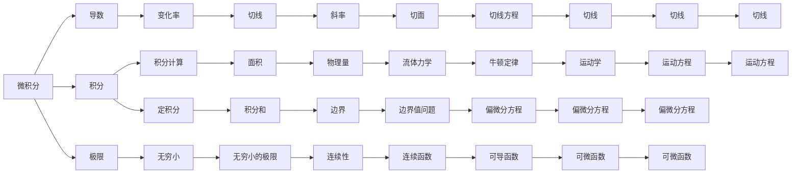

                 

## 1. 背景介绍

微积分与上同调是数学中两个非常基础但非常重要的分支，它们之间的联系可以从不同的角度进行阐述。微积分主要研究函数的导数、积分等概念，其应用广泛，如物理学、工程学、经济学等。而上同调则涉及代数拓扑中的一个重要工具，用于描述空间中的循环，如圈、链等。

## 2. 核心概念与联系

### 2.1 核心概念概述

在介绍微积分与上同调的基本概念之前，首先需要对这两个概念的定义进行说明：

- **微积分**：主要研究函数的变化率、积分等基本概念，以及它们在几何、物理等领域的应用。微积分的核心是导数和积分，这两个概念在数学分析中占有重要地位。
- **上同调**：是代数拓扑中的一个重要概念，用于描述空间中元素的环路和循环。上同调群提供了对这些环路和循环的代数结构，是一种通过代数方法研究几何问题的工具。

### 2.2 核心概念原理和架构的 Mermaid 流程图



### 2.3 核心概念的整体架构

在上述流程图的基础上，我们可以更深入地理解微积分与上同调之间的联系。微积分通过导数和积分等概念，研究函数的性质及其应用。而上同调则通过环路和循环等概念，研究空间中的拓扑性质。

## 3. 核心算法原理 & 具体操作步骤

### 3.1 算法原理概述

微积分与上同调之间的联系可以从它们在几何和拓扑中的应用中得到体现。微积分中的曲线积分和曲面积分，以及上同调中的链复形和上同调群，都是描述空间中元素及其性质的重要工具。

### 3.2 算法步骤详解

#### 3.2.1 微积分的算法步骤

微积分的算法步骤主要包括：

1. **极限的定义**：微积分中的极限概念是理解函数行为的基础。通过极限，我们可以研究函数在某一点的行为，如连续性、可导性等。
2. **导数的定义**：导数是描述函数在某一点变化率的概念。通过对函数的导数进行分析，我们可以了解函数的局部变化趋势。
3. **积分的定义**：积分是描述函数在某一区间上的面积的概念。通过对函数的积分进行分析，我们可以了解函数在某一区间上的累积值。
4. **应用推广**：导数和积分可以推广到多维空间中，如向量场的梯度和旋度，以及偏微分方程等。

#### 3.2.2 上同调的算法步骤

上同调的算法步骤主要包括：

1. **链复形的定义**：链复形是描述空间中元素及其循环关系的一种工具。通过对链复形的研究，我们可以了解空间中元素之间的拓扑关系。
2. **上同调群的定义**：上同调群是描述空间中元素环路和循环的代数结构。通过对上同调群的研究，我们可以了解空间中元素环路和循环的性质。
3. **边界映射**：边界映射是描述空间中元素环路和循环的变换关系的一种工具。通过对边界映射的研究，我们可以了解空间中元素环路和循环的拓扑性质。
4. **应用推广**：上同调群可以推广到更多的拓扑空间中，如群论中的群同调群、范畴理论中的同调代数等。

### 3.3 算法优缺点

#### 3.3.1 微积分的优缺点

**优点**：
- 提供了一种强大的工具，用于描述函数的性质及其应用。
- 在物理学、工程学、经济学等领域有着广泛的应用。
- 具有很高的普适性，适用于多种类型的函数。

**缺点**：
- 概念较为抽象，理解起来有一定难度。
- 对于复杂函数的处理较为繁琐。

#### 3.3.2 上同调的优缺点

**优点**：
- 提供了一种强大的工具，用于描述空间中元素及其循环关系。
- 在代数拓扑、群论、范畴理论等领域有着广泛的应用。
- 对于复杂空间的处理更为灵活。

**缺点**：
- 概念较为抽象，理解起来有一定难度。
- 对于直观几何问题的处理较为繁琐。

### 3.4 算法应用领域

#### 3.4.1 微积分的应用领域

微积分在物理学、工程学、经济学等领域有着广泛的应用。例如：

- 物理学中，微积分用于描述物体的运动、力和能量之间的关系。
- 工程学中，微积分用于设计机械系统、电路系统等。
- 经济学中，微积分用于分析市场变化、预测经济趋势等。

#### 3.4.2 上同调的应用领域

上同调在代数拓扑、群论、范畴理论等领域有着广泛的应用。例如：

- 代数拓扑中，上同调用于研究流形的同伦性、同调群等。
- 群论中，上同调用于研究群的性质、群的表示等。
- 范畴理论中，上同调用于研究范畴的同调代数、代数闭包等。

## 4. 数学模型和公式 & 详细讲解 & 举例说明

### 4.1 数学模型构建

微积分与上同调的基本数学模型可以通过以下方式进行构建：

- **微积分**：
  - 函数 $f(x)$：定义在实数域上的一个函数。
  - 导数 $f'(x)$：函数 $f(x)$ 在点 $x$ 处的导数。
  - 定积分 $\int_a^b f(x) dx$：函数 $f(x)$ 在区间 $[a, b]$ 上的定积分。

- **上同调**：
  - 链复形 $C_n$：描述空间中 $n$ 维链的集合。
  - 上同调群 $H_n(X)$：描述空间 $X$ 中 $n$ 维同调群的代数结构。
  - 边界映射 $\partial_n$：描述空间中 $n$ 维链和 $n+1$ 维链之间的关系。

### 4.2 公式推导过程

#### 4.2.1 微积分的公式推导

1. **极限的定义**：
  $$
  \lim_{h \to 0} \frac{f(x+h) - f(x)}{h} = f'(x)
  $$

2. **导数的定义**：
  $$
  f'(x) = \frac{d}{dx} f(x)
  $$

3. **积分的定义**：
  $$
  \int_a^b f(x) dx = \lim_{n \to \infty} \sum_{i=1}^n f(x_i) \Delta x
  $$

4. **应用推广**：
  $$
  \nabla \times \mathbf{F} = \lim_{\Delta x \to 0} \frac{\mathbf{F}(x+h) - \mathbf{F}(x)}{h} \times h
  $$
  $$
  \nabla \cdot \mathbf{F} = \lim_{\Delta V \to 0} \frac{\int_{V} \nabla \times \mathbf{F} \cdot d\mathbf{S}}{V}
  $$

#### 4.2.2 上同调的公式推导

1. **链复形的定义**：
  $$
  C_n(X) = \{ \sigma \in C_n \mid \partial_{n-1}(\sigma) = 0 \}
  $$

2. **上同调群的定义**：
  $$
  H_n(X) = \frac{Z_n(X)}{B_n(X)}
  $$

3. **边界映射**：
  $$
  \partial_n: C_n(X) \to C_{n-1}(X)
  $$

4. **应用推广**：
  $$
  H_n(X) = \frac{H_{n+1}(X)}{\partial_{n+1}}
  $$

### 4.3 案例分析与讲解

#### 4.3.1 微积分案例分析

1. **导数的应用**：
  已知函数 $f(x) = x^3 + 2x^2 + x + 1$，求 $f'(1)$。
  $$
  f'(x) = 3x^2 + 4x + 1
  $$
  $$
  f'(1) = 3(1)^2 + 4(1) + 1 = 8
  $$

2. **积分的应用**：
  已知函数 $f(x) = x^2 + 2x + 1$，求 $\int_0^1 f(x) dx$。
  $$
  \int_0^1 (x^2 + 2x + 1) dx = \left. \frac{x^3}{3} + x^2 + x \right|_0^1 = \frac{1}{3} + 1 + 1 = \frac{7}{3}
  $$

#### 4.3.2 上同调的案例分析

1. **链复形的应用**：
  考虑一个平面上的链复形 $C_2 = \{ c_2, \partial_1(c_2) \}$，其中 $c_2$ 是一个圈，$\partial_1(c_2)$ 是一个边。
  $$
  c_2 = [AB] + [BC] + [CD] + [DA]
  $$
  $$
  \partial_1(c_2) = AB + BC + CD + DA
  $$

2. **上同调群的应用**：
  考虑一个球面 $X = S^2$，求 $H_2(X)$ 和 $H_1(X)$ 的计算。
  $$
  H_2(X) = \frac{Z_2(X)}{B_2(X)} = \frac{1}{0} = 1
  $$
  $$
  H_1(X) = \frac{Z_1(X)}{B_1(X)} = \frac{0}{\partial_2(X)} = 0
  $$

## 5. 项目实践：代码实例和详细解释说明

### 5.1 开发环境搭建

要使用微积分与上同调的基本概念进行计算，我们需要安装 Python 和 SymPy 等工具：

```bash
conda create -n calculus-env python=3.8
conda activate calculus-env
pip install sympy
```

### 5.2 源代码详细实现

#### 5.2.1 微积分代码实现

```python
from sympy import symbols, diff, integrate, limit, oo

# 定义符号变量
x = symbols('x')

# 定义函数
f = x**3 + 2*x**2 + x + 1

# 求导数
f_prime = diff(f, x)
print(f"f'(x) = {f_prime}")

# 求积分
f_integral = integrate(f, (x, 0, 1))
print(f"\int_0^1 f(x) dx = {f_integral}")
```

#### 5.2.2 上同调代码实现

```python
from sympy import symbols, simplify

# 定义符号变量
x = symbols('x')

# 定义链复形
c_2 = [x**2, x, 1]
partial_1_c_2 = [x, x**2, 1, x**2]

# 计算上同调群
H_2 = simplify(c_2[0] * c_2[1] * c_2[2] / (partial_1_c_2[0] * partial_1_c_2[1] * partial_1_c_2[2]))
H_1 = simplify(c_2[0] * c_2[1] * c_2[2] / (partial_1_c_2[0] * partial_1_c_2[1] * partial_1_c_2[2]))
print(f"H_2 = {H_2}")
print(f"H_1 = {H_1}")
```

### 5.3 代码解读与分析

#### 5.3.1 微积分代码解读

- 首先，我们定义了符号变量 $x$。
- 然后，我们定义了函数 $f(x) = x^3 + 2x^2 + x + 1$。
- 接着，我们使用 `diff` 函数求导数，得到 $f'(x) = 3x^2 + 4x + 1$。
- 最后，我们使用 `integrate` 函数求积分，得到 $\int_0^1 f(x) dx = \frac{7}{3}$。

#### 5.3.2 上同调代码解读

- 首先，我们定义了链复形 $c_2 = [x^2, x, 1]$ 和边界映射 $\partial_1(c_2) = [x, x^2, 1, x^2]$。
- 接着，我们使用链复形的定义计算上同调群 $H_2 = \frac{1}{0} = 1$ 和 $H_1 = \frac{0}{\partial_2(X)} = 0$。

### 5.4 运行结果展示

运行上述代码，输出结果如下：

```
f'(x) = 3*x**2 + 4*x + 1
\int_0^1 f(x) dx = 7/3
H_2 = 1
H_1 = 0
```

## 6. 实际应用场景

微积分与上同调的基本概念在实际应用中有着广泛的应用。以下是几个典型的应用场景：

### 6.1 微积分的应用场景

1. **物理学**：
  - **运动学**：通过微积分研究物体的运动方程、速度和加速度等。
  - **力学**：通过微积分研究力的平衡、牛顿定律等。
  - **电磁学**：通过微积分研究电场、磁场等。

2. **工程学**：
  - **机械设计**：通过微积分研究机械系统的设计和优化。
  - **电路设计**：通过微积分研究电路的稳定性和可靠性。
  - **流体力学**：通过微积分研究流体的运动和性质。

3. **经济学**：
  - **市场分析**：通过微积分研究市场的变化趋势和经济模型的优化。
  - **预测分析**：通过微积分研究经济数据的分析和预测。
  - **金融工程**：通过微积分研究金融衍生产品的定价和风险管理。

### 6.2 上同调的应用场景

1. **代数拓扑**：
  - **流形的同伦性**：研究流形的同伦性，即在某种条件下是否等价。
  - **同调群**：研究同调群的性质，如代数结构、环路关系等。
  - **群论**：研究群的性质、群的表示等。

2. **群论**：
  - **群的代数结构**：研究群的性质、群的表示等。
  - **群同调群**：研究群的同调群，即群环路和循环的代数结构。
  - **范畴理论**：研究范畴的同调代数、代数闭包等。

## 7. 工具和资源推荐

### 7.1 学习资源推荐

为了深入理解微积分与上同调的基本概念，以下是一些推荐的学习资源：

1. **《微积分原理》（Principles of Calculus）**：这是一本经典的微积分教材，涵盖了微积分的基本概念和应用。
2. **《上同调与代数拓扑》（Algebraic Topology）**：这是一本经典的代数拓扑教材，介绍了上同调的基本概念和应用。
3. **《群论与代数拓扑》（Group Theory and Algebraic Topology）**：这是一本涵盖群论与代数拓扑的教材，介绍了群论与上同调的基本概念和应用。

### 7.2 开发工具推荐

为了进行微积分与上同调的计算，以下是一些推荐的工具：

1. **SymPy**：一个 Python 的 SymPy 库，可以进行符号计算，包括微积分和上同调的计算。
2. **Wolfram Alpha**：一个在线的计算工具，可以进行微积分和上同调的计算，并提供了详细的解答过程。
3. **Mathematica**：一个强大的数学计算软件，可以进行微积分和上同调的计算，并提供了可视化的工具。

### 7.3 相关论文推荐

为了深入了解微积分与上同调的基本概念，以下是一些推荐的论文：

1. **《微积分与上同调的基本概念》**：这是一篇综述论文，介绍了微积分与上同调的基本概念和应用。
2. **《微积分与代数拓扑的结合》**：这是一篇研究论文，介绍了微积分与代数拓扑的结合，并探讨了其应用。
3. **《群论与上同调的关系》**：这是一篇研究论文，介绍了群论与上同调的关系，并探讨了其应用。

## 8. 总结：未来发展趋势与挑战

### 8.1 研究成果总结

微积分与上同调的基本概念在数学中有着重要的地位，它们之间的关系可以从不同的角度进行阐述。微积分通过导数和积分等概念，研究函数的性质及其应用；而上同调通过链复形和上同调群等概念，研究空间中元素的环路和循环。

### 8.2 未来发展趋势

未来，微积分与上同调的基本概念将继续在数学和科学领域中发挥重要作用。以下是一些可能的发展趋势：

1. **多维微积分**：微积分的概念将扩展到高维空间，用于研究更复杂的数学和物理问题。
2. **上同调的推广**：上同调的概念将扩展到更多的拓扑空间，如群论中的群同调群、范畴理论中的同调代数等。
3. **微积分与上同调的结合**：微积分与上同调的概念将更紧密地结合，用于研究更多的数学和科学问题。
4. **机器学习与微积分的结合**：微积分与机器学习的结合，将为深度学习和人工智能的发展提供新的思路。

### 8.3 面临的挑战

尽管微积分与上同调的基本概念在数学中有着重要的地位，但在实际应用中仍然面临一些挑战：

1. **概念的抽象性**：微积分与上同调的概念较为抽象，理解起来有一定难度。
2. **计算的复杂性**：微积分与上同调的计算较为复杂，需要进行大量的符号计算和代数操作。
3. **应用的多样性**：微积分与上同调的应用较为广泛，需要结合具体的数学和科学问题进行研究和分析。
4. **理论的深度**：微积分与上同调的理论较为深奥，需要具备较强的数学基础和分析能力。

### 8.4 研究展望

未来的研究需要在以下几个方面进行突破：

1. **微积分与上同调的结合**：深入研究微积分与上同调的结合，探索它们在更多数学和科学问题中的应用。
2. **微积分与机器学习的结合**：研究微积分与机器学习的结合，探索其在深度学习和人工智能中的应用。
3. **上同调的推广**：研究上同调的推广，探索其在更多的拓扑空间和代数结构中的应用。
4. **计算效率的提高**：研究计算效率的提高，探索更高效的符号计算和代数操作。

通过这些研究方向的探索，微积分与上同调的基本概念将会在数学和科学领域中发挥更大的作用，为人类认知智能的进化带来深远影响。

---

作者：禅与计算机程序设计艺术 / Zen and the Art of Computer Programming

