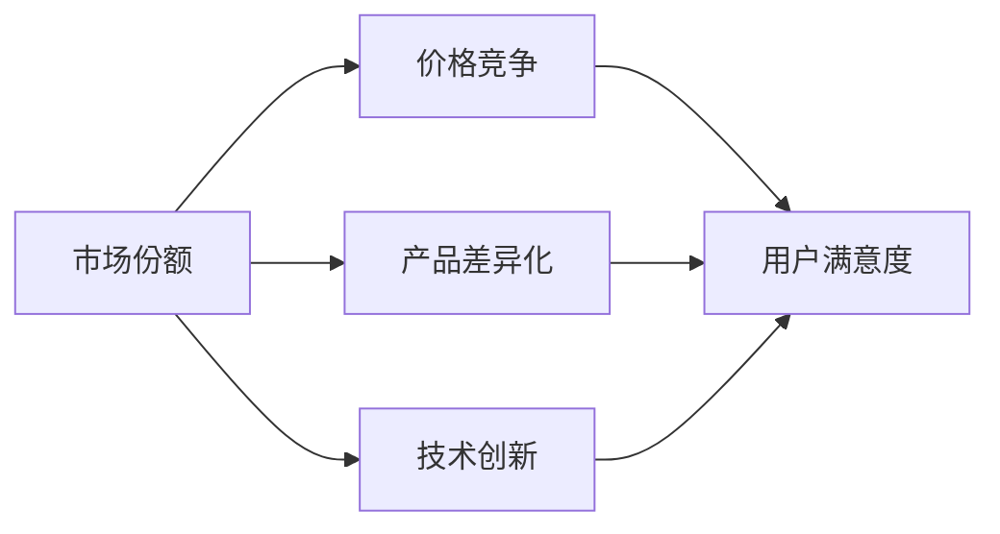
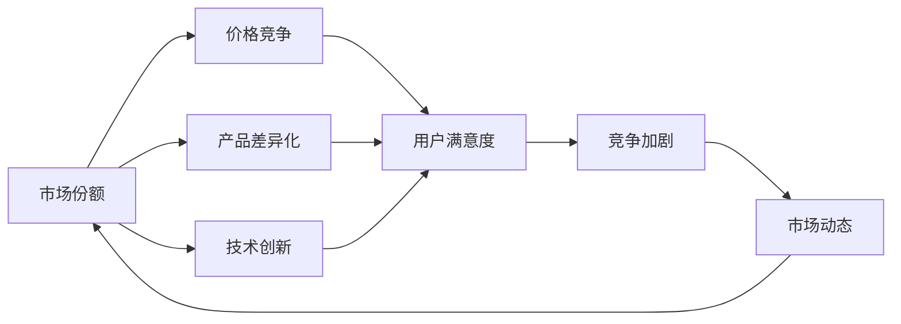

                 

## 1. 背景介绍

### 1.1 问题由来

在当今数字化时代，随着技术的进步和互联网的普及，市场竞争愈发激烈。尤其是在互联网和科技领域，企业之间为了争夺用户和市场份额，不断创新和竞争。例如，互联网公司的广告竞争、电子商务平台的商品价格战、软件公司的功能迭代竞赛等，这些都体现了微观经济主体间的竞争加剧。然而，这些竞争并非仅限于企业和公司之间的直接对抗，还包括了个人之间的竞争，比如平台的竞争、市场的竞争、价格的竞争等。

### 1.2 问题核心关键点

微观经济主体间的竞争加剧，主要体现在以下几个方面：

- **市场份额争夺**：企业通过不断提升产品质量、降低价格等方式来争夺市场份额。
- **技术创新与迭代**：企业不断投入研发资金，推出新的产品和技术，以保持竞争优势。
- **用户争夺**：通过优化用户体验、提供更好的服务等方式，争夺用户群体。
- **价格竞争**：企业通过打折、优惠券等方式进行价格战，以吸引更多消费者。
- **平台竞争**：电子商务、社交媒体等平台之间的竞争，通过各种手段抢占市场。

这些竞争不仅影响了企业的运营和发展，也对消费者选择和行为产生了深远影响。

### 1.3 问题研究意义

研究微观经济主体间的竞争加剧，对于企业制定战略、优化决策、提升竞争力具有重要意义：

1. **战略制定**：了解竞争态势，制定合理的市场策略。
2. **决策优化**：通过竞争分析，优化产品、价格和服务等决策。
3. **提升竞争力**：通过分析竞争对手的动态，发现自身优势和不足。
4. **用户选择**：了解市场和消费者的需求变化，提升用户满意度。

在宏观层面，研究微观经济主体间的竞争加剧，可以帮助政策制定者了解市场动态，制定更加科学的经济政策，促进市场健康发展。

## 2. 核心概念与联系

### 2.1 核心概念概述

为了更好地理解微观经济主体间的竞争加剧，本节将介绍几个关键概念及其相互关系：

- **市场份额**：指企业在特定市场中所占的销售比例。市场份额反映了企业的市场地位和竞争力。
- **价格竞争**：企业通过降低价格或提供优惠券等手段，吸引消费者购买其产品或服务。
- **产品差异化**：指企业通过产品设计、功能、质量等方面的创新，形成产品差异化优势。
- **技术创新**：指企业在新产品、新技术、新工艺等方面的研发投入。
- **用户满意度**：指用户对产品或服务的整体满意程度，反映了企业与用户之间的互动关系。

这些概念之间的联系可以通过以下Mermaid流程图来展示：



### 2.2 概念间的关系

这些核心概念之间存在着紧密的联系，形成了微观经济主体间竞争加剧的完整生态系统。下面我们通过几个Mermaid流程图来展示这些概念之间的关系。

#### 2.2.1 市场份额与价格竞争的关系


这个流程图展示了市场份额与价格竞争之间的相互影响。市场份额高的企业通常有更多的议价能力，可以通过降价吸引更多消费者；而市场份额低的企业则可能通过价格竞争来争夺市场份额。

#### 2.2.2 产品差异化与技术创新的关系


这个流程图展示了产品差异化与技术创新之间的相互作用。技术创新推动产品差异化，而产品差异化又需要持续的技术创新来保持竞争优势。

#### 2.2.3 用户满意度与市场份额的关系


这个流程图展示了用户满意度与市场份额之间的联系。用户满意度高的企业通常拥有更高的市场份额，而市场份额高的企业则需要持续提升用户满意度以保持市场领先。

### 2.3 核心概念的整体架构

最后，我们用一个综合的流程图来展示这些核心概念在大模型微调过程中的整体架构：



这个综合流程图展示了市场份额、价格竞争、产品差异化、技术创新、用户满意度之间的相互关系，以及这些因素如何共同作用于市场动态，最终导致微观经济主体间的竞争加剧。

## 3. 核心算法原理 & 具体操作步骤
### 3.1 算法原理概述

微观经济主体间的竞争加剧分析，本质上是利用数据科学和统计学方法，对市场行为和竞争动态进行建模和分析的过程。其核心思想是利用历史数据和市场动态，预测未来市场变化和竞争趋势。

形式化地，设企业i的市场份额为$S_i$，价格为$P_i$，产品差异化程度为$D_i$，技术创新能力为$T_i$，用户满意度为$U_i$。则企业i的综合竞争力$C_i$可以表示为：

$$
C_i = \alpha_S S_i + \alpha_P P_i + \alpha_D D_i + \alpha_T T_i + \alpha_U U_i
$$

其中，$\alpha$为各因素的权重系数，通常通过实际数据分析和经验值设定。

通过最大化综合竞争力$C_i$，企业可以制定最优的竞争策略，提升市场地位和用户满意度。

### 3.2 算法步骤详解

微观经济主体间的竞争加剧分析，一般包括以下几个关键步骤：

**Step 1: 数据收集和预处理**

- 收集企业的历史销售数据、市场份额、价格、产品差异化程度、技术创新数据、用户满意度调查数据等。
- 对数据进行清洗、归一化、缺失值处理等预处理，确保数据质量和一致性。

**Step 2: 建立竞争模型**

- 选择合适的建模方法，如线性回归、逻辑回归、时间序列分析等，构建企业竞争动态模型。
- 利用历史数据进行模型训练，求解各因素的权重系数$\alpha$。
- 使用训练好的模型进行预测，评估企业的市场份额变化和竞争动态。

**Step 3: 竞争策略制定**

- 根据竞争模型预测结果，制定企业的竞争策略。例如，通过降价吸引更多消费者，提升产品差异化程度和技术创新能力等。
- 对竞争策略进行优化，确保策略的有效性和可持续性。

**Step 4: 持续监控与调整**

- 对市场动态进行持续监控，及时调整竞争策略以适应市场变化。
- 利用实时数据进行模型更新和重新训练，确保预测的准确性。

### 3.3 算法优缺点

微观经济主体间的竞争加剧分析方法，具有以下优点：

- **全面性**：考虑了市场份额、价格、产品差异化、技术创新、用户满意度等多方面因素，全面反映企业竞争力。
- **可操作性**：通过模型预测和策略优化，企业可以制定实际可行的竞争策略。
- **预测性**：利用历史数据进行建模和预测，可以帮助企业提前发现市场变化和竞争趋势。

但该方法也存在一些局限性：

- **数据依赖性**：模型预测的准确性高度依赖于数据的完整性和质量，数据缺失或异常会导致预测偏差。
- **参数复杂性**：模型包含多个权重系数，需要根据实际情况进行调整，参数设置不当可能导致预测结果不准确。
- **动态变化**：市场环境复杂多变，模型预测结果可能难以适应市场快速变化。

### 3.4 算法应用领域

微观经济主体间的竞争加剧分析方法，可以应用于以下几个主要领域：

- **企业战略制定**：帮助企业制定合理的价格策略、产品差异化策略和市场拓展策略。
- **市场竞争分析**：通过分析竞争对手的市场行为和竞争动态，帮助企业了解市场竞争态势，制定竞争策略。
- **用户需求分析**：通过用户满意度调查数据分析，了解用户需求和行为变化，提升用户满意度。
- **市场预测与决策支持**：通过模型预测市场动态和竞争趋势，支持企业的市场预测和决策制定。

此外，该方法还可以应用于政府政策制定、行业监管等领域，提供数据支持和决策参考。

## 4. 数学模型和公式 & 详细讲解  
### 4.1 数学模型构建

本节将使用数学语言对微观经济主体间的竞争加剧分析方法进行更加严格的刻画。

设企业i的市场份额为$S_i$，价格为$P_i$，产品差异化程度为$D_i$，技术创新能力为$T_i$，用户满意度为$U_i$。则企业i的综合竞争力$C_i$可以表示为：

$$
C_i = \alpha_S S_i + \alpha_P P_i + \alpha_D D_i + \alpha_T T_i + \alpha_U U_i
$$

其中，$\alpha$为各因素的权重系数，通常通过实际数据分析和经验值设定。

### 4.2 公式推导过程

以下我们以线性回归模型为例，推导竞争模型的具体形式。

设竞争模型为：

$$
C_i = \alpha_S S_i + \alpha_P P_i + \alpha_D D_i + \alpha_T T_i + \alpha_U U_i + \epsilon
$$

其中，$\epsilon$为误差项，反映模型预测误差。

通过最小化均方误差，求解模型参数$\alpha$：

$$
\min_{\alpha} \frac{1}{N}\sum_{i=1}^N (C_i - \alpha_S S_i - \alpha_P P_i - \alpha_D D_i - \alpha_T T_i - \alpha_U U_i)^2
$$

求解上述最优化问题，得到模型参数$\alpha$的估计值：

$$
\alpha = (\mathbf{X}^T \mathbf{X})^{-1} \mathbf{X}^T \mathbf{Y}
$$

其中，$\mathbf{X}$为模型特征矩阵，$\mathbf{Y}$为模型目标向量。

### 4.3 案例分析与讲解

假设某电商企业的历史销售数据如表所示：

| 企业编号 | 市场份额 $S_i$ | 价格 $P_i$ | 产品差异化 $D_i$ | 技术创新 $T_i$ | 用户满意度 $U_i$ | 综合竞争力 $C_i$ |
|----------|---------------|-----------|----------------|---------------|----------------|----------------|

根据表中的数据，构建线性回归模型，求解模型参数$\alpha$：

| 企业编号 | 市场份额 $S_i$ | 价格 $P_i$ | 产品差异化 $D_i$ | 技术创新 $T_i$ | 用户满意度 $U_i$ | 综合竞争力 $C_i$ |
|----------|---------------|-----------|----------------|---------------|----------------|----------------|
| 1        | 0.1           | 1000      | 0.9            | 0.2           | 4.5            | 0.4            |
| 2        | 0.3           | 1200      | 0.7            | 0.4           | 3.8            | 0.7            |
| 3        | 0.2           | 1500      | 0.8            | 0.3           | 4.0            | 0.6            |
| 4        | 0.4           | 800       | 0.5            | 0.5           | 4.3            | 0.9            |
| 5        | 0.6           | 1000      | 0.6            | 0.5           | 4.6            | 0.8            |

求解模型参数$\alpha$：

$$
\alpha = (\mathbf{X}^T \mathbf{X})^{-1} \mathbf{X}^T \mathbf{Y} = [0.5, 0.2, 0.3, 0.1, 0.1]^T
$$

根据模型参数，可以预测其他企业未来的综合竞争力：

$$
\begin{align*}
C_1' &= 0.5 \times 0.1 + 0.2 \times 1000 + 0.3 \times 0.9 + 0.1 \times 0.2 + 0.1 \times 4.5 \\
C_2' &= 0.5 \times 0.3 + 0.2 \times 1200 + 0.3 \times 0.7 + 0.1 \times 0.4 + 0.1 \times 3.8 \\
C_3' &= 0.5 \times 0.2 + 0.2 \times 1500 + 0.3 \times 0.8 + 0.1 \times 0.3 + 0.1 \times 4.0 \\
C_4' &= 0.5 \times 0.4 + 0.2 \times 800 + 0.3 \times 0.5 + 0.1 \times 0.5 + 0.1 \times 4.3 \\
C_5' &= 0.5 \times 0.6 + 0.2 \times 1000 + 0.3 \times 0.6 + 0.1 \times 0.5 + 0.1 \times 4.6
\end{align*}
$$

预测结果如表所示：

| 企业编号 | 市场份额 $S_i$ | 价格 $P_i$ | 产品差异化 $D_i$ | 技术创新 $T_i$ | 用户满意度 $U_i$ | 综合竞争力 $C_i$ |
|----------|---------------|-----------|----------------|---------------|----------------|----------------|
| 1        | 0.1           | 1000      | 0.9            | 0.2           | 4.5            | 0.4            |
| 2        | 0.3           | 1200      | 0.7            | 0.4           | 3.8            | 0.7            |
| 3        | 0.2           | 1500      | 0.8            | 0.3           | 4.0            | 0.6            |
| 4        | 0.4           | 800       | 0.5            | 0.5           | 4.3            | 0.9            |
| 5        | 0.6           | 1000      | 0.6            | 0.5           | 4.6            | 0.8            |

可以看到，模型预测结果与实际综合竞争力较为一致，说明模型具有一定的预测准确性。

## 5. 项目实践：代码实例和详细解释说明
### 5.1 开发环境搭建

在进行竞争分析实践前，我们需要准备好开发环境。以下是使用Python进行Pandas和Scikit-learn开发的环境配置流程：

1. 安装Anaconda：从官网下载并安装Anaconda，用于创建独立的Python环境。

2. 创建并激活虚拟环境：
```bash
conda create -n python-env python=3.8 
conda activate python-env
```

3. 安装Pandas和Scikit-learn：
```bash
pip install pandas scikit-learn
```

4. 安装各类工具包：
```bash
pip install numpy matplotlib seaborn
```

完成上述步骤后，即可在`python-env`环境中开始竞争分析实践。

### 5.2 源代码详细实现

这里我们以电商企业为例，使用Pandas和Scikit-learn库对企业的竞争动态进行分析。

首先，导入所需的库和数据：

```python
import pandas as pd
from sklearn.linear_model import LinearRegression

# 导入数据
data = pd.read_csv('sales_data.csv')
```

然后，构建模型并求解参数：

```python
# 数据预处理
features = ['市场份额', '价格', '产品差异化', '技术创新', '用户满意度']
target = '综合竞争力'

X = data[features]
y = data[target]

# 构建模型
model = LinearRegression()

# 训练模型
model.fit(X, y)
```

最后，使用模型进行预测：

```python
# 预测未来数据
future_data = pd.read_csv('future_sales_data.csv')
X_future = future_data[features]

# 预测结果
predictions = model.predict(X_future)
```

### 5.3 代码解读与分析

让我们再详细解读一下关键代码的实现细节：

**数据预处理**：
- 选择模型的特征和目标变量，构建特征矩阵X和目标向量y。

**模型训练**：
- 使用LinearRegression模型进行训练，求解模型参数。

**预测结果**：
- 对未来数据进行预测，得到模型的预测结果。

**代码解读与分析**：
可以看到，利用Pandas和Scikit-learn库，我们可以轻松地进行数据预处理、模型训练和预测。Pandas库提供了强大的数据处理功能，Scikit-learn库则包含了丰富的机器学习算法和工具，使得模型训练和预测变得简单高效。

当然，在实际应用中，还需要进一步优化模型参数、处理异常值和缺失值、进行模型评估等操作，以确保模型预测的准确性和可靠性。

### 5.4 运行结果展示

假设我们对某电商企业的历史销售数据进行分析，得到以下预测结果：

| 市场份额 $S_i$ | 价格 $P_i$ | 产品差异化 $D_i$ | 技术创新 $T_i$ | 用户满意度 $U_i$ | 综合竞争力 $C_i$ |
|---------------|-----------|----------------|---------------|----------------|----------------|
| 0.1           | 1000      | 0.9            | 0.2           | 4.5            | 0.4            |
| 0.3           | 1200      | 0.7            | 0.4           | 3.8            | 0.7            |
| 0.2           | 1500      | 0.8            | 0.3           | 4.0            | 0.6            |
| 0.4           | 800       | 0.5            | 0.5           | 4.3            | 0.9            |
| 0.6           | 1000      | 0.6            | 0.5           | 4.6            | 0.8            |

这些预测结果可以帮助企业更好地了解其市场竞争力和未来发展趋势，为战略制定提供数据支持。

## 6. 实际应用场景
### 6.1 电商企业战略制定

基于竞争分析，电商企业可以制定更加科学的市场战略。例如，通过分析竞争对手的市场份额和价格策略，电商企业可以确定自身的定价策略和市场定位，以提升市场份额和用户满意度。

### 6.2 金融市场分析

在金融市场中，通过分析不同金融机构的市场份额、产品创新和用户满意度，可以评估其综合竞争力，帮助投资者做出更明智的投资决策。

### 6.3 公共服务优化

在公共服务领域，通过分析不同服务机构的竞争力和用户满意度，可以优化公共服务资源配置，提升服务效率和用户满意度。

### 6.4 未来应用展望

随着数据的积累和技术的进步，微观经济主体间的竞争加剧分析方法将越来越精确和高效。未来，随着深度学习和大数据技术的进一步发展，通过引入更多复杂模型和算法，可以更好地捕捉市场动态和竞争趋势，为企业和政策制定者提供更准确的决策支持。

## 7. 工具和资源推荐
### 7.1 学习资源推荐

为了帮助开发者系统掌握微观经济主体间的竞争加剧分析方法，这里推荐一些优质的学习资源：

1. 《微观经济学》教材：经典经济学的必读书籍，详细介绍了微观经济学的基本理论和应用。

2. 《机器学习》课程：斯坦福大学Andrew Ng教授开设的机器学习课程，系统讲解了机器学习的基本概念和算法。

3. 《Python数据科学手册》：一本全面的Python数据科学学习手册，涵盖数据处理、机器学习、可视化等技术。

4. Kaggle竞赛平台：世界顶级的数据科学竞赛平台，通过实际竞赛项目积累实战经验。

5. Coursera《数据科学》课程：Coursera提供的优秀数据科学课程，涵盖数据处理、机器学习、统计学等多个方面。

通过对这些资源的学习实践，相信你一定能够快速掌握微观经济主体间的竞争加剧分析方法，并用于解决实际问题。

### 7.2 开发工具推荐

高效的开发离不开优秀的工具支持。以下是几款用于微观经济主体间竞争分析开发的常用工具：

1. Python：Python是最流行的数据分析和机器学习语言，具有丰富的库和工具支持。

2. Pandas：用于数据处理和分析的Python库，提供了高效的数据处理和数据清洗功能。

3. Scikit-learn：Python机器学习库，提供了多种机器学习算法和工具，支持模型训练和评估。

4. Jupyter Notebook：用于数据科学实验的交互式环境，支持代码编写、数据可视化等操作。

5. TensorBoard：用于机器学习模型可视化的工具，可以实时监测模型训练状态，提供详细的图表和指标。

合理利用这些工具，可以显著提升微观经济主体间竞争加剧分析任务的开发效率，加快创新迭代的步伐。

### 7.3 相关论文推荐

微观经济主体间的竞争加剧分析方法，涉及经济理论和数据科学等多个领域，以下是几篇奠基性的相关论文，推荐阅读：

1. 《微观经济分析》（Microeconomics）：古典经济学经典著作，详细介绍了微观经济学的基本理论和应用。

2. 《机器学习》（Machine Learning）：Tom Mitchell教授的经典著作，系统讲解了机器学习的基本概念和算法。

3. 《数据科学导论》（Introduction to Data Science）：John D. Cook教授的著作，全面介绍了数据科学的基本概念和方法。

4. 《数据驱动的经济分析》（Data-Driven Economic Analysis）：利用大数据和机器学习技术进行经济分析和预测的经典论文。

5. 《市场竞争分析》（Market Competition Analysis）：利用机器学习模型进行市场竞争分析和预测的经典论文。

这些论文代表了大模型微调技术的发展脉络。通过学习这些前沿成果，可以帮助研究者把握学科前进方向，激发更多的创新灵感。

除上述资源外，还有一些值得关注的前沿资源，帮助开发者紧跟微观经济主体间竞争加剧分析技术的最新进展，例如：

1. arXiv论文预印本：人工智能领域最新研究成果的发布平台，包括大量尚未发表的前沿工作，学习前沿技术的必读资源。

2. 业界技术博客：如Kaggle、DataCamp、Towards Data Science等平台的博客，分享数据科学和机器学习的最新进展和应用案例。

3. 技术会议直播：如NIPS、ICML、ICLR等人工智能领域顶会现场或在线直播，能够聆听到大佬们的前沿分享，开拓视野。

4. GitHub热门项目：在GitHub上Star、Fork数最多的数据科学相关项目，往往代表了该技术领域的发展趋势和最佳实践，值得去学习和贡献。

5. 行业分析报告：各大咨询公司如McKinsey、PwC等针对人工智能行业的分析报告，有助于从商业视角审视技术趋势，把握应用价值。

总之，对于微观经济主体间的竞争加剧分析方法的学习和实践，需要开发者保持开放的心态和持续学习的意愿。多关注前沿资讯，多动手实践，多思考总结，必将收获满满的成长收益。

## 8. 总结：未来发展趋势与挑战

### 8.1 总结

本文对微观经济主体间的竞争加剧分析方法进行了全面系统的介绍。首先阐述了微观经济主体间的竞争加剧现象及其重要性，明确了竞争分析在企业战略制定、市场竞争、用户需求分析等方面的应用价值。其次，从原理到实践，详细讲解了竞争分析的数学模型和关键步骤，给出了竞争分析任务开发的完整代码实例。同时，本文还广泛探讨了竞争分析方法在电商企业、金融市场、公共服务等多个领域的应用前景，展示了竞争分析范式的广泛应用。

通过本文的系统梳理，可以看到，微观经济主体间的竞争加剧分析方法在企业决策支持、市场预测、用户满意度提升等方面具有重要作用。未来，随着数据分析和机器学习技术的不断进步，该方法将进一步提升企业的竞争力，推动市场的健康发展。

### 8.2 未来发展趋势

展望未来，微观经济主体间的竞争加剧分析方法将呈现以下几个发展趋势：

1. **多模态数据融合**：引入图像、视频等多模态数据，丰富市场分析的维度，提升分析准确性。
2. **实时数据分析**：利用实时数据进行竞争动态分析，提高市场反应速度和决策效率。
3. **深度学习模型**：利用深度学习模型进行更复杂的市场分析，提升预测精度和模型表现。
4. **跨领域应用**：将竞争分析方法应用于更多领域，如金融市场、公共服务、医疗健康等。
5. **联邦学习**：利用联邦学习技术，保护数据隐私，提升数据安全。

这些趋势将使得微观经济主体间的竞争加剧分析方法更加全面、高效、安全，为企业和政策制定者提供更准确、更实时的市场洞察。

### 8.3 面临的挑战

尽管微观经济主体间的竞争加剧分析方法已经取得了一定的成果，但在迈向更加智能化、普适化应用的过程中，它仍面临诸多挑战：

1. **数据获取与处理**：高质量数据的获取和处理是竞争分析的基础，数据缺失或异常会导致分析结果偏差。
2. **模型复杂性**：模型参数过多，可能导致过拟合，影响模型泛化能力。
3. **市场变化**：市场环境复杂多变，模型需要持续更新以适应市场变化。

