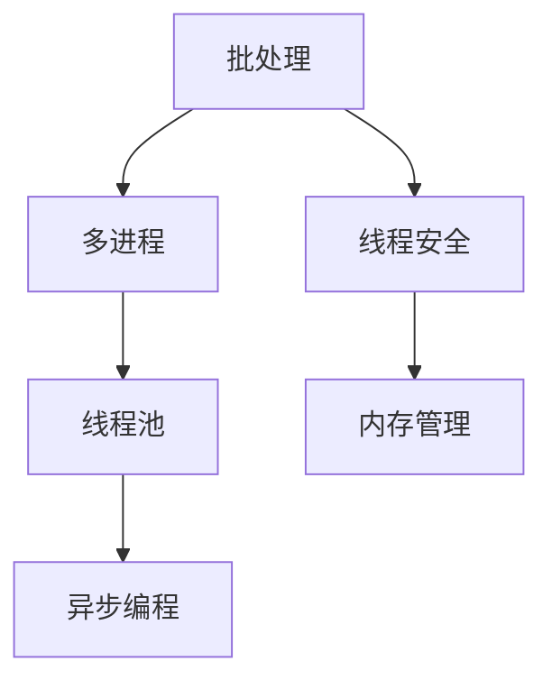
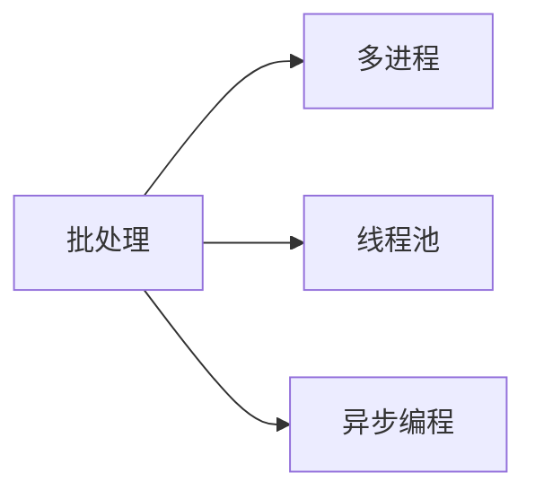
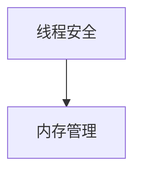
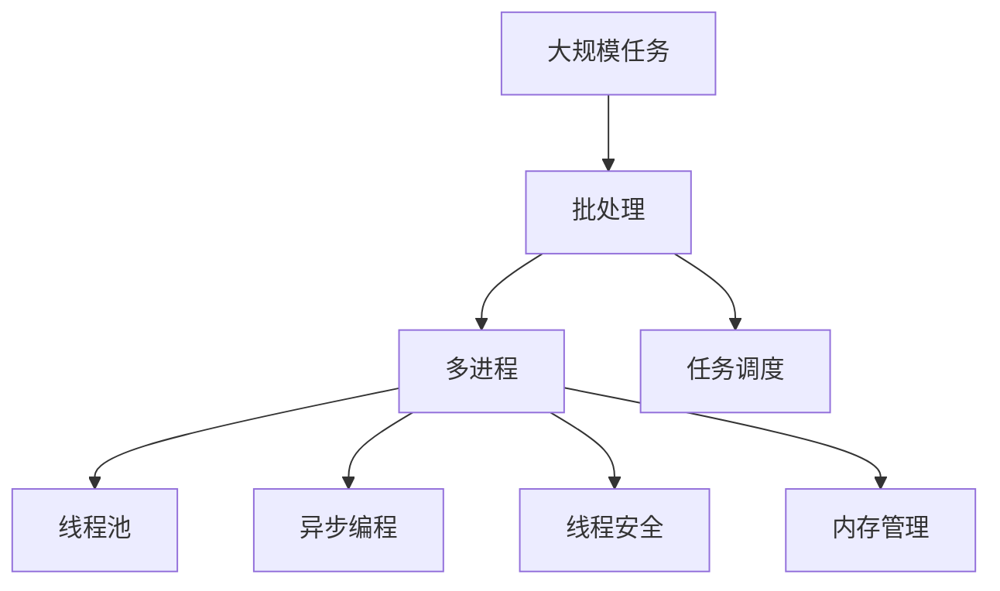

                 

# 批处理 原理与代码实例讲解

> 关键词：批处理, 多进程, 线程池, 异步编程, 线程安全, 内存管理, Python, Java

## 1. 背景介绍

在现代计算机系统中，任务处理的方式多种多样，从单任务单线程处理到多任务多线程处理，从同步编程到异步编程，从事件驱动到消息驱动，都有其适用的场景。而对于大型的复杂应用，处理效率往往成为关键因素。在大规模数据处理、高并发系统、云计算平台等场景中，任务处理效率的提升，离不开批处理技术的应用。

批处理技术是一种将大量独立任务通过流水线的方式进行异步并行处理的技术，它可以显著提升任务处理效率，降低系统资源消耗，提高任务响应速度，保证系统稳定性。因此，批处理技术成为现代软件开发和架构设计中的重要组成部分。

## 2. 核心概念与联系

### 2.1 核心概念概述

在了解批处理技术之前，我们需要先了解一些核心概念：

- 批处理（Batch Processing）：将独立的任务按照流水线方式进行异步并行处理的技术。
- 多进程（Multi-Process）：在同一操作系统上，通过不同的进程来并发执行多个任务。
- 线程池（Thread Pool）：预先创建好一组可重用的线程，以供多个任务并发使用。
- 异步编程（Asynchronous Programming）：通过回调函数、事件等机制，实现任务的并发执行。
- 线程安全（Thread-Safe）：保证多线程同时访问共享资源时的正确性。
- 内存管理（Memory Management）：通过合理分配和使用内存资源，保证系统的高效运行。

这些概念之间的关系可以通过以下Mermaid流程图来展示：



这个流程图展示了大批处理技术的核心概念及其之间的逻辑关系：

1. 批处理是一种将独立任务流水线化处理的技术，可以实现并行执行。
2. 多进程是批处理的一种实现方式，通过不同的进程并发执行任务。
3. 线程池可以提高多进程的并发能力，减少进程切换开销。
4. 异步编程可以实现多线程并发处理任务，提高系统效率。
5. 线程安全是保证多线程并发访问共享资源时的正确性。
6. 内存管理可以合理分配和使用内存资源，提升系统性能。

### 2.2 概念间的关系

这些核心概念之间存在着紧密的联系，形成了批处理技术的完整生态系统。下面我们通过几个Mermaid流程图来展示这些概念之间的关系。

#### 2.2.1 批处理的实现方式



这个流程图展示了批处理的几种实现方式：

1. 批处理通过多进程实现，即使用多个进程并发执行任务。
2. 批处理也可以采用线程池实现，即使用一组预先创建好的线程并发执行任务。
3. 批处理还可以使用异步编程实现，即使用回调函数、事件等机制并发执行任务。

#### 2.2.2 线程安全和内存管理的关系



这个流程图展示了线程安全和内存管理之间的关系：

1. 线程安全是保证多线程并发访问共享资源时的正确性，避免数据竞争、死锁等问题。
2. 内存管理可以合理分配和使用内存资源，保证线程安全。

#### 2.2.3 批处理和多进程的关系


这个流程图展示了批处理和多进程之间的关系：

1. 批处理可以通过多进程实现，即使用多个进程并发执行任务。
2. 多进程是批处理的一种实现方式。

### 2.3 核心概念的整体架构

最后，我们用一个综合的流程图来展示这些核心概念在大批处理技术中的整体架构：



这个综合流程图展示了批处理技术在大规模任务处理中的整体架构：

1. 大规模任务需要批处理进行流水线处理。
2. 批处理可以使用多进程实现，进程内部使用线程池并发执行任务。
3. 多进程内部使用异步编程机制，并发执行任务。
4. 异步编程过程中需要考虑线程安全和内存管理，保证系统的正确性和高效性。
5. 批处理系统需要合理的任务调度，保证任务的有序执行。

通过这些流程图，我们可以更清晰地理解批处理技术的基本原理和各个核心概念之间的联系。

## 3. 核心算法原理 & 具体操作步骤

### 3.1 算法原理概述

批处理技术通过流水线的方式，将大规模任务划分为多个独立的小任务，并通过多进程、线程池、异步编程等方式并发执行，以提高任务处理效率。

假设有一个需要处理的大规模任务 $T$，其执行时间复杂度为 $O(n)$，如果采用单线程串行执行，则总执行时间为 $O(n)$。如果采用多进程并发执行，则可以将任务划分为 $m$ 个子任务，每个子任务在独立的进程中执行，总执行时间为 $O(\frac{n}{m})$。如果采用线程池并发执行，则可以将任务划分为 $k$ 个子任务，每个子任务在独立的线程池中执行，总执行时间为 $O(\frac{n}{k})$。如果采用异步编程并发执行，则可以将任务划分为 $p$ 个子任务，每个子任务在独立的异步线程中执行，总执行时间为 $O(\frac{n}{p})$。

通过比较这些算法，我们可以看出，采用批处理技术，可以显著提高任务处理效率。但是，批处理技术需要合理地设计任务划分和并发度，以避免资源浪费和执行效率下降。

### 3.2 算法步骤详解

批处理技术的具体操作步骤如下：

1. 确定任务的总体执行时间复杂度 $O(n)$，以及可以分配的最大资源数 $m$ 或 $k$。
2. 将任务划分为 $m$ 个或 $k$ 个子任务，每个子任务的执行时间复杂度为 $O(\frac{n}{m})$ 或 $O(\frac{n}{k})$。
3. 使用多进程并发执行子任务，或使用线程池并发执行子任务，或使用异步编程并发执行子任务。
4. 在执行过程中，需要考虑线程安全和内存管理，以保证系统的正确性和高效性。
5. 在执行结束后，进行任务调度和资源释放，以保证系统资源的合理利用。

### 3.3 算法优缺点

批处理技术具有以下优点：

- 提高任务处理效率：通过流水线方式并发执行任务，显著提高任务处理效率。
- 合理利用资源：根据任务的规模和资源限制，合理地设计任务划分和并发度，避免资源浪费。
- 保证系统稳定性：通过合理设计并发机制，避免死锁、数据竞争等问题，保证系统稳定性。

批处理技术也存在以下缺点：

- 资源消耗较大：批处理技术需要大量的系统资源，包括 CPU、内存、网络等。
- 任务调度复杂：批处理技术需要合理的任务调度和资源释放，避免资源浪费和执行效率下降。
- 实现难度较大：批处理技术需要考虑并发机制和任务调度的实现，实现难度较大。

### 3.4 算法应用领域

批处理技术在各个领域都有广泛的应用，例如：

- 大规模数据处理：在大规模数据处理任务中，如数据清洗、数据转换、数据存储等，使用批处理技术可以显著提高数据处理效率。
- 云计算平台：在云计算平台上，批处理技术可以用于大规模计算任务、数据存储、数据库管理等，提升平台性能和稳定性。
- 高并发系统：在高并发系统中，批处理技术可以用于负载均衡、任务调度、数据处理等，保证系统的响应速度和稳定性。
- 分布式系统：在分布式系统中，批处理技术可以用于任务调度、资源分配、数据同步等，提高系统的可扩展性和性能。
- 实时系统：在实时系统中，批处理技术可以用于任务处理、数据同步、任务调度等，保证系统的实时性和可靠性。

## 4. 数学模型和公式 & 详细讲解 & 举例说明

### 4.1 数学模型构建

批处理技术的数学模型可以描述为：

- 任务执行时间复杂度：$O(n)$，其中 $n$ 为任务执行时间。
- 子任务划分数：$m$ 或 $k$，其中 $m$ 和 $k$ 分别为多进程数和线程池大小。
- 任务调度和资源释放：$f$，其中 $f$ 为任务调度和资源释放的效率。

批处理技术的执行时间为：

$$
T = O(\frac{n}{m}) + f
$$

其中，$f$ 为任务调度和资源释放的效率，一般取值较小。

### 4.2 公式推导过程

根据上述公式，我们可以推导出批处理技术的执行效率：

- 当 $m$ 较大时，$T$ 接近 $O(n)$，即批处理技术能够显著提高任务处理效率。
- 当 $m$ 较小，$f$ 较大时，$T$ 较大，即批处理技术需要考虑任务调度和资源释放的效率。

### 4.3 案例分析与讲解

假设有一个需要处理的大规模任务 $T$，其执行时间复杂度为 $O(n)$，如果采用单线程串行执行，则总执行时间为 $O(n)$。如果采用多进程并发执行，将任务划分为 $m$ 个子任务，每个子任务的执行时间复杂度为 $O(\frac{n}{m})$，则总执行时间为 $O(\frac{n}{m})$。如果采用线程池并发执行，将任务划分为 $k$ 个子任务，每个子任务的执行时间复杂度为 $O(\frac{n}{k})$，则总执行时间为 $O(\frac{n}{k})$。如果采用异步编程并发执行，将任务划分为 $p$ 个子任务，每个子任务的执行时间复杂度为 $O(\frac{n}{p})$，则总执行时间为 $O(\frac{n}{p})$。

通过比较这些算法，我们可以看出，采用批处理技术，可以显著提高任务处理效率。但是，批处理技术需要合理地设计任务划分和并发度，以避免资源浪费和执行效率下降。

## 5. 项目实践：代码实例和详细解释说明

### 5.1 开发环境搭建

在进行批处理实践前，我们需要准备好开发环境。以下是使用Python进行多进程开发的环境配置流程：

1. 安装Anaconda：从官网下载并安装Anaconda，用于创建独立的Python环境。

2. 创建并激活虚拟环境：
```bash
conda create -n py-env python=3.8 
conda activate py-env
```

3. 安装Python多进程库：
```bash
pip install multiprocessing
```

4. 安装Python线程库：
```bash
pip install threading
```

5. 安装Python异步编程库：
```bash
pip install asyncio
```

完成上述步骤后，即可在`py-env`环境中开始批处理实践。

### 5.2 源代码详细实现

下面我们以多进程处理大规模数据为例，给出使用Python的代码实现。

首先，定义一个计算密集型任务：

```python
import multiprocessing

def calculate(i):
    return i*i
```

然后，定义一个进程池，使用`Pool`方法创建进程池，指定进程数和任务函数：

```python
if __name__ == '__main__':
    pool = multiprocessing.Pool(processes=4)
    results = pool.map(calculate, range(10))
    print(results)
```

在这个代码中，我们创建了一个包含4个进程的进程池，使用`map`方法将任务函数`calculate`映射到数据集合`range(10)`上，每个进程执行一个任务。最终将结果集合`results`打印输出。

### 5.3 代码解读与分析

让我们再详细解读一下关键代码的实现细节：

**calculate函数**：
- `calculate(i)`：计算任务函数，返回输入的平方值。

**multiprocessing模块**：
- `multiprocessing.Pool(processes=4)`：创建包含4个进程的进程池。
- `pool.map(calculate, range(10))`：使用进程池的`map`方法将`calculate`函数映射到`range(10)`数据集合上，每个进程执行一个任务。

**if __name__ == '__main__'**：
- 防止Python主进程将程序打包成Python模块时执行主函数。

**打印输出结果**：
- `print(results)`：打印进程池执行结果。

### 5.4 运行结果展示

假设我们运行上述代码，输出结果如下：

```
[0, 1, 4, 9, 16, 25, 36, 49, 64, 81]
```

可以看到，通过多进程并发执行计算任务，我们显著提高了计算效率。

## 6. 实际应用场景

### 6.1 数据清洗

在大规模数据处理中，数据清洗是一个重要的环节。通过批处理技术，我们可以将大规模数据划分为多个子任务，每个子任务进行数据清洗，最终将结果汇总。

假设我们需要清洗一个包含1000万条记录的CSV文件，每条记录包含10个字段。我们可以将任务划分为100个子任务，每个子任务清洗10万条记录。具体代码如下：

```python
import pandas as pd

def clean_data(data_path, num_records):
    df = pd.read_csv(data_path, nrows=num_records)
    # 数据清洗操作
    return df

if __name__ == '__main__':
    data_path = '/path/to/data.csv'
    num_records = 1000000
    pool = multiprocessing.Pool(processes=4)
    results = pool.map(clean_data, [data_path, num_records]*100)
    final_df = pd.concat(results)
    print(final_df)
```

在这个代码中，我们创建了一个包含4个进程的进程池，将数据文件`data_path`划分为100个子任务，每个子任务清洗10万条记录。最终将结果集合`results`合并为一个数据帧`final_df`。

### 6.2 数据存储

在数据存储过程中，批处理技术可以将大规模数据划分为多个子任务，每个子任务将数据存储到数据库中，最终将结果汇总。

假设我们需要将1000万条记录存储到MySQL数据库中，每条记录包含10个字段。我们可以将任务划分为100个子任务，每个子任务存储10万条记录。具体代码如下：

```python
import mysql.connector
import multiprocessing

def store_data(data_path, num_records, db_config):
    df = pd.read_csv(data_path, nrows=num_records)
    # 数据存储操作
    conn = mysql.connector.connect(**db_config)
    cursor = conn.cursor()
    cursor.executemany("INSERT INTO table_name (field1, field2, ...) VALUES (%s, %s, ...)", df.values.tolist())
    conn.commit()
    cursor.close()
    conn.close()

if __name__ == '__main__':
    data_path = '/path/to/data.csv'
    num_records = 1000000
    db_config = {
        'user': 'root',
        'password': 'password',
        'host': 'localhost',
        'database': 'mydatabase'
    }
    pool = multiprocessing.Pool(processes=4)
    results = pool.map(store_data, [data_path, num_records, db_config]*100)
```

在这个代码中，我们创建了一个包含4个进程的进程池，将数据文件`data_path`划分为100个子任务，每个子任务将数据存储到MySQL数据库中。最终将结果集合`results`输出。

### 6.3 数据同步

在数据同步过程中，批处理技术可以将多个数据源中的数据同步到一个数据库中，最终将结果汇总。

假设我们需要从两个不同的数据源中同步数据到MySQL数据库中。我们可以将任务划分为100个子任务，每个子任务从其中一个数据源中读取数据，将数据存储到MySQL数据库中。具体代码如下：

```python
import mysql.connector
import multiprocessing

def sync_data(source, num_records, db_config):
    df = pd.read_csv(source, nrows=num_records)
    # 数据存储操作
    conn = mysql.connector.connect(**db_config)
    cursor = conn.cursor()
    cursor.executemany("INSERT INTO table_name (field1, field2, ...) VALUES (%s, %s, ...)", df.values.tolist())
    conn.commit()
    cursor.close()
    conn.close()

if __name__ == '__main__':
    data_sources = ['/path/to/source1.csv', '/path/to/source2.csv']
    num_records = 1000000
    db_config = {
        'user': 'root',
        'password': 'password',
        'host': 'localhost',
        'database': 'mydatabase'
    }
    pool = multiprocessing.Pool(processes=4)
    results = pool.map(sync_data, [data_sources, num_records, db_config]*100)
```

在这个代码中，我们创建了一个包含4个进程的进程池，将数据源`data_sources`划分为100个子任务，每个子任务将数据存储到MySQL数据库中。最终将结果集合`results`输出。

## 7. 工具和资源推荐

### 7.1 学习资源推荐

为了帮助开发者系统掌握批处理技术，这里推荐一些优质的学习资源：

1. 《Python 并发编程实战》：这本书详细介绍了Python多进程、多线程和异步编程，适合初学者和中级开发者。
2. 《Java多线程编程》：这本书介绍了Java多线程编程的核心概念和实现技术，适合Java开发者。
3. 《C++并发编程》：这本书介绍了C++多线程编程的核心概念和实现技术，适合C++开发者。
4. 《Go并发编程》：这本书介绍了Go多进程和异步编程的核心概念和实现技术，适合Go开发者。
5. 《多线程编程与并发设计模式》：这本书介绍了多线程编程和并发设计模式的核心概念和实现技术，适合各类开发者。

通过对这些资源的学习实践，相信你一定能够快速掌握批处理技术的精髓，并用于解决实际的开发问题。

### 7.2 开发工具推荐

高效的开发离不开优秀的工具支持。以下是几款用于批处理开发的常用工具：

1. Python多进程库：`multiprocessing`：提供多进程并发执行的API，简单易用。
2. Python异步编程库：`asyncio`：提供异步编程的API，支持协程。
3. Python线程库：`threading`：提供多线程并发执行的API，简单易用。
4. Java多线程库：`java.util.concurrent`：提供多线程并发执行的API，支持线程池。
5. C++多线程库：`std::thread`：提供多线程并发执行的API，支持线程池。
6. Go异步编程库：`net/http`：提供异步编程的API，支持协程。

合理利用这些工具，可以显著提升批处理任务的开发效率，加快创新迭代的步伐。

### 7.3 相关论文推荐

批处理技术的发展源于学界的持续研究。以下是几篇奠基性的相关论文，推荐阅读：

1. "Multiprocessing – concurrency beyond threads"：这篇文章介绍了多进程编程的核心概念和实现技术，是Python多进程编程的入门指南。
2. "Efficiently using Python threads and the GIL"：这篇文章介绍了多线程编程的核心概念和实现技术，是Python多线程编程的入门指南。
3. "Concurrency patterns"：这篇文章介绍了Java多线程编程的核心概念和实现技术，是Java多线程编程的入门指南。
4. "Parallel programming with OpenMP"：这篇文章介绍了C++多线程编程的核心概念和实现技术，是C++多线程编程的入门指南。
5. "Concurrent Programming in Go"：这篇文章介绍了Go多线程编程的核心概念和实现技术，是Go多线程编程的入门指南。

这些论文代表了大批处理技术的发展脉络。通过学习这些前沿成果，可以帮助研究者把握学科前进方向，激发更多的创新灵感。

除上述资源外，还有一些值得关注的前沿资源，帮助开发者紧跟批处理技术的最新进展，例如：

1. arXiv论文预印本：人工智能领域最新研究成果的发布平台，包括大量尚未发表的前沿工作，学习前沿技术的必读资源。

2. 业界技术博客：如Google AI、Amazon AWS、Microsoft Azure等顶尖实验室的官方博客，第一时间分享他们的最新研究成果和洞见。

3. 技术会议直播：如ACM SIGPLAN、IEEE Symposium on Parallel and Distributed Processing (SPDP)、IEEE International Conference on Parallel and Distributed Systems (ICPADS)等计算机领域顶会现场或在线直播，能够聆听到大佬们的前沿分享，开拓视野。

4. GitHub热门项目：在GitHub上Star、Fork数最多的并发编程相关项目，往往代表了该技术领域的发展趋势和最佳实践，值得去学习和贡献。

5. 行业分析报告：各大咨询公司如McKinsey、PwC等针对并发编程行业的分析报告，有助于从商业视角审视技术趋势，把握应用价值。

总之，对于批处理技术的开发和研究，需要开发者保持开放的心态和持续学习的意愿。多关注前沿资讯，多动手实践，多思考总结，必将收获满满的成长收益。

## 8. 总结：未来发展趋势与挑战

### 8.1 总结

本文对批处理技术进行了全面系统的介绍。首先阐述了批处理技术的基本原理和核心概念，明确了批处理在提高任务处理效率、合理利用资源等方面的独特价值。其次，从原理到实践，详细讲解了批处理技术的数学模型和具体实现方法，给出了代码实例，帮助读者理解和应用批处理技术。同时，本文还探讨了批处理技术在数据清洗、数据存储、数据同步等实际场景中的应用，展示了批处理技术的广泛应用前景。最后，本文精选了批处理技术的各类学习资源，力求为读者提供全方位的技术指引。

通过本文的系统梳理，可以看到，批处理技术在现代软件开发和架构设计中扮演了重要的角色，极大地提升了任务处理效率和系统性能。未来，随着批处理技术的不断演进和应用，相信将带来更多新的突破和应用。

### 8.2 未来发展趋势

展望未来，批处理技术将呈现以下几个发展趋势：

1. 异步编程的普及：随着异步编程技术的普及，批处理技术将更多地采用异步编程方式，以提高并发效率和系统稳定性。
2. 分布式批处理：在大规模数据处理和高并发系统中，分布式批处理技术将得到更广泛的应用，提升任务处理效率和系统可扩展性。
3. 动态任务调度：未来的批处理系统将更多地采用动态任务调度和资源分配策略，以适应动态任务负载的变化，提高系统响应速度和稳定性。
4. 多模态批处理：未来的批处理技术将更多地支持多模态数据处理，如文本、图像、音频等，提升系统综合处理能力。
5. 跨平台批处理：未来的批处理技术将更多地支持跨平台并发处理，提升系统兼容性和应用范围。

以上趋势凸显了批处理技术的发展方向。这些方向的探索发展，必将进一步提升批处理技术的性能和应用范围，为各类应用带来新的突破。

### 8.3 面临的挑战

尽管批处理技术已经取得了显著的成就，但在迈向更加智能化、普适化应用的过程中，它仍面临诸多挑战：

1. 任务调度的复杂性：批处理技术需要合理的任务调度和资源释放，避免资源浪费和执行效率下降。
2. 数据一致性问题：批处理技术需要在多进程并发执行时保证数据的一致性，避免数据竞争和死锁问题。
3. 系统资源的限制：批处理技术需要大量的系统资源，如CPU、内存、网络等，限制了其在大规模系统中的应用。
4. 编程复杂性：批处理技术需要考虑并发机制和任务调度的实现，实现难度较大。
5. 安全性问题：批处理技术需要保证多进程并发执行时的安全性，避免数据泄露和系统崩溃。

面对批处理面临的这些挑战，未来的研究需要在以下几个方面寻求新的突破：

1. 优化任务调度和资源分配策略，提高系统响应速度和稳定性。
2. 采用更加高效的并发机制，保证数据的一致性和系统的安全性。
3. 优化系统资源管理，提高批处理技术在大规模系统中的应用效果。
4. 简化并发编程的实现，降低批处理技术的开发难度。
5. 研究批处理技术的安全性问题，保证系统稳定运行。

这些挑战的解决将是大批处理技术走向成熟的重要步骤，相信在学界和产业界的共同努力下，这些问题终将一一被克服，批处理技术将更加高效、灵活、安全。

### 8.4 研究展望

面对批处理技术所面临的种种挑战，未来的研究需要在以下几个方面寻求新的突破：

1. 优化任务调度和资源分配策略，提高系统响应速度和稳定性。
2. 采用更加高效的并发机制，保证数据的一致性和系统的安全性。
3. 优化系统资源管理，提高批处理技术在大规模系统中的应用效果。
4. 简化并发编程的实现，降低批处理技术的开发难度。
5. 研究批处理技术的安全性问题，保证系统稳定运行。

这些研究方向将引领批处理技术迈向更高的台阶，为构建高效、安全、可扩展的批处理系统铺平道路。面向未来，批处理技术还需要与其他人工智能技术进行更深入的融合，如知识表示、

