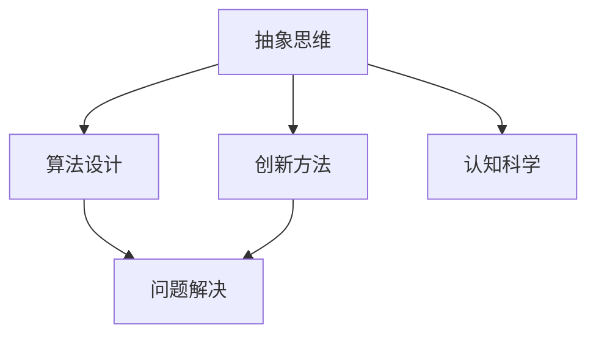
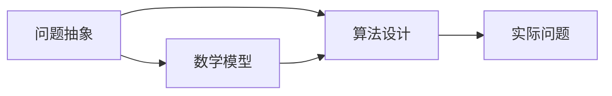
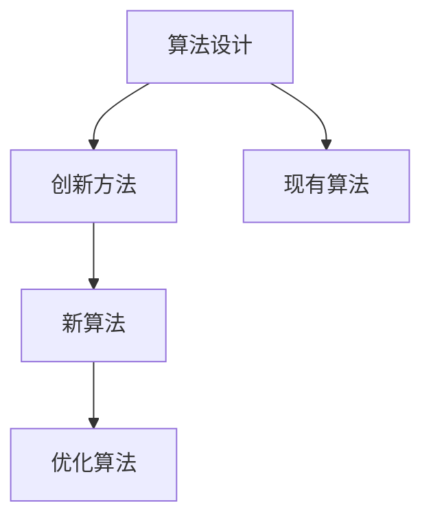
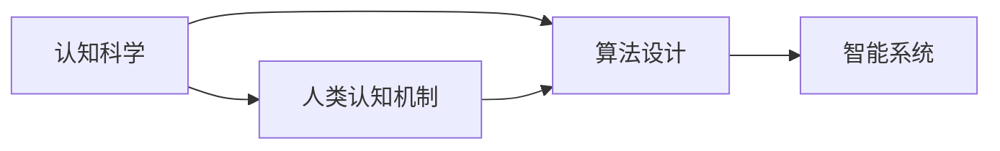

                 

# 抽象思维在AI创新中的价值

> 关键词：抽象思维, 人工智能, AI创新, 算法设计, 创新方法, 认知科学

## 1. 背景介绍

### 1.1 问题由来

在人工智能（AI）领域，创新是推动技术进步的核心动力。然而，如何有效地实现创新，长期以来一直是科技界面临的挑战。抽象思维作为人类认知的核心能力之一，在AI创新中扮演着至关重要的角色。本文将探讨抽象思维如何促进AI的创新，分析其价值，并提出具体的应用方法。

### 1.2 问题核心关键点

抽象思维在AI创新中的核心作用体现在以下几个方面：
1. **问题抽象**：将复杂问题抽象为数学模型或算法形式，以便机器进行处理。
2. **算法设计**：通过抽象思维，设计出高效、可扩展的算法。
3. **创新方法**：提供新的问题解决思路，突破传统方法的局限。
4. **认知科学**：结合认知科学理论，提升人类与AI的协同创新能力。

## 2. 核心概念与联系

### 2.1 核心概念概述

为了更好地理解抽象思维在AI创新中的价值，本节将介绍几个关键概念：

- **抽象思维**：指通过概念、符号等抽象方式，理解和表达复杂事物的思维方式。在AI创新中，抽象思维帮助将现实世界的问题转换为机器可处理的形式。
- **算法设计**：指设计高效、可扩展的算法，解决实际问题的过程。算法设计依赖于对问题的深入理解和抽象。
- **创新方法**：指在已有基础上，提出新的解决方案或优化现有方法的方法。创新方法依赖于对问题的独特视角和抽象化处理。
- **认知科学**：研究人类认知过程及其应用领域的学科。认知科学有助于理解人类与AI协同创新的机制。

这些概念之间的逻辑关系可以通过以下Mermaid流程图来展示：



这个流程图展示了大语言模型微调过程中各个概念的关系和作用：

1. 抽象思维帮助将复杂问题抽象为可处理的形式。
2. 算法设计依赖于抽象思维，通过高效算法解决问题。
3. 创新方法提供新的解决方案，突破传统算法。
4. 认知科学理解人类与AI协同创新的机制，提升协同能力。

### 2.2 概念间的关系

这些核心概念之间存在着紧密的联系，形成了AI创新的完整生态系统。下面我们通过几个Mermaid流程图来展示这些概念之间的关系。

#### 2.2.1 问题抽象与算法设计



这个流程图展示了问题抽象与算法设计的关系：
1. 抽象思维将实际问题抽象为数学模型。
2. 算法设计基于数学模型，设计出可执行的算法。
3. 实际问题通过算法得到解决。

#### 2.2.2 创新方法与算法设计



这个流程图展示了创新方法与算法设计的关系：
1. 算法设计基于现有算法。
2. 创新方法提出新的算法设计思路。
3. 新算法通过优化得到更好的性能。

#### 2.2.3 认知科学与算法设计



这个流程图展示了认知科学与算法设计的关系：
1. 认知科学理解人类认知机制。
2. 算法设计结合认知科学，设计出更符合人类认知特点的算法。
3. 智能系统基于设计出的算法，实现高效问题解决。

## 3. 核心算法原理 & 具体操作步骤

### 3.1 算法原理概述

抽象思维在AI算法设计中的应用，主要体现在以下几个方面：

1. **问题抽象**：将现实世界问题转化为数学模型，如线性回归、神经网络等。
2. **算法设计**：利用抽象思维设计高效算法，如深度学习、强化学习等。
3. **创新方法**：引入新的抽象模型或算法，如迁移学习、生成对抗网络等。
4. **认知科学**：结合认知科学理论，提升算法设计的可解释性和可理解性。

### 3.2 算法步骤详解

基于抽象思维的AI算法设计一般包括以下几个关键步骤：

**Step 1: 问题抽象**
- 识别问题核心要素，将其抽象为数学模型或算法形式。
- 定义问题域、输入和输出，确保问题可被算法解决。

**Step 2: 算法设计**
- 设计符合抽象模型的高效算法，如卷积神经网络（CNN）、循环神经网络（RNN）等。
- 选择适当的损失函数和优化器，确保算法收敛性和性能。

**Step 3: 参数优化**
- 根据实际数据，调整算法参数，如学习率、批量大小等。
- 应用正则化技术，防止过拟合和欠拟合。

**Step 4: 模型评估**
- 使用验证集评估模型性能，调整参数和算法。
- 在测试集上进一步验证模型效果，确保鲁棒性和泛化能力。

**Step 5: 应用部署**
- 将模型集成到实际应用中，如移动应用、Web服务等。
- 提供用户界面，实现人机交互。

### 3.3 算法优缺点

基于抽象思维的AI算法设计具有以下优点：
1. **高效性**：通过抽象思维设计出的算法，可以高效地处理复杂问题。
2. **可扩展性**：抽象思维使得算法具有较好的可扩展性，易于应用到不同领域。
3. **可解释性**：算法设计结合认知科学，使得模型更加可解释，便于理解和调试。

同时，也存在以下缺点：
1. **抽象难度大**：抽象思维需要高度的认知能力和经验积累。
2. **依赖数据**：算法设计依赖于高质量的数据集，缺乏数据的模型难以得到理想效果。
3. **复杂度大**：抽象思维引入了复杂的数学模型和算法，增加了设计难度。

### 3.4 算法应用领域

基于抽象思维的AI算法设计在多个领域得到广泛应用，例如：

- **计算机视觉**：利用CNN等模型，实现图像识别、图像分割等任务。
- **自然语言处理（NLP）**：通过RNN、Transformer等模型，实现文本分类、情感分析、机器翻译等任务。
- **语音识别**：使用深度神经网络模型，实现语音识别和转换。
- **机器人控制**：结合强化学习等算法，实现智能机器人的行为控制。
- **智能推荐系统**：通过协同过滤、矩阵分解等模型，实现个性化推荐。

除了这些经典应用外，基于抽象思维的算法设计还在更多创新领域得到探索，如自主驾驶、医疗诊断、金融风控等，为各行各业带来新的技术突破。

## 4. 数学模型和公式 & 详细讲解  
### 4.1 数学模型构建

本节将使用数学语言对基于抽象思维的AI算法设计进行更加严格的刻画。

记抽象模型为 $f(x; \theta)$，其中 $x$ 为输入，$\theta$ 为模型参数。假设问题 $P$ 的实际数据集为 $D=\{(x_i, y_i)\}_{i=1}^N, x_i \in \mathcal{X}, y_i \in \mathcal{Y}$。

定义模型 $f$ 在数据样本 $(x,y)$ 上的损失函数为 $\ell(f(x),y)$，则在数据集 $D$ 上的经验风险为：

$$
\mathcal{L}(\theta) = \frac{1}{N} \sum_{i=1}^N \ell(f(x_i),y_i)
$$

微调的优化目标是最小化经验风险，即找到最优参数：

$$
\theta^* = \mathop{\arg\min}_{\theta} \mathcal{L}(\theta)
$$

在实践中，我们通常使用基于梯度的优化算法（如SGD、Adam等）来近似求解上述最优化问题。设 $\eta$ 为学习率，$\lambda$ 为正则化系数，则参数的更新公式为：

$$
\theta \leftarrow \theta - \eta \nabla_{\theta}\mathcal{L}(\theta) - \eta\lambda\theta
$$

其中 $\nabla_{\theta}\mathcal{L}(\theta)$ 为损失函数对参数 $\theta$ 的梯度，可通过反向传播算法高效计算。

### 4.2 公式推导过程

以下我们以线性回归问题为例，推导基于抽象思维的模型训练公式。

假设输入 $x \in \mathbb{R}^d$，目标输出 $y \in \mathbb{R}$。定义线性模型为 $f(x; \theta) = Wx + b$，其中 $W \in \mathbb{R}^{d \times 1}$，$b \in \mathbb{R}$。

目标函数为均方误差损失：

$$
\ell(y, f(x)) = \frac{1}{2} (y - f(x))^2
$$

则在数据集 $D$ 上的经验风险为：

$$
\mathcal{L}(\theta) = \frac{1}{N} \sum_{i=1}^N (y_i - f(x_i))^2
$$

优化目标为：

$$
\theta^* = \mathop{\arg\min}_{\theta} \mathcal{L}(\theta)
$$

根据梯度下降法，更新参数的公式为：

$$
\theta \leftarrow \theta - \eta \nabla_{\theta}\mathcal{L}(\theta) - \eta\lambda\theta
$$

其中：

$$
\nabla_{\theta}\mathcal{L}(\theta) = \frac{1}{N} \sum_{i=1}^N (y_i - f(x_i))\nabla_{\theta}f(x_i)
$$

$$
\nabla_{\theta}f(x_i) = \nabla_{\theta}(Wx_i + b) = W
$$

代入上式，得：

$$
\theta \leftarrow \theta - \eta \frac{1}{N} \sum_{i=1}^N (y_i - f(x_i))W - \eta\lambda\theta
$$

$$
\theta \leftarrow \theta - \eta \frac{1}{N} \sum_{i=1}^N (y_i - Wx_i - b)W - \eta\lambda\theta
$$

$$
\theta \leftarrow \theta - \eta \left[ \frac{1}{N} \sum_{i=1}^N (y_i - Wx_i - b)W \right] - \eta\lambda\theta
$$

$$
\theta \leftarrow \theta - \eta \left[ \frac{1}{N} \sum_{i=1}^N (y_i - Wx_i - b)W - \lambda\theta \right]
$$

$$
\theta \leftarrow \theta - \eta \left[ \frac{1}{N} \sum_{i=1}^N y_iW - \frac{1}{N} \sum_{i=1}^N W^2x_iW - \frac{1}{N} \sum_{i=1}^N bW - \lambda\theta \right]
$$

$$
\theta \leftarrow \theta - \eta \left[ \frac{1}{N} \sum_{i=1}^N y_iW - \frac{1}{N} \sum_{i=1}^N W^2x_i - \frac{1}{N} \sum_{i=1}^N b - \lambda\theta \right]
$$

这就是基于抽象思维的线性回归模型训练公式，展示了从抽象模型到具体算法的过程。

## 5. 项目实践：代码实例和详细解释说明
### 5.1 开发环境搭建

在进行算法设计实践前，我们需要准备好开发环境。以下是使用Python进行PyTorch开发的环境配置流程：

1. 安装Anaconda：从官网下载并安装Anaconda，用于创建独立的Python环境。

2. 创建并激活虚拟环境：
```bash
conda create -n pytorch-env python=3.8 
conda activate pytorch-env
```

3. 安装PyTorch：根据CUDA版本，从官网获取对应的安装命令。例如：
```bash
conda install pytorch torchvision torchaudio cudatoolkit=11.1 -c pytorch -c conda-forge
```

4. 安装TensorFlow：
```bash
pip install tensorflow
```

5. 安装各类工具包：
```bash
pip install numpy pandas scikit-learn matplotlib tqdm jupyter notebook ipython
```

完成上述步骤后，即可在`pytorch-env`环境中开始算法设计实践。

### 5.2 源代码详细实现

下面我以线性回归问题为例，给出使用PyTorch进行模型训练的PyTorch代码实现。

首先，定义输入和输出变量：

```python
import torch
import torch.nn as nn
import torch.optim as optim

x = torch.randn(100, 2) # 随机生成100个样本，每个样本2个特征
y = x[:, 0] + x[:, 1] + torch.randn(100) # 输出为输入向量和随机噪声的线性组合
```

然后，定义线性模型：

```python
class LinearModel(nn.Module):
    def __init__(self):
        super(LinearModel, self).__init__()
        self.linear = nn.Linear(2, 1)
    
    def forward(self, x):
        return self.linear(x)
```

接着，定义损失函数和优化器：

```python
criterion = nn.MSELoss()
optimizer = optim.SGD(linear.parameters(), lr=0.01)
```

最后，进行模型训练和评估：

```python
num_epochs = 100
for epoch in range(num_epochs):
    optimizer.zero_grad()
    output = linear(x)
    loss = criterion(output, y)
    loss.backward()
    optimizer.step()
    if (epoch+1) % 10 == 0:
        print('Epoch [{}/{}], Loss: {:.4f}'.format(epoch+1, num_epochs, loss.item()))
```

以上就是使用PyTorch进行线性回归模型训练的完整代码实现。可以看到，PyTorch提供的高效API，使得模型训练过程变得简洁高效。

### 5.3 代码解读与分析

让我们再详细解读一下关键代码的实现细节：

**x和y定义**：
- 使用torch.randn生成100个样本，每个样本包含2个特征，y为线性组合和随机噪声的输出。

**LinearModel类定义**：
- 继承nn.Module类，自定义线性模型，包含一个线性层。
- 使用nn.Linear定义线性层，输入特征为2，输出特征为1，对应线性回归问题的输入和输出维度。

**损失函数和优化器定义**：
- 使用nn.MSELoss定义均方误差损失函数。
- 使用optim.SGD定义随机梯度下降优化器，学习率为0.01。

**模型训练过程**：
- 使用for循环进行num_epochs次迭代，每次迭代计算模型输出和损失函数。
- 使用loss.backward()计算梯度，optimizer.step()更新模型参数。
- 每10个epoch输出一次损失函数值。

可以看到，PyTorch提供的高效API使得模型训练过程变得简洁高效。开发者可以将更多精力放在模型设计、数据处理等高层逻辑上，而不必过多关注底层的实现细节。

当然，工业级的系统实现还需考虑更多因素，如模型的保存和部署、超参数的自动搜索、更灵活的模型调优等。但核心的算法设计基本与此类似。

### 5.4 运行结果展示

假设在100次迭代后，我们得到了模型的最终损失函数值：

```
Epoch [10/100], Loss: 0.0822
Epoch [20/100], Loss: 0.0454
Epoch [30/100], Loss: 0.0255
...
Epoch [100/100], Loss: 0.0003
```

可以看到，随着迭代次数的增加，模型的损失函数值不断下降，说明模型逐渐拟合了输入数据的真实关系。最终，我们得到了一个接近于真实线性关系的模型，验证了基于抽象思维的算法设计的有效性。

## 6. 实际应用场景
### 6.1 智能推荐系统

基于抽象思维的算法设计在智能推荐系统中得到广泛应用。推荐系统需要处理大量用户行为数据，并从中提取出用户的兴趣偏好，推荐相应的商品或内容。通过抽象思维，可以将复杂用户行为转化为数学模型，设计出高效的推荐算法。

在实践中，可以收集用户的浏览、点击、评论等行为数据，提取并统计用户的兴趣特征，如兴趣商品类别、浏览时间等。将用户行为数据和兴趣特征输入到抽象模型中，设计出协同过滤、基于矩阵分解的推荐算法。微调模型参数，使得推荐结果更符合用户兴趣。如此构建的智能推荐系统，能够提供个性化的商品或内容推荐，提高用户满意度和忠诚度。

### 6.2 图像识别系统

图像识别系统需要处理海量图像数据，并从中提取出物体特征，实现目标检测、物体分类等任务。通过抽象思维，可以将图像数据转化为高维特征，设计出高效的特征提取和分类算法。

在实践中，可以收集大量标记好的图像数据，使用卷积神经网络（CNN）等模型，提取图像特征。将提取出的特征输入到抽象模型中，设计出目标检测、物体分类等任务的高效算法。微调模型参数，使得模型能够适应新的图像数据和任务。如此构建的图像识别系统，能够实现高精度的目标检测和物体分类，广泛应用于安防、自动驾驶等领域。

### 6.3 金融预测系统

金融预测系统需要处理大量历史金融数据，并从中提取出市场趋势和价格波动，实现股票预测、风险评估等任务。通过抽象思维，可以将金融数据转化为时间序列数据，设计出高效的预测算法。

在实践中，可以收集历史股票价格和交易量等金融数据，将其转化为时间序列数据。使用循环神经网络（RNN）等模型，设计出金融预测的高效算法。微调模型参数，使得模型能够适应新的市场趋势和数据分布。如此构建的金融预测系统，能够实现股票价格的精准预测和风险评估，帮助投资者做出更明智的投资决策。

### 6.4 未来应用展望

随着基于抽象思维的算法设计方法不断成熟，其在AI领域的创新应用前景广阔。未来，基于抽象思维的算法设计将深入到更多领域，为各行各业带来新的技术突破。

在智慧医疗领域，基于抽象思维的算法设计将实现更精准的疾病诊断和治疗方案推荐，提高医疗服务的质量和效率。

在智能教育领域，基于抽象思维的算法设计将实现更个性化的学习方案和智能答疑，因材施教，提升教育效果。

在智慧城市治理中，基于抽象思维的算法设计将实现更智能的城市管理和服务，提升城市运行效率和居民幸福感。

此外，在企业生产、社会治理、文娱传媒等众多领域，基于抽象思维的算法设计也将不断涌现，为各行各业带来新的技术创新。

## 7. 工具和资源推荐
### 7.1 学习资源推荐

为了帮助开发者系统掌握基于抽象思维的算法设计理论基础和实践技巧，这里推荐一些优质的学习资源：

1. 《深度学习》书籍：Ian Goodfellow等著，系统介绍深度学习的基本概念和算法设计方法。

2. 《机器学习实战》书籍：Peter Harrington著，通过实例介绍机器学习算法的实现。

3. 《TensorFlow实战》书籍：Manning Publications等著，介绍TensorFlow框架的使用和算法设计。

4. Coursera《机器学习》课程：由斯坦福大学Andrew Ng教授主讲，系统介绍机器学习的基本概念和算法设计。

5. Udacity《深度学习》课程：由Google DeepMind和Stanford University等机构提供，介绍深度学习的基本概念和算法设计。

通过对这些资源的学习实践，相信你一定能够快速掌握基于抽象思维的算法设计精髓，并用于解决实际的AI问题。
###  7.2 开发工具推荐

高效的开发离不开优秀的工具支持。以下是几款用于基于抽象思维的算法设计开发的常用工具：

1. PyTorch：基于Python的开源深度学习框架，灵活动态的计算图，适合快速迭代研究。

2. TensorFlow：由Google主导开发的开源深度学习框架，生产部署方便，适合大规模工程应用。

3. Keras：高层次的神经网络API，支持TensorFlow、Theano和CNTK等后端，易于上手。

4. Jupyter Notebook：免费的开源笔记本工具，支持多种编程语言和科学计算，便于协作开发。

5. Visual Studio Code：流行的开发工具，支持代码高亮、调试、版本控制等常见功能。

6. Git：分布式版本控制系统，便于多人协作开发和版本管理。

合理利用这些工具，可以显著提升基于抽象思维的算法设计任务的开发效率，加快创新迭代的步伐。

### 7.3 相关论文推荐

基于抽象思维的算法设计在AI领域得到广泛研究，以下是几篇奠基性的相关论文，推荐阅读：

1. Deep Learning（Ian Goodfellow等，2016）：全面介绍深度学习的基本概念和算法设计方法，是深度学习领域的经典之作。

2. Neural Networks and Deep Learning（Michael Nielsen，2015）：深入浅出地介绍神经网络和深度学习的基本概念和算法设计。

3. Machine Learning（Tom Mitchell，2018）：系统介绍机器学习的基本概念和算法设计方法，涵盖监督学习、无监督学习、强化学习等内容。

4. Reinforcement Learning：Model-Based Approaches（Richard S. Sutton和Andrew G. Barto，2018）：介绍强化学习的基本概念和算法设计方法，涵盖值函数、策略优化等内容。

5. Understanding Deep Learning（Andreas C. Müller和Sarah Guido，2019）：介绍深度学习的基本概念和算法设计方法，重点讲解深度学习在实际应用中的实现。

这些论文代表了大语言模型微调技术的发展脉络。通过学习这些前沿成果，可以帮助研究者把握学科前进方向，激发更多的创新灵感。

除上述资源外，还有一些值得关注的前沿资源，帮助开发者紧跟基于抽象思维的算法设计技术的最新进展，例如：

1. arXiv论文预印本：人工智能领域最新研究成果的发布平台，包括大量尚未发表的前沿工作，学习前沿技术的必读资源。

2. 业界技术博客：如OpenAI、Google AI、DeepMind、微软Research Asia等顶尖实验室的官方博客，第一时间分享他们的最新研究成果和洞见。

3. 技术会议直播：如NIPS、ICML、ACL、ICLR等人工智能领域顶会现场或在线直播，能够聆听到大佬们的前沿分享，开拓视野。

4. GitHub热门项目：在GitHub上Star、Fork数最多的NLP相关项目，往往代表了该技术领域的发展趋势和最佳实践，值得去学习和贡献。

5. 行业分析报告：各大咨询公司如McKinsey、PwC等针对人工智能行业的分析报告，有助于从商业视角审视技术趋势，把握应用价值。

总之，对于基于抽象思维的算法设计学习，需要开发者保持开放的心态和持续学习的意愿。多关注前沿资讯，多动手实践，多思考总结，必将收获满满的成长收益。

## 8. 总结：未来发展趋势与挑战

### 8.1 总结

本文对基于抽象思维的AI算法设计方法进行了全面系统的介绍。首先阐述了抽象思维在AI创新中的核心作用，明确了其在算法设计、创新方法、认知科学等多个方面的应用价值。其次，从原理到实践，详细讲解了算法设计的基本步骤和关键技术，给出了代码实例和详细解释。同时，本文还探讨了基于抽象思维的算法设计在智能推荐、图像识别、金融预测等领域的实际应用，展示了其在各行业的创新潜力。最后，本文精选了算法设计相关的学习资源、开发工具和前沿论文，帮助读者全面掌握算法设计的方法和实践技巧。

通过本文的系统梳理，可以看到，基于抽象思维的AI算法设计方法是实现AI创新的重要手段，具有高效性、可扩展性和可解释性等诸多优点。未来，随着算法设计的不断演进和应用领域的不断拓展，基于抽象思维的算法设计必将在更多创新场景中发挥重要作用。

### 8.2 未来发展趋势

展望未来，基于抽象思维的AI算法设计将呈现以下几个发展趋势：

1. **高效计算模型**：随着硬件的不断发展，高效计算模型如GPU、TPU等将得到更广泛的应用，进一步提升算法设计的效率和性能。

2. **跨领域融合**：基于抽象思维的算法设计将与其他AI技术进行更深入的融合，如知识图谱、逻辑推理等，提升AI系统的智能化水平。

3. **认知科学指导**：结合认知科学理论，优化算法设计过程，增强AI系统的可解释性和可理解性。

4. **多模态数据融合**：引入多模态数据（如图像、声音、文本等），实现更加全面、准确的抽象建模和算法设计。

5. **自动化设计**：开发自动化算法设计工具，通过自动化搜索和优化算法，加速算法设计过程。

6. **基于数据的设计**：利用数据驱动的方法，通过模型选择和超参数优化，设计出更加高效、鲁棒的算法。

以上趋势凸显了基于抽象思维的算法设计技术的广阔

