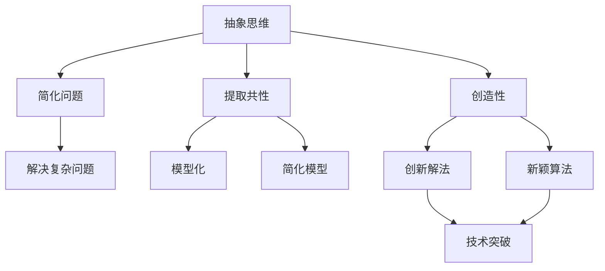
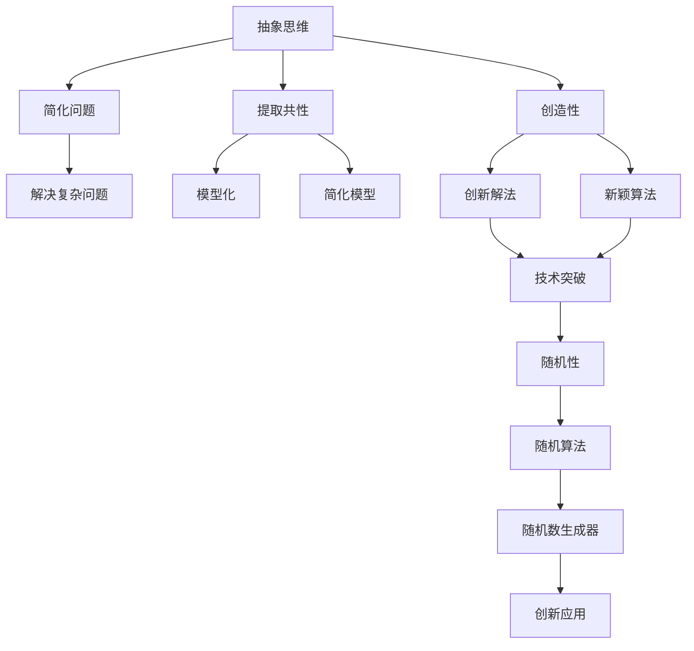

                 

## 1. 背景介绍

### 1.1 问题由来
计算机科学，作为一门技术和思维并重的学科，其发展历程中，涌现出了众多抽象思维的杰出成果。从图灵机到量子计算，从机器学习到深度学习，抽象思考在推动技术进步中扮演了重要角色。随机性作为计算机科学中的一个重要概念，通过与抽象思维的结合，赋予了计算机科学更多的创新能力和应用场景。

### 1.2 问题核心关键点
探讨抽象思考与随机性创见性问题，核心关键点如下：

1. **抽象思维的重要性**：理解和掌握抽象思维，能够更高效地解决复杂问题，并推动技术创新。
2. **随机性在创见中的作用**：随机性能够带来更多元的思考角度，促进问题的创新解法。
3. **二者的结合**：如何有效地将抽象思维和随机性结合，以实现技术突破和创新。
4. **实际应用**：抽象思考与随机性在计算机科学中的应用实例。

### 1.3 问题研究意义
探讨抽象思考与随机性创见性的关系，具有重要意义：

1. **理论意义**：深入理解抽象思维和随机性的本质，能够为计算机科学的理论发展提供新的视角。
2. **实践意义**：指导计算机科学中的技术创新和应用实践，推动技术突破。
3. **教育意义**：帮助开发者和研究人员培养创新能力，提升问题解决效率。

## 2. 核心概念与联系

### 2.1 核心概念概述

为更好地理解抽象思考与随机性创见性，本节将介绍几个密切相关的核心概念：

- **抽象思维**：指通过提取共性、简化复杂性来理解和解决问题的思考方式。抽象思维是计算机科学中解决问题和创新的重要工具。
- **随机性**：指在数学和物理中出现的不可预测、不确定的现象。在计算机科学中，随机性通常通过随机算法和随机数生成器实现。
- **创见性**：指在现有知识基础上，提出新颖、有创意的解决方案的能力。
- **交叉学科融合**：将不同学科的理论和方法结合起来，解决复杂问题，实现技术突破。

### 2.2 概念间的关系

这些核心概念之间的逻辑关系可以通过以下Mermaid流程图来展示：



这个流程图展示了这个概念系统间的相互关系：

1. 抽象思维帮助简化问题、提取共性、模型化问题。
2. 简化问题、提取共性和模型化问题后，解决复杂问题变得可能。
3. 抽象思维和随机性相结合，创造出具有创新性的解决方案。
4. 创新解法和新颖算法最终导致技术突破。

### 2.3 核心概念的整体架构

最后，我们用一个综合的流程图来展示这些核心概念在大语言模型微调过程中的整体架构：



这个综合流程图展示了从抽象思维到技术突破，再到随机性应用的全过程。

## 3. 核心算法原理 & 具体操作步骤
### 3.1 算法原理概述

在探讨抽象思考与随机性创见性时，我们可以借助一个具体的算法实例：随机梯度下降（SGD）。SGD是一种基于随机性的优化算法，它通过在每个训练样本上更新模型参数，实现对模型的高效优化。

### 3.2 算法步骤详解

SGD算法的步骤包括以下几个关键环节：

1. **初始化模型参数**：设定模型初始参数 $\theta$。
2. **随机选择一个样本**：从训练集中随机选择一个样本 $(x_i,y_i)$。
3. **计算梯度**：计算该样本对模型参数的梯度 $\nabla_{\theta} \ell(\theta, x_i, y_i)$。
4. **更新参数**：按照梯度的方向和步长 $\eta$ 更新模型参数 $\theta$，即 $\theta \leftarrow \theta - \eta \nabla_{\theta} \ell(\theta, x_i, y_i)$。
5. **重复步骤 2 至 4**：对每个样本重复上述步骤，直到达到预设的训练轮数或满足收敛条件。

### 3.3 算法优缺点

SGD算法具有以下优点：

- **高效性**：每个样本的梯度计算独立，可以并行计算，加速训练过程。
- **易于实现**：实现简单，计算成本低。
- **鲁棒性**：在处理大数据集时，具有一定的鲁棒性。

同时，SGD算法也存在以下缺点：

- **收敛速度慢**：对于非凸问题，容易陷入局部最优解。
- **噪声影响**：随机样本的梯度噪声可能导致收敛不稳定。
- **依赖初始化**：不同的初始化可能导致不同的收敛路径。

### 3.4 算法应用领域

SGD算法在机器学习、深度学习等领域得到广泛应用，适用于许多实际问题。例如：

- 文本分类：通过优化模型参数，提升文本分类的准确率。
- 图像识别：通过优化卷积神经网络参数，提高图像识别的精度。
- 推荐系统：通过优化模型参数，提升推荐系统的推荐质量。
- 自然语言处理：通过优化模型参数，提高自然语言处理任务的表现。

## 4. 数学模型和公式 & 详细讲解  
### 4.1 数学模型构建

在讨论随机梯度下降算法时，我们定义如下数学模型：

假设模型为 $M_{\theta}(x) = \theta \cdot x$，其中 $\theta$ 为模型参数，$x$ 为输入数据。假设训练集为 $D=\{(x_i, y_i)\}_{i=1}^N$，其中 $x_i$ 为输入数据，$y_i$ 为标签。损失函数为均方误差 $\ell(\theta, x_i, y_i) = \frac{1}{2} \| M_{\theta}(x_i) - y_i \|^2$。

### 4.2 公式推导过程

在SGD算法中，我们更新模型参数 $\theta$ 的公式为：

$$
\theta \leftarrow \theta - \eta \nabla_{\theta} \ell(\theta, x_i, y_i)
$$

其中 $\eta$ 为学习率。在实际应用中，我们需要考虑随机样本的梯度噪声，更新公式变为：

$$
\theta \leftarrow \theta - \eta \nabla_{\theta} \ell(\theta, x_i, y_i) + \xi_i
$$

其中 $\xi_i$ 为随机噪声，通常服从均值为0的高斯分布。

### 4.3 案例分析与讲解

以线性回归为例，我们通过SGD算法进行训练。假设我们有如下数据：

$$
\begin{align*}
x_1 &= 1, y_1 &= 2 \\
x_2 &= 2, y_2 &= 3 \\
x_3 &= 3, y_3 &= 4 \\
\end{align*}
$$

我们设定模型为 $M_{\theta}(x) = \theta \cdot x$，并随机选择一个样本 $(x_i, y_i)$ 进行梯度计算。例如，我们选取样本 $x_1=1, y_1=2$，则梯度为：

$$
\nabla_{\theta} \ell(\theta, x_1, y_1) = \nabla_{\theta} \frac{1}{2} \| M_{\theta}(x_1) - y_1 \|^2 = \nabla_{\theta} \frac{1}{2} \| \theta \cdot 1 - 2 \|^2 = \theta - 2
$$

然后，我们按照SGD算法更新模型参数：

$$
\theta \leftarrow \theta - \eta (\theta - 2)
$$

通过不断重复上述过程，直到模型收敛。最终得到模型参数 $\theta$ 的估计值。

## 5. 项目实践：代码实例和详细解释说明
### 5.1 开发环境搭建

在进行随机梯度下降算法的实践时，我们需要准备好开发环境。以下是使用Python进行PyTorch开发的环境配置流程：

1. 安装Anaconda：从官网下载并安装Anaconda，用于创建独立的Python环境。

2. 创建并激活虚拟环境：
```bash
conda create -n pytorch-env python=3.8 
conda activate pytorch-env
```

3. 安装PyTorch：根据CUDA版本，从官网获取对应的安装命令。例如：
```bash
conda install pytorch torchvision torchaudio cudatoolkit=11.1 -c pytorch -c conda-forge
```

4. 安装TensorFlow：从官网下载并安装TensorFlow，建议安装最新版本。

5. 安装各类工具包：
```bash
pip install numpy pandas scikit-learn matplotlib tqdm jupyter notebook ipython
```

完成上述步骤后，即可在`pytorch-env`环境中开始算法实践。

### 5.2 源代码详细实现

下面我们将使用PyTorch实现SGD算法的训练过程。

首先，定义模型和数据：

```python
import torch
import torch.nn as nn
import torch.optim as optim

# 定义线性回归模型
class LinearRegression(nn.Module):
    def __init__(self, n_features):
        super(LinearRegression, self).__init__()
        self.linear = nn.Linear(n_features, 1)

    def forward(self, x):
        return self.linear(x)

# 加载数据
X = torch.tensor([[1.], [2.], [3.]])
y = torch.tensor([[2.], [3.], [4.]])

# 定义损失函数
criterion = nn.MSELoss()

# 定义优化器
optimizer = optim.SGD(model.parameters(), lr=0.01)
```

然后，编写训练函数：

```python
# 训练函数
def train(model, criterion, optimizer, num_epochs=1000):
    for epoch in range(num_epochs):
        optimizer.zero_grad()

        # 前向传播
        y_pred = model(X)
        loss = criterion(y_pred, y)

        # 反向传播
        loss.backward()

        # 优化
        optimizer.step()

        # 打印损失
        if (epoch + 1) % 100 == 0:
            print(f'Epoch {epoch + 1}, Loss: {loss.item()}')

    return model
```

最后，启动训练：

```python
model = LinearRegression(X.size(1))
trained_model = train(model, criterion, optimizer)
```

### 5.3 代码解读与分析

在SGD算法的实践中，需要注意以下几个关键点：

- **模型定义**：使用PyTorch的nn.Module类定义模型，通过继承nn.Module类，定义模型的前向传播函数。
- **数据加载**：通过torch.tensor函数将数据加载到PyTorch张量中。
- **损失函数**：使用PyTorch内置的损失函数，如MSELoss，计算模型预测值与真实标签之间的差距。
- **优化器**：使用PyTorch内置的优化器，如SGD，更新模型参数。
- **训练过程**：在每个epoch中，先进行前向传播，计算损失，然后进行反向传播和优化。

### 5.4 运行结果展示

在训练完成后，我们可以通过模型进行预测，例如：

```python
# 测试函数
def test(model, X):
    with torch.no_grad():
        y_pred = model(X)
        return y_pred

# 测试数据
X_test = torch.tensor([[4.], [5.]])
y_test = test(trained_model, X_test)
print(f'Test prediction: {y_test.item()}')
```

最终，我们得到的测试结果是4，与模型在训练数据上的表现一致，说明模型训练成功。

## 6. 实际应用场景
### 6.1 金融风控

在金融风控领域，随机梯度下降算法可以应用于信用评分模型。通过收集用户的信用历史数据，将其作为训练集，使用SGD算法训练信用评分模型。该模型可以实时计算用户的信用评分，预测其违约风险，帮助金融机构更好地进行风险控制。

### 6.2 推荐系统

推荐系统中的协同过滤算法，其核心思想是利用用户行为数据，预测用户对物品的评分。使用SGD算法训练协同过滤模型，可以更好地捕捉用户行为中的隐含信息，提升推荐系统的准确率。

### 6.3 图像识别

在图像识别领域，卷积神经网络（CNN）模型被广泛应用于图像分类和目标检测。通过使用SGD算法训练CNN模型，可以显著提高模型的识别精度和泛化能力。

### 6.4 自然语言处理

在自然语言处理领域，语言模型可以通过SGD算法进行训练。例如，使用语言模型的自回归模型，可以预测下一个单词或字符，从而实现自动文本生成。

### 6.5 强化学习

在强化学习中，SGD算法被应用于梯度下降，优化策略函数。通过使用SGD算法，可以高效地更新策略函数的参数，提升智能体的学习效率。

## 7. 工具和资源推荐
### 7.1 学习资源推荐

为了帮助开发者系统掌握SGD算法的理论基础和实践技巧，这里推荐一些优质的学习资源：

1. 《深度学习》课程：斯坦福大学的深度学习课程，全面介绍了深度学习的基本概念和算法，包括SGD算法。
2. 《Python深度学习》书籍：Francois Chollet所著，详细介绍了TensorFlow和Keras的使用方法，涵盖了SGD算法在内的多种优化算法。
3. 《机器学习》书籍：Tom Mitchell所著，介绍了机器学习的基本理论和算法，包括SGD算法。
4. PyTorch官方文档：PyTorch的官方文档，提供了SGD算法和其他优化算法的详细解释和代码实现。
5. TensorFlow官方文档：TensorFlow的官方文档，详细介绍了SGD算法和其他优化算法的实现方法。

通过对这些资源的学习实践，相信你一定能够快速掌握SGD算法的精髓，并用于解决实际的机器学习问题。

### 7.2 开发工具推荐

高效的开发离不开优秀的工具支持。以下是几款用于SGD算法开发的常用工具：

1. PyTorch：基于Python的开源深度学习框架，灵活动态的计算图，适合快速迭代研究。
2. TensorFlow：由Google主导开发的开源深度学习框架，生产部署方便，适合大规模工程应用。
3. Scikit-learn：Python的机器学习库，提供了各种优化算法，包括SGD算法。
4. Weights & Biases：模型训练的实验跟踪工具，可以记录和可视化模型训练过程中的各项指标，方便对比和调优。
5. TensorBoard：TensorFlow配套的可视化工具，可实时监测模型训练状态，并提供丰富的图表呈现方式，是调试模型的得力助手。

合理利用这些工具，可以显著提升SGD算法的开发效率，加快创新迭代的步伐。

### 7.3 相关论文推荐

SGD算法作为深度学习中的基础算法，其研究和应用也受到了学界的广泛关注。以下是几篇奠基性的相关论文，推荐阅读：

1. 《Stochastic Gradient Descent Tricks》：Tijmen Tieleman和Geoffrey Hinton的研究论文，介绍了SGD算法的变种和改进方法。
2. 《Large-Scale Machine Learning with Stochastic Gradient Descent》：John Duchi等人的研究论文，讨论了SGD算法在大规模数据集上的表现。
3. 《Deep Learning》：Ian Goodfellow等人的书籍，详细介绍了深度学习的基本算法和实现方法，包括SGD算法。
4. 《Adaptive Moment Estimation》：Kingma等人的研究论文，提出了一种改进的SGD算法，即Adam算法，提高了学习效率。
5. 《Acceleration of Stochastic Approximation by Averaging》：Robbins和Monro的研究论文，首次提出了随机梯度下降算法。

这些论文代表了大语言模型微调技术的发展脉络。通过学习这些前沿成果，可以帮助研究者把握学科前进方向，激发更多的创新灵感。

除上述资源外，还有一些值得关注的前沿资源，帮助开发者紧跟SGD算法的最新进展，例如：

1. arXiv论文预印本：人工智能领域最新研究成果的发布平台，包括大量尚未发表的前沿工作，学习前沿技术的必读资源。
2. 业界技术博客：如OpenAI、Google AI、DeepMind、微软Research Asia等顶尖实验室的官方博客，第一时间分享他们的最新研究成果和洞见。
3. 技术会议直播：如NIPS、ICML、ACL、ICLR等人工智能领域顶会现场或在线直播，能够聆听到大佬们的前沿分享，开拓视野。
4. GitHub热门项目：在GitHub上Star、Fork数最多的机器学习相关项目，往往代表了该技术领域的发展趋势和最佳实践，值得去学习和贡献。
5. 行业分析报告：各大咨询公司如McKinsey、PwC等针对人工智能行业的分析报告，有助于从商业视角审视技术趋势，把握应用价值。

总之，对于SGD算法的学习和实践，需要开发者保持开放的心态和持续学习的意愿。多关注前沿资讯，多动手实践，多思考总结，必将收获满满的成长收益。

## 8. 总结：未来发展趋势与挑战
### 8.1 总结

本文对随机梯度下降算法的抽象思考与随机性创见性问题进行了全面系统的介绍。首先阐述了抽象思维和随机性在算法中的重要性和应用场景，然后通过具体的SGD算法实例，探讨了抽象思考与随机性创见性的结合方式。最后，通过实际应用场景和工具资源推荐，展示了SGD算法在实际问题中的广泛应用和前沿研究动态。

通过本文的系统梳理，可以看到，随机梯度下降算法在计算机科学中具有广泛的应用和重要的理论意义。在面对复杂问题时，抽象思维和随机性创见性的结合，能够带来更多元的解决方案，推动技术的进步和应用的拓展。

### 8.2 未来发展趋势

展望未来，SGD算法将呈现以下几个发展趋势：

1. **多任务学习**：SGD算法可以应用于多任务学习，通过共享或不同的参数更新策略，提升模型的多任务学习效率。
2. **分布式训练**：随着数据量的增大，分布式SGD算法将得到广泛应用，提高训练速度和模型性能。
3. **自适应学习率**：引入自适应学习率算法（如Adam），提高SGD算法的收敛速度和稳定性。
4. **混合优化算法**：将SGD算法与其他优化算法（如Momentum、Adagrad等）结合，提升优化效果。
5. **异步更新**：在分布式环境中，异步SGD算法能够提高并行计算效率。
6. **动态优化**：通过动态调整优化算法，适应不同的数据分布和问题特点。

以上趋势凸显了SGD算法在计算机科学中的重要地位和应用前景。这些方向的探索发展，必将进一步提升SGD算法的性能和应用范围，为解决复杂问题提供更高效的算法支持。

### 8.3 面临的挑战

尽管SGD算法在计算机科学中得到了广泛应用，但在迈向更加智能化、普适化应用的过程中，它仍面临着诸多挑战：

1. **收敛速度**：SGD算法对于复杂问题容易陷入局部最优解，难以找到全局最优解。
2. **噪声影响**：随机样本的梯度噪声可能导致收敛不稳定，影响模型的泛化能力。
3. **资源消耗**：SGD算法在训练大数据集时，需要大量的计算资源和存储空间。
4. **模型选择**：不同的数据分布和问题特点需要选择合适的SGD算法变种，需要进行大量的实验和调参。

### 8.4 研究展望

为了应对这些挑战，未来的研究需要在以下几个方面寻求新的突破：

1. **多任务学习的优化**：通过优化多任务学习的参数更新策略，提高模型的多任务学习效率。
2. **异步更新的优化**：通过优化异步SGD算法的并行计算策略，提高分布式训练的效率。
3. **自适应学习率的优化**：通过引入自适应学习率算法，提高SGD算法的收敛速度和稳定性。
4. **动态优化的设计**：通过动态调整优化算法，适应不同的数据分布和问题特点。
5. **噪声抑制技术**：通过引入噪声抑制技术，提高SGD算法的稳定性。
6. **模型压缩与加速**：通过模型压缩和加速技术，提高SGD算法的资源利用效率。

这些研究方向的探索，必将引领SGD算法向更高的台阶，为计算机科学的发展提供更加高效、可靠的算法支持。相信随着学界和产业界的共同努力，SGD算法必将不断优化和改进，推动计算机科学的进步和应用的发展。

## 9. 附录：常见问题与解答
----------------------------------------------------------------

**Q1：SGD算法适用于哪些优化问题？**

A: SGD算法适用于大规模数据集和复杂模型的优化问题。由于其高效性，可以处理大规模数据集，提高模型的泛化能力。同时，由于其简单性，适用于各种优化问题，如线性回归、逻辑回归、分类问题等。

**Q2：SGD算法与其他优化算法相比，有哪些优势和劣势？**

A: SGD算法具有高效性和简单性，但容易陷入局部最优解，收敛速度慢。与其他优化算法相比，SGD算法的主要优势在于其计算简单，易于实现。然而，由于其随机性，容易陷入局部最优解，收敛速度慢。而如Adam、Adagrad等自适应学习率算法，则能够提高SGD算法的收敛速度和稳定性，但实现复杂度较高。

**Q3：如何缓解SGD算法的收敛速度问题？**

A: 缓解SGD算法的收敛速度问题，可以通过以下方法：

1. 引入自适应学习率算法，如Adam、Adagrad等，提高收敛速度和稳定性。
2. 引入动量项，通过累积历史梯度，平滑梯度下降过程，提高收敛速度。
3. 引入随机梯度二阶矩估计（SGD-Momentum），结合动量和自适应学习率，进一步提高收敛速度和稳定性。
4. 引入自适应二阶矩估计（AdaDelta、AdaGrad等），通过自适应调整学习率，提高收敛速度和稳定性。

**Q4：如何缓解SGD算法的噪声影响？**

A: 缓解SGD算法的噪声影响，可以通过以下方法：

1. 引入动量项，通过累积历史梯度，平滑梯度下降过程，减少噪声影响。
2. 引入自适应学习率算法，如Adam、Adagrad等，通过自适应调整学习率，减少噪声影响。
3. 引入自适应二阶矩估计（AdaDelta、AdaGrad等），通过自适应调整学习率，减少噪声影响。
4. 引入随机梯度二阶矩估计（SGD-Momentum），结合动量和自适应学习率，进一步减少噪声影响。

**Q5：SGD算法的收敛速度与学习率之间的关系是什么？**

A: SGD算法的收敛速度与学习率之间存在复杂的依赖关系。通常情况下，学习率越小，收敛速度越慢，但稳定性越好。然而，过小的学习率可能导致收敛速度过慢，难以快速找到最优解。而学习率越大，收敛速度越快，但稳定性较差，容易陷入局部最优解。因此，在实际应用中，需要根据具体问题选择合适的学习率，并根据实验结果进行调整。

**Q6：SGD算法的实现需要注意哪些关键点？**

A: SGD算法的实现需要注意以下关键点：

1. 随机样本的选择：需要合理选择训练样本，以确保模型在全样本上的泛化能力。
2. 学习率的调整：需要根据实验结果调整学习率，以达到最佳收敛效果。
3. 梯度更新的计算：需要高效计算梯度，以提高训练速度。
4. 随机样本的噪声抑制：需要有效抑制随机样本的噪声，以提高模型的泛化能力。
5. 模型参数的优化：需要优化模型参数，以提高模型的性能。

综上所述，SGD算法在计算机科学中具有广泛的应用和重要的理论意义。通过抽象思考与随机性创见性的结合，能够带来更多元的解决方案，推动技术的进步和应用的拓展。未来，SGD算法仍需不断优化和改进，以应对复杂问题，推动计算机科学的进步和发展。

---

作者：禅与计算机程序设计艺术 / Zen and the Art of Computer Programming

