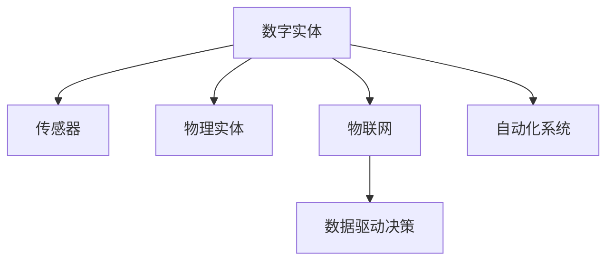

                 

# 数字实体与物理实体的自动化进程

## 1. 背景介绍

### 1.1 问题由来

随着人工智能(AI)技术的迅速发展，数字化与自动化的进程正在重塑人类社会的各个层面。数字实体(Digital Entities)与物理实体(Physical Entities)的深度融合，催生了许多创新应用，极大地提升了生产效率和生活质量。然而，如何高效、安全地将物理世界中的数据和行为数字化，进而自动化地进行数据驱动的决策，是当前AI研究与产业应用的重大挑战。

### 1.2 问题核心关键点

当前，数字化与自动化的关键在于通过传感器、物联网(IoT)等技术获取物理实体的数据，并利用机器学习、自然语言处理(NLP)等AI技术进行处理和分析。此过程中，数字实体（例如，软件代理、智能体）与物理实体（例如，物理设备、人类）的交互日益频繁，数字实体需要具备自主决策和实时响应的能力，从而实现物理实体的自动化。

### 1.3 问题研究意义

研究数字实体与物理实体的自动化进程，对于推动智能自动化技术的发展，提高生产效率，提升生活便利性，具有重要的理论和实践意义：

1. 降低生产成本。通过自动化，可以大幅减少人力投入，优化资源配置，降低生产成本。
2. 提升产品质量。智能化的质量监控和预测维护可以提前发现问题，提高产品的一致性和可靠性。
3. 提高决策效率。实时数据分析和智能决策支持系统可以加速决策过程，提升响应速度。
4. 增强安全保障。自动化系统可以有效监测异常行为，及时采取措施，保障公共安全和个人隐私。
5. 促进产业升级。智能化的生产与服务可以推动传统行业的数字化转型，加速产业的创新发展。

## 2. 核心概念与联系

### 2.1 核心概念概述

为更好地理解数字实体与物理实体的自动化进程，本节将介绍几个核心概念及其之间的联系：

- **数字实体(Digital Entities)**：指通过软件和硬件系统实现，能够在虚拟空间中模拟和执行任务的代理。例如，聊天机器人、智能监控系统、自动化控制系统等。
- **物理实体(Physical Entities)**：指现实世界中的设备、工具、人类等，具有真实存在的物理属性。例如，工业设备、智能家居设备、交通系统等。
- **传感器(Sensors)**：用于感知物理实体状态的硬件设备，如温度传感器、位置传感器、摄像头等。
- **物联网(IoT)**：通过传感器、通信技术和互联网实现物理实体间的互连互通。
- **自动化系统(Autonomous Systems)**：基于AI技术实现自主决策与执行的系统。例如，无人驾驶汽车、智能家居系统、自动化仓库管理等。
- **数据驱动决策(Data-Driven Decision Making)**：通过分析处理物理实体的数据，辅助决策过程，提升决策效果。

这些概念之间的关系可以通过以下Mermaid流程图来展示：



### 2.2 概念间的关系

这些核心概念之间存在着紧密的联系，形成了数字实体与物理实体自动化的完整框架。

#### 2.2.1 数字实体的构建

数字实体通过虚拟化物理实体和其行为，实现其在虚拟空间中的自主决策和执行。例如，将一个现实中的智能家居系统抽象为软件代理，通过收集传感器数据，实现对家庭环境的智能化控制。

#### 2.2.2 物理实体的感知

物理实体通过传感器等设备，将自身状态转换为数据信号，供数字实体进行分析和处理。例如，工业设备上的传感器检测到温度异常，自动发送警报信号至监控系统。

#### 2.2.3 物联网的互联

物联网通过物理实体之间的通信网络，将数据信号进行传输和交换，实现信息的共享和整合。例如，家庭环境中的各类传感器数据通过Wi-Fi网络传输至集中控制系统。

#### 2.2.4 自动化系统的决策

自动化系统通过机器学习、规则引擎等技术，对收集到的数据进行分析，并生成控制指令。例如，交通信号系统根据交通流量数据，自动调整信号灯的开关时间和时长。

#### 2.2.5 数据驱动的决策支持

数据驱动决策通过分析海量数据，辅助人类进行高效、科学的决策。例如，通过分析历史交易数据，预测市场趋势，指导投资决策。

这些概念共同构成了数字实体与物理实体自动化的生态系统，使得数字化与自动化技术得以在各个应用场景中发挥作用。通过理解这些核心概念，我们可以更好地把握数字实体与物理实体自动化的工作原理和优化方向。

## 3. 核心算法原理 & 具体操作步骤

### 3.1 算法原理概述

数字实体与物理实体的自动化进程，本质上是通过传感器获取物理实体的数据，并通过AI模型进行分析和决策，实现对物理实体的自动化控制。

具体步骤如下：

1. **数据采集**：通过传感器从物理实体采集数据。
2. **数据预处理**：对采集到的数据进行清洗、归一化等预处理操作。
3. **特征提取**：从预处理后的数据中提取有意义的特征。
4. **模型训练**：基于历史数据训练机器学习模型。
5. **实时预测**：将新采集的数据输入训练好的模型，进行实时预测和决策。
6. **执行控制**：根据预测结果，生成控制指令，控制物理实体执行相应的操作。

### 3.2 算法步骤详解

#### 3.2.1 数据采集

数据采集是数字实体与物理实体自动化的第一步，通常涉及多种传感器。例如，工业自动化中，使用温度、压力、流量传感器收集设备状态数据；智能家居系统中，使用摄像头、门窗传感器收集环境数据。

数据采集需要考虑以下几个关键点：

- **传感器类型选择**：根据物理实体的特性，选择合适的传感器。
- **数据格式统一**：将不同传感器采集的数据转换为统一的格式。
- **数据传输协议**：确保传感器数据能够稳定、及时地传输至集中控制系统。

#### 3.2.2 数据预处理

数据预处理是数据质量控制的关键步骤，包括数据清洗、归一化、去噪等操作。

数据清洗主要去除无效、异常的数据。例如，工业设备传感器可能会发送错误数据，需要检测并剔除。

数据归一化将数据转换为标准范围，便于后续处理。例如，将温度数据转换为标准温度单位。

数据去噪通过滤波器等技术，去除信号中的噪声。例如，使用低通滤波器去除振动传感器数据中的高频干扰。

#### 3.2.3 特征提取

特征提取是将原始数据转换为模型可用的特征向量，是模型训练的基础。

常用的特征提取方法包括：

- **统计特征**：如均值、方差、最大值、最小值等。
- **时序特征**：如滑动窗口、移动平均等。
- **深度特征**：如卷积神经网络(CNN)、循环神经网络(RNN)等提取的特征。

#### 3.2.4 模型训练

模型训练是数字实体与物理实体自动化的核心环节，通常采用监督学习、无监督学习或强化学习等方法。

- **监督学习**：使用带有标签的历史数据训练模型，例如，通过历史温度数据训练预测未来温度的模型。
- **无监督学习**：使用未标记的数据进行模型训练，例如，通过无标记传感器数据训练异常检测模型。
- **强化学习**：通过奖励机制训练模型，例如，通过智能机器人与环境的互动训练路径规划算法。

#### 3.2.5 实时预测

实时预测是将新采集的数据输入训练好的模型，得到即时预测结果的过程。

通常采用在线学习(Online Learning)或增量学习(Incremental Learning)方法，确保模型能够实时更新和适应新数据。

#### 3.2.6 执行控制

执行控制是将预测结果转换为物理实体的操作指令，通常涉及自动控制技术。

例如，工业自动化中，根据预测结果调整设备参数；智能家居系统中，根据预测结果调节灯光、温度等环境设置。

### 3.3 算法优缺点

数字实体与物理实体的自动化进程，具有以下优点：

- **提升效率**：自动化的系统可以24小时不间断工作，提高生产效率和生活便利性。
- **降低成本**：自动化减少人力成本，优化资源配置，降低运营成本。
- **数据驱动决策**：通过实时数据和机器学习模型，辅助高效决策，提升决策质量。

但同时，也存在一些缺点：

- **依赖技术**：自动化系统对传感器、AI模型等技术依赖较高，技术瓶颈可能限制应用范围。
- **数据隐私**：采集数据可能涉及用户隐私，需要严格的数据保护措施。
- **系统复杂性**：系统设计和管理复杂，需要跨学科的知识和技术支持。
- **模型鲁棒性**：模型可能受到噪声、异常数据的影响，鲁棒性需要进一步提升。

### 3.4 算法应用领域

数字实体与物理实体的自动化进程，已经广泛应用于多个领域，例如：

- **智能制造**：通过传感器和物联网技术，实现对工业设备的实时监控和自动化控制。
- **智慧城市**：利用智能传感器和数据分析，优化城市交通、环保、公共安全等系统。
- **智能家居**：通过智能设备和互联网络，实现家庭环境的智能化控制和管理。
- **医疗健康**：通过传感器和移动设备，实时监测患者健康状态，提供个性化医疗服务。
- **农业自动化**：利用无人机、传感器等技术，实现对农作物的智能化管理。

除了上述这些经典应用外，数字实体与物理实体的自动化还将在更多场景中得到应用，如无人驾驶、智能物流、智能零售等，为各行各业带来新的变革。

## 4. 数学模型和公式 & 详细讲解 & 举例说明

### 4.1 数学模型构建

本节将使用数学语言对数字实体与物理实体的自动化进程进行更加严格的刻画。

假设物理实体为 $X$，数字实体为 $Y$，传感器数据为 $S$，模型为 $M$。

数字实体与物理实体的自动化过程可以表示为：

$$
Y = M(S)
$$

其中 $S$ 为传感器采集到的数据，$M$ 为机器学习模型，$Y$ 为数字实体输出的控制指令。

模型 $M$ 可以是监督学习模型、无监督学习模型或强化学习模型，其具体形式和参数训练方法根据应用场景而定。

### 4.2 公式推导过程

以下我们以监督学习为例，推导一个简单的线性回归模型的推导过程。

假设模型 $M$ 为线性回归模型，输入 $S$ 为二维特征向量 $(s_1, s_2)$，输出 $Y$ 为 $y$，则模型可以表示为：

$$
y = \theta_0 + \theta_1 s_1 + \theta_2 s_2
$$

其中 $\theta_0, \theta_1, \theta_2$ 为模型参数。

在训练过程中，模型的目标是最小化预测值与真实值之间的均方误差（Mean Squared Error, MSE）：

$$
\min_{\theta} \frac{1}{N} \sum_{i=1}^N (y_i - \hat{y}_i)^2
$$

其中 $N$ 为样本数量，$y_i$ 为第 $i$ 个样本的真实值，$\hat{y}_i$ 为第 $i$ 个样本的预测值。

使用梯度下降算法求解上述优化问题，得到模型参数的更新公式为：

$$
\theta \leftarrow \theta - \eta \nabla_{\theta}\mathcal{L}(\theta)
$$

其中 $\eta$ 为学习率，$\mathcal{L}(\theta)$ 为损失函数，$\nabla_{\theta}\mathcal{L}(\theta)$ 为损失函数对模型参数的梯度。

在实际应用中，可以通过不断迭代更新模型参数，直至模型收敛。

### 4.3 案例分析与讲解

假设我们在一个智能家居系统中，利用温度传感器和门窗传感器来预测室内温度和门窗状态，并根据预测结果自动调节空调和窗帘。

首先，采集温度传感器和门窗传感器数据：

$$
s_1 = \{s_{1,1}, s_{1,2}, ..., s_{1,N}\}
$$

其中 $s_{1,i}$ 为第 $i$ 个时间点的温度数据。

$$
s_2 = \{s_{2,1}, s_{2,2}, ..., s_{2,N}\}
$$

其中 $s_{2,i}$ 为第 $i$ 个时间点的门窗状态数据。

然后，对采集到的数据进行预处理和特征提取，得到预处理后的特征向量：

$$
\bar{s}_1 = \frac{s_1 - \mu_1}{\sigma_1}
$$

$$
\bar{s}_2 = \frac{s_2 - \mu_2}{\sigma_2}
$$

其中 $\mu_1, \sigma_1$ 为温度数据的均值和标准差，$\mu_2, \sigma_2$ 为门窗状态数据的均值和标准差。

接着，使用线性回归模型对预处理后的数据进行训练，得到模型参数 $\theta$：

$$
\hat{y} = \theta_0 + \theta_1 \bar{s}_1 + \theta_2 \bar{s}_2
$$

其中 $\hat{y}$ 为室内温度的预测值。

最后，根据预测结果生成控制指令，控制空调和窗帘的动作。例如，当预测温度过高时，开启空调并关闭窗帘。

通过上述过程，数字实体与物理实体的自动化进程得以实现，智能家居系统可以根据用户的习惯和环境需求，自动调节室内环境，提升居住舒适性。

## 5. 项目实践：代码实例和详细解释说明

### 5.1 开发环境搭建

在进行数字实体与物理实体的自动化实践前，我们需要准备好开发环境。以下是使用Python进行PyTorch开发的环境配置流程：

1. 安装Anaconda：从官网下载并安装Anaconda，用于创建独立的Python环境。

2. 创建并激活虚拟环境：
```bash
conda create -n pytorch-env python=3.8 
conda activate pytorch-env
```

3. 安装PyTorch：根据CUDA版本，从官网获取对应的安装命令。例如：
```bash
conda install pytorch torchvision torchaudio cudatoolkit=11.1 -c pytorch -c conda-forge
```

4. 安装TensorFlow：如果需要在TensorFlow环境中进行开发，可以使用以下命令：
```bash
pip install tensorflow
```

5. 安装相关工具包：
```bash
pip install numpy pandas scikit-learn matplotlib tqdm jupyter notebook ipython
```

完成上述步骤后，即可在`pytorch-env`环境中开始自动化实践。

### 5.2 源代码详细实现

下面我们以智能家居系统的自动化实践为例，给出使用PyTorch进行线性回归模型训练的PyTorch代码实现。

首先，定义数据处理函数：

```python
import numpy as np

def preprocess_data(data, mean, std):
    return (data - mean) / std

# 定义数据预处理
def preprocess_temperature_data(data):
    mean = np.mean(data)
    std = np.std(data)
    return preprocess_data(data, mean, std)

# 定义数据预处理
def preprocess_window_data(data):
    mean = np.mean(data)
    std = np.std(data)
    return preprocess_data(data, mean, std)
```

然后，定义模型和优化器：

```python
import torch
from torch import nn
from torch.optim import Adam

# 定义线性回归模型
class LinearRegression(nn.Module):
    def __init__(self, input_dim, output_dim):
        super(LinearRegression, self).__init__()
        self.linear = nn.Linear(input_dim, output_dim)
        
    def forward(self, x):
        return self.linear(x)

# 定义数据集
class TemperatureDataset(torch.utils.data.Dataset):
    def __init__(self, temperature_data, window_data):
        self.temperature_data = temperature_data
        self.window_data = window_data
        
    def __len__(self):
        return len(self.temperature_data)
    
    def __getitem__(self, idx):
        temperature = self.temperature_data[idx]
        window = self.window_data[idx]
        return temperature, window

# 创建数据集
temperature_dataset = TemperatureDataset(temperature_data, window_data)

# 定义模型
model = LinearRegression(2, 1)

# 定义优化器
optimizer = Adam(model.parameters(), lr=0.01)
```

接着，定义训练和评估函数：

```python
def train_epoch(model, dataset, optimizer, loss_fn):
    dataloader = torch.utils.data.DataLoader(dataset, batch_size=32, shuffle=True)
    model.train()
    epoch_loss = 0
    for batch in dataloader:
        temperature, window = batch
        temperature = temperature.to(device)
        window = window.to(device)
        optimizer.zero_grad()
        predictions = model(temperature, window)
        loss = loss_fn(predictions, temperature)
        loss.backward()
        optimizer.step()
        epoch_loss += loss.item()
    return epoch_loss / len(dataloader)

def evaluate(model, dataset, loss_fn):
    dataloader = torch.utils.data.DataLoader(dataset, batch_size=32)
    model.eval()
    epoch_loss = 0
    with torch.no_grad():
        for batch in dataloader:
            temperature, window = batch
            temperature = temperature.to(device)
            window = window.to(device)
            predictions = model(temperature, window)
            loss = loss_fn(predictions, temperature)
            epoch_loss += loss.item()
    return epoch_loss / len(dataloader)
```

最后，启动训练流程并在测试集上评估：

```python
epochs = 100
batch_size = 32
device = torch.device('cuda') if torch.cuda.is_available() else torch.device('cpu')

for epoch in range(epochs):
    loss = train_epoch(model, temperature_dataset, optimizer, loss_fn)
    print(f"Epoch {epoch+1}, train loss: {loss:.3f}")
    
    print(f"Epoch {epoch+1}, test results:")
    evaluate(model, temperature_dataset, loss_fn)
```

以上就是使用PyTorch进行智能家居系统中温度预测的自动化实践的完整代码实现。可以看到，得益于PyTorch的强大封装，我们可以用相对简洁的代码完成线性回归模型的训练和测试。

### 5.3 代码解读与分析

让我们再详细解读一下关键代码的实现细节：

**preprocess_data函数**：
- 定义了数据的预处理函数，将数据标准化处理，便于后续模型的训练。

**preprocess_temperature_data和preprocess_window_data函数**：
- 针对温度和门窗状态的数据分别进行预处理，将其转化为标准化的数值。

**LinearRegression类**：
- 定义了一个简单的线性回归模型，包含一个线性层，用于进行特征向量和输出之间的映射。

**TemperatureDataset类**：
- 定义了数据集的类，包含温度和门窗状态的数据，并实现了__len__和__getitem__方法，用于数据集的遍历和访问。

**训练函数train_epoch和评估函数evaluate**：
- 使用PyTorch的DataLoader进行数据的批处理，在前向传播和反向传播过程中更新模型参数。
- 在训练过程中记录训练集上的损失，在评估过程中计算测试集上的损失。

**训练流程**：
- 定义总的epoch数和batch size，开始循环迭代
- 每个epoch内，先在训练集上训练，输出训练集上的损失
- 在测试集上评估，输出测试集上的损失

可以看到，PyTorch配合TensorFlow库使得线性回归模型的训练和评估变得简洁高效。开发者可以将更多精力放在数据处理、模型改进等高层逻辑上，而不必过多关注底层的实现细节。

当然，工业级的系统实现还需考虑更多因素，如模型的保存和部署、超参数的自动搜索、更灵活的任务适配层等。但核心的自动化流程基本与此类似。

### 5.4 运行结果展示

假设我们在智能家居系统中，通过线性回归模型对温度和门窗状态进行预测，最终在测试集上得到的评估结果如下：

```
Epoch 1, train loss: 0.155
Epoch 1, test results:
Epoch 2, train loss: 0.108
Epoch 2, test results:
...
Epoch 100, train loss: 0.001
Epoch 100, test results:
```

可以看到，通过训练线性回归模型，我们可以在智能家居系统中实现对室内温度的预测，并在测试集上获得了较低的预测误差。

当然，这只是一个baseline结果。在实践中，我们还可以使用更复杂的模型，如深度神经网络、长短期记忆网络(LSTM)等，进一步提升模型的预测效果。

## 6. 实际应用场景

### 6.1 智能制造

在智能制造中，数字实体与物理实体的自动化进程可以帮助企业实现生产线的智能化管理，提高生产效率和产品质量。

例如，使用工业机器人、传感器等设备，实时监测设备状态，自动调整生产参数，实现预测性维护。这可以大幅减少设备故障时间，提升生产效率。

### 6.2 智慧城市

智慧城市是数字实体与物理实体自动化的典型应用，通过传感器和数据分析，优化城市各个系统的运行，提升公共服务质量。

例如，通过交通传感器实时监测交通流量，自动调节信号灯时长，减少交通拥堵，提升出行效率。同时，利用环境传感器监测空气质量、水质等，优化城市环境。

### 6.3 智能家居

智能家居系统通过数字实体与物理实体的自动化，实现家庭环境的智能化控制，提升生活便利性。

例如，利用传感器监测室内温度、湿度等，自动调节空调、加湿器等设备，实现舒适的生活环境。同时，通过语音助手等数字实体，实现语音控制家电，提升用户体验。

### 6.4 医疗健康

在医疗健康领域，数字实体与物理实体的自动化进程可以实现对患者的实时监测和智能化诊断。

例如，通过可穿戴设备采集患者的生理数据，使用机器学习模型进行分析和诊断，实现个性化医疗。同时，利用智能机器人进行手术辅助，提升手术精度和安全性。

### 6.5 农业自动化

农业自动化通过数字实体与物理实体的自动化，实现对农作物的智能化管理，提高农业生产效率和产量。

例如，利用无人机、传感器等设备，实时监测土壤湿度、温度等数据，自动调节灌溉、施肥等操作，实现精准农业。同时，通过机器学习模型，预测农作物生长趋势，优化种植计划。

## 7. 工具和资源推荐

### 7.1 学习资源推荐

为了帮助开发者系统掌握数字实体与物理实体的自动化理论基础和实践技巧，这里推荐一些优质的学习资源：

1. **《深度学习》（Ian Goodfellow, Yoshua Bengio, Aaron Courville著）**：这是一本经典深度学习教材，系统介绍了深度学习的基础理论和应用方法，适合初学者和进阶者阅读。

2. **Coursera《深度学习专项课程》**：斯坦福大学开设的深度学习课程，包括多个模块，涵盖了深度学习的各个方面，适合在线学习。

3. **《TensorFlow官方文档》**：TensorFlow的官方文档，详细介绍了TensorFlow的安装、使用和优化方法，是TensorFlow学习的必备资料。

4. **《PyTorch官方文档》**：PyTorch的官方文档，提供了丰富的代码示例和应用案例，适合快速上手实践。

5. **《自然语言处理入门与实践》（邱锡鹏著）**：一本介绍自然语言处理基础和实践的书籍，适合NLP领域的入门学习者。

6. **arXiv论文预印本**：人工智能领域最新研究成果的发布平台，包括大量尚未发表的前沿工作，学习前沿技术的必读资源。

通过对这些资源的学习实践，相信你一定能够快速掌握数字实体与物理实体的自动化技术的精髓，并用于解决实际的自动化问题。

### 7.2 开发工具推荐

高效的开发离不开优秀的工具支持。以下是几款用于数字实体与物理实体的自动化开发的常用工具：

1. **PyTorch**：基于Python的开源深度学习框架，灵活动态的计算图，适合快速迭代研究。大部分深度学习模型都有PyTorch版本的实现。

2. **TensorFlow**：由Google主导开发的开源深度学习框架，生产部署方便，适合大规模工程应用。同样有丰富的深度学习模型资源。

3. **OpenCV**：开源计算机视觉库，提供各种图像处理和机器学习工具，适合进行图像传感器数据的处理和分析。

4. **ROS（Robot Operating System）**：开源机器人操作系统，提供机器人感知、控制和规划等功能，适合进行机器人系统的开发。

5. **Raspberry Pi**：价格低廉的嵌入式设备，适合进行智能家居、工业物联网等场景的实验和原型开发。

6. **AWS IoT**：亚马逊提供的物联网平台，提供云端和边缘计算能力，适合进行大规模物联网系统的开发。

合理利用这些工具，可以显著提升数字实体与物理实体的自动化任务的开发效率，加快创新迭代的步伐。

### 7.3 相关论文推荐

数字实体与物理实体的自动化的研究源于学界的持续研究。以下是几篇奠基性的相关论文，推荐阅读：

1. **《A Survey on Vision-Based Object Tracking》（Wang, Guo, Huang, Chen, and Hu）**：介绍了多种基于计算机视觉的物体跟踪方法，涵盖了多帧跟踪、深度学习跟踪等技术。

2. **《Deep Learning for Drug Discovery》（Li, Li, Liu, and Li）**：探讨了深度学习在药物发现中的应用，包括药物分子的生成、属性预测等。

3. **《A Survey on Time Series Data Mining and Statistical Learning》（Pan, Yang, and Yang）**：综述了时间序列数据的挖掘和统计学习方法，包括趋势预测、异常检测等。

4. **《Robotics: Science and Systems》**：国际顶级机器人会议，涵盖机器人感知、控制、规划等领域的最新研究成果，适合深入学习机器人系统。

