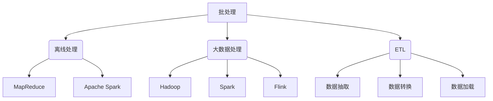
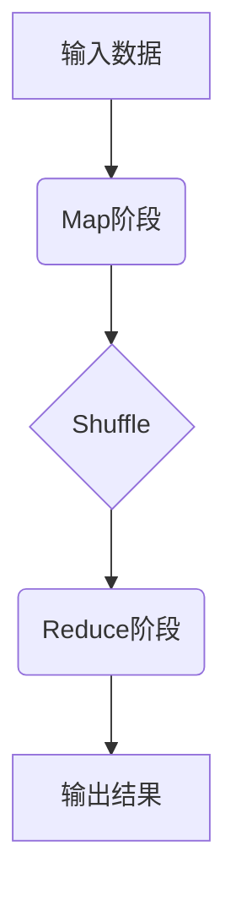

好的,我会严格遵循约束条件,以专业的技术语言写一篇有深度的技术博客文章。

# 【AI大数据计算原理与代码实例讲解】批处理

## 1. 背景介绍

### 1.1 问题的由来

在当今大数据时代,海量的数据每天都在被生成和积累。对于企业和组织机构来说,如何高效地处理这些数据,提取有价值的信息和见解,已经成为一个迫在眉睫的问题。传统的数据处理方式很难满足实时性、可扩展性和容错性等需求。因此,批处理(Batch Processing)作为一种可靠、高效的大数据处理方式,受到了广泛关注和应用。

### 1.2 研究现状

批处理最早起源于上世纪60年代的主框计算机系统,用于处理大量的业务数据,如银行交易记录、航空订票数据等。随着大数据时代的到来,批处理技术得到了长足发展,涌现出了MapReduce、Apache Spark、Apache Flink等多种批处理框架和系统。这些系统通过分布式计算、容错机制、优化算法等技术,显著提高了大数据处理的效率和可靠性。

### 1.3 研究意义

高效的批处理技术对于企业和组织机构来说意义重大:

1. **提高数据处理效率**:通过分布式计算和优化算法,可以显著缩短大数据处理的时间。
2. **降低计算成本**:利用资源调度和容错机制,可以更好地利用计算资源,降低硬件和运维成本。
3. **支持复杂分析**:批处理可以处理各种复杂的数据分析任务,如机器学习、图计算等,为企业决策提供有力支持。
4. **实现商业价值**:通过对海量数据的深入分析,可以发现新的商业机会,优化业务流程,提高竞争力。

### 1.4 本文结构

本文将全面介绍批处理的核心概念、算法原理、数学模型、实际应用以及相关工具和资源。内容包括:

- 核心概念与联系
- 核心算法原理与具体操作步骤
- 数学模型和公式详细讲解与案例分析
- 项目实践:代码实例和详细解释
- 实际应用场景
- 工具和资源推荐
- 总结:未来发展趋势与挑战
- 附录:常见问题与解答

## 2. 核心概念与联系

批处理(Batch Processing)是指将大量数据集中起来,作为一个逻辑单元进行处理。它主要包括以下几个核心概念:

1. **离线处理(Offline Processing)**: 批处理通常是一种离线处理模式,即先收集和存储数据,待数据积累到一定程度后再进行处理,处理完成后输出结果。这与实时处理(Stream Processing)形成对比。

2. **大数据处理(Big Data Processing)**: 批处理主要应用于大数据领域,用于高效处理海量数据,如日志数据、网络数据、交易数据等。

3. **ETL(Extract-Transform-Load)**: 批处理过程常常伴随着ETL,即数据抽取(Extract)、数据转换(Transform)和数据加载(Load)。ETL可以从不同的数据源提取数据,进行清洗、转换、富化等操作,最终加载到数据仓库或其他系统中。

4. **分布式计算框架**: 为了提高批处理的效率和可扩展性,通常采用分布式计算框架,如MapReduce、Apache Spark、Apache Flink等。这些框架能够在多台机器上并行执行计算任务,显著提升处理能力。

5. **容错和恢复机制**: 由于批处理任务通常耗时较长,为了确保计算的可靠性和容错性,分布式计算框架都提供了容错和恢复机制,如任务重试、故障转移等。

## 3. 核心算法原理与具体操作步骤

批处理的核心算法主要包括两个方面:分布式计算算法和数据处理算法。

### 3.1 算法原理概述

#### 分布式计算算法

分布式计算算法的主要目标是将计算任务拆分并行化,利用多台机器的计算资源,从而提高处理效率。常见的分布式计算模型包括:

1. **MapReduce模型**: 由Map阶段和Reduce阶段组成。Map阶段并行处理输入数据,生成中间结果;Reduce阶段对中间结果进行汇总和计算。

2. **DAG(Directed Acyclic Graph)模型**: 将计算任务表示为有向无环图,通过任务调度执行各个阶段的计算。Spark和Flink等采用这种模型。

3. **BSP(Bulk Synchronous Parallel)模型**: 将计算过程分为一系列超步(superstep),在每个超步中进行并行计算,并在超步之间进行全局同步和通信。

#### 数据处理算法

数据处理算法则关注如何高效地处理特定类型的数据和计算任务,包括:

1. **关系代数算法**: 用于处理结构化数据,如连接、聚合、过滤等操作。
2. **图算法**: 用于处理图结构数据,如PageRank、最短路径等。
3. **机器学习算法**: 用于从数据中训练模型,如逻辑回归、决策树等。
4. **数据挖掘算法**: 用于发现数据中的模式和规律,如频繁模式挖掘、聚类分析等。

### 3.2 算法步骤详解

以MapReduce为例,我们详细介绍批处理算法的具体步骤:

1. **Map阶段**:
    - 输入数据被拆分为多个数据块(Split),并分发到不同的Map Task上进行并行处理。
    - 每个Map Task将输入数据转换为键值对(Key-Value)形式,并对其执行用户自定义的Map函数。
    - Map函数的输出是一系列中间键值对。

2. **Shuffle阶段**:
    - 将Map阶段的输出按照键(Key)进行分组和排序。
    - 分组后的键值对被分区(Partition),并分发到不同的Reduce Task上。

3. **Reduce阶段**:
    - 每个Reduce Task获取一个分区,对其中的键值对执行用户自定义的Reduce函数。
    - Reduce函数将具有相同键的值进行合并和计算,生成最终的输出结果。

4. **输出结果**:
    - Reduce阶段的输出被写入分布式文件系统(如HDFS)或其他存储系统中。

在整个过程中,框架会自动处理任务调度、容错、数据移动等底层细节,开发人员只需要关注Map和Reduce函数的实现。

### 3.3 算法优缺点

批处理算法的主要优点包括:

1. **高吞吐量**:通过分布式并行计算,可以显著提高数据处理的吞吐量。
2. **容错性强**:具有良好的容错和恢复机制,计算任务可以在出现故障时自动重试或转移。
3. **成本低廉**:利用廉价的商用硬件即可构建大规模的计算集群,降低硬件和运维成本。
4. **编程模型简单**:如MapReduce提供了简单的编程接口,降低了开发难度。

批处理算法的主要缺点包括:

1. **高延迟**:需要等待所有数据积累完成后才能开始处理,存在较高的延迟。
2. **不适合流式处理**:对于持续不断产生的数据流,批处理的处理效率会受到影响。
3. **数据一致性问题**:在处理过程中,数据可能会被多次读写,导致一致性问题。
4. **资源利用率低**:在计算过程中,资源利用率会出现波动,存在资源浪费的情况。

### 3.4 算法应用领域

批处理算法广泛应用于以下领域:

1. **日志分析**:处理网站访问日志、应用程序日志等,用于分析用户行为、系统性能等。
2. **数据仓库构建**:从各种数据源提取、转换和加载数据,构建企业数据仓库。
3. **推荐系统**:分析用户行为数据,构建推荐模型,为用户提供个性化推荐服务。
4. **风险控制**:分析金融交易数据、反欺诈数据等,用于风险评估和防范。
5. **基因组学**:处理基因测序数据,用于基因分析和疾病研究。
6. **科学计算**:处理气象、天文等科学数据,用于模拟和预测。

## 4. 数学模型和公式详细讲解与举例说明

批处理算法中常常涉及到数学模型和公式,用于描述和优化计算过程。我们将详细介绍几个常见的数学模型和公式。

### 4.1 数学模型构建

#### 向量空间模型(VSM)

向量空间模型常用于文本挖掘和信息检索领域,将文本表示为向量,方便进行相似性计算和聚类分析。

假设我们有一个文档集合$D=\{d_1,d_2,...,d_n\}$,词汇表$V=\{t_1,t_2,...,t_m\}$,则文档$d_i$可以表示为一个$m$维向量:

$$\vec{d_i}=(w_{i1},w_{i2},...,w_{im})$$

其中$w_{ij}$表示词项$t_j$在文档$d_i$中的权重,常用的计算方法有:

- 布尔权重(Boolean Weighting): $w_{ij}=1$表示存在,$w_{ij}=0$表示不存在。
- 词频权重(Term Frequency Weighting): $w_{ij}=tf_{ij}$,即词项$t_j$在文档$d_i$中出现的频率。
- TF-IDF权重(Term Frequency-Inverse Document Frequency Weighting):

$$w_{ij}=tf_{ij}\times\log\frac{N}{df_j}$$

其中$N$为文档总数,$df_j$为包含词项$t_j$的文档数量。TF-IDF可以有效降低常见词项的权重,提高稀有词项的权重。

#### 协同过滤模型

协同过滤模型常用于推荐系统,通过分析用户之间的相似性,为目标用户推荐其他相似用户喜欢的物品。

假设我们有用户集合$U=\{u_1,u_2,...,u_m\}$,物品集合$I=\{i_1,i_2,...,i_n\}$,用户对物品的评分矩阵为$R=\begin{bmatrix}
r_{11} & r_{12} & \cdots & r_{1n}\
r_{21} & r_{22} & \cdots & r_{2n}\
\vdots & \vdots & \ddots & \vdots\
r_{m1} & r_{m2} & \cdots & r_{mn}
\end{bmatrix}$

其中$r_{ij}$表示用户$u_i$对物品$i_j$的评分。我们的目标是预测目标用户$u_a$对物品$i_c$的评分$\hat{r}_{ac}$。

常见的协同过滤算法包括:

- **基于用户的协同过滤**:基于目标用户$u_a$与其他用户的相似度,由相似用户对物品$i_c$的评分加权平均得到$\hat{r}_{ac}$。
- **基于物品的协同过滤**:基于物品$i_c$与其他物品的相似度,由$u_a$对相似物品的评分加权平均得到$\hat{r}_{ac}$。
- **矩阵分解**:将评分矩阵$R$分解为两个低维矩阵的乘积,用于发现用户和物品的潜在特征,进而预测评分。

### 4.2 公式推导过程

#### TF-IDF公式推导

TF-IDF(Term Frequency-Inverse Document Frequency)是一种常用的文本挖掘技术,用于评估一个词项在文档集合中的重要程度。我们将