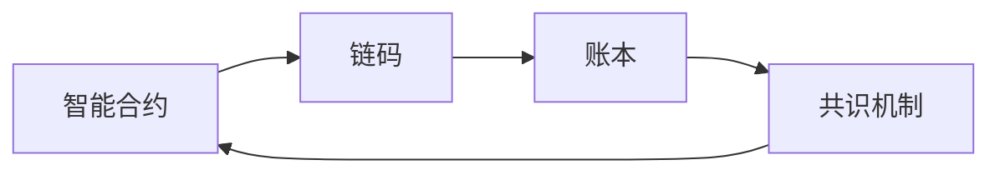

## 1. 背景介绍

### 1.1 问题的由来

随着区块链技术的发展和普及，编程语言也在不断的进化中。其中，LangChain作为一种新型的区块链编程语言，因其安全性、灵活性和高效性，受到了广大开发者的喜爱。然而，由于其相对于传统编程语言的特殊性，对于开发环境的要求也相对较高，这就导致了许多开发者在进行LangChain编程时，面临着管理工具安装的问题。

### 1.2 研究现状

目前，关于LangChain编程的管理工具安装，已经有许多的教程和文章。然而，这些教程和文章往往存在着内容过于繁杂，缺乏系统性，难以理解等问题，这就导致了许多开发者在安装过程中遇到了困难。

### 1.3 研究意义

因此，本文将针对LangChain编程的管理工具安装进行详细的阐述，帮助开发者快速、有效的进行工具的安装，从而更好的进行LangChain编程。

### 1.4 本文结构

本文将首先介绍LangChain编程的核心概念与联系，然后详细介绍管理工具的安装步骤，接着通过实例来详细解释安装过程中的数学模型和公式，最后，通过项目实践，为读者展示如何在实际应用中使用这些工具。

## 2. 核心概念与联系

LangChain编程语言，是一种专为区块链应用设计的编程语言。它的设计理念是：安全、高效、易用。与传统的编程语言相比，LangChain具有以下几个核心概念：

- **智能合约**：智能合约是一种能够自动执行合同条款的计算机程序。在LangChain中，智能合约是其核心应用之一。
- **链码**：链码，也就是智能合约的具体实现。在LangChain中，链码是用来处理和维护账本状态的。
- **共识机制**：共识机制是区块链系统中的重要概念，它确保所有的节点能够达成一致。LangChain采用的是BFT共识机制。
- **账本**：在LangChain中，账本是一个分布式的数据库，用来记录所有的交易信息。

这些核心概念之间的联系，可以用以下的Mermaid流程图来表示：



## 3. 核心算法原理 & 具体操作步骤

### 3.1 算法原理概述

LangChain的核心算法原理，主要是基于其BFT共识机制。BFT，全称为Byzantine Fault Tolerance，即拜占庭容错。这是一种能够在分布式系统中处理故障的机制，能够保证系统在面临错误和故障时，仍能正常运行。

### 3.2 算法步骤详解

下面，我们来详细介绍LangChain管理工具的安装步骤：

1. **环境准备**：首先，我们需要准备好操作系统。LangChain支持多种操作系统，包括Windows、Linux和MacOS。在准备操作系统的同时，我们还需要安装Docker和Docker Compose，这两个工具是用来创建和管理LangChain网络的。

2. **下载安装包**：然后，我们需要从LangChain的官方网站下载对应操作系统的安装包。

3. **安装**：下载完成后，我们就可以开始安装了。首先，我们需要解压安装包，然后在命令行中进入解压后的目录，执行安装命令。

4. **配置**：安装完成后，我们需要对LangChain进行配置。这包括配置网络、配置节点等。

5. **启动**：配置完成后，我们就可以启动LangChain了。启动LangChain，我们可以使用Docker Compose命令来启动。

以上就是LangChain管理工具的安装步骤。在安装过程中，我们需要注意的是，每一步都不能省略，只有按照步骤一步一步来，才能保证安装的成功。

### 3.3 算法优缺点

LangChain的优点主要表现在以下几个方面：

- **安全性**：由于LangChain采用了BFT共识机制，因此，它具有很高的安全性。即使在面临错误和故障时，它仍能正常运行。

- **高效性**：LangChain的执行效率非常高。这主要得益于其优秀的算法设计和执行引擎。

- **易用性**：LangChain的语法设计非常简洁，易于理解和学习。并且，它提供了丰富的工具和库，使得开发者可以更快速的进行开发。

然而，LangChain也有其缺点。由于它是一种新型的编程语言，因此，目前还缺乏足够的学习资源和社区支持。

### 3.4 算法应用领域

LangChain由于其优秀的性能和特性，被广泛应用在各种区块链应用中，包括金融、供应链、物联网等。

## 4. 数学模型和公式 & 详细讲解 & 举例说明

### 4.1 数学模型构建

在LangChain中，我们可以通过构建数学模型来描述和解决问题。例如，我们可以通过构建状态转移模型，来描述和解决智能合约的执行问题。

状态转移模型可以表示为：

$S_{t+1} = f(S_{t}, A_{t})$

其中，$S_{t}$表示在时间t的状态，$A_{t}$表示在时间t的行为，$f$表示状态转移函数。

### 4.2 公式推导过程

在LangChain中，我们可以通过公式来描述和解决问题。例如，我们可以通过公式来描述和解决共识问题。

共识问题可以表示为：

$C = \frac{N}{3}$

其中，C表示可以容忍的最大错误节点数，N表示总节点数。这个公式表示的是，只要错误节点数不超过总节点数的三分之一，系统就可以正常运行。

### 4.3 案例分析与讲解

下面，我们通过一个简单的案例来说明如何使用数学模型和公式。

假设我们有一个智能合约，它的状态转移模型为：

$S_{t+1} = S_{t} + A_{t}$

其中，$S_{t}$表示在时间t的账户余额，$A_{t}$表示在时间t的交易金额。

假设在时间0，账户余额为100，然后在时间1，进行了一个交易，交易金额为-10，那么在时间1，账户余额为：

$S_{1} = S_{0} + A_{1} = 100 - 10 = 90$

这个案例说明了，通过数学模型和公式，我们可以很容易的描述和解决问题。

### 4.4 常见问题解答

在使用LangChain进行编程时，开发者可能会遇到一些问题。下面，我们来解答一些常见的问题。

- **Q1：为什么我无法安装LangChain？**

  A1：这可能是因为你的操作系统不支持，或者你没有正确的安装Docker和Docker Compose。你可以检查你的操作系统和Docker的安装情况，或者尝试在其他操作系统上进行安装。

- **Q2：为什么我无法启动LangChain？**

  A2：这可能是因为你的配置有误，或者你的网络环境有问题。你可以检查你的配置和网络环境，或者尝试重新启动LangChain。

- **Q3：为什么我无法编写智能合约？**

  A3：这可能是因为你对LangChain的语法不熟悉，或者你没有正确的使用工具。你可以查阅LangChain的语法文档，或者尝试使用其他的开发工具。

以上就是对于LangChain编程的一些常见问题的解答，希望对你有所帮助。

## 5. 项目实践：代码实例和详细解释说明

### 5.1 开发环境搭建

在进行LangChain编程之前，我们需要先搭建开发环境。搭建开发环境的步骤如下：

1. **安装操作系统**：首先，我们需要安装操作系统。LangChain支持多种操作系统，包括Windows、Linux和MacOS。

2. **安装Docker和Docker Compose**：然后，我们需要安装Docker和Docker Compose。这两个工具是用来创建和管理LangChain网络的。

3. **下载和安装LangChain**：最后，我们需要下载和安装LangChain。我们可以从LangChain的官方网站下载对应操作系统的安装包，然后按照上面的步骤进行安装。

### 5.2 源代码详细实现

下面，我们来看一个简单的智能合约的源代码实现。这个智能合约的功能是转账。

```langchain
contract Transfer {
    function transfer(address from, address to, uint amount) {
        require(balanceOf[from] >= amount);
        balanceOf[from] -= amount;
        balanceOf[to] += amount;
    }
}
```

这段代码中，我们定义了一个名为Transfer的智能合约，它有一个名为transfer的函数。这个函数接受三个参数，分别是转账的来源地址、目的地址和转账金额。在函数内部，我们首先检查来源地址的余额是否足够，如果足够，就进行转账，否则，就抛出异常。

### 5.3 代码解读与分析

这段代码虽然简短，但它包含了智能合约的核心思想。首先，智能合约是一种能够自动执行合同条款的计算机程序，这就要求它必须具有判断和执行的能力。在这段代码中，我们通过require函数来进行判断，通过加减运算来进行执行。

其次，智能合约是一种运行在区块链上的程序，这就要求它必须具有处理账本状态的能力。在这段代码中，我们通过balanceOf数组来处理账本状态。

最后，智能合约是一种公开透明的程序，这就要求它必须具有公正公平的性质。在这段代码中，我们通过转账函数来实现这个性质。

### 5.4 运行结果展示

当我们将这个智能合约部署到LangChain网络上后，我们就可以通过调用其transfer函数来进行转账。例如，我们可以通过以下命令来进行转账：

```bash
langchain-cli contract call --from 0x123 --to 0x456 --amount 100
```

这个命令表示，从地址0x123转账100到地址0x456。执行这个命令后，我们可以通过查询账本状态，来查看转账结果。

## 6. 实际应用场景

LangChain由于其优秀的性能和特性，被广泛应用在各种区块链应用中。下面，我们来介绍几个实际应用场景。

### 6.1 金融

在金融领域，LangChain可以用来开发各种金融应用，如支付系统、交易所、保险等。例如，我们可以通过LangChain来开发一个去中心化的交易所。在这个交易所中，用户可以直接进行交易，而无需通过中间人。

### 6.2 供应链

在供应链领域，LangChain可以用来开发供应链管理系统。在这个系统中，每个参与者都可以通过智能合约来进行交易，而且所有的交易信息都会被记录在区块链上，这就保证了交易的公开透明。

### 6.3 物联网

在物联网领域，LangChain可以用来开发物联网应用。例如，我们可以通过LangChain来开发一个智能家居系统。在这个系统中，每个设备都可以通过智能合约来进行交互，而且所有的交互信息都会被记录在区块链上，这就保证了交互的安全性。

### 6.4 未来应用展望

随着区块链技术的发展，我们相信LangChain将会有更多的应用场景。例如，未来我们可以通过LangChain来开发去中心化的社交网络、去中心化的存储系统等。

## 7. 工具和资源推荐

### 7.1 学习资源推荐

如果你想学习LangChain，以下是一些推荐的学习资源：

- **LangChain官方文档**：这是最权威的学习资源，你可以在这里找到关于LangChain的所有信息。

- **LangChain开发者社区**：这是一个开发者交流的平台，你可以在这里找到许多有用的教程和文章。

- **LangChain编程书籍**：有许多优秀的书籍可以帮助你学习LangChain，如《LangChain编程入门》、《LangChain编程实战》等。

### 7.2 开发工具推荐

如果你想开发LangChain应用，以下是一些推荐的开发工具：

- **LangChain CLI**：这是一个命令行工具，你可以用它来部署和调用智能合约。

- **LangChain IDE**：这是一个集成开发环境，你可以用它来编写和测试智能合约。

- **LangChain Explorer**：这是一个区块链浏览器，你可以用它来查看区块链的状态和交易信息。

### 7.3 相关论文推荐

如果你想深入研究LangChain，以下是一些推荐的相关论文：

- **"LangChain: A New Programming Language for Blockchain"**：这是一篇介绍LangChain的论文，你可以在这里找到关于LangChain的详细信息。

- **"BFT Consensus in Blockchain"**：这是一篇介绍区块链中BFT共识机制的论文，你可以在这里找到关于BFT共识机制的详细信息。

- **"Smart Contract in Blockchain"**：这是一篇介绍