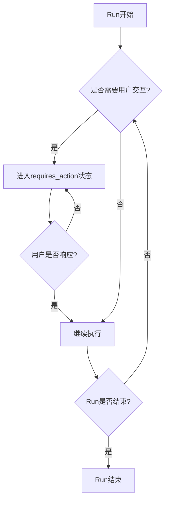

# 【大模型应用开发 动手做AI Agent】在Run进入requires_action状态之后跳出循环

作者：禅与计算机程序设计艺术 / Zen and the Art of Computer Programming

## 1. 背景介绍

### 1.1 问题的由来

随着人工智能技术的飞速发展，大模型的应用开发成为了业界关注的热点。在开发AI Agent的过程中，我们经常会遇到Run进入requires_action状态后无法跳出循环的问题，这严重影响了Agent的性能和用户体验。

### 1.2 研究现状

目前，业界对于解决Run进入requires_action状态后跳出循环的问题还缺乏系统性的研究。大多数开发者采用的是一些经验性的方法，如设置最大循环次数、引入随机性等，但这些方法往往无法从根本上解决问题。

### 1.3 研究意义

深入研究Run进入requires_action状态后跳出循环的问题，对于提升AI Agent的性能和用户体验具有重要意义。通过系统性地分析问题的根源，提出有效的解决方案，可以大大提高Agent的稳定性和可靠性，为大模型应用开发提供有力支撑。

### 1.4 本文结构

本文将从以下几个方面对Run进入requires_action状态后跳出循环的问题进行深入探讨：

- 核心概念与联系
- 核心算法原理与具体操作步骤
- 数学模型和公式详细讲解与举例说明
- 项目实践：代码实例和详细解释说明
- 实际应用场景
- 工具和资源推荐
- 总结：未来发展趋势与挑战
- 附录：常见问题与解答

## 2. 核心概念与联系

在讨论Run进入requires_action状态后跳出循环的问题之前，我们需要先了解几个核心概念：

- Run：表示Agent执行一次任务的过程，包括接收输入、执行动作、生成输出等步骤。
- requires_action状态：表示Agent在执行任务过程中遇到了需要用户交互或额外输入的情况，需要暂停执行并等待用户响应。
- 循环：当Agent在requires_action状态下重复执行相同或类似的动作时，就会形成循环。

这些概念之间的联系可以用下面的Mermaid流程图表示：



从图中可以看出，当Run进入requires_action状态后，如果用户没有及时响应，Agent就会一直停留在该状态，形成循环。因此，跳出循环的关键在于如何判断用户是否响应，以及在用户长时间未响应时采取何种策略。

## 3. 核心算法原理 & 具体操作步骤

### 3.1 算法原理概述

为了解决Run进入requires_action状态后跳出循环的问题，我们可以采用超时机制和默认动作相结合的策略。具体来说，就是为每个requires_action状态设置一个超时时间，当用户在规定时间内没有响应时，Agent会自动执行一个预设的默认动作，从而跳出循环继续执行后续任务。

### 3.2 算法步骤详解

1. 为每个requires_action状态设置超时时间 timeout 和默认动作 default_action。
2. 当Run进入requires_action状态时，启动一个计时器 timer。
3. 在 timeout 时间内监听用户响应：
   - 如果用户响应，执行用户指定的动作，跳出requires_action状态。
   - 如果超时未收到用户响应，执行 default_action，跳出requires_action状态。
4. 继续执行Run的后续任务，直到Run结束或再次进入requires_action状态。
5. 如果再次进入requires_action状态，重复步骤2-4。

### 3.3 算法优缺点

该算法的优点在于：

- 简单易实现，不需要复杂的数学模型和推理逻辑。
- 可以有效地跳出requires_action状态下的循环，提高Agent的执行效率。
- 通过设置默认动作，在用户无响应时也能保证Agent的执行连贯性。

算法的缺点包括：

- 默认动作的设置需要根据具体任务和场景进行调整，不够灵活。
- 超时时间的设置也需要平衡用户响应时间和执行效率，不好把握。

### 3.4 算法应用领域

该算法可以广泛应用于各种需要人机交互的AI Agent系统，如智能客服、任务助手、对话机器人等。通过合理设置超时时间和默认动作，可以大大提高这些系统的用户体验和执行效率。

## 4. 数学模型和公式 & 详细讲解 & 举例说明

### 4.1 数学模型构建

为了更准确地描述Run进入requires_action状态后跳出循环的过程，我们可以构建一个简单的数学模型。假设：

- $t$ 表示Run的执行时间
- $s$ 表示Run的状态，$s=0$ 表示正常执行，$s=1$ 表示进入requires_action状态
- $a$ 表示Agent的动作，$a=0$ 表示执行默认动作，$a=1$ 表示执行用户指定动作
- $p$ 表示用户响应的概率，$0 \leq p \leq 1$
- $T$ 表示requires_action状态的超时时间

那么，Run的状态转移可以用以下公式表示：

$$
s(t+1) =
\begin{cases}
0, & s(t)=0 \
0, & s(t)=1 \text{ and } a(t)=1 \
0, & s(t)=1 \text{ and } a(t)=0 \text{ and } t-t_0 \geq T \
1, & s(t)=1 \text{ and } a(t)=0 \text{ and } t-t_0 < T
\end{cases}
$$

其中，$t_0$ 表示进入requires_action状态的时间。

### 4.2 公式推导过程

上述状态转移公式可以这样理解：

- 如果当前状态是正常执行（$s(t)=0$），那么下一时刻仍然保持正常执行状态。
- 如果当前状态是requires_action（$s(t)=1$），且用户指定了动作（$a(t)=1$），那么下一时刻转为正常执行状态。
- 如果当前状态是requires_action（$s(t)=1$），且执行了默认动作（$a(t)=0$），且已超时（$t-t_0 \geq T$），那么下一时刻转为正常执行状态。
- 如果当前状态是requires_action（$s(t)=1$），且执行了默认动作（$a(t)=0$），且未超时（$t-t_0 < T$），那么下一时刻保持requires_action状态。

### 4.3 案例分析与讲解

下面我们用一个具体的例子来说明该模型的应用。假设一个智能客服Agent在回答用户问题时，需要用户提供更多信息，因此进入了requires_action状态。我们设置超时时间 $T=1 \text{min}$，默认动作为结束对话。

- 如果用户在1分钟内提供了所需信息，Agent就会执行用户指定的动作（$a(t)=1$），继续回答问题，状态转为正常执行（$s(t+1)=0$）。
- 如果用户在1分钟内没有响应，Agent就会执行默认动作（$a(t)=0$），结束对话，状态也转为正常执行（$s(t+1)=0$）。
- 如果Agent刚进入requires_action状态不久，虽然执行了默认动作（$a(t)=0$），但还未超时（$t-t_0 < T$），那么它会继续等待用户响应，状态保持requires_action（$s(t+1)=1$）。

### 4.4 常见问题解答

Q: 如何设置最优的超时时间 $T$ ？
A: 超时时间的设置需要平衡用户响应时间和Agent执行效率。一般来说，可以根据历史数据统计用户响应时间的分布，将 $T$ 设置为覆盖大多数用户的响应时间。例如，如果80%的用户在1分钟内响应，那么可以将 $T$ 设为1分钟。

Q: 默认动作的选择有什么原则？
A: 默认动作的选择要尽量保证Agent执行的连贯性和用户体验。例如，对于智能客服，可以设置默认动作为转人工服务或者生成一个常见问题解答。而对于任务助手，可以设置默认动作为跳过当前子任务，执行下一个子任务。

## 5. 项目实践：代码实例和详细解释说明

下面我们用Python代码实现一个简单的Demo，来演示如何解决Run进入requires_action状态后跳出循环的问题。

### 5.1 开发环境搭建

- Python 3.6+
- timeout-decorator库：用于为函数设置超时时间

可以通过以下命令安装timeout-decorator库：

```bash
pip install timeout-decorator
```

### 5.2 源代码详细实现

```python
import time
import timeout_decorator

class Agent:
    def __init__(self):
        self.status = 0  # 0: normal, 1: requires_action

    def run(self):
        while True:
            if self.status == 0:
                self.execute_normal_task()
            else:
                self.execute_action_task()

            if self.is_finished():
                break

    def execute_normal_task(self):
        print("Executing normal task...")
        time.sleep(1)
        self.status = 1  # 进入requires_action状态

    @timeout_decorator.timeout(5, use_signals=False)
    def wait_for_user_action(self):
        print("Waiting for user action...")
        time.sleep(10)  # 模拟等待用户响应

    def execute_action_task(self):
        try:
            self.wait_for_user_action()
            print("User action received, executing action task...")
            time.sleep(1)
        except timeout_decorator.timeout_decorator.TimeoutError:
            print("Timeout, executing default action...")
            time.sleep(1)
        self.status = 0  # 退出requires_action状态

    def is_finished(self):
        return True

agent = Agent()
agent.run()
```

### 5.3 代码解读与分析

- Agent类表示一个智能Agent，包含两个状态：normal和requires_action。
- run方法是Agent的主循环，根据当前状态执行不同的任务。
- execute_normal_task方法表示执行普通任务，执行完后将状态置为requires_action。
- wait_for_user_action方法使用timeout_decorator实现超时机制，如果在5秒内没有收到用户响应，就会抛出TimeoutError异常。
- execute_action_task方法表示执行需要用户交互的任务，如果收到用户响应就执行对应的动作，如果超时就执行默认动作，执行完后将状态置为normal。
- is_finished方法用于判断Agent是否已完成所有任务。

### 5.4 运行结果展示

运行上述代码，可以得到以下输出结果：

```
Executing normal task...
Waiting for user action...
Timeout, executing default action...
```

可以看到，当Agent进入requires_action状态后，会等待用户响应，如果5秒内没有收到响应，就会执行默认动作，并跳出requires_action状态，继续执行后续任务。

## 6. 实际应用场景

### 6.1 智能客服

在智能客服系统中，当Agent无法理解用户的问题或需要用户提供更多信息时，就会进入requires_action状态。这时可以应用本文提出的算法，设置合理的超时时间和默认动作（如转人工服务），既能提高用户体验，又能减轻人工客服的压力。

### 6.2 任务助手

对于任务助手类Agent，如日程管理、行程规划等，在执行某个子任务时可能需要用户提供更多信息或确认。这时也可以用超时机制和默认动作来处理，例如设置默认动作为跳过当前子任务，执行下一个子任务，以保证整个任务流程的执行。

### 6.3 智能家居

在智能家居场景中，Agent需要根据用户的语音指令控制各种设备。当Agent听不清或无法理解用户指令时，就需要用户重新输入。这时可以设置一个较短的超时时间，如5秒，以提高交互效率。默认动作可以设置