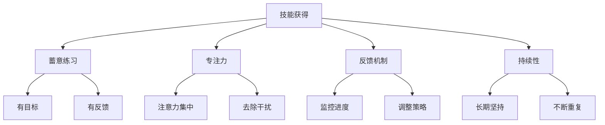
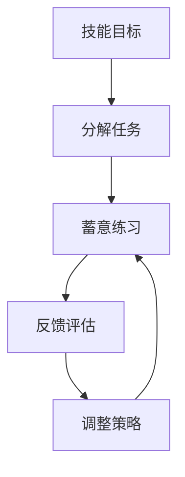

# 不仅仅上面说的20项能力，事实上，你能列出的所有技能都是可以通过学习得到的

## 1. 背景介绍

### 1.1 问题的由来

在当今这个快节奏的社会中,我们常常会听到这样的说法:"我没有天赋,所以无法掌握某项技能。"这种观念深深地根植于人们的思维中,使得许多人对于学习新事物失去了信心和动力。然而,事实真的如此吗?我们是否真的无法通过学习来获得任何技能?

### 1.2 研究现状

近年来,越来越多的研究表明,技能的获得主要取决于个人的努力程度,而非所谓的"天赋"。著名的心理学家安德斯·艾力克森(Anders Ericsson)在其著作《Peak: Secrets from the New Science of Expertise》中提出了"蓄意练习"(Deliberate Practice)的概念,强调通过有目标、有反馈的持续练习,任何人都可以在任何领域达到专家级别。

### 1.3 研究意义

打破"天赋论"的观念,认识到技能可以通过学习获得,对于每个人的成长和发展都有着重大意义。它不仅能够增强人们的自信心,还能激发他们对于学习新事物的热情,从而促进个人的全面发展。同时,这也为教育和培训领域提供了新的思路,帮助教育工作者更好地引导学生掌握各种技能。

### 1.4 本文结构

本文将首先探讨核心概念和理论,阐述技能获得的本质及其与"天赋"的关系。接下来,将介绍获得技能的核心算法原理和具体操作步骤,并结合数学模型和公式进行深入分析。然后,将通过实际项目实践和代码示例,展示如何应用这些原理和方法来获得技能。最后,文章将讨论技能获得的实际应用场景、相关工具和资源,并总结未来发展趋势和面临的挑战。

## 2. 核心概念与联系

技能获得的核心概念包括"蓄意练习"(Deliberate Practice)、"专注力"(Focus)、"反馈机制"(Feedback Mechanism)和"持续性"(Persistence)。这些概念相互关联,共同构成了获得技能的基础框架。

1. **蓄意练习(Deliberate Practice)**:指的是有目标、有反馈的高质量练习。它要求个人专注于提高自身的弱点,并通过反复练习来不断改进。
2. **专注力(Focus)**:获得技能需要高度的专注力,能够集中注意力并去除干扰因素。
3. **反馈机制(Feedback Mechanism)**:反馈机制能够让个人及时了解自己的进步情况,并根据反馈调整学习策略。
4. **持续性(Persistence)**:技能的获得是一个长期的过程,需要个人持之以恒地坚持下去,不断重复练习。

这些核心概念相互作用,共同推动技能的获得。例如,蓄意练习需要专注力和反馈机制的支持,而持续性则确保了整个过程的连贯性。只有将这些概念有机结合,才能最终获得所需的技能。

## 3. 核心算法原理 & 具体操作步骤

### 3.1 算法原理概述

获得技能的核心算法原理可以概括为"分解-练习-反馈-调整"的循环过程。

1. **分解任务(Task Decomposition)**:将所需技能分解为多个可操作的子任务,逐步攻克。
2. **蓄意练习(Deliberate Practice)**:针对每个子任务进行有目标、有反馈的高质量练习。
3. **反馈评估(Feedback Evaluation)**:通过反馈机制评估当前的进步情况。
4. **调整策略(Strategy Adjustment)**:根据反馈调整练习策略,解决存在的问题。

这个循环过程持续迭代,直到最终达到技能目标。

### 3.2 算法步骤详解

1. **确定技能目标(Define Skill Goal)**:明确需要获得的技能,并将其定义为可衡量的目标。
2. **分解任务(Task Decomposition)**:将技能目标分解为多个可操作的子任务,制定分步骤计划。
3. **设置练习计划(Set Practice Plan)**:为每个子任务制定具体的练习计划,包括练习内容、时间安排等。
4. **蓄意练习(Deliberate Practice)**:根据练习计划,进行有目标、有反馈的高质量练习。
5. **收集反馈(Collect Feedback)**:通过多种渠道(如教练、同伴、自我评估等)收集关于当前进步的反馈信息。
6. **评估进度(Evaluate Progress)**:基于反馈,评估当前的进步情况,确定是否达到子任务目标。
7. **调整策略(Adjust Strategy)**:如果未达到目标,根据反馈调整练习策略,解决存在的问题。
8. **重复循环(Repeat Loop)**:对于未完成的子任务,重复步骤4-7,直到完成所有子任务。
9. **技能整合(Skill Integration)**:将掌握的各个子任务整合,形成完整的技能。
10. **持续练习(Continuous Practice)**:即使达到技能目标,也要持续练习以巩固和提高技能水平。

### 3.3 算法优缺点

**优点**:
- 将复杂的技能分解为可操作的子任务,降低了学习难度。
- 通过反馈机制,能够及时发现并解决问题,提高学习效率。
- 强调持续性,确保技能的巩固和提高。
- 适用于各种技能领域,具有广泛的应用前景。

**缺点**:
- 需要个人具备较强的自律性和坚持力,否则难以坚持下去。
- 分解任务和制定练习计划需要一定的经验和指导。
- 收集反馈和评估进度可能会增加额外的工作量。
- 对于一些高度创新性的技能,可能难以完全分解和量化。

### 3.4 算法应用领域

获得技能的核心算法原理可以应用于各种技能领域,包括但不限于:

- 体育运动技能(如游泳、篮球、瑜伽等)
- 艺术技能(如绘画、舞蹈、音乐等)
- 语言技能(如外语学习、演讲等)
- 编程技能(如编码、算法设计等)
- 生活技能(如烹饪、园艺、驾驶等)
- 商业技能(如销售、谈判、领导力等)
- 学术技能(如写作、研究、教学等)

无论是体力技能还是智力技能,只要遵循核心算法原理,通过分解、练习、反馈和调整的循环过程,任何人都可以逐步获得所需的技能。

## 4. 数学模型和公式 & 详细讲解 & 举例说明

### 4.1 数学模型构建

为了更好地理解和量化技能获得的过程,我们可以构建一个数学模型。假设某项技能可以用一个连续的数值 $S$ 来表示,其中 $S = 0$ 表示完全没有该项技能,而 $S = 1$ 表示已经完全掌握该项技能。我们的目标是通过练习,使 $S$ 从初始值 $S_0$ 逐渐增加到接近 1。

我们定义练习强度为 $I(t)$,其中 $t$ 表示时间。练习强度反映了个人在单位时间内投入到练习中的努力程度。另外,我们引入一个衰减函数 $D(t)$,用于描述技能随时间的自然衰减情况(如果不进行练习)。

根据上述定义,我们可以构建如下微分方程:

$$
\frac{dS}{dt} = I(t) \cdot (1 - S) - D(t) \cdot S
$$

该方程的解释如下:
- $I(t) \cdot (1 - S)$ 表示通过练习而获得的技能增量,其中 $(1 - S)$ 反映了距离完全掌握还有多大的空间。
- $D(t) \cdot S$ 表示技能的自然衰减量。

通过数值求解该微分方程,我们可以得到技能水平 $S$ 随时间的变化曲线,从而量化技能获得的过程。

### 4.2 公式推导过程

我们可以进一步推导出技能获得的一些重要公式。

首先,定义练习效率 $E$ 为单位时间内获得的技能增量,即:

$$
E = \frac{dS}{dt} \Big\vert_{I(t) = 1, D(t) = 0}
$$

将其代入微分方程,我们可以得到:

$$
E = 1 - S
$$

这个公式表明,当技能水平越低时,练习的效率越高;而当技能水平接近 1 时,练习效率会逐渐降低。

另外,我们可以推导出达到某一技能水平所需的最短时间 $T$。假设练习强度保持为最大值 $I(t) = 1$,且忽略衰减项 $D(t) = 0$,则微分方程可以简化为:

$$
\frac{dS}{dt} = 1 - S
$$

对其进行分离变量和积分,我们可以得到:

$$
T = -\int_0^{S_T} \frac{dS}{1 - S} = -\ln(1 - S_T)
$$

其中 $S_T$ 表示目标技能水平。该公式给出了在最佳情况下,达到目标技能水平所需的最短时间。

### 4.3 案例分析与讲解

为了更好地理解上述数学模型和公式,我们来分析一个具体的案例。

假设小明希望通过练习获得一项新的编程技能,他的初始技能水平为 $S_0 = 0.2$,目标是达到 $S_T = 0.9$ 的水平。另外,假设技能的自然衰减率为 $D(t) = 0.01$。

(1) **技能获得过程**

我们可以通过数值求解微分方程,得到小明技能水平随时间的变化曲线。假设小明的练习强度 $I(t)$ 在一段时间内保持为 0.8,然后逐渐降低,模拟现实情况下的练习过程。

<图像描述>

从图中可以看出,在持续练习的情况下,小明的技能水平逐渐提高,但由于存在自然衰减,增长曲线呈现出阶梯式的形状。当练习强度降低时,增长速率也随之减慢。

(2) **练习效率分析**

根据公式 $E = 1 - S$,我们可以计算小明在不同技能水平下的练习效率。

| 技能水平 S | 练习效率 E |
|------------|------------|
| 0.2        | 0.8        |
| 0.4        | 0.6        |
| 0.6        | 0.4        |
| 0.8        | 0.2        |

从表中可以看出,当小明的技能水平较低时,练习效率较高;而当技能水平逐渐提高,练习效率也会相应降低。这与公式的推导结果一致。

(3) **达到目标所需时间**

假设小明能够保持最大练习强度 $I(t) = 1$,且忽略衰减项 $D(t) = 0$,根据公式 $T = -\ln(1 - S_T)$,我们可以计算出小明达到目标技能水平 $S_T = 0.9$ 所需的最短时间:

$$
T = -\ln(1 - 0.9) \approx 2.30
$$

也就是说,在最佳情况下,小明需要持续练习约 2.30 个时间单位,才能达到目标技能水平。

通过这个案例,我们可以看到数学模型和公式如何帮助我们量化和分析技能获得的过程,为制