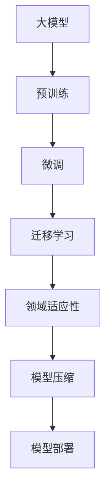

以下是《从零开始大模型开发与微调：模型的准备和介绍》这篇技术博客文章的正文内容：

# 从零开始大模型开发与微调：模型的准备和介绍

## 1. 背景介绍

### 1.1 问题的由来

在当今的人工智能领域，大型语言模型已经成为一个不可忽视的热门话题。随着计算能力的不断提升和海量数据的积累,训练大规模的神经网络模型成为可能。这些大模型展现出了令人惊叹的性能,在自然语言处理、计算机视觉、推理等多个领域取得了突破性的进展。

然而,训练这些大模型需要耗费大量的计算资源、时间和金钱。对于普通研究人员或中小型企业来说,从头开始训练一个大模型存在着巨大的门槛。因此,如何有效地利用和微调现有的大模型,成为了一个亟待解决的问题。

### 1.2 研究现状

目前,已有一些知名的大模型被开源和商业化,如GPT-3、BERT、T5等。这些模型在自然语言处理任务上表现出色,但往往需要大量的计算资源来进行微调和部署。一些研究人员和公司开始探索如何在有限的资源下,高效地利用这些大模型。

例如,一些工作尝试在特定领域的数据上对大模型进行微调,以提高模型在该领域的性能。另一些工作则关注于模型压缩、蒸馏等技术,以减小模型的大小,降低部署成本。

### 1.3 研究意义

能够高效利用和微调大模型,对于推动人工智能的发展至关重要。它可以让更多的个人和组织获得强大的人工智能能力,促进人工智能技术在各个领域的应用。同时,通过对大模型的研究,我们也能更好地理解它们的内在机理,发现其中的不足之处,为未来的模型设计提供指导。

### 1.4 本文结构

本文将从以下几个方面,全面介绍大模型的开发和微调过程:

1. 核心概念与联系
2. 核心算法原理和具体操作步骤
3. 数学模型和公式详细讲解与案例分析
4. 项目实践:代码实例和详细解释
5. 实际应用场景
6. 工具和资源推荐
7. 总结:未来发展趋势与挑战
8. 附录:常见问题与解答

## 2. 核心概念与联系

在深入探讨大模型开发与微调之前,我们需要先了解一些核心概念及它们之间的联系。

1. **大模型(Large Model)**: 指具有数十亿甚至上万亿参数的大型神经网络模型,如GPT-3、PaLM等。这些模型通过在海量数据上进行预训练,获得了强大的泛化能力。

2. **预训练(Pre-training)**: 是指在通用的大型语料库上对模型进行初始训练,使其学习到基础的语言表示能力。常用的预训练方法包括自监督学习、对比学习等。

3. **微调(Fine-tuning)**: 是指在特定任务的数据集上,对预训练模型进行进一步的训练和调整,使其适应该任务。微调通常只需要调整模型的部分参数,从而节省了计算资源。

4. **迁移学习(Transfer Learning)**: 指将在源领域学习到的知识,迁移并应用到目标领域的过程。微调就是一种迁移学习的形式,将预训练模型的知识迁移到特定任务上。

5. **领域适应性(Domain Adaptation)**: 指模型在不同领域数据上的适应能力。通过微调等方法,可以提高模型在特定领域的性能。

6. **模型压缩(Model Compression)**: 指通过剪枝、量化、知识蒸馏等技术,减小模型的大小和计算复杂度,从而降低部署成本。

7. **模型部署(Model Deployment)**: 指将训练好的模型投入实际应用环境,提供预测或推理服务的过程。

这些概念相互关联,构成了大模型开发与微调的完整流程。下面我们将详细介绍其中的核心算法原理和具体操作步骤。

## 3. 核心算法原理与具体操作步骤

### 3.1 算法原理概述

大模型开发与微调的核心算法主要包括以下几个部分:

1. **预训练算法**: 用于在大规模语料库上对模型进行初始训练,获得基础的语言表示能力。常用的预训练算法有自监督学习算法(如Masked Language Modeling)和对比学习算法(如对比语言模型)等。

2. **微调算法**: 用于在特定任务数据集上对预训练模型进行进一步调整,以提高模型在该任务上的性能。常用的微调算法包括梯度微调(Gradient Fine-tuning)、提示微调(Prompt-based Fine-tuning)等。

3. **模型压缩算法**: 用于减小模型的大小和计算复杂度,从而降低部署成本。常用的压缩算法有剪枝(Pruning)、量化(Quantization)、知识蒸馏(Knowledge Distillation)等。

4. **领域适应算法**: 用于提高模型在特定领域数据上的适应能力,如领域对抗训练(Domain Adversarial Training)、数据增强(Data Augmentation)等。

下面我们将详细介绍其中的核心算法步骤。

### 3.2 算法步骤详解

#### 3.2.1 预训练算法

以Masked Language Modeling(MLM)为例,其预训练步骤如下:

1. **数据预处理**: 从大规模语料库中采样出一批文本序列。
2. **掩码处理**: 在每个序列中随机选择15%的词元进行掩码,即用特殊的[MASK]标记替换这些词元。
3. **前向传播**: 将带有掩码的序列输入到预训练模型中,模型预测掩码位置的词元。
4. **损失计算**: 将预测的词元与原始词元进行比较,计算交叉熵损失。
5. **反向传播**: 根据损失对模型参数进行梯度更新。
6. **迭代训练**: 重复上述步骤,直到模型收敛或达到预设的训练轮数。

通过上述无监督的方式,模型可以学习到丰富的语言知识,为后续的微调奠定基础。

#### 3.2.2 微调算法

以梯度微调(Gradient Fine-tuning)为例,其步骤如下:

1. **数据准备**: 准备特定任务的训练数据集和验证数据集。
2. **模型初始化**: 加载预训练好的大模型参数作为初始值。
3. **前向传播**: 将训练样本输入到模型中,获取模型在该任务上的预测输出。
4. **损失计算**: 根据任务类型(如分类、回归等),计算预测输出与真实标签之间的损失。
5. **反向传播**: 根据损失对模型可训练参数进行梯度更新。
6. **验证评估**: 在验证集上评估模型性能,决定是否提前停止训练。
7. **迭代训练**: 重复3-6步骤,直到模型收敛或达到预设的训练轮数。

通过微调,模型可以在保留预训练知识的同时,进一步学习特定任务的模式,提高在该任务上的性能。

#### 3.2.3 模型压缩算法

以知识蒸馏(Knowledge Distillation)为例,其步骤如下:

1. **教师模型训练**: 训练一个大型的教师模型,作为知识来源。
2. **学生模型初始化**: 初始化一个小型的学生模型,用于知识迁移。
3. **教师模型预测**: 在训练数据集上,运行教师模型获取预测输出(软标签)。
4. **学生模型训练**: 将教师模型的预测输出作为监督信号,训练学生模型。
5. **损失计算**: 除了常规的硬标签损失外,还加入了软标签损失,即学生模型预测与教师模型预测之间的差异。
6. **反向传播**: 根据总损失对学生模型参数进行梯度更新。
7. **迭代训练**: 重复4-6步骤,直到学生模型收敛。

通过上述过程,学生模型可以学习到教师模型的知识,同时大幅减小了模型大小,降低了部署成本。

### 3.3 算法优缺点

上述算法都有各自的优缺点,我们需要根据具体场景进行权衡选择。

- **预训练算法**:
  - 优点:可以在大规模无标注数据上学习通用的语言知识,为后续任务奠定基础。
  - 缺点:预训练过程计算开销巨大,需要强大的硬件资源和大量的时间。

- **微调算法**:
  - 优点:只需要调整部分参数,计算开销较小,可快速适应新任务。
  - 缺点:需要针对每个新任务进行微调,存在灵活性不足的问题。

- **模型压缩算法**:
  - 优点:可以大幅减小模型大小,降低部署成本,扩大应用场景。
  - 缺点:压缩过程可能会导致一定程度的性能下降。

- **领域适应算法**:
  - 优点:可以提高模型在特定领域的适应性和性能表现。
  - 缺点:需要针对每个新领域进行适应,增加了额外的计算开销。

### 3.4 算法应用领域

上述算法在自然语言处理、计算机视觉等多个领域都有广泛的应用。

- **自然语言处理**:
  - 预训练算法如BERT、GPT等被广泛应用于文本分类、机器翻译、问答系统等任务。
  - 微调算法可以将预训练模型迁移到特定的NLP任务上,提高性能。
  - 模型压缩算法可以减小语言模型的大小,方便部署到移动端或嵌入式设备。

- **计算机视觉**:
  - 预训练算法如MaskAutoEncoder、对比学习等可以学习通用的视觉表示。
  - 微调算法可以将预训练模型应用到目标检测、图像分类等任务。
  - 模型压缩算法可以减小视觉模型的大小,加快推理速度。

除此之外,这些算法还在推理、决策等其他人工智能领域发挥着重要作用。

## 4. 数学模型和公式详细讲解与举例说明

在上一节中,我们介绍了大模型开发与微调的核心算法原理和步骤。这些算法背后都有着严谨的数学模型和公式作为理论基础。本节将详细讲解这些数学模型,并通过具体案例加深理解。

### 4.1 数学模型构建

#### 4.1.1 预训练模型

我们以Masked Language Modeling(MLM)为例,构建其数学模型。给定一个长度为n的文本序列$X = (x_1, x_2, \dots, x_n)$,我们随机选择其中的m个位置进行掩码,得到掩码序列$\tilde{X} = (\tilde{x}_1, \tilde{x}_2, \dots, \tilde{x}_n)$,其中$\tilde{x}_i$可能是原始词元$x_i$或特殊的[MASK]标记。

我们的目标是训练一个模型$f_\theta$,能够基于上下文预测掩码位置的原始词元,即最大化如下条件概率:

$$\max_\theta \prod_{i=1}^n P(x_i | \tilde{X}, \theta)$$

其中$\theta$是模型的参数。通过最大化上式,模型可以学习到丰富的语言知识。

#### 4.1.2 微调模型

在微调过程中,我们的目标是在特定任务$\mathcal{T}$的训练数据$\mathcal{D} = \{(x_i, y_i)\}_{i=1}^N$上,调整预训练模型$f_\theta$的部分参数,使其能够很好地完成该任务。

对于分类任务,我们可以最小化如下交叉熵损失:

$$\min_\phi \sum_{i=1}^N -y_i