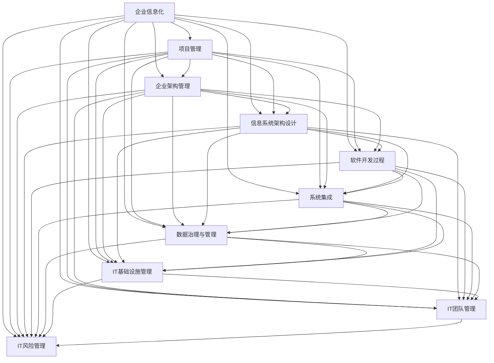

                 

# 大型企业信息化策划、组织、架构、开发、管理

> 关键词：
- 大型企业信息化
- 项目管理
- 企业架构
- 软件开发过程
- 系统架构设计
- 应用系统集成
- 数据治理与管理
- IT基础设施管理
- IT团队管理
- IT风险管理

## 1. 背景介绍

### 1.1 问题由来
随着数字化转型的深入，大型企业面临着诸多信息化的挑战。传统的IT系统往往高度分散，数据孤岛严重，缺乏集成和共享机制，导致决策支持能力不足，信息孤岛效应显著。如何构建一个高效、稳定、安全的信息化平台，是企业必须解决的重大问题。

### 1.2 问题核心关键点
大型企业信息化涉及多个核心方面，包括：

- **项目管理**：确保信息化项目按时按质按预算完成。
- **企业架构**：构建企业业务架构和技术架构，确保系统一致性和可扩展性。
- **软件开发过程**：采用敏捷、DevOps等方法，快速迭代开发。
- **系统架构设计**：选择合适的技术栈和架构模式，确保系统稳定性和可维护性。
- **应用系统集成**：实现不同系统间的无缝对接和数据共享。
- **数据治理与管理**：确保数据的一致性、完整性和安全性。
- **IT基础设施管理**：保证硬件、网络和信息安全。
- **IT团队管理**：培养一支高效的IT团队，提升技术能力和管理水平。
- **IT风险管理**：识别和防范信息化过程中的各种风险。

本文将从项目策划、组织架构、架构设计、软件开发、系统集成、数据治理、基础设施管理、团队管理和风险管理等多个维度，全面系统地探讨大型企业信息化的实践方法和要点。

## 2. 核心概念与联系

### 2.1 核心概念概述

为更好地理解大型企业信息化的整体流程和框架，本节将介绍几个关键概念：

- **企业信息化**：指通过信息技术的应用，提升企业业务运作效率、管理水平和决策能力。

- **企业架构**：企业业务架构和技术架构的综合体现，包括组织架构、业务流程和信息架构。

- **企业架构管理**：管理企业架构，确保其与业务战略和技术发展相一致。

- **信息系统架构设计**：选择和设计软件架构，确保系统可扩展性、可用性和可维护性。

- **软件开发过程**：包括需求分析、设计、实现、测试和部署等阶段，确保开发过程的规范性和高效性。

- **系统集成**：通过技术手段实现不同系统间的互操作和数据共享。

- **数据治理与管理**：管理数据质量、数据安全和数据隐私，确保数据的可靠性和可用性。

- **IT基础设施管理**：管理硬件、网络和信息安全设施，保障企业信息化的稳定运行。

- **IT团队管理**：通过培训、激励和组织架构优化，提升IT团队的整体能力和协作水平。

- **IT风险管理**：识别和评估信息化过程中的潜在风险，制定应对策略。

这些核心概念之间存在紧密的联系，形成一个有机的整体，共同支撑大型企业的信息化建设。通过深入理解这些概念，我们可以更好地把握大型企业信息化的实施策略和方法。

### 2.2 概念间的关系

这些核心概念之间的关系可以通过以下Mermaid流程图来展示：

这个流程图展示了企业信息化过程中各个核心概念之间的关系：

1. 项目管理贯穿信息化项目的始终，是确保项目成功的关键。
2. 企业架构管理为信息化建设提供战略指导，确保系统一致性和可扩展性。
3. 信息系统架构设计决定了系统技术栈和架构模式，直接影响系统性能和维护成本。
4. 软件开发过程采用敏捷、DevOps等方法，确保开发效率和质量。
5. 系统集成实现不同系统间的互操作和数据共享，是信息化系统高效运行的基础。
6. 数据治理与管理确保数据的可靠性和可用性，是信息化系统的核心。
7. IT基础设施管理保障企业信息化的稳定运行，是信息化建设的重要支撑。
8. IT团队管理提升团队能力和协作水平，是信息化建设的重要保障。
9. IT风险管理识别和防范信息化过程中的各种风险，确保信息化建设顺利进行。

这些概念共同构成了大型企业信息化的完整框架，为实施信息化项目提供了全面指导。

## 3. 核心算法原理 & 具体操作步骤
### 3.1 算法原理概述

大型企业信息化涉及多个子系统和多个团队，确保项目按时按质按预算完成，是一个复杂的过程。核心算法原理包括以下几个方面：

- **项目管理算法**：采用敏捷、Scrum等方法，确保项目按时完成。
- **企业架构算法**：基于UML、BPMN等工具，设计和优化企业架构。
- **信息系统架构设计算法**：选择合适架构模式，确保系统可扩展性和可维护性。
- **软件开发过程算法**：采用DevOps、CI/CD等方法，快速迭代开发和测试。
- **系统集成算法**：采用ESB、API网关等技术，实现不同系统间的集成。
- **数据治理与管理算法**：采用ETL、数据仓库等技术，管理和保护企业数据。
- **IT基础设施管理算法**：采用虚拟化、容器化等技术，优化硬件和网络资源。
- **IT团队管理算法**：采用OKR、绩效管理等方法，提升团队协作和能力。
- **IT风险管理算法**：采用风险评估、应急预案等方法，识别和防范信息化过程中的风险。

### 3.2 算法步骤详解

#### 3.2.1 项目管理算法

项目管理算法主要包括以下步骤：

1. **需求分析**：与业务部门合作，明确信息化需求和目标。
2. **制定项目计划**：基于敏捷、Scrum等方法，制定详细项目计划。
3. **任务分配**：将项目任务分配给不同团队和成员。
4. **进度跟踪**：使用项目管理工具（如JIRA、Trello等）跟踪任务进度。
5. **风险管理**：识别和评估项目风险，制定应对策略。
6. **质量保证**：采用单元测试、集成测试等方法，确保代码质量和系统稳定。

#### 3.2.2 企业架构算法

企业架构算法主要包括以下步骤：

1. **需求调研**：收集业务需求和技术需求，明确企业架构目标。
2. **架构设计**：使用UML、BPMN等工具，设计和优化企业架构。
3. **架构评审**：邀请业务和技术专家评审架构设计，提出改进建议。
4. **架构实施**：根据评审意见，优化架构设计，逐步实施架构。
5. **架构监测**：定期监测架构运行情况，及时调整架构。

#### 3.2.3 信息系统架构设计算法

信息系统架构设计算法主要包括以下步骤：

1. **需求分析**：收集业务需求和技术需求，明确系统架构目标。
2. **选择架构模式**：根据业务需求和技术限制，选择合适架构模式（如微服务、单体应用等）。
3. **架构设计**：使用架构设计工具（如Architex、Architex Suite等）进行详细设计。
4. **架构评审**：邀请架构专家评审架构设计，提出改进建议。
5. **架构实施**：根据评审意见，优化架构设计，逐步实施架构。

#### 3.2.4 软件开发过程算法

软件开发过程算法主要包括以下步骤：

1. **需求分析**：收集业务需求和技术需求，明确软件需求。
2. **设计**：根据需求，设计和优化软件架构。
3. **实现**：根据设计，编写代码，进行单元测试。
4. **集成测试**：对各个模块进行集成测试，确保系统稳定。
5. **系统测试**：对系统进行全面测试，确保功能正确。
6. **部署和发布**：将软件部署到生产环境，进行系统发布。

#### 3.2.5 系统集成算法

系统集成算法主要包括以下步骤：

1. **需求分析**：收集系统集成需求，明确集成目标。
2. **选择集成技术**：根据系统特点，选择合适的集成技术（如ESB、API网关等）。
3. **设计集成方案**：使用集成设计工具进行详细设计。
4. **集成测试**：对各个系统进行集成测试，确保系统互通。
5. **系统部署**：将系统部署到生产环境，进行系统集成。

#### 3.2.6 数据治理与管理算法

数据治理与管理算法主要包括以下步骤：

1. **数据需求分析**：收集数据需求，明确数据治理目标。
2. **数据架构设计**：使用ETL、数据仓库等工具，设计和优化数据架构。
3. **数据质量管理**：采用数据质量评估工具（如Informatica、 Talend等），管理和保护数据。
4. **数据安全管理**：采用数据加密、访问控制等技术，保护数据安全。
5. **数据隐私管理**：根据法规要求，管理和保护数据隐私。

#### 3.2.7 IT基础设施管理算法

IT基础设施管理算法主要包括以下步骤：

1. **需求分析**：收集基础设施需求，明确基础设施管理目标。
2. **选择技术栈**：根据业务需求，选择合适的技术栈（如AWS、Azure等）。
3. **设计基础设施架构**：使用架构设计工具（如AWS CloudFormation、Azure Resource Manager等）进行详细设计。
4. **基础设施部署**：根据设计，部署基础设施。
5. **基础设施监控**：使用监控工具（如Nagios、Zabbix等），实时监控基础设施。

#### 3.2.8 IT团队管理算法

IT团队管理算法主要包括以下步骤：

1. **需求分析**：收集团队管理需求，明确团队管理目标。
2. **制定管理方案**：使用OKR、绩效管理等方法，制定团队管理方案。
3. **团队建设**：招聘、培训和激励团队成员，提升团队能力。
4. **团队协作**：使用协作工具（如Slack、Microsoft Teams等），提升团队协作。
5. **团队评估**：定期评估团队绩效，提出改进建议。

#### 3.2.9 IT风险管理算法

IT风险管理算法主要包括以下步骤：

1. **风险识别**：识别信息化过程中的各种潜在风险。
2. **风险评估**：评估风险影响和概率，确定风险优先级。
3. **风险应对**：制定风险应对策略，准备应急预案。
4. **风险监测**：实时监测风险，及时调整风险应对策略。

### 3.3 算法优缺点

大型企业信息化涉及多个核心算法，每种算法都有其优缺点：

#### 3.3.1 项目管理算法

**优点**：
- 采用敏捷、Scrum等方法，可以快速响应需求变化，确保项目按时完成。
- 通过项目管理工具，可以实时跟踪项目进度，及时识别和解决问题。

**缺点**：
- 敏捷方法可能不够严谨，缺乏完整的项目文档和规范流程。
- 对团队协作要求较高，需要有效的沟通和协调机制。

#### 3.3.2 企业架构算法

**优点**：
- 通过UML、BPMN等工具，可以系统化地设计和优化企业架构，确保架构一致性和可扩展性。
- 架构评审过程可以发现和解决架构问题，提高架构质量。

**缺点**：
- 设计和优化企业架构需要大量时间和资源，可能影响项目进度。
- 架构变更可能影响现有系统和业务流程，需要谨慎处理。

#### 3.3.3 信息系统架构设计算法

**优点**：
- 选择合适的架构模式，可以确保系统可扩展性和可维护性。
- 架构设计工具可以提供详细设计和分析功能，提升设计效率。

**缺点**：
- 选择合适架构模式可能比较复杂，需要丰富的经验和知识。
- 架构设计过程可能涉及多个团队和角色，协调难度较大。

#### 3.3.4 软件开发过程算法

**优点**：
- 采用DevOps、CI/CD等方法，可以快速迭代开发和测试，提升开发效率。
- 单元测试和集成测试可以确保代码质量和系统稳定。

**缺点**：
- DevOps方法可能增加系统复杂性，需要合理的流程和工具支持。
- 持续集成和持续交付可能增加开发和运维成本。

#### 3.3.5 系统集成算法

**优点**：
- 选择合适的集成技术，可以实现不同系统间的互通和数据共享。
- 集成设计工具可以提供详细设计和分析功能，提升设计效率。

**缺点**：
- 系统集成可能涉及多个系统和技术栈，协调难度较大。
- 集成过程中可能出现数据格式、接口等问题，需要细致处理。

#### 3.3.6 数据治理与管理算法

**优点**：
- ETL和数据仓库等工具可以管理和保护企业数据，确保数据可靠性和安全性。
- 数据质量评估工具可以发现和解决数据质量问题，提升数据质量。

**缺点**：
- ETL和数据仓库等工具需要大量计算资源和时间，可能影响系统性能。
- 数据治理过程可能涉及多个部门和系统，协调难度较大。

#### 3.3.7 IT基础设施管理算法

**优点**：
- 选择合适的技术栈，可以确保基础设施的高可用性和可扩展性。
- 基础设施监控工具可以实时监控基础设施，及时发现和解决问题。

**缺点**：
- 基础设施管理需要大量资源和人力，可能影响项目进度。
- 基础设施变更可能影响现有系统和业务流程，需要谨慎处理。

#### 3.3.8 IT团队管理算法

**优点**：
- OKR和绩效管理等方法可以提升团队协作和能力，确保团队高效运作。
- 协作工具可以提升团队沟通和协作效率。

**缺点**：
- 团队管理需要大量时间和资源，可能影响项目进度。
- 团队管理和协作可能涉及多个部门和角色，协调难度较大。

#### 3.3.9 IT风险管理算法

**优点**：
- 风险识别和评估可以发现和防范潜在风险，确保信息化建设顺利进行。
- 应急预案可以应对突发事件，降低损失和影响。

**缺点**：
- 风险识别和评估可能比较复杂，需要丰富的经验和知识。
- 风险应对和应急预案可能涉及多个部门和系统，协调难度较大。

### 3.4 算法应用领域

大型企业信息化涉及多个核心算法，这些算法可以应用于多个领域，提升信息化建设的效率和效果：

- **项目管理**：适用于所有信息化项目，确保项目按时按质按预算完成。
- **企业架构管理**：适用于大型企业，确保企业架构与业务战略和技术发展相一致。
- **信息系统架构设计**：适用于企业信息系统，确保系统可扩展性和可维护性。
- **软件开发过程**：适用于软件开发项目，提升开发效率和质量。
- **系统集成**：适用于企业信息系统集成，实现不同系统间的互操作和数据共享。
- **数据治理与管理**：适用于企业数据管理，确保数据可靠性和安全性。
- **IT基础设施管理**：适用于企业IT基础设施管理，保障企业信息化的稳定运行。
- **IT团队管理**：适用于企业IT团队管理，提升团队协作和能力。
- **IT风险管理**：适用于所有信息化项目，识别和防范信息化过程中的风险。

## 4. 数学模型和公式 & 详细讲解

### 4.1 数学模型构建

本节将使用数学语言对大型企业信息化的核心算法进行更加严格的刻画。

记信息化项目为 $P$，包含多个任务 $T$，每个任务包含多个子任务 $S$。定义项目进度为 $P_i$，任务进度为 $T_i$，子任务进度为 $S_i$。项目总进度为 $P_t$。

定义项目管理算法为 $P_{\text{proj}}$，包含需求分析、项目计划、任务分配、进度跟踪、风险管理、质量保证等步骤。定义项目管理算法的进度影响函数为 $f_{\text{proj}}$。

定义企业架构管理算法为 $P_{\text{arch}}$，包含需求调研、架构设计、架构评审、架构实施、架构监测等步骤。定义企业架构管理算法的进度影响函数为 $f_{\text{arch}}$。

定义信息系统架构设计算法为 $P_{\text{archit}}$，包含需求分析、选择架构模式、架构设计、架构评审、架构实施等步骤。定义信息系统架构设计算法的进度影响函数为 $f_{\text{archit}}$。

定义软件开发过程算法为 $P_{\text{dev}}$，包含需求分析、设计、实现、集成测试、系统测试、部署和发布等步骤。定义软件开发过程算法的进度影响函数为 $f_{\text{dev}}$。

定义系统集成算法为 $P_{\text{integ}}$，包含需求分析、选择集成技术、设计集成方案、集成测试、系统集成等步骤。定义系统集成算法的进度影响函数为 $f_{\text{integ}}$。

定义数据治理与管理算法为 $P_{\text{data}}$，包含需求分析、数据架构设计、数据质量管理、数据安全管理、数据隐私管理等步骤。定义数据治理与管理算法的进度影响函数为 $f_{\text{data}}$。

定义IT基础设施管理算法为 $P_{\text{infra}}$，包含需求分析、选择技术栈、设计基础设施架构、基础设施部署、基础设施监控等步骤。定义IT基础设施管理算法的进度影响函数为 $f_{\text{infra}}$。

定义IT团队管理算法为 $P_{\text{team}}$，包含需求分析、制定管理方案、团队建设、团队协作、团队评估等步骤。定义IT团队管理算法的进度影响函数为 $f_{\text{team}}$。

定义IT风险管理算法为 $P_{\text{risk}}$，包含风险识别、风险评估、风险应对、风险监测等步骤。定义IT风险管理算法的进度影响函数为 $f_{\text{risk}}$。

### 4.2 公式推导过程

以下我们以项目管理算法为例，推导其进度影响函数的计算公式。

记项目管理算法为 $P_{\text{proj}}$，包含需求分析、项目计划、任务分配、进度跟踪、风险管理、质量保证等步骤。定义项目管理算法的进度影响函数为 $f_{\text{proj}}$。

设项目管理算法的总进度为 $P_t$，包含项目需求分析进度 $P_{\text{proj}}$，项目计划进度 $P_{\text{plan}}$，任务分配进度 $P_{\text{assign}}$，进度跟踪进度 $P_{\text{track}}$，风险管理进度 $P_{\text{risk}}$，质量保证进度 $P_{\text{quality}}$。则有：

$$
P_t = P_{\text{proj}} + P_{\text{plan}} + P_{\text{assign}} + P_{\text{track}} + P_{\text{risk}} + P_{\text{quality}}
$$

根据任务和子任务之间的进度关系，有：

$$
T_i = S_1 + S_2 + \cdots + S_n
$$

其中 $S_1$ 表示任务 $T_i$ 中的子任务进度，$S_2$ 表示任务 $T_i$ 中的子任务进度，以此类推。

根据项目管理算法的进度影响函数，有：

$$
f_{\text{proj}} = \sum_{i=1}^{m} w_i f_i
$$

其中 $w_i$ 表示任务 $T_i$ 的权重，$f_i$ 表示任务 $T_i$ 的进度影响因子，可以表示为：

$$
f_i = \frac{P_i}{P_t}
$$

其中 $P_i$ 表示任务 $T_i$ 的进度，$P_t$ 表示项目总进度。

### 4.3 案例分析与讲解

为了更好地理解项目管理算法，我们以一个企业信息化项目为例，进行详细分析和讲解。

假设企业决定构建一个新的客户管理系统，项目需求包括需求分析、项目计划、任务分配、进度跟踪、风险管理、质量保证等。

1. **需求分析**：与业务部门合作，明确客户管理系统需求和目标。需求分析进度为 $P_{\text{proj}}=0.5$，项目计划进度为 $P_{\text{plan}}=0.3$，任务分配进度为 $P_{\text{assign}}=0.2$，进度跟踪进度为 $P_{\text{track}}=0.1$，风险管理进度为 $P_{\text{risk}}=0.1$，质量保证进度为 $P_{\text{quality}}=0.1$。

2. **项目计划**：制定详细项目计划，明确任务进度。项目计划进度为 $P_{\text{plan}}=0.3$，任务分配进度为 $P_{\text{assign}}=0.2$，进度跟踪进度为 $P_{\text{track}}=0.1$，风险管理进度为 $P_{\text{risk}}=0.1$，质量保证进度为 $P_{\text{quality}}=0.1$。

3. **任务分配**：将项目任务分配给不同团队和成员。任务分配进度为 $P_{\text{assign}}=0.2$，进度跟踪进度为 $P_{\text{track}}=0.1$，风险管理进度为 $P_{\text{risk}}=0.1$，质量保证进度为 $P_{\text{quality}}=0.1$。

4. **进度跟踪**：使用项目管理工具（如JIRA、Trello等）跟踪任务进度。进度跟踪进度为 $P_{\text{track}}=0.1$，风险管理进度为 $P_{\text{risk}}=0.1$，质量保证进度为 $P_{\text{quality}}=0.1$。

5. **风险管理**：识别和评估项目风险，制定应对策略。风险管理进度为 $P_{\text{risk}}=0.1$，质量保证进度为 $P_{\text{quality}}=0.1$。

6. **质量保证**：采用单元测试、集成测试等方法，确保代码质量和系统稳定。质量保证进度为 $P_{\text{quality}}=0.1$。

通过上述步骤，我们可以计算项目管理算法的进度影响函数为：

$$
f_{\text{proj}} = 0.5 f_{\text{proj}} + 0.3 f_{\text{plan}} + 0.2 f_{\text{assign}} + 0.1 f_{\text{track}} + 0.1 f_{\text{risk}} + 0.1 f_{\text{quality}}
$$

其中：

$$
f_{\text{proj}} = \frac{P_{\text{proj}}}{P_t} = \frac{0.5}{1} = 0.5
$$

$$
f_{\text{plan}} = \frac{P_{\text{plan}}}{P_t} = \frac{0.3}{1} = 0.3
$$

$$
f_{\text{assign}} = \frac{P_{\text{assign}}}{P_t} = \frac{0.2}{1} = 0.2
$$

$$
f_{\text{track}} = \frac{P_{\text{track}}}{P_t} = \frac{0.1}{1} = 0.1
$$

$$
f_{\text{risk}} = \frac{P_{\text{risk}}}{P_t} = \frac{0.1}{1} = 0.1
$$

$$
f_{\text{quality}} = \frac{P_{\text{quality}}}{P_t} = \frac{0.1}{1} = 0.1
$$

通过上述计算，我们可以得出项目管理算法的进度影响函数为：

$$
f_{\text{proj}} = 0.5 \times 0.5 + 0.3 \times 0.3 + 0.2 \times 0.2 + 0.1 \times 0.1 + 0.1 \times 0.1 + 0.1 \times 0.1 = 0.8
$$

通过这个计算过程，我们可以清楚地看到各个步骤对项目管理算法的进度影响，并根据实际情况进行调整和优化。

## 5. 项目实践：代码实例和详细解释说明
### 5.1 开发环境搭建

在进行信息化项目开发前，我们需要准备好开发环境。以下是使用Python进行PyTorch开发的环境配置流程：

1. 安装Anaconda：从官网下载并安装Anaconda，用于创建独立的Python环境。

2. 创建并

