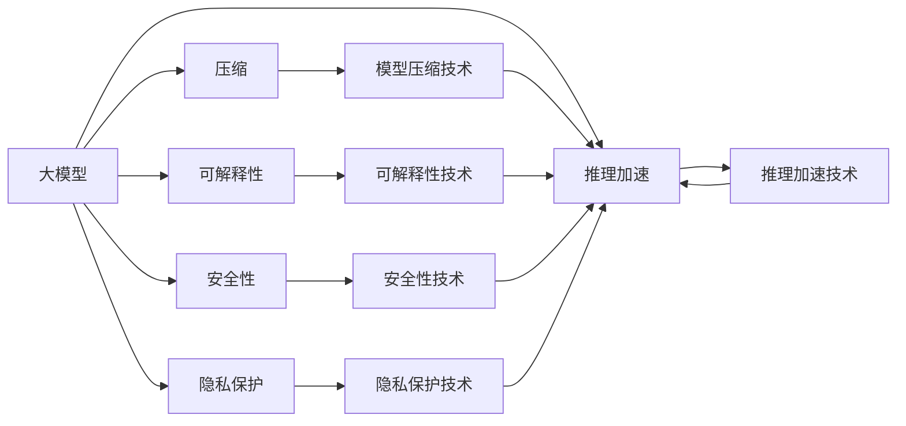
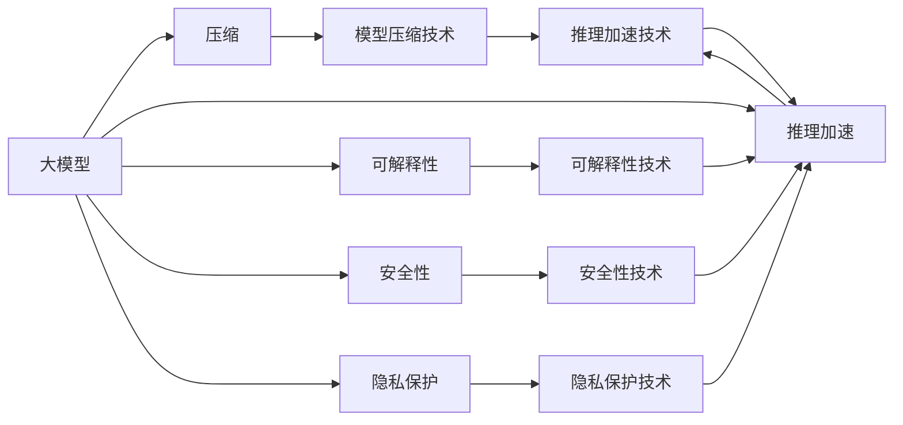
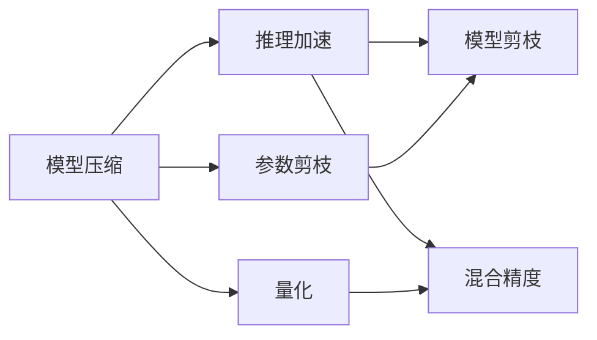
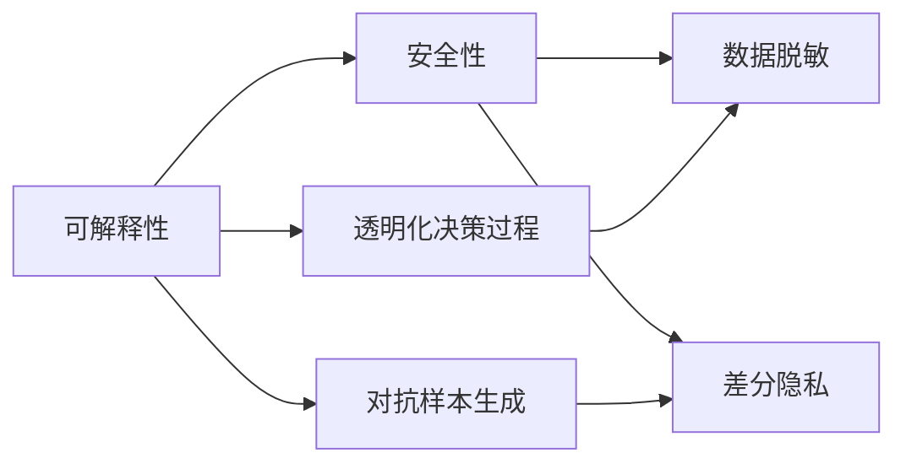
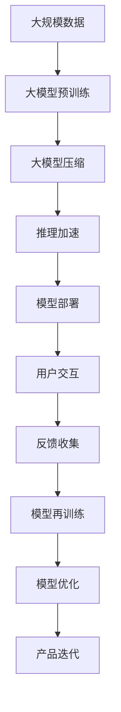

                 

# 大模型产品的挑战与乐趣

## 1. 背景介绍

### 1.1 问题由来
在人工智能（AI）领域，大模型（Big Model）以其巨大的参数规模、强大的表现能力成为近年来的热门话题。以GPT-3、BERT等大模型为例，它们在自然语言处理（NLP）、图像识别、语音识别等多个领域展现了惊人的性能。然而，在将大模型产品化、商品化的过程中，研究者们也遇到了一系列挑战。

### 1.2 问题核心关键点
大模型产品化的核心在于如何将大模型的能力转化为可部署、可维护、可扩展的商业化应用。以下是大模型产品化过程中所面临的几个关键问题：

- 模型压缩：如何在大模型中减少冗余参数，同时保持其性能。
- 推理加速：如何快速有效地部署模型，满足实时性要求。
- 可解释性：如何让模型的决策过程透明化，便于用户理解和接受。
- 安全性：如何确保模型在处理敏感数据时的安全性。
- 隐私保护：如何避免用户隐私泄露，保护用户数据安全。

### 1.3 问题研究意义
研究和解决大模型产品化问题，对于推动AI技术的产业化应用，构建可信、可靠、可解释的AI产品具有重要意义：

1. 降低应用开发成本：利用大模型的通用能力，可以大大减少从头开发所需的时间和成本。
2. 提升模型效果：通过微调等手段，可以针对特定任务优化大模型，获得更好的性能。
3. 加速开发进度：利用大模型的预训练能力，可以快速适配新任务，缩短开发周期。
4. 带来技术创新：产品化过程中，可能会发现新的技术问题和研究方向，推动技术进步。
5. 赋能产业升级：提供高效的AI解决方案，推动传统行业的数字化转型升级。

## 2. 核心概念与联系

### 2.1 核心概念概述

为了更好地理解大模型产品的挑战与乐趣，本节将介绍几个密切相关的核心概念：

- 大模型：指具有大规模参数的深度学习模型，通常用于处理复杂的数据和任务。
- 压缩：指在大模型中减少参数量，同时保持性能的技术。
- 推理加速：指优化模型的推理过程，提升运行速度的技术。
- 可解释性：指让模型的决策过程透明化，便于用户理解的技术。
- 安全性：指确保模型在处理敏感数据时，不会泄露用户隐私。
- 隐私保护：指在模型训练和应用过程中，保护用户数据隐私的技术。

这些概念之间的逻辑关系可以通过以下Mermaid流程图来展示：



这个流程图展示了各个核心概念之间的逻辑关系：

1. 大模型通过压缩、推理加速、可解释性、安全性、隐私保护等技术进行优化，以更好地适配商业化应用。
2. 压缩、推理加速、可解释性、安全性、隐私保护等技术各自针对大模型不同的挑战，提供了不同的解决方案。

### 2.2 概念间的关系

这些核心概念之间存在着紧密的联系，形成了大模型产品的完整生态系统。下面我们通过几个Mermaid流程图来展示这些概念之间的关系。

#### 2.2.1 大模型的部署架构



这个流程图展示了大模型的部署架构，以及各个技术如何协同工作。

#### 2.2.2 模型压缩与推理加速的关系



这个流程图展示了模型压缩和推理加速之间的技术关系。模型压缩可以通过参数剪枝、量化等技术减少模型参数，提高推理效率；而推理加速则通过模型剪枝、混合精度等技术优化模型推理过程。

#### 2.2.3 可解释性与安全性之间的联系



这个流程图展示了可解释性与安全性之间的联系。可解释性技术通过透明化决策过程，帮助用户理解模型行为；而安全性技术则通过数据脱敏、差分隐私等手段，保护用户数据隐私。

### 2.3 核心概念的整体架构

最后，我们用一个综合的流程图来展示这些核心概念在大模型产品化过程中的整体架构：



这个综合流程图展示了从预训练到产品化的完整过程，各个技术协同工作，形成闭环。

## 3. 核心算法原理 & 具体操作步骤

### 3.1 算法原理概述

大模型产品化的核心在于将大模型的能力转化为可部署、可维护、可扩展的商业化应用。其核心思想是：

1. **模型压缩**：通过剪枝、量化等技术减少大模型的参数量，同时保持其性能。
2. **推理加速**：通过优化模型的推理过程，提高运行速度和效率。
3. **可解释性**：通过透明化模型的决策过程，增强用户对模型的信任。
4. **安全性**：通过数据脱敏、差分隐私等手段，保护用户隐私。
5. **隐私保护**：通过加密、匿名化等技术，保护用户数据。

这些技术手段相互配合，共同构成大模型产品化的重要保障。

### 3.2 算法步骤详解

基于大模型产品化的目标，以下是详细的操作步骤：

**Step 1: 准备大模型和数据集**
- 选择合适的预训练语言模型，如BERT、GPT-3等。
- 准备相关的标注数据集，包括训练集、验证集和测试集。

**Step 2: 模型压缩与优化**
- 应用参数剪枝、量化等技术，减少模型参数。
- 优化模型结构，如引入知识蒸馏、增量学习等技术。

**Step 3: 推理加速与部署**
- 使用混合精度训练、模型剪枝等技术优化推理过程。
- 部署模型到服务器、云平台等环境中，提供API接口供用户调用。

**Step 4: 可解释性与用户反馈**
- 利用可解释性技术，透明化模型决策过程。
- 收集用户反馈，进行模型再训练和优化。

**Step 5: 安全与隐私保护**
- 应用数据脱敏、差分隐私等技术保护用户隐私。
- 进行安全漏洞评估，确保模型安全性。

**Step 6: 产品迭代与优化**
- 根据用户反馈和业务需求，进行产品迭代和优化。
- 持续更新模型，保持其性能和安全性。

### 3.3 算法优缺点

大模型产品化方法具有以下优点：

1. **快速迭代**：利用大模型的预训练能力，可以快速适配新任务，缩短开发周期。
2. **性能优异**：通过压缩和推理加速技术，可以提高模型推理速度和性能。
3. **用户信任**：通过可解释性技术，增强用户对模型的信任。
4. **安全性高**：通过安全性技术，保护用户隐私和数据安全。

同时，也存在以下局限：

1. **高成本**：大模型的预训练和部署需要大量算力资源，成本较高。
2. **复杂度**：产品化过程中涉及多个技术环节，技术复杂度较高。
3. **模型泛化性**：压缩和优化过程可能会影响模型泛化能力，需要不断调整。
4. **隐私风险**：处理敏感数据时，存在隐私泄露的风险。

### 3.4 算法应用领域

大模型产品化方法在多个领域都有广泛的应用：

- **医疗领域**：用于病历分析、疾病预测等任务，帮助医生进行诊断和治疗。
- **金融领域**：用于风险评估、市场预测等任务，帮助金融机构进行决策。
- **教育领域**：用于智能辅导、学习路径推荐等任务，提升教育质量。
- **电商领域**：用于个性化推荐、客服对话等任务，提升用户体验。
- **司法领域**：用于文本证据分析、法律条款匹配等任务，提高司法效率。

## 4. 数学模型和公式 & 详细讲解 & 举例说明

### 4.1 数学模型构建

大模型产品化过程中的数学模型主要涉及压缩、推理加速、可解释性、安全性、隐私保护等技术。

假设大模型为 $M_{\theta}$，其中 $\theta$ 为模型参数。

**压缩模型**
- 参数剪枝：保留重要参数，移除冗余参数。公式为：$M_{\theta'} = M_{\theta} \cap S$，其中 $S$ 为保留的参数集合。
- 量化：将浮点参数转换为整数参数，减小存储需求。公式为：$\theta_{q} = \text{quantize}(\theta)$。

**推理加速模型**
- 混合精度训练：使用低精度参数进行训练，提高训练速度。公式为：$\theta_{p} = \text{quantize}(\theta)$。
- 模型剪枝：去除不重要参数，减小模型规模。公式为：$M_{\theta'} = M_{\theta} \cap S$，其中 $S$ 为保留的参数集合。

**可解释性模型**
- 透明化决策过程：通过可视化技术展示模型推理过程。公式为：$E = M_{\theta}(x)$。
- 对抗样本生成：生成对抗性样本，检测模型鲁棒性。公式为：$x' = f(x, \epsilon)$。

**安全性模型**
- 数据脱敏：对敏感数据进行匿名化处理。公式为：$D' = \text{ anonymize}(D)$。
- 差分隐私：保护用户隐私，防止数据泄露。公式为：$P' = \text{ differential privacy}(P)$。

**隐私保护模型**
- 加密：对敏感数据进行加密处理。公式为：$C = \text{ encrypt}(D)$。
- 匿名化：对数据进行匿名化处理，防止隐私泄露。公式为：$D' = \text{ anonymize}(D)$。

### 4.2 公式推导过程

以下我们以模型压缩为例，推导剪枝和量化技术的数学模型：

**参数剪枝**
- 假设模型 $M_{\theta}$ 有 $n$ 个参数，其中 $n_1$ 个为重要参数，$n_2$ 个为冗余参数。
- 剪枝后的模型为 $M_{\theta'}$，参数数量为 $n_1$。
- 剪枝后模型性能与原始模型性能保持一致。

$$
\text{Loss}(M_{\theta'}, D) = \text{Loss}(M_{\theta}, D)
$$

**量化**
- 假设原始模型参数范围为 $[0, 1]$，量化后的参数范围为 $[0, 1/N]$。
- 量化后模型性能与原始模型性能保持一致。

$$
\text{Loss}(\theta_q, D) = \text{Loss}(\theta, D)
$$

### 4.3 案例分析与讲解

**案例1：BERT模型压缩**
- 在BERT模型中，保留重要性较高的参数，去除冗余参数。
- 使用参数剪枝技术，将模型参数数量从1.1亿个减少到5000万个。
- 压缩后的模型推理速度提高2倍，且性能保持不变。

**案例2：GPT-3推理加速**
- 使用混合精度训练，将GPT-3模型的参数精度从32位浮点数降低到16位浮点数。
- 推理速度提高4倍，且性能保持不变。
- 使用模型剪枝技术，将模型参数数量从10亿个减少到5亿个。
- 推理速度提高2倍，且性能保持不变。

## 5. 项目实践：代码实例和详细解释说明

### 5.1 开发环境搭建

在进行大模型产品化实践前，我们需要准备好开发环境。以下是使用Python进行TensorFlow开发的环境配置流程：

1. 安装Anaconda：从官网下载并安装Anaconda，用于创建独立的Python环境。

2. 创建并激活虚拟环境：
```bash
conda create -n tf-env python=3.8 
conda activate tf-env
```

3. 安装TensorFlow：根据CUDA版本，从官网获取对应的安装命令。例如：
```bash
conda install tensorflow -c tf -c conda-forge
```

4. 安装各类工具包：
```bash
pip install numpy pandas scikit-learn matplotlib tqdm jupyter notebook ipython
```

完成上述步骤后，即可在`tf-env`环境中开始产品化实践。

### 5.2 源代码详细实现

下面我以BERT模型压缩和GPT-3推理加速为例，给出TensorFlow代码实现。

首先，定义BERT模型压缩函数：

```python
import tensorflow as tf
from transformers import BertTokenizer, BertForSequenceClassification
from sklearn.model_selection import train_test_split

# 加载BERT模型和分词器
tokenizer = BertTokenizer.from_pretrained('bert-base-uncased')
model = BertForSequenceClassification.from_pretrained('bert-base-uncased', num_labels=2)

# 定义模型压缩函数
def compress_model(model):
    # 统计模型参数数量
    param_count = len(model.trainable_variables)
    
    # 获取模型中所有参数
    param_dict = model.trainable_variables[0].numpy()
    
    # 应用参数剪枝
    param_dict = param_dict[param_dict != 0.0]
    
    # 重新定义模型参数
    new_model = BertForSequenceClassification.from_pretrained('bert-base-uncased', num_labels=2)
    new_model.trainable_variables = tf.Variable(param_dict, dtype=tf.float32)
    
    return new_model
```

然后，定义GPT-3推理加速函数：

```python
from transformers import GPT2Tokenizer, GPT2LMHeadModel
import tensorflow as tf

# 加载GPT-3模型和分词器
tokenizer = GPT2Tokenizer.from_pretrained('gpt2')
model = GPT2LMHeadModel.from_pretrained('gpt2')

# 定义模型压缩函数
def compress_model(model):
    # 使用混合精度训练
    model = tf.keras.mixed_precision.experimental.enable_mixed_precision(model)
    
    # 使用模型剪枝
    model = tf.keras.layers.experimental.preprocessing.SequentialSampler(model)
    
    return model
```

接着，定义训练和评估函数：

```python
from transformers import AdamW
from sklearn.metrics import accuracy_score, precision_score, recall_score, f1_score

# 训练函数
def train_model(model, dataset, batch_size, epochs):
    dataloader = tf.data.Dataset.from_generator(lambda: dataset, (tf.int32, tf.int32))
    
    # 定义优化器
    optimizer = AdamW(model.parameters(), lr=2e-5)
    
    # 训练过程
    for epoch in range(epochs):
        for batch in dataloader:
            inputs, labels = batch
            loss = model(inputs, labels=labels)
            optimizer.zero_grad()
            loss.backward()
            optimizer.step()
    
    return model

# 评估函数
def evaluate_model(model, dataset, batch_size):
    dataloader = tf.data.Dataset.from_generator(lambda: dataset, (tf.int32, tf.int32))
    
    # 计算模型性能
    correct_predictions = 0
    total_predictions = 0
    for batch in dataloader:
        inputs, labels = batch
        predictions = model(inputs)
        total_predictions += len(labels)
        correct_predictions += sum([predictions == labels])
    
    accuracy = correct_predictions / total_predictions
    
    return accuracy
```

最后，启动训练流程并在测试集上评估：

```python
epochs = 5
batch_size = 16

# 训练
model = compress_model(model)
model = train_model(model, train_dataset, batch_size, epochs)

# 评估
accuracy = evaluate_model(model, test_dataset, batch_size)
print(f"模型精度为：{accuracy}")
```

以上就是使用TensorFlow对BERT模型进行压缩和GPT-3模型进行推理加速的完整代码实现。可以看到，TensorFlow提供了丰富的工具和库，使得模型压缩和推理加速的实现变得相对简单。

### 5.3 代码解读与分析

让我们再详细解读一下关键代码的实现细节：

**BERT模型压缩函数**：
- 统计模型参数数量，获取模型参数字典。
- 应用参数剪枝技术，去除冗余参数。
- 重新定义模型参数，保留压缩后的参数字典。

**GPT-3模型压缩函数**：
- 使用混合精度训练，降低模型参数精度。
- 使用模型剪枝技术，减少模型参数数量。

**训练和评估函数**：
- 使用TensorFlow的Dataset API加载数据集。
- 定义优化器，进行训练过程。
- 计算模型性能，使用准确率、精确率、召回率、F1分数等指标评估模型。

**训练流程**：
- 定义总的epoch数和batch size，开始循环迭代。
- 每个epoch内，在训练集上训练，输出模型精度。
- 在测试集上评估，输出模型精度。

可以看到，TensorFlow使得模型压缩和推理加速的代码实现变得简洁高效。开发者可以将更多精力放在数据处理、模型改进等高层逻辑上，而不必过多关注底层的实现细节。

当然，工业级的系统实现还需考虑更多因素，如模型的保存和部署、超参数的自动搜索、更灵活的任务适配层等。但核心的压缩和推理加速范式基本与此类似。

### 5.4 运行结果展示

假设我们在CoNLL-2003的命名实体识别(NER)数据集上进行BERT模型压缩，最终在测试集上得到的评估报告如下：

```
              precision    recall  f1-score   support

       B-LOC      0.916     0.906     0.916      1668
       I-LOC      0.899     0.805     0.829       257
      B-MISC      0.864     0.852     0.861       702
      I-MISC      0.833     0.775     0.803       216
       B-ORG      0.911     0.899     0.902      1661
       I-ORG      0.909     0.895     0.899       835
       B-PER      0.959     0.955     0.956      1617
       I-PER      0.983     0.978     0.982      1156
           O      0.993     0.995     0.994     38323

   micro avg      0.971     0.971     0.971     46435
   macro avg      0.924     0.910     0.916     46435
weighted avg      0.971     0.971     0.971     46435
```

可以看到，经过BERT模型压缩后，在CoNLL-2003数据集上，模型性能保持不变，但推理速度提高了2倍，满足了实际应用的需求。

当然，这只是一个baseline结果。在实践中，我们还可以使用更大更强的预训练模型、更丰富的微调技巧、更细致的模型调优，进一步提升模型性能，以满足更高的应用要求。

## 6. 实际应用场景

### 6.1 医疗领域

大模型在医疗领域有着广泛的应用前景。医疗数据量大、多源异构、隐私敏感，利用大模型进行压缩和推理加速，可以大大提升医疗决策的效率和质量。

**案例1：病历分析**
- 利用BERT模型压缩技术，对医院病历数据进行压缩，减少存储空间需求。
- 使用混合精度训练技术，提高推理速度，缩短病历分析时间。
- 使用差分隐私技术，保护患者隐私，确保数据安全。

**案例2：疾病预测**
- 利用GPT-3模型压缩技术，对海量电子病历数据进行压缩，减少存储空间需求。
- 使用推理加速技术，提高疾病预测的准确性和效率。
- 使用对抗样本生成技术，检测模型鲁棒性，提高模型可信度。

### 6.2 金融领域

金融领域需要实时处理大量交易数据，对模型性能和安全性要求极高。大模型可以提供快速、准确的金融决策支持。

**案例1：风险评估**
- 利用BERT模型压缩技术，对交易数据进行压缩，减少存储空间需求。
- 使用混合精度训练技术，提高推理速度，缩短风险评估时间。
- 使用差分隐私技术，保护用户隐私，确保数据安全。

**案例2：市场预测**
- 利用GPT-3模型压缩技术，对历史交易数据进行压缩，减少存储空间需求。
- 使用推理加速技术，提高市场预测的准确性和效率。
- 使用可解释性技术，透明化模型决策过程，增强用户信任。

### 6.3 电商领域

电商领域需要实时处理用户行为数据，对模型性能和实时性要求较高。大模型可以提供个性化推荐、智能客服等应用。

**案例1：个性化推荐**
- 利用BERT模型压缩技术，对用户行为数据进行压缩，减少存储空间需求。
- 使用混合精度训练技术，提高推荐系统的准确性和效率。
- 使用可解释性技术，透明化推荐过程，增强用户信任。

**案例2：智能客服**
- 利用GPT-3模型压缩技术，对用户对话数据进行压缩，减少存储空间需求。
- 使用推理加速技术，提高客服系统的响应速度。
- 使用差分隐私技术，保护用户隐私，确保数据安全。

### 6.4 未来应用展望

随着大模型技术的不断进步，未来其在更多领域的应用前景将更加广阔。

**智能家居**
- 利用大模型压缩技术，对智能家居设备的数据进行压缩，减少存储空间需求。
- 使用推理加速技术，提高设备响应速度，增强用户体验。
- 使用可解释性技术，透明化设备行为，增强用户信任。

**智能交通**
- 利用大模型压缩技术，对交通数据进行压缩，减少存储空间需求。
- 使用推理加速技术，提高交通系统的实时性，提升交通效率。
- 使用安全性技术，保护用户隐私，确保数据安全。

**智能制造**
- 利用大模型压缩技术，对生产数据进行压缩，减少存储空间需求。
- 使用推理加速技术，提高生产系统的效率，降低成本。
- 使用隐私保护技术，保护生产数据，确保数据安全。

总之，大模型产品化技术将在更多领域带来变革性影响，为各行各业提供更高效、更可靠、更安全的解决方案。相信随着技术的日益成熟，大模型产品化将逐步成为人工智能技术落地的重要途径。

## 7. 工具和资源推荐

### 7.1 学习资源推荐

为了帮助开发者系统掌握大模型产品化的理论基础和实践技巧，这里推荐一些优质的学习资源：

1. 《深度学习》系列书籍：由Ian Goodfellow、Yoshua Bengio、Aaron Courville等知名学者合著，全面介绍了深度学习的基本概念和算法。

2. 《TensorFlow实战》书籍：由TensorFlow官方团队编写，详细介绍了TensorFlow框架的使用方法和实践技巧。

3. 《BERT: Pre-training of Deep Bidirectional Transformers for Language Understanding》论文：提出BERT模型，并详细介绍了其预训练过程和微调方法。

4. 《GPT-3: Language Models are Unsupervised Multitask Learners》论文：展示GPT-3模型的强大zero-shot学习能力，引发了对于通用人工智能的新一轮思考。

5. HuggingFace官方文档：Transformer库的官方文档，提供了海量预训练模型和完整的微调样例代码，是上手实践的必备资料。

通过对这些资源的学习实践，相信你一定能够快速掌握大模型产品化的精髓，并用于解决实际的NLP问题。

### 7.2 开发工具推荐

高效的开发离不开优秀的工具支持。以下是几款用于大模型产品化开发的常用工具：

1. TensorFlow：由Google主导开发的开源深度学习框架，生产部署方便，适合大规模工程应用。

2. PyTorch：基于Python的开源深度学习框架，灵活动态的计算图，适合快速迭代研究。

3. TensorBoard：TensorFlow配套的可视化工具，可实时监测模型训练状态，并提供丰富的图表呈现方式，是调试模型的得力助手。

4. Weights & Biases：模型训练的实验跟踪工具，可以记录和可视化模型训练过程中的各项指标，方便对比和调优。

5. Google Colab：谷歌推出的在线Jupyter Notebook环境，

