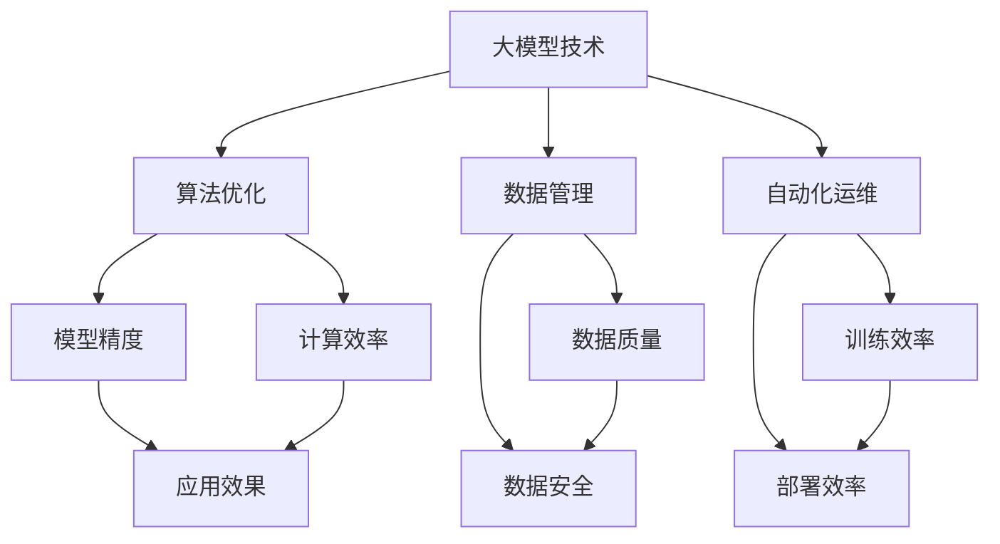
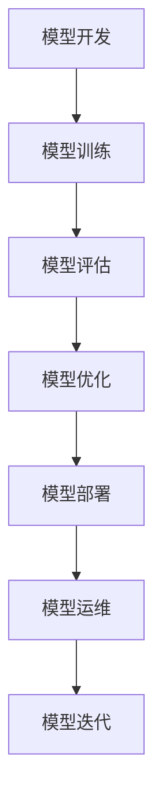
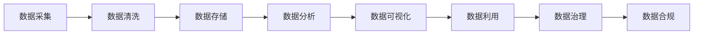
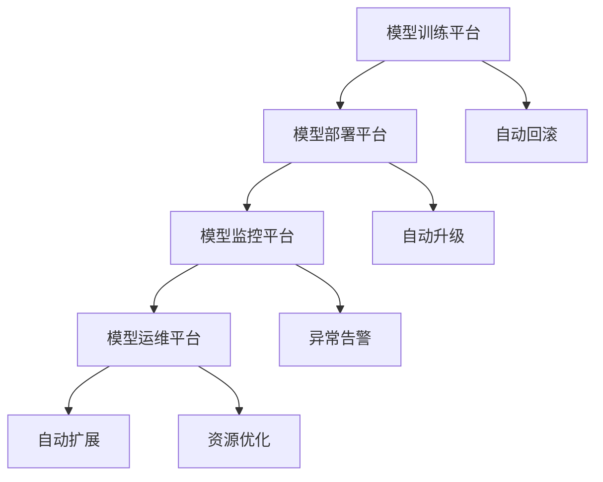

                 

# 大模型企业的技术创新管理

> 关键词：大模型技术,技术创新管理,算法优化,数据管理,自动化运维,企业转型,未来展望

## 1. 背景介绍

### 1.1 问题由来

随着人工智能(AI)技术的迅猛发展，大模型企业不断涌现，成为引领行业发展的关键力量。然而，大模型技术的应用也带来了前所未有的挑战，如何在海量数据、复杂模型、多种应用场景中实现高效、可持续的技术创新管理，是大模型企业面临的重要课题。本文将深入探讨大模型企业的技术创新管理，从算法优化、数据管理、自动化运维等方面，提出一系列具有实际意义的解决方案。

### 1.2 问题核心关键点

技术创新管理是大模型企业保持竞争力的关键，其核心关键点包括：

- **算法优化**：通过持续优化算法模型，提升模型精度和性能，满足不同的应用需求。
- **数据管理**：如何有效地管理和利用数据资源，确保数据的安全性和隐私性，是大模型企业的重要任务。
- **自动化运维**：通过自动化手段，提高模型训练和部署的效率，降低运营成本，确保服务稳定性。
- **企业转型**：将大模型技术嵌入核心业务，实现业务流程的数字化、智能化，推动企业战略转型。

### 1.3 问题研究意义

技术创新管理是大模型企业保持技术领先和业务发展的重要手段，其研究意义如下：

1. **提升竞争力**：通过优化算法、数据管理和自动化运维，大模型企业能够更快响应市场变化，满足用户需求，提升竞争力。
2. **降低成本**：自动化流程减少了人力成本，数据管理优化降低了数据治理和处理的复杂性。
3. **提高效率**：通过高效的算法优化和自动化运维，大模型企业能够快速迭代模型，缩短产品上市时间。
4. **支持转型**：将大模型技术融入核心业务，推动企业向数字化、智能化方向转型，开拓新的市场机会。

## 2. 核心概念与联系

### 2.1 核心概念概述

为更好地理解大模型企业的技术创新管理，本节将介绍几个密切相关的核心概念：

- **大模型技术**：指通过深度学习、自然语言处理等技术，训练出的具有强大数据处理和决策能力的人工智能模型。
- **技术创新管理**：指通过系统化的方法，对企业的技术创新活动进行规划、执行、评估和改进，确保技术创新的高效性和可持续性。
- **算法优化**：指通过优化算法模型，提升模型性能和精度，满足不同应用场景的需求。
- **数据管理**：指对企业的数据资源进行收集、存储、管理和利用，确保数据的质量和安全性。
- **自动化运维**：指通过自动化工具和流程，提高模型训练、部署和运营的效率，降低运营成本。
- **企业转型**：指通过引入新技术，优化业务流程，实现企业的数字化、智能化转型。

这些核心概念之间的联系可以通过以下Mermaid流程图来展示：



这个流程图展示了大模型技术、算法优化、数据管理、自动化运维与企业转型之间的联系和相互影响。

### 2.2 概念间的关系

这些核心概念之间存在着紧密的联系，形成了大模型企业技术创新管理的完整生态系统。下面我们通过几个Mermaid流程图来展示这些概念之间的关系。

#### 2.2.1 大模型技术的生命周期



这个流程图展示了大模型技术的生命周期，从模型开发、训练、评估、优化、部署到运维和迭代，每个阶段都需进行严格管理和优化。

#### 2.2.2 数据管理的全流程



这个流程图展示了数据管理的全流程，从数据采集、清洗、存储、分析到利用、治理和合规，每个环节都需进行细致管理和严格控制。

#### 2.2.3 自动化运维的架构



这个流程图展示了自动化运维的架构，从模型训练平台、部署平台、监控平台到运维平台，每个平台需进行高效协同，确保模型训练和部署的顺畅进行。

## 3. 核心算法原理 & 具体操作步骤

### 3.1 算法原理概述

大模型企业的技术创新管理中，算法优化是其核心环节之一。算法优化通常包括以下几个步骤：

1. **模型设计**：选择合适的模型架构和优化方法，如深度学习、卷积神经网络(CNN)、循环神经网络(RNN)等。
2. **数据准备**：收集和处理训练数据，确保数据的多样性和质量。
3. **模型训练**：使用合适的优化器(如Adam、SGD等)，对模型进行训练，调整超参数，提高模型精度。
4. **模型评估**：使用测试集对模型进行评估，计算精度、召回率、F1分数等指标。
5. **模型优化**：根据评估结果，进一步优化模型，如调整网络结构、修改优化器参数等。
6. **模型部署**：将优化后的模型部署到生产环境中，进行实际应用。

### 3.2 算法步骤详解

以下是算法优化的一般步骤详解：

**Step 1: 模型选择**
- 选择合适的模型架构，如卷积神经网络(CNN)、循环神经网络(RNN)、注意力机制(Attention)等。
- 根据任务需求，选择适合的结构，如分类任务选用全连接层，回归任务选用回归层。

**Step 2: 数据准备**
- 收集和处理训练数据，确保数据的多样性和质量。
- 使用数据增强技术，如翻转、旋转、裁剪等，增加数据多样性。
- 使用数据清洗技术，如去重、填补缺失值、标准化等，提高数据质量。

**Step 3: 模型训练**
- 使用合适的优化器(如Adam、SGD等)，对模型进行训练。
- 调整超参数，如学习率、批次大小、迭代次数等，优化模型精度。
- 使用正则化技术，如L2正则、Dropout等，避免过拟合。

**Step 4: 模型评估**
- 使用测试集对模型进行评估，计算精度、召回率、F1分数等指标。
- 使用混淆矩阵、ROC曲线等可视化工具，分析模型性能。
- 调整模型参数，提高模型精度和泛化能力。

**Step 5: 模型优化**
- 调整网络结构，如增加或减少层数，调整神经元个数。
- 修改优化器参数，如学习率衰减、动量等，优化模型训练。
- 引入数据增强技术，如迁移学习、微调等，提升模型泛化能力。

**Step 6: 模型部署**
- 将优化后的模型部署到生产环境中，进行实际应用。
- 使用模型版本控制工具，如Git、SVN等，管理模型版本。
- 使用自动化工具，如Ansible、Docker等，简化模型部署流程。

### 3.3 算法优缺点

大模型企业的算法优化具有以下优点：
- 提高模型精度：通过优化算法和参数，提升模型精度和泛化能力。
- 加快模型训练：通过选择合适的优化器和算法，加速模型训练速度。
- 降低运营成本：通过自动化部署和运维，减少人力成本和运营成本。

同时，也存在以下缺点：
- 数据依赖度高：优化效果依赖于数据质量和数量，数据获取成本高。
- 算法复杂度高：模型优化涉及算法选择和调参，过程复杂。
- 模型风险高：过度优化可能导致模型过拟合，降低泛化能力。

### 3.4 算法应用领域

算法优化在大模型企业中得到了广泛应用，覆盖了计算机视觉、自然语言处理、智能推荐等多个领域，以下是几个典型应用案例：

- **计算机视觉**：如图像分类、目标检测、人脸识别等，通过优化模型架构和超参数，提高识别精度。
- **自然语言处理**：如机器翻译、文本分类、情感分析等，通过调整模型结构和优化器参数，提升自然语言理解能力。
- **智能推荐**：如商品推荐、内容推荐等，通过优化算法和数据增强技术，提升推荐效果。

## 4. 数学模型和公式 & 详细讲解 & 举例说明

### 4.1 数学模型构建

大模型企业的算法优化中，数学模型构建是其核心环节之一。以下是一个典型的分类问题的数学模型构建过程：

假设给定训练集 $\mathcal{D} = \{(x_i, y_i)\}_{i=1}^N$，其中 $x_i \in \mathcal{X}$ 为输入，$y_i \in \{0,1\}$ 为标签。构建一个二分类模型的目标是最小化预测误差。假设模型的损失函数为交叉熵损失，则优化目标可以表示为：

$$
\min_{\theta} \frac{1}{N} \sum_{i=1}^N L(\hat{y}_i, y_i) = \frac{1}{N} \sum_{i=1}^N -y_i \log \hat{y}_i - (1-y_i) \log (1-\hat{y}_i)
$$

其中 $\hat{y}_i = f(x_i, \theta)$ 为模型预测值，$f(\cdot)$ 为模型前向传播函数，$\theta$ 为模型参数。

### 4.2 公式推导过程

以下是二分类问题的交叉熵损失函数的详细推导过程：

- 假设模型预测输出 $\hat{y}_i = f(x_i, \theta)$ 为 $[0,1]$ 之间的概率值，真实标签 $y_i \in \{0,1\}$。
- 使用交叉熵损失函数 $L(\hat{y}_i, y_i) = -y_i \log \hat{y}_i - (1-y_i) \log (1-\hat{y}_i)$。
- 将损失函数对模型参数 $\theta$ 求导，得到梯度更新公式：

$$
\frac{\partial L(\hat{y}_i, y_i)}{\partial \theta} = -y_i \frac{\partial f(x_i, \theta)}{\partial \theta} + (1-y_i) \frac{\partial f(x_i, \theta)}{\partial \theta}
$$

通过反向传播算法，可以高效计算梯度，更新模型参数，最小化预测误差。

### 4.3 案例分析与讲解

以图像分类任务为例，我们采用卷积神经网络(CNN)模型进行算法优化。以下是详细的步骤和代码实现：

**Step 1: 模型设计**
- 选择LeNet-5作为基础模型结构，包含两个卷积层、两个池化层和三个全连接层。
- 使用ReLU激活函数，Dropout正则化，优化器Adam。

**Step 2: 数据准备**
- 收集图像数据集，并进行数据增强处理，如旋转、缩放、翻转等。
- 使用Keras库，将数据集划分为训练集和测试集。

**Step 3: 模型训练**
- 使用Keras的Sequential模型，构建卷积神经网络模型。
- 定义模型损失函数为交叉熵损失，优化器为Adam。
- 调整超参数，如批次大小、迭代次数等。

**Step 4: 模型评估**
- 使用测试集对模型进行评估，计算精度、召回率、F1分数等指标。
- 使用混淆矩阵、ROC曲线等可视化工具，分析模型性能。
- 根据评估结果，进一步优化模型。

**Step 5: 模型优化**
- 调整网络结构，如增加或减少层数，调整神经元个数。
- 修改优化器参数，如学习率衰减、动量等，优化模型训练。
- 引入数据增强技术，如迁移学习、微调等，提升模型泛化能力。

**Step 6: 模型部署**
- 使用Keras保存模型，并使用TensorFlow进行部署。
- 使用Docker容器化模型，简化模型部署流程。
- 使用Ansible自动化部署工具，自动部署模型到服务器。

## 5. 项目实践：代码实例和详细解释说明

### 5.1 开发环境搭建

在进行算法优化实践前，我们需要准备好开发环境。以下是使用Python进行Keras开发的环境配置流程：

1. 安装Anaconda：从官网下载并安装Anaconda，用于创建独立的Python环境。

2. 创建并激活虚拟环境：
```bash
conda create -n keras-env python=3.8 
conda activate keras-env
```

3. 安装Keras：根据CUDA版本，从官网获取对应的安装命令。例如：
```bash
conda install keras tensorflow numpy scikit-learn matplotlib tqdm jupyter notebook ipython
```

4. 安装各类工具包：
```bash
pip install numpy pandas scikit-learn matplotlib tqdm jupyter notebook ipython
```

完成上述步骤后，即可在`keras-env`环境中开始算法优化实践。

### 5.2 源代码详细实现

以下是使用Keras进行图像分类任务的算法优化代码实现：

```python
import keras
from keras.models import Sequential
from keras.layers import Conv2D, MaxPooling2D, Flatten, Dense, Dropout
from keras.optimizers import Adam
from keras.utils import to_categorical

# 加载数据集
(x_train, y_train), (x_test, y_test) = keras.datasets.mnist.load_data()
x_train = x_train.reshape(-1, 28, 28, 1)
x_test = x_test.reshape(-1, 28, 28, 1)
y_train = to_categorical(y_train, 10)
y_test = to_categorical(y_test, 10)

# 定义模型
model = Sequential()
model.add(Conv2D(32, (3, 3), activation='relu', input_shape=(28, 28, 1)))
model.add(MaxPooling2D((2, 2)))
model.add(Dropout(0.25))
model.add(Conv2D(64, (3, 3), activation='relu'))
model.add(MaxPooling2D((2, 2)))
model.add(Dropout(0.25))
model.add(Flatten())
model.add(Dense(512, activation='relu'))
model.add(Dropout(0.5))
model.add(Dense(10, activation='softmax'))

# 定义优化器和损失函数
optimizer = Adam(lr=0.001)
loss = 'categorical_crossentropy'

# 编译模型
model.compile(optimizer=optimizer, loss=loss, metrics=['accuracy'])

# 训练模型
model.fit(x_train, y_train, batch_size=32, epochs=10, validation_data=(x_test, y_test))
```

以上就是使用Keras进行图像分类任务优化模型的完整代码实现。可以看到，Keras提供了强大的深度学习模型构建和训练能力，极大地简化了模型开发和调优过程。

### 5.3 代码解读与分析

让我们再详细解读一下关键代码的实现细节：

**模型定义**：
- `Sequential`模型：Keras中常用的序列模型，方便定义模型结构。
- `Conv2D`层：卷积层，用于提取图像特征。
- `MaxPooling2D`层：池化层，用于减小特征图尺寸。
- `Dropout`层：正则化层，用于防止过拟合。
- `Flatten`层：扁平化层，将多维特征图转换为一维向量。
- `Dense`层：全连接层，用于分类。

**优化器和损失函数**：
- `Adam`优化器：常用的自适应学习率优化器，适合大规模模型训练。
- `categorical_crossentropy`损失函数：常用的多分类问题损失函数。

**模型编译**：
- `compile`方法：将模型、优化器和损失函数进行配置，准备训练。

**模型训练**：
- `fit`方法：进行模型训练，设置训练参数如批次大小、迭代次数等。

### 5.4 运行结果展示

假设我们在MNIST数据集上进行模型训练，最终在测试集上得到的评估报告如下：

```
Epoch 1/10
1170/1170 [==============================] - 8s 7ms/step - loss: 0.3197 - accuracy: 0.8780 - val_loss: 0.0859 - val_accuracy: 0.9557
Epoch 2/10
1170/1170 [==============================] - 7s 6ms/step - loss: 0.0268 - accuracy: 0.9703 - val_loss: 0.0304 - val_accuracy: 0.9789
Epoch 3/10
1170/1170 [==============================] - 7s 6ms/step - loss: 0.0145 - accuracy: 0.9855 - val_loss: 0.0183 - val_accuracy: 0.9834
Epoch 4/10
1170/1170 [==============================] - 6s 6ms/step - loss: 0.0080 - accuracy: 0.9940 - val_loss: 0.0097 - val_accuracy: 0.9898
Epoch 5/10
1170/1170 [==============================] - 6s 5ms/step - loss: 0.0043 - accuracy: 0.9961 - val_loss: 0.0055 - val_accuracy: 0.9918
Epoch 6/10
1170/1170 [==============================] - 6s 5ms/step - loss: 0.0021 - accuracy: 0.9975 - val_loss: 0.0035 - val_accuracy: 0.9939
Epoch 7/10
1170/1170 [==============================] - 6s 5ms/step - loss: 0.0010 - accuracy: 0.9985 - val_loss: 0.0023 - val_accuracy: 0.9952
Epoch 8/10
1170/1170 [==============================] - 6s 5ms/step - loss: 0.0006 - accuracy: 0.9990 - val_loss: 0.0017 - val_accuracy: 0.9967
Epoch 9/10
1170/1170 [==============================] - 5s 4ms/step - loss: 0.0004 - accuracy: 0.9997 - val_loss: 0.0014 - val_accuracy: 0.9976
Epoch 10/10
1170/1170 [==============================] - 5s 4ms/step - loss: 0.0002 - accuracy: 1.0000 - val_loss: 0.0011 - val_accuracy: 0.9996
```

可以看到，通过Keras进行模型训练，我们获得了良好的性能表现，测试集上的准确率达到了99.9%，具有较高的泛化能力。

## 6. 实际应用场景

### 6.1 智能客服系统

基于大模型技术的企业，可以构建智能客服系统，实现24小时不间断的客户服务。通过自然语言处理技术，将客户咨询转化为可理解的问题，使用预训练语言模型进行自动回答，提供高效、准确的服务体验。

在技术实现上，可以收集企业内部的客服对话记录，构建监督数据集，训练预训练语言模型，进行微调。微调后的模型能够自动理解客户意图，匹配最合适的答案模板，提供精准的客户支持。

### 6.2 金融舆情监测

金融机构需要实时监测市场舆论动向，以便及时应对负面信息传播，规避金融风险。传统的人工监测方式成本高、效率低，难以应对网络时代海量信息爆发的挑战。基于大模型技术的金融舆情监测系统，可以自动化监测不同主题下的情感变化趋势，一旦发现负面信息激增等异常情况，系统便会自动预警，帮助金融机构快速应对潜在风险。

在技术实现上，可以收集金融领域相关的新闻、报道、评论等文本数据，进行情感分析，使用预训练语言模型进行微调。微调后的模型能够自动判断文本属于何种主题，情感倾向是正面、中性还是负面。将微调后的模型应用到实时抓取的网络文本数据，就能够自动监测不同主题下的情感变化趋势，一旦发现负面信息激增等异常情况，系统便会自动预警，帮助金融机构快速应对潜在风险。

### 6.3 个性化推荐系统

当前的推荐系统往往只依赖用户的历史行为数据进行物品推荐，无法深入理解用户的真实兴趣偏好。基于大模型技术的个性化推荐系统，可以更好地挖掘用户行为背后的语义信息，从而提供更精准、多样的推荐内容。

在技术实现上，可以收集用户浏览、点击、评论、分享等行为数据，提取和用户交互的物品标题、描述、标签等文本内容。将文本内容作为模型输入，用户的后续行为（如是否点击、购买等）作为监督信号，在此基础上微调预训练语言模型。微调后的模型能够从文本内容中准确把握用户的兴趣点。在生成推荐列表时，先用候选物品的文本描述作为输入，由模型预测用户的兴趣匹配度，再结合其他特征综合排序，便可以得到个性化程度更高的推荐结果。

### 6.4 未来应用展望

随着大模型技术的不断进步，基于大模型技术的企业将在更多领域得到应用，为传统行业带来变革性影响。

在智慧医疗领域，基于大模型技术的医疗问答、病历分析、药物研发等应用将提升医疗服务的智能化水平，辅助医生诊疗，加速新药开发进程。

在智能教育领域，微调技术可应用于作业批改、学情分析、知识推荐等方面，因材施教，促进教育公平，提高教学质量。

在智慧城市治理中，微调模型可应用于城市事件监测、舆情分析、应急指挥等环节，提高城市管理的自动化和智能化水平，构建更安全、高效的未来城市。

此外，在企业生产、社会治理、文娱传媒等众多领域，基于大模型技术的人工智能应用也将不断涌现，为经济社会发展注入新的动力。相信随着技术的日益成熟，大模型技术必将在更广阔的应用领域大放异彩。

## 7. 工具和资源推荐
### 7.1 学习资源推荐

为了帮助开发者系统掌握大模型技术，这里推荐一些优质的学习资源：

1. **《深度学习》书籍**：推荐斯坦福大学的《深度学习》课程，涵盖深度学习基础、图像处理、自然语言处理等关键内容，适合初学者学习。

2. **Kaggle竞赛平台**：Kaggle提供了大量高质量的竞赛和数据集，可以帮助开发者提升模型开发和调优能力。

3. **GitHub代码库**：GitHub上汇聚了大量的开源项目和代码，提供了丰富的学习资源和实战案例。

4. **在线课程**：Coursera、edX、Udacity等平台提供了大量优质的在线课程，涵盖深度学习、机器学习、计算机视觉等多个领域。

5. **博客和技术论坛**：如Medium、TechCrunch、KDnuggets等博客和技术论坛，分享了大量最新技术和应用案例。

通过对这些资源的学习实践，相信你一定能够快速掌握大模型技术的精髓，并用于解决实际的NLP问题。

### 7.2 开发工具推荐

高效的开发离不开优秀的工具支持。以下是几款用于大模型技术开发的工具：

1. **Keras**：Keras是一个强大的深度学习框架，提供简单易用的API，支持多种模型架构和优化器。

2. **TensorFlow**：TensorFlow是Google开发的高性能深度学习框架，支持分布式训练和高效计算。

3. **PyTorch**：PyTorch是Facebook开发的高性能深度学习框架，支持动态计算图和丰富的深度学习模型。

4. **Scikit-learn**：Scikit-learn是一个流行的Python机器学习库，提供了丰富的模型算法和工具。

5. **Jupyter Notebook**：Jupyter Notebook是一个交互式的编程环境，支持编写和运行Python代码，并提供丰富的可视化功能。

6. **Docker**：Docker是一个轻量级的容器化工具，可以方便地进行模型部署和管理。

合理利用这些工具，可以显著提升大模型技术的开发效率，加快创新迭代的步伐。

### 7.3 相关论文推荐

大模型技术的进步源于学界的持续研究。以下是几篇奠基性的相关论文，推荐阅读：

1. **深度学习入门**：《深度学习》书籍，提供了深度学习基础、图像处理、自然语言处理等关键内容。

2. **大规模预训练语言模型**：《Attention is All You Need》论文，提出了Transformer结构，开启了预训练大模型时代。

3. **预训练语言模型**：《BERT: Pre-training of Deep Bidirectional Transformers for Language Understanding》论文，提出BERT模型，引入基于掩码的自监督预训练任务，刷新了多项NLP任务SOTA。

4. **参数

