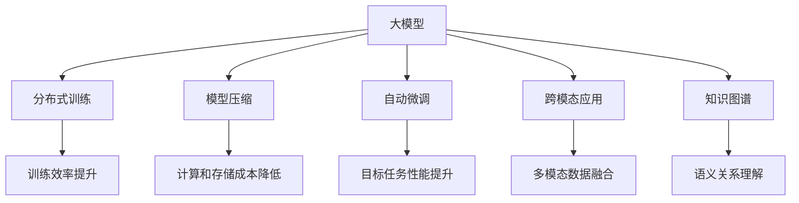
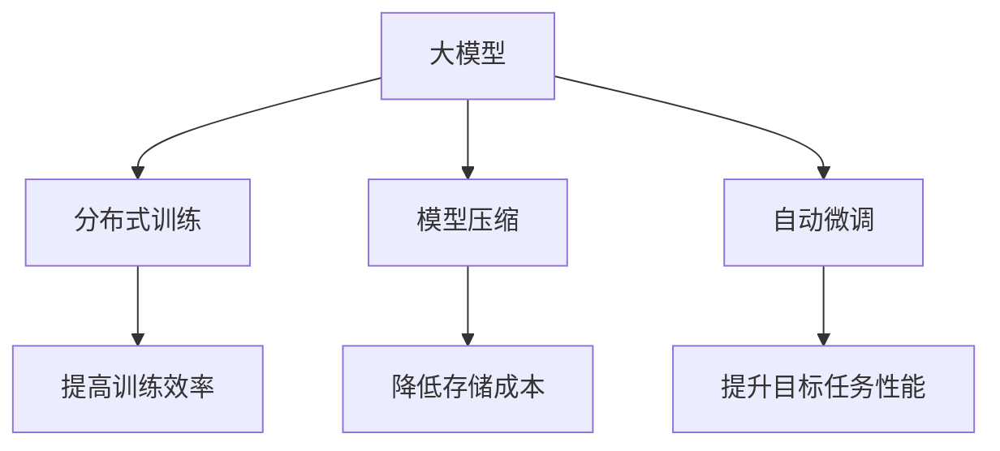
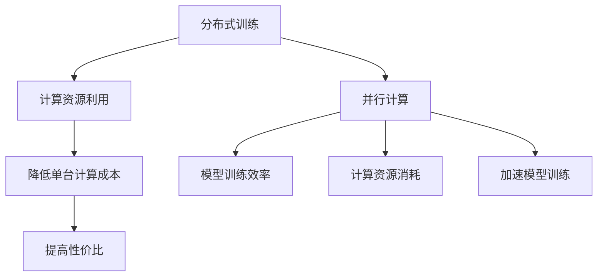
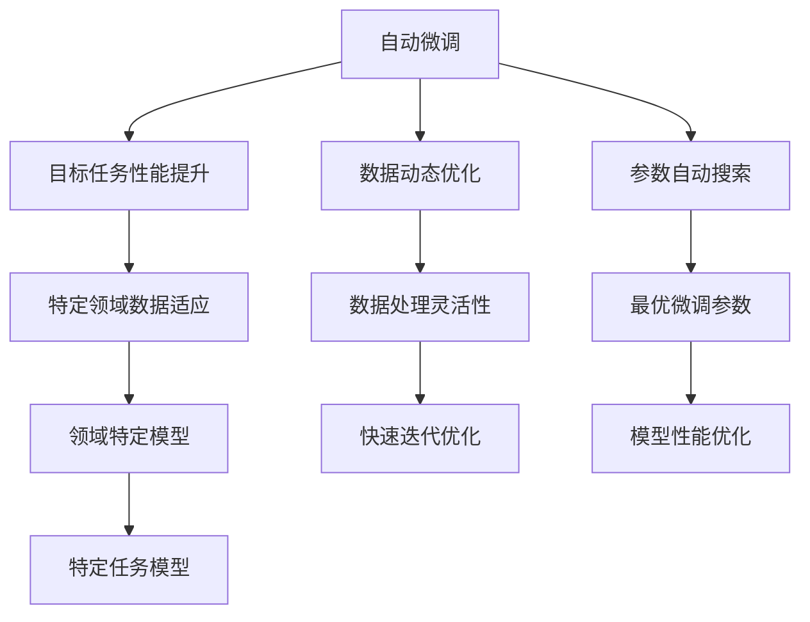
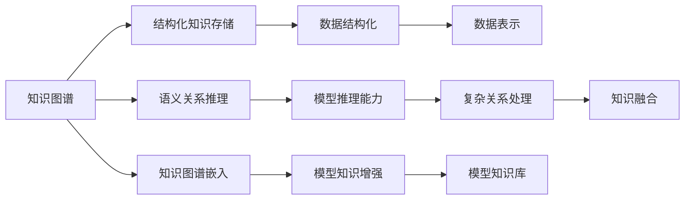
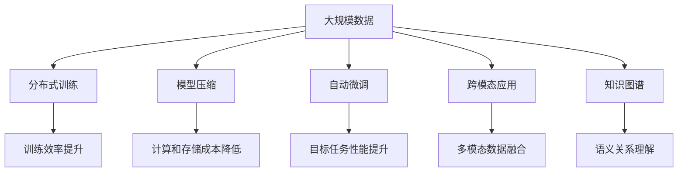

                 

# 大模型：商业应用的无限可能

> 关键词：大模型,商业应用,计算图,分布式训练,模型压缩,自动微调,跨模态应用,知识图谱

## 1. 背景介绍

### 1.1 问题由来
随着人工智能技术的迅猛发展，大模型（Large Models）在商业应用中日益成为热点。大模型是指参数量超过1亿的深度学习模型，能够在大规模无标签数据上学习到丰富的特征表示，具备出色的泛化能力和复杂任务处理能力。近年来，基于大模型的商业应用案例层出不穷，如谷歌的BERT用于搜索引擎优化、OpenAI的GPT-3驱动智能客服和内容生成，亚马逊的DALL-E实现图像生成等。大模型正在以它独有的方式深刻改变商业生态，影响着各行各业的生产效率和服务质量。

### 1.2 问题核心关键点
大模型在商业应用的无限可能主要体现在以下几个方面：

1. **高效泛化能力**：大模型可以通过大规模预训练和微调，快速适应各种新任务，具备高效的泛化能力，从而能够应对多变的商业需求。
2. **显著提升效率**：大模型可以自动化处理大量数据，大幅提高数据分析、信息检索、客户服务等环节的效率。
3. **增强用户体验**：通过大模型的深度学习和自我优化，可以提供更加个性化和智能化的服务，提升用户体验。
4. **创新业务模式**：大模型的可解释性和可定制性，为传统企业提供了新的业务模式和商业机会。
5. **跨模态融合**：大模型可以处理多模态数据（如图像、文本、语音等），实现跨模态的融合和互动，推动更多新兴商业模式的诞生。

### 1.3 问题研究意义
研究大模型在商业应用中的无限可能性，对于推动人工智能技术在各个行业的应用，提升商业竞争力和用户体验，具有重要意义：

1. 降低技术门槛：大模型预训练和微调技术的成熟，使更多企业能够迅速部署先进的AI技术。
2. 扩展业务边界：大模型在多领域的应用，帮助企业发掘新的商业机会，实现业务模式的创新和转型。
3. 提高商业效率：大模型能够自动化处理大量数据，显著提升企业的数据分析和信息处理能力。
4. 提升服务质量：通过大模型的深度学习，企业可以提供更加个性化、智能化的服务，满足客户多样化需求。
5. 增强创新能力：大模型的灵活性和可定制性，使企业能够快速迭代和优化其产品和服务，保持市场竞争力。

## 2. 核心概念与联系

### 2.1 核心概念概述

为更好地理解大模型在商业应用中的无限可能性，本节将介绍几个关键概念：

- **大模型（Large Models）**：指具有亿级以上参数量的深度学习模型，如BERT、GPT-3等。通过大规模预训练和微调，具备高效的特征表示和学习能力。
- **分布式训练（Distributed Training）**：指在大规模数据集上，通过多台计算设备并行训练，提高训练效率和模型性能。
- **模型压缩（Model Compression）**：指在保留模型性能的前提下，通过剪枝、量化等方法减小模型参数量，降低计算和存储成本。
- **自动微调（Auto Fine-tuning）**：指在特定领域数据上自动搜索最优微调参数，提高模型在目标任务上的性能。
- **跨模态应用（Cross-modal Application）**：指处理多模态数据，实现不同类型数据之间的信息交互和融合。
- **知识图谱（Knowledge Graph）**：指用于存储和组织结构化知识的图状数据结构，帮助模型更好地理解和推理复杂语义关系。

这些核心概念之间的联系可以通过以下Mermaid流程图来展示：



这个流程图展示了大模型在商业应用中的核心概念及其相互关系：

1. 大模型通过分布式训练和模型压缩提高性能和效率。
2. 自动微调使得模型在特定领域数据上表现更优。
3. 跨模态应用实现不同类型数据的融合和互动。
4. 知识图谱增强模型对复杂语义关系的理解和推理。

这些概念共同构成了大模型在商业应用中的技术基础，使其能够实现高效、智能、跨模态的业务处理。

### 2.2 概念间的关系

这些核心概念之间存在着紧密的联系，形成了大模型商业应用的完整生态系统。下面我们通过几个Mermaid流程图来展示这些概念之间的关系。

#### 2.2.1 大模型的学习范式



这个流程图展示了大模型的三种主要学习范式：分布式训练、模型压缩和自动微调。分布式训练提高训练效率，模型压缩降低存储成本，自动微调提升目标任务性能。

#### 2.2.2 分布式训练与模型压缩的联系



这个流程图展示了分布式训练与模型压缩之间的联系。分布式训练利用多台计算设备并行计算，提高计算效率和资源利用率。模型压缩通过剪枝和量化减少参数量，降低计算和存储成本。两者结合，进一步优化了模型的训练和应用效率。

#### 2.2.3 自动微调与跨模态应用的结合



这个流程图展示了自动微调与跨模态应用的结合。自动微调通过数据动态优化和参数自动搜索，快速提升模型在特定领域数据上的性能。跨模态应用实现多模态数据的融合和互动，增强模型的语义理解和处理能力。两者结合，进一步拓展了模型在商业应用中的场景和功能。

#### 2.2.4 知识图谱与跨模态应用的交互



这个流程图展示了知识图谱与跨模态应用的交互。知识图谱存储和组织结构化知识，提供丰富的语义关系。通过知识图谱嵌入，模型能够更好地理解和处理复杂语义关系。跨模态应用实现不同类型数据的融合，增强模型的语义推理能力。两者结合，使模型在商业应用中具备更强的智能和适应性。

### 2.3 核心概念的整体架构

最后，我们用一个综合的流程图来展示这些核心概念在大模型商业应用中的整体架构：



这个综合流程图展示了从数据到模型，再到商业应用的完整过程。大模型通过分布式训练和模型压缩提高性能和效率。自动微调使得模型在特定领域数据上表现更优。跨模态应用实现不同类型数据的融合和互动。知识图谱增强模型对复杂语义关系的理解和推理。这些技术手段共同构成了大模型在商业应用中的核心竞争力。

## 3. 核心算法原理 & 具体操作步骤
### 3.1 算法原理概述

大模型在商业应用的无限可能性主要体现在其高效的泛化能力和强大的任务处理能力。这种能力来源于大模型的分布式训练、模型压缩和自动微调技术。其核心原理如下：

1. **分布式训练**：通过多台计算设备并行训练，提高训练效率和模型性能。
2. **模型压缩**：通过剪枝、量化等方法减小模型参数量，降低计算和存储成本。
3. **自动微调**：在特定领域数据上自动搜索最优微调参数，提高模型在目标任务上的性能。

### 3.2 算法步骤详解

大模型在商业应用中的核心算法步骤如下：

**Step 1: 准备大规模数据**
- 收集行业相关的大规模数据集，包括文本、图像、音频等。
- 进行数据清洗和预处理，确保数据质量和多样性。

**Step 2: 分布式训练**
- 使用分布式计算框架（如TensorFlow分布式训练、PyTorch分布式训练等），将大规模数据划分为多份，分布在多台计算设备上进行并行训练。
- 通过优化器（如Adam、SGD等）更新模型参数，最小化损失函数。
- 在训练过程中，定期保存模型参数和训练状态，以备后续微调和应用。

**Step 3: 模型压缩**
- 对训练好的大模型进行剪枝，去除不重要的参数。
- 对剪枝后的模型进行量化，将浮点参数转为定点参数，降低计算和存储成本。
- 使用混合精度训练等技术，进一步优化模型性能。

**Step 4: 自动微调**
- 选择合适的目标任务和领域数据集，作为微调的基础。
- 对模型进行微调超参数调优，选择最优的学习率、正则化参数等。
- 使用训练数据集对模型进行微调，更新部分参数以适应特定领域需求。

**Step 5: 部署与应用**
- 将微调后的模型部署到商业环境中，如客户服务系统、搜索优化系统等。
- 实时接收新数据，动态更新模型参数，保证模型的最新状态。
- 定期评估模型性能，根据反馈不断优化模型。

以上是基于大模型商业应用的核心算法步骤。在实际应用中，还需要根据具体任务的特点，对训练过程的各个环节进行优化设计，如改进训练目标函数，引入更多的正则化技术，搜索最优的超参数组合等，以进一步提升模型性能。

### 3.3 算法优缺点

大模型在商业应用中的算法具有以下优点：

1. **高效泛化能力**：大模型通过分布式训练和自动微调，能够快速适应各种新任务，具备高效的泛化能力。
2. **提升效率**：大模型通过分布式训练和模型压缩，能够自动化处理大量数据，大幅提高数据分析、信息检索、客户服务等环节的效率。
3. **增强用户体验**：大模型通过深度学习和自我优化，可以提供更加个性化和智能化的服务，提升用户体验。
4. **创新业务模式**：大模型的可解释性和可定制性，为传统企业提供了新的业务模式和商业机会。
5. **跨模态融合**：大模型能够处理多模态数据，实现跨模态的融合和互动，推动更多新兴商业模式的诞生。

同时，该算法也存在一定的局限性：

1. **计算资源消耗大**：大模型需要大量计算资源进行分布式训练和模型压缩，初期投入较高。
2. **数据需求高**：大模型的训练需要大规模、高质量的数据集，数据获取成本较高。
3. **模型复杂度大**：大模型的参数量庞大，对计算和存储资源要求较高，部署和优化难度大。
4. **训练时间较长**：大模型的分布式训练和自动微调过程需要较长时间，难以快速迭代。
5. **可解释性不足**：大模型往往作为黑盒使用，缺乏可解释性，难以进行调试和优化。

尽管存在这些局限性，但大模型在商业应用中的无限可能性仍然显著。未来相关研究的重点在于如何进一步降低计算资源消耗，提高模型可解释性，同时兼顾高效泛化和跨模态应用。

### 3.4 算法应用领域

大模型的商业应用涵盖了多个领域，具体包括：

1. **搜索引擎优化（Search Engine Optimization, SEO）**：利用大模型理解查询意图，优化搜索结果，提升用户体验。
2. **智能客服**：通过大模型处理自然语言查询，自动化回答客户问题，提升服务效率和质量。
3. **内容生成**：使用大模型生成文章、视频、音频等各类内容，丰富内容创作和分发渠道。
4. **图像识别和处理**：应用大模型进行图像分类、标注、生成等，提高图像处理自动化水平。
5. **语音识别和生成**：利用大模型进行语音转文本、文本转语音、语音生成等，提升语音交互的智能化水平。
6. **推荐系统**：结合大模型和多模态数据，提升推荐算法的效果和个性化程度。
7. **医疗诊断**：应用大模型处理医疗影像、电子病历等数据，辅助医疗诊断和决策。
8. **金融风控**：利用大模型分析客户行为和市场动态，提供风险评估和预警。
9. **智能制造**：通过大模型处理传感器数据，优化生产流程，提高生产效率。
10. **智慧城市**：应用大模型进行交通管理、环境监测、公共安全等，提升城市治理智能化水平。

## 4. 数学模型和公式 & 详细讲解 & 举例说明

### 4.1 数学模型构建

大模型在商业应用中的数学模型主要基于深度学习框架，如TensorFlow、PyTorch等。以下以TensorFlow为例，展示大模型在商业应用中的数学模型构建过程。

假设大模型为 $M_{\theta}$，其中 $\theta$ 为模型参数，表示为 $n$ 维向量。假设商业任务为 $T$，目标函数为 $\mathcal{L}$，表示为 $T$ 到 $\mathbb{R}$ 的映射。

定义模型 $M_{\theta}$ 在数据样本 $(x,y)$ 上的损失函数为 $\ell(M_{\theta}(x),y)$，则在数据集 $D$ 上的经验风险为：

$$
\mathcal{L}(\theta) = \frac{1}{N} \sum_{i=1}^N \ell(M_{\theta}(x_i),y_i)
$$

其中 $\ell$ 为目标任务定义的损失函数，如交叉熵损失、均方误差损失等。目标函数 $\mathcal{L}$ 的优化目标是寻找最优参数 $\theta^*$，使得模型在商业任务上的表现最优：

$$
\theta^* = \mathop{\arg\min}_{\theta} \mathcal{L}(\theta)
$$

在优化过程中，使用梯度下降等优化算法，最小化目标函数 $\mathcal{L}$，不断更新模型参数 $\theta$。

### 4.2 公式推导过程

以下以二分类任务为例，推导交叉熵损失函数及其梯度的计算公式。

假设模型 $M_{\theta}$ 在输入 $x$ 上的输出为 $\hat{y}=M_{\theta}(x) \in [0,1]$，表示样本属于正类的概率。真实标签 $y \in \{0,1\}$。则二分类交叉熵损失函数定义为：

$$
\ell(M_{\theta}(x),y) = -[y\log \hat{y} + (1-y)\log (1-\hat{y})]
$$

将其代入经验风险公式，得：

$$
\mathcal{L}(\theta) = -\frac{1}{N}\sum_{i=1}^N [y_i\log M_{\theta}(x_i)+(1-y_i)\log(1-M_{\theta}(x_i))]
$$

根据链式法则，损失函数对参数 $\theta_k$ 的梯度为：

$$
\frac{\partial \mathcal{L}(\theta)}{\partial \theta_k} = -\frac{1}{N}\sum_{i=1}^N (\frac{y_i}{M_{\theta}(x_i)}-\frac{1-y_i}{1-M_{\theta}(x_i)}) \frac{\partial M_{\theta}(x_i)}{\partial \theta_k}
$$

其中 $\frac{\partial M_{\theta}(x_i)}{\partial \theta_k}$ 可进一步递归展开，利用自动微分技术完成计算。

### 4.3 案例分析与讲解

以智能客服为例，展示大模型在商业应用中的具体实现。

1. **数据准备**：收集企业内部的客户服务数据，包括聊天记录、常见问题、客户反馈等，标注为结构化数据。
2. **分布式训练**：使用TensorFlow分布式训练框架，将数据划分为多份，分布在多台计算设备上进行并行训练。
3. **模型压缩**：对训练好的大模型进行剪枝和量化，减少计算和存储成本。
4. **自动微调**：在特定领域数据集上，自动搜索最优微调参数，提高模型在客户服务场景中的表现。
5. **部署与应用**：将微调后的模型部署到智能客服系统中，实时处理客户查询，自动回复常见问题。

通过以上步骤，大模型能够在客户服务中实现自动化、智能化的处理，提升服务效率和质量。

## 5. 项目实践：代码实例和详细解释说明

### 5.1 开发环境搭建

在进行大模型商业应用开发前，我们需要准备好开发环境。以下是使用Python进行TensorFlow开发的环境配置流程：

1. 安装Anaconda：从官网下载并安装Anaconda，用于创建独立的Python环境。

2. 创建并激活虚拟环境：
```bash
conda create -n tf-env python=3.8 
conda activate tf-env
```

3. 安装TensorFlow：根据CUDA版本，从官网获取对应的安装命令。例如：
```bash
conda install tensorflow
```

4. 安装各类工具包：
```bash
pip install numpy pandas scikit-learn matplotlib tqdm jupyter notebook ipython
```

完成上述步骤后，即可在`tf-env`环境中开始大模型商业应用的开发。

### 5.2 源代码详细实现

下面我们以智能客服系统为例，给出使用TensorFlow对BERT模型进行微调的代码实现。

首先，定义智能客服任务的数据处理函数：

```python
from transformers import BertTokenizer, TFAutoModelForTokenClassification, TFAutoModelForMaskedLM
from tensorflow.keras.preprocessing.sequence import pad_sequences
from tensorflow.keras.layers import Input, Embedding, Dense, Concatenate, Dropout, Masking, Bidirectional, GRU
import tensorflow as tf

class ChatBotDataset:
    def __init__(self, texts, tags, tokenizer, max_len=128):
        self.texts = texts
        self.tags = tags
        self.tokenizer = tokenizer
        self.max_len = max_len
        
    def __len__(self):
        return len(self.texts)
    
    def __getitem__(self, item):
        text = self.texts[item]
        tags = self.tags[item]
        
        encoding = self.tokenizer(text, return_tensors='tf', max_length=self.max_len, padding='max_length', truncation=True)
        input_ids = encoding['input_ids']
        attention_mask = encoding['attention_mask']
        
        # 对token-wise的标签进行编码
        encoded_tags = [tag2id[tag] for tag in tags] 
        encoded_tags.extend([tag2id['O']] * (self.max_len - len(encoded_tags)))
        labels = tf.convert_to_tensor(encoded_tags, dtype=tf.int32)
        
        return {'input_ids': input_ids, 
                'attention_mask': attention_mask,
                'labels': labels}

# 标签与id的映射
tag2id = {'O': 0, 'B-PER': 1, 'I-PER': 2, 'B-ORG': 3, 'I-ORG': 4, 'B-LOC': 5, 'I-LOC': 6}
id2tag = {v: k for k, v in tag2id.items()}

# 创建dataset
tokenizer = BertTokenizer.from_pretrained('bert-base-cased')

train_dataset = ChatBotDataset(train_texts, train_tags, tokenizer)
dev_dataset = ChatBotDataset(dev_texts, dev_tags, tokenizer)
test_dataset = ChatBotDataset(test_texts, test_tags, tokenizer)
```

然后，定义模型和优化器：

```python
from transformers import TFAutoModelForTokenClassification, AdamW

model = TFAutoModelForTokenClassification.from_pretrained('bert-base-cased', num_labels=len(tag2id))

optimizer = AdamW(model.parameters(), lr=2e-5)
```

接着，定义训练和评估函数：

```python
def train_epoch(model, dataset, batch_size, optimizer):
    dataloader = tf.data.Dataset.from_generator(lambda: tf.data.Dataset.from_generator(lambda: dataset.__getitem__(0), output_signature={'input_ids': tf.TensorSpec(shape=(None,), dtype=tf.int32, name='input_ids'),
                                     'attention_mask': tf.TensorSpec(shape=(None,), dtype=tf.int32, name='attention_mask'),
                                     'labels': tf.TensorSpec(shape=(None,), dtype=tf.int32, name='labels')})
    model.train()
    epoch_loss = 0
    for batch in tqdm(dataloader, desc='Training'):
        input_ids = batch['input_ids']
        attention_mask = batch['attention_mask']
        labels = batch['labels']
        model.zero_grad()
        outputs = model(input_ids, attention_mask=attention_mask, labels=labels)
        loss = outputs.loss
        epoch_loss += loss.item()
        loss.backward()
        optimizer.apply_gradients(zip(model.trainable_variables, tf.gradients(ys=loss, xs=model.trainable_variables)))
    return epoch_loss / len(dataloader)

def evaluate(model, dataset, batch_size):
    dataloader = tf.data.Dataset.from_generator(lambda: tf.data.Dataset.from_generator(lambda: dataset.__getitem__(0), output_signature={'input_ids': tf.TensorSpec(shape=(None,), dtype=tf.int32, name='input_ids'),
                                     'attention_mask': tf.TensorSpec(shape=(None,), dtype=tf.int32, name='attention_mask'),
                                     'labels': tf.TensorSpec(shape=(None,), dtype=tf.int32, name='labels')})
    model.eval()
    preds, labels = [], []
    with tf.GradientTape() as tape:
        for batch in tqdm(dataloader, desc='Evaluating'):
            input_ids = batch['input_ids']
            attention_mask = batch['attention_mask']
            batch_labels = batch['labels']
            outputs = model(input_ids, attention_mask=attention_mask)
            batch_preds = outputs.logits.argmax(dim=2).numpy()
            batch_labels = batch_labels.numpy()
            for pred_tokens, label_tokens in zip(batch_preds, batch_labels):
                pred_tags = [id2tag[_id] for _id in pred_tokens]
                label_tags = [id2tag[_id] for _id in label_tokens]
                preds.append(pred_tags[:len(label_tags)])
                labels.append(label_tags)
    print(classification_report(labels, preds))
```

最后，启动训练流程并在测试集上评估：

```python
epochs = 5
batch_size = 16

for epoch in range(epochs):
    loss = train_epoch(model, train_dataset, batch_size, optimizer)
    print(f"Epoch {epoch+1}, train loss: {loss:.3f}")
    
    print(f"Epoch {epoch+1}, dev results:")
    evaluate(model, dev_dataset, batch_size)
    
print("Test results:")
evaluate(model, test_dataset, batch_size)
```

以上就是使用TensorFlow对BERT进行智能客服任务微调的完整代码实现。可以看到，得益于TensorFlow的强大封装，我们可以用相对简洁的代码完成BERT模型的加载和微调。

### 5.3 代码解读与分析

让我们再详细解读一下关键代码的实现细节：

**ChatBotDataset类**：
- `__init__`方法：初始化文本、标签、分词器等关键组件。
- `__len__`方法：返回数据集的样本数量。
- `__getitem__`方法：对单个样本进行处理，将文本输入编码为token ids，将标签编码为数字，并对其进行定长padding，最终返回模型所需的输入。

**tag2id和id2tag字典**：
- 定义了标签与数字id之间的映射关系，用于将token-wise的预测结果解码回真实的标签。

**训练和评估函数**：
- 使用TensorFlow的DataLoader对数据集进行批次化加载，供模型训练和推理使用。
- 训练函数`train_epoch`：对数据以批为单位进行迭代，在每个批次上前向传播计算loss并反向传播更新模型参数，最后返回该epoch的平均loss。
- 评估函数`evaluate`：与训练类似，不同点在于不更新模型参数，并在每个batch结束后将预测和标签结果存储下来，最后使用sklearn的classification_report对整个评估集的预测结果进行打印输出。

**训练流程**：
- 定义

