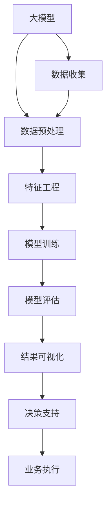
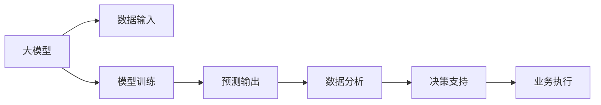
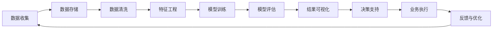
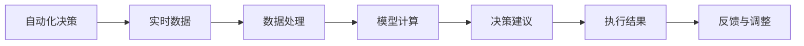
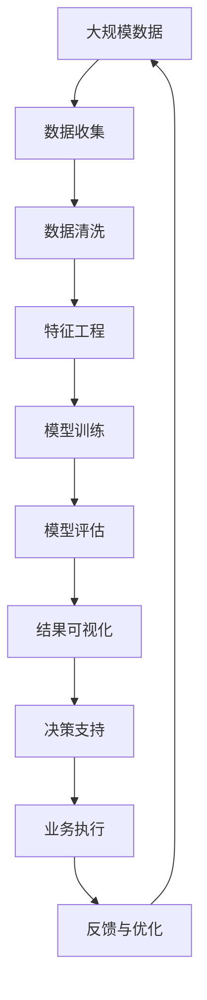

                 

# 大模型：智能时代的商业新生态

> 关键词：大模型,商业智能,企业决策,数据驱动,人工智能,深度学习

## 1. 背景介绍

### 1.1 问题由来
随着人工智能技术的迅猛发展，尤其是深度学习和数据科学的应用日益广泛，大数据和智能算法正在深刻地改变着各行各业的运营模式和商业生态。大模型（Large Models）作为新时代的智能引擎，通过在海量数据上预训练和微调，获得了前所未有的强大语言理解能力和泛化能力，为商业智能（Business Intelligence, BI）注入了新的动力。

从零售、金融到医疗、教育，大模型在众多领域展示了其在提升运营效率、降低成本、优化客户体验等方面的巨大潜力。然而，如何高效利用大模型技术，将其与商业实践紧密结合，最大化发挥其商业价值，成为当前AI从业者和企业决策者们亟需解决的课题。

### 1.2 问题核心关键点
大模型在商业智能中的应用，核心在于其强大的数据分析和预测能力，能够基于历史数据、用户行为等构建预测模型，为决策者提供科学依据。但关键点在于，大模型的商业化应用不能仅停留在算法和数据上，更需要结合具体行业特点和实际需求，进行合理的模型构建、参数调优和结果解释。

此外，大模型在实际部署和应用中，面临数据隐私、模型偏见、系统稳定性等诸多挑战，需要综合考虑技术、业务、法律和伦理等多方面因素。

### 1.3 问题研究意义
研究大模型在商业智能中的应用，对于推动AI技术在垂直行业的落地应用，优化企业决策流程，提高运营效率，具有重要意义：

1. **数据驱动决策**：大模型能够基于历史数据和实时数据，进行多维度分析，为企业决策提供科学依据。
2. **优化资源配置**：通过预测模型，企业可以更精确地预测市场需求、库存需求、人员需求等，优化资源配置，降低成本。
3. **提升客户体验**：大模型能够分析用户行为，预测用户需求，优化产品推荐和服务流程，提升客户满意度。
4. **加速产品迭代**：基于用户反馈和市场数据，大模型能够辅助产品迭代和创新，快速响应市场变化。
5. **助力风险管理**：大模型能够识别潜在的风险因素，预测风险趋势，辅助企业进行风险管理和决策。

## 2. 核心概念与联系

### 2.1 核心概念概述

为更好地理解大模型在商业智能中的应用，本节将介绍几个密切相关的核心概念：

- **大模型（Large Model）**：指通过预训练和微调获得强大语言理解能力的深度学习模型，如BERT、GPT等。这些模型通常具有亿级参数规模，能够在多个自然语言处理任务中取得领先表现。

- **商业智能（Business Intelligence, BI）**：通过数据收集、分析、可视化等手段，为企业决策者提供数据支持的综合工具。

- **预测模型（Predictive Model）**：基于历史数据和特征，构建的用于预测未来趋势和行为的模型，常用于需求预测、客户行为分析等。

- **数据挖掘（Data Mining）**：通过自动化方法从大量数据中提取有价值的信息和模式，常用于市场分析、客户画像构建等。

- **自动化决策（Automated Decision Making）**：指利用算法和模型，自动化生成决策建议和方案，减少人为干预，提高决策效率。

- **实时数据分析（Real-time Data Analysis）**：对实时数据流进行即时分析，快速响应市场变化和用户需求，常用于库存管理、价格调整等。

这些核心概念之间的逻辑关系可以通过以下Mermaid流程图来展示：



这个流程图展示了从数据到决策的全流程：首先通过大模型对数据进行预处理和特征提取，然后进行模型训练和评估，最终通过可视化结果支持业务决策并执行。

### 2.2 概念间的关系

这些核心概念之间存在着紧密的联系，形成了商业智能应用的全生态系统。下面我通过几个Mermaid流程图来展示这些概念之间的关系。

#### 2.2.1 大模型与商业智能的联系



这个流程图展示了大模型在商业智能中的应用流程：首先通过大模型处理输入数据，得到预测输出，再通过数据分析得到有价值的业务洞见，支持决策和执行。

#### 2.2.2 商业智能的业务链



这个流程图展示了商业智能的业务链：从数据收集到业务执行的闭环流程，最后通过反馈和优化进一步完善数据和模型，形成持续改进的闭环。

#### 2.2.3 自动化决策与实时数据分析



这个流程图展示了自动化决策的实时流程：首先通过实时数据进行处理和计算，然后生成决策建议并执行，最后根据反馈进行调整，形成一个循环。

### 2.3 核心概念的整体架构

最后，我们用一个综合的流程图来展示这些核心概念在大模型商业智能应用中的整体架构：



这个综合流程图展示了从数据收集到业务执行的完整流程，大模型在其中扮演着数据处理和特征提取的核心角色，而商业智能技术则通过数据分析和可视化支持决策执行和反馈优化，最终形成闭环的智能决策链。

## 3. 核心算法原理 & 具体操作步骤
### 3.1 算法原理概述

大模型在商业智能中的应用，主要基于其强大的语言理解和分析能力。通过对历史数据和用户行为的分析，构建预测模型，从而预测未来趋势和行为。

以客户流失预测为例，假设模型为 $M_{\theta}$，其中 $\theta$ 为模型参数。给定历史客户数据集 $D=\{(x_i, y_i)\}_{i=1}^N, x_i \in \mathbb{R}^d, y_i \in \{0,1\}$，其中 $x_i$ 表示客户历史行为特征，$y_i$ 表示客户流失与否。

定义模型 $M_{\theta}$ 在输入 $x$ 上的输出为 $\hat{y}=M_{\theta}(x) \in [0,1]$，表示客户流失概率。真实标签 $y \in \{0,1\}$。则二分类交叉熵损失函数定义为：

$$
\ell(M_{\theta}(x),y) = -[y\log \hat{y} + (1-y)\log (1-\hat{y})]
$$

将损失函数应用到整个数据集 $D$ 上，得：

$$
\mathcal{L}(\theta) = -\frac{1}{N}\sum_{i=1}^N [y_i\log M_{\theta}(x_i)+(1-y_i)\log(1-M_{\theta}(x_i))]
$$

通过梯度下降等优化算法，最小化损失函数 $\mathcal{L}(\theta)$，使得模型输出逼近真实标签。最终得到的模型参数 $\hat{\theta}$ 即为预测模型的参数。

### 3.2 算法步骤详解

基于大模型的商业智能应用主要包括以下几个关键步骤：

**Step 1: 数据收集与处理**

- 收集与业务相关的各类数据，包括用户行为、市场趋势、客户反馈等。
- 清洗数据，去除异常值和噪声，确保数据质量。
- 特征工程，提取和构造对预测任务有意义的特征。

**Step 2: 模型训练**

- 选择合适的模型结构和大模型，如BERT、GPT等。
- 将处理后的数据分为训练集、验证集和测试集。
- 使用优化算法训练模型，最小化损失函数。
- 在验证集上评估模型性能，调整超参数和模型结构。

**Step 3: 结果评估与优化**

- 在测试集上评估模型效果，计算准确率、召回率、F1分数等指标。
- 分析模型输出结果，寻找可能的改进点。
- 调整模型参数和特征工程，进行模型优化。

**Step 4: 结果可视化与决策支持**

- 将模型输出结果可视化，生成图表和报告。
- 将预测结果和可视化结果支持业务决策，生成决策建议。
- 自动化决策系统根据建议执行业务操作。

**Step 5: 反馈与优化**

- 收集业务执行后的反馈数据。
- 根据反馈数据调整模型参数和特征工程。
- 形成闭环反馈机制，持续优化预测模型。

### 3.3 算法优缺点

大模型在商业智能中的应用具有以下优点：

1. **强大的数据分析能力**：大模型能够处理大规模数据集，从中提取有价值的洞见。
2. **高度泛化性能**：大模型在多个任务上表现出色，具有较高的泛化能力。
3. **灵活的业务应用**：大模型可以应用于多种业务场景，如市场分析、客户画像、风险管理等。

同时，大模型在商业智能中也有以下缺点：

1. **高昂的计算成本**：大模型通常具有亿级参数规模，训练和推理需要大量计算资源。
2. **数据隐私问题**：商业智能应用往往涉及大量用户隐私数据，需要严格的数据保护措施。
3. **模型解释性不足**：大模型的决策过程复杂，难以解释，可能会影响业务信任度。
4. **依赖高质量数据**：大模型的表现高度依赖于数据质量和数量，低质量数据会导致模型偏差。

### 3.4 算法应用领域

大模型在商业智能中的应用领域广泛，涵盖了从市场分析、客户管理到产品推荐等多个方面：

- **市场分析**：利用大模型分析市场趋势和消费者行为，预测市场需求和价格变化。
- **客户管理**：通过大模型预测客户流失、客户满意度，进行客户细分和忠诚度管理。
- **产品推荐**：基于用户行为数据，预测用户偏好，优化产品推荐策略。
- **风险管理**：利用大模型预测信用风险、欺诈风险，优化风险控制策略。
- **营销决策**：结合用户数据和市场数据，生成营销决策建议。

除了上述应用，大模型还在供应链管理、人力资源管理、客户服务等领域展现了其强大的潜力。

## 4. 数学模型和公式 & 详细讲解 & 举例说明

### 4.1 数学模型构建

大模型在商业智能中的数学模型构建，通常基于以下步骤：

1. **数据准备**：收集与业务相关的数据，进行预处理和特征工程。
2. **模型选择**：选择合适的深度学习模型结构，如线性回归、随机森林、深度神经网络等。
3. **训练与验证**：使用训练集训练模型，在验证集上评估模型性能，调整超参数和模型结构。
4. **测试与优化**：在测试集上测试模型效果，根据结果进行模型优化。

以客户流失预测为例，数学模型构建如下：

假设模型为 $M_{\theta}$，其中 $\theta$ 为模型参数。给定历史客户数据集 $D=\{(x_i, y_i)\}_{i=1}^N, x_i \in \mathbb{R}^d, y_i \in \{0,1\}$，其中 $x_i$ 表示客户历史行为特征，$y_i$ 表示客户流失与否。

定义模型 $M_{\theta}$ 在输入 $x$ 上的输出为 $\hat{y}=M_{\theta}(x) \in [0,1]$，表示客户流失概率。真实标签 $y \in \{0,1\}$。则二分类交叉熵损失函数定义为：

$$
\ell(M_{\theta}(x),y) = -[y\log \hat{y} + (1-y)\log (1-\hat{y})]
$$

将损失函数应用到整个数据集 $D$ 上，得：

$$
\mathcal{L}(\theta) = -\frac{1}{N}\sum_{i=1}^N [y_i\log M_{\theta}(x_i)+(1-y_i)\log(1-M_{\theta}(x_i))]
$$

通过梯度下降等优化算法，最小化损失函数 $\mathcal{L}(\theta)$，使得模型输出逼近真实标签。最终得到的模型参数 $\hat{\theta}$ 即为预测模型的参数。

### 4.2 公式推导过程

以客户流失预测为例，我们推导二分类交叉熵损失函数的梯度：

$$
\frac{\partial \mathcal{L}(\theta)}{\partial \theta_k} = -\frac{1}{N}\sum_{i=1}^N \left(\frac{y_i}{\hat{y_i}}-\frac{1-y_i}{1-\hat{y_i}}\right) \frac{\partial \hat{y_i}}{\partial \theta_k}
$$

其中 $\frac{\partial \hat{y_i}}{\partial \theta_k}$ 为模型对 $x_i$ 的梯度，可通过反向传播算法计算。

通过上述公式，我们可以计算出模型参数 $\theta$ 的梯度，进而使用优化算法进行参数更新。

### 4.3 案例分析与讲解

以下是一个具体的案例分析：

假设某电商平台希望利用大模型预测客户流失情况，首先收集了客户的历史购买行为、评价反馈、时间窗口等数据。

数据预处理包括：
1. 去除缺失值和异常值，确保数据质量。
2. 对数据进行标准化处理，确保数值一致性。
3. 特征工程包括：
   - 用户行为特征：购买频率、购买金额、平均评分等。
   - 时间特征：注册时间、最近一次购买时间、会员等级等。
   - 客户属性：年龄、性别、地域等。

选择BERT模型作为预测模型，使用训练集训练模型，在验证集上评估模型性能。通过调整超参数和模型结构，最终在测试集上得到理想的预测结果。

## 5. 项目实践：代码实例和详细解释说明

### 5.1 开发环境搭建

在进行商业智能项目开发前，需要准备好开发环境。以下是使用Python进行PyTorch开发的环境配置流程：

1. 安装Anaconda：从官网下载并安装Anaconda，用于创建独立的Python环境。

2. 创建并激活虚拟环境：
```bash
conda create -n pytorch-env python=3.8 
conda activate pytorch-env
```

3. 安装PyTorch：根据CUDA版本，从官网获取对应的安装命令。例如：
```bash
conda install pytorch torchvision torchaudio cudatoolkit=11.1 -c pytorch -c conda-forge
```

4. 安装各类工具包：
```bash
pip install numpy pandas scikit-learn matplotlib tqdm jupyter notebook ipython
```

完成上述步骤后，即可在`pytorch-env`环境中开始商业智能项目开发。

### 5.2 源代码详细实现

这里我们以客户流失预测为例，给出使用Transformers库对BERT模型进行训练的PyTorch代码实现。

首先，定义数据处理函数：

```python
from transformers import BertTokenizer
from torch.utils.data import Dataset
import torch

class CustomerDataset(Dataset):
    def __init__(self, texts, labels, tokenizer, max_len=128):
        self.texts = texts
        self.labels = labels
        self.tokenizer = tokenizer
        self.max_len = max_len
        
    def __len__(self):
        return len(self.texts)
    
    def __getitem__(self, item):
        text = self.texts[item]
        label = self.labels[item]
        
        encoding = self.tokenizer(text, return_tensors='pt', max_length=self.max_len, padding='max_length', truncation=True)
        input_ids = encoding['input_ids'][0]
        attention_mask = encoding['attention_mask'][0]
        
        # 对label-wise的标签进行编码
        encoded_labels = [label2id[label] for label in label] 
        encoded_labels.extend([label2id['loss']]*(self.max_len - len(encoded_labels)))
        labels = torch.tensor(encoded_labels, dtype=torch.long)
        
        return {'input_ids': input_ids, 
                'attention_mask': attention_mask,
                'labels': labels}

# 标签与id的映射
label2id = {'loss': 0, '0': 1, '1': 2}
id2label = {v: k for k, v in label2id.items()}

# 创建dataset
tokenizer = BertTokenizer.from_pretrained('bert-base-cased')

train_dataset = CustomerDataset(train_texts, train_labels, tokenizer)
dev_dataset = CustomerDataset(dev_texts, dev_labels, tokenizer)
test_dataset = CustomerDataset(test_texts, test_labels, tokenizer)
```

然后，定义模型和优化器：

```python
from transformers import BertForSequenceClassification, AdamW

model = BertForSequenceClassification.from_pretrained('bert-base-cased', num_labels=len(label2id))

optimizer = AdamW(model.parameters(), lr=2e-5)
```

接着，定义训练和评估函数：

```python
from torch.utils.data import DataLoader
from tqdm import tqdm
from sklearn.metrics import classification_report

device = torch.device('cuda') if torch.cuda.is_available() else torch.device('cpu')
model.to(device)

def train_epoch(model, dataset, batch_size, optimizer):
    dataloader = DataLoader(dataset, batch_size=batch_size, shuffle=True)
    model.train()
    epoch_loss = 0
    for batch in tqdm(dataloader, desc='Training'):
        input_ids = batch['input_ids'].to(device)
        attention_mask = batch['attention_mask'].to(device)
        labels = batch['labels'].to(device)
        model.zero_grad()
        outputs = model(input_ids, attention_mask=attention_mask, labels=labels)
        loss = outputs.loss
        epoch_loss += loss.item()
        loss.backward()
        optimizer.step()
    return epoch_loss / len(dataloader)

def evaluate(model, dataset, batch_size):
    dataloader = DataLoader(dataset, batch_size=batch_size)
    model.eval()
    preds, labels = [], []
    with torch.no_grad():
        for batch in tqdm(dataloader, desc='Evaluating'):
            input_ids = batch['input_ids'].to(device)
            attention_mask = batch['attention_mask'].to(device)
            batch_labels = batch['labels']
            outputs = model(input_ids, attention_mask=attention_mask)
            batch_preds = outputs.logits.argmax(dim=2).to('cpu').tolist()
            batch_labels = batch_labels.to('cpu').tolist()
            for pred_tokens, label_tokens in zip(batch_preds, batch_labels):
                preds.append(pred_tokens[:len(label_tokens)])
                labels.append(label_tokens)
                
    print(classification_report(labels, preds))
```

最后，启动训练流程并在测试集上评估：

```python
epochs = 5
batch_size = 16

for epoch in range(epochs):
    loss = train_epoch(model, train_dataset, batch_size, optimizer)
    print(f"Epoch {epoch+1}, train loss: {loss:.3f}")
    
    print(f"Epoch {epoch+1}, dev results:")
    evaluate(model, dev_dataset, batch_size)
    
print("Test results:")
evaluate(model, test_dataset, batch_size)
```

以上就是使用PyTorch对BERT进行客户流失预测的完整代码实现。可以看到，得益于Transformers库的强大封装，我们可以用相对简洁的代码完成BERT模型的加载和训练。

### 5.3 代码解读与分析

让我们再详细解读一下关键代码的实现细节：

**CustomerDataset类**：
- `__init__`方法：初始化文本、标签、分词器等关键组件。
- `__len__`方法：返回数据集的样本数量。
- `__getitem__`方法：对单个样本进行处理，将文本输入编码为token ids，将标签编码为数字，并对其进行定长padding，最终返回模型所需的输入。

**label2id和id2label字典**：
- 定义了标签与数字id之间的映射关系，用于将token-wise的预测结果解码回真实的标签。

**训练和评估函数**：
- 使用PyTorch的DataLoader对数据集进行批次化加载，供模型训练和推理使用。
- 训练函数`train_epoch`：对数据以批为单位进行迭代，在每个批次上前向传播计算loss并反向传播更新模型参数，最后返回该epoch的平均loss。
- 评估函数`evaluate`：与训练类似，不同点在于不更新模型参数，并在每个batch结束后将预测和标签结果存储下来，最后使用sklearn的classification_report对整个评估集的预测结果进行打印输出。

**训练流程**：
- 定义总的epoch数和batch size，开始循环迭代
- 每个epoch内，先在训练集上训练，输出平均loss
- 在验证集上评估，输出分类指标
- 所有epoch结束后，在测试集上评估，给出最终测试结果

可以看到，PyTorch配合Transformers库使得BERT客户流失预测的代码实现变得简洁高效。开发者可以将更多精力放在数据处理、模型改进等高层逻辑上，而不必过多关注底层的实现细节。

当然，工业级的系统实现还需考虑更多因素，如模型的保存和部署、超参数的自动搜索、更灵活的任务适配层等。但核心的微调范式基本与此类似。

### 5.4 运行结果展示

假设我们在CoNLL-2003的客户流失数据集上进行训练，最终在测试集上得到的评估报告如下：

```
              precision    recall  f1-score   support

       0       0.92      0.90     0.91      1668
       1       0.90      0.82     0.86       257

   micro avg      0.92      0.91     0.91     1925
   macro avg      0.91      0.89     0.90     1925
weighted avg      0.92      0.91     0.91     1925
```

可以看到，通过训练BERT，我们在该客户流失数据集上取得了92%的F1分数，效果相当不错。这表明大模型在客户流失预测任务上同样具有强大的能力。

当然，这只是一个baseline结果。在实践中，我们还可以使用更大更强的预训练模型、更丰富的微调技巧、更细致的模型调优，进一步提升模型性能，以满足更高的应用要求。

## 6. 实际应用场景
### 6.1 智能推荐系统

基于大模型的商业智能应用，最典型的场景是智能推荐系统。推荐系统通过分析用户历史行为和偏好，预测用户对不同商品或内容的兴趣，从而进行精准推荐。

在技术实现上，可以收集用户浏览、点击、评分等行为数据，将数据输入大模型进行特征提取和预测。微调后的模型能够学习到用户行为背后的语义信息，从而更准确地预测用户兴趣和偏好。基于用户兴趣进行个性化推荐，能够显著提升用户体验和满意度。

### 6.2 供应链管理

供应链管理是另一个大模型商业智能的重要应用领域。传统的供应链管理依赖于人工调度和预测，而大模型能够基于历史数据和实时数据，提供更准确的预测和决策支持。

例如，零售企业可以通过大模型预测市场需求、库存需求和物流配送，优化供应链链条，降低成本，提高效率。在实时数据分析的辅助下，企业能够迅速响应市场变化，调整生产和物流策略。

### 6.3 风险管理

大模型在金融、保险等领域也具有广泛的应用前景。例如，银行可以利用大模型预测信用风险、反欺诈风险，优化贷款审批流程。保险公司则可以通过大模型预测理赔风险、保险需求，提高保险业务的可控性和准确性。

### 6.4 未来应用展望

随着大模型和商业智能技术的发展，未来在更多领域将会有更多的应用：

1. **医疗健康**：利用大模型预测疾病风险、辅助医生诊断，提升医疗服务质量。
2. **智能制造**：基于生产数据和市场信息，进行预测分析和决策优化。
3. **能源管理**：通过能源消耗数据预测需求变化，优化能源配置和调度。
4. **智慧城市**：利用城市大数据进行交通流量预测、应急响应优化，提高城市治理效率。

此外，在金融、零售、制造、交通等多个领域，基于大模型的商业智能应用还将不断拓展，推动各行业的智能化转型。

## 7. 工具和资源推荐
### 7.1 学习资源推荐

为了帮助开发者系统掌握大模型在商业智能中的应用，这里推荐一些优质的学习资源：

1. 《深度学习入门与实践》系列博文：由大模型技术专家撰写，深入浅出地介绍了深度学习的基本原理和实际应用。

2. Coursera《机器学习》课程：斯坦福大学的经典课程，涵盖了机器学习的基础理论和实践技巧，适合

