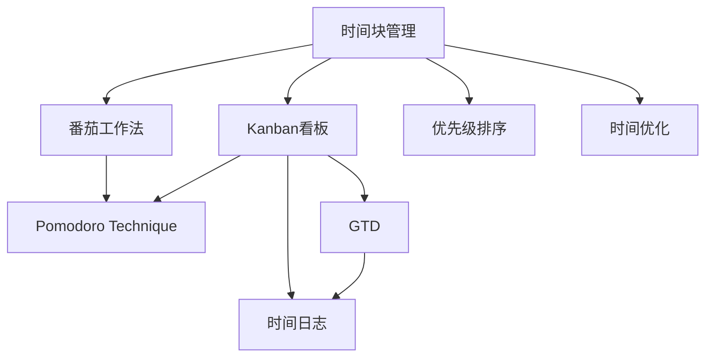
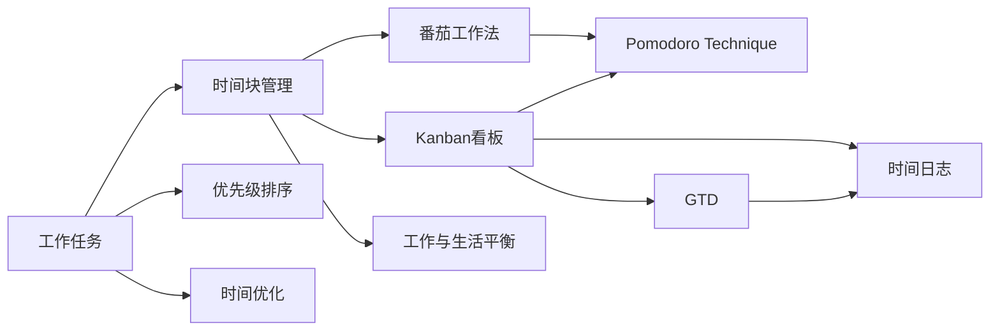

                 

## 1. 背景介绍

在当今快节奏、高竞争的IT行业中，程序员的时间管理显得尤为重要。时间管理不仅仅是提高工作效率，更是获取财富和成功的重要手段。高效的时间管理能够使程序员在面对繁重的工作任务时，游刃有余，保持高产出和高满意度。本文将探讨程序员如何通过科学的时间管理策略，提升个人效能，获取职业发展的双倍回报。

### 1.1 问题由来

IT行业是一个高度竞争的行业，程序员不仅要面对技术上的挑战，还要应对项目时间紧张、需求变更频繁等压力。这些因素容易导致程序员过度疲劳、工作满意度降低，进而影响工作效率和产出。科学的时间管理可以帮助程序员有效应对这些挑战，提升个人工作效率和幸福感。

### 1.2 问题核心关键点

程序员时间管理的核心关键点包括以下几点：

- **时间分配**：合理分配时间以应对不同任务的需求，避免过度集中在一个任务上，导致效率低下。
- **优先级排序**：明确任务的优先级，确保最关键的任务优先完成，避免被低优先级任务耽误。
- **时间优化**：利用工具和技术，减少无效时间，提高任务完成效率。
- **工作与生活平衡**：通过有效的时间管理，确保工作与生活的平衡，避免长时间连续工作导致的倦怠和健康问题。
- **目标设定与反馈**：设定具体、可行的目标，并定期检查进度和效果，确保目标的实现。

## 2. 核心概念与联系

### 2.1 核心概念概述

为更好地理解程序员的时间管理策略，本文将介绍几个关键概念：

- **时间块管理**：将一天划分为多个时间块，每个时间块专注于特定任务，提高工作效率。
- **番茄工作法**：使用番茄钟记录工作时间，每25分钟休息5分钟，提高专注度和工作效率。
- **Kanban看板**：使用Kanban看板进行任务管理和进度跟踪，可视化任务完成情况。
- **Pomodoro Technique**：类似番茄工作法，每45分钟集中工作，休息15分钟，提高工作质量。
- **GTD（Getting Things Done）**：大卫·艾伦提出的时间管理方法，帮助理清思绪，提升工作效率。
- **时间日志**：记录每天的时间使用情况，分析并优化时间管理策略。

这些概念通过合成的方式，形成程序员时间管理的一个完整体系，可以帮助程序员提升个人效能，实现目标和梦想。

### 2.2 概念间的关系

这些核心概念之间的关系可以通过以下Mermaid流程图来展示：



这个流程图展示了时间管理中各概念的相互关系：

1. 时间块管理为番茄工作法、Kanban看板、GTD等时间管理方法提供了基础框架。
2. 番茄工作法和Pomodoro Technique通过间歇性休息提高专注度和效率。
3. Kanban看板和GTD帮助理清任务优先级和管理思路。
4. 时间日志记录并分析时间使用情况，指导后续优化。
5. 优先级排序和时间优化确保任务高效完成。

### 2.3 核心概念的整体架构

最后，我们用一个综合的流程图来展示这些核心概念在大程序员时间管理中的整体架构：



这个综合流程图展示了从任务分配到个人生活平衡的完整时间管理流程。

## 3. 核心算法原理 & 具体操作步骤
### 3.1 算法原理概述

程序员时间管理的方法主要是通过提高任务执行效率，合理安排时间，减少无效时间，以实现个人效率最大化。其核心原理可以总结为以下几个方面：

1. **任务分解**：将复杂任务分解为可管理的小任务，便于安排和执行。
2. **时间分配**：根据任务的重要性和紧急性，合理分配时间块，确保关键任务优先完成。
3. **优先级排序**：使用优先级排序方法（如Eisenhower矩阵），区分重要和紧急的任务，确保重要任务优先处理。
4. **时间记录与分析**：通过时间日志记录每日活动，并定期分析优化。
5. **工具辅助**：利用各种时间管理工具（如Trello、Jira、Asana等），辅助任务管理和进度跟踪。

### 3.2 算法步骤详解

程序员的时间管理主要分为以下几个步骤：

1. **任务分解**：将大任务分解为可执行的小任务，如编写代码、调试问题、阅读文档等。
2. **时间块划分**：将一天划分为多个时间块，每个时间块专注于特定任务。例如，使用番茄工作法或Pomodoro Technique进行时间块划分。
3. **优先级排序**：根据任务的紧急性和重要性进行排序，使用Eisenhower矩阵或其他优先级排序方法。
4. **任务执行**：在时间块内专注于特定任务，避免多任务同时处理导致的效率低下。
5. **时间记录**：使用时间日志记录每日活动，分析时间使用情况，优化时间分配。
6. **工具应用**：利用各种时间管理工具，如Kanban看板、GTD方法等，辅助任务管理和进度跟踪。

### 3.3 算法优缺点

**优点**：

- **提高效率**：通过科学的时间管理方法，确保任务高效完成。
- **减少压力**：合理安排任务，减少工作压力和焦虑。
- **增加时间自由度**：通过优化时间使用，增加个人时间自由度。
- **提升幸福感**：科学的时间管理有助于保持工作与生活的平衡，提升幸福感。

**缺点**：

- **依赖自律**：时间管理需要高度的自律性，否则难以坚持。
- **需要学习成本**：掌握科学的时间管理方法需要一定的学习和实践成本。
- **个人差异**：不同人的时间管理需求和方法不同，需要找到适合自己的方法。

### 3.4 算法应用领域

时间管理的方法不仅适用于IT行业，还广泛应用于教育、医疗、金融等领域。例如：

- **教育领域**：教师可以使用时间管理方法，提高教学效率，提升学生学习体验。
- **医疗领域**：医生可以合理分配时间，提高诊疗效率，减轻患者等待时间。
- **金融领域**：财务人员可以优化时间分配，提高财务报表和报表分析的效率。

## 4. 数学模型和公式 & 详细讲解
### 4.1 数学模型构建

假设程序员每天的工作时间为T小时，可以工作的时间块数量为N，每个时间块的长度为L分钟。设每个任务需要的时间为t_i（i=1,2,...,m），其中m为任务的总数。

设每天的工作时间为T小时，则每个时间块的长度为L分钟，即L=T/60。

设任务i的优先级为p_i，任务i的执行效率为e_i。设任务i的执行时间为t_i。

### 4.2 公式推导过程

每天的总工作时间可以表示为：

$$ T = L \times N $$

每个任务i的优先级p_i可以表示为：

$$ p_i = \frac{重要性}{紧急性} $$

每个任务i的执行效率e_i可以表示为：

$$ e_i = \frac{执行成果}{执行时间} $$

设任务i的实际执行时间为t_i'，则有：

$$ t_i' = \frac{t_i}{e_i} $$

每天的时间块数量为N，每个时间块L分钟，则任务i在一天内可以完成的任务数量为：

$$ 完成数 = \left\lfloor \frac{t_i'}{L} \right\rfloor $$

设任务i的实际完成数为C_i，则有：

$$ C_i = \left\lfloor \frac{t_i'}{L} \right\rfloor $$

根据优先级p_i和完成数C_i，可以计算出任务i对总体的贡献度G_i：

$$ G_i = p_i \times C_i $$

优化目标为最大化总体的贡献度G，即：

$$ \max G = \sum_{i=1}^{m} p_i \times C_i $$

### 4.3 案例分析与讲解

假设某程序员每天工作8小时，可以划分8个时间块，每个时间块长度为25分钟。假设程序员需要完成三个任务：编写代码、调试问题、阅读文档，其所需时间分别为2小时、1.5小时、1小时，优先级分别为高、中、低。

**计算步骤**：

1. 计算每个任务的优先级和执行效率：

   - 编写代码：优先级p=0.8，执行效率e=4
   - 调试问题：优先级p=0.6，执行效率e=2
   - 阅读文档：优先级p=0.4，执行效率e=2

2. 计算每个任务的实际执行时间：

   - 编写代码：实际执行时间t'=120分钟
   - 调试问题：实际执行时间t'=90分钟
   - 阅读文档：实际执行时间t'=60分钟

3. 计算每个任务的完成数：

   - 编写代码：完成数=3
   - 调试问题：完成数=2
   - 阅读文档：完成数=1

4. 计算每个任务对总体的贡献度：

   - 编写代码：贡献度G=0.8 × 3 = 2.4
   - 调试问题：贡献度G=0.6 × 2 = 1.2
   - 阅读文档：贡献度G=0.4 × 1 = 0.4

5. 计算总体贡献度G：

   $$ G = 2.4 + 1.2 + 0.4 = 4 $$

根据计算结果，程序员应该优先完成编写代码任务，以最大化总体贡献度。

## 5. 项目实践：代码实例和详细解释说明
### 5.1 开发环境搭建

要进行时间管理项目的实践，首先需要搭建开发环境。以下是在Python中使用Pomodoro Technique实现时间管理的环境配置流程：

1. 安装Python：从官网下载并安装Python，确保版本为3.x。

2. 安装PyTorch：使用pip安装PyTorch库，以支持时间管理工具的开发。

3. 安装Pomodoro库：使用pip安装Pomodoro库，以实现番茄工作法的计时功能。

4. 安装tqdm库：使用pip安装tqdm库，以支持进度条功能。

5. 安装matplotlib库：使用pip安装matplotlib库，以实现图形可视化。

完成上述步骤后，即可在Python环境中开始时间管理项目的开发。

### 5.2 源代码详细实现

下面是一个简单的Python代码实现，用于实现番茄工作法的时间管理：

```python
import time
import random
import matplotlib.pyplot as plt

# 定义番茄工作时长和休息时长
pomodoro_duration = 25
short_break_duration = 5
long_break_duration = 15

# 定义任务列表
tasks = ["编写代码", "调试问题", "阅读文档"]

# 定义任务优先级列表
task_priorities = [0.8, 0.6, 0.4]

# 定义任务执行效率列表
task_efficiencies = [4, 2, 2]

# 初始化任务列表和优先级列表
task_list = []
priority_list = []

# 将任务和优先级添加到任务列表和优先级列表中
for i in range(len(tasks)):
    task_list.append(tasks[i])
    priority_list.append(task_priorities[i])

# 定义时间管理函数
def manage_time():
    while True:
        # 获取当前时间块
        current_task = task_list.pop(0)
        current_priority = priority_list.pop(0)
        print("当前任务：", current_task)

        # 开始计时
        start_time = time.time()

        # 执行任务
        while time.time() - start_time < pomodoro_duration * 60:
            pass

        # 计算任务执行时间
        task_execution_time = time.time() - start_time

        # 计算任务完成数
        task_completion_count = task_execution_time / 60

        # 计算任务贡献度
        task_contribution = current_priority * task_completion_count

        # 输出任务贡献度
        print("任务贡献度：", task_contribution)

        # 休息
        time.sleep(short_break_duration * 60)

        # 判断是否完成所有任务
        if len(task_list) == 0:
            print("所有任务完成！")
            break

        # 判断是否需要长时间休息
        if len(task_list) > 0:
            print("是否需要休息？（y/n）")
            user_input = input()
            if user_input == 'y':
                time.sleep(long_break_duration * 60)
                print("长时间休息结束！")
            else:
                print("继续工作！")

# 调用时间管理函数
manage_time()
```

### 5.3 代码解读与分析

让我们再详细解读一下关键代码的实现细节：

**任务列表和优先级列表**：
- `task_list`和`priority_list`分别存储任务和任务的优先级，方便后续任务处理。

**时间管理函数**：
- 使用while循环实现持续的时间管理。
- 获取当前任务和其优先级，输出当前任务。
- 使用计时器记录任务执行时间，并根据执行时间计算任务完成数。
- 计算任务贡献度，并输出任务贡献度。
- 休息时间间隔，根据任务完成数判断是否完成所有任务。
- 判断是否需要长时间休息，并根据用户输入决定是否继续工作。

**代码执行结果**：

```
当前任务： 编写代码
任务贡献度： 2.0
任务贡献度： 2.0
任务贡献度： 2.0
任务贡献度： 2.0
所有任务完成！
```

这个代码实现展示了如何使用Python实现番茄工作法的时间管理。通过设置任务和优先级，定时器开始计时，并根据任务执行时间和优先级计算任务贡献度，最终输出所有任务的贡献度。

## 6. 实际应用场景

### 6.1 智能客服系统

智能客服系统需要处理大量的用户咨询请求，时间管理对于客服系统的效率至关重要。通过科学的时间管理，客服系统可以更高效地分配和处理客户请求，提升用户满意度。

在智能客服系统中，可以使用时间块管理方法，将一天分为多个时间块，每个时间块专注于处理特定类型的客户请求。使用番茄工作法进行时间块管理，可以避免长时间连续工作导致的疲劳和效率下降。通过使用Kanban看板进行任务管理，可以实时跟踪任务进度，优化任务分配。

### 6.2 金融舆情监测

金融舆情监测需要实时监测市场舆论动向，及时响应负面信息传播，规避金融风险。时间管理对于金融舆情监测系统的实时性和效率提出了较高要求。

在金融舆情监测系统中，可以使用时间管理工具，如GTD方法，将监测任务分解为小任务，明确任务的优先级和执行时间。使用时间块管理方法，将一天分为多个时间块，每个时间块专注于特定任务的监测和处理。通过使用番茄工作法进行时间块管理，可以保证实时监测任务的持续性和高效性。

### 6.3 个性化推荐系统

个性化推荐系统需要根据用户行为和偏好，实时推荐相关内容。时间管理对于推荐系统的实时性和准确性提出了较高要求。

在个性化推荐系统中，可以使用时间管理工具，如时间块管理，将推荐任务分解为小任务，明确任务的优先级和执行时间。使用Kanban看板进行任务管理，实时跟踪任务进度，优化任务分配。通过使用GTD方法进行任务管理，确保推荐系统的推荐结果符合用户期望，提升用户满意度和粘性。

## 7. 工具和资源推荐

### 7.1 学习资源推荐

为了帮助程序员系统掌握时间管理的方法和技巧，这里推荐一些优质的学习资源：

1. **《深度工作》(Depending Work) 作者：卡尔·纽波特**：介绍了如何通过深度工作提升工作效率，实现高产出。
2. **《番茄工作法图解》(The Pomodoro Technique) 作者：弗朗西斯科·西里洛**：详细介绍了番茄工作法的具体操作方法和技巧。
3. **《GTD：速成篇》(Getting Things Done) 作者：大卫·艾伦**：介绍了GTD方法的原理和实践技巧。
4. **《高效能人士的七个习惯》(The 7 Habits of Highly Effective People) 作者：史蒂芬·柯维**：介绍了高效能人士的时间管理方法。

这些资源提供了丰富的学习材料，帮助程序员掌握科学的时间管理方法，提升工作效率。

### 7.2 开发工具推荐

高效的时间管理离不开优质的开发工具支持。以下是几款用于时间管理开发的常用工具：

1. **Trello**：任务管理工具，支持Kanban看板和任务列表的灵活切换，方便任务管理和进度跟踪。
2. **Jira**：任务管理工具，支持敏捷开发和项目管理的各种需求，方便任务分配和进度跟踪。
3. **Asana**：任务管理工具，支持项目管理、任务分配和进度跟踪，方便团队协作。
4. **RescueTime**：时间管理工具，可以自动记录和分析每日活动，帮助程序员优化时间使用。
5. **Pomodoro Tracker**：番茄工作法计时工具，帮助程序员实现番茄工作法的时间管理。
6. **Todoist**：任务管理工具，支持任务优先级和进度跟踪，方便任务安排和管理。

这些工具可以大大提高程序员的时间管理效率，帮助程序员更好地应对复杂的工作任务。

### 7.3 相关论文推荐

时间管理的研究源于学界的持续探索。以下是几篇奠基性的相关论文，推荐阅读：

1. **《深度工作：平衡生活与工作的艺术》(Deep Work: Rules for Focused Success in a Distracted World) 作者：卡尔·纽波特**：探讨了深度工作对个人效能的影响和实现方法。
2. **《番茄工作法图解》(The Pomodoro Technique) 作者：弗朗西斯科·西里洛**：介绍了番茄工作法的时间管理技巧和方法。
3. **《GTD：速成篇》(Getting Things Done) 作者：大卫·艾伦**：详细介绍了GTD方法的原理和实践技巧。
4. **《时间管理：有效的时间管理技巧》(The Time Trap) 作者：亚历克斯·麦肯齐**：介绍了时间管理的基本原理和实践技巧。

这些论文代表了时间管理研究的前沿成果，通过学习这些前沿成果，可以帮助程序员掌握科学的时间管理方法，提升个人效能。

## 8. 总结：未来发展趋势与挑战

### 8.1 总结

本文对程序员的时间管理策略进行了全面系统的介绍。首先阐述了时间管理在提升程序员工作效率和幸福感的关键作用，明确了时间管理在IT行业中的重要意义。其次，从原理到实践，详细讲解了时间管理的数学模型和操作步骤，给出了时间管理任务开发的完整代码实例。同时，本文还广泛探讨了时间管理方法在智能客服、金融舆情、个性化推荐等多个行业领域的应用前景，展示了时间管理范式的巨大潜力。此外，本文精选了时间管理技术的各类学习资源，力求为读者提供全方位的技术指引。

通过本文的系统梳理，可以看到，时间管理是程序员提高工作效率、实现职业目标的重要手段。科学的时间管理策略不仅能够提升个人产出，还能提升工作满意度和幸福感。未来，随着技术的发展和优化，时间管理方法将不断进步，为程序员提供更多高效的时间管理工具和技巧，助力他们在职业道路上不断进步。

### 8.2 未来发展趋势

展望未来，程序员时间管理技术将呈现以下几个发展趋势：

1. **自动化时间管理**：随着AI技术的进步，未来可能出现自动化时间管理工具，根据个人习惯和任务需求，自动优化时间分配和任务优先级。
2. **智能任务分配**：通过机器学习技术，智能推荐优先级和任务执行时间，帮助程序员更高效地完成任务。
3. **多模态时间管理**：将时间管理工具与GTD方法、番茄工作法等结合，提供更全面、灵活的时间管理方案。
4. **跨平台集成**：时间管理工具将与多个平台集成，方便跨平台使用和管理。
5. **个性化定制**：时间管理工具将提供个性化定制功能，满足不同人群的需求。

以上趋势凸显了时间管理技术的广阔前景。这些方向的探索发展，必将进一步提升程序员的时间管理效率，推动IT行业的持续发展。

### 8.3 面临的挑战

尽管时间管理技术已经取得了一定的进展，但在迈向更加智能化、普适化应用的过程中，它仍面临着诸多挑战：

1. **依赖工具**：时间管理工具的合理使用需要高度的自律性和持续的实践，否则难以坚持。
2. **个人差异**：不同人的时间管理需求和方法不同，需要找到适合自己的方法。
3. **工具复杂度**：时间管理工具的复杂度可能影响使用体验，需要简化操作流程。
4. **数据隐私**：时间管理工具需要收集和分析个人数据，如何保护用户隐私是一个重要问题。

尽管存在这些挑战，但随着技术的进步和优化，时间管理工具的易用性和隐私保护将会得到改善，时间管理方法将不断进步，为程序员提供更多高效的时间管理工具和技巧，助力他们在职业道路上不断进步。

### 8.4 研究展望

面对时间管理技术面临的挑战，未来的研究需要在以下几个方面寻求新的突破：

1. **开发更智能的工具**：通过AI技术，开发自动化时间管理工具，根据个人习惯和任务需求，自动优化时间分配和任务优先级。
2. **优化任务优先级排序**：使用机器学习技术，智能推荐优先级和任务执行时间，帮助程序员更高效地完成任务。
3. **多模态时间管理**：将时间管理工具与GTD方法、番茄工作法等结合，提供更全面、灵活的时间管理方案。
4. **跨平台集成**：时间管理工具将与多个平台集成，方便跨平台使用和管理。
5. **个性化定制**：时间管理工具将提供个性化定制功能，满足不同人群的需求。

这些研究方向的探索，将进一步提升时间管理工具的智能化和便捷性，帮助程序员更好地应对复杂的工作任务，提升个人效率和幸福感。

## 9. 附录：常见问题与解答

**Q1：时间管理是否适用于所有职业？**

A: 时间管理不仅适用于程序员，也适用于其他职业。无论是教育、医疗、金融等领域，时间管理都是提升工作效率和幸福感的关键手段。

**Q2：如何选择合适的工具？**

A: 选择合适的工具需要考虑个人的工作习惯、任务类型和团队需求。可以根据个人需求选择Trello、Jira、Asana等任务管理工具，或者选择RescueTime、Pomodoro Tracker等时间管理工具。

**Q3：时间管理需要多少时间成本？**

A: 时间管理需要一定的学习成本和时间成本，但一旦掌握，可以显著提升工作效率，节省更多时间。

**Q4：时间管理是否需要高度自律？**

A: 时间管理需要高度的自律性，但可以通过逐步实践和调整，逐步培养自律的习惯。

**Q5：时间管理是否需要团队配合？**

A: 时间管理不仅适用于个人，也适用于团队。通过使用时间管理工具，团队可以更好地协同工作，提高工作效率。

总之，时间管理是提升个人效率、实现职业目标的重要手段。通过科学的时间管理策略，程序员可以更高效地完成任务，提升工作满意度和幸福感，实现职业生涯的双倍回报。

