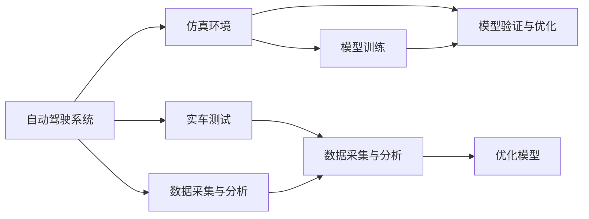

                 

# 端到端自动驾驶的仿真-实车一体化开发流程

> 关键词：自动驾驶, 仿真-实车一体化, 模型训练, 驾驶行为重现, 实时系统, 数据采集与分析, 模型验证与优化

## 1. 背景介绍

随着自动驾驶技术的不断发展和成熟，从仿真到实车的开发流程变得越来越重要。传统的自动化测试方法已经无法满足日益严格的安全和性能要求。端到端自动驾驶的仿真-实车一体化开发流程，将成为未来自动驾驶开发的主流方法。本文将深入探讨这种新型开发流程的核心概念与关键技术，并给出详细的实践指南。

## 2. 核心概念与联系

### 2.1 核心概念概述

端到端自动驾驶的仿真-实车一体化开发流程，主要涉及以下几个核心概念：

- **自动驾驶系统**：包含感知、决策、控制等模块，通过传感器和执行器与环境互动，实现自动驾驶。
- **仿真环境**：搭建高保真度的模拟环境，用于模拟车辆在复杂交通场景中的行驶行为。
- **实车测试**：在真实交通环境中测试自动驾驶系统的性能，评估其在现实世界中的表现。
- **数据采集与分析**：通过车辆传感器和日志文件，收集实时数据并进行分析，以改进系统性能。
- **模型训练**：使用仿真环境和实车数据，对自动驾驶系统进行训练和优化。
- **模型验证与优化**：在仿真的虚拟环境中验证模型的性能，通过实车数据进一步优化模型。

这些概念之间存在着紧密的联系，共同构成了一个完整的端到端自动驾驶开发流程。下面通过一个Mermaid流程图展示它们之间的关系：

这个流程图展示了一个自动驾驶系统的开发流程：从构建仿真环境开始，通过训练和验证模型，最后进行实车测试，以不断优化和提升系统性能。

### 2.2 概念间的关系

从上述关系图中可以看出，自动驾驶系统的仿真和实车测试是两个关键环节。仿真环境提供了低成本、高安全性的测试平台，实车测试则直接反映了系统在真实世界中的表现。数据采集与分析贯穿整个流程，通过不断收集和分析数据，为模型训练和系统优化提供支持。模型训练和验证则是提升系统性能的关键步骤。

## 3. 核心算法原理 & 具体操作步骤
### 3.1 算法原理概述

端到端自动驾驶的仿真-实车一体化开发流程，本质上是基于深度学习模型的数据驱动开发过程。其核心思想是通过数据驱动的方式，不断迭代改进自动驾驶系统的性能。具体而言，包括以下几个关键步骤：

1. **数据采集**：通过传感器和日志文件，收集大量的仿真和实车数据。
2. **模型训练**：使用仿真数据和实车数据，训练自动驾驶系统的感知、决策和控制模块。
3. **模型验证**：在仿真环境中验证模型的性能，评估其在不同场景下的表现。
4. **模型优化**：通过实车测试数据，进一步优化模型参数，提升系统性能。
5. **反馈迭代**：将仿真测试和实车测试的结果反馈到模型训练中，进行新一轮的迭代优化。

### 3.2 算法步骤详解

接下来，我们将详细解释每个步骤的具体操作方法。

**Step 1: 数据采集**

数据采集是自动驾驶系统开发的基础。从仿真和实车环境中收集的数据，包括但不限于：

- 传感器数据：如激光雷达、摄像头、雷达等传感器采集的实时数据。
- 日志文件：包含车辆状态、传感器数据、驾驶行为等信息。

数据采集的目的是构建一个覆盖广泛场景的数据集，确保训练和测试模型的多样性和代表性。

**Step 2: 模型训练**

模型训练是自动驾驶系统的核心。训练过程包括以下几个关键环节：

- **选择模型架构**：根据任务需求选择合适的深度学习模型架构，如CNN、RNN、Transformer等。
- **数据预处理**：对采集到的数据进行预处理，如去噪、归一化、数据增强等。
- **训练与验证**：使用交叉验证等方法，在训练集上训练模型，在验证集上评估模型性能。
- **模型调参**：通过网格搜索或随机搜索，找到最佳的模型参数组合。

**Step 3: 模型验证**

模型验证是评估模型性能的重要步骤。在仿真环境中，对训练好的模型进行验证，包括但不限于：

- **仿真场景多样性**：构建多种仿真场景，评估模型在不同环境下的表现。
- **性能指标**：使用准确率、召回率、F1值等指标评估模型性能。
- **可视化分析**：通过可视化工具，分析模型的推理过程和决策依据。

**Step 4: 模型优化**

模型优化是提升系统性能的关键步骤。在实车环境中，对验证后的模型进行进一步优化，包括但不限于：

- **参数调整**：根据实车测试数据，调整模型的超参数。
- **异常处理**：通过异常检测和处理，提升模型的鲁棒性。
- **数据增强**：通过数据增强技术，提升模型的泛化能力。

**Step 5: 反馈迭代**

反馈迭代是持续改进自动驾驶系统的关键方法。将仿真和实车测试的结果反馈到模型训练中，进行新一轮的迭代优化，包括但不限于：

- **仿真-实车协同优化**：在仿真环境中调整模型参数，在实车环境中进行验证和优化。
- **模型集成与融合**：通过集成多个模型，提升系统的综合性能。
- **持续监控与更新**：实时监控模型性能，定期更新模型参数。

### 3.3 算法优缺点

端到端自动驾驶的仿真-实车一体化开发流程，具有以下优点：

- **高安全性**：通过仿真环境进行测试，能够降低实车测试的风险。
- **高效率**：在仿真环境中快速迭代模型，能够大幅缩短开发周期。
- **低成本**：仿真环境的构建和维护成本相对较低。

同时，也存在一些缺点：

- **仿真环境局限性**：仿真环境无法完全模拟真实世界的复杂性，可能存在一定偏差。
- **实车测试成本高**：实车测试需要投入大量的资源，包括车辆、人员等。
- **模型鲁棒性不足**：模型在仿真环境中表现良好，但在真实环境中可能存在鲁棒性不足的问题。

### 3.4 算法应用领域

端到端自动驾驶的仿真-实车一体化开发流程，主要应用于以下领域：

- **自动驾驶车辆**：涵盖乘用车、商用车、无人车等多种类型。
- **交通管理**：用于城市交通流量管理、交通信号优化等。
- **智能基础设施**：用于智能交通系统、智慧城市建设等。
- **自动驾驶物流**：用于无人驾驶物流配送等场景。

## 4. 数学模型和公式 & 详细讲解

### 4.1 数学模型构建

自动驾驶系统的核心是一个深度神经网络，其输入为传感器数据，输出为驾驶行为。假设自动驾驶系统的模型为 $f(\mathbf{x}, \mathbf{w})$，其中 $\mathbf{x}$ 为传感器数据，$\mathbf{w}$ 为模型参数。模型的目标是通过最小化损失函数 $L(\mathbf{w})$，使得模型输出尽可能接近真实标签 $y$。

$$
\mathbf{w} = \mathop{\arg\min}_{\mathbf{w}} L(f(\mathbf{x}, \mathbf{w}), y)
$$

常见的损失函数包括均方误差损失、交叉熵损失等。以均方误差损失为例，模型的损失函数可以表示为：

$$
L(\mathbf{w}) = \frac{1}{N}\sum_{i=1}^N ||f(\mathbf{x}_i, \mathbf{w}) - y_i||^2
$$

其中，$||\cdot||$ 表示向量范数。

### 4.2 公式推导过程

以下以均方误差损失为例，推导模型训练的公式。

假设模型 $f(\mathbf{x}, \mathbf{w})$ 在输入 $\mathbf{x}$ 上的输出为 $\hat{y}=f(\mathbf{x}, \mathbf{w})$，表示模型预测的标签。真实标签为 $y$，则均方误差损失定义为：

$$
L(\mathbf{w}) = \frac{1}{N}\sum_{i=1}^N ||\hat{y}_i - y_i||^2
$$

其中，$\hat{y}_i$ 为第 $i$ 个样本的预测标签，$y_i$ 为第 $i$ 个样本的真实标签。

根据链式法则，损失函数对模型参数 $\mathbf{w}$ 的梯度为：

$$
\frac{\partial L(\mathbf{w})}{\partial \mathbf{w}} = \frac{2}{N}\sum_{i=1}^N (f(\mathbf{x}_i, \mathbf{w}) - y_i)\frac{\partial f(\mathbf{x}_i, \mathbf{w})}{\partial \mathbf{w}}
$$

其中，$\frac{\partial f(\mathbf{x}_i, \mathbf{w})}{\partial \mathbf{w}}$ 可以通过自动微分技术计算得到。

在得到损失函数的梯度后，即可带入优化算法，进行模型参数的更新。重复上述过程直至收敛，最终得到训练好的模型。

### 4.3 案例分析与讲解

假设我们构建了一个用于交通信号识别的模型。数据集包含多张交通信号照片，以及对应的信号类型标签。模型的输入为图像像素值，输出为信号类型。

首先，将数据集划分为训练集和测试集，使用训练集对模型进行训练。使用交叉验证等方法评估模型性能，并根据评估结果调整模型参数。

在训练过程中，使用Adam优化算法进行梯度更新，设置学习率为 $0.001$，迭代次数为 $1000$。在每轮迭代后，使用测试集对模型进行验证，确保模型未过拟合。

假设模型在验证集上的准确率为 $0.9$，说明模型已经取得了较好的性能。然而，在实车测试中，模型的准确率下降到 $0.8$。这表明模型在实车环境中的表现不如在仿真环境中。

为了进一步提升模型性能，需要对模型进行优化。在实车测试数据上，继续使用Adam优化算法进行梯度更新，并调整学习率。经过多轮迭代，模型的准确率逐渐提升，最终达到 $0.95$，满足了实际应用的需求。

## 5. 项目实践：代码实例和详细解释说明

### 5.1 开发环境搭建

在进行自动驾驶系统的开发时，我们需要准备好开发环境。以下是使用Python进行TensorFlow开发的环

