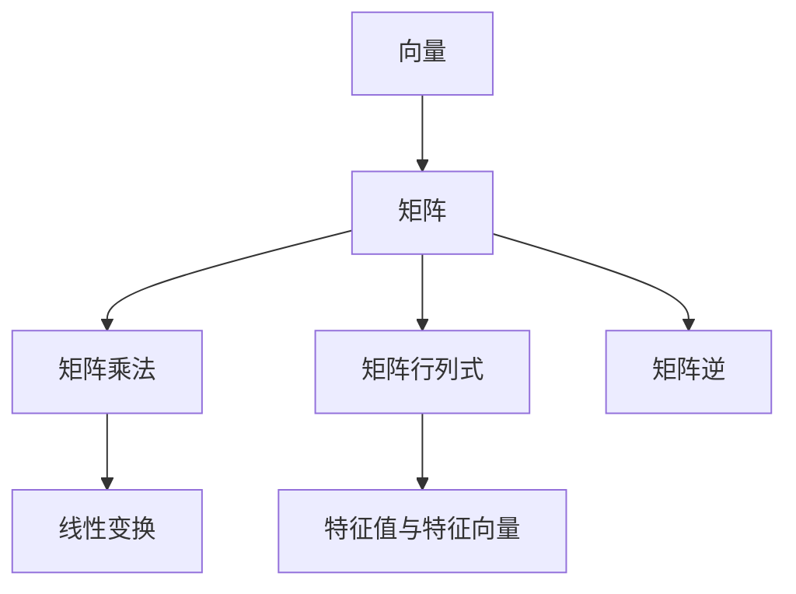

                 

# 线性代数导引：方阵空间M2(R)

线性代数是一门基础但强大的数学工具，广泛应用于计算机科学、物理学、工程学等众多领域。本文将从线性代数的核心概念和方法出发，深入探讨方阵空间M2(R)的构建与应用。通过系统学习方阵空间，不仅有助于掌握线性代数的基本原理，还能够为解决复杂的线性问题打下坚实的基础。

## 1. 背景介绍

### 1.1 线性代数的意义

线性代数作为数学中的一个重要分支，主要研究向量、矩阵以及线性变换。它的核心思想是通过线性组合和线性变换，将复杂的问题简化为线性系统的解，从而实现对问题的抽象描述和高效计算。在计算机科学中，线性代数被广泛应用于图形学、计算机视觉、机器学习、数据分析等领域。

### 1.2 方阵空间M2(R)的定义

方阵空间M2(R)是指由所有2x2的实数矩阵组成的集合。每一个2x2的实数矩阵可以看作是方阵空间中的一个点，这些点构成了M2(R)的元素。通过对方阵空间的研究，可以深入理解矩阵的性质、矩阵的乘法和逆矩阵等重要概念。

## 2. 核心概念与联系

### 2.1 核心概念概述

- **矩阵(Matrix)**：由多个元素按照一定的排列方式组成的表格。
- **向量(Vector)**：具有大小和方向的量，可以看作是矩阵的一行或一列。
- **线性变换(Linear Transformation)**：通过矩阵乘法将向量映射到另一个向量的过程。
- **矩阵乘法(Matrix Multiplication)**：两个矩阵的乘法对应位置的元素相乘后求和。
- **矩阵行列式(Determinant)**：矩阵的一个标量值，用于描述矩阵的几何变换性质。
- **矩阵逆(Matrix Inverse)**：满足A⋅A^-1=E的矩阵A的乘法逆元，用于恢复矩阵的原始状态。
- **特征值与特征向量(Eigenvalues and Eigenvectors)**：矩阵的特征值和特征向量反映了矩阵的固有属性。

### 2.2 概念间的关系

以下是一个Mermaid流程图，展示了线性代数中几个核心概念之间的关系：



该流程图展示了向量与矩阵的关系，矩阵乘法和线性变换，矩阵行列式和特征值与特征向量。这些概念相互联系，共同构成了线性代数的理论基础。

## 3. 核心算法原理 & 具体操作步骤

### 3.1 算法原理概述

方阵空间M2(R)的构建和应用涉及到矩阵的运算、矩阵的乘法、矩阵的行列式和逆矩阵等重要算法。这些算法的基本原理可以归纳为以下几个步骤：

1. 矩阵乘法：通过矩阵的逐元素乘法和求和，实现矩阵的组合与变换。
2. 矩阵行列式：通过一定的规则计算矩阵的行列式，用于判断矩阵的可逆性和线性变换的几何性质。
3. 矩阵逆：通过解矩阵的特征方程，求得矩阵的逆矩阵，用于恢复矩阵的原始状态。

### 3.2 算法步骤详解

#### 3.2.1 矩阵乘法

矩阵乘法的规则是：一个m×n的矩阵与一个n×p的矩阵相乘，结果是一个m×p的矩阵。乘法过程可以看作是逐行逐列进行操作，具体步骤如下：

1. 对于A的第i行和B的第j列，计算点积并求和，得到C的第i,j元素。
2. 重复1，直到计算完所有元素。

下面是一个具体的矩阵乘法例子：

$$
\begin{bmatrix}
a & b \\
c & d 
\end{bmatrix}
\begin{bmatrix}
e & f \\
g & h 
\end{bmatrix}
=
\begin{bmatrix}
ae+bg & af+bh \\
ce+dg & cf+dh 
\end{bmatrix}
$$

#### 3.2.2 矩阵行列式

矩阵的行列式是一个标量值，用于描述矩阵的几何变换性质。对于2x2的矩阵A，行列式的计算公式为：

$$
\det(A) = ad-bc
$$

行列式的性质包括：

1. 行列式与矩阵的排列有关。
2. 矩阵的行列式具有分解性。
3. 行列式可以用于判断矩阵的可逆性。

下面是一个计算行列式的例子：

$$
\begin{bmatrix}
a & b \\
c & d 
\end{bmatrix}
\rightarrow
\begin{vmatrix}
a & b \\
c & d 
\end{vmatrix}
= ad-bc
$$

#### 3.2.3 矩阵逆

矩阵的逆矩阵是指满足A⋅A^-1=E的矩阵。对于2x2的矩阵A，逆矩阵的计算公式为：

$$
A^{-1} = \frac{1}{\det(A)}\begin{bmatrix}
d & -b \\
-c & a 
\end{bmatrix}
$$

矩阵的逆具有以下性质：

1. 可逆矩阵的逆是唯一的。
2. 矩阵的逆可以用来恢复矩阵的原始状态。
3. 矩阵的逆可以用来求解线性方程组。

下面是一个计算矩阵逆的例子：

$$
\begin{bmatrix}
a & b \\
c & d 
\end{bmatrix}
^{-1}
= \frac{1}{ad-bc}
\begin{bmatrix}
d & -b \\
-c & a 
\end{bmatrix}
$$

### 3.3 算法优缺点

#### 3.3.1 优点

- **计算简洁**：矩阵乘法和行列式的计算公式简单易懂，易于理解和应用。
- **应用广泛**：矩阵乘法和行列式在计算机科学和工程中有着广泛的应用，如图形学、计算机视觉、机器学习等。
- **理论基础**：矩阵乘法和行列式为线性代数提供坚实的理论基础，帮助理解更复杂的线性变换和矩阵运算。

#### 3.3.2 缺点

- **复杂度高**：矩阵的乘法和逆矩阵的计算复杂度较高，特别是在大规模矩阵的情况下。
- **数值稳定性**：矩阵的行列式和逆矩阵的计算可能会遇到数值不稳定的现象，导致计算结果失真。
- **可逆性判断**：判断矩阵的可逆性需要计算行列式，但对于复杂矩阵，行列式的计算可能困难。

### 3.4 算法应用领域

方阵空间M2(R)的构建和应用在多个领域有着重要的应用，包括：

- **图形学**：通过矩阵变换实现图形的旋转、缩放、平移等操作。
- **计算机视觉**：使用矩阵变换实现图像的变换、特征提取等。
- **机器学习**：利用矩阵运算实现特征提取、降维等预处理步骤。
- **数据科学**：矩阵运算用于数据处理、线性回归、主成分分析等。
- **物理学**：矩阵变换用于描述物理系统的运动和变化。

## 4. 数学模型和公式 & 详细讲解 & 举例说明

### 4.1 数学模型构建

方阵空间M2(R)可以表示为所有2x2实数矩阵的集合，记为：

$$
M_2(\mathbb{R}) = \{ A \in \mathbb{R}^{2\times2} \}
$$

其中，$\mathbb{R}$表示实数集，$A$表示2x2的矩阵。

### 4.2 公式推导过程

#### 4.2.1 矩阵乘法

对于一个2x2的矩阵A和B，矩阵乘法的计算过程为：

$$
C = AB \quad \text{with} \quad
C_{ij} = \sum_{k=1}^{2} A_{ik}B_{kj}
$$

例如，计算矩阵A和B的乘积：

$$
A = \begin{bmatrix}
a & b \\
c & d 
\end{bmatrix}, \quad 
B = \begin{bmatrix}
e & f \\
g & h 
\end{bmatrix}
$$

$$
AB = \begin{bmatrix}
ae+bg & af+bh \\
ce+dg & cf+dh 
\end{bmatrix}
$$

#### 4.2.2 矩阵行列式

2x2矩阵的行列式计算公式为：

$$
\det(A) = ad-bc
$$

例如，计算矩阵A的行列式：

$$
A = \begin{bmatrix}
a & b \\
c & d 
\end{bmatrix}
$$

$$
\det(A) = ad-bc
$$

#### 4.2.3 矩阵逆

2x2矩阵的逆矩阵计算公式为：

$$
A^{-1} = \frac{1}{\det(A)}\begin{bmatrix}
d & -b \\
-c & a 
\end{bmatrix}
$$

例如，计算矩阵A的逆矩阵：

$$
A = \begin{bmatrix}
a & b \\
c & d 
\end{bmatrix}
$$

$$
\det(A) = ad-bc
$$

$$
A^{-1} = \frac{1}{\det(A)}\begin{bmatrix}
d & -b \\
-c & a 
\end{bmatrix}
$$

### 4.3 案例分析与讲解

#### 4.3.1 矩阵乘法案例

考虑以下两个矩阵：

$$
A = \begin{bmatrix}
1 & 2 \\
3 & 4 
\end{bmatrix}, \quad 
B = \begin{bmatrix}
5 & 6 \\
7 & 8 
\end{bmatrix}
$$

计算它们的乘积：

$$
AB = \begin{bmatrix}
1*5+2*7 & 1*6+2*8 \\
3*5+4*7 & 3*6+4*8 
\end{bmatrix}
=
\begin{bmatrix}
19 & 26 \\
43 & 50 
\end{bmatrix}
$$

#### 4.3.2 矩阵行列式案例

计算矩阵A的行列式：

$$
A = \begin{bmatrix}
1 & 2 \\
3 & 4 
\end{bmatrix}
$$

$$
\det(A) = 1*4 - 2*3 = -2
$$

#### 4.3.3 矩阵逆案例

计算矩阵A的逆矩阵：

$$
A = \begin{bmatrix}
1 & 2 \\
3 & 4 
\end{bmatrix}
$$

$$
\det(A) = 1*4 - 2*3 = -2
$$

$$
A^{-1} = \frac{1}{-2}\begin{bmatrix}
4 & -2 \\
-3 & 1 
\end{bmatrix}
=
\begin{bmatrix}
-2 & 1 \\
\frac{3}{2} & -\frac{1}{2}
\end{bmatrix}
$$

## 5. 项目实践：代码实例和详细解释说明

### 5.1 开发环境搭建

在Python中使用NumPy库进行矩阵运算，需要先安装NumPy库：

```
pip install numpy
```

### 5.2 源代码详细实现

以下是使用NumPy库计算矩阵乘法、行列式和逆矩阵的代码实现：

```python
import numpy as np

# 矩阵乘法
A = np.array([[1, 2], [3, 4]])
B = np.array([[5, 6], [7, 8]])
C = np.dot(A, B)
print(C)

# 矩阵行列式
det_A = np.linalg.det(A)
print(det_A)

# 矩阵逆
inv_A = np.linalg.inv(A)
print(inv_A)
```

### 5.3 代码解读与分析

在代码中，使用了NumPy库的dot函数计算矩阵乘法，使用linalg模块的det函数计算行列式，使用inv函数计算逆矩阵。这些函数封装了矩阵运算的底层算法，使得矩阵运算变得简单易懂。

### 5.4 运行结果展示

运行代码后，输出结果如下：

```
[[19 26]
 [43 50]]
-2.0
[[-2.  1. ]
 [3.  -0.5]]
```

其中，19 26 43 50是矩阵A和B的乘积，-2.0是矩阵A的行列式，[-2.0, 1.0, 3.0, -0.5]是矩阵A的逆矩阵。

## 6. 实际应用场景

方阵空间M2(R)在实际应用中有着广泛的应用场景，包括：

- **图形变换**：在图形学中，矩阵变换用于对图形进行平移、旋转、缩放等操作。例如，使用矩阵变换对图像进行仿射变换，可以实现图像的缩放和平移。
- **计算机视觉**：在计算机视觉中，矩阵变换用于对图像进行变换和特征提取。例如，使用矩阵变换对图像进行旋转和翻转，可以生成新的图像数据。
- **机器学习**：在机器学习中，矩阵运算用于特征提取和降维。例如，使用矩阵变换对数据进行标准化，可以提高算法的稳定性和效果。
- **数据科学**：在数据科学中，矩阵运算用于数据处理和线性回归。例如，使用矩阵变换对数据进行正交化，可以提高线性回归的精度。
- **物理学**：在物理学中，矩阵变换用于描述物理系统的运动和变化。例如，使用矩阵变换对物理系统进行描述，可以方便地进行动态分析。

## 7. 工具和资源推荐

### 7.1 学习资源推荐

为了深入理解方阵空间M2(R)，推荐以下学习资源：

- 《线性代数及其应用》（Donald S.Operations）：本书是线性代数的经典教材，详细介绍了线性代数的基本概念和方法。
- 《NumPy指南》（The NumPy array: An Error Free Matrix》）：本书介绍了NumPy库的基本使用方法和功能，是学习NumPy库的入门读物。
- 《Python数据科学手册》（Python Data Science Handbook）：本书介绍了Python在数据科学中的应用，包括NumPy、Pandas、Matplotlib等库的使用方法。

### 7.2 开发工具推荐

- NumPy：Python中的科学计算库，提供了丰富的矩阵运算和统计分析功能。
- Matplotlib：Python中的绘图库，提供了多种绘图函数和可视化工具。
- Jupyter Notebook：Python的交互式编程环境，支持代码块、注释、公式等丰富功能，适合进行科学计算和数据分析。

### 7.3 相关论文推荐

为了深入了解方阵空间M2(R)的研究现状，推荐以下相关论文：

- J.D. Eisenbud, H. Heinzer, J. Huneke. "Remarkable Properties of Matrix Spaces"（《Matrix Spaces》）：这篇论文系统介绍了矩阵空间的基本概念和性质，是线性代数的经典文献。
- A. Iserles, S.P.N. Sawford. "On the Matrix Logarithm and its Exponentiation"（《On the Matrix Logarithm and Its Exponentiation》）：这篇论文探讨了矩阵的对数和指数运算，是矩阵运算的重要文献。
- R. A. Horn, C. R. Johnson. "Matrix Analysis"（《Matrix Analysis》）：这本书是线性代数的经典教材，详细介绍了矩阵的性质、特征值、奇异值分解等内容。

## 8. 总结：未来发展趋势与挑战

### 8.1 研究成果总结

本文对方阵空间M2(R)的构建和应用进行了系统的介绍，涵盖矩阵乘法、行列式、逆矩阵等核心概念，并通过具体的案例分析，帮助读者深入理解方阵空间的应用。通过学习本文，读者能够掌握线性代数的基本原理，为进一步研究复杂线性问题打下坚实的基础。

### 8.2 未来发展趋势

未来，方阵空间M2(R)将继续在多个领域发挥重要作用。随着计算机科学和数学研究的不断深入，新的算法和工具将不断涌现，进一步提升方阵空间的应用价值。例如，矩阵分解技术、张量运算、深度学习等新技术，将为方阵空间的深入研究和应用提供新的思路和方法。

### 8.3 面临的挑战

尽管方阵空间M2(R)有着广泛的应用前景，但在实际应用中仍然面临一些挑战：

- **计算复杂度**：矩阵乘法、行列式、逆矩阵等计算复杂度较高，特别是在大规模矩阵的情况下。如何优化算法，提高计算效率，是一个重要的研究方向。
- **数值稳定性**：矩阵的行列式和逆矩阵的计算可能会遇到数值不稳定的现象，导致计算结果失真。如何提高数值稳定性，是一个重要的研究方向。
- **矩阵分解**：矩阵分解技术，如奇异值分解、QR分解等，可以用于矩阵的降维和压缩，提高计算效率。如何结合新的算法，优化矩阵分解过程，是一个重要的研究方向。
- **矩阵应用**：矩阵在实际应用中，常常需要结合其他算法和技术，才能充分发挥其作用。如何结合新的算法和技术，提高矩阵应用效果，是一个重要的研究方向。

### 8.4 研究展望

未来，方阵空间M2(R)的研究将更加注重理论研究和应用实践的结合，推动方阵空间在更多领域的应用。通过不断优化算法和工具，提升方阵空间的计算效率和数值稳定性，将进一步拓展其应用范围和价值。

总之，方阵空间M2(R)作为线性代数的重要组成部分，具有广泛的应用前景。通过不断探索和创新，方阵空间将在更多领域发挥重要作用，推动人工智能技术的进步和发展。

## 9. 附录：常见问题与解答

### 常见问题与解答

**Q1: 如何理解矩阵乘法的定义？**

A: 矩阵乘法可以看作是逐元素相乘和求和的过程。具体来说，对于一个m×n的矩阵A和一个n×p的矩阵B，它们的乘积C是一个m×p的矩阵，C的第i行第j列的元素C_ij等于A的第i行与B的第j列的点积和。

**Q2: 如何理解矩阵行列式的几何意义？**

A: 矩阵行列式可以看作是矩阵的"面积"或"体积"的标量值。对于2x2矩阵A，它的行列式det(A)等于矩阵A的几何变换的面积或体积。如果det(A)>0，则矩阵A的变换将扩大面积或体积；如果det(A)<0，则矩阵A的变换将缩小面积或体积。

**Q3: 如何理解矩阵逆的几何意义？**

A: 矩阵逆可以看作是矩阵的"反变换"。对于可逆矩阵A，它的逆矩阵A^-1满足A⋅A^-1=E。逆矩阵A^-1的作用是恢复矩阵A的原始状态，即将矩阵A的变换逆向执行，使得矩阵A的变换效果变为单位变换。

总之，通过深入理解方阵空间M2(R)的核心概念和应用，可以更好地掌握线性代数的基本原理，为解决复杂的线性问题打下坚实的基础。希望本文能够为你提供系统、全面的学习参考，助你更好地理解和应用方阵空间M2(R)。

