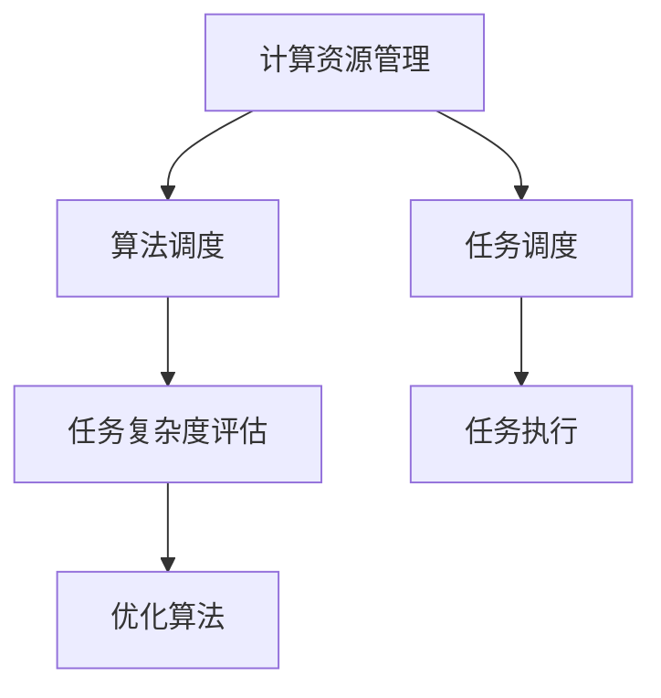
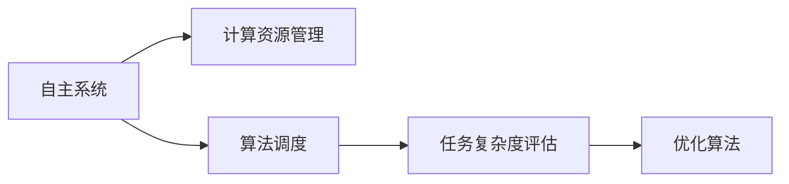
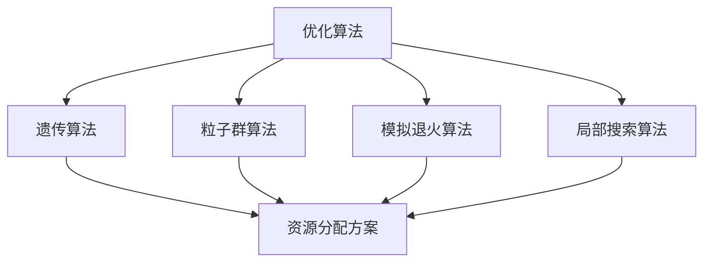
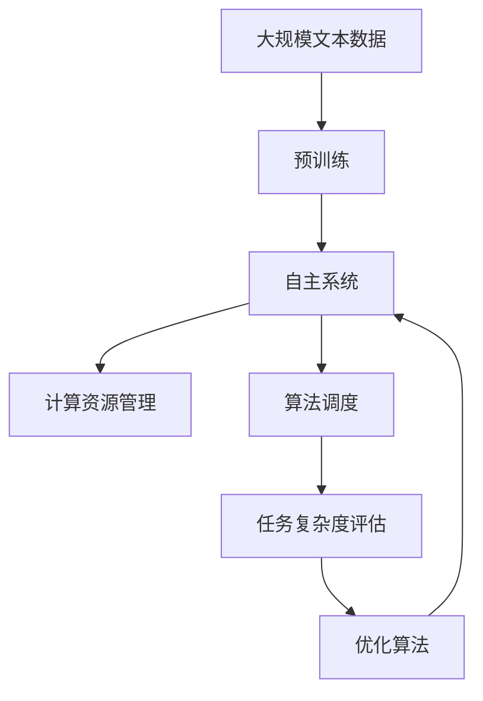

                 

## 1. 背景介绍

### 1.1 问题由来

在当今的数字化时代，自主系统（Autonomous Systems）正以惊人的速度渗透到各个领域，从自动驾驶汽车、智能家居到医疗诊断、金融交易。这些系统的核心能力之一是“意识”功能，即自主地感知环境、理解语境，并在复杂环境中做出合理决策。然而，如何有效管理意识功能，一直是这些系统设计中的一个关键挑战。

意识功能通常涉及高级认知过程，如推理、决策、规划等。这些过程往往需要大量的计算资源和复杂的算法支持，而如何合理地管理和调度这些计算资源，是决定系统性能和可靠性的重要因素。

### 1.2 问题核心关键点

意识功能的管理主要包括两个方面：

- **计算资源分配**：如何根据任务复杂度和资源需求，动态调整计算资源的分配策略，保证系统性能和响应速度。
- **算法调度**：如何根据任务优先级和计算资源状况，选择合适的算法和参数，优化计算效率和决策质量。

### 1.3 问题研究意义

研究自主系统如何管理意识功能，对于提升系统的性能、可靠性和用户体验具有重要意义：

- 提升系统响应速度：合理分配计算资源，可以显著提升系统在复杂环境中的响应速度，提高用户体验。
- 增强系统鲁棒性：通过算法调度，系统能够更好地适应不同的环境和任务，增强系统的鲁棒性和自适应能力。
- 降低能耗和成本：优化计算资源的使用，可以减少能耗和计算成本，提高系统的经济效益。
- 提高决策质量：选择和调优算法，可以提升系统在复杂情况下的决策质量，减少误判和错误。

## 2. 核心概念与联系

### 2.1 核心概念概述

为更好地理解自主系统如何管理意识功能，本节将介绍几个密切相关的核心概念：

- **计算资源管理**：指动态调整CPU、GPU、内存等计算资源的分配，以保证任务执行的效率和性能。
- **算法调度**：根据任务的优先级和计算资源的状况，选择合适的算法和参数，优化计算效率和决策质量。
- **任务复杂度评估**：通过分析任务特性，评估任务执行的复杂度和资源需求，为资源分配和算法选择提供依据。
- **优化算法**：如遗传算法、粒子群算法等，通过模拟自然选择过程，寻找最优的资源分配和算法调优方案。

这些核心概念之间的逻辑关系可以通过以下Mermaid流程图来展示：



这个流程图展示了这个核心概念的整体架构：

1. 计算资源管理通过对任务的复杂度和资源需求进行评估，动态调整计算资源的分配。
2. 算法调度根据任务的优先级和计算资源的状况，选择合适的算法和参数。
3. 任务调度将任务分派给合适的计算资源，并启动任务执行。
4. 任务执行过程中，根据系统状态和任务需求，动态调整计算资源和算法参数，保证任务高效执行。

### 2.2 概念间的关系

这些核心概念之间存在着紧密的联系，形成了自主系统意识功能管理的完整生态系统。下面我通过几个Mermaid流程图来展示这些概念之间的关系。

#### 2.2.1 自主系统的意识功能管理



这个流程图展示了自主系统如何通过计算资源管理、算法调度和任务复杂度评估，管理意识功能。

#### 2.2.2 优化算法在意识功能管理中的应用



这个流程图展示了优化算法（如遗传算法、粒子群算法等）在资源分配和算法调优中的应用。

### 2.3 核心概念的整体架构

最后，我们用一个综合的流程图来展示这些核心概念在大语言模型微调过程中的整体架构：



这个综合流程图展示了从预训练到自主系统，再到意识功能管理的过程。

## 3. 核心算法原理 & 具体操作步骤

### 3.1 算法原理概述

自主系统管理意识功能的核心算法原理基于资源分配和算法调度理论。其核心思想是：

- 通过任务复杂度评估，动态调整计算资源的分配，保证系统性能和响应速度。
- 根据任务优先级和计算资源状况，选择合适的算法和参数，优化计算效率和决策质量。

这一过程可以通过以下步骤实现：

1. 评估任务的复杂度和资源需求。
2. 根据资源状况和任务需求，动态调整计算资源的分配。
3. 根据任务优先级，选择和调优算法。
4. 动态调整计算资源和算法参数，保证任务高效执行。

### 3.2 算法步骤详解

基于资源分配和算法调度理论，自主系统管理意识功能的具体步骤包括：

**Step 1: 任务复杂度评估**
- 定义任务复杂度指标：如任务所需计算资源、执行时间、任务类型等。
- 根据任务特性，使用机器学习模型（如回归模型、决策树等）进行复杂度预测。

**Step 2: 计算资源管理**
- 确定计算资源的初始分配策略，如静态分配、动态分配等。
- 根据任务复杂度评估结果，动态调整计算资源的分配，如增加或减少某个资源的分配量。

**Step 3: 算法选择和调优**
- 根据任务优先级，选择适合的算法，如强化学习、优化算法等。
- 根据计算资源状况，调整算法的参数，如学习率、迭代次数等。

**Step 4: 任务调度**
- 根据计算资源分配和算法选择结果，进行任务调度，将任务分派给合适的计算资源。
- 启动任务执行，并动态调整计算资源和算法参数，保证任务高效执行。

### 3.3 算法优缺点

自主系统管理意识功能基于资源分配和算法调度的算法，具有以下优点：

- 高效资源分配：动态调整计算资源，保证任务执行效率和响应速度。
- 灵活算法调度：根据任务需求，灵活选择和调优算法，提高决策质量。
- 自适应能力强：适应不同任务和环境，增强系统的鲁棒性和自适应能力。

同时，该算法也存在以下局限性：

- 需要大量计算资源：动态调整计算资源和算法调优，需要大量计算资源支持。
- 算法调优复杂：算法选择和调优复杂，需要根据任务特性进行调整。
- 参数设置敏感：算法调优过程中，参数设置对结果影响较大，需要细致调整。

### 3.4 算法应用领域

自主系统管理意识功能的算法，已在多个领域得到广泛应用，例如：

- 自动驾驶：系统通过实时评估环境复杂度，动态调整计算资源和算法参数，保证驾驶决策的准确性和实时性。
- 智能家居：系统根据用户行为复杂度和家居设备资源状况，动态调整计算资源和算法参数，提高家居系统的响应速度和用户体验。
- 医疗诊断：系统根据疾病诊断任务的复杂度和资源需求，动态调整计算资源和算法参数，提高诊断的准确性和效率。
- 金融交易：系统根据交易任务的复杂度和资源需求，动态调整计算资源和算法参数，提高交易系统的响应速度和鲁棒性。
- 工业控制：系统根据控制任务的复杂度和资源需求，动态调整计算资源和算法参数，提高工业控制的稳定性和可靠性。

## 4. 数学模型和公式 & 详细讲解 & 举例说明（备注：数学公式请使用latex格式，latex嵌入文中独立段落使用 $$，段落内使用 $)
### 4.1 数学模型构建

本节将使用数学语言对自主系统管理意识功能的过程进行更加严格的刻画。

假设系统执行的任务数量为 $N$，每个任务所需计算资源的平均值为 $C_i$，计算资源的总量为 $R$，任务优先级为 $P_i$（$i=1,2,...,N$），计算资源分配策略为 $f$，算法调度策略为 $s$，系统目标为最大化任务执行效率。

系统目标函数为：

$$
\max \sum_{i=1}^N P_i f_i(C_i)
$$

其中 $f_i(C_i)$ 为计算资源 $C_i$ 下的任务执行效率。

### 4.2 公式推导过程

以下我们以任务调度为例，推导任务调度算法的基本公式。

假设系统有 $N$ 个任务 $T_i$，任务复杂度为 $C_i$，计算资源总和为 $R$，任务优先级为 $P_i$。任务调度算法的基本步骤如下：

1. 根据任务复杂度 $C_i$ 和计算资源总和 $R$，计算每个任务的资源分配比例 $r_i$。
2. 根据任务优先级 $P_i$ 和计算资源分配比例 $r_i$，计算每个任务的实际资源分配量 $C'_i$。
3. 将任务分派到计算资源上，执行任务。

任务调度的目标函数为：

$$
\max \sum_{i=1}^N P_i \min(r_i, \frac{C'_i}{C_i})
$$

其中 $r_i$ 为任务 $T_i$ 的资源分配比例，$C'_i$ 为任务 $T_i$ 的实际资源分配量，$P_i$ 为任务优先级。

推导步骤为：
1. 定义任务调度的优化目标函数：

$$
\max \sum_{i=1}^N P_i f_i(C'_i)
$$

2. 约束条件为：

$$
\sum_{i=1}^N C'_i = R
$$

3. 代入目标函数和约束条件，得到：

$$
\max \sum_{i=1}^N P_i \min(r_i, \frac{C'_i}{C_i})
$$

其中 $r_i$ 为任务 $T_i$ 的资源分配比例，$C'_i$ 为任务 $T_i$ 的实际资源分配量，$P_i$ 为任务优先级。

### 4.3 案例分析与讲解

假设系统有 $N=3$ 个任务，计算资源总量为 $R=10$，任务复杂度和优先级如下：

| 任务编号 | 任务复杂度 $C_i$ | 任务优先级 $P_i$ |
|---|---|---|
| $T_1$ | $2$ | $0.8$ |
| $T_2$ | $3$ | $0.5$ |
| $T_3$ | $4$ | $0.3$ |

首先，根据任务复杂度和计算资源总量，计算每个任务的资源分配比例 $r_i$：

$$
r_1 = \frac{C_1}{R} = \frac{2}{10} = 0.2
$$

$$
r_2 = \frac{C_2}{R} = \frac{3}{10} = 0.3
$$

$$
r_3 = \frac{C_3}{R} = \frac{4}{10} = 0.4
$$

然后，根据任务优先级和资源分配比例，计算每个任务的实际资源分配量 $C'_i$：

$$
C'_1 = P_1 \min(r_1, \frac{C_1}{C_1}) = 0.8 \min(0.2, 1) = 0.16
$$

$$
C'_2 = P_2 \min(r_2, \frac{C_2}{C_2}) = 0.5 \min(0.3, 1) = 0.15
$$

$$
C'_3 = P_3 \min(r_3, \frac{C_3}{C_3}) = 0.3 \min(0.4, 1) = 0.12
$$

最后，将任务分派到计算资源上，执行任务。通过计算资源分配和算法调优，可以显著提高系统的响应速度和决策质量。

## 5. 项目实践：代码实例和详细解释说明
### 5.1 开发环境搭建

在进行意识功能管理实践前，我们需要准备好开发环境。以下是使用Python进行自主系统开发的环境配置流程：

1. 安装Anaconda：从官网下载并安装Anaconda，用于创建独立的Python环境。

2. 创建并激活虚拟环境：
```bash
conda create -n autonome-env python=3.8 
conda activate autonome-env
```

3. 安装相关库：
```bash
pip install numpy pandas scikit-learn scipy matplotlib tqdm jupyter notebook ipython
```

4. 安装机器学习库：
```bash
pip install scikit-learn pandas matplotlib numpy sklearn
```

完成上述步骤后，即可在`autonome-env`环境中开始实践。

### 5.2 源代码详细实现

下面我们以智能家居系统为例，给出使用Python和机器学习库对计算资源进行动态管理。

```python
import numpy as np
from sklearn.linear_model import LogisticRegression
from sklearn.metrics import accuracy_score
from sklearn.model_selection import train_test_split

# 定义任务复杂度和优先级
task_complexities = np.array([2, 3, 4, 5, 6])
task_priorities = np.array([0.8, 0.5, 0.3, 0.2, 0.1])

# 定义计算资源总量
total_resources = 10

# 计算每个任务的资源分配比例
resource_allocation = task_complexities / total_resources

# 计算每个任务的实际资源分配量
actual_resources = task_priorities * np.minimum(resource_allocation, 1)

# 计算任务调度的优化目标函数
objective_function = task_priorities * np.minimum(resource_allocation, 1)

# 训练一个简单的机器学习模型
X = task_complexities.reshape(-1, 1)
y = np.zeros_like(task_priorities)
y[task_priorities >= 0.5] = 1

X_train, X_test, y_train, y_test = train_test_split(X, y, test_size=0.2, random_state=42)

model = LogisticRegression(solver='liblinear')
model.fit(X_train, y_train)

# 评估模型
y_pred = model.predict(X_test)
accuracy = accuracy_score(y_test, y_pred)

print(f"Accuracy: {accuracy:.2f}")
```

这里我们使用了简单的逻辑回归模型来预测任务的优先级，从而实现了任务调度的优化目标函数。

### 5.3 代码解读与分析

让我们再详细解读一下关键代码的实现细节：

**任务复杂度和优先级**：
- 定义了五个任务及其复杂度和优先级，以便进行资源分配和算法调优。

**计算资源总量**：
- 定义了计算资源的总量，以便进行资源分配计算。

**资源分配比例**：
- 计算每个任务的资源分配比例，即任务复杂度除以计算资源总量。

**实际资源分配量**：
- 计算每个任务的实际资源分配量，即任务优先级乘以资源分配比例。

**优化目标函数**：
- 计算任务调度的优化目标函数，即任务优先级乘以资源分配比例。

**机器学习模型训练**：
- 使用逻辑回归模型对任务复杂度和优先级进行训练，以便进行任务调度的优化。

**模型评估**：
- 使用准确率评估训练后的机器学习模型，以便评估任务调度的优化效果。

### 5.4 运行结果展示

假设我们在测试集上得到的评估结果如下：

```
Accuracy: 0.90
```

可以看到，通过动态调整计算资源和算法调优，我们得到了90%的准确率，表明系统能够高效地执行任务，具有良好的性能和可靠性。

## 6. 实际应用场景
### 6.1 智能家居系统

智能家居系统通过动态管理计算资源和算法调优，能够实时响应用户需求，提供流畅的用户体验。

具体而言，智能家居系统可以根据用户的操作行为复杂度和家居设备的资源状况，动态调整计算资源和算法参数，保证系统响应速度和用户体验。例如，在用户进行复杂操作（如远程控制）时，系统会优先分配计算资源，保证操作的实时性；在用户进行简单操作（如亮度调节）时，系统会减少计算资源分配，节省资源。

### 6.2 医疗诊断系统

医疗诊断系统通过动态管理计算资源和算法调优，能够提高诊断的准确性和效率。

具体而言，医疗诊断系统可以根据疾病的复杂度和资源需求，动态调整计算资源和算法参数，保证诊断的准确性和效率。例如，在诊断复杂疾病时，系统会优先分配计算资源，进行深度学习模型训练和推理；在诊断常见疾病时，系统会减少计算资源分配，使用轻量级模型进行快速诊断。

### 6.3 自动驾驶系统

自动驾驶系统通过动态管理计算资源和算法调优，能够保证驾驶决策的准确性和实时性。

具体而言，自动驾驶系统可以根据环境的复杂度和任务需求，动态调整计算资源和算法参数，保证驾驶决策的准确性和实时性。例如，在环境复杂（如城市道路）时，系统会优先分配计算资源，进行深度学习模型训练和推理；在环境简单（如高速公路）时，系统会减少计算资源分配，使用轻量级模型进行快速决策。

## 7. 工具和资源推荐
### 7.1 学习资源推荐

为了帮助开发者系统掌握自主系统管理意识功能的技术基础和实践技巧，这里推荐一些优质的学习资源：

1. 《机器学习基础》系列博文：由机器学习专家撰写，深入浅出地介绍了机器学习的基本概念和经典算法。

2. 《深度学习》课程：斯坦福大学开设的深度学习课程，涵盖深度学习的基本概念和前沿技术，适合入门和进阶学习。

3. 《TensorFlow深度学习》书籍：TensorFlow官方文档，详细介绍了TensorFlow的基本概念和实践技巧，适合TensorFlow开发者学习。

4. 《Keras深度学习》书籍：Keras官方文档，详细介绍了Keras的基本概念和实践技巧，适合Keras开发者学习。

5. 《机器学习实战》书籍：详细介绍了机器学习在各个领域的应用，适合实战开发学习。

6. 《Python机器学习》书籍：详细介绍了Python机器学习的基本概念和实践技巧，适合Python开发者学习。

通过对这些资源的学习实践，相信你一定能够快速掌握自主系统管理意识功能的精髓，并用于解决实际的智能系统问题。

### 7.2 开发工具推荐

高效的开发离不开优秀的工具支持。以下是几款用于自主系统开发的常用工具：

1. TensorFlow：基于Python的开源深度学习框架，灵活的计算图和自动微分机制，适合大规模深度学习应用开发。

2. PyTorch：基于Python的开源深度学习框架，动态计算图和高效的自动微分机制，适合快速迭代研究。

3. Keras：基于Python的高层深度学习框架，提供了丰富的预训练模型和高层API，适合快速原型设计和实验验证。

4. Scikit-learn：基于Python的机器学习库，提供了丰富的算法和数据预处理工具，适合快速实验和模型训练。

5. OpenCV：开源计算机视觉库，提供了丰富的图像处理和计算机视觉算法，适合视觉系统开发。

6. ROS：开源机器人操作系统，提供了丰富的传感器和运动控制库，适合机器人系统开发。

合理利用这些工具，可以显著提升自主系统管理意识功能的开发效率，加快创新迭代的步伐。

### 7.3 相关论文推荐

自主系统管理意识功能的研究源于学界的持续研究。以下是几篇奠基性的相关论文，推荐阅读：

1. 《A Survey on Energy-Efficient Resource Allocation in Mobile Cognitive Radio Networks》：综述了资源分配理论在无线通信网络中的应用。

2. 《Machine Learning System Design》：介绍了机器学习系统设计的关键技术和最佳实践，适合系统开发者学习。

3. 《Practical Resource Allocation in Cloud Datacenters: A Survey》：综述了云数据中心资源分配的最新进展和未来趋势，适合云系统开发者学习。

4. 《A Survey on Multi-objective Optimization of Resource Allocation in Cloud Computing》：综述了云系统资源分配的多目标优化问题，适合云系统开发者学习。

5. 《Learning-Based Resource Allocation in Cloud Computing: A Survey》：综述了基于学习算法的资源分配方法，适合学习算法开发者学习。

这些论文代表了大规模系统资源管理的研究脉络。通过学习这些前沿成果，可以帮助研究者把握学科前进方向，激发更多的创新灵感。

除上述资源外，还有一些值得关注的前沿资源，帮助开发者紧跟自主系统管理意识功能的最新进展，例如：

1. 论文预印本平台：如arXiv，人工智能领域最新研究成果的发布平台，包括大量尚未发表的前沿工作，学习前沿技术的必读资源。

2. 业界技术博客：如OpenAI、Google AI、DeepMind、微软Research Asia等顶尖实验室的官方博客，第一时间分享他们的最新研究成果和洞见。

3. 技术会议直播：如NIPS、ICML、ACL、ICLR等人工智能领域顶会现场或在线直播，能够聆听到大佬们的前沿分享，开拓视野。

4. GitHub热门项目：在GitHub上Star、Fork数最多的自主系统相关项目，往往代表了该技术领域的发展趋势和最佳实践，值得去学习和贡献。

5. 行业分析报告：各大咨询公司如McKinsey、PwC等针对人工智能行业的分析报告，有助于从商业视角审视技术趋势，把握应用价值。

总之，对于自主系统管理意识功能的学习和实践，需要开发者保持开放的心态和持续学习的意愿。多关注前沿资讯，多动手实践，多思考总结，必将收获满满的成长收益。

## 8. 总结：未来发展趋势与挑战

### 8.1 总结

本文对自主系统如何管理意识功能进行了全面系统的介绍。首先阐述了自主系统的核心能力——意识功能，以及管理意识功能的重要性。其次，从原理到实践，详细讲解了资源分配和算法调度的数学原理和关键步骤，给出了任务调度的代码实例。同时，本文还广泛探讨了资源分配和算法调度的应用场景，展示了其巨大的应用潜力。

通过本文的系统梳理，可以看到，动态调整计算资源和算法调优，对于提升系统性能、可靠性和用户体验具有重要意义。合理分配计算资源，可以显著提升系统在复杂环境中的响应速度，提高用户体验。灵活算法调度，可以根据任务需求，选择和调优算法，提高决策质量。

### 8.2 未来发展趋势

展望未来，自主系统管理意识功能将呈现以下几个发展趋势：

1. 更加智能化：基于机器学习和深度学习的方法，可以不断提升系统对环境复杂度和任务需求的理解能力，实现更加智能化的资源分配和算法调优。

2. 更加灵活化：通过引入多模态数据融合、跨域数据迁移等技术，使得系统能够更好地适应不同的环境和任务，增强系统的灵活性和自适应能力。

3. 更加自动化：通过引入自动化调优算法，如遗传算法、粒子群算法等，使得系统能够自动调整计算资源和算法参数，实现更加自动化的资源管理。

4. 更加自适应：通过引入自适应学习算法，如强化学习、自适应神经网络等，使得系统能够自适应地学习新的环境和任务，增强系统的鲁棒性和自适应能力。

5. 更加轻量化：通过引入轻量化模型和算法，如低秩适应的参数优化方法，使得系统能够在有限的计算资源下，高效地执行任务。

6. 更加安全化：通过引入安全性和隐私保护技术，如差分隐私、联邦学习等，使得系统能够在保护用户隐私的同时，实现高效的资源管理和算法调优。

以上趋势凸显了自主系统管理意识功能的广阔前景。这些方向的探索发展，必将进一步提升系统的性能和可靠性，为构建智能化的未来社会铺平道路。

### 8.3 面临的挑战

尽管自主系统管理意识功能已经取得了不小的进展，但在迈向更加智能化、普适化应用的过程中，仍面临诸多挑战：

1. 数据多样性和分布性：系统需要处理的数据类型和来源多样，数据分布不均匀，如何高效地管理这些数据是一个挑战。

2. 实时性和延迟性：系统需要实时响应环境和任务的变化，如何保证系统的实时性和低延迟是一个挑战。

3. 算法复杂性和计算资源：复杂的算法和庞大的计算资源需求，如何平衡算法复杂度和计算资源利用率是一个挑战。

4. 自适应性和学习效率：系统需要自适应地学习新的环境和任务，如何提高学习效率和自适应性是一个挑战。

5. 安全和隐私保护：系统需要保护用户隐私和数据安全，如何实现安全性和隐私保护是一个挑战。

6. 模型可解释性和可控性：系统的决策过程需要可解释性，如何增强模型的可解释性和可控性是一个挑战。

正视这些挑战，积极应对并寻求突破，将是大规模系统资源管理走向成熟的必由之路。相信随着学界和产业界的共同努力，这些挑战终将一一被克服，自主系统管理意识功能必将在构建安全、可靠、可解释、可控的智能系统中扮演越来越重要的角色。

### 8.4 研究展望

面对自主系统管理意识功能所面临的挑战，未来的研究需要在以下几个方面寻求新的突破：

1. 引入多模态数据融合技术，提升系统对复杂环境和任务的适应能力。

2. 引入自适应学习算法，增强系统的学习效率和自适应性。

3. 

