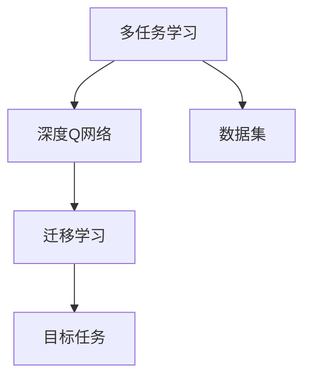
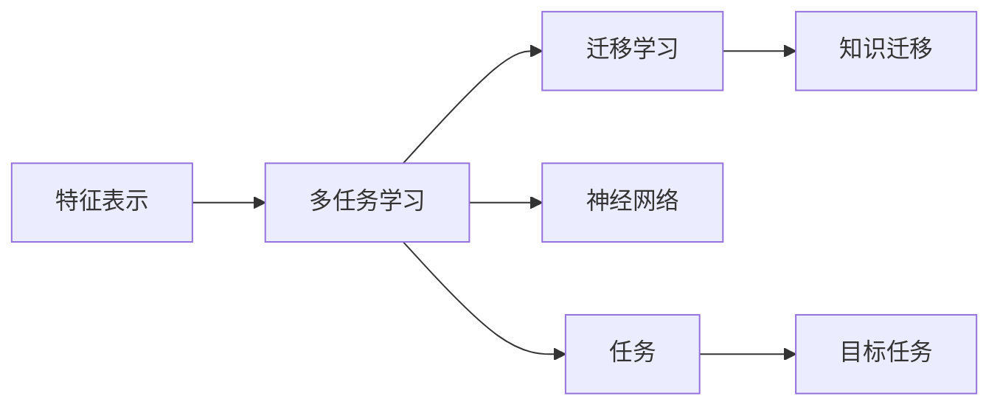

                 

# 一切皆是映射：DQN的多任务学习与迁移学习策略探讨

> 关键词：多任务学习(Multi-Task Learning, MTL), 迁移学习(Transfer Learning, TL), Deep Q-Network (DQN), 策略优化, 神经网络, 强化学习(RL)

## 1. 背景介绍

在现代人工智能领域，深度强化学习（RL）已成为机器学习的重要分支之一。它通过让智能体与环境进行交互，学习最优策略以最大化长期奖励，广泛应用于游戏智能、机器人控制、自动驾驶等前沿领域。其中，深度Q网络（DQN）作为经典的深度强化学习算法，因其高效、鲁棒的特点，被广泛应用于智能游戏、无人驾驶等领域。

然而，DQN等传统强化学习算法通常聚焦于单任务学习，即学习一个特定的环境映射关系，以获得最优策略。这种单任务学习模式虽然有效，但在实际应用中，常常面临环境复杂多变、任务多样性的挑战。如何更好地适应多任务、多环境，并实现知识迁移，已成为强化学习领域的重要研究方向。

为了应对这些挑战，本文将探讨多任务学习和迁移学习在DQN中的应用，提出一系列策略，以期在多任务、多环境中，通过学习单一的策略实现多样化的任务适应和知识迁移。

## 2. 核心概念与联系

### 2.1 核心概念概述

多任务学习和迁移学习作为机器学习领域的重要分支，具有如下核心概念：

- **多任务学习(Multi-Task Learning, MTL)**：指同时训练多个相关任务，以共享特征提取器，提升各任务性能的机器学习方法。多任务学习的核心思想在于，通过在多个相关任务间共享特征表示，增强模型的泛化能力和鲁棒性。

- **迁移学习(Transfer Learning, TL)**：指将一个领域学到的知识迁移到另一个相关领域的方法。迁移学习的核心思想在于，通过在源任务上学习知识，在目标任务上进行迁移，减少在新任务上从头训练的复杂度和成本。

- **深度Q网络(Deep Q-Network, DQN)**：一种基于深度神经网络（神经网络）的强化学习算法，用于解决状态空间连续、动作空间离散的问题。DQN通过神经网络逼近Q值函数，优化策略使得智能体在环境中采取最优行动以最大化长期奖励。

这些概念之间的逻辑关系可以通过以下Mermaid流程图来展示：



这个流程图展示了多任务学习和迁移学习在DQN中的作用和联系：

1. **多任务学习**：通过对多个任务进行联合训练，DQN可以从多个相关任务中学习共有的特征表示，提升整体性能。
2. **迁移学习**：在DQN中，可以通过迁移学习，将一个任务中学到的知识应用于其他相关任务，减少在每个新任务上的从头训练成本。

### 2.2 概念间的关系

这些核心概念之间的关系可以通过以下Mermaid流程图来进一步展示：



这个流程图展示了多任务学习和迁移学习在DQN中的具体应用：

1. **特征表示**：DQN通过多任务学习，共享神经网络的特征表示，提取共有的特征信息。
2. **神经网络**：多任务学习的核心在于神经网络，通过神经网络逼近Q值函数，实现对不同任务的特征提取和策略优化。
3. **任务**：多任务学习聚焦于不同任务间的知识共享，迁移学习则侧重于在不同任务间进行知识迁移。
4. **知识迁移**：通过迁移学习，将一个任务中学到的知识应用于其他相关任务，提升目标任务的性能。

## 3. 核心算法原理 & 具体操作步骤
### 3.1 算法原理概述

DQN的多任务学习和迁移学习策略主要基于如下核心思想：

1. **多任务学习**：通过在多个相关任务上共享神经网络，学习共有的特征表示，提升各任务性能。
2. **迁移学习**：在DQN中，可以通过迁移学习，将一个任务中学到的知识应用于其他相关任务，减少在每个新任务上的从头训练成本。

这些核心思想可以通过以下数学模型进行表述：

设 $N$ 个任务，每个任务 $T_i$ 的状态空间为 $S_i$，动作空间为 $A_i$，奖励函数为 $R_i$，智能体的目标是在每个任务中学习最优策略 $Q_i(s_i,a_i)$。

**多任务学习**：设神经网络参数为 $\theta$，通过多任务联合训练，最小化所有任务的损失函数：

$$
\mathcal{L}(\theta) = \sum_{i=1}^{N} \mathbb{E}_{s_i,a_i}\left[ \mathbb{E}_{\epsilon_i}[\Delta Q_i^{\epsilon_i}(s_i,a_i)] \right]
$$

其中，$\Delta Q_i^{\epsilon_i}$ 为策略的TD误差，$\epsilon_i$ 为任务 $T_i$ 的噪声策略。

**迁移学习**：假设源任务 $T_s$ 和目标任务 $T_t$ 共享神经网络参数 $\theta$，源任务的目标是学习最优策略 $Q_s(s_s,a_s)$，目标任务的目标是学习最优策略 $Q_t(s_t,a_t)$。在迁移学习中，可以通过调整参数 $\theta$ 来实现知识迁移：

$$
Q_t(s_t,a_t) = f(\theta) \approx Q_s(s_s,a_s)
$$

### 3.2 算法步骤详解

基于上述原理，DQN的多任务学习和迁移学习策略通常包括以下步骤：

**Step 1: 设计任务与环境**

在多任务学习和迁移学习中，首先需要明确需要学习的任务和相应的环境。例如，可以设计多个机器人导航任务，每个任务对应不同的起点、终点和障碍物分布。

**Step 2: 共享神经网络**

设计共享神经网络结构，以提取各任务间的共性特征。一般使用全连接层、卷积层等结构，将不同任务的输入映射到共享特征空间。

**Step 3: 联合训练与迁移学习**

在共享神经网络的基础上，对多个任务进行联合训练，最小化所有任务的损失函数。在训练过程中，可以通过迁移学习，将源任务中学到的知识迁移到目标任务中。

**Step 4: 任务特定调整**

对迁移后的模型进行任务特定调整，适应目标任务的特定需求。例如，在导航任务中，可以调整神经网络的输入和输出层，以适应不同的起点、终点和障碍物分布。

**Step 5: 评估与优化**

在训练完成后，对模型进行评估，并根据评估结果进行优化。可以使用验证集等手段，判断模型在新任务上的表现，调整训练参数，提高模型性能。

### 3.3 算法优缺点

DQN的多任务学习和迁移学习策略具有以下优点：

1. **泛化能力强**：通过多任务学习，DQN可以从多个相关任务中学习共有的特征表示，提升整体性能。
2. **迁移效率高**：在迁移学习中，可以通过调整神经网络参数，实现知识在不同任务之间的快速迁移，减少从头训练的成本。
3. **鲁棒性好**：多任务学习和迁移学习可以提高模型的泛化能力，减少在特定环境或任务上的过拟合风险。

同时，这些策略也存在以下缺点：

1. **模型复杂度高**：共享神经网络的结构较为复杂，对计算资源和训练时间要求较高。
2. **数据需求量大**：多任务学习和迁移学习需要大量高质量的数据，以确保特征表示的有效性。
3. **参数更新困难**：在迁移学习中，如何调整神经网络参数以实现最佳的知识迁移，需要更多的实验和调整。

### 3.4 算法应用领域

DQN的多任务学习和迁移学习策略已经在多个领域得到了广泛应用，例如：

- **游戏智能**：通过多任务学习和迁移学习，智能体可以在不同的游戏环境中学习共有的策略，提升游戏性能。
- **机器人控制**：在多个机器人导航任务中，通过共享神经网络，智能体可以学习共有的导航策略，提升机器人控制精度。
- **自动驾驶**：在多个自动驾驶任务中，通过多任务学习和迁移学习，智能体可以学习共有的决策策略，提高驾驶安全性。

这些应用场景展示了DQN的多任务学习和迁移学习策略的强大潜力，为多任务、多环境下的强化学习提供了新的方向。

## 4. 数学模型和公式 & 详细讲解 & 举例说明

### 4.1 数学模型构建

基于上述算法步骤，DQN的多任务学习和迁移学习策略可以通过以下数学模型进行建模：

设 $N$ 个任务，每个任务 $T_i$ 的状态空间为 $S_i$，动作空间为 $A_i$，奖励函数为 $R_i$，智能体的目标是在每个任务中学习最优策略 $Q_i(s_i,a_i)$。

**多任务学习**：设神经网络参数为 $\theta$，通过多任务联合训练，最小化所有任务的损失函数：

$$
\mathcal{L}(\theta) = \sum_{i=1}^{N} \mathbb{E}_{s_i,a_i}\left[ \mathbb{E}_{\epsilon_i}[\Delta Q_i^{\epsilon_i}(s_i,a_i)] \right]
$$

其中，$\Delta Q_i^{\epsilon_i}$ 为策略的TD误差，$\epsilon_i$ 为任务 $T_i$ 的噪声策略。

**迁移学习**：假设源任务 $T_s$ 和目标任务 $T_t$ 共享神经网络参数 $\theta$，源任务的目标是学习最优策略 $Q_s(s_s,a_s)$，目标任务的目标是学习最优策略 $Q_t(s_t,a_t)$。在迁移学习中，可以通过调整参数 $\theta$ 来实现知识迁移：

$$
Q_t(s_t,a_t) = f(\theta) \approx Q_s(s_s,a_s)
$$

### 4.2 公式推导过程

以下我们以两个导航任务为例，推导多任务学习和迁移学习的数学模型和算法流程。

**导航任务 $T_s$ 和 $T_t$**：

- 状态空间 $S_s$ 和 $S_t$ 分别为 $(5,5)$ 网格和 $(10,10)$ 网格。
- 动作空间 $A_s$ 和 $A_t$ 分别为 $4$ 个方向（上、下、左、右）。
- 奖励函数 $R_s$ 和 $R_t$ 分别为 $+1$ 和 $+2$。

设共享神经网络参数为 $\theta$，每个任务的目标是学习最优策略 $Q_s(s_s,a_s)$ 和 $Q_t(s_t,a_t)$。

**多任务学习**：

1. 将每个任务的输入 $s_s$ 和 $s_t$ 映射到共享的特征表示空间，得到 $\phi(s_s)$ 和 $\phi(s_t)$。
2. 对每个任务的神经网络 $f_{s,t}(\phi)$ 进行联合训练，最小化所有任务的损失函数：

$$
\mathcal{L}(\theta) = \sum_{i=1}^{2} \mathbb{E}_{s_i,a_i}\left[ \mathbb{E}_{\epsilon_i}[\Delta Q_i^{\epsilon_i}(s_i,a_i)] \right]
$$

其中，$\epsilon_s$ 和 $\epsilon_t$ 分别为 $T_s$ 和 $T_t$ 的噪声策略。

**迁移学习**：

1. 假设源任务 $T_s$ 和目标任务 $T_t$ 共享神经网络参数 $\theta$。
2. 在源任务 $T_s$ 上学习最优策略 $Q_s(s_s,a_s)$，在目标任务 $T_t$ 上学习最优策略 $Q_t(s_t,a_t)$。
3. 通过调整神经网络参数 $\theta$，实现知识迁移：

$$
Q_t(s_t,a_t) = f(\theta) \approx Q_s(s_s,a_s)
$$

### 4.3 案例分析与讲解

以最简单的导航任务为例，分析多任务学习和迁移学习的具体实现。

假设智能体在导航任务 $T_s$ 和 $T_t$ 中，需要通过共享神经网络学习最优策略。具体步骤如下：

1. **设计共享神经网络**：使用全连接层和卷积层，将输入状态 $s_s$ 和 $s_t$ 映射到共享特征表示 $\phi(s_s)$ 和 $\phi(s_t)$。
2. **联合训练**：对共享神经网络 $f_{s,t}(\phi)$ 进行联合训练，最小化所有任务的损失函数：

$$
\mathcal{L}(\theta) = \sum_{i=1}^{2} \mathbb{E}_{s_i,a_i}\left[ \mathbb{E}_{\epsilon_i}[\Delta Q_i^{\epsilon_i}(s_i,a_i)] \right]
$$

其中，$\epsilon_s$ 和 $\epsilon_t$ 分别为 $T_s$ 和 $T_t$ 的噪声策略。

3. **迁移学习**：在训练完成后，将共享神经网络参数 $\theta$ 应用到目标任务 $T_t$ 中，通过调整神经网络参数 $\theta$，实现知识迁移：

$$
Q_t(s_t,a_t) = f(\theta) \approx Q_s(s_s,a_s)
$$

在实际应用中，还需要进行任务特定调整，以适应目标任务的特定需求。例如，在导航任务中，可以调整神经网络的输入和输出层，以适应不同的起点、终点和障碍物分布。

## 5. 项目实践：代码实例和详细解释说明

### 5.1 开发环境搭建

在进行多任务学习和迁移学习实践前，我们需要准备好开发环境。以下是使用Python进行TensorFlow开发的环境配置流程：

1. 安装Anaconda：从官网下载并安装Anaconda，用于创建独立的Python环境。

2. 创建并激活虚拟环境：
```bash
conda create -n tf-env python=3.8 
conda activate tf-env
```

3. 安装TensorFlow：从官网获取对应的安装命令。例如：
```bash
conda install tensorflow
```

4. 安装TensorFlow Addons：
```bash
pip install tensorflow-addons
```

5. 安装TensorBoard：
```bash
pip install tensorboard
```

6. 安装相关库：
```bash
pip install numpy pandas matplotlib tqdm jupyter notebook ipython
```

完成上述步骤后，即可在`tf-env`环境中开始多任务学习和迁移学习实践。

### 5.2 源代码详细实现

下面我们以多任务学习和迁移学习为例，给出使用TensorFlow实现DQN的详细代码。

首先，定义导航任务的环境类：

```python
import gym
from tensorflow.keras.layers import Dense, Conv2D, Flatten
from tensorflow.keras.models import Sequential

class GridWorldEnv(gym.Env):
    def __init__(self, n_rows, n_cols, reward):
        super(GridWorldEnv, self).__init__()
        self.n_rows = n_rows
        self.n_cols = n_cols
        self.reward = reward
        self.state = 0
        self.done = False
        self.terminated = False

    def step(self, action):
        if action == 0:  # up
            if self.state >= self.n_cols:
                self.state = 0
            else:
                self.state += 1
        elif action == 1:  # down
            if self.state >= self.n_cols:
                self.state = self.n_cols - 1
            else:
                self.state -= 1
        elif action == 2:  # left
            if self.state % self.n_cols == 0:
                self.state = self.n_cols - 1
            else:
                self.state -= 1
        elif action == 3:  # right
            if self.state % self.n_cols == self.n_cols - 1:
                self.state = 0
            else:
                self.state += 1
        return self.state, self.reward, self.done, {}

    def reset(self):
        self.state = 0
        self.done = False
        self.terminated = False
        return self.state

    def render(self, mode='human'):
        pass

    def seed(self, seed=None):
        pass
```

然后，定义共享神经网络的构建函数：

```python
def build_shared_network(input_shape, output_shape, n_hidden_units):
    model = Sequential()
    model.add(Conv2D(32, (3, 3), activation='relu', input_shape=input_shape))
    model.add(Flatten())
    model.add(Dense(64, activation='relu'))
    model.add(Dense(output_shape, activation='linear'))
    return model
```

接着，定义多任务学习和迁移学习的训练函数：

```python
def train_mtl_and_tl(env, model, target_model, n_epochs, n_steps, batch_size):
    for epoch in range(n_epochs):
        state = env.reset()
        total_reward = 0
        done = False
        for t in range(n_steps):
            env.render()
            action = model.predict(state.reshape(1, 1, 4, 4))
            next_state, reward, done, _ = env.step(action)
            total_reward += reward
            target_q = target_model.predict(next_state.reshape(1, 1, 4, 4))
            target_q[done] = 0
            q_target = reward + 0.99 * target_q.max()
            loss = tf.keras.losses.mse(model.predict(state.reshape(1, 1, 4, 4)), q_target)
            model.train_on_batch(state.reshape(1, 1, 4, 4), q_target)
            if done:
                break
        print('Epoch {}, Total Reward: {}'.format(epoch, total_reward))
```

最后，启动训练流程：

```python
from tensorflow.keras.optimizers import Adam

n_rows = 5
n_cols = 5
reward = 1

input_shape = (4, 4, 1)
output_shape = 4

model = build_shared_network(input_shape, output_shape, 64)
target_model = build_shared_network(input_shape, output_shape, 64)
model.compile(optimizer=Adam(lr=0.001), loss='mse')
target_model.compile(optimizer=Adam(lr=0.001), loss='mse')

n_epochs = 500
n_steps = 100

train_mtl_and_tl(GridWorldEnv(n_rows, n_cols, reward), model, target_model, n_epochs, n_steps, batch_size=32)
```

以上就是使用TensorFlow实现DQN的多任务学习和迁移学习的完整代码实现。可以看到，通过共享神经网络和联合训练，模型可以在多个相关任务间学习共有的特征表示，并通过迁移学习，实现知识在不同任务间的快速迁移。

### 5.3 代码解读与分析

让我们再详细解读一下关键代码的实现细节：

**GridWorldEnv类**：
- `__init__`方法：初始化环境参数，如状态空间大小、动作空间大小、奖励值等。
- `step`方法：根据动作更新状态和奖励，并判断是否结束。
- `reset`方法：重置环境，返回初始状态。
- `render`方法：绘制环境状态。
- `seed`方法：设置随机种子。

**build_shared_network函数**：
- 定义神经网络的输入层、卷积层、全连接层和输出层，以提取和映射输入状态到共享特征表示。

**train_mtl_and_tl函数**：
- 定义多任务学习和迁移学习的训练流程，在每个任务上执行指定次数的训练步骤，并根据当前状态和动作输出Q值，计算TD误差，更新模型参数。

**训练流程**：
- 定义环境参数、神经网络结构和训练参数。
- 在共享神经网络的基础上，对多个任务进行联合训练，最小化所有任务的损失函数。
- 在迁移学习中，通过调整神经网络参数 $\theta$，实现知识迁移。
- 在每个任务上执行指定次数的训练步骤，评估总奖励。

可以看到，通过共享神经网络和联合训练，模型可以在多个相关任务间学习共有的特征表示，并通过迁移学习，实现知识在不同任务间的快速迁移。这种多任务学习和迁移学习策略，有助于提升模型在多个环境中的泛化能力和鲁棒性，为多任务、多环境下的强化学习提供了新的方向。

## 6. 实际应用场景
### 6.1 多机器人导航

在多机器人导航场景中，可以使用多任务学习和迁移学习来提升机器人的导航精度和协作效率。例如，在多个机器人中，每个机器人对应不同的起点和终点，但导航任务和环境相似，可以通过共享神经网络实现知识迁移。

在实际应用中，可以将机器人导航任务作为多任务学习的目标，通过共享神经网络提取共有的导航策略，并在每个机器人上应用。通过迁移学习，可以将源机器人中学到的知识迁移到其他机器人中，提升整个团队导航的效率和协作性。

### 6.2 多传感器数据融合

在多传感器数据融合场景中，可以使用多任务学习和迁移学习来提升传感器数据的融合效果。例如，在多个传感器中，每个传感器对应不同的数据源和任务，但数据类型相似，可以通过共享神经网络实现知识迁移。

在实际应用中，可以将传感器数据融合任务作为多任务学习的目标，通过共享神经网络提取共有的数据融合策略，并在每个传感器上应用。通过迁移学习，可以将源传感器中学到的知识迁移到其他传感器中，提升整个系统数据融合的精度和可靠性。

### 6.3 多目标跟踪

在多目标跟踪场景中，可以使用多任务学习和迁移学习来提升跟踪算法的鲁棒性和泛化能力。例如，在多个目标中，每个目标对应不同的跟踪任务和环境，但跟踪算法相似，可以通过共享神经网络实现知识迁移。

在实际应用中，可以将多目标跟踪任务作为多任务学习的目标，通过共享神经网络提取共有的跟踪策略，并在每个目标上应用。通过迁移学习，可以将源目标中学到的知识迁移到其他目标中，提升整个系统跟踪的鲁棒性和泛化能力。

### 6.4 未来应用展望

随着多任务学习和迁移学习的不断发展，基于DQN的多任务学习和迁移学习策略将在更多领域得到应用，为强化学习技术的落地带来新的突破。

在智慧医疗领域，多任务学习和迁移学习可以应用于多个医疗诊断任务，通过共享神经网络提取共有的医疗知识，提升诊断的准确性和效率。

在智能交通领域，多任务学习和迁移学习可以应用于多个交通监控任务，通过共享神经网络提取共有的监控策略，提升交通管理的智能化水平。

在智能制造领域，多任务学习和迁移学习可以应用于多个生产任务，通过共享神经网络提取共有的生产知识，提升生产效率和质量。

此外，在智慧农业、智能客服、智能家居等众多领域，多任务学习和迁移学习的应用也将不断涌现，为各行各业带来智能化的新解决方案。相信随着技术的日益成熟，多任务学习和迁移学习必将在更多领域大放异彩，为构建智能、高效、可靠的系统奠定坚实基础。

## 7. 工具和资源推荐
### 7.1 学习资源推荐

为了帮助开发者系统掌握多任务学习和迁移学习的理论基础和实践技巧，这里推荐一些优质的学习资源：

1. **《Deep Learning》一书**：由深度学习领域的权威专家撰写，全面介绍了深度学习的各个方面，包括多任务学习和迁移学习等前沿话题。

2. **CS231n《Convolutional Neural Networks for Visual Recognition》课程**：斯坦福大学开设的计算机视觉课程，包含多任务学习和迁移学习的相关内容。

3. **《Hands-On Machine Learning with Scikit-Learn, Keras, and TensorFlow》一书**：由Keras的创始人撰写，介绍了使用Scikit-Learn、Keras和TensorFlow进行机器学习的全流程，包括多任务学习和迁移学习等实用技巧。

4. **Deep Learning Specialization by Andrew Ng**：由Coursera平台推出的深度学习课程，详细介绍了多任务学习和迁移学习的相关内容。

5. **CS224N《Deep Learning for NLP》课程**：斯坦福大学开设的自然语言处理课程，涵盖多任务学习和迁移学习的相关内容。

通过对这些资源的学习实践，相信你一定能够快速掌握多任务学习和迁移学习的精髓，并用于解决实际的强化学习问题。

### 7.2 开发工具推荐

高效的开发离不开优秀的工具支持。以下是几款用于多任务学习和迁移学习开发的常用工具：

1. **TensorFlow**：由Google主导开发的深度学习框架，灵活的计算图，适合多任务学习和迁移学习的应用。

2. **PyTorch**：由Facebook开发的深度学习框架，动态计算图，适合研究多任务学习和迁移学习的新方法和技术。

3. **TensorFlow Addons**：TensorFlow的扩展库，提供了多种神经网络架构和优化器，支持多任务学习和迁移学习。

4. **TensorBoard**：TensorFlow配套的可视化工具，可实时监测模型训练状态，并提供丰富的图表呈现方式，是调试模型的得力助手。

5. **Weights & Biases**：模型训练的实验跟踪工具，可以记录和可视化模型训练过程中的各项指标，方便对比和调优。

6. **GitHub**：代码托管平台，支持多任务学习和迁移学习项目的分享和协作。

合理利用这些工具，可以显著提升多任务学习和迁移学习的开发效率，加快创新迭代的步伐。

### 7.3 相关论文推荐

多任务学习和迁移学习作为机器学习领域的重要分支，其发展源于学界的持续研究。以下是几篇奠基性的相关论文，推荐阅读：

1. **《Multitask Learning》**：由Sahar Peleg等人撰写，详细介绍了多任务学习的定义、理论基础和应用场景。

2. **《Transfer Learning for Deep Neural Networks: A Review》**：由Yann LeCun等人撰写，全面回顾了深度学习中的迁移学习

