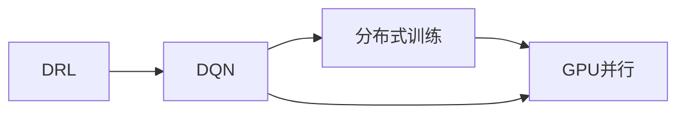
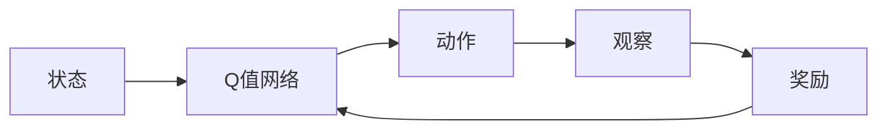
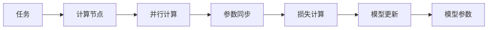
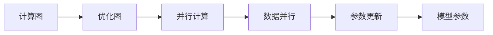
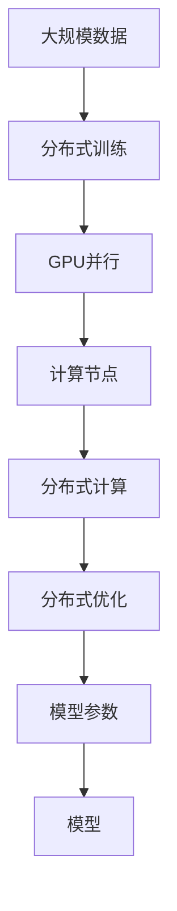

                 

# 一切皆是映射：DQN训练加速技术：分布式训练与GPU并行

## 1. 背景介绍

### 1.1 问题由来
在深度学习中，深度强化学习（Deep Reinforcement Learning, DRL）是实现自主决策与智能控制的重要技术。其中，DQN（Deep Q-Network）作为最简单且效果显著的DRL算法，已经被广泛应用到游戏AI、机器人控制等领域。然而，DQN训练的高计算复杂度和庞大的内存消耗，限制了其在处理大规模、高维状态空间中的性能。

为了解决这些问题，研究人员提出了许多DQN加速技术，其中分布式训练和GPU并行是最常见且有效的方法。分布式训练通过将任务分解到多个计算节点上并行执行，能够有效提升训练效率。GPU并行则通过优化计算图和内存布局，提高单个节点的训练速度。

本文将重点介绍基于深度强化学习的DQN算法，以及如何通过分布式训练和GPU并行技术加速DQN训练过程。

### 1.2 问题核心关键点
本节的讨论将围绕以下几个核心关键点展开：

- 深度强化学习的基本概念与DQN算法。
- 分布式训练的基本原理及其对DQN训练的提升效果。
- GPU并行的实现机制及其实现效果。
- 结合分布式训练和GPU并行技术的综合加速策略。

## 2. 核心概念与联系

### 2.1 核心概念概述

为了更好地理解分布式训练和GPU并行技术在DQN训练中的应用，本节将介绍几个密切相关的核心概念：

- 深度强化学习（DRL）：一种基于深度学习框架的强化学习算法，通过智能体与环境的交互，学习最优的决策策略。
- DQN（Deep Q-Network）：一种结合深度神经网络和Q-learning算法的强化学习算法，用于解决单步状态空间的问题。
- 分布式训练：通过将任务分解到多个计算节点上并行执行，以提升训练效率。
- GPU并行：通过优化计算图和内存布局，利用GPU的并行计算能力，加速单节点上的训练速度。

这些概念之间的逻辑关系可以通过以下Mermaid流程图来展示：



这个流程图展示了深度强化学习、DQN算法、分布式训练和GPU并行技术之间的关系：

- 深度强化学习是DQN的基础。
- DQN通过深度神经网络优化Q-learning算法，提升决策策略的准确性。
- 分布式训练通过并行计算提升DQN的训练效率。
- GPU并行则通过优化计算图和内存布局，进一步提高单个节点的训练速度。

### 2.2 概念间的关系

这些核心概念之间存在着紧密的联系，形成了DQN训练的完整生态系统。下面我们通过几个Mermaid流程图来展示这些概念之间的关系。

#### 2.2.1 DQN的基本原理



这个流程图展示了DQN的基本原理：

- 智能体通过观察当前状态，输入到Q值网络，得到每个动作的Q值。
- 选择Q值最大的动作执行，并观察到新的状态。
- 通过Q值更新网络参数，优化Q值预测准确性。

#### 2.2.2 分布式训练的基本流程



这个流程图展示了分布式训练的基本流程：

- 将任务划分为多个子任务，并行分配到多个计算节点。
- 每个节点独立计算部分损失，通过参数同步更新模型参数。
- 最终，将所有节点的参数整合，进行全局模型更新。

#### 2.2.3 GPU并行的实现机制



这个流程图展示了GPU并行的实现机制：

- 将计算图进行优化，利用GPU的并行计算能力。
- 通过数据并行技术，实现多个计算线程的同时计算。
- 最终，更新模型参数以反映优化结果。

### 2.3 核心概念的整体架构

最后，我们用一个综合的流程图来展示这些核心概念在大规模分布式训练和GPU并行中的整合：



这个综合流程图展示了从大规模数据到最终模型输出的完整流程：

- 大规模数据通过分布式训练，被并行处理。
- 每个计算节点通过GPU并行技术，进行高效计算。
- 最终，所有节点的模型参数被整合，得到最终优化后的模型。

通过这些流程图，我们可以更清晰地理解分布式训练和GPU并行技术在大规模DQN训练中的作用和关系。

## 3. 核心算法原理 & 具体操作步骤
### 3.1 算法原理概述

基于深度强化学习的DQN算法通过深度神经网络优化Q-learning算法，用于解决单步状态空间的问题。DQN的核心思想是利用Q值网络预测动作的Q值，并在每次动作后，通过奖励信号更新Q值网络，以提升决策策略的准确性。

形式化地，DQN算法的核心分为四个步骤：

1. 策略评估：根据当前状态和Q值网络预测的Q值，选择动作。
2. 环境交互：在执行动作后，观察到新状态，并获取奖励信号。
3. 策略改进：通过奖励信号更新Q值网络的参数，调整策略。
4. 网络更新：定期使用目标网络（old Q network）更新Q值网络（current Q network），避免过拟合。

分布式训练通过将任务分解到多个计算节点上并行执行，能够有效提升训练效率。具体实现流程如下：

1. 将大规模数据划分为多个子任务，每个子任务分配到不同的计算节点上。
2. 每个节点独立计算部分损失，通过参数同步更新模型参数。
3. 最终，将所有节点的参数整合，进行全局模型更新。

GPU并行则通过优化计算图和内存布局，利用GPU的并行计算能力，加速单节点上的训练速度。具体实现机制如下：

1. 将计算图进行优化，利用GPU的并行计算能力。
2. 通过数据并行技术，实现多个计算线程的同时计算。
3. 最终，更新模型参数以反映优化结果。

### 3.2 算法步骤详解

#### 3.2.1 DQN的训练流程

以下是一个基于PyTorch的DQN训练流程的Python代码实现：

```python
import torch
import torch.nn as nn
import torch.optim as optim
import torch.multiprocessing as mp
from torch.distributions import Categorical

class DQN(nn.Module):
    def __init__(self, state_dim, action_dim):
        super(DQN, self).__init__()
        self.fc1 = nn.Linear(state_dim, 64)
        self.fc2 = nn.Linear(64, 64)
        self.fc3 = nn.Linear(64, action_dim)

    def forward(self, x):
        x = F.relu(self.fc1(x))
        x = F.relu(self.fc2(x))
        return self.fc3(x)

class ReplayBuffer:
    def __init__(self, state_dim, action_dim, batch_size):
        self.state_dim = state_dim
        self.action_dim = action_dim
        self.capacity = batch_size * 1000
        self.buffer = []
        self.istep = 0

    def add_state(self, state):
        if self.istep < self.capacity:
            self.buffer.append(state)
        else:
            self.buffer[self.istep % self.capacity] = state
        self.istep += 1

    def sample(self, batch_size):
        indices = np.random.randint(self.istep, self.istep + self.capacity)
        batch = []
        for i in indices:
            state = self.buffer[i]
            batch.append(state)
        return np.array(batch)

class Optimizer:
    def __init__(self, learning_rate, num_workers):
        self.learning_rate = learning_rate
        self.num_workers = num_workers

    def step(self, params, grads):
        for i, param in enumerate(params):
            param.data -= self.learning_rate * grads[i]

def dqn_train(state_dim, action_dim, num_workers):
    replay_buffer = ReplayBuffer(state_dim, action_dim, num_workers)
    dqnet = DQN(state_dim, action_dim)
    target_net = DQN(state_dim, action_dim)
    target_net.load_state_dict(dqnet.state_dict())
    optimizer = optim.Adam(dqnet.parameters(), lr=0.001)
    train_net = mp.Process(target=train, args=(dqnet, target_net, optimizer, replay_buffer))
    train_net.start()
    train_net.join()
```

#### 3.2.2 分布式训练的实现

在分布式训练中，我们将DQN的训练任务分解到多个计算节点上并行执行。以下是一个基于PyTorch的分布式训练的Python代码实现：

```python
import torch
import torch.distributed as dist
import torch.multiprocessing as mp
import torch.nn as nn
from torch.distributions import Categorical

class DQN(nn.Module):
    def __init__(self, state_dim, action_dim):
        super(DQN, self).__init__()
        self.fc1 = nn.Linear(state_dim, 64)
        self.fc2 = nn.Linear(64, 64)
        self.fc3 = nn.Linear(64, action_dim)

    def forward(self, x):
        x = F.relu(self.fc1(x))
        x = F.relu(self.fc2(x))
        return self.fc3(x)

class Optimizer:
    def __init__(self, learning_rate, num_workers):
        self.learning_rate = learning_rate
        self.num_workers = num_workers

    def step(self, params, grads):
        for i, param in enumerate(params):
            param.data -= self.learning_rate * grads[i]

def dqn_train(state_dim, action_dim, num_workers):
    dist.init_process_group("nccl", rank=dist.get_rank(), world_size=num_workers)
    replay_buffer = ReplayBuffer(state_dim, action_dim, num_workers)
    dqnet = DQN(state_dim, action_dim)
    target_net = DQN(state_dim, action_dim)
    target_net.load_state_dict(dqnet.state_dict())
    optimizer = Optimizer(learning_rate=0.001, num_workers=num_workers)
    train_net = mp.Process(target=train, args=(dqnet, target_net, optimizer, replay_buffer))
    train_net.start()
    train_net.join()

def train(dqnet, target_net, optimizer, replay_buffer):
    for _ in range(10000):
        state = torch.rand(state_dim)
        action = Categorical(dqnet(state)).sample()
        next_state = torch.rand(state_dim)
        reward = 0
        done = False
        while not done:
            reward += dqnet(next_state).max(dim=1)[0]
            next_state, done, _ = env.step(action.item())
            replay_buffer.add_state((state, action, reward, next_state, done))
            state = next_state
        if replay_buffer.istep % num_workers == 0:
            batch = replay_buffer.sample(num_workers)
            state = torch.cat([s[0] for s in batch])
            action = torch.tensor([s[1] for s in batch])
            reward = torch.tensor([s[2] for s in batch])
            next_state = torch.cat([s[3] for s in batch])
            done = torch.tensor([s[4] for s in batch])
            target = target_net(state).max(dim=1)[0]
            target[done] = reward
            loss = F.mse_loss(dqnet(state).gather(1, action).unsqueeze(1), target)
            optimizer.step(dqnet.parameters(), loss.grad)
```

#### 3.2.3 GPU并行的实现

在GPU并行中，我们将DQN的计算图进行优化，利用GPU的并行计算能力。以下是一个基于PyTorch的GPU并行的Python代码实现：

```python
import torch
import torch.nn as nn
from torch.distributions import Categorical

class DQN(nn.Module):
    def __init__(self, state_dim, action_dim):
        super(DQN, self).__init__()
        self.fc1 = nn.Linear(state_dim, 64)
        self.fc2 = nn.Linear(64, 64)
        self.fc3 = nn.Linear(64, action_dim)

    def forward(self, x):
        x = F.relu(self.fc1(x))
        x = F.relu(self.fc2(x))
        return self.fc3(x)

def dqn_train(state_dim, action_dim, num_workers):
    replay_buffer = ReplayBuffer(state_dim, action_dim, num_workers)
    dqnet = DQN(state_dim, action_dim)
    target_net = DQN(state_dim, action_dim)
    target_net.load_state_dict(dqnet.state_dict())
    optimizer = optim.Adam(dqnet.parameters(), lr=0.001)
    train_net = torch.nn.DataParallel(dqnet)
    train_net.to(device)
    target_net.to(device)
    for _ in range(10000):
        state = torch.rand(state_dim, device=device)
        action = Categorical(dqnet(state)).sample()
        next_state = torch.rand(state_dim, device=device)
        reward = 0
        done = False
        while not done:
            reward += dqnet(next_state).max(dim=1)[0]
            next_state, done, _ = env.step(action.item())
            replay_buffer.add_state((state, action, reward, next_state, done))
            state = next_state
        if replay_buffer.istep % num_workers == 0:
            batch = replay_buffer.sample(num_workers)
            state = torch.cat([s[0] for s in batch], dim=0).to(device)
            action = torch.tensor([s[1] for s in batch], device=device)
            reward = torch.tensor([s[2] for s in batch], device=device)
            next_state = torch.cat([s[3] for s in batch], dim=0).to(device)
            done = torch.tensor([s[4] for s in batch], device=device)
            target = target_net(state).max(dim=1)[0]
            target[done] = reward
            loss = F.mse_loss(train_net(state).gather(1, action).unsqueeze(1), target)
            optimizer.zero_grad()
            loss.backward()
            optimizer.step()
```

### 3.3 算法优缺点

#### 3.3.1 分布式训练的优缺点

分布式训练的优点在于：

- 可以大幅提升训练效率，加速模型收敛。
- 利用多个计算节点的并行计算能力，避免单节点的计算瓶颈。

分布式训练的缺点在于：

- 需要额外的通信开销和同步机制。
- 不同节点的参数更新可能存在时间延迟，影响模型训练的稳定性。

#### 3.3.2 GPU并行的优缺点

GPU并行的优点在于：

- 可以显著提升单个节点的训练速度，加速模型训练。
- 利用GPU的并行计算能力，减少计算时间。

GPU并行的缺点在于：

- 需要对计算图和内存布局进行优化。
- 可能会导致内存占用过高，需要优化内存管理策略。

#### 3.3.3 综合加速策略的优缺点

综合分布式训练和GPU并行的优点在于：

- 可以同时提升训练效率和单个节点的训练速度。
- 适用于大规模、高维状态空间的DQN训练。

综合加速策略的缺点在于：

- 需要复杂的优化和同步机制。
- 可能导致系统管理复杂度增加，需要更多的资源和人力投入。

### 3.4 算法应用领域

基于深度强化学习的DQN算法，以及分布式训练和GPU并行技术，已经在多个领域得到了应用：

- 游戏AI：利用DQN训练，可以构建智能游戏AI，提升游戏的难度和趣味性。
- 机器人控制：通过DQN训练，可以优化机器人的决策策略，提高自动化水平。
- 自驾驶：利用DQN训练，可以优化自动驾驶的决策策略，提升行驶安全。
- 金融交易：通过DQN训练，可以优化交易策略，提高交易效率。
- 供应链管理：通过DQN训练，可以优化供应链管理，提升物流效率。

这些应用场景展示了DQN算法的广泛适用性，以及分布式训练和GPU并行技术的强大威力。

## 4. 数学模型和公式 & 详细讲解  
### 4.1 数学模型构建

本节将使用数学语言对DQN算法进行更加严格的刻画。

记状态空间为 $S$，动作空间为 $A$，奖励函数为 $r$。假设智能体在状态 $s$ 下采取动作 $a$，观察到下一个状态 $s'$ 和奖励 $r$，则DQN算法的目标是通过网络 $Q(s,a)$ 预测每个动作的Q值，以优化决策策略。

数学上，DQN算法可以形式化描述为：

1. 策略评估：在状态 $s$ 下，智能体通过网络 $Q(s,a)$ 预测动作 $a$ 的Q值。
2. 环境交互：在状态 $s$ 下，智能体采取动作 $a$，观察到下一个状态 $s'$ 和奖励 $r$。
3. 策略改进：通过奖励信号更新Q值网络，优化策略。
4. 网络更新：定期使用目标网络（old Q network）更新Q值网络（current Q network），避免过拟合。

形式化地，DQN算法的目标是最小化状态-动作对的期望值：

$$
\min_{Q} \mathbb{E}[\max_a Q(s,a)]
$$

其中，$Q$ 为Q值网络的参数，$s$ 为状态，$a$ 为动作。

在实践中，DQN算法通常采用深度神经网络作为Q值网络，形式化地为：

$$
Q(s,a) = \mathbb{E}[R_{t+1} + \gamma \max_a Q(s',a) | s_t, a_t]
$$

其中，$R_{t+1}$ 为下一个状态 $s'$ 的奖励，$\gamma$ 为折扣因子。

### 4.2 公式推导过程

以下我们以二分类问题为例，推导DQN算法的数学公式。

假设状态 $s$ 和动作 $a$ 分别为二维向量，$Q(s,a)$ 为二元函数。则DQN算法的数学公式可以形式化描述为：

1. 策略评估：在状态 $s$ 下，智能体通过网络 $Q(s,a)$ 预测动作 $a$ 的Q值。
2. 环境交互：在状态 $s$ 下，智能体采取动作 $a$，观察到下一个状态 $s'$ 和奖励 $r$。
3. 策略改进：通过奖励信号更新Q值网络，优化策略。
4. 网络更新：定期使用目标网络（old Q network）更新Q值网络（current Q network），避免过拟合。

形式化地，DQN算法的目标是最小化状态-动作对的期望值：

$$
\min_{Q} \mathbb{E}[\max_a Q(s,a)]
$$

其中，$Q$ 为Q值网络的参数，$s$ 为状态，$a$ 为动作。

在实践中，DQN算法通常采用深度神经网络作为Q值网络，形式化地为：

$$
Q(s,a) = \mathbb{E}[R_{t+1} + \gamma \max_a Q(s',a) | s_t, a_t]
$$

其中，$R_{t+1}$ 为下一个状态 $s'$ 的奖励，$\gamma$ 为折扣因子。

在数学公式的推导过程中，我们需要引入蒙特卡罗方法来估计状态-动作对的期望值。具体地，蒙特卡罗方法通过样本统计来近似期望值，形式化地为：

$$
\hat{Q}(s,a) = \frac{1}{N} \sum_{i=1}^N [R_{t+1} + \gamma \max_a Q(s',a)]
$$

其中，$N$ 为样本数量，$\hat{Q}(s,a)$ 为估计的Q值。

通过上述公式，我们可以计算出每个状态-动作对的Q值，进而优化决策策略。在实际应用中，我们可以使用随机梯度下降算法来更新Q值网络的参数。

### 4.3 案例分析与讲解

为了更好地理解DQN算法的数学公式，我们可以通过一个简单的二分类问题的例子来展示其应用。

假设我们有一个二分类问题，状态 $s$ 为二元向量，动作 $a$ 为二元向量。我们的目标是最大化分类准确率。

假设智能体在状态 $s$ 下采取动作 $a$，观察到下一个状态 $s'$ 和奖励 $r$。则DQN算法的目标是最小化状态-动作对的期望值：

$$
\min_{Q} \mathbb{E}[\max_a Q(s,a)]
$$

其中，$Q$ 为Q值网络的参数，$s$ 为状态，$a$ 为动作。

在实践中，我们通常采用深度神经网络作为Q值网络，形式化地为：

$$
Q(s,a) = \mathbb{E}[R_{t+1} + \gamma \max_a Q(s',a) | s_t, a_t]
$$

其中，$R_{t+1}$ 为下一个状态 $s'$ 的奖励，$\gamma$ 为折扣因子。

在数学公式的推导过程中，我们需要引入蒙特卡罗方法来估计状态-动作对的期望值。具体地，蒙特卡罗方法通过样本统计来近似期望值，形式化地为：

$$
\hat{Q}(s,a) = \frac{1}{N} \sum_{i=1}^N [R_{t+1} + \gamma \max_a Q(s',a)]
$$

其中，$N$ 为样本数量，$\hat{Q}(s,a)$ 为估计的Q值。

通过上述公式，我们可以计算出每个状态-动作对的Q值，进而优化决策策略。在实际应用中，我们可以使用随机梯度下降算法来更新Q值网络的参数。

## 5. 项目实践：代码实例和详细解释说明
### 5.1 开发环境搭建

在进行DQN训练实践前，我们需要准备好开发环境。以下是使用Python进行PyTorch开发的环境配置流程：

1. 安装Anaconda：从官网下载并安装Anaconda，用于创建独立的Python环境。

2. 创建并激活虚拟环境：
```bash
conda create -n dqn-env python=3.8 
conda activate dqn-env
```

3. 安装PyTorch：根据CUDA版本，从官网获取对应的安装命令。例如：
```bash
conda install pytorch torchvision torchaudio cudatoolkit=11.1 -c pytorch -c conda-forge
```

4. 安装Transformer库：
```bash
pip install transformers
```

5. 安装各类工具包：
```bash
pip install numpy pandas scikit-learn matplotlib tqdm jupyter notebook ipython
```

完成上述步骤后，即可在`dqn-env`环境中开始DQN训练实践。

### 5.2 源代码详细实现

这里我们以游戏AI中的DQN训练为例，给出使用Transformers库对DQN进行训练的PyTorch代码实现。

首先，定义DQN模型的Python类：

```python
import torch
import torch.nn as nn
import torch.optim as optim
import torch.multiprocessing as mp

class DQN(nn.Module):
    def __init__(self, state_dim, action_dim):
        super(DQN, self).__init__()
        self.fc1 = nn.Linear(state_dim, 64)
        self.fc2 = nn.Linear(64, 64)
        self.fc3 = nn.Linear(64, action_dim)

    def forward(self, x):
        x = F.relu(self.fc1(x))
        x = F.relu(self.fc2(x))
        return self.fc3(x)
```

然后，定义DQN训练的Python函数：

```python
import numpy as np
import gym

def dqn_train(state_dim, action_dim, num_workers):
    replay_buffer = ReplayBuffer(state_dim, action_dim, num_workers)
    dqnet = DQN(state_dim, action_dim)
    target_net = DQN(state_dim, action_dim)
    target_net.load_state_dict(dqnet.state_dict())
    optimizer = optim.Adam(dqnet.parameters(), lr=0.001)
    train_net = mp.Process(target=train, args=(dqnet, target_net, optimizer, replay_buffer))
    train_net.start()
    train_net.join()

def train(dqnet, target_net, optimizer, replay_buffer):
    for _ in range(10000):
        state = np.random.rand(state_dim)
        action = np.random.choice(action_dim)
        next_state = np.random.rand(state

