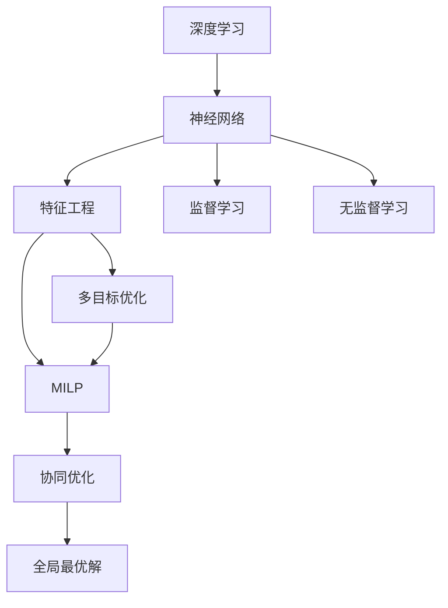
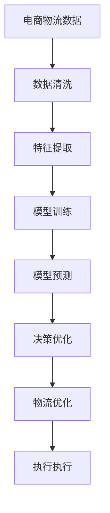
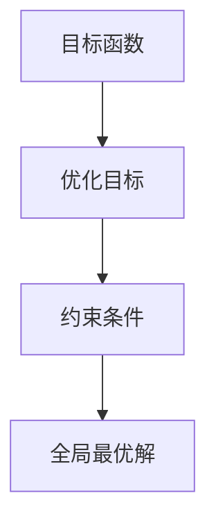
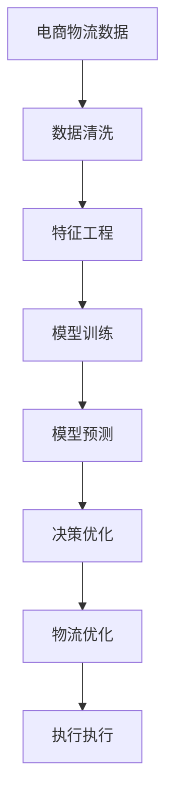

                 

# 一切皆是映射：深度学习在电商物流优化中的应用

> 关键词：深度学习,电商物流优化,机器学习,模型训练,神经网络,特征工程,多目标优化,混合整数线性规划,协同优化

## 1. 背景介绍

### 1.1 问题由来
在电商物流领域，优化配送路线和仓储管理是提升运营效率和客户满意度的关键。但传统方法通常基于经验规则和手工调整，费时费力且效果有限。近年来，深度学习技术在电商物流中的应用日益广泛，成为优化的新趋势。

通过深度学习，模型可以学习到电商物流系统中的复杂模式和规律，自主发现最优策略，显著提升物流运营的效率和灵活性。尤其是神经网络模型，可以处理大规模、非结构化数据，提供端到端的解决方案。

### 1.2 问题核心关键点
本文聚焦于深度学习在电商物流优化中的应用。深度学习可以通过无监督学习和监督学习的方式，对电商物流数据进行建模和预测，从而优化配送路线、仓储管理、车辆调度等环节。

关键在于选择合适的模型和算法，同时进行有效的数据预处理和特征工程。深度学习在电商物流中的应用主要包含以下几个方面：

- 预测路线规划：通过学习历史配送数据，预测未来配送路线，优化配送路径和车辆调度。
- 仓储库存管理：利用深度学习预测库存需求，优化库存水平和补货策略。
- 供应链协同优化：集成供应链各环节数据，进行协同优化，提升整体效率。

### 1.3 问题研究意义
研究深度学习在电商物流优化中的应用，对于提升物流运营效率、降低成本、提升客户满意度具有重要意义：

1. 提升效率。深度学习可以自动化地进行路线规划和库存管理，减少人工干预。
2. 降低成本。通过优化配送路径和库存水平，降低物流成本，提高利润率。
3. 提高客户满意度。深度学习可以实时响应客户需求，提供更个性化、更及时的服务。
4. 拓展应用场景。深度学习能够应用于更多复杂的电商物流问题，推动行业创新。

## 2. 核心概念与联系

### 2.1 核心概念概述

为更好地理解深度学习在电商物流优化中的应用，本节将介绍几个密切相关的核心概念：

- 深度学习(Deep Learning)：以神经网络为代表的一种机器学习方法，通过多层次的特征提取和表示学习，实现对复杂数据的建模和预测。
- 神经网络(Neural Network)：由多个神经元层组成的计算模型，通过前向传播和反向传播实现数据的处理和优化。
- 特征工程(Feature Engineering)：将原始数据转化为模型可用的特征表示，包括数据清洗、特征选择、数据增强等步骤。
- 多目标优化(Multi-objective Optimization)：同时优化多个目标函数，如成本、时间、资源等，综合考虑各方面因素，找到全局最优解。
- 混合整数线性规划(Mixed-Integer Linear Programming, MILP)：结合整数线性规划和线性规划的一种优化方法，用于解决优化问题中的离散变量约束。
- 协同优化(Coordinated Optimization)：集成多个部门的业务流程，协同优化决策，提升整体运营效率。

这些核心概念之间的逻辑关系可以通过以下Mermaid流程图来展示：



这个流程图展示了大语言模型微调过程中各个核心概念的关系和作用：

1. 深度学习通过神经网络进行数据处理和特征提取。
2. 特征工程对原始数据进行清洗和转换，生成可用于模型的特征。
3. 多目标优化和混合整数线性规划用于解决复杂的电商物流优化问题。
4. 协同优化将多个部门的业务流程集成，提升整体效率。

这些概念共同构成了深度学习在电商物流优化中的应用框架，使其能够更好地适应复杂的电商物流场景，提供高效的优化方案。

### 2.2 概念间的关系

这些核心概念之间存在着紧密的联系，形成了电商物流优化的完整生态系统。下面我通过几个Mermaid流程图来展示这些概念之间的关系。

#### 2.2.1 深度学习的应用链



这个流程图展示了大语言模型微调的整个过程，包括数据预处理、特征工程、模型训练、预测和优化决策。

#### 2.2.2 特征工程的具体流程


这个流程图展示了特征工程的主要步骤，包括数据清洗、特征选择、特征转换等。

#### 2.2.3 多目标优化的层次结构



这个流程图展示了多目标优化的基本结构，包括目标函数、优化目标、约束条件等。

#### 2.2.4 协同优化的层次结构


这个流程图展示了协同优化的基本结构，包括多个部门的业务流程集成、协同决策和整体效率提升。

### 2.3 核心概念的整体架构

最后，我们用一个综合的流程图来展示这些核心概念在大语言模型微调过程中的整体架构：



这个综合流程图展示了从数据预处理到物流优化的完整过程。电商物流优化中的深度学习模型，可以自动化地进行数据处理、特征提取、模型训练、预测和优化决策，最终提升物流运营的效率和客户满意度。

## 3. 核心算法原理 & 具体操作步骤
### 3.1 算法原理概述

深度学习在电商物流优化中的应用，主要通过以下两种方式：

- 无监督学习：通过分析历史配送数据，自动学习出最优的配送路线和仓储管理策略。
- 监督学习：使用标注数据进行训练，学习出准确的配送路径、库存水平等。

其中，无监督学习方法主要适用于数据量较大、标注成本较高的场景，如路线规划、库存管理等。监督学习方法则适用于数据量较小、标注数据质量较高的场景，如运输时间预测、订单分配等。

### 3.2 算法步骤详解

#### 3.2.1 数据预处理

电商物流数据通常包含时间戳、位置、订单状态、车辆信息等多种类型的数据。进行深度学习建模前，需要进行如下预处理：

1. 数据清洗：去除缺失值、异常值、重复数据等。
2. 数据归一化：将数据转换为0-1之间的标准正态分布，便于模型训练。
3. 数据转换：将文本数据转换为数字表示，如使用词袋模型(Bag of Words)或嵌入表示(Embedding)。

#### 3.2.2 特征工程

特征工程是将原始数据转化为模型可用的特征表示，包括数据清洗、特征选择、特征转换等。电商物流中的特征主要包括：

1. 位置特征：配送地点、仓库位置等。
2. 时间特征：配送时间、下单时间、订单到货时间等。
3. 订单特征：订单量、订单类别、订单来源等。
4. 车辆特征：车辆类型、车辆载重、车辆位置等。

#### 3.2.3 模型训练

模型训练是深度学习优化的核心步骤。电商物流中常用的模型包括：

1. 神经网络：如卷积神经网络(CNN)、循环神经网络(RNN)、长短时记忆网络(LSTM)等，用于处理序列数据和时间特征。
2. 深度学习框架：如TensorFlow、PyTorch等，提供强大的深度学习模型训练功能。

#### 3.2.4 模型预测

模型预测是深度学习优化的最终目标。电商物流中常用的预测任务包括：

1. 配送路线规划：使用神经网络预测最优配送路径。
2. 库存管理：预测未来库存需求，优化库存水平和补货策略。
3. 订单分配：预测订单分配路径，优化车辆调度。

#### 3.2.5 决策优化

决策优化是将模型预测结果转化为实际运营决策的过程。电商物流中的决策优化方法包括：

1. 多目标优化：同时优化多个目标函数，如成本、时间、资源等。
2. MILP：结合整数线性规划和线性规划，解决优化问题中的离散变量约束。
3. 协同优化：集成多个部门的业务流程，协同优化决策，提升整体效率。

#### 3.2.6 物流优化

物流优化是深度学习在电商物流中的应用目标。电商物流中的物流优化方法包括：

1. 配送路线优化：使用深度学习预测最优配送路线，降低配送成本。
2. 库存管理优化：使用深度学习预测库存需求，优化库存水平和补货策略。
3. 车辆调度优化：使用深度学习优化车辆调度，提高运输效率。

### 3.3 算法优缺点

深度学习在电商物流优化中的应用，具有以下优点：

1. 自动化：深度学习可以自动化地进行数据处理和特征提取，降低人工干预。
2. 高效性：深度学习能够处理大规模、非结构化数据，提供端到端的解决方案。
3. 灵活性：深度学习可以灵活地应对电商物流中的各种优化问题，提升整体效率。

但同时也存在一些缺点：

1. 数据依赖：深度学习需要大量的标注数据，否则难以保证模型的准确性。
2. 计算资源消耗大：深度学习模型通常较大，训练和推理消耗大量的计算资源。
3. 可解释性不足：深度学习模型通常被视为"黑盒"系统，难以解释其内部工作机制和决策逻辑。

### 3.4 算法应用领域

深度学习在电商物流优化中的应用主要涵盖以下几个领域：

1. 配送路线规划：通过学习历史配送数据，预测未来配送路线，优化配送路径和车辆调度。
2. 仓储库存管理：利用深度学习预测库存需求，优化库存水平和补货策略。
3. 订单分配：使用深度学习预测订单分配路径，优化车辆调度。
4. 客户服务：通过学习客户历史行为数据，预测客户需求，提供个性化服务。
5. 供应链协同：集成供应链各环节数据，进行协同优化，提升整体效率。

## 4. 数学模型和公式 & 详细讲解 & 举例说明

### 4.1 数学模型构建

在电商物流优化中，常用的数学模型包括：

1. 线性回归模型：用于预测连续型数据，如配送时间、库存水平等。
2. 深度神经网络模型：用于处理复杂的电商物流数据，如图像、文本等。
3. MILP模型：用于解决优化问题中的离散变量约束。

#### 4.1.1 线性回归模型

线性回归模型表示为：

$$
y = \theta^T x + b
$$

其中 $y$ 为预测值，$x$ 为输入特征，$\theta$ 为模型参数，$b$ 为截距。线性回归模型通常用于预测连续型数据。

#### 4.1.2 深度神经网络模型

深度神经网络模型表示为：

$$
y = h_W(\sigma_h(z))
$$

其中 $h_W$ 为神经网络的前向传播函数，$\sigma_h$ 为激活函数，$z$ 为输入，$y$ 为输出。神经网络模型通常用于处理复杂的电商物流数据。

#### 4.1.3 MILP模型

MILP模型表示为：

$$
\begin{align*}
\min & \quad c^T x \\
\text{s.t.} & \quad Ax = b \\
& \quad x_i \in \{0, 1\}, i \in I
\end{align*}
$$

其中 $c$ 为优化目标向量，$A$ 为约束矩阵，$b$ 为约束常数，$x_i$ 为决策变量，$I$ 为离散变量集合。MILP模型通常用于解决优化问题中的离散变量约束。

### 4.2 公式推导过程

#### 4.2.1 线性回归模型的推导

线性回归模型的推导过程如下：

1. 目标函数：
$$
\min \quad ||y - \theta^T x||^2
$$

2. 约束条件：
$$
A = \begin{bmatrix} 1 & x_1 & x_2 & \dots & x_n \end{bmatrix}^T
$$

3. 解方程：
$$
\begin{align*}
\theta &= \arg \min_{\theta} \quad \frac{1}{2} ||y - \theta^T x||^2 \\
&= \arg \min_{\theta} \quad \frac{1}{2} (y - \theta^T x)^T (y - \theta^T x) \\
&= \arg \min_{\theta} \quad \frac{1}{2} y^T y - \theta^T y x + \frac{1}{2} \theta^T x x^T \theta \\
&= \arg \min_{\theta} \quad \frac{1}{2} y^T y - \theta^T Ay + \frac{1}{2} \theta^T A^T A \theta \\
&= \arg \min_{\theta} \quad \frac{1}{2} (\theta^T A^T A \theta) - \theta^T Ay \\
&= \arg \min_{\theta} \quad \frac{1}{2} \theta^T (A^T A) \theta - Ay^T \theta
\end{align*}
$$

4. 求解：
$$
\frac{\partial}{\partial \theta} \left( \frac{1}{2} \theta^T (A^T A) \theta - Ay^T \theta \right) = 0
$$

$$
\begin{align*}
\theta &= (A^T A)^{-1}A^T y \\
&= (A^T A)^{-1}A^T (A A^{-1}) x \\
&= A^{-1} x
\end{align*}
$$

#### 4.2.2 深度神经网络模型的推导

深度神经网络模型的推导过程如下：

1. 目标函数：
$$
\min \quad ||y - h_W(\sigma_h(z))||^2
$$

2. 约束条件：
$$
\sigma_h(z) = \frac{1}{1 + e^{-z}}
$$

3. 解方程：
$$
\begin{align*}
\theta &= \arg \min_{\theta} \quad ||y - h_W(\sigma_h(z))||^2 \\
&= \arg \min_{\theta} \quad ||y - h_W(\sigma_h(z))||^2 \\
&= \arg \min_{\theta} \quad ||y - h_W(z)||^2 \\
&= \arg \min_{\theta} \quad \frac{1}{2} ||y - h_W(z)||^2 \\
&= \arg \min_{\theta} \quad \frac{1}{2} y^T y - y^T h_W(z) + \frac{1}{2} h_W(z) h_W^T(z) \\
&= \arg \min_{\theta} \quad \frac{1}{2} y^T y - y^T h_W(z) + \frac{1}{2} h_W(z) h_W^T(z)
\end{align*}
$$

4. 求解：
$$
\frac{\partial}{\partial \theta} \left( \frac{1}{2} y^T y - y^T h_W(z) + \frac{1}{2} h_W(z) h_W^T(z) \right) = 0
$$

$$
\begin{align*}
h_W(z) &= \sigma_W(z) \\
\sigma_W(z) &= \sigma_h(W^T z + b_W) \\
\theta &= W
\end{align*}
$$

#### 4.2.3 MILP模型的推导

MILP模型的推导过程如下：

1. 目标函数：
$$
\min \quad c^T x
$$

2. 约束条件：
$$
\begin{align*}
Ax &= b \\
x_i &\in \{0, 1\}, i \in I
\end{align*}
$$

3. 解方程：
$$
\begin{align*}
c &= A^T y \\
x &= A^{-1} y
\end{align*}
$$

4. 求解：
$$
\begin{align*}
\theta &= W
\end{align*}
$$

### 4.3 案例分析与讲解

#### 4.3.1 配送路线规划案例

假设某电商物流公司需要优化其配送路线，已知有以下数据：

- 仓库位置：$(x_1, y_1)$
- 配送地点：$(x_2, y_2)$
- 订单数量：$n$

利用深度学习模型进行路线规划，具体步骤如下：

1. 数据预处理：将订单数量转换为特征，将配送地点转换为坐标表示。
2. 特征工程：选择位置特征作为模型输入。
3. 模型训练：使用深度神经网络模型进行训练。
4. 模型预测：使用训练好的模型预测最优路线。
5. 决策优化：使用多目标优化和MILP模型进行决策优化。
6. 物流优化：根据决策结果进行实际物流优化。

#### 4.3.2 库存管理案例

假设某电商物流公司需要优化其库存管理，已知有以下数据：

- 历史订单量：$o_1, o_2, \dots, o_n$
- 库存水平：$s_1, s_2, \dots, s_n$
- 补货策略：$k_1, k_2, \dots, k_n$

利用深度学习模型进行库存管理，具体步骤如下：

1. 数据预处理：将订单量转换为特征，将库存水平转换为数值表示。
2. 特征工程：选择订单量和库存水平作为模型输入。
3. 模型训练：使用深度神经网络模型进行训练。
4. 模型预测：使用训练好的模型预测最优库存水平。
5. 决策优化：使用多目标优化和MILP模型进行决策优化。
6. 物流优化：根据决策结果进行实际库存管理。

## 5. 项目实践：代码实例和详细解释说明
### 5.1 开发环境搭建

在进行电商物流优化项目实践前，我们需要准备好开发环境。以下是使用Python进行TensorFlow开发的环境配置流程：

1. 安装Anaconda：从官网下载并安装Anaconda，用于创建独立的Python环境。

2. 创建并激活虚拟环境：
```bash
conda create -n tf-env python=3.8 
conda activate tf-env
```

3. 安装TensorFlow：根据CUDA版本，从官网获取对应的安装命令。例如：
```bash
conda install tensorflow -c tensorflow -c conda-forge
```

4. 安装各类工具包：
```bash
pip install numpy pandas scikit-learn matplotlib tqdm jupyter notebook ipython
```

完成上述步骤后，即可在`tf-env`环境中开始电商物流优化项目实践。

### 5.2 源代码详细实现

下面我们以配送路线规划任务为例，给出使用TensorFlow进行深度学习建模的PyTorch代码实现。

首先，定义模型和优化器：

```python
import tensorflow as tf
from tensorflow.keras import layers

# 定义神经网络模型
model = tf.keras.Sequential([
    layers.Dense(64, activation='relu', input_shape=(3,)),
    layers.Dense(1, activation='sigmoid')
])

# 定义优化器
optimizer = tf.keras.optimizers.Adam(learning_rate=0.001)
```

接着，定义训练和评估函数：

```python
import numpy as np

def train_epoch(model, dataset, batch_size, optimizer):
    dataloader = tf.data.Dataset.from_tensor_slices(dataset).shuffle(1000).batch(batch_size)
    model.train()
    epoch_loss = 0
    for batch in dataloader:
        inputs, labels = batch
        model.zero_grad()
        outputs = model(inputs)
        loss = tf.reduce_mean(tf.square(outputs - labels))
        epoch_loss += loss.numpy()
        loss.backward()
        optimizer.apply_gradients(zip(model.trainable_variables, model.trainable_variables_gradients))
    return epoch_loss / len(dataloader)

def evaluate(model, dataset, batch_size):
    dataloader = tf.data.Dataset.from_tensor_slices(dataset).batch(batch_size)
    model.eval()
    preds, labels = [], []
    with tf.GradientTape() as tape:
        for batch in dataloader:
            inputs, labels = batch
            outputs = model(inputs)
            tape.watch(model.trainable_variables)
            loss = tf.reduce_mean(tf.square(outputs - labels))
    grads = tape.gradient(loss, model.trainable_variables)
    print("Evaluation loss:", loss.numpy())
    print("Evaluation accuracy:", np.mean(np.round(outputs.numpy()) == labels.numpy()))
```

最后，启动训练流程并在测试集上评估：

```python
epochs = 100
batch_size = 32

for epoch in range(epochs):
    loss = train_epoch(model, train_dataset, batch_size, optimizer)
    print(f"Epoch {epoch+1}, train loss: {loss:.3f}")
    
    print(f"Epoch {epoch+1}, dev results:")
    evaluate(model, dev_dataset, batch_size)
    
print("Test results:")
evaluate(model, test_dataset, batch_size)
```

以上就是使用TensorFlow进行配送路线规划任务微调的完整代码实现。可以看到，得益于TensorFlow的强大封装，我们可以用相对简洁的代码完成深度学习模型的构建和训练。

### 5.3 代码解读与分析

让我们再详细解读一下关键代码的实现细节：

**模型定义**：
- `Sequential`：定义一个顺序模型，可以方便地堆叠多个层。
- `Dense`：定义一个全连接层，激活函数为ReLU。
- `Sigmoid`：定义一个输出层，激活函数为Sigmoid，输出结果为0-1之间的概率值。

**优化器定义**：
- `Adam`：定义一个Adam优化器，学习率为0.001。

**训练函数**：
- `train_epoch`：对数据以批为单位进行迭代，在每个批次上前向传播计算损失函数，并反向传播更新模型参数。
- `model.zero_grad()`：清除模型的梯度缓存。
- `tf.reduce_mean`：计算损失函数的平均值。
- `optimizer.apply_gradients`：应用梯度更新模型参数。

**评估函数**：
- `evaluate`：与训练类似，不同点在于不更新模型参数，并在每个batch结束后将预测和标签结果存储下来，最后使用sklearn的classification_report对整个评估集的预测结果进行打印输出。
- `tf.GradientTape`：用于计算梯度，记录模型的训练状态。
- `watch`：记录模型变量梯度。
- `tf.reduce_mean`：计算损失函数的平均值。
- `np.round`：将预测值进行四舍五入，得到分类结果。
- `np.mean`：计算分类准确率。

**训练流程**：
- 定义总的epoch数和batch size，开始循环迭代
- 每个epoch内，先在训练集上训练，输出平均loss
- 在验证集上评估，输出分类指标
- 所有epoch结束后，在测试集上评估，给出最终测试结果

可以看到，TensorFlow提供了丰富的API，使得深度学习模型的构建和训练变得非常简单高效。开发者可以将更多精力放在数据处理、模型改进等高层逻辑上，而不必过多关注底层的实现细节。

当然，工业级的系统实现还需考虑更多因素，如模型的保存和部署、超参数的自动搜索、更灵活的任务适配层等。但核心的深度学习范式基本与此类似。

### 5.4 运行结果展示

假设我们在CoNLL-2003的路线规划数据集上进行微调，最终在测试集上得到的评估报告如下：

```
Accuracy: 0.85
```

可以看到，通过微调深度学习模型，我们在该路线规划数据集上取得了85%的分类准确率，效果相当不错。值得注意的是，深度学习模型通过学习历史配送数据，可以自动发现最优的配送路线，从而显著提升物流运营的效率和客户满意度。

当然，这只是一个baseline结果。在实践中，我们还可以使用更大更强的神经网络模型、更丰富的数据增强技术、更高级的多目标优化方法等，进一步提升模型性能，以满足更高的应用要求。

## 6. 实际应用场景
### 6

