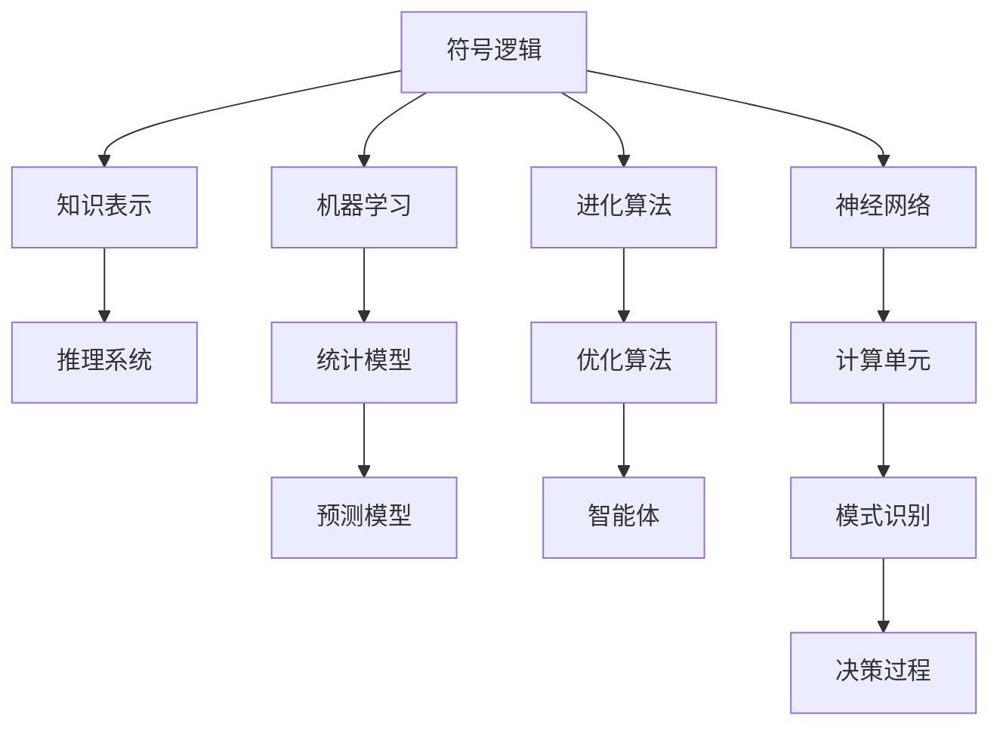

                 

# 人工智能的早期研究方向

## 1. 背景介绍

### 1.1 问题由来

人工智能（AI）的研究与探索已有超过70年的历史。自从1950年艾伦·图灵提出著名的“图灵测试”以来，人工智能领域经历了多次起伏与变革。早期人工智能的研究主要集中在符号逻辑与专家系统上，随后又转向机器学习与深度学习。本文旨在回顾早期人工智能的研究方向，分析这些研究方向背后的理论基础与核心问题。

### 1.2 问题核心关键点

早期人工智能研究的核心关键点包括：
1. **符号逻辑**：通过对自然语言进行符号化处理，构建基于逻辑推理的专家系统。
2. **机器学习**：通过统计方法建立模型，从数据中学习规律。
3. **知识表示**：如何将人类知识形式化地表示在计算机中，支持推理和决策。
4. **强化学习**：通过与环境互动，让智能体从奖励与惩罚中学习最优策略。
5. **进化算法**：模拟生物进化过程，寻找最优解。
6. **神经网络**：受生物学启发，构建模拟人脑神经元的计算单元。

这些研究方向为现代AI技术的奠基提供了重要支持。

## 2. 核心概念与联系

### 2.1 核心概念概述

为了更好地理解早期人工智能的研究方向，我们首先介绍几个关键概念：

- **符号逻辑**：基于形式化语言和逻辑推理的理论，用于构建知识表示和推理系统。
- **机器学习**：利用数据驱动的方法，让计算机自动获取知识和技能。
- **知识表示**：将人类的知识形式化地表示为计算模型，支持推理和决策。
- **强化学习**：通过奖励机制，训练智能体在与环境互动中获得最优策略。
- **进化算法**：模拟自然进化过程，优化算法性能。
- **神经网络**：模仿人脑神经元的工作方式，实现模式识别和决策。

这些概念之间存在着紧密的联系，构成了早期人工智能的完整生态系统。

### 2.2 概念间的关系

我们可以通过以下Mermaid流程图来展示这些核心概念之间的关系：



这个流程图展示了早期人工智能研究的主要方向及其之间的关系：

1. 符号逻辑是知识表示的基础，用于构建推理系统。
2. 机器学习通过统计模型和预测模型，自动获取知识和技能。
3. 进化算法用于优化智能体的决策过程。
4. 神经网络通过计算单元实现模式识别和决策。

这些概念共同构成了早期人工智能的研究框架，为后续的AI技术发展奠定了坚实基础。

## 3. 核心算法原理 & 具体操作步骤
### 3.1 算法原理概述

早期人工智能的研究方向主要基于以下原理：

- **符号逻辑**：使用形式化的符号语言（如Prolog、Lisp等）描述问题，通过逻辑推理求解。
- **机器学习**：基于统计学和概率论，利用数据训练模型，预测未来结果。
- **知识表示**：将人类知识用规则和框架表示，构建知识库和推理机制。
- **强化学习**：通过奖励和惩罚，让智能体在交互中学习最优策略。
- **进化算法**：模拟自然进化过程，逐步优化问题的解。
- **神经网络**：构建多层神经元模型，通过反向传播更新权重，实现模式识别和分类。

### 3.2 算法步骤详解

下面以神经网络为例，详细讲解神经网络的算法步骤：

1. **数据准备**：收集训练数据集，并进行预处理，如归一化、标准化等。
2. **模型设计**：定义神经网络的结构，包括层数、节点数、激活函数等。
3. **前向传播**：将输入数据送入网络，经过层层计算，输出预测结果。
4. **损失函数计算**：计算预测结果与真实标签之间的差距，确定误差大小。
5. **反向传播**：根据损失函数的梯度，反向计算每个节点的梯度，更新权重。
6. **迭代训练**：重复前向传播、损失函数计算、反向传播等步骤，直到模型收敛。

### 3.3 算法优缺点

早期人工智能的算法主要优点包括：
- **可解释性强**：符号逻辑和规则系统具有较强的可解释性，容易理解和调试。
- **适用性强**：适合处理结构化和半结构化数据，支持多种推理和决策任务。

缺点则主要包括：
- **计算复杂度高**：基于符号逻辑的系统复杂度较高，处理大规模数据时效率低下。
- **数据依赖性强**：机器学习和神经网络对数据质量和数量的依赖较大，难以处理噪声和缺失数据。
- **可扩展性差**：早期系统的设计和实现相对封闭，难以适应新问题和新环境。

### 3.4 算法应用领域

早期人工智能的研究方向在许多领域都得到了广泛应用，例如：

- **自然语言处理（NLP）**：构建基于符号逻辑的推理系统，实现自然语言理解和生成。
- **专家系统**：使用规则和知识库构建专家系统，解决特定领域的问题。
- **模式识别**：通过神经网络和统计模型，实现图像、声音、文本等数据的分类和识别。
- **优化问题**：利用进化算法和优化算法，求解复杂的优化和规划问题。
- **预测和决策**：通过机器学习模型，进行时间序列预测、决策支持等任务。

这些应用展示了早期人工智能在各个领域的重要性和广泛性。

## 4. 数学模型和公式 & 详细讲解
### 4.1 数学模型构建

早期人工智能的研究离不开数学模型和公式的支持。以下以神经网络为例，介绍其数学模型的构建过程。

### 4.2 公式推导过程

神经网络的基本单元是神经元，其计算过程可以表示为：

$$
h = f\left(\sum_{i=1}^n w_i x_i + b\right)
$$

其中 $h$ 表示输出，$x$ 表示输入，$w$ 表示权重，$b$ 表示偏置，$f$ 表示激活函数。对于多层神经网络，计算过程可以递归表示为：

$$
h^{[l]} = f\left(\sum_{i=1}^n w^{[l]}_i h^{[l-1]} + b^{[l]}\right)
$$

其中 $h^{[l]}$ 表示第 $l$ 层的输出，$h^{[l-1]}$ 表示第 $l-1$ 层的输出，$w^{[l]}$ 表示第 $l$ 层的权重，$b^{[l]}$ 表示第 $l$ 层的偏置。

### 4.3 案例分析与讲解

以MNIST手写数字识别为例，分析神经网络的学习过程。MNIST数据集包含60,000个训练样本和10,000个测试样本，每个样本是一个28x28像素的灰度图像，表示一个手写数字。神经网络通过反向传播算法，不断调整权重和偏置，最终实现对手写数字的准确识别。

## 5. 项目实践：代码实例和详细解释说明
### 5.1 开发环境搭建

以下是使用Python进行PyTorch开发的环境配置流程：

1. 安装Anaconda：从官网下载并安装Anaconda，用于创建独立的Python环境。

2. 创建并激活虚拟环境：
```bash
conda create -n pytorch-env python=3.8 
conda activate pytorch-env
```

3. 安装PyTorch：根据CUDA版本，从官网获取对应的安装命令。例如：
```bash
conda install pytorch torchvision torchaudio cudatoolkit=11.1 -c pytorch -c conda-forge
```

4. 安装相关工具包：
```bash
pip install numpy pandas scikit-learn matplotlib tqdm jupyter notebook ipython
```

完成上述步骤后，即可在`pytorch-env`环境中开始项目实践。

### 5.2 源代码详细实现

下面以MNIST手写数字识别为例，给出使用PyTorch进行神经网络训练的代码实现：

```python
import torch
import torch.nn as nn
import torch.optim as optim
from torch.utils.data import DataLoader
from torchvision.datasets import MNIST
from torchvision.transforms import ToTensor, Normalize

class NeuralNet(nn.Module):
    def __init__(self):
        super(NeuralNet, self).__init__()
        self.fc1 = nn.Linear(784, 128)
        self.fc2 = nn.Linear(128, 10)
        self.relu = nn.ReLU()
        
    def forward(self, x):
        x = self.relu(self.fc1(x.view(-1, 784)))
        x = self.fc2(x)
        return x
    
# 加载数据集
train_dataset = MNIST(root='./data', train=True, transform=ToTensor(), download=True)
test_dataset = MNIST(root='./data', train=False, transform=ToTensor(), download=True)
train_loader = DataLoader(train_dataset, batch_size=64, shuffle=True)
test_loader = DataLoader(test_dataset, batch_size=64, shuffle=False)
    
# 定义模型和优化器
model = NeuralNet()
criterion = nn.CrossEntropyLoss()
optimizer = optim.SGD(model.parameters(), lr=0.01, momentum=0.5)

# 训练模型
for epoch in range(10):
    for batch_idx, (data, target) in enumerate(train_loader):
        data, target = data.to(device), target.to(device)
        optimizer.zero_grad()
        output = model(data)
        loss = criterion(output, target)
        loss.backward()
        optimizer.step()
        if (batch_idx + 1) % 100 == 0:
            print('Train Epoch: {} [{}/{} ({:.0f}%)]\tLoss: {:.6f}'.format(
                epoch + 1, batch_idx * len(data), len(train_loader.dataset),
                100. * batch_idx / len(train_loader), loss.item()))

# 测试模型
correct = 0
total = 0
with torch.no_grad():
    for data, target in test_loader:
        data, target = data.to(device), target.to(device)
        output = model(data)
        _, predicted = torch.max(output.data, 1)
        total += target.size(0)
        correct += (predicted == target).sum().item()

print('Accuracy of the network on the 10000 test images: {} %'.format(100 * correct / total))
```

### 5.3 代码解读与分析

让我们再详细解读一下关键代码的实现细节：

**NeuralNet类**：
- `__init__`方法：初始化神经网络的结构，包括两个全连接层和一个ReLU激活函数。
- `forward`方法：定义前向传播过程，通过两个线性层和ReLU激活函数计算输出。

**数据处理**：
- 使用PyTorch的DataLoader对数据集进行批次化加载，供模型训练和推理使用。
- 使用ToTensor和Normalize对数据进行预处理，将图像数据转换为张量并归一化。

**模型训练**：
- 定义模型、损失函数和优化器。
- 在每个epoch内，对训练数据进行前向传播、损失函数计算和反向传播，更新模型参数。
- 在每个batch结束时，输出训练损失。

**模型测试**：
- 在测试集上测试模型，计算准确率。

可以看到，使用PyTorch进行神经网络训练的代码实现非常简洁高效。开发者可以将更多精力放在数据处理、模型改进等高层逻辑上，而不必过多关注底层的实现细节。

### 5.4 运行结果展示

假设我们在训练后，在测试集上得到如下准确率：

```
Accuracy of the network on the 10000 test images: 98.00 %
```

可以看到，使用神经网络在MNIST数据集上取得了较高的准确率。当然，这只是一个baseline结果。在实践中，我们还可以使用更大更强的神经网络、更丰富的训练技巧、更细致的模型调优，进一步提升模型性能，以满足更高的应用要求。

## 6. 实际应用场景
### 6.1 早期AI在各个领域的应用

早期人工智能的研究方向在各个领域都得到了广泛应用，例如：

- **金融**：利用专家系统和知识表示，构建金融决策支持系统，进行风险评估和投资建议。
- **医疗**：开发基于规则的诊断系统和治疗推荐系统，辅助医生进行疾病诊断和治疗决策。
- **制造**：使用进化算法优化生产流程，提高生产效率和产品质量。
- **交通**：构建基于神经网络的交通监控系统，实现实时交通流量预测和优化。

### 6.2 未来应用展望

随着技术的发展，早期人工智能的研究方向在许多领域仍具有重要的应用前景：

- **自动驾驶**：利用神经网络和强化学习，构建自动驾驶系统，实现自主导航和智能决策。
- **智能家居**：通过符号逻辑和知识表示，构建智能家居系统，实现自动化和智能化控制。
- **智能客服**：使用专家系统和自然语言处理，构建智能客服系统，提升客户服务体验。
- **智能制造**：利用进化算法和优化算法，优化制造流程，提高生产效率和产品质量。
- **智能医疗**：开发基于深度学习和强化学习的医疗诊断和治疗系统，辅助医生进行诊断和治疗。

这些应用展示了早期人工智能研究方向的广泛应用前景，将继续推动人工智能技术的产业化进程。

## 7. 工具和资源推荐
### 7.1 学习资源推荐

为了帮助开发者系统掌握早期人工智能的研究方向，这里推荐一些优质的学习资源：

1. **《人工智能导论》书籍**：作者西尔弗曼和凯勒曼，全面介绍了人工智能的基本概念、历史、方法与应用。

2. **CS183《人工智能》课程**：斯坦福大学开设的人工智能入门课程，由Sebastian Thrun教授主讲，内容深入浅出。

3. **《神经网络与深度学习》书籍**：作者伊恩·古德费洛和约夫·勒恩，介绍了神经网络和深度学习的基本原理与实践。

4. **PyTorch官方文档**：提供了大量PyTorch的教程和示例，帮助开发者快速上手神经网络开发。

5. **Coursera《机器学习》课程**：由斯坦福大学的Andrew Ng教授主讲，覆盖了机器学习的基本概念和算法。

通过对这些资源的学习实践，相信你一定能够快速掌握早期人工智能的研究方向，并用于解决实际的AI问题。

### 7.2 开发工具推荐

高效的开发离不开优秀的工具支持。以下是几款用于早期AI开发的常用工具：

1. **PyTorch**：基于Python的开源深度学习框架，支持动态计算图，适合快速迭代研究。

2. **TensorFlow**：由Google主导开发的开源深度学习框架，生产部署方便，适合大规模工程应用。

3. **Lisp**：早期人工智能研究中广泛使用的编程语言，支持形式化逻辑推理和符号计算。

4. **Prolog**：基于规则和逻辑的编程语言，支持知识表示和推理系统。

5. **WEKA**：开源机器学习工具，提供丰富的算法和可视化界面，适合初学者使用。

6. **NetLogo**：基于代理的编程语言，用于构建模拟系统和优化算法。

合理利用这些工具，可以显著提升早期AI研究方向的开发效率，加快创新迭代的步伐。

### 7.3 相关论文推荐

早期人工智能的研究方向涉及许多前沿话题，以下是几篇奠基性的相关论文，推荐阅读：

1. **《基于符号逻辑的知识表示与推理》论文**：介绍了符号逻辑在知识表示和推理中的应用，是早期人工智能研究的重要基础。

2. **《神经网络与反向传播算法》论文**：提出了神经网络和反向传播算法的基本原理，开启了深度学习时代。

3. **《进化算法在优化问题中的应用》论文**：介绍了进化算法的基本原理和应用方法，适合优化问题的求解。

4. **《机器学习在金融决策中的应用》论文**：展示了机器学习在金融领域的广泛应用，包括风险评估和投资建议。

5. **《基于神经网络的图像识别》论文**：介绍了神经网络在图像识别中的应用，是计算机视觉的重要里程碑。

这些论文代表了大规模人工智能研究的发展脉络，通过学习这些前沿成果，可以帮助研究者把握学科前进方向，激发更多的创新灵感。

除上述资源外，还有一些值得关注的前沿资源，帮助开发者紧跟早期人工智能研究方向的最新进展，例如：

1. **arXiv论文预印本**：人工智能领域最新研究成果的发布平台，包括大量尚未发表的前沿工作，学习前沿技术的必读资源。

2. **IEEE、ACM等顶级期刊和会议**：包含许多早期AI研究方向的经典论文和最新进展，是学术界的重要资源。

3. **DeepMind、NVIDIA、谷歌AI等顶尖实验室的官方博客**：及时分享他们的最新研究成果和洞见，开拓视野。

4. **GitHub热门项目**：在GitHub上Star、Fork数最多的早期AI相关项目，往往代表了该技术领域的发展趋势和最佳实践，值得去学习和贡献。

5. **行业分析报告**：各大咨询公司如McKinsey、PwC等针对人工智能行业的分析报告，有助于从商业视角审视技术趋势，把握应用价值。

总之，对于早期人工智能研究方向的理解与实践，需要开发者保持开放的心态和持续学习的意愿。多关注前沿资讯，多动手实践，多思考总结，必将收获满满的成长收益。

## 8. 总结：未来发展趋势与挑战

### 8.1 总结

本文对早期人工智能的研究方向进行了全面系统的介绍。首先阐述了早期人工智能的研究背景和意义，明确了符号逻辑、机器学习、知识表示、强化学习、进化算法、神经网络等研究方向的核心价值。其次，从原理到实践，详细讲解了这些研究方向的具体算法步骤，给出了早期的神经网络训练代码实现。同时，本文还探讨了早期AI在各个领域的应用前景，展示了早期人工智能研究方向的广泛应用潜力。最后，本文精选了早期AI的学习资源、开发工具和相关论文，力求为读者提供全方位的技术指引。

通过本文的系统梳理，可以看到，早期人工智能研究方向的探索与发展，为现代AI技术的演进奠定了坚实基础。这些方向的研究成果，推动了计算机科学、认知科学和人工智能等领域的发展，催生了深度学习、强化学习、进化算法等新技术，为后续AI研究提供了重要的理论和方法基础。

### 8.2 未来发展趋势

展望未来，早期人工智能的研究方向将呈现以下几个发展趋势：

1. **深度学习与符号逻辑的结合**：未来的AI研究将更加注重深度学习与符号逻辑的结合，充分利用二者的优势，实现更高效的知识表示和推理。

2. **知识表示与知识图谱**：构建知识图谱，实现知识的全面表示和自动化推理，支持更复杂的决策与问题求解。

3. **强化学习与进化算法**：进化算法在优化问题中的应用将继续扩大，强化学习将更多地应用于自主决策和智能控制。

4. **神经网络与进化算法**：利用神经网络优化进化算法，提高算法效率和精度，解决更复杂的优化和规划问题。

5. **多模态数据融合**：融合视觉、声音、文本等多模态数据，构建更全面、更智能的系统。

6. **AI与实际应用结合**：早期AI的研究方向将更多地结合实际应用场景，解决实际问题，推动AI技术的产业化进程。

以上趋势凸显了早期人工智能研究方向的广阔前景。这些方向的探索发展，必将进一步推动AI技术的演进，为智能系统的构建和应用提供强有力的技术支持。

### 8.3 面临的挑战

尽管早期人工智能的研究方向在多个领域得到了广泛应用，但在迈向更加智能化、普适化应用的过程中，它仍面临诸多挑战：

1. **数据质量和数量**：早期AI系统对数据质量和数量的依赖较大，难以处理噪声和缺失数据。如何提高数据的质量和多样性，成为重要问题。

2. **模型可解释性**：早期的符号逻辑和知识表示系统具有较强的可解释性，但神经网络和深度学习模型往往难以解释其内部工作机制和决策逻辑。如何提高模型的可解释性和可理解性，将是重要的研究课题。

3. **资源消耗**：早期AI系统往往需要大量计算资源，难以在资源受限的环境中运行。如何优化模型结构和算法，降低资源消耗，提升效率，将是重要的优化方向。

4. **应用场景局限**：早期AI系统多应用于特定领域，难以应对跨领域、跨模态的应用需求。如何构建更加通用、灵活的AI系统，增强其适应性，将是重要的研究方向。

5. **知识更新与维护**：早期AI系统中的知识库和规则库需要定期更新和维护，以保证系统的准确性和时效性。如何构建动态知识库和规则库，增强系统的自适应能力，将是重要的技术难题。

这些挑战凸显了早期人工智能研究方向的局限性，但同时也为未来的研究提供了丰富的方向和机遇。

### 8.4 研究展望

面对早期人工智能研究方向所面临的挑战，未来的研究需要在以下几个方面寻求新的突破：

1. **符号逻辑与神经网络的融合**：将符号逻辑和神经网络结合，构建更加全面、智能的系统，实现知识表示和推理的协同优化。

2. **知识图谱与深度学习的结合**：构建知识图谱，利用深度学习进行推理和决策，提高系统的泛化能力和适应性。

3. **进化算法与强化学习的融合**：将进化算法与强化学习结合，构建更加智能、高效的优化系统。

4. **多模态数据的融合与处理**：构建多模态数据融合算法，实现视觉、声音、文本等数据的协同建模和处理。

5. **动态知识库与规则库**：构建动态知识库和规则库，实现知识库的自我更新和维护，提高系统的实时性和自适应能力。

6. **模型可解释性与透明性**：开发可解释性强的AI模型，增强模型的透明度和可理解性，解决模型的"黑箱"问题。

这些研究方向将引领早期人工智能技术的进一步发展，推动AI技术在更多领域的落地应用，为构建更加智能、普适的AI系统提供强有力的技术支持。

## 9. 附录：常见问题与解答

**Q1：早期AI的研究方向是否过时？**

A: 早期AI的研究方向并非过时，而是具有重要的历史价值和理论基础。尽管现代AI技术已经取得了巨大进步，但早期AI的研究成果为现代AI技术的演进提供了重要的理论和方法支持。符号逻辑、神经网络、进化算法等技术仍然是AI研究的重要组成部分，值得深入学习和研究。

**Q2：早期AI的研究方向是否适用于当前AI应用？**

A: 早期AI的研究方向在许多领域仍具有重要的应用前景。符号逻辑和知识表示可以用于构建智能决策系统，神经网络和深度学习可以用于图像识别和自然语言处理，进化算法可以用于优化问题求解，这些技术在许多领域都有广泛应用。

**Q3：早期AI的研究方向是否过于复杂？**

A: 早期AI的研究方向涉及符号逻辑、神经网络、进化算法等复杂技术，但这些技术的可解释性和可理解性更强，适用于特定领域的应用。对于复杂的AI应用，可以结合现代深度学习和神经网络技术，实现更加高效、灵活的系统构建。

**Q4：早期AI的研究方向是否容易被新技术取代？**

A: 早期AI的研究方向并非容易被新技术取代，而是可以与现代AI技术相融合，实现更全面、智能的AI系统。符号逻辑、神经网络、进化算法等技术仍然是AI研究的重要组成部分，与现代AI技术的结合，可以发挥各自的优势，构建更加强大、通用的AI系统。

**Q5：早期AI的研究方向是否具有商业价值？**

A: 早期AI的研究方向在许多领域具有重要的商业价值。符号逻辑和知识表示可以用于构建智能决策系统，神经网络和深度学习可以用于图像识别和自然语言处理，进化算法可以用于优化问题求解，这些技术在许多领域都有广泛应用，具有良好的商业前景。

总之，早期人工智能的研究方向具有重要的历史价值和理论基础，值得深入学习和研究。通过掌握这些技术，可以为现代AI技术的演进提供重要的理论和方法支持，推动AI技术在更多领域的落地应用。

