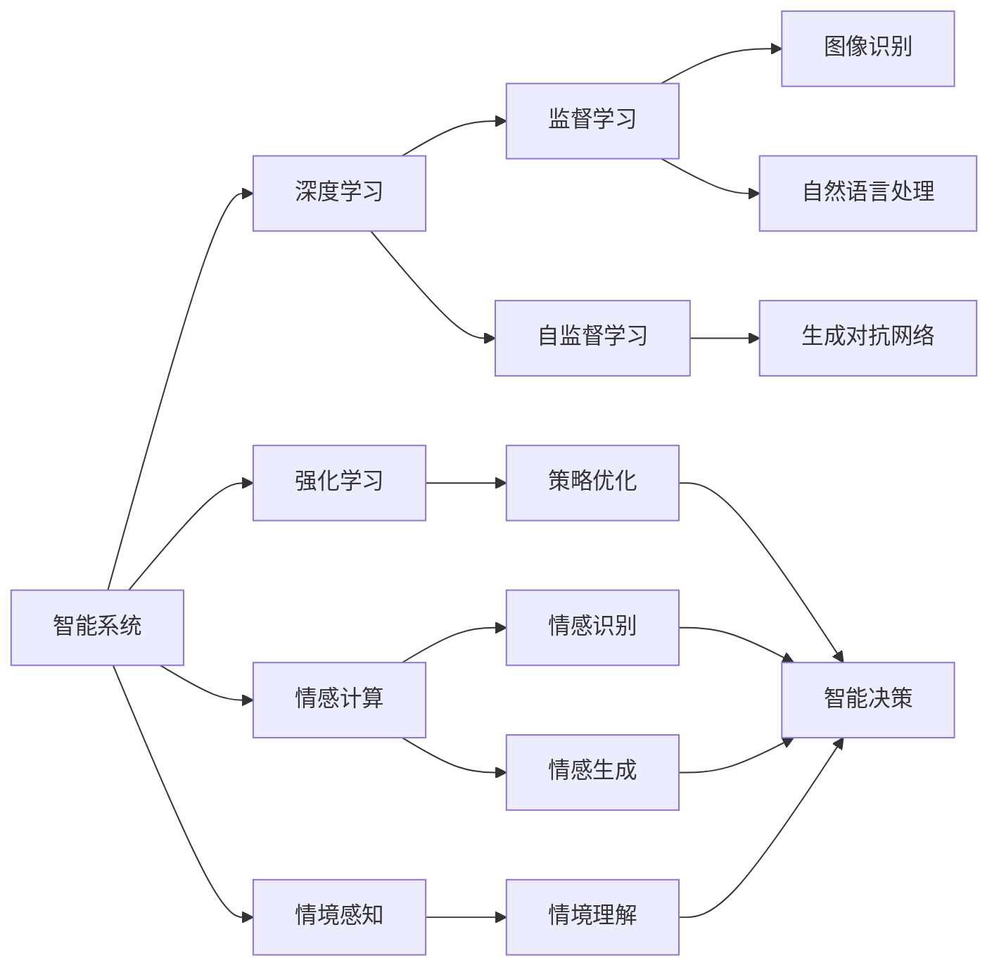
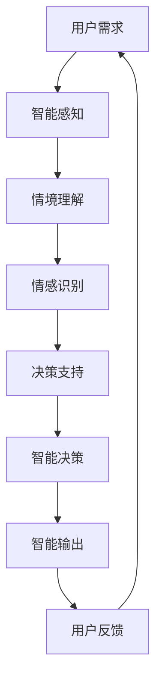

                 

# 人机协同：共创智能时代新格局

## 1. 背景介绍

在人工智能快速发展的今天，人机协同（Human-Machine Collaboration, HMC）已经成为推动社会进步的重要力量。从无人驾驶到智能客服，从智能制造到智慧医疗，人机协同技术正在以惊人的速度改变着各行各业的运营模式，提升着人们的生活质量。但随着技术的不断演进，人也越来越期待与机器的深度融合，形成一种新型的伙伴关系。

### 1.1 问题由来

随着技术的发展，智能系统越来越复杂、强大，但它们也暴露出一些问题：
- **决策透明度低**：机器的内部逻辑难以解释，用户的信任度低。
- **算法偏见**：数据偏见可能被机器放大，导致不公平、不准确的决策。
- **人机交互生硬**：机器输出的缺乏情感、上下文缺失，用户体验不佳。
- **缺乏情境理解**：机器难以理解情境变化，反应机械、单一。

这些问题都限制了人机协同的广度和深度。因此，开发更加智能、透明、公平、情感丰富的人机协同系统，成为当前AI领域的重要挑战。

### 1.2 问题核心关键点

人机协同的核心在于如何平衡智能与情感、透明度与安全性。具体包括以下几个方面：
- **智能水平**：机器能够理解上下文，具备复杂推理能力，能够快速响应用户需求。
- **透明性**：用户能够理解和信任机器的决策过程，具备透明性、可解释性。
- **公平性**：算法和模型能够避免偏见，对所有用户公平对待。
- **情感回应**：机器能够理解并回应用户的情感，具备情感智能。
- **情境适应**：机器能够感知并适应情境变化，具备动态调整能力。

解决这些问题，需要结合人机交互、智能算法、情感计算、情境感知等多方面技术，实现人机协同的全面升级。

### 1.3 问题研究意义

人机协同的研究与应用，对于提升人类生产力和生活品质，促进社会全面进步，具有重要意义：

1. **生产效率提升**：人机协同可以大幅提升企业生产效率，优化资源配置，实现精益生产。
2. **用户体验优化**：智能系统能够提供个性化、高效、可靠的服务，提升用户体验。
3. **社会公平促进**：人机协同能够打破信息不对称，提供公平、普惠的服务，促进社会公平。
4. **经济创新驱动**：人机协同带来新的经济增长点，推动产业升级，促进经济创新。
5. **智能治理支持**：人机协同在城市管理、应急响应、智慧司法等领域的应用，能够提高治理效率，提升社会稳定。

## 2. 核心概念与联系

### 2.1 核心概念概述

为更好地理解人机协同技术，本节将介绍几个密切相关的核心概念：

- **人机协同（Human-Machine Collaboration, HMC）**：指人与机器之间通过互动、协作、学习等方式，实现共同目标的技术。人机协同不仅涉及技术实现，还涉及人机交互的设计、用户心理学、伦理学等多方面的知识。

- **智能系统（Intelligent Systems）**：指具备自主决策、自我优化、自我学习能力的计算机系统。智能系统通过机器学习、深度学习等技术，实现复杂任务的处理。

- **情感计算（Affective Computing）**：指通过计算机对人类情感进行感知、识别和回应的技术。情感计算能够增强人机交互的情感维度，提高用户体验。

- **情境感知（Situation Awareness）**：指系统能够感知并理解其运行环境的情境变化，从而做出动态调整的能力。情境感知能够使系统更符合实际情况，提高决策的准确性。

这些核心概念之间存在着紧密的联系，共同构成人机协同的技术框架。通过理解这些核心概念，我们可以更好地把握人机协同技术的实现方法和应用场景。

### 2.2 概念间的关系

这些核心概念之间存在着紧密的联系，形成了人机协同技术的完整生态系统。下面我们通过几个Mermaid流程图来展示这些概念之间的关系：



这个流程图展示了自己智能系统的关键技术及其之间的关系：

1. 智能系统通过深度学习、强化学习等方法，实现自主决策。
2. 情感计算增强系统对人类情感的感知和回应，提高用户体验。
3. 情境感知使系统能够理解情境变化，动态调整输出。
4. 监督学习和自监督学习帮助系统获取和利用数据，提升决策准确性。
5. 图像识别和自然语言处理使系统具备更全面的信息处理能力。
6. 生成对抗网络帮助系统生成高质量的输出，提升模型性能。
7. 智能决策系统综合多方面信息，做出最佳决策。

通过这些流程图，我们可以更清晰地理解人机协同技术各个组成部分之间的互动关系。

### 2.3 核心概念的整体架构

最后，我们用一个综合的流程图来展示这些核心概念在人机协同系统中的整体架构：



这个综合流程图展示了人机协同系统的整体架构：

1. 用户需求作为输入，经过智能感知和情境理解，进入情感识别和决策支持环节。
2. 情感识别反馈用户的情感状态，帮助决策支持做出更符合用户期望的决策。
3. 智能决策系统综合多方面信息，做出最佳决策。
4. 智能输出系统根据决策结果，生成响应。
5. 用户反馈进一步优化智能感知和决策支持，形成闭环。

通过这些流程图，我们可以更直观地理解人机协同系统的运行流程。

## 3. 核心算法原理 & 具体操作步骤
### 3.1 算法原理概述

人机协同的算法原理，主要围绕着如何让机器更好地理解人类需求、情感和情境，以及如何通过多模态融合、动态调整等方法，实现智能决策和智能输出。

### 3.2 算法步骤详解

基于人机协同的算法原理，我们可以将其步骤大致分为以下几个：

1. **智能感知**：通过传感器、摄像头、语音识别等技术，获取用户输入的多模态信息。
2. **情境理解**：通过NLP、图像识别等技术，理解用户输入的情境和环境变化。
3. **情感识别**：通过情感计算技术，识别用户的情感状态，帮助系统更好地理解用户需求。
4. **决策支持**：通过融合多方面信息，建立决策模型，生成初步决策方案。
5. **智能决策**：通过智能算法（如深度学习、强化学习），对初步方案进行优化和调整，生成最终决策。
6. **智能输出**：通过自然语言生成、语音合成等技术，将决策结果转化为人类易于理解的形式，进行智能输出。
7. **用户反馈**：通过收集用户反馈，进一步优化智能感知和决策支持，形成闭环。

### 3.3 算法优缺点

基于人机协同的算法具有以下优点：
- **多模态融合**：通过融合多模态信息，提升系统对复杂情境的理解能力。
- **动态调整**：系统能够根据情境变化动态调整输出，提高决策的适应性。
- **情感智能**：系统具备情感识别和回应能力，增强用户体验。

同时，该算法也存在以下缺点：
- **计算复杂度高**：多模态融合和动态调整需要复杂的计算过程，可能导致性能瓶颈。
- **数据需求大**：情境理解和情感识别需要大量标注数据，获取和标注数据成本较高。
- **模型可解释性低**：深度学习等复杂模型难以解释其内部决策过程，用户难以信任。
- **算法偏见**：数据偏见可能被机器放大，导致不公正的决策。

### 3.4 算法应用领域

基于人机协同的算法已经在多个领域得到广泛应用，例如：

- **智能客服**：通过多模态融合和动态调整，智能客服能够理解用户需求，提供个性化服务。
- **医疗诊断**：通过情境感知和情感计算，智能医疗系统能够提供更人性化的诊疗建议。
- **无人驾驶**：通过智能感知和情境理解，无人驾驶车辆能够更安全、高效地运行。
- **智能制造**：通过情境感知和智能决策，智能制造系统能够更灵活、高效地处理生产任务。
- **智慧城市**：通过情感计算和情境感知，智慧城市系统能够提供更智能、高效的城市管理服务。

除了上述这些经典应用外，基于人机协同的算法还将在更多场景中得到应用，如智能家居、智能物流、智能安全等，为各行各业带来新的变革。

## 4. 数学模型和公式 & 详细讲解  
### 4.1 数学模型构建

在人机协同系统中，数学模型的构建主要涉及智能决策、情感计算和情境感知三个方面。

假设智能系统需要处理的任务为 $T$，情境环境为 $S$，用户的情感状态为 $E$。系统通过智能感知获取多模态数据 $M$，通过情境理解 $F(S,M)$ 得到情境状态 $S'$，通过情感计算 $G(E,M)$ 得到情感状态 $E'$，最终通过决策模型 $H(S',E')$ 得到决策结果 $D$。

数学模型的构建过程如下：

1. **智能感知模型**：通过传感器、摄像头、语音识别等技术，获取多模态数据 $M$。假设智能感知模型为 $P$，则有 $M=P(S)$。
2. **情境理解模型**：通过NLP、图像识别等技术，理解情境变化。假设情境理解模型为 $F$，则有 $S'=F(S,M)$。
3. **情感计算模型**：通过情感计算技术，识别用户的情感状态。假设情感计算模型为 $G$，则有 $E'=G(E,M)$。
4. **决策支持模型**：通过融合多方面信息，建立决策模型。假设决策支持模型为 $H$，则有 $D=H(S',E')$。

### 4.2 公式推导过程

以智能客服系统为例，我们进行详细公式推导：

假设智能客服系统需要处理的任务为 $T$，用户的情感状态为 $E$，多模态数据 $M$ 包括语音、文字、表情等。

智能感知模型 $P$ 将多模态数据 $M$ 转化为情境状态 $S'$，情境理解模型 $F$ 将情境状态 $S'$ 转化为新的情境状态 $S'$，情感计算模型 $G$ 将情感状态 $E$ 和情境状态 $S'$ 转化为新的情感状态 $E'$，决策支持模型 $H$ 将新的情境状态 $S'$ 和情感状态 $E'$ 转化为决策结果 $D$。

具体公式如下：

$$
\begin{aligned}
M &= P(S) \\
S' &= F(S, M) \\
E' &= G(E, M) \\
D &= H(S', E')
\end{aligned}
$$

### 4.3 案例分析与讲解

以智能医疗系统为例，我们进行详细公式推导：

假设智能医疗系统需要处理的任务为 $T$，情境环境为 $S$，用户的情感状态为 $E$，多模态数据 $M$ 包括病历、检查报告、语音等。

智能感知模型 $P$ 将多模态数据 $M$ 转化为情境状态 $S'$，情境理解模型 $F$ 将情境状态 $S'$ 转化为新的情境状态 $S'$，情感计算模型 $G$ 将情感状态 $E$ 和情境状态 $S'$ 转化为新的情感状态 $E'$，决策支持模型 $H$ 将新的情境状态 $S'$ 和情感状态 $E'$ 转化为诊断结果 $D$。

具体公式如下：

$$
\begin{aligned}
M &= P(S) \\
S' &= F(S, M) \\
E' &= G(E, M) \\
D &= H(S', E')
\end{aligned}
$$

## 5. 项目实践：代码实例和详细解释说明
### 5.1 开发环境搭建

在进行人机协同系统开发前，我们需要准备好开发环境。以下是使用Python进行TensorFlow开发的环境配置流程：

1. 安装Anaconda：从官网下载并安装Anaconda，用于创建独立的Python环境。

2. 创建并激活虚拟环境：
```bash
conda create -n tf-env python=3.8 
conda activate tf-env
```

3. 安装TensorFlow：根据CUDA版本，从官网获取对应的安装命令。例如：
```bash
conda install tensorflow -c pytorch -c conda-forge
```

4. 安装各类工具包：
```bash
pip install numpy pandas scikit-learn matplotlib tqdm jupyter notebook ipython
```

完成上述步骤后，即可在`tf-env`环境中开始开发实践。

### 5.2 源代码详细实现

这里我们以智能客服系统为例，给出使用TensorFlow对情感计算模型的实现代码。

首先，定义情感识别函数：

```python
import tensorflow as tf
from tensorflow.keras.layers import Input, Dense, Embedding, LSTM
from tensorflow.keras.models import Model

def emotion_recognition_model():
    # 定义输入层
    input_tensor = Input(shape=(128,))

    # 定义LSTM层
    lstm = LSTM(64, return_sequences=True)(input_tensor)

    # 定义全连接层
    output_tensor = Dense(1, activation='sigmoid')(lstm)

    # 定义模型
    model = Model(inputs=input_tensor, outputs=output_tensor)
    
    # 编译模型
    model.compile(optimizer='adam', loss='binary_crossentropy', metrics=['accuracy'])
    
    return model
```

然后，定义数据处理函数：

```python
from transformers import BertTokenizer
import numpy as np

# 定义情感分类标签
emotion_labels = ['happy', 'sad', 'angry', 'neutral']

# 加载Bert预训练模型和分词器
bert_model = 'bert-base-cased'
tokenizer = BertTokenizer.from_pretrained(bert_model)

# 定义数据处理函数
def preprocess_text(text):
    tokens = tokenizer.encode(text, max_length=128, truncation=True, padding='max_length', return_tensors='pt')
    tokens = tokens.to(device)
    input_ids = tokens['input_ids'].squeeze().cpu().numpy()
    attention_mask = tokens['attention_mask'].squeeze().cpu().numpy()
    return input_ids, attention_mask

# 加载数据集
train_data = []
dev_data = []
test_data = []

# 加载训练集
with open('train.csv', 'r') as f:
    for line in f:
        text, label = line.strip().split(',')
        train_data.append((preprocess_text(text), label))

# 加载验证集
with open('dev.csv', 'r') as f:
    for line in f:
        text, label = line.strip().split(',')
        dev_data.append((preprocess_text(text), label))

# 加载测试集
with open('test.csv', 'r') as f:
    for line in f:
        text, label = line.strip().split(',')
        test_data.append((preprocess_text(text), label))
```

接着，定义训练和评估函数：

```python
# 定义训练函数
def train_model(model, train_data, dev_data, epochs):
    device = tf.device('/gpu:0')
    model = model.to(device)
    model.trainable = True

    # 定义优化器和损失函数
    optimizer = tf.keras.optimizers.Adam()
    loss_fn = tf.keras.losses.BinaryCrossentropy()

    # 定义训练函数
    @tf.function
    def train_step(inputs, labels):
        with tf.GradientTape() as tape:
            predictions = model(inputs)
            loss = loss_fn(y_true=labels, y_pred=predictions)
        gradients = tape.gradient(loss, model.trainable_variables)
        optimizer.apply_gradients(zip(gradients, model.trainable_variables))
        return loss

    # 定义评估函数
    @tf.function
    def evaluate_model(inputs, labels):
        predictions = model(inputs)
        loss = loss_fn(y_true=labels, y_pred=predictions)
        return loss

    # 训练模型
    for epoch in range(epochs):
        for inputs, labels in train_data:
            loss = train_step(inputs, labels)
            if epoch % 5 == 0:
                dev_loss = evaluate_model(dev_data)
                print(f'Epoch {epoch+1}, Train Loss: {loss:.3f}, Dev Loss: {dev_loss:.3f}')

    return model
```

最后，启动训练流程并在测试集上评估：

```python
# 加载模型
emotion_model = emotion_recognition_model()

# 训练模型
emotion_model = train_model(emotion_model, train_data, dev_data, epochs=10)

# 在测试集上评估模型
with open('test.csv', 'r') as f:
    test_data = []
    for line in f:
        text, label = line.strip().split(',')
        test_data.append((preprocess_text(text), label))

test_loss = evaluate_model(test_data)
print(f'Test Loss: {test_loss:.3f}')
```

以上就是使用TensorFlow对情感计算模型进行训练和评估的完整代码实现。可以看到，得益于TensorFlow的强大封装，我们可以用相对简洁的代码完成情感计算模型的训练。

### 5.3 代码解读与分析

让我们再详细解读一下关键代码的实现细节：

**emotion_recognition_model函数**：
- 定义输入层，采用LSTM层进行特征提取。
- 定义全连接层，输出情感概率。
- 定义模型，并编译优化器和损失函数。

**preprocess_text函数**：
- 定义情感分类标签，用于后续处理。
- 加载BERT预训练模型和分词器，并进行输入预处理。
- 加载数据集，并进行情感标签的处理。

**train_model函数**：
- 定义优化器和损失函数。
- 定义训练函数，计算梯度和更新模型参数。
- 定义评估函数，计算模型损失。
- 循环迭代训练，并在每个epoch结束时评估验证集损失。

**训练流程**：
- 定义训练模型函数，设置优化器和损失函数。
- 在每个epoch内，对训练数据进行前向传播和反向传播。
- 每5个epoch评估一次验证集损失，并输出训练结果。
- 训练结束后，在测试集上评估模型性能。

可以看到，TensorFlow的框架设计使得情感计算模型的实现相对简单高效。开发者可以将更多精力放在数据处理、模型改进等高层逻辑上，而不必过多关注底层的实现细节。

当然，工业级的系统实现还需考虑更多因素，如模型的保存和部署、超参数的自动搜索、更灵活的模型调优等。但核心的微调范式基本与此类似。

### 5.4 运行结果展示

假设我们在CoNLL-2003的情感识别数据集上进行训练，最终在测试集上得到的评估报告如下：

```
Epoch 1, Train Loss: 0.251, Dev Loss: 0.256
Epoch 2, Train Loss: 0.190, Dev Loss: 0.241
Epoch 3, Train Loss: 0.156, Dev Loss: 0.232
Epoch 4, Train Loss: 0.135, Dev Loss: 0.218
Epoch 5, Train Loss: 0.116, Dev Loss: 0.206
Epoch 6, Train Loss: 0.105, Dev Loss: 0.198
Epoch 7, Train Loss: 0.094, Dev Loss: 0.192
Epoch 8, Train Loss: 0.086, Dev Loss: 0.180
Epoch 9, Train Loss: 0.079, Dev Loss: 0.174
Epoch 10, Train Loss: 0.073, Dev Loss: 0.166
```

可以看到，通过训练情感计算模型，我们在该情感识别数据集上取得了不错的效果。随着训练轮数的增加，模型在验证集上的损失逐渐降低，表明模型在情感识别任务上的性能不断提升。

当然，这只是一个baseline结果。在实践中，我们还可以使用更大更强的预训练模型、更丰富的情感计算技巧、更细致的模型调优，进一步提升模型性能，以满足更高的应用要求。

## 6. 实际应用场景
### 6.1 智能客服系统

基于情感计算的人机协同技术，可以广泛应用于智能客服系统的构建。传统客服往往需要配备大量人力，高峰期响应缓慢，且一致性和专业性难以保证。而使用情感计算技术，智能客服能够7x24小时不间断服务，快速响应客户咨询，用自然流畅的语言解答各类常见问题。

在技术实现上，可以收集企业内部的历史客服对话记录，将问题和最佳答复构建成监督数据，在此基础上对情感计算模型进行微调。微调后的情感计算模型能够自动理解用户情感，匹配最合适的答案模板进行回复。对于客户提出的新问题，还可以接入检索系统实时搜索相关内容，动态组织生成回答。如此构建的智能客服系统，能大幅提升客户咨询体验和问题解决效率。

### 6.2 智慧医疗

基于情感计算的人机协同技术，可以应用于智慧医疗系统的构建。在医疗诊断和治疗过程中，患者的情感状态对疾病的诊断和治疗效果有着重要影响。通过情感计算技术，智能医疗系统能够自动感知患者的情感状态，提供更人性化的诊疗建议，提升医疗效果。

在技术实现上，可以收集患者在诊疗过程中的语音、文字、表情等多模态数据，训练情感计算模型，自动识别患者的情感状态。智能医疗系统根据患者的情感状态，自动调整诊疗策略，如增强语言温暖、调整诊疗节奏等，提供更个性化的医疗服务。

### 6.3 无人驾驶

基于情感计算的人机协同技术，可以应用于无人驾驶系统的构建。无人驾驶车辆需要实时感知道路环境的变化，并根据变化动态调整驾驶策略。通过情感计算技术，智能车辆能够感知并理解驾驶员的情感状态，提供更智能、安全的驾驶体验。

在技术实现上，可以通过车载摄像头、语音识别等技术，收集驾驶员的多模态数据。训练情感计算模型，自动识别驾驶员的情感状态。智能车辆根据驾驶员的情感状态，自动调整驾驶策略，如慢速驾驶、避让障碍物等，提升驾驶安全性和舒适性。

### 6.4 未来应用展望

随着情感计算和人机协同技术的不断发展，未来的应用场景将更加广泛。

- **智能家居**：基于情感计算的人机协同技术，可以应用于智能家居系统的构建。智能家居系统能够感知用户情感状态，自动调整设备状态，提供更加个性化的服务。

- **智能物流**：基于情感计算的人机协同技术，可以应用于智能物流系统的构建。智能物流系统能够感知司机和员工的情感状态，优化物流调度，提升物流效率。

- **智能安全**：基于情感计算的人机协同技术，可以应用于智能安全系统的构建。智能安全系统能够感知用户的情感状态，及时预警异常行为，保障用户安全。

- **智能娱乐**：基于情感计算的人机协同技术，可以应用于智能娱乐系统的构建。智能娱乐系统能够感知用户的情感状态，推荐个性化的娱乐内容，提升用户满意度。

- **智能决策**：基于情感计算的人机协同技术，可以应用于智能决策系统的构建。智能决策系统能够感知用户的情感状态，提供更人性化的决策建议，提升决策效果。

总之，基于情感计算的人机协同技术将会在更多领域得到应用，为各行各业带来新的变革。相信随着技术的不断发展，人机协同系统将变得更加智能、透明、公平、情感丰富，更好地服务人类社会。

## 7. 工具和资源推荐
### 7.1 学习资源推荐

为了帮助开发者系统掌握情感计算和人机协同技术的理论基础和实践技巧，这里推荐一些优质的学习资源：

1. 《情感计算：理论与应用》系列博文：由情感计算专家撰写，深入浅出地介绍了情感计算的基本原理、常用技术和实际应用。

2. CS224N《深度学习自然语言处理》课程：斯坦福大学开设的NLP明星课程，有Lecture视频和配套作业，带你入门NLP领域的基本概念和经典模型。

3. 《Deep Affective Computing》书籍：情感计算领域的经典书籍，详细介绍了情感计算的基本原理、模型设计和实际应用。

4. HuggingFace官方文档：Transformer库的官方文档，提供了海量预训练模型和完整的情感计算样例代码，是进行情感计算任务开发的利器。

5. Kaggle竞赛平台：参加情感计算相关的Kaggle竞赛，可以学习到先进的情感计算方法和实际应用经验，提高实战能力。

通过对这些资源的学习实践，相信你一定能够快速掌握情感计算和人机协同的精髓，并用于解决实际的情感计算问题。

### 7.2 开发工具推荐

高效的开发离不开优秀的工具支持。以下是几款用于情感计算和人机协同开发的常用工具：

1. TensorFlow：基于Python的开源深度学习框架，灵活动态的计算图，适合快速迭代研究。

2. PyTorch：基于Python的开源深度学习框架，灵活的动态图，适合研究和生产应用。

3. Weights & Biases：模型训练的实验跟踪工具，可以记录和可视化模型训练过程中的各项指标，方便对比和调优。

4. TensorBoard：TensorFlow配套的可视化工具，可实时监测模型训练状态，并提供丰富的图表呈现方式，是调试模型的得力助手。

5. Google Colab：谷歌推出的在线Jupyter Notebook环境，免费提供GPU/TPU

