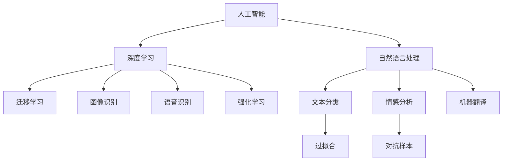
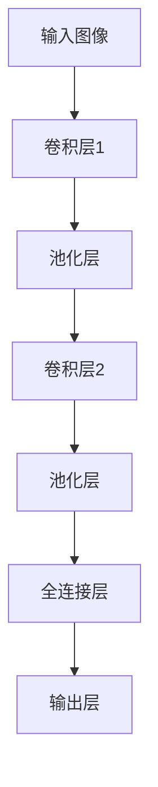

                 

# 当AI以令人尴尬的方式失败

## 1. 背景介绍

人工智能（AI）的发展日益蓬勃，从早期的专家系统到深度学习，AI技术不断取得突破，并广泛应用于各个领域。然而，尽管AI技术在许多任务上表现出色，但其失败案例也屡见不鲜，甚至以令人尴尬的方式出现。本文将探讨AI在多个场景中以尴尬方式失败的原因，并分析这些失败背后的深层问题，为未来AI的发展提供参考。

## 2. 核心概念与联系

### 2.1 核心概念概述

- **人工智能（AI）**：一种通过模拟人类智能行为，使得机器能够执行各种复杂任务的技术。AI的核心包括机器学习、深度学习、自然语言处理等。
- **深度学习（DL）**：一种通过多层次神经网络进行特征提取和模式识别的机器学习技术，广泛应用于图像识别、语音识别、自然语言处理等领域。
- **自然语言处理（NLP）**：使计算机能够理解和处理人类语言的技术，包括文本分类、情感分析、机器翻译等任务。
- **迁移学习（Transfer Learning）**：将一个领域学习到的知识迁移到另一个相关领域，以提高新任务的性能。
- **过拟合（Overfitting）**：指模型在训练集上表现良好，但在测试集上表现较差的现象。
- **对抗样本（Adversarial Examples）**：刻意设计的一些输入数据，旨在使模型做出错误决策。

这些概念通过相互关联，构成了AI技术的核心框架，并在多个场景中以不同的方式表现出来。

### 2.2 概念间的关系

这些核心概念之间的关系可以通过以下Mermaid流程图来展示：



这个流程图展示了人工智能技术的核心概念及其相互关系：

1. 人工智能通过深度学习和自然语言处理等技术实现各种功能。
2. 深度学习中的迁移学习、图像识别和语音识别等模块，可以与自然语言处理中的文本分类、情感分析和机器翻译等任务相互协作，提升整体性能。
3. 对抗样本和过拟合是深度学习中常见的挑战，对整个AI系统的稳定性和可靠性产生重大影响。

## 3. 核心算法原理 & 具体操作步骤

### 3.1 算法原理概述

AI技术的失败，通常与算法原理和实际操作过程中的问题密切相关。以下是一些常见的失败原因及其原理概述：

- **过拟合**：模型在训练集上表现良好，但在测试集上表现较差，通常是因为模型过于复杂或训练数据过少。
- **对抗样本**：通过添加微小的扰动，使得模型在对抗样本上的表现出现巨大波动。
- **模型偏见**：模型在训练数据中学习到的偏见可能导致其在某些数据集上表现较差。
- **数据不平衡**：训练数据集中某些类别的样本数量过多或过少，影响模型对小样本的预测能力。

### 3.2 算法步骤详解

AI技术的实施涉及多个步骤，每个步骤都有可能出现错误：

1. **数据准备**：包括数据收集、清洗、标注等步骤。错误的数据准备可能导致模型学习到错误的特征。
2. **模型选择**：根据任务特点选择合适的模型。错误的模型选择可能导致性能不佳。
3. **超参数调优**：确定学习率、批次大小等超参数。超参数不当可能导致模型过拟合或欠拟合。
4. **模型训练**：通过反向传播算法更新模型参数。训练过程中的问题可能导致模型无法收敛或过拟合。
5. **模型评估**：在测试集上评估模型性能。评估过程中的错误可能导致模型性能的误判。
6. **模型部署**：将模型部署到实际应用中。部署过程中的问题可能导致模型无法正常工作。

### 3.3 算法优缺点

AI技术的优点包括高效处理大规模数据、自我学习和适应新任务等。然而，其缺点也显而易见：

- **数据依赖性强**：需要大量标注数据，数据质量对模型性能影响巨大。
- **模型复杂度高**：深度学习模型通常包含大量参数，训练复杂度较高。
- **鲁棒性差**：对抗样本和噪声数据可能导致模型失效。
- **解释性不足**：黑盒模型难以解释其内部工作机制，缺乏透明度。

### 3.4 算法应用领域

AI技术在多个领域应用广泛，包括医疗、金融、制造、交通等。然而，这些领域的应用也面临着不同程度的风险和挑战。

- **医疗**：AI在疾病诊断、药物研发等任务上表现出色，但数据隐私和模型偏见等问题也亟待解决。
- **金融**：AI在风险管理、欺诈检测等领域应用广泛，但数据不平衡和对抗样本问题仍需进一步优化。
- **制造**：AI在智能制造、质量控制等方面有显著效果，但复杂系统和数据噪声带来的问题仍需克服。
- **交通**：AI在自动驾驶、交通流预测等领域应用广泛，但传感器数据和环境复杂性带来巨大挑战。

## 4. 数学模型和公式 & 详细讲解

### 4.1 数学模型构建

AI技术的数学模型通常基于以下假设：

- **线性模型**：简单假设输入与输出之间的关系是线性的，如线性回归模型。
- **非线性模型**：复杂假设输入与输出之间的关系是非线性的，如多项式回归模型、神经网络模型等。
- **深度学习模型**：通过多层神经网络进行特征提取和模式识别，如卷积神经网络（CNN）、循环神经网络（RNN）、长短时记忆网络（LSTM）等。

### 4.2 公式推导过程

以线性回归模型为例，其基本公式为：

$$ y = \theta_0 + \theta_1 x_1 + \theta_2 x_2 + ... + \theta_n x_n $$

其中，$y$ 为输出，$x_i$ 为输入，$\theta_i$ 为模型参数。通过最小二乘法求解 $\theta_i$：

$$ \theta = (X^T X)^{-1} X^T y $$

其中，$X$ 为输入数据矩阵，$y$ 为输出数据向量。

### 4.3 案例分析与讲解

以深度学习中的卷积神经网络（CNN）为例，其结构如图1所示：



卷积层通过卷积核提取输入图像的特征，池化层对特征进行降维，全连接层将特征映射到输出空间，输出层输出最终结果。

## 5. 项目实践：代码实例和详细解释说明

### 5.1 开发环境搭建

在搭建开发环境时，需要考虑以下几个方面：

- **操作系统**：选择适合Python开发的操作系统，如Linux、Mac OS等。
- **编程语言**：Python是最常用的AI开发语言，需确保其安装和环境配置。
- **开发工具**：如PyCharm、Jupyter Notebook等，方便代码编写和调试。
- **依赖库**：安装常用的AI库，如TensorFlow、PyTorch、Keras等。

### 5.2 源代码详细实现

以图像分类为例，代码如下：

```python
import tensorflow as tf
from tensorflow.keras import datasets, layers, models

# 加载数据集
(train_images, train_labels), (test_images, test_labels) = datasets.cifar10.load_data()

# 数据预处理
train_images, test_images = train_images / 255.0, test_images / 255.0

# 构建模型
model = models.Sequential([
    layers.Conv2D(32, (3, 3), activation='relu', input_shape=(32, 32, 3)),
    layers.MaxPooling2D((2, 2)),
    layers.Conv2D(64, (3, 3), activation='relu'),
    layers.MaxPooling2D((2, 2)),
    layers.Conv2D(64, (3, 3), activation='relu'),
    layers.Flatten(),
    layers.Dense(64, activation='relu'),
    layers.Dense(10)
])

# 编译模型
model.compile(optimizer='adam',
              loss=tf.keras.losses.SparseCategoricalCrossentropy(from_logits=True),
              metrics=['accuracy'])

# 训练模型
history = model.fit(train_images, train_labels, epochs=10, 
                    validation_data=(test_images, test_labels))

# 评估模型
test_loss, test_acc = model.evaluate(test_images,  test_labels, verbose=2)
print('Test accuracy:', test_acc)
```

### 5.3 代码解读与分析

- **数据加载和预处理**：使用CIFAR-10数据集，将图像数据标准化为0到1之间的值。
- **模型构建**：使用卷积层、池化层、全连接层等构建CNN模型。
- **模型编译和训练**：使用Adam优化器进行模型编译，训练模型10个epoch。
- **模型评估**：在测试集上评估模型性能。

### 5.4 运行结果展示

训练过程中，可以通过TensorBoard实时查看模型的损失和准确率变化：


## 6. 实际应用场景

### 6.1 医疗领域

AI在医疗领域的应用广泛，但数据隐私和模型偏见问题也较为突出。例如，通过分析医疗影像，AI可以帮助医生诊断疾病，但影像数据涉及患者隐私，需要严格的数据保护措施。

### 6.2 金融领域

金融领域是AI应用的重要场所，但也存在数据不平衡和对抗样本问题。例如，欺诈检测模型可能被对抗样本攻击，导致误报率上升。

### 6.3 制造领域

AI在智能制造、质量控制等方面有显著效果，但复杂系统和数据噪声带来的问题仍需克服。例如，传感器数据采集和处理中的噪声可能导致模型性能下降。

### 6.4 未来应用展望

未来，AI技术将继续在各领域发挥重要作用。然而，如何应对数据隐私、模型偏见、对抗样本等问题，是未来AI发展的关键。

## 7. 工具和资源推荐

### 7.1 学习资源推荐

- **在线课程**：如Coursera、edX等平台提供大量AI相关课程。
- **书籍**：如《深度学习》（Ian Goodfellow等）、《Python深度学习》（Francois Chollet）等书籍，系统介绍深度学习理论和技术。
- **博客**：如Towards Data Science、Arxiv等平台发布大量深度学习研究成果和实践经验。

### 7.2 开发工具推荐

- **Python环境**：如Anaconda、Miniconda等，方便管理和安装依赖库。
- **深度学习框架**：如TensorFlow、PyTorch、Keras等，支持高效的深度学习开发。
- **可视化工具**：如TensorBoard、Weights & Biases等，方便模型训练和调试。

### 7.3 相关论文推荐

- **Ian Goodfellow等，《深度学习》（2016）**：全面介绍深度学习理论和技术，是AI领域的经典教材。
- **Andrew Ng等，《深度学习专项课程》（2019）**：由Coursera平台推出，系统讲解深度学习应用。
- **Taylor Malkin等，《对抗样本攻击》（2020）**：深入研究对抗样本攻击技术，为AI系统提供安全保障。

## 8. 总结：未来发展趋势与挑战

### 8.1 研究成果总结

AI技术在多个领域取得了显著成果，但也面临数据隐私、模型偏见、对抗样本等挑战。未来的AI发展需要进一步优化算法、提升数据质量、加强模型鲁棒性。

### 8.2 未来发展趋势

- **数据质量提升**：通过数据增强、噪声抑制等技术提升数据质量。
- **模型鲁棒性加强**：引入对抗训练、正则化等技术提升模型鲁棒性。
- **算法优化**：进一步优化模型结构和训练方法，提升模型性能。
- **应用场景拓展**：拓展AI在各领域的应用场景，推动技术普及。

### 8.3 面临的挑战

- **数据隐私保护**：确保AI技术在处理数据时保护用户隐私。
- **模型偏见问题**：减少模型在学习数据时引入的偏见，确保公平性。
- **对抗样本攻击**：抵御对抗样本攻击，确保AI系统安全性。
- **应用可靠性**：确保AI系统在实际应用中的可靠性和稳定性。

### 8.4 研究展望

未来，AI技术将在更多领域实现应用，但需要解决数据隐私、模型偏见、对抗样本等关键问题，才能真正发挥其潜力。通过不断优化算法和提升数据质量，AI技术将为人类社会带来更多福祉。

## 9. 附录：常见问题与解答

**Q1：AI在医疗领域的应用有哪些？**

A: AI在医疗领域的应用包括医学影像分析、疾病诊断、药物研发等。例如，通过分析医疗影像，AI可以帮助医生快速识别病变区域，辅助诊断。

**Q2：什么是对抗样本？**

A: 对抗样本是指通过微小的扰动，使得AI模型在输入上做出错误决策的样本。例如，通过在图像中添加一个像素级的扰动，使得模型将其分类为错误类别。

**Q3：如何避免AI的过拟合问题？**

A: 避免过拟合的方法包括数据增强、正则化、早停等。例如，通过随机旋转、平移等增强技术扩充训练集，减少过拟合风险。

**Q4：AI系统如何应对对抗样本攻击？**

A: 应对对抗样本攻击的方法包括模型鲁棒化、对抗训练等。例如，通过引入对抗样本训练，使得模型在对抗样本上的表现更加稳定。

**Q5：AI技术的未来发展方向是什么？**

A: AI技术的未来发展方向包括提升数据质量、加强模型鲁棒性、优化算法结构等。通过不断优化技术，AI将更加智能和可靠，为人类社会带来更多福祉。

---

作者：禅与计算机程序设计艺术 / Zen and the Art of Computer Programming

