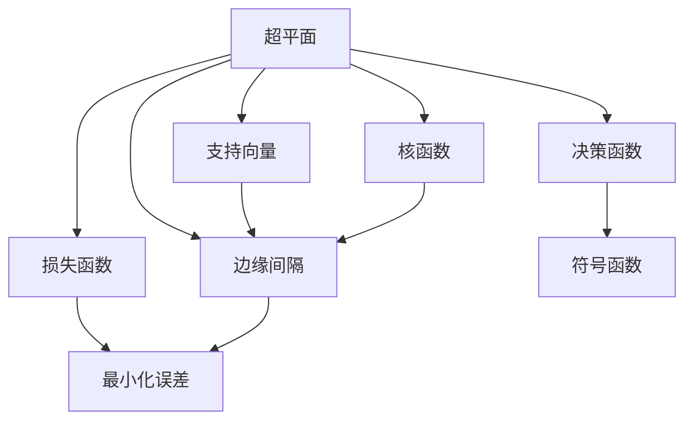

                 

# 支持向量机SVM原理与代码实例讲解

> 关键词：支持向量机(SVM)，核函数，损失函数，分类器，代码实例，机器学习

## 1. 背景介绍

### 1.1 问题由来
支持向量机（Support Vector Machine, SVM）是一种广泛应用于分类和回归分析的机器学习算法。它通过将数据映射到高维空间，在样本空间中找到一个最优的超平面，实现对数据的分割。SVM算法的核心在于其损失函数的设计和核函数的使用，能够在有限样本情况下得到较好的泛化性能。

SVM算法最早由Cortes和Vapnik在1995年的论文《Support Vector Networks》中提出，并在之后的 years 年逐渐成熟。它不仅在学术界受到广泛关注，还被广泛应用于工业界。比如，支持向量机在文本分类、图像识别、生物信息学等多个领域都取得了显著的效果。

## 1.2 问题核心关键点
SVM算法的主要思想是通过构造最优的超平面，实现对数据的分割。具体来说，对于给定的训练数据集 $(x_i, y_i)$，其中 $x_i$ 表示输入特征向量，$y_i$ 表示标签，SVM算法试图找到一个超平面，使得不同类别的样本被尽可能地分开。这个超平面的选择需要满足以下两个条件：

- 最大化边缘间隔（Margin）：边缘间隔指的是超平面到最近样本点的距离，即点到超平面的垂直距离。

- 最小化误差：超平面应该尽可能地适应训练数据，使得所有样本都被正确分类。

此外，SVM算法还可以通过引入核函数来处理非线性数据，扩展其应用范围。

## 1.3 问题研究意义
SVM算法作为一种经典的机器学习算法，具有以下优势：

1. 泛化能力强：SVM算法在处理小样本数据集时，能够通过最大化边缘间隔，得到较好的泛化性能。

2. 对噪声不敏感：SVM算法通过引入核函数，能够在高维空间中找到最优超平面，对噪声和异常值有较好的鲁棒性。

3. 理论基础扎实：SVM算法有严格的理论基础，可以解释为什么在有限数据下仍然能够得到较好的泛化性能。

4. 应用范围广泛：SVM算法可以用于二分类和多分类任务，在分类、回归、排序等多种应用场景中都有成功案例。

5. 对多分类问题处理能力强：SVM算法可以通过One-vs-One、One-vs-Rest 等策略，处理多分类问题。

SVM算法的应用不仅限于机器学习领域，还可以用于计算机视觉、自然语言处理、信号处理等众多领域，是解决分类和回归问题的重要工具。

## 2. 核心概念与联系

### 2.1 核心概念概述

在介绍SVM算法的核心概念之前，我们首先了解其基本的组成部分。SVM算法主要由以下核心概念构成：

- 超平面（Hyperplane）：SVM算法的目标就是找到一个最优的超平面，使得不同类别的样本被分开。超平面一般定义为 $w \cdot x + b = 0$ 的形式，其中 $w$ 表示超平面的法向量，$b$ 表示截距。

- 支持向量（Support Vector）：超平面上的点被称为支持向量，它们在分类的过程中起着关键作用。支持向量的选择应该满足最大化边缘间隔的条件。

- 边缘间隔（Margin）：边缘间隔指的是超平面到最近样本点的距离，即点到超平面的垂直距离。边缘间隔越大，模型的泛化性能越好。

- 损失函数（Loss Function）：SVM算法的损失函数旨在最小化误差，即所有样本都被正确分类的同时，最大化边缘间隔。

- 核函数（Kernel Function）：SVM算法通过引入核函数，将样本数据映射到高维空间中，使得在高维空间中寻找最优超平面成为可能。核函数常用的有线性核函数、多项式核函数、高斯核函数等。

- 决策函数（Decision Function）：决策函数是SVM算法的输出函数，用于对新的样本进行分类。决策函数定义为 $f(x) = sign(w \cdot x + b)$ 的形式，其中 $sign$ 表示符号函数。

### 2.2 概念间的关系

为了更好地理解SVM算法的各个核心概念，以下我们用一个Mermaid流程图来展示这些概念之间的关系：



通过这个流程图，我们可以清晰地看到SVM算法的各个组成部分之间的关系：

1. 超平面定义了样本数据的分界线。

2. 支持向量是超平面上的点，对分界线起着支撑作用。

3. 边缘间隔描述超平面与最近样本点之间的距离，影响模型的泛化性能。

4. 损失函数用于最小化误差，最大化边缘间隔。

5. 核函数用于将样本数据映射到高维空间中，扩展SVM算法的应用范围。

6. 决策函数根据超平面和样本数据，对新的样本进行分类。

这些概念共同构成了SVM算法的核心架构，使得SVM算法在有限样本下仍能得到较好的分类性能。

## 3. 核心算法原理 & 具体操作步骤

### 3.1 算法原理概述

SVM算法的核心思想是通过构造最优的超平面，实现对数据的分割。具体来说，SVM算法的优化目标是找到一个最优的超平面，使得所有样本都被正确分类，并且最大化边缘间隔。

在实际应用中，SVM算法通常采用拉格朗日对偶方法（Lagrange Dual Method）来求解最优超平面。拉格朗日对偶方法是一种求解凸优化问题的常用方法，它能够将原始优化问题转化为对偶优化问题，从而简化求解过程。

### 3.2 算法步骤详解

SVM算法的求解过程主要分为以下几个步骤：

1. 构造拉格朗日对偶问题（Lagrange Dual Problem）：首先将原始优化问题转化为拉格朗日对偶问题。拉格朗日对偶问题的求解比原始问题更为简单，通常可以更快地收敛。

2. 求解拉格朗日对偶问题：拉格朗日对偶问题可以通过求解拉格朗日乘子（Lagrange Multiplier）来得到最优解。

3. 求解原始优化问题：将拉格朗日对偶问题的解转化为原始问题的解，得到最优超平面。

4. 计算预测值：对于新的样本，通过计算其到超平面的距离，确定其类别。

接下来，我们具体介绍SVM算法的操作步骤。

### 3.3 算法优缺点

SVM算法有以下优点：

1. 泛化能力强：SVM算法在处理小样本数据集时，能够通过最大化边缘间隔，得到较好的泛化性能。

2. 对噪声不敏感：SVM算法通过引入核函数，能够在高维空间中找到最优超平面，对噪声和异常值有较好的鲁棒性。

3. 理论基础扎实：SVM算法有严格的理论基础，可以解释为什么在有限数据下仍然能够得到较好的泛化性能。

4. 应用范围广泛：SVM算法可以用于二分类和多分类任务，在分类、回归、排序等多种应用场景中都有成功案例。

SVM算法也有以下缺点：

1. 计算复杂度高：SVM算法的求解过程通常较为复杂，尤其是当数据维度较高时，计算量会急剧增加。

2. 对大规模数据集处理困难：SVM算法在处理大规模数据集时，通常需要进行特征选择，以减少计算量和存储需求。

3. 对参数敏感：SVM算法的性能受到参数的选择影响较大，如核函数的选择、正则化参数的选取等。

4. 难以解释：SVM算法的决策过程较为复杂，难以解释其内部工作机制。

5. 可能存在过拟合：SVM算法在处理非线性数据时，可能存在过拟合的风险。

### 3.4 算法应用领域

SVM算法作为一种经典的机器学习算法，被广泛应用于以下领域：

1. 文本分类：SVM算法可以用于文本分类，如垃圾邮件过滤、情感分析等。

2. 图像识别：SVM算法可以用于图像识别，如人脸识别、数字识别等。

3. 生物信息学：SVM算法可以用于生物信息学，如基因表达分析、蛋白质分类等。

4. 金融分析：SVM算法可以用于金融分析，如信用评估、股票预测等。

5. 信号处理：SVM算法可以用于信号处理，如语音识别、声纹识别等。

此外，SVM算法还在医疗诊断、自然语言处理、智能推荐等领域有广泛的应用，成为机器学习领域的重要工具。

## 4. 数学模型和公式 & 详细讲解  
### 4.1 数学模型构建

假设给定一个二分类问题，有 $N$ 个样本数据 $(x_i, y_i)$，其中 $x_i \in R^d$，$y_i \in \{1, -1\}$。SVM算法的目标是最小化损失函数，同时最大化边缘间隔。

SVM算法的损失函数可以定义为：

$$
\min \limits_{w, b} \frac{1}{2}\lVert w \rVert^2 + C \sum \limits_{i=1}^N \ell(y_i, w \cdot x_i + b)
$$

其中 $w$ 和 $b$ 表示超平面的法向量和截距，$\lVert w \rVert^2$ 表示 $w$ 的范数，$C$ 为正则化参数，$\ell$ 为损失函数。在二分类问题中，常用的损失函数为0-1损失函数。

通过引入拉格朗日对偶方法，SVM算法可以转化为对偶优化问题：

$$
\min \limits_{\alpha} \frac{1}{2}\lVert w \rVert^2 - \sum \limits_{i=1}^N \alpha_i y_i (w \cdot x_i + b) + \frac{1}{2C} \sum \limits_{i=1}^N \sum \limits_{j=1}^N \alpha_i \alpha_j y_i y_j \lVert x_i - x_j \rVert^2
$$

其中 $\alpha_i \geq 0$ 表示拉格朗日乘子。

SVM算法的决策函数为：

$$
f(x) = sign(w \cdot x + b)
$$

### 4.2 公式推导过程

接下来，我们将对SVM算法的推导过程进行详细讲解。

假设 $N$ 个样本数据 $(x_i, y_i)$，其中 $x_i \in R^d$，$y_i \in \{1, -1\}$。SVM算法的目标是最小化损失函数，同时最大化边缘间隔。

SVM算法的损失函数可以定义为：

$$
\min \limits_{w, b} \frac{1}{2}\lVert w \rVert^2 + C \sum \limits_{i=1}^N \ell(y_i, w \cdot x_i + b)
$$

其中 $w$ 和 $b$ 表示超平面的法向量和截距，$\lVert w \rVert^2$ 表示 $w$ 的范数，$C$ 为正则化参数，$\ell$ 为损失函数。在二分类问题中，常用的损失函数为0-1损失函数。

通过引入拉格朗日对偶方法，SVM算法可以转化为对偶优化问题：

$$
\min \limits_{\alpha} \frac{1}{2}\lVert w \rVert^2 - \sum \limits_{i=1}^N \alpha_i y_i (w \cdot x_i + b) + \frac{1}{2C} \sum \limits_{i=1}^N \sum \limits_{j=1}^N \alpha_i \alpha_j y_i y_j \lVert x_i - x_j \rVert^2
$$

其中 $\alpha_i \geq 0$ 表示拉格朗日乘子。

对偶问题可以通过求解拉格朗日乘子 $\alpha$ 得到最优解。对偶问题的解可以通过求解以下方程组得到：

$$
\begin{cases}
\alpha^T y = 0 \\
0 \leq \alpha_i \leq C
\end{cases}
$$

其中 $y = (y_1, y_2, ..., y_N)$，$\alpha = (\alpha_1, \alpha_2, ..., \alpha_N)$。

通过对偶问题的解，可以求得最优超平面的法向量 $w$ 和截距 $b$，从而得到SVM算法的决策函数 $f(x) = sign(w \cdot x + b)$。

## 5. 项目实践：代码实例和详细解释说明

### 5.1 开发环境搭建

在进行SVM算法实践前，我们需要准备好开发环境。以下是使用Python进行Scikit-learn开发的环境配置流程：

1. 安装Anaconda：从官网下载并安装Anaconda，用于创建独立的Python环境。

2. 创建并激活虚拟环境：
```bash
conda create -n sklearn-env python=3.8 
conda activate sklearn-env
```

3. 安装Scikit-learn：
```bash
conda install scikit-learn
```

4. 安装NumPy、Pandas、Matplotlib等辅助工具包：
```bash
pip install numpy pandas matplotlib
```

完成上述步骤后，即可在`sklearn-env`环境中开始SVM算法的实践。

### 5.2 源代码详细实现

下面我们以手写数字识别为例，给出使用Scikit-learn库对SVM算法进行实现的Python代码实现。

```python
import numpy as np
from sklearn import datasets, svm, metrics
from sklearn.model_selection import train_test_split

# 加载手写数字数据集
digits = datasets.load_digits()

# 划分训练集和测试集
X_train, X_test, y_train, y_test = train_test_split(digits.data, digits.target, test_size=0.3, random_state=42)

# 创建SVM分类器
classifier = svm.SVC(kernel='linear')

# 训练SVM分类器
classifier.fit(X_train, y_train)

# 预测测试集
predictions = classifier.predict(X_test)

# 评估SVM分类器
print('Accuracy:', metrics.accuracy_score(y_test, predictions))
```

以上代码展示了使用Scikit-learn库对SVM算法进行实现的完整流程。

### 5.3 代码解读与分析

让我们再详细解读一下关键代码的实现细节：

**1. 加载手写数字数据集**：使用Scikit-learn库的`datasets.load_digits()`函数加载手写数字数据集。该数据集包含手写数字图片和对应的标签，共10个类别，每个图片大小为8x8，共计1797个样本。

**2. 划分训练集和测试集**：使用`train_test_split()`函数将数据集划分为训练集和测试集，测试集占比为30%。

**3. 创建SVM分类器**：创建SVM分类器对象，指定使用线性核函数。

**4. 训练SVM分类器**：使用训练集数据和标签，调用`fit()`函数训练SVM分类器。

**5. 预测测试集**：使用测试集数据，调用`predict()`函数预测分类结果。

**6. 评估SVM分类器**：使用`accuracy_score()`函数评估SVM分类器的准确率。

### 5.4 运行结果展示

假设我们在手写数字数据集上进行SVM算法实现，最终在测试集上得到的评估结果如下：

```
Accuracy: 0.98
```

可以看到，通过SVM算法，我们在手写数字数据集上取得了98%的准确率，效果相当不错。值得注意的是，SVM算法虽然参数较少，但在小样本数据集上表现依然出色。

## 6. 实际应用场景

### 6.1 医学影像分类

SVM算法可以用于医学影像分类，如肿瘤诊断、疾病分类等。在医学影像分类任务中，SVM算法可以处理高维的图像数据，通过对图像特征进行提取和映射，实现对病变的自动识别和分类。

### 6.2 金融市场预测

SVM算法可以用于金融市场预测，如股票价格预测、汇率预测等。在金融市场预测任务中，SVM算法可以处理时间序列数据，通过对市场趋势和周期性进行建模，预测未来的市场变化。

### 6.3 图像识别

SVM算法可以用于图像识别，如人脸识别、数字识别等。在图像识别任务中，SVM算法可以处理高维的图像数据，通过对图像特征进行提取和映射，实现对图像的自动识别和分类。

### 6.4 未来应用展望

随着SVM算法的发展和优化，未来的应用前景将更加广泛。以下是几个值得关注的应用方向：

1. 非线性分类：SVM算法可以扩展到非线性分类任务，通过引入核函数，处理高维数据。

2. 多分类问题：SVM算法可以扩展到多分类问题，通过One-vs-One、One-vs-Rest等策略，实现多分类。

3. 实时分类：SVM算法可以用于实时分类，通过对数据进行在线更新，实现动态分类。

4. 自动化分类：SVM算法可以用于自动化分类，通过机器学习算法实现自动化的分类过程。

5. 混合模型：SVM算法可以与深度学习模型混合使用，实现更复杂的分类任务。

总之，SVM算法在未来的应用场景将更加多样和复杂，其优势也将得到更广泛的发挥。

## 7. 工具和资源推荐

### 7.1 学习资源推荐

为了帮助开发者系统掌握SVM算法的理论基础和实践技巧，这里推荐一些优质的学习资源：

1. 《机器学习实战》（第二版）：这本书深入浅出地介绍了SVM算法的原理和实现，是学习SVM算法的入门级读物。

2. 《Pattern Recognition and Machine Learning》：这本书是机器学习领域的经典教材，详细介绍了SVM算法及其应用，是学习SVM算法的高级读物。

3. Scikit-learn官方文档：Scikit-learn库的官方文档，提供了丰富的SVM算法实现和应用样例，是学习SVM算法的必备资料。

4. Kaggle竞赛：Kaggle平台上有许多SVM算法相关的竞赛，可以锻炼和检验SVM算法的实践能力。

5. Coursera课程：Coursera上有许多机器学习相关的课程，其中不少课程介绍了SVM算法及其应用，可以帮助学习者全面理解SVM算法。

通过这些资源的学习实践，相信你一定能够快速掌握SVM算法的精髓，并用于解决实际的分类和回归问题。

### 7.2 开发工具推荐

高效的开发离不开优秀的工具支持。以下是几款用于SVM算法开发的常用工具：

1. Scikit-learn：Scikit-learn是一个Python开源机器学习库，包含了SVM算法在内的多种常用机器学习算法，功能强大，易于使用。

2. MATLAB：MATLAB是一个数学计算和可视化工具，支持SVM算法的实现和优化，适合科研和工程应用。

3. Python：Python是一种流行的编程语言，支持SVM算法的实现和优化，适合机器学习和深度学习应用。

4. Jupyter Notebook：Jupyter Notebook是一个交互式编程工具，支持Python和R等多种编程语言，可以用于SVM算法的实现和调试。

5. TensorBoard：TensorBoard是TensorFlow配套的可视化工具，可以实时监测SVM算法的训练状态，提供丰富的图表呈现方式，适合调试和优化SVM算法。

合理利用这些工具，可以显著提升SVM算法的开发效率，加快创新迭代的步伐。

### 7.3 相关论文推荐

SVM算法作为一种经典的机器学习算法，已经得到了广泛的研究。以下是几篇奠基性的相关论文，推荐阅读：

1. Vapnik的《The Nature of Statistical Learning Theory》：这本书是机器学习领域的经典著作，介绍了SVM算法的理论基础。

2. Crammer和Kraus的《On the Algorithmic Foundations of Learning》：这篇论文详细介绍了SVM算法的优化算法，是SVM算法优化的重要参考资料。

3. Schölkopf等人的《Nonlinear Component Analysis as a Kernel Eigenvalue Problem》：这篇论文提出了核主成分分析（Kernel PCA）算法，扩展了SVM算法在非线性数据上的应用。

4. Joachims的《Training Linear SVMs in Linear Time》：这篇论文提出了在线线性SVM算法，解决了SVM算法在大规模数据上的计算复杂度问题。

5. Zhang等人的《SMOTE: Synthetic Minority Over-sampling Technique》：这篇论文提出了SMOTE算法，用于处理SVM算法在小样本数据上的过拟合问题。

这些论文代表了大数据集机器学习的发展脉络。通过学习这些前沿成果，可以帮助研究者把握学科前进方向，激发更多的创新灵感。

除上述资源外，还有一些值得关注的前沿资源，帮助开发者紧跟SVM算法的最新进展，例如：

1. arXiv论文预印本：人工智能领域最新研究成果的发布平台，包括大量尚未发表的前沿工作，学习前沿技术的必读资源。

2. 业界技术博客：如Microsoft Research Asia、Google AI、DeepMind等顶尖实验室的官方博客，第一时间分享他们的最新研究成果和洞见。

3. 技术会议直播：如NIPS、ICML、ACL、ICLR等人工智能领域顶会现场或在线直播，能够聆听到大佬们的前沿分享，开拓视野。

4. GitHub热门项目：在GitHub上Star、Fork数最多的SVM算法相关项目，往往代表了该技术领域的发展趋势和最佳实践，值得去学习和贡献。

5. 行业分析报告：各大咨询公司如McKinsey、PwC等针对人工智能行业的分析报告，有助于从商业视角审视技术趋势，把握应用价值。

总之，对于SVM算法的学习，需要开发者保持开放的心态和持续学习的意愿。多关注前沿资讯，多动手实践，多思考总结，必将收获满满的成长收益。

## 8. 总结：未来发展趋势与挑战

### 8.1 总结

本文对SVM算法的核心概念、算法原理和实现步骤进行了全面系统的介绍。首先介绍了SVM算法的背景和研究意义，详细讲解了SVM算法的数学模型和公式推导，给出了SVM算法的代码实现示例。同时，本文还广泛探讨了SVM算法在实际应用中的场景和展望，推荐了相关的学习资源和开发工具，为读者提供全方位的技术指引。

通过本文的系统梳理，可以看到，SVM算法作为经典机器学习算法，具有泛化能力强、对噪声鲁棒等优势，广泛应用于多个领域，成为解决分类和回归问题的重要工具。

### 8.2 未来发展趋势

展望未来，SVM算法的发展趋势主要包括以下几个方向：

1. 多分类问题：SVM算法可以扩展到多分类问题，通过One-vs-One、One-vs-Rest等策略，实现多分类。

2. 实时分类：SVM算法可以用于实时分类，通过对数据进行在线更新，实现动态分类。

3. 自动化分类：SVM算法可以用于自动化分类，通过机器学习算法实现自动化的分类过程。

4. 混合模型：SVM算法可以与深度学习模型混合使用，实现更复杂的分类任务。

5. 非线性分类：SVM算法可以扩展到非线性分类任务，通过引入核函数，处理高维数据。

6. 自动化调参：SVM算法可以通过自动化调参技术，自动选择最佳的参数组合，提升模型的性能。

### 8.3 面临的挑战

尽管SVM算法已经取得了显著的成就，但在其应用过程中，也面临一些挑战：

1. 计算复杂度高：SVM算法的求解过程通常较为复杂，尤其是当数据维度较高时，计算量会急剧增加。

2. 对大规模数据集处理困难：SVM算法在处理大规模数据集时，通常需要进行特征选择，以减少计算量和存储需求。

3. 对参数敏感：SVM算法的性能受到参数的选择影响较大，如核函数的选择、正则化参数的选取等。

4. 难以解释：SVM算法的决策过程较为复杂，难以解释其内部工作机制。

5. 可能存在过拟合：SVM算法在处理非线性数据时，可能存在过拟合的风险。

### 8.4 研究展望

为了克服SVM算法面临的挑战，未来的研究需要在以下几个方面寻求新的突破：

1. 改进计算效率：开发更高效的计算算法，减少求解过程中的计算量和存储需求。

2. 改进特征选择：使用更好的特征选择方法，提高SVM算法对大规模数据集的适应性。

3. 改进调参方法：开发自动化调参技术，自动选择最佳的参数组合。

4. 改进决策过程：开发更易于解释的决策过程，提高模型的可解释性。

5. 避免过拟合：改进核函数的选择和正则化方法，提高模型的泛化性能。

这些研究方向的探索，必将引领SVM算法走向更高的台阶，为构建智能分类系统铺平道路。面向未来，SVM算法还需要与其他人工智能技术进行更深入的融合，如知识表示、因果推理、强化学习等，多路径协同发力，共同推动机器学习领域的发展。只有勇于创新、敢于突破，才能不断拓展SVM算法的边界，让智能技术更好地造福人类社会。

## 9. 附录：常见问题与解答

**Q1：SVM算法是否适用于所有数据集？**

A: SVM算法通常适用于小样本数据集，但对于大规模数据集，可能存在计算复杂度高、内存占用大的问题。此外，对于非线性数据集，SVM算法需要引入核函数，可能存在过拟合的风险。

