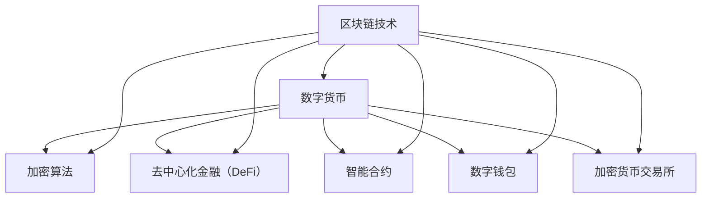

                 

# 数字货币创业：金融体系的变革之路

> 关键词：
- 区块链技术
- 数字货币
- 加密货币
- 金融体系
- 创业指南
- 商业模式
- 监管政策

## 1. 背景介绍

### 1.1 问题由来

随着科技的发展，区块链技术的兴起，数字货币作为一种新型的货币形式，开始进入人们的视野。数字货币不仅具有去中心化、匿名性、安全性等传统货币所不具备的特点，而且还在不断地改变和影响着金融体系的格局。

数字货币的崛起，使得传统的金融体系面临着前所未有的挑战和变革。同时，数字货币也带来了巨大的商业机会，吸引着越来越多的创业者尝试在这个领域中创业。

### 1.2 问题核心关键点

数字货币创业的关键点包括以下几个方面：

1. **区块链技术**：作为数字货币的底层技术，区块链技术的核心在于其去中心化、不可篡改的特性，这使得数字货币的安全性和稳定性得到了极大的提升。
2. **加密算法**：数字货币使用非对称加密算法，确保了交易的安全性和隐私保护。
3. **金融体系变革**：数字货币的引入，带来了去中心化金融（DeFi）、跨境支付、智能合约等新型金融应用，推动了金融体系的变革。
4. **监管政策**：由于数字货币的跨境特性和匿名性，全球各国对数字货币的监管政策存在较大的差异，这对数字货币的合法性和合规性提出了严峻的挑战。
5. **商业机会**：数字货币的应用场景广泛，包括支付、转账、投资、存储等，为创业者提供了广阔的商业机会。

### 1.3 问题研究意义

数字货币创业的兴起，对于金融体系的变革具有深远的意义：

1. **提升金融效率**：数字货币通过智能合约等技术，实现了自动化、无需中介的交易，大大提升了金融交易的效率。
2. **降低金融成本**：去中心化金融的应用，减少了传统金融中介环节的费用，降低了金融成本。
3. **促进金融普惠**：数字货币和区块链技术的应用，使得金融服务能够覆盖到更多的未被传统金融体系覆盖的人群。
4. **推动金融创新**：数字货币和区块链技术为金融创新提供了新的工具和方法，促进了金融科技的发展。
5. **加速数字化转型**：数字货币的普及，加速了传统金融体系的数字化转型，推动了数字经济的进程。

## 2. 核心概念与联系

### 2.1 核心概念概述

为了更好地理解数字货币创业，我们首先需要了解一些关键的核心概念：

1. **区块链技术**：一种去中心化的分布式账本技术，通过加密算法确保数据的安全性和不可篡改性。
2. **数字货币**：使用区块链技术实现的电子货币，具备去中心化、匿名性、安全性等特点。
3. **加密算法**：包括公钥加密、哈希算法等，用于确保数字货币交易的安全性和隐私保护。
4. **去中心化金融（DeFi）**：利用区块链技术实现的去中介化金融应用，包括借贷、交易所、保险等。
5. **智能合约**：一种自动化执行的合约，通过代码逻辑实现金融交易的自动化处理。
6. **数字钱包**：用于存储和管理数字货币的工具，通常具备交易、提现、转账等功能。
7. **加密货币交易所**：提供数字货币交易的平台，包括现货交易、期货交易等。

### 2.2 概念间的关系

这些核心概念之间存在着紧密的联系，构成了数字货币创业的基础。下面通过一个Mermaid流程图来展示这些概念之间的关系：



这个流程图展示了区块链技术与其他核心概念之间的联系。区块链技术作为底层基础设施，支撑了数字货币的安全交易和去中心化金融应用。智能合约提供了自动化交易的机制，数字钱包则用于存储和管理数字货币，而加密货币交易所则提供了数字货币的交易平台。

## 3. 核心算法原理 & 具体操作步骤
### 3.1 算法原理概述

数字货币创业的核心算法原理主要包括以下几个方面：

1. **加密算法**：数字货币的交易和存储依赖于加密算法，确保了交易的安全性和隐私保护。
2. **共识机制**：区块链技术通过共识机制，确保了网络中各节点的数据一致性，避免了双花问题。
3. **智能合约**：智能合约通过代码逻辑实现金融交易的自动化处理，提高了交易效率和安全性。
4. **去中心化金融（DeFi）**：利用区块链技术实现的去中介化金融应用，包括借贷、交易所、保险等。

### 3.2 算法步骤详解

数字货币创业的算法步骤包括以下几个关键环节：

1. **市场调研**：了解数字货币市场的现状和趋势，分析潜在的商业机会。
2. **技术选型**：选择合适的区块链平台和加密算法，确保项目的技术可行性和安全性。
3. **商业模式设计**：设计适合数字货币的商业模式，包括支付方式、交易手续费、激励机制等。
4. **系统开发**：开发数字货币应用系统，包括数字钱包、交易所、智能合约等。
5. **测试部署**：进行系统测试和优化，部署上线数字货币应用系统。
6. **市场推广**：通过各种渠道进行数字货币的宣传和推广，吸引用户使用。
7. **维护更新**：对数字货币应用系统进行维护和更新，确保系统的稳定性和安全性。

### 3.3 算法优缺点

数字货币创业的算法具有以下优点：

1. **去中心化**：区块链技术去中心化的特性，使得数字货币具备更高的安全性和匿名性。
2. **高效交易**：智能合约和去中心化金融应用，提高了交易的效率和透明度。
3. **广泛应用**：数字货币的应用场景广泛，涵盖了支付、转账、投资、存储等各个方面。

但同时也存在以下缺点：

1. **技术复杂**：数字货币创业需要具备区块链技术和加密算法的专业知识。
2. **监管风险**：由于数字货币的跨境特性和匿名性，各国对数字货币的监管政策存在较大的差异。
3. **市场波动**：数字货币市场存在较高的波动性，对创业项目的稳定性构成挑战。

### 3.4 算法应用领域

数字货币创业的算法应用领域广泛，涵盖了以下方面：

1. **支付系统**：使用数字货币作为支付方式，实现便捷、安全的支付体验。
2. **跨境支付**：利用区块链技术实现跨境支付，降低交易成本和时间。
3. **投资平台**：通过数字货币进行投资和交易，提供新的投资机会。
4. **供应链金融**：利用区块链技术实现供应链的数字化管理，提高供应链的透明度和效率。
5. **资产管理**：利用数字货币进行资产管理，提供更灵活的投资和理财方案。

## 4. 数学模型和公式 & 详细讲解 & 举例说明
### 4.1 数学模型构建

数字货币创业的数学模型构建主要基于区块链技术和加密算法的原理。

### 4.2 公式推导过程

以下是一个简单的数字货币交易模型，假设交易金额为 $T$，交易费用为 $F$，交易时间为 $t$，计算总交易费用 $C$ 的公式为：

$$
C = T \times \frac{F}{T} \times t
$$

其中 $F/T$ 表示交易费用占交易金额的比例，$t$ 表示交易时间。

### 4.3 案例分析与讲解

假设一个数字货币交易所的交易手续费为 $0.1\%$，每次交易的时间为 $1$ 秒，交易金额为 $100$ 美元，计算一次交易的总交易费用 $C$：

$$
C = 100 \times 0.1\% \times 1 = 0.1 \text{ 美元}
$$

这意味着每次交易需要支付 $0.1$ 美元的交易费用。

## 5. 项目实践：代码实例和详细解释说明
### 5.1 开发环境搭建

进行数字货币创业开发，需要搭建一个基于区块链技术的开发环境。以下是Python环境下搭建区块链开发环境的步骤：

1. 安装Python：从官网下载并安装Python。
2. 安装区块链开发框架：如Ethereum、Hyperledger等，使用pip安装。
3. 安装加密库：如Crypto、PyCrypto等，使用pip安装。
4. 安装测试网络：如Rinkeby，通过命令行安装。

### 5.2 源代码详细实现

以下是使用Python开发一个简单的数字货币钱包的代码实现：

```python
from cryptography.fernet import Fernet
from binascii import hexlify, unhexlify

def encrypt_message(message):
    key = Fernet.generate_key()
    cipher_suite = Fernet(key)
    cipher_text = cipher_suite.encrypt(message)
    return cipher_text, key

def decrypt_message(cipher_text, key):
    cipher_suite = Fernet(key)
    plain_text = cipher_suite.decrypt(cipher_text)
    return plain_text

# 测试加密解密
message = b"Hello, world!"
cipher_text, key = encrypt_message(message)
plain_text = decrypt_message(cipher_text, key)
print(plain_text.decode("utf-8"))
```

### 5.3 代码解读与分析

在上面的代码中，我们使用Python内置的cryptography库中的Fernet加密算法，实现了一个简单的加密解密功能。首先，我们使用`Fernet.generate_key()`生成一个密钥，然后使用`cipher_suite.encrypt()`方法加密输入的明文，最后使用`cipher_suite.decrypt()`方法解密密文，恢复明文。

## 6. 实际应用场景
### 6.1 智能合约
智能合约在数字货币创业中的应用非常广泛，以下是一些典型的应用场景：

1. **自动交易**：使用智能合约实现自动化的交易执行，例如使用以太坊的Ether (ETH) 实现自动交易。
2. **去中心化金融**：利用智能合约实现去中心化借贷、去中心化交易所等功能，例如Compound、MakerDAO等。
3. **版权保护**：通过智能合约实现版权保护和分发，例如使用Royalties智能合约实现版权管理。

### 6.2 加密货币交易所
数字货币交易所是数字货币创业的重要应用场景，以下是一些典型的应用场景：

1. **现货交易**：提供数字货币的现货交易，例如Binance、Coinbase等。
2. **期货交易**：提供数字货币的期货交易，例如Deribit、OKEx等。
3. **杠杆交易**：提供数字货币的杠杆交易，例如Bitmex、Huobi等。

### 6.3 去中心化金融（DeFi）
去中心化金融是数字货币创业的重要应用领域，以下是一些典型的应用场景：

1. **借贷平台**：利用智能合约实现借贷功能，例如Compound、Aave等。
2. **交易所**：利用智能合约实现去中心化交易所，例如Uniswap、SushiSwap等。
3. **保险**：利用智能合约实现去中心化保险，例如Aavegotchi、DYDX等。

### 6.4 未来应用展望
数字货币创业的未来应用展望非常广阔，以下是一些典型的应用场景：

1. **身份认证**：利用区块链技术实现身份认证，例如使用IOTA的MAM（Merkle Authentication Method）实现身份认证。
2. **供应链管理**：利用区块链技术实现供应链管理，例如使用Hyperledger Fabric实现供应链管理。
3. **物联网**：利用区块链技术实现物联网设备的管理和监控，例如使用ChainOps实现物联网设备管理。

## 7. 工具和资源推荐
### 7.1 学习资源推荐

为了帮助开发者掌握数字货币创业的核心技术，以下是一些优质的学习资源：

1. 《区块链技术揭秘》：深入浅出地介绍了区块链技术的原理和应用。
2. 《Python加密编程》：使用Python实现加密算法，适合初学者学习。
3. 《以太坊开发指南》：详细介绍以太坊开发环境搭建和智能合约开发。
4. 《智能合约编程指南》：介绍智能合约的开发流程和技术细节。
5. 《数字货币创业指南》：详细介绍数字货币创业的各个环节和最佳实践。

### 7.2 开发工具推荐

数字货币创业开发需要使用到一些专业的开发工具，以下是一些推荐：

1. IDE开发工具：如PyCharm、Visual Studio Code等，适合Python开发。
2. 区块链开发框架：如Ethereum、Hyperledger等，适合区块链开发。
3. 加密库：如Crypto、PyCrypto等，适合加密算法开发。
4. 测试网络：如Rinkeby、Ganache等，适合区块链测试。
5. 调试工具：如Jupyter Notebook、Postman等，适合系统测试和调试。

### 7.3 相关论文推荐

数字货币创业是一个快速发展的领域，以下是一些最新的相关论文：

1. "Decentralizing finance with smart contracts"：介绍使用智能合约实现去中心化金融应用的论文。
2. "Blockchain-based voting system"：介绍使用区块链技术实现投票系统的论文。
3. "Blockchain-based supply chain management"：介绍使用区块链技术实现供应链管理的论文。
4. "Blockchain-based identity authentication"：介绍使用区块链技术实现身份认证的论文。

## 8. 总结：未来发展趋势与挑战
### 8.1 总结

本文对数字货币创业进行了系统的介绍，涵盖了区块链技术、加密算法、智能合约等核心概念，并详细讲解了数字货币创业的算法原理和具体操作步骤。通过本文的系统梳理，可以看到数字货币创业具有广阔的发展前景和巨大的商业价值。

### 8.2 未来发展趋势

数字货币创业的未来发展趋势包括：

1. **去中心化金融（DeFi）**：去中心化金融将成为数字货币创业的重要方向，利用智能合约和区块链技术实现各种金融应用。
2. **区块链+物联网**：利用区块链技术实现物联网设备的管理和监控，实现物联网的智能化和安全性。
3. **区块链+供应链管理**：利用区块链技术实现供应链的数字化管理，提高供应链的透明度和效率。
4. **区块链+身份认证**：利用区块链技术实现身份认证，提供更安全、高效的身份管理方案。

### 8.3 面临的挑战

数字货币创业面临的挑战包括：

1. **技术复杂**：数字货币创业需要具备区块链技术和加密算法的专业知识。
2. **监管风险**：由于数字货币的跨境特性和匿名性，各国对数字货币的监管政策存在较大的差异。
3. **市场波动**：数字货币市场存在较高的波动性，对创业项目的稳定性构成挑战。
4. **生态系统不成熟**：数字货币生态系统还不够成熟，存在很多技术上的难题。
5. **用户接受度低**：数字货币技术还不够普及，用户对数字货币的接受度还比较低。

### 8.4 研究展望

未来的研究需要在以下几个方面进行：

1. **优化智能合约**：优化智能合约的性能和安全性，提高其应用范围和稳定性。
2. **开发新的共识机制**：开发新的共识机制，提高区块链系统的效率和安全性。
3. **加强监管合作**：各国加强监管合作，建立统一的监管标准和框架。
4. **推动技术普及**：加强数字货币技术的普及和推广，提高用户对数字货币的接受度。
5. **发展区块链+应用**：发展区块链与其他行业的结合应用，探索更多的创新场景。

这些研究方向的探索，将推动数字货币创业走向成熟，为金融体系的变革和数字化转型提供新的动力。

## 9. 附录：常见问题与解答
----------------------------------------------------------------

**Q1：数字货币创业是否适用于所有企业？**

A: 数字货币创业并非适用于所有企业，需要具备一定的技术基础和业务场景。对于一些需要高度安全性和隐私保护的企业，可以考虑使用数字货币进行业务拓展。

**Q2：数字货币创业需要多少资金？**

A: 数字货币创业的资金需求因项目规模和复杂度而异。一些轻量级的项目可能只需要几万元，而大型项目可能需要数百万元甚至上千万元的资金投入。

**Q3：数字货币创业的流程是什么？**

A: 数字货币创业的流程包括市场调研、技术选型、商业模式设计、系统开发、测试部署、市场推广、维护更新等环节。

**Q4：数字货币创业的风险有哪些？**

A: 数字货币创业的风险包括技术风险、市场风险、监管风险、资金风险等。需要对项目进行全面的风险评估和管理。

**Q5：数字货币创业的商业机会有哪些？**

A: 数字货币创业的商业机会包括支付系统、跨境支付、投资平台、供应链金融、资产管理、身份认证等。

通过本文的系统梳理，我们能够更好地理解数字货币创业的核心概念和操作步骤，把握数字货币创业的商业机会和面临的挑战。希望本文能为有志于进入数字货币创业领域的读者提供有益的参考和指导。

